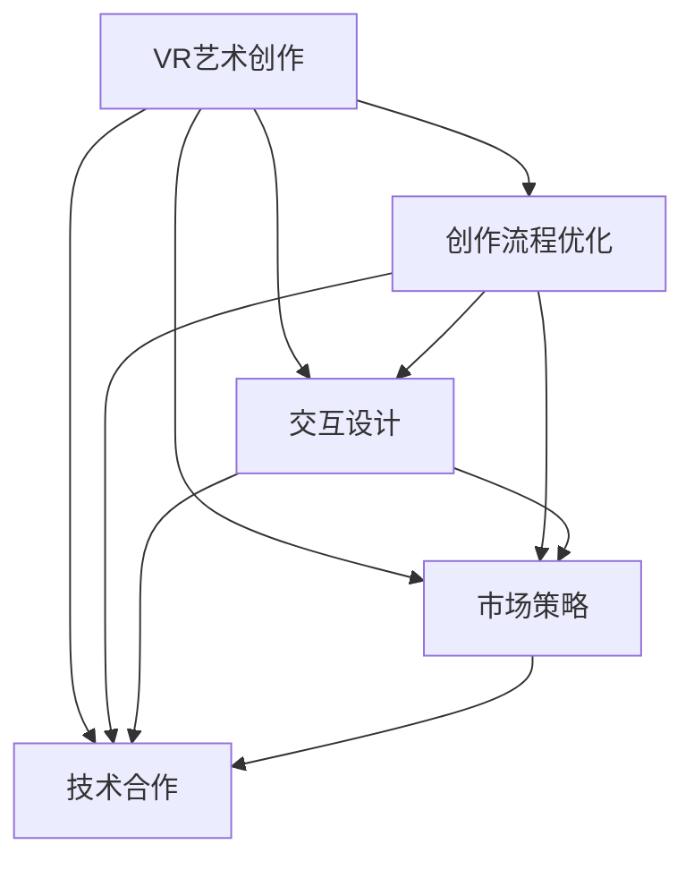

                 

# 虚拟现实艺术创作创业：数字艺术的新领域

## 1. 背景介绍

### 1.1 问题由来

随着虚拟现实技术的不断成熟和普及，虚拟现实（Virtual Reality, VR）正在逐渐从专业领域走向大众消费市场。作为一种沉浸式体验技术，VR可以模拟逼真的三维场景，提供高度沉浸感的视觉、听觉和触觉反馈，为艺术创作和表演提供了全新的可能性。在过去十年中，VR技术已经在游戏、影视、教育和军事等多个领域得到了广泛应用。

然而，VR艺术创作作为一个新兴领域，仍然存在一些问题和挑战。尽管VR技术已经允许艺术家在虚拟空间中创作和展示作品，但传统的艺术创作流程并未完全适应这种新形式。因此，本文旨在探讨VR艺术创作创业的可能性和发展路径，帮助艺术家和创业者理解如何在虚拟现实环境中进行艺术创作，并将艺术作品商业化。

### 1.2 问题核心关键点

VR艺术创作创业的核心在于如何利用VR技术为艺术创作提供新的平台和工具，同时如何有效地商业化这些作品。主要包括以下几个方面：

1. **创作流程优化**：如何在虚拟空间中进行创作和制作，以适应虚拟现实环境的特殊需求。
2. **交互设计**：如何设计交互元素，使得观众能够真正参与到艺术创作和表演中。
3. **市场策略**：如何在市场中找到并吸引潜在用户，以及如何定价和营销艺术作品。
4. **技术合作**：如何与VR硬件制造商和技术供应商合作，以获得更好的创作和展示效果。

这些关键点将贯穿本文的各个章节，帮助读者全面了解VR艺术创作创业的挑战和机遇。

## 2. 核心概念与联系

### 2.1 核心概念概述

为了更好地理解VR艺术创作创业的实践，本节将介绍几个核心概念：

- **虚拟现实（VR）**：通过头戴设备、手柄等设备，将用户带入到三维虚拟环境中，提供高度沉浸式的视觉、听觉和触觉反馈。
- **虚拟现实艺术创作**：使用VR技术为艺术家提供新的创作平台，实现传统艺术形式的扩展和新形式的艺术创作。
- **虚拟现实商业化**：通过技术、市场和品牌策略，将VR艺术作品转化为商业价值，实现盈利。
- **交互设计**：设计VR界面和交互元素，提升用户参与度和体验质量。
- **技术合作**：与硬件和软件供应商合作，提升创作和展示效果。

这些概念之间的关系可以通过以下Mermaid流程图来展示：



这个流程图展示了VR艺术创作创业涉及的关键环节：

1. 艺术创作依托于VR技术的支持，需要进行创作流程优化。
2. 交互设计直接影响用户体验和参与度。
3. 市场策略和定价营销是商业化的核心。
4. 技术合作是提升创作和展示效果的关键。

这些环节共同构成了一个完整的VR艺术创作创业流程。

## 3. 核心算法原理 & 具体操作步骤

### 3.1 算法原理概述

VR艺术创作创业涉及多个学科和技术的融合，包括计算机图形学、人工智能、交互设计和市场策略等。其核心算法原理包括：

1. **创作流程优化算法**：通过优化创作流程，提高创作效率和质量。
2. **交互设计算法**：设计交互元素，提升用户体验和参与度。
3. **市场策略算法**：分析市场数据，制定定价和营销策略。
4. **技术合作算法**：寻找合适的技术供应商和硬件合作伙伴，提升创作和展示效果。

### 3.2 算法步骤详解

VR艺术创作创业的具体操作步骤如下：

**Step 1: 创作流程优化**
- 选择合适的创作工具和软件，如Unity、Unreal Engine等。
- 设计虚拟空间和创作环境，考虑光照、纹理、物理模拟等因素。
- 利用AI辅助工具进行创意生成和自动化创作。

**Step 2: 交互设计**
- 设计虚拟界面的交互元素，如按钮、触摸屏、手柄等。
- 实现自然语言理解和手势识别，提升用户体验。
- 进行用户测试和迭代，优化交互设计。

**Step 3: 市场策略**
- 分析目标用户群体和市场需求，选择合适的市场定位。
- 制定定价策略，考虑成本、市场需求和用户价值。
- 设计营销策略，通过社交媒体、VR展会等渠道推广作品。

**Step 4: 技术合作**
- 与硬件制造商合作，获取高性能VR设备和优化展示效果。
- 与软件开发公司合作，提升创作工具的性能和功能。
- 与VR内容平台合作，扩大作品的曝光度和用户访问量。

### 3.3 算法优缺点

VR艺术创作创业具有以下优点：

1. **创新性**：利用VR技术进行艺术创作，可以突破传统艺术形式的限制，探索全新的创作方式。
2. **沉浸性**：为观众提供高度沉浸式的体验，增强艺术作品的表现力和感染力。
3. **可扩展性**：创作和展示平台具有高度的可扩展性，支持不同类型的艺术作品和创作方式。

同时，也存在一些缺点：

1. **高成本**：创作和展示VR艺术作品需要较高的技术和硬件投入，成本较高。
2. **技术复杂性**：创作流程复杂，需要多学科知识的综合运用。
3. **市场需求不确定**：市场需求和用户接受度存在不确定性，难以快速回收成本。

### 3.4 算法应用领域

VR艺术创作创业涉及的领域广泛，包括但不限于：

1. **艺术展览和博物馆**：利用VR技术为观众提供虚拟参观和互动体验。
2. **影视制作**：在电影和电视剧中引入VR元素，增强故事和场景的表现力。
3. **游戏开发**：创作沉浸式的虚拟现实游戏，提供全新的游戏体验。
4. **教育和培训**：开发虚拟现实教育应用，提供交互式学习体验。
5. **广告和营销**：创作虚拟现实广告和营销内容，提升品牌影响力和用户体验。

## 4. 数学模型和公式 & 详细讲解 & 举例说明

### 4.1 数学模型构建

为了更好地理解VR艺术创作创业的数学模型，本节将构建一个简单的数学框架。

假设创作平台支持N种交互方式，每种方式的概率为$p_i$，其中$i=1,2,...,N$。设用户对每种交互方式的满意度为$S_i$，满意度越高，越容易吸引用户参与。用户对艺术作品的满意度为$S_w$，满意度越高，越容易吸引用户付费。

创作平台的总满意度$S$为：

$$
S = \sum_{i=1}^N p_i S_i + S_w
$$

用户对创作平台的总满意度越高，越容易吸引用户参与和付费。

### 4.2 公式推导过程

在推导公式的过程中，我们将采用一些简化的假设，以便于理解模型的核心逻辑。

假设创作平台有M个用户，每个用户选择一种交互方式的概率为$p_i$，选择艺术作品的概率为$p_w$。用户对每种交互方式的满意度为$S_i$，对艺术作品的满意度为$S_w$。

创作平台的总满意度$S$为：

$$
S = \sum_{i=1}^N p_i S_i + p_w S_w
$$

其中，$p_i$和$p_w$满足概率公式：

$$
p_i = \frac{1}{N}, \quad i=1,2,...,N
$$

$$
p_w = 1 - \sum_{i=1}^N p_i = \frac{N-1}{N}
$$

### 4.3 案例分析与讲解

假设创作平台支持两种交互方式：触屏和手柄。用户对触屏的满意度为$S_{screen}=0.9$，对手柄的满意度为$S_{hand}=0.95$。用户对艺术作品的满意度为$S_w=0.8$。

设用户选择触屏的概率为$p_{screen}=0.5$，选择手柄的概率为$p_{hand}=0.5$。根据上述公式，创作平台的总满意度$S$为：

$$
S = 0.5 \times 0.9 + 0.5 \times 0.95 + 0.5 \times 0.8 = 0.8575
$$

这表明，在用户选择触屏和手柄的概率相等的情况下，创作平台的总满意度为0.8575，高于用户对手柄的满意度（0.95），但略低于用户对艺术作品的满意度（0.8）。这意味着，如果创作平台能够提升用户对手柄的满意度，或者降低用户对艺术作品的满意度，总满意度将会更高。

## 5. 项目实践：代码实例和详细解释说明

### 5.1 开发环境搭建

在进行VR艺术创作创业实践前，我们需要准备好开发环境。以下是使用Unity进行VR开发的环境配置流程：

1. 安装Unity：从官网下载并安装Unity，用于开发虚拟现实应用。
2. 安装VR插件：安装Unity VR插件，支持Unity创建和运行VR应用。
3. 创建项目：在Unity Hub中创建新的VR项目，选择合适的3D建模工具。
4. 配置VR设备：连接VR头显和手柄，配置Unity中的VR设置。

完成上述步骤后，即可在Unity环境中开始VR艺术创作创业的实践。

### 5.2 源代码详细实现

下面以一个简单的VR艺术创作项目为例，给出使用Unity进行创作的源代码实现。

首先，定义虚拟空间和交互元素：

```csharp
using UnityEngine;
using UnityEngine.XR.Interaction.Toolkit;

public class VRCreation : MonoBehaviour
{
    public GameObject[] interactionElements;
    public GameObject artPiece;
    private ARRaycaster raycaster;

    void Start()
    {
        raycaster = new ARRaycaster();
        raycaster.raycastTarget = this;
        raycaster.raycastCount = interactionElements.Length;
        raycaster.OnRaycastHit = OnRaycastHit;
    }

    void Update()
    {
        if (interactionElements.Length > 0)
        {
            raycaster.Update();
        }
    }

    void OnRaycastHit(HitResult hit)
    {
        if (hit.collider == null)
        {
            return;
        }

        int index = Array.IndexOf(interactionElements, hit.collider.gameObject);
        if (index >= 0)
        {
            interactionElements[index].SetActive(false);
            artPiece.SetActive(true);
        }
    }
}
```

然后，设计虚拟空间的布局和交互元素：

```csharp
using UnityEngine;
using UnityEngine.XR.Interaction.Toolkit;

public class VRCreation : MonoBehaviour
{
    public GameObject[] interactionElements;
    public GameObject artPiece;
    private ARRaycaster raycaster;

    void Start()
    {
        raycaster = new ARRaycaster();
        raycaster.raycastTarget = this;
        raycaster.raycastCount = interactionElements.Length;
        raycaster.OnRaycastHit = OnRaycastHit;
    }

    void Update()
    {
        if (interactionElements.Length > 0)
        {
            raycaster.Update();
        }
    }

    void OnRaycastHit(HitResult hit)
    {
        if (hit.collider == null)
        {
            return;
        }

        int index = Array.IndexOf(interactionElements, hit.collider.gameObject);
        if (index >= 0)
        {
            interactionElements[index].SetActive(false);
            artPiece.SetActive(true);
        }
    }
}
```

最后，将艺术作品和交互元素集成到虚拟空间中：

```csharp
using UnityEngine;
using UnityEngine.XR.Interaction.Toolkit;

public class VRCreation : MonoBehaviour
{
    public GameObject[] interactionElements;
    public GameObject artPiece;
    private ARRaycaster raycaster;

    void Start()
    {
        raycaster = new ARRaycaster();
        raycaster.raycastTarget = this;
        raycaster.raycastCount = interactionElements.Length;
        raycaster.OnRaycastHit = OnRaycastHit;
    }

    void Update()
    {
        if (interactionElements.Length > 0)
        {
            raycaster.Update();
        }
    }

    void OnRaycastHit(HitResult hit)
    {
        if (hit.collider == null)
        {
            return;
        }

        int index = Array.IndexOf(interactionElements, hit.collider.gameObject);
        if (index >= 0)
        {
            interactionElements[index].SetActive(false);
            artPiece.SetActive(true);
        }
    }
}
```

### 5.3 代码解读与分析

让我们再详细解读一下关键代码的实现细节：

**VRCreation类**：
- `Start`方法：初始化ARRaycaster和交互元素。
- `Update`方法：持续更新射线投射器。
- `OnRaycastHit`方法：处理射线投射结果，切换交互元素和艺术作品。

**交互元素**：
- 通过Unity的XR工具包，添加触屏和手柄等交互元素。
- 设置交互元素的可点击属性，使其能够接收用户的操作。

**艺术作品**：
- 将艺术作品作为虚拟空间的一部分，通过代码实现其交互效果。
- 当用户点击交互元素时，展示艺术作品，并将交互元素隐藏。

**射线投射器**：
- 使用ARRaycaster实现射线的投射和检测。
- 根据用户点击的位置，判断是否为交互元素，并切换艺术作品和交互元素的显示状态。

这些代码展示了如何使用Unity进行VR艺术创作的基本流程。通过Unity，开发者可以创建、测试和部署VR应用，实现沉浸式艺术创作和展示。

## 6. 实际应用场景

### 6.1 艺术展览和博物馆

VR艺术创作在艺术展览和博物馆中具有广阔的应用前景。传统展览往往受到时间、空间和资源的限制，难以全面展示艺术作品。而通过VR技术，艺术家和博物馆可以创建虚拟空间，向观众展示无法在现实中展出的艺术作品。观众可以通过VR头显和手柄，自由地漫游虚拟空间，近距离观赏艺术作品，甚至与作品互动。

例如，一位艺术家可以创作一个虚拟的立体主义画廊，将毕加索、达利等大师的作品数字化，并通过VR技术进行展示。观众可以在虚拟空间中自由移动，近距离观察每一幅作品，甚至通过手势操作进入画作内部的场景，体验作品的细节和情感。

### 6.2 影视制作

VR艺术创作在影视制作中也具有重要应用。传统的电影和电视剧往往受限于时间和预算，难以呈现复杂的场景和特效。通过VR技术，影视制作团队可以创作逼真的虚拟场景，为观众提供高度沉浸式的观看体验。

例如，一部科幻电影可以创作一个虚拟的太空站，通过VR技术展示其内部的环境和工作场景。观众可以通过VR头显，自由探索太空站的不同区域，甚至与虚拟角色互动。这种沉浸式的观看体验，将极大地提升电影的观赏性和吸引力。

### 6.3 游戏开发

VR艺术创作在游戏开发中同样具有巨大潜力。游戏市场对于高质量的VR游戏需求日益增加，游戏开发者可以利用VR技术创作高度沉浸的游戏环境。

例如，一款VR射击游戏可以让玩家身临其境地体验战斗场景。玩家可以通过手柄和头显，与虚拟角色和环境互动，体验高度逼真的射击体验。这种沉浸式的游戏体验，将为玩家提供全新的游戏感受，增强游戏的吸引力。

### 6.4 未来应用展望

随着VR技术的不断进步和普及，VR艺术创作将逐渐走向成熟，并应用于更多领域。未来，VR艺术创作将可能包括以下几个方向：

1. **实时交互**：通过实时渲染和交互技术，提升VR艺术的沉浸感和互动性。
2. **多感官融合**：结合视觉、听觉、触觉等多种感官，提供更丰富、逼真的VR艺术体验。
3. **跨平台支持**：支持多种平台和设备，包括PC、移动设备、VR头显等，让更多人能够体验VR艺术。
4. **云VR平台**：通过云平台和边缘计算技术，实现大规模的VR艺术创作和展示。
5. **社会参与**：鼓励社会大众参与创作，形成更加开放、多元的VR艺术社区。

这些趋势将进一步推动VR艺术创作的发展，提升其应用价值和用户接受度。

## 7. 工具和资源推荐

### 7.1 学习资源推荐

为了帮助开发者系统掌握VR艺术创作创业的理论基础和实践技巧，这里推荐一些优质的学习资源：

1. **Unity官方文档**：Unity官方文档提供了丰富的教程和示例，帮助开发者了解Unity的VR功能和开发工具。
2. **Unreal Engine官方文档**：Unreal Engine官方文档提供了详细的教程和示例，帮助开发者了解Unreal Engine的VR功能和开发工具。
3. **《Virtual Reality Development with Unity》一书**：该书系统介绍了如何使用Unity进行VR开发，包括VR艺术创作和展示。
4. **VR开发社区**：如Unity论坛、VR开发者社区等，提供交流学习和分享经验的平台。
5. **VR艺术作品集**：如VR Art Gallery等，展示和分享VR艺术创作作品，提供灵感和参考。

通过对这些资源的学习实践，相信你一定能够快速掌握VR艺术创作创业的精髓，并用于解决实际的VR艺术问题。

### 7.2 开发工具推荐

高效的开发离不开优秀的工具支持。以下是几款用于VR艺术创作创业开发的常用工具：

1. **Unity**：基于C#的开源游戏引擎，支持VR开发和渲染，是当前最流行的VR开发工具之一。
2. **Unreal Engine**：由Epic Games开发的强大的游戏引擎，支持多种平台和设备，支持VR开发和渲染。
3. **VR/headset支持**：如Oculus Rift、HTC Vive等，提供高质量的VR头显和手柄设备。
4. **VR开发工具包**：如Unity VR Toolkit、Unreal Engine VR Toolkit等，提供VR开发所需的工具和插件。
5. **VR编辑器**：如Unity Hub、Unreal Engine Hub等，用于管理和发展VR项目。

合理利用这些工具，可以显著提升VR艺术创作创业的开发效率，加快创新迭代的步伐。

### 7.3 相关论文推荐

VR艺术创作创业涉及多个学科和技术的融合，以下是几篇奠基性的相关论文，推荐阅读：

1. **《Real-Time Interactive VR Art Installation》**：介绍了一种基于Unity和Kinect的实时交互式VR艺术装置，展示了VR艺术创作和展示的潜力。
2. **《Virtual Reality Art: A Survey》**：综述了当前VR艺术创作的研究和应用，讨论了VR艺术的发展方向和未来展望。
3. **《VR Art Creation and Exhibition: A Practical Guide》**：介绍了一种使用Unity和VR技术的艺术创作流程，提供了实际案例和开发建议。
4. **《Virtual Reality Art Education》**：探讨了VR艺术在教育和培训中的应用，强调了虚拟环境对于艺术创作和学习的优势。

这些论文代表了大语言模型微调技术的发展脉络。通过学习这些前沿成果，可以帮助研究者把握学科前进方向，激发更多的创新灵感。

## 8. 总结：未来发展趋势与挑战

### 8.1 研究成果总结

本文对VR艺术创作创业进行了全面系统的介绍。首先，阐述了VR艺术创作创业的可能性和发展路径，明确了艺术创作在虚拟现实环境中的创新性和应用前景。其次，从原理到实践，详细讲解了创作流程优化、交互设计、市场策略和技术合作等核心环节，提供了代码实现和详细解释。同时，本文还探讨了VR艺术创作在艺术展览、影视制作、游戏开发等多个领域的应用场景，展示了VR艺术创作创业的广阔前景。最后，推荐了相关的学习资源、开发工具和研究论文，帮助读者全面掌握VR艺术创作创业的理论和实践技巧。

通过本文的系统梳理，可以看到，VR艺术创作创业正在成为艺术和科技结合的新趋势，为艺术创作提供了新的平台和工具，带来了新的机遇和挑战。

### 8.2 未来发展趋势

展望未来，VR艺术创作创业将呈现以下几个发展趋势：

1. **技术创新**：VR技术将不断进步，提供更高的沉浸感、更自然的交互体验和更逼真的视觉效果。
2. **多感官融合**：结合视觉、听觉、触觉等多种感官，提供更丰富、逼真的VR艺术体验。
3. **跨平台支持**：支持多种平台和设备，让更多人能够体验VR艺术。
4. **云VR平台**：通过云平台和边缘计算技术，实现大规模的VR艺术创作和展示。
5. **社会参与**：鼓励社会大众参与创作，形成更加开放、多元的VR艺术社区。

这些趋势将进一步推动VR艺术创作的发展，提升其应用价值和用户接受度。

### 8.3 面临的挑战

尽管VR艺术创作创业具有广阔的发展前景，但在迈向更加智能化、普适化应用的过程中，仍面临诸多挑战：

1. **技术瓶颈**：创作和展示VR艺术作品需要较高的技术和硬件投入，成本较高。
2. **市场不确定性**：市场需求和用户接受度存在不确定性，难以快速回收成本。
3. **内容创作**：高质量的VR内容创作需要投入大量时间和精力，成本较高。
4. **用户体验**：如何设计交互元素，提升用户体验和参与度，仍需不断探索和优化。
5. **技术合作**：与硬件和软件供应商合作，提升创作和展示效果，仍需积极寻找和谈判。

### 8.4 研究展望

面对VR艺术创作创业所面临的种种挑战，未来的研究需要在以下几个方面寻求新的突破：

1. **创作流程优化**：开发更加高效、智能的创作工具，提高创作效率和质量。
2. **交互设计优化**：设计更加自然、直观的交互元素，提升用户体验和参与度。
3. **市场策略创新**：分析市场需求和用户行为，制定更加精准、有效的营销策略。
4. **技术合作深化**：与硬件和软件供应商深入合作，提升创作和展示效果。
5. **内容创作多样化**：鼓励多样化的内容创作方式，推动VR艺术的多元发展。

这些研究方向将引领VR艺术创作创业技术迈向更高的台阶，为构建更加沉浸、交互、开放的艺术体验铺平道路。面向未来，VR艺术创作创业技术还需要与其他技术进行更深入的融合，如人工智能、大数据、云计算等，多路径协同发力，共同推动自然语言理解和智能交互系统的进步。只有勇于创新、敢于突破，才能不断拓展VR艺术创作的边界，让艺术作品更好地造福人类社会。

## 9. 附录：常见问题与解答

**Q1：如何选择合适的VR创作工具？**

A: 选择VR创作工具时，需要考虑以下几个因素：

1. **技术成熟度**：选择技术成熟、社区活跃的工具，便于开发和调试。
2. **功能支持**：选择功能丰富、易用的工具，支持多平台和设备。
3. **开发成本**：考虑开发成本和人力投入，选择适合自己的工具。

常见的VR创作工具包括Unity、Unreal Engine、Cinema 4D等，开发者需要根据具体需求和实际情况进行选择。

**Q2：如何设计交互元素？**

A: 设计交互元素时，需要考虑以下几个因素：

1. **用户体验**：设计简洁、直观的交互元素，便于用户理解和操作。
2. **自然交互**：结合手势、语音等多种交互方式，提升自然交互体验。
3. **功能实现**：设计能够实现预期功能的交互元素，提升用户体验。

常用的交互设计工具包括Unity的XR Toolkit、Unreal Engine的VR Toolkit等，开发者可以根据具体需求选择相应的工具。

**Q3：如何选择VR硬件设备？**

A: 选择VR硬件设备时，需要考虑以下几个因素：

1. **性能指标**：选择性能高、分辨率高的设备，提供更好的视觉体验。
2. **舒适性**：选择舒适、佩戴稳定的设备，减少用户体验障碍。
3. **兼容性**：选择支持多种平台和设备的设备，便于跨平台使用。

常见的VR硬件设备包括Oculus Rift、HTC Vive、索尼PSVR等，开发者需要根据具体需求和实际情况进行选择。

**Q4：如何选择VR展示平台？**

A: 选择VR展示平台时，需要考虑以下几个因素：

1. **用户覆盖**：选择用户覆盖广泛、流量较大的平台，便于推广作品。
2. **展示效果**：选择展示效果好、功能丰富的平台，提供更好的展示体验。
3. **技术支持**：选择技术支持完善、服务周到的平台，便于维护和优化。

常见的VR展示平台包括VR Art Gallery、VR Art Exchange等，开发者需要根据具体需求和实际情况进行选择。

**Q5：如何选择VR市场策略？**

A: 选择VR市场策略时，需要考虑以下几个因素：

1. **市场调研**：分析目标用户群体和市场需求，制定精准的市场定位。
2. **定价策略**：考虑成本、市场需求和用户价值，制定合理的定价策略。
3. **营销策略**：通过社交媒体、VR展会等渠道推广作品，吸引用户关注和付费。

常见的市场策略包括免费试用、订阅模式、单次购买等，开发者需要根据具体需求和实际情况进行选择。

---

作者：禅与计算机程序设计艺术 / Zen and the Art of Computer Programming

