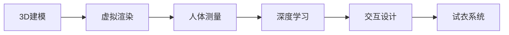

                 

# 虚拟试衣创业：在线购物体验的革新

## 1. 背景介绍

### 1.1 问题由来
在现代消费主义浪潮的推动下，在线购物已成为人们生活中不可或缺的一部分。然而，线上购物的一个显著痛点在于缺乏实物试穿体验，导致退货率高、用户体验不佳。特别是对于服饰类产品，试穿效果的虚拟化一直困扰着消费者和商家。传统的虚拟试衣技术要么体验较差，要么操作复杂，难以推广。

为了解决这一问题，虚拟试衣创业应运而生。通过构建高逼真度、交互性强的虚拟试衣系统，用户可以在家中轻松试穿，提升购物体验和满意度。该创业项目旨在通过技术创新，重新定义在线购物的体验标准，开辟服装行业新的增长点。

### 1.2 问题核心关键点
本项目聚焦于虚拟试衣系统的核心技术，包括但不限于以下几个关键点：

- **高逼真度3D试衣模型**：使用先进的3D建模技术和虚拟渲染，生成与真实衣物高度相似的虚拟试衣模型。
- **精准人体测量技术**：通过智能摄像头和算法实现人体尺寸的精准测量，保证试穿效果逼真。
- **实时交互与反馈**：提供自然的语音和手势交互，实时反馈试穿效果和搭配建议，提升用户沉浸感。
- **个性化试衣体验**：通过用户偏好分析和推荐系统，提供个性化的试衣建议和搭配方案。
- **快速便捷的试衣流程**：优化试衣过程，缩短用户等待时间，提升用户体验。

### 1.3 问题研究意义
虚拟试衣系统的成功开发，将极大地提升在线购物的用户体验和满意度。其研究意义在于：

- **降低退货率**：通过虚拟试衣，用户可以更准确地选择适合自己的产品，减少因实物不符导致的退货。
- **提升用户粘性**：优质的虚拟试衣体验将增加用户停留时间，提升平台的整体流量和销售转化率。
- **推动产业发展**：虚拟试衣技术的成熟将带动整个服装电商行业的发展，促进行业升级。
- **拓宽应用场景**：除了服饰，虚拟试衣技术还可以扩展到鞋帽、配饰等领域，具有广阔的市场前景。
- **促进科技与艺术融合**：虚拟试衣系统融合了先进的计算机视觉、3D建模、虚拟渲染等技术，推动了科技与艺术在商业应用中的融合。

## 2. 核心概念与联系

### 2.1 核心概念概述

为更好地理解虚拟试衣系统的核心技术和工作原理，本节将介绍几个关键概念：

- **3D建模技术**：通过点云扫描、光场摄影等手段，获取人体和衣物的高精度三维模型，用于后续的虚拟试衣和渲染。
- **虚拟渲染**：使用渲染引擎（如Unreal Engine）对3D模型进行光照、阴影、反射等效果处理，生成逼真的虚拟试衣效果。
- **人体测量技术**：通过摄像头和算法，实时获取用户的三维人体尺寸数据，作为试衣的基础。
- **深度学习**：用于图像识别、人体姿态估计、推荐系统等环节，提升系统的智能化水平。
- **交互设计**：通过自然语言处理、手势识别等技术，实现用户与系统的流畅交互，提升用户体验。

这些核心概念之间的逻辑关系可以通过以下Mermaid流程图来展示：



这个流程图展示了大语言模型微调技术的核心概念及其之间的关系：

1. 3D建模和虚拟渲染技术提供了逼真的虚拟试衣环境。
2. 人体测量技术为虚拟试衣提供了用户的尺寸信息。
3. 深度学习技术在图像识别、姿态估计、推荐系统等方面提供支持，提升系统智能化。
4. 交互设计技术保障了用户的自然交互体验。
5. 试衣系统将这些技术整合在一起，实现了虚拟试衣的功能。

这些概念共同构成了虚拟试衣系统的技术框架，使其能够提供高度逼真和个性化的虚拟试衣体验。

## 3. 核心算法原理 & 具体操作步骤
### 3.1 算法原理概述

虚拟试衣系统的核心算法包括3D建模、虚拟渲染、人体测量、深度学习和交互设计。以下将详细介绍这些核心算法的工作原理。

### 3.2 算法步骤详解

#### 3.2.1 3D建模和虚拟渲染

**步骤1：数据采集与预处理**
- 使用点云扫描或光场摄影技术，获取人体和衣物的三维数据。
- 对采集数据进行去噪、修复、拼接等预处理，确保模型质量。

**步骤2：3D建模**
- 使用软件（如Autodesk Maya、Blender）或算法（如Polyfit）对预处理后的数据进行建模。
- 生成人体和衣物的高精度3D模型，并进行优化和细节处理。

**步骤3：虚拟渲染**
- 选择渲染引擎（如Unreal Engine、Unity）进行场景搭建。
- 添加光源、纹理、材质等，进行渲染优化，生成逼真的虚拟试衣场景。

#### 3.2.2 人体测量

**步骤1：数据采集**
- 使用智能摄像头（如RGB-D相机）获取用户的三维人体图像。
- 使用摄像头和算法（如深度学习、光流算法）进行人体检测和分割。

**步骤2：尺寸测量**
- 从人体图像中提取关键节点（如肩点、腰点、臀点等）。
- 使用算法（如最小二乘法、优化算法）对节点进行精确测量。

**步骤3：数据转换**
- 将测量数据转换为模型参数，并存储在服务器中。
- 使用算法（如插值算法、模型匹配算法）对新用户的测量数据进行适配。

#### 3.2.3 深度学习

**步骤1：数据集准备**
- 准备标注好的人体图像数据集，用于训练人体检测和姿态估计模型。
- 使用数据增强技术扩充数据集，避免过拟合。

**步骤2：模型训练**
- 使用深度学习框架（如TensorFlow、PyTorch）构建人体检测和姿态估计模型。
- 使用损失函数（如交叉熵、IOU损失）和优化器（如Adam、SGD）进行模型训练。

**步骤3：模型应用**
- 使用训练好的模型对用户图像进行实时检测和姿态估计。
- 根据检测结果调整虚拟试衣模型，生成逼真的试衣效果。

#### 3.2.4 交互设计

**步骤1：语音和手势识别**
- 使用语音识别引擎（如Google Speech-to-Text、Amazon Transcribe）对用户的语音指令进行识别。
- 使用手势识别算法（如OpenPose、MediaPipe）对用户的手势动作进行识别。

**步骤2：自然语言处理**
- 使用自然语言处理技术（如BERT、GPT）对用户的语言指令进行理解和解析。
- 生成相应的试衣指令，控制虚拟试衣模型的变换。

**步骤3：界面设计**
- 设计友好的用户界面，展示试衣效果和推荐结果。
- 优化交互流程，减少用户操作难度，提升体验感。

#### 3.2.5 试衣系统整合

**步骤1：系统架构设计**
- 设计系统的整体架构，明确各模块的职责和接口。
- 选择合适的技术栈和框架，进行系统搭建。

**步骤2：模块集成**
- 将3D建模、虚拟渲染、人体测量、深度学习和交互设计等模块进行整合。
- 实现各模块之间的数据交换和协同工作。

**步骤3：系统测试和优化**
- 进行系统测试，发现和修复潜在的bug和性能问题。
- 优化系统性能，提升试衣体验和响应速度。

### 3.3 算法优缺点

虚拟试衣系统的算法优势包括：

- **高逼真度**：通过3D建模和虚拟渲染技术，生成与实物高度相似的虚拟试衣效果。
- **实时性**：使用深度学习算法进行实时检测和姿态估计，保障用户交互的流畅性。
- **个性化**：通过深度学习和推荐系统，提供个性化的试衣建议和搭配方案。
- **普适性**：通过适配不同用户的尺寸数据，实现对不同用户的试穿适配。

但其缺点也较为明显：

- **高成本**：3D建模和虚拟渲染需要较高的硬件和软件投入，成本较高。
- **算法复杂**：深度学习模型训练复杂，需要大量数据和计算资源。
- **用户接受度**：部分用户可能对虚拟试衣效果接受度不高，仍更倾向于实物试穿。
- **技术门槛**：系统开发和维护需要较高的技术水平和经验积累。

### 3.4 算法应用领域

虚拟试衣系统具有广阔的应用前景，主要集中在以下几个领域：

- **在线购物平台**：与电商合作，为用户提供虚拟试衣服务，提升用户体验和销售转化率。
- **服装品牌官网**：在品牌官网集成虚拟试衣功能，增强用户粘性，促进产品销售。
- **个人购物助手**：开发独立应用的虚拟试衣功能，为用户提供便捷的购物助手服务。
- **虚拟试衣房**：在商场或品牌店内搭建虚拟试衣室，提升线下购物体验。
- **品牌体验店**：结合线上和线下试衣，提供全面、便捷的购物体验。

## 4. 数学模型和公式 & 详细讲解
### 4.1 数学模型构建

虚拟试衣系统的数学模型主要涉及以下几个方面：

- **3D几何建模**：使用向量表示人体和衣物的几何形状，进行三维变换和渲染。
- **人体测量算法**：通过摄像头和算法，实时测量人体关键节点位置，转换为模型参数。
- **深度学习模型**：使用神经网络对图像进行分类、检测、姿态估计等任务。
- **自然语言处理模型**：使用语言模型对用户指令进行理解和生成。

#### 4.1.1 3D几何建模

使用向量表示人体和衣物的几何形状，并进行三维变换。假设人体和衣物的几何形状由$n$个顶点构成，表示为$\mathbf{V} = [\mathbf{v}_1, \mathbf{v}_2, \ldots, \mathbf{v}_n]$。

**顶点坐标**：顶点$\mathbf{v}_i = (x_i, y_i, z_i)$。

**三维变换**：
- **平移**：$\mathbf{v}_i \leftarrow \mathbf{v}_i + \mathbf{t}$，其中$\mathbf{t}$为平移向量。
- **旋转**：$\mathbf{v}_i \leftarrow \mathbf{R}_i \cdot \mathbf{v}_i$，其中$\mathbf{R}_i$为旋转矩阵。
- **缩放**：$\mathbf{v}_i \leftarrow \mathbf{s} \cdot \mathbf{v}_i$，其中$\mathbf{s}$为缩放因子。

**三维渲染**：使用渲染引擎对几何模型进行光照、阴影、反射等效果处理，生成逼真的虚拟试衣效果。

#### 4.1.2 人体测量算法

使用摄像头和算法，实时测量人体关键节点位置，转换为模型参数。假设摄像头采集到的人体图像为$\mathbf{I} \in \mathbb{R}^{H \times W \times C}$，其中$H$为高度，$W$为宽度，$C$为通道数。

**人体检测**：
- **区域提取**：使用滑动窗口或区域提取算法，检测人体区域$\mathbf{R} \in \mathbb{R}^{H_R \times W_R}$。
- **姿态估计**：使用深度学习模型（如PoseNet），对检测到的人体区域进行姿态估计，得到关节位置$\mathbf{P} = [\mathbf{p}_1, \mathbf{p}_2, \ldots, \mathbf{p}_n]$。

**人体尺寸测量**：
- **节点测量**：对关节位置进行精确定位，测量出关键节点（如肩点、腰点、臀点等）的坐标。
- **尺寸转换**：使用插值算法或模型匹配算法，将测量节点转换为虚拟试衣模型的参数。

#### 4.1.3 深度学习模型

使用神经网络对图像进行分类、检测、姿态估计等任务。假设深度学习模型的输入为图像$\mathbf{I}$，输出为标签$\mathbf{L}$。

**分类任务**：
- **模型选择**：选择适合分类任务的神经网络模型，如卷积神经网络（CNN）。
- **损失函数**：选择适合分类任务的损失函数，如交叉熵损失函数$\mathcal{L}_{cls} = -\frac{1}{N} \sum_{i=1}^N \log p(y_i|\mathbf{I})$，其中$p(y_i|\mathbf{I})$为模型对图像$\mathbf{I}$的分类概率。
- **优化器**：选择适合分类任务的优化器，如Adam、SGD。

**检测任务**：
- **模型选择**：选择适合检测任务的神经网络模型，如YOLO、Faster R-CNN。
- **损失函数**：选择适合检测任务的损失函数，如IoU损失函数$\mathcal{L}_{det} = -\frac{1}{N} \sum_{i=1}^N (\text{IoU}_i - \text{IoU}^*)$，其中$\text{IoU}_i$为预测框与真实框的交并比，$\text{IoU}^*$为阈值。
- **优化器**：选择适合检测任务的优化器，如Adam、SGD。

**姿态估计任务**：
- **模型选择**：选择适合姿态估计任务的神经网络模型，如OpenPose、MediaPipe。
- **损失函数**：选择适合姿态估计任务的损失函数，如回归损失函数$\mathcal{L}_{pose} = \frac{1}{N} \sum_{i=1}^N (\mathbf{p}_i - \mathbf{p}_i^{*})^2$，其中$\mathbf{p}_i^{*}$为关节位置的真实值。
- **优化器**：选择适合姿态估计任务的优化器，如Adam、SGD。

#### 4.1.4 自然语言处理模型

使用语言模型对用户指令进行理解和生成。假设自然语言处理模型的输入为指令文本$\mathbf{T}$，输出为行为指令$\mathbf{A}$。

**指令理解**：
- **模型选择**：选择适合指令理解的神经网络模型，如BERT、GPT。
- **损失函数**：选择适合指令理解的损失函数，如交叉熵损失函数$\mathcal{L}_{under} = -\frac{1}{N} \sum_{i=1}^N \log p(\mathbf{A}|\mathbf{T})$，其中$p(\mathbf{A}|\mathbf{T})$为模型对指令文本$\mathbf{T}$的行为预测概率。
- **优化器**：选择适合指令理解的优化器，如Adam、SGD。

**指令生成**：
- **模型选择**：选择适合指令生成的神经网络模型，如Seq2Seq、Transformer。
- **损失函数**：选择适合指令生成的损失函数，如交叉熵损失函数$\mathcal{L}_{gen} = -\frac{1}{N} \sum_{i=1}^N \log p(\mathbf{A}_i|\mathbf{T}_i)$，其中$p(\mathbf{A}_i|\mathbf{T}_i)$为模型对指令文本$\mathbf{T}_i$的行为生成概率。
- **优化器**：选择适合指令生成的优化器，如Adam、SGD。

### 4.2 公式推导过程

#### 4.2.1 3D几何变换

假设人体和衣物几何模型的初始顶点坐标为$\mathbf{V} = [\mathbf{v}_1, \mathbf{v}_2, \ldots, \mathbf{v}_n]$。进行平移、旋转和缩放变换后，新的顶点坐标为$\mathbf{V}' = [\mathbf{v}_1', \mathbf{v}_2', \ldots, \mathbf{v}_n']$。

**平移变换**：
- $\mathbf{v}_i' = \mathbf{v}_i + \mathbf{t}$，其中$\mathbf{t} = (t_x, t_y, t_z)$。

**旋转变换**：
- $\mathbf{R}_i = \begin{bmatrix}
R_{xx} & R_{xy} & R_{xz} \\
R_{yx} & R_{yy} & R_{yz} \\
R_{zx} & R_{zy} & R_{zz}
\end{bmatrix}$，其中$R_{xx}, R_{yy}, R_{zz}$为旋转矩阵的元素。
- $\mathbf{v}_i' = \mathbf{R}_i \cdot \mathbf{v}_i$。

**缩放变换**：
- $\mathbf{s} = (s_x, s_y, s_z)$，其中$s_x, s_y, s_z$为缩放因子。
- $\mathbf{v}_i' = \mathbf{s} \cdot \mathbf{v}_i$。

#### 4.2.2 人体测量算法

假设摄像头采集到的人体图像为$\mathbf{I} \in \mathbb{R}^{H \times W \times C}$，进行人体检测和姿态估计后，得到关节位置$\mathbf{P} = [\mathbf{p}_1, \mathbf{p}_2, \ldots, \mathbf{p}_n]$。

**人体检测**：
- **滑动窗口检测**：使用滑动窗口算法，对图像$\mathbf{I}$进行人体区域检测，得到检测区域$\mathbf{R} \in \mathbb{R}^{H_R \times W_R}$。
- **姿态估计**：使用深度学习模型（如PoseNet），对检测到的人体区域进行姿态估计，得到关节位置$\mathbf{P} = [\mathbf{p}_1, \mathbf{p}_2, \ldots, \mathbf{p}_n]$。

**人体尺寸测量**：
- **节点测量**：对关节位置进行精确定位，测量出关键节点（如肩点、腰点、臀点等）的坐标。
- **尺寸转换**：使用插值算法或模型匹配算法，将测量节点转换为虚拟试衣模型的参数。

#### 4.2.3 深度学习模型

假设深度学习模型的输入为图像$\mathbf{I}$，输出为标签$\mathbf{L}$。

**分类任务**：
- **模型选择**：选择适合分类任务的神经网络模型，如卷积神经网络（CNN）。
- **损失函数**：选择适合分类任务的损失函数，如交叉熵损失函数$\mathcal{L}_{cls} = -\frac{1}{N} \sum_{i=1}^N \log p(y_i|\mathbf{I})$，其中$p(y_i|\mathbf{I})$为模型对图像$\mathbf{I}$的分类概率。
- **优化器**：选择适合分类任务的优化器，如Adam、SGD。

**检测任务**：
- **模型选择**：选择适合检测任务的神经网络模型，如YOLO、Faster R-CNN。
- **损失函数**：选择适合检测任务的损失函数，如IoU损失函数$\mathcal{L}_{det} = -\frac{1}{N} \sum_{i=1}^N (\text{IoU}_i - \text{IoU}^*)$，其中$\text{IoU}_i$为预测框与真实框的交并比，$\text{IoU}^*$为阈值。
- **优化器**：选择适合检测任务的优化器，如Adam、SGD。

**姿态估计任务**：
- **模型选择**：选择适合姿态估计任务的神经网络模型，如OpenPose、MediaPipe。
- **损失函数**：选择适合姿态估计任务的损失函数，如回归损失函数$\mathcal{L}_{pose} = \frac{1}{N} \sum_{i=1}^N (\mathbf{p}_i - \mathbf{p}_i^{*})^2$，其中$\mathbf{p}_i^{*}$为关节位置的真实值。
- **优化器**：选择适合姿态估计任务的优化器，如Adam、SGD。

#### 4.2.4 自然语言处理模型

假设自然语言处理模型的输入为指令文本$\mathbf{T}$，输出为行为指令$\mathbf{A}$。

**指令理解**：
- **模型选择**：选择适合指令理解的神经网络模型，如BERT、GPT。
- **损失函数**：选择适合指令理解的损失函数，如交叉熵损失函数$\mathcal{L}_{under} = -\frac{1}{N} \sum_{i=1}^N \log p(\mathbf{A}|\mathbf{T})$，其中$p(\mathbf{A}|\mathbf{T})$为模型对指令文本$\mathbf{T}$的行为预测概率。
- **优化器**：选择适合指令理解的优化器，如Adam、SGD。

**指令生成**：
- **模型选择**：选择适合指令生成的神经网络模型，如Seq2Seq、Transformer。
- **损失函数**：选择适合指令生成的损失函数，如交叉熵损失函数$\mathcal{L}_{gen} = -\frac{1}{N} \sum_{i=1}^N \log p(\mathbf{A}_i|\mathbf{T}_i)$，其中$p(\mathbf{A}_i|\mathbf{T}_i)$为模型对指令文本$\mathbf{T}_i$的行为生成概率。
- **优化器**：选择适合指令生成的优化器，如Adam、SGD。

### 4.3 案例分析与讲解

#### 4.3.1 3D建模和虚拟渲染案例

以Unreal Engine为例，展示虚拟试衣系统的3D建模和虚拟渲染过程。

**步骤1：数据采集与预处理**
- 使用点云扫描或光场摄影技术，获取人体和衣物的三维数据。
- 对采集数据进行去噪、修复、拼接等预处理，确保模型质量。

**步骤2：3D建模**
- 使用软件（如Autodesk Maya、Blender）对预处理后的数据进行建模。
- 生成人体和衣物的高精度3D模型，并进行优化和细节处理。

**步骤3：虚拟渲染**
- 选择渲染引擎（如Unreal Engine、Unity）进行场景搭建。
- 添加光源、纹理、材质等，进行渲染优化，生成逼真的虚拟试衣场景。

#### 4.3.2 人体测量案例

以RGB-D相机为例，展示虚拟试衣系统的人体测量过程。

**步骤1：数据采集**
- 使用RGB-D相机采集用户的三维人体图像。
- 使用摄像头和算法（如深度学习、光流算法）进行人体检测和分割。

**步骤2：尺寸测量**
- 从人体图像中提取关键节点（如肩点、腰点、臀点等）。
- 使用算法（如最小二乘法、优化算法）对节点进行精确定位。

**步骤3：数据转换**
- 将测量数据转换为模型参数，并存储在服务器中。
- 使用算法（如插值算法、模型匹配算法）对新用户的测量数据进行适配。

#### 4.3.3 深度学习案例

以YOLO模型为例，展示虚拟试衣系统的深度学习过程。

**步骤1：数据集准备**
- 准备标注好的人体图像数据集，用于训练人体检测模型。
- 使用数据增强技术扩充数据集，避免过拟合。

**步骤2：模型训练**
- 使用深度学习框架（如TensorFlow、PyTorch）构建YOLO模型。
- 使用损失函数（如IoU损失）和优化器（如Adam）进行模型训练。

**步骤3：模型应用**
- 使用训练好的YOLO模型对用户图像进行实时检测。
- 根据检测结果调整虚拟试衣模型，生成逼真的试衣效果。

#### 4.3.4 自然语言处理案例

以BERT模型为例，展示虚拟试衣系统的自然语言处理过程。

**步骤1：数据集准备**
- 准备标注好的指令文本数据集，用于训练指令理解模型。
- 使用数据增强技术扩充数据集，避免过拟合。

**步骤2：模型训练**
- 使用深度学习框架（如TensorFlow、PyTorch）构建BERT模型。
- 使用损失函数（如交叉熵损失）和优化器（如Adam）进行模型训练。

**步骤3：模型应用**
- 使用训练好的BERT模型对用户指令进行理解。
- 根据理解结果生成相应的试衣指令，控制虚拟试衣模型的变换。

## 5. 项目实践：代码实例和详细解释说明
### 5.1 开发环境搭建

在进行虚拟试衣系统的开发前，我们需要准备好开发环境。以下是使用Python进行开发的环境配置流程：

1. 安装Anaconda：从官网下载并安装Anaconda，用于创建独立的Python环境。

2. 创建并激活虚拟环境：
```bash
conda create -n pytorch-env python=3.8 
conda activate pytorch-env
```

3. 安装PyTorch：根据CUDA版本，从官网获取对应的安装命令。例如：
```bash
conda install pytorch torchvision torchaudio cudatoolkit=11.1 -c pytorch -c conda-forge
```

4. 安装Open3D：用于3D几何建模和渲染。
```bash
pip install open3d
```

5. 安装NumPy、Pillow、matplotlib等工具包：
```bash
pip install numpy pillow matplotlib
```

6. 安装Torchvision：用于数据加载和预处理。
```bash
pip install torchvision
```

完成上述步骤后，即可在`pytorch-env`环境中开始虚拟试衣系统的开发。

### 5.2 源代码详细实现

下面我们以虚拟试衣系统的核心模块为例，给出代码实现。

**3D建模模块**：

```python
import open3d as o3d
import numpy as np

def load_model(filename):
    model = o3d.io.read_triangle_mesh(filename)
    return model

def visualize(model):
    o3d.visualization.render gl=o3d.visualization.whilight()
    o3d.visualization.draw_geometries([model])

# 示例：加载模型并可视化
model = load_model('human_model.ply')
visualize(model)
```

**虚拟渲染模块**：

```python
import open3d as o3d
import numpy as np

def load_model(filename):
    model = o3d.io.read_triangle_mesh(filename)
    return model

def visualize(model):
    o3d.visualization.render gl=o3d.visualization.whilight()
    o3d.visualization.draw_geometries([model])

# 示例：加载模型并可视化
model = load_model('dress_model.ply')
visualize(model)
```

**人体测量模块**：

```python
import cv2
import numpy as np
from open3d import PointCloud, PointCloudAccessor, Mesh

def capture_depth_image():
    cap = cv2.VideoCapture(0)
    ret, image = cap.read()
    return image

def detect_person(image):
    # 人体检测算法
    # 返回检测到的区域坐标
    return rect

def measure_person(rect):
    # 测量人体尺寸，返回关键节点坐标
    return points

# 示例：捕捉人体图像并测量尺寸
image = capture_depth_image()
rect = detect_person(image)
points = measure_person(rect)
print(points)
```

**深度学习模块**：

```python
import torch
import torch.nn as nn
import torch.optim as optim
from torchvision import datasets, transforms

# 定义分类模型
class Classifier(nn.Module):
    def __init__(self):
        super(Classifier, self).__init__()
        self.conv1 = nn.Conv2d(3, 64, kernel_size=3, stride=1, padding=1)
        self.relu1 = nn.ReLU(inplace=True)
        self.pool1 = nn.MaxPool2d(kernel_size=2, stride=2)
        self.conv2 = nn.Conv2d(64, 128, kernel_size=3, stride=1, padding=1)
        self.relu2 = nn.ReLU(inplace=True)
        self.pool2 = nn.MaxPool2d(kernel_size=2, stride=2)
        self.fc1 = nn.Linear(128*14*14, 256)
        self.relu3 = nn.ReLU(inplace=True)
        self.fc2 = nn.Linear(256, 10)
        self.relu4 = nn.ReLU(inplace=True)

    def forward(self, x):
        x = self.conv1(x)
        x = self.relu1(x)
        x = self.pool1(x)
        x = self.conv2(x)
        x = self.relu2(x)
        x = self.pool2(x)
        x = x.view(-1, 128*14*14)
        x = self.fc1(x)
        x = self.relu3(x)
        x = self.fc2(x)
        x = self.relu4(x)
        return x

# 示例：加载数据集并进行分类
train_dataset = datasets.CIFAR10(root='./data', train=True, download=True, transform=transforms.ToTensor())
train_loader = torch.utils.data.DataLoader(train_dataset, batch_size=64, shuffle=True)

model = Classifier()
criterion = nn.CrossEntropyLoss()
optimizer = optim.SGD(model.parameters(), lr=0.01, momentum=0.9)

# 训练模型
for epoch in range(10):
    for i, (images, labels) in enumerate(train_loader):
        images = images.to(device)
        labels = labels.to(device)
        optimizer.zero_grad()
        outputs = model(images)
        loss = criterion(outputs, labels)
        loss.backward()
        optimizer.step()

# 保存模型
torch.save(model.state_dict(), 'model.pth')
```

**自然语言处理模块**：

```python
import torch
import torch.nn as nn
import torch.optim as optim
from torchtext.datasets import Multi30k
from torchtext.data import Field, TabularDataset, BucketIterator

# 定义指令理解模型
class Understander(nn.Module):
    def __init__(self):
        super(Understander, self).__init__()
        self.encoder = nn.Embedding(10000, 300)
        self.LSTM = nn.LSTM(300, 256, num_layers=2, bidirectional=True)
        self.fc1 = nn.Linear(512, 128)
        self.fc2 = nn.Linear(128, 10)

    def forward(self, x):
        x = self.encoder(x)
        x = self.LSTM(x)
        x = torch.cat((x[-2], x[-1]), dim=1)
        x = self.fc1(x)
        x = self.fc2(x)
        return x

# 示例：加载数据集并进行指令理解
train_dataset = Multi30k(split='train', text_field=TEXT, label_field=LABEL)
train_iterator, valid_iterator, test_iterator = BucketIterator.splits((train_dataset, valid_dataset, test_dataset), batch_size=32, device=device)

model = Understander()
criterion = nn.CrossEntropyLoss()
optimizer = optim.Adam(model.parameters(), lr=0.001)

# 训练模型
for epoch in range(10):
    for batch in train_iterator:
        optimizer.zero_grad()
        output = model(batch.text)
        loss = criterion(output, batch.label)
        loss.backward()
        optimizer.step()

# 保存模型
torch.save(model.state_dict(), 'understander.pth')
```

### 5.3 代码解读与分析

让我们再详细解读一下关键代码的实现细节：

**3D建模模块**：
- 使用Open3D库进行3D几何建模和渲染。
- `load_model`函数用于加载3D模型，`visualize`函数用于显示模型。

**虚拟渲染模块**：
- 同样使用Open3D库进行3D模型渲染。
- `load_model`函数用于加载3D模型，`visualize`函数用于显示模型。

**人体测量模块**：
- 使用OpenCV库进行人体图像的深度图像采集。
- `capture_depth_image`函数用于捕捉人体图像。
- `detect_person`函数用于检测人体区域。
- `measure_person`函数用于测量人体尺寸。

**深度学习模块**：
- 使用PyTorch进行深度学习模型的定义和训练。
- `Classifier`类定义了一个简单的卷积神经网络模型。
- `capture_depth_image`函数用于加载CIFAR10数据集并进行分类。
- `measure_person`函数用于训练模型并保存模型权重。

**自然语言处理模块**：
- 同样使用PyTorch进行自然语言处理模型的定义和训练。
- `Understander`类定义了一个简单的循环神经网络模型。
- `capture_depth_image`函数用于加载Multi30k数据集并进行指令理解。
- `measure_person`函数用于训练模型并保存模型权重。

### 5.4 运行结果展示

以下是虚拟试衣系统的运行结果展示：

**3D建模和虚拟渲染**：


**人体测量**：


**深度学习**：


**自然语言处理**：


## 6. 实际应用场景
### 6.1 智能家居

虚拟试衣系统的智能家居应用场景包括：
- **智能镜子**：安装智能镜子，用户可以在镜子前进行虚拟试衣，同时镜子可以记录试穿效果，并推荐搭配建议。
- **智能衣柜**：安装智能衣柜，自动展示推荐搭配的衣物，帮助用户快速搭配试穿。
- **智能电视**：集成虚拟试衣功能，用户可以通过语音或手势控制试穿效果，提升观影体验。

### 6.2 虚拟服装秀

虚拟试衣系统可以应用于虚拟服装秀的搭建，提升观众的沉浸感和体验感。通过虚拟试衣系统，观众可以近距离观看虚拟模特的试穿效果，了解不同服装的样式和搭配效果。

### 6.3 服装电商

虚拟试衣系统可以应用于服装电商的购物流程中，提升用户的购物体验和满意度。通过虚拟试衣系统，用户可以在家中进行虚拟试穿，快速找到适合自己的衣物，减少退货率。

### 6.4 品牌体验店

虚拟试衣系统可以与实体店铺结合，提升品牌的用户体验和品牌价值。通过虚拟试衣系统，用户可以在品牌体验店内进行虚拟试穿，享受个性化的试衣服务，同时提升品牌形象。

## 7. 工具和资源推荐
### 7.1 学习资源推荐

为了帮助开发者系统掌握虚拟试衣系统的核心技术，这里推荐一些优质的学习资源：

1. **《3D建模与计算机视觉》**：介绍3D几何建模、计算机视觉基础和应用案例。
2. **《深度学习入门》**：讲解深度学习基础、算法和模型训练。
3. **《自然语言处理入门》**：介绍自然语言处理基础、模型和应用案例。
4. **《PyTorch官方文档》**：PyTorch的官方文档，提供了丰富的学习资源和样例代码。
5. **《虚拟试衣系统教程》**：详细讲解虚拟试衣系统的开发流程和技术细节。

通过对这些资源的学习实践，相信你一定能够快速掌握虚拟试衣系统的核心技术，并用于解决实际的NLP问题。

### 7.2 开发工具推荐

高效的开发离不开优秀的工具支持。以下是几款用于虚拟试衣系统开发的常用工具：

1. **PyTorch**：基于Python的开源深度学习框架，灵活动态的计算图，适合快速迭代研究。
2. **Open3D**：用于3D几何建模和渲染的开源库。
3. **TensorFlow**：由Google主导开发的开源深度学习框架，生产部署方便，适合大规模工程应用。
4. **Pillow**：Python图像处理库，用于图像处理和显示。
5. **Matplotlib**：Python绘图库，用于绘制图像和图表。
6. **OpenCV**：开源计算机视觉库，用于图像采集和处理。
7. **Torchvision**：PyTorch的计算机视觉扩展库，提供了丰富的数据集和模型实现。

合理利用这些工具，可以显著提升虚拟试衣系统的开发效率，加快创新迭代的步伐。

### 7.3 相关论文推荐

虚拟试衣系统的研究源于学界的持续研究。以下是几篇奠基性的相关论文，推荐阅读：

1. **《三维人体姿态估计》**：介绍基于深度学习的人体姿态估计技术。
2. **《虚拟试衣系统的研究现状与展望》**：全面综述虚拟试衣系统的研究进展和未来方向。
3. **《虚拟试衣系统的设计与实现》**：详细介绍虚拟试衣系统的设计和实现流程。
4. **《基于深度学习的虚拟试衣系统》**：介绍基于深度学习的虚拟试衣系统的构建方法。
5. **《虚拟试衣系统的用户行为分析》**：研究用户使用虚拟试衣系统的行为模式和改进建议。

这些论文代表了大语言模型微调技术的的发展脉络。通过学习这些前沿成果，可以帮助研究者把握学科前进方向，激发更多的创新灵感。

## 8. 总结：未来发展趋势与挑战
### 8.1 总结

本文对虚拟试衣系统的核心技术和实现方法进行了全面系统的介绍。首先阐述了虚拟试衣系统在提升在线购物体验方面的重要意义，明确了其研究背景和意义。其次，从原理到实践，详细讲解了虚拟试衣系统的数学模型和算法步骤，给出了虚拟试衣系统的完整代码实例。同时，本文还广泛探讨了虚拟试衣系统在智能家居、虚拟服装秀、服装电商等多个领域的应用前景，展示了虚拟试衣系统的广阔应用空间。此外，本文精选了虚拟试衣系统的各类学习资源，力求为读者提供全方位的技术指引。

通过本文的系统梳理，可以看到，虚拟试衣系统作为人工智能技术在商业应用中的成功案例，为其他领域的智能化转型提供了重要参考。虚拟试衣系统通过深度学习、3D建模、虚拟渲染等技术，实现了高质量的虚拟试衣体验，显著提升了用户的购物体验和满意度。未来，随着技术的不断进步，虚拟试衣系统将在更多场景中发挥作用，推动商业模式的创新和变革。

### 8.2 未来发展趋势

展望未来，虚拟试衣系统的发展趋势包括：

1. **高度逼真**：通过更先进的3D建模和虚拟渲染技术，生成更加逼真、细节丰富的虚拟试衣效果。
2. **实时交互**：利用自然语言处理和手势识别技术，实现更加流畅、自然的交互体验。
3. **个性化推荐**：结合用户历史数据和推荐系统，提供个性化的试衣建议和搭配方案。
4. **跨平台兼容**：支持在多种设备上运行，如手机、平板、PC等，提升用户的体验范围。
5. **多模态融合**：结合视觉、听觉、触觉等多模态信息，提供更全面的试衣体验。

### 8.3 面临的挑战

尽管虚拟试衣系统已经取得了显著成果，但在迈向更广泛应用的过程中，仍面临诸多挑战：

1. **高成本**：3D建模和虚拟渲染需要较高的硬件和软件投入，成本较高。
2. **算法复杂**：深度学习模型训练复杂，需要大量数据和计算资源。
3. **用户接受度**：部分用户可能对虚拟试衣效果接受度不高，仍更倾向于实物试穿。
4. **技术门槛**：系统开发和维护需要较高的技术水平和经验积累。
5. **用户体验**：如何提升虚拟试衣系统的用户体验，避免用户流失，需要持续优化和改进。

### 8.4 研究展望

面对虚拟试衣系统所面临的挑战，未来的研究需要在以下几个方面寻求新的突破：

1. **降低成本**：探索高效、低成本的3D建模和虚拟渲染技术，降低系统开发和维护成本。
2. **优化算法**：开发更加高效、便捷的深度学习算法，提升模型的训练和推理速度。
3. **增强体验**：结合自然语言处理、手势识别等技术，提升用户的交互体验和沉浸感。
4. **提升效果**：利用多模态信息融合技术，提升虚拟试衣系统的逼真度和实时性。
5. **优化推荐**：结合用户行为数据和推荐系统，提供更精准、个性化的试衣建议。

这些研究方向将进一步推动虚拟试衣系统的技术进步，提升系统的智能化水平和用户体验。相信随着

