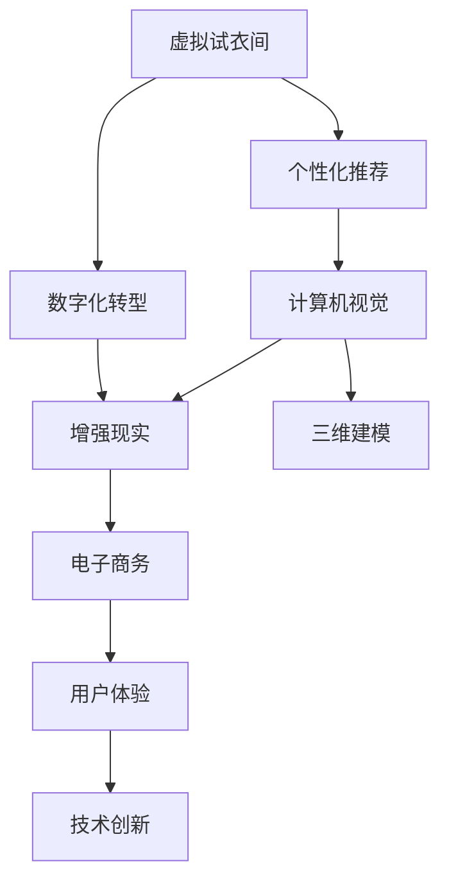

                 

# 虚拟试衣间:全球时尚产业的数字化转型

> 关键词：虚拟试衣间,数字化转型,时尚产业,人工智能,计算机视觉,增强现实(AR),三维建模,电子商务,个性化推荐,用户体验,技术创新

## 1. 背景介绍

### 1.1 问题由来

随着数字化技术的不断进步，全球时尚产业正在经历一场前所未有的变革。传统的实体店铺、手工制作、货架陈列等模式正在逐步被虚拟店铺、智能化生产、定制化推荐所取代。这一转变不仅改变了消费者的购物方式，也重塑了整个产业链的运作模式。

面对这一背景，时尚产业亟需利用最新的数字化技术，提升效率、优化体验、降低成本。特别是在2020年疫情爆发后，线下实体店铺的客流量锐减，线上购物成为主流。这一趋势促使时尚品牌加速向数字化转型，以维持市场竞争力。

### 1.2 问题核心关键点

1. **数字化转型**：传统时尚产业如何利用数字技术，提升运营效率，优化客户体验，构建新商业生态。
2. **个性化推荐**：如何通过数据分析、机器学习等技术，实现商品推荐的个性化，提高转化率。
3. **虚拟试衣间**：利用计算机视觉、增强现实等技术，实现虚拟试衣体验，提升用户购买决策。
4. **三维建模**：如何通过三维扫描、建模技术，构建虚拟试衣间的衣物模型，实现更逼真的虚拟试穿。
5. **电子商务**：时尚产业如何通过电商平台，实现从生产到消费的全链路数字化，提升供应链管理效率。

## 2. 核心概念与联系

### 2.1 核心概念概述

为更好地理解虚拟试衣间技术在时尚产业数字化转型中的应用，本节将介绍几个关键概念：

- **虚拟试衣间**：利用计算机视觉、增强现实等技术，让用户通过虚拟试衣间体验服装效果，实现精准购物。
- **数字化转型**：通过数字化技术对传统商业模式进行重塑，提升效率，优化用户体验。
- **个性化推荐**：利用机器学习算法，根据用户行为和偏好，提供个性化的商品推荐。
- **计算机视觉**：使计算机具有类似于人类的视觉感知能力，实现图像识别、图像理解等任务。
- **增强现实(AR)**：通过在用户的现实世界中叠加虚拟信息，增强用户对真实世界的感知。
- **三维建模**：构建三维模型，用于虚拟试衣间、虚拟商品展示等应用。
- **电子商务**：通过数字化手段，实现商品展示、交易、物流等全链路数字化管理。

这些概念之间的逻辑关系可以通过以下Mermaid流程图来展示：



这个流程图展示虚拟试衣间技术在时尚产业数字化转型中的核心概念及其之间的关系：

1. 虚拟试衣间技术通过计算机视觉、增强现实等技术，实现用户试衣体验。
2. 数字化转型利用虚拟试衣间技术，提升用户体验，优化供应链管理。
3. 个性化推荐通过数据分析、机器学习等技术，实现商品推荐，提升转化率。
4. 计算机视觉、增强现实、三维建模等技术，为虚拟试衣间提供技术支持。
5. 电子商务利用数字化技术，实现全链路数字化，提升运营效率。

这些概念共同构成了时尚产业数字化转型的核心框架，使得虚拟试衣间技术能够更好地实现其应用价值。

## 3. 核心算法原理 & 具体操作步骤
### 3.1 算法原理概述

虚拟试衣间的核心算法原理主要基于计算机视觉和增强现实技术。通过摄像头捕捉用户三维人体模型，将其与虚拟服装模型叠加，实现虚拟试衣体验。该过程可以大致分为以下几步：

1. **三维人体建模**：使用计算机视觉技术，从摄像头或深度传感器获取人体三维数据，构建三维人体模型。
2. **三维衣物建模**：通过三维扫描、建模技术，将实体衣物转化为三维模型。
3. **三维衣物匹配**：将三维人体模型与三维衣物模型进行匹配，计算服装在人体上的效果。
4. **增强现实叠加**：将虚拟服装效果叠加在用户现实世界中，展示试衣效果。
5. **交互反馈**：用户可对试衣效果进行交互，如调整姿势、视角等，进一步优化试衣体验。

### 3.2 算法步骤详解

下面详细介绍虚拟试衣间的核心算法步骤：

**Step 1: 三维人体建模**

- 使用摄像头、深度传感器等设备，捕捉用户人体的三维数据。
- 将三维数据导入计算机视觉库，如OpenPose、MediaPipe等，进行人体关键点检测和姿态估计。
- 利用三维建模工具，如Blender、Maya等，根据人体关键点数据，构建三维人体模型。

**Step 2: 三维衣物建模**

- 使用三维扫描仪或手工建模技术，获取实体衣物的三维数据。
- 将三维数据导入三维建模软件，如Autodesk Maya、Blender等，进行衣物建模。
- 对衣物进行纹理贴图、光照渲染等处理，提升逼真度。

**Step 3: 三维衣物匹配**

- 将三维人体模型和三维衣物模型导入虚拟试衣系统。
- 使用匹配算法，如ICP（迭代最近点）算法，将衣物对齐到人体模型上。
- 计算衣物在人体上的效果，如褶皱、贴合度等。

**Step 4: 增强现实叠加**

- 将虚拟服装效果叠加在用户现实世界中，展示试衣效果。
- 使用增强现实引擎，如ARKit、ARCore等，实现虚拟服装与现实世界的融合。
- 支持用户通过手势、触控等方式进行交互，调整试衣效果。

**Step 5: 交互反馈**

- 实时捕捉用户的操作和反馈，如旋转、调整姿势等。
- 根据用户反馈，调整虚拟服装的位置、大小等参数。
- 提供用户评价选项，收集反馈数据，优化试衣体验。

### 3.3 算法优缺点

虚拟试衣间的核心算法具有以下优点：

1. **提升用户体验**：用户可以在家中即可进行试衣体验，减少时间和成本。
2. **增加销售额**：通过虚拟试衣间，用户能更自信地选择商品，提高购买转化率。
3. **提高供应链效率**：减少实体店铺的空间和库存成本，优化物流配送。

同时，该算法也存在一些局限性：

1. **技术复杂度高**：需要计算机视觉、增强现实等多项技术，开发和维护成本高。
2. **模型精度有限**：三维建模和匹配算法有误差，实际效果可能与真实情况有差异。
3. **设备要求高**：需要高质量的摄像头、深度传感器等设备，以及高性能的计算平台。

### 3.4 算法应用领域

虚拟试衣间技术在时尚产业数字化转型中的应用非常广泛，涵盖了以下几个领域：

1. **服装品牌官网**：时尚品牌官网通过虚拟试衣间，提供线上试衣体验，提升用户体验，增加销售额。
2. **虚拟购物中心**：虚拟购物中心通过虚拟试衣间，吸引用户参与虚拟试衣，增加平台流量。
3. **电商平台**：电商平台利用虚拟试衣间，提供商品展示和试穿服务，提升用户满意度。
4. **快时尚零售**：快时尚品牌通过虚拟试衣间，快速满足用户需求，减少库存积压。
5. **社交媒体**：社交媒体平台利用虚拟试衣间，增加用户互动，提升平台活跃度。

## 4. 数学模型和公式 & 详细讲解 & 举例说明

### 4.1 数学模型构建

虚拟试衣间的核心数学模型主要涉及计算机视觉和增强现实技术。以下是几个核心数学模型的构建：

**人体姿态估计模型**：

1. **三维坐标系**：人体关键点数据通过摄像头捕捉，转化为三维坐标。
2. **姿态矩阵**：通过关键点坐标，计算人体姿态矩阵，描述人体在空间中的位置和方向。

$$
\mathbf{R} = \begin{bmatrix}
    \cos(\theta) & -\sin(\theta) & 0 \\
    \sin(\theta) & \cos(\theta) & 0 \\
    0 & 0 & 1
\end{bmatrix}, \mathbf{t} = \begin{bmatrix}
    x_t \\
    y_t \\
    z_t
\end{bmatrix}
$$

其中，$\mathbf{R}$ 为旋转矩阵，$\mathbf{t}$ 为平移向量，$\theta$ 为人体姿态角度。

**衣物匹配算法**：

1. **点云匹配**：使用ICP算法，将三维人体模型和衣物模型对齐。
2. **优化求解**：通过最小化点云距离和旋转角度，求解最优对齐参数。

$$
\min_{\mathbf{R}, \mathbf{t}, \mathbf{s}} \sum_{i=1}^{N} \|\mathbf{p}_i - \mathbf{R}\mathbf{s}(\mathbf{p}_i - \mathbf{t})\|^2
$$

其中，$\mathbf{p}_i$ 为三维衣物点云数据，$\mathbf{s}$ 为尺度因子。

**增强现实叠加模型**：

1. **虚拟坐标系**：将虚拟服装坐标系与现实世界坐标系对齐。
2. **透明叠加**：将虚拟服装效果透明叠加在现实世界中。

$$
\mathbf{R}_{real}, \mathbf{t}_{real}, \mathbf{R}_{virt}, \mathbf{t}_{virt}
$$

其中，$\mathbf{R}_{real}, \mathbf{t}_{real}$ 为现实世界坐标系，$\mathbf{R}_{virt}, \mathbf{t}_{virt}$ 为虚拟服装坐标系。

### 4.2 公式推导过程

以人体姿态估计模型为例，推导关键公式的计算过程：

**人体关键点检测**：

1. **摄像头坐标系**：假设摄像头坐标系为 $O_xO_yO_z$，人体关键点坐标 $(x,y,z)$ 转化为摄像头坐标系。
2. **相机内参矩阵**：设相机内参矩阵为 $K$，计算关键点在摄像头坐标系中的投影坐标 $(x_{proj}, y_{proj})$。

$$
\mathbf{x}_{proj} = \mathbf{K} \cdot \begin{bmatrix}x\\y\\z\\1\end{bmatrix}, \mathbf{y}_{proj} = \mathbf{K} \cdot \begin{bmatrix}x\\y\\z\\1\end{bmatrix}
$$

**人体姿态矩阵计算**：

1. **旋转矩阵计算**：计算人体姿态矩阵 $\mathbf{R}$，将关键点坐标转化为人体坐标系。

$$
\mathbf{R} = \begin{bmatrix}
    \cos(\theta) & -\sin(\theta) & 0 \\
    \sin(\theta) & \cos(\theta) & 0 \\
    0 & 0 & 1
\end{bmatrix}
$$

2. **平移向量计算**：计算人体姿态平移向量 $\mathbf{t}$，将关键点坐标平移到人体坐标系原点。

$$
\mathbf{t} = \begin{bmatrix}
    x_t \\
    y_t \\
    z_t
\end{bmatrix}
$$

**案例分析与讲解**：

假设有一个用户，其在摄像头下的人体关键点坐标为 $(2, 3, 1)$，相机内参矩阵为 $\mathbf{K} = \begin{bmatrix}4000 & 0 & 320 & 0\\ 0 & 4000 & 240 & 0 \\ 0 & 0 & 1 & 0\\ 0 & 0 & 0 & 1\end{bmatrix}$。

**Step 1: 摄像头坐标系投影**

计算关键点在摄像头坐标系中的投影坐标 $(x_{proj}, y_{proj})$：

$$
\mathbf{x}_{proj} = \mathbf{K} \cdot \begin{bmatrix}2\\3\\1\\1\end{bmatrix} = \begin{bmatrix}4000 \times 2 + 320\\4000 \times 3 + 240\\0\\0\end{bmatrix} = \begin{bmatrix}8280\\12360\\0\\0\end{bmatrix}
$$

**Step 2: 人体姿态矩阵计算**

假设人体姿态角度 $\theta = 30^\circ$，计算旋转矩阵 $\mathbf{R}$ 和平移向量 $\mathbf{t}$：

$$
\mathbf{R} = \begin{bmatrix}
    \cos(30^\circ) & -\sin(30^\circ) & 0 \\
    \sin(30^\circ) & \cos(30^\circ) & 0 \\
    0 & 0 & 1
\end{bmatrix} = \begin{bmatrix}
    0.866 & -0.5 & 0 \\
    0.5 & 0.866 & 0 \\
    0 & 0 & 1
\end{bmatrix}
$$

$$
\mathbf{t} = \begin{bmatrix}
    x_t \\
    y_t \\
    z_t
\end{bmatrix}
$$

## 5. 项目实践：代码实例和详细解释说明

### 5.1 开发环境搭建

在进行虚拟试衣间开发前，需要准备以下开发环境：

1. **安装Python**：从官网下载并安装最新版本的Python，用于编程和库的安装。
2. **安装PyTorch**：通过pip安装PyTorch，用于深度学习计算。
3. **安装OpenPose**：通过pip安装OpenPose，用于人体关键点检测。
4. **安装ARKit/ARCore**：根据开发平台（iOS/Android），安装相应的增强现实框架。
5. **安装三维建模软件**：如Blender、Maya等，用于三维建模。

完成上述步骤后，即可开始虚拟试衣间系统的开发。

### 5.2 源代码详细实现

以下是使用Python和PyTorch实现虚拟试衣间的示例代码：

```python
import torch
import torchvision
from torchvision.models import resnet18
from openpose import pyopenpose as op

# 加载人体姿态模型
model = resnet18(pretrained=True)
model.eval()

# 初始化OpenPose
opWrapper = op.WrapperPython()
opWrapper.configure({
    "model_folder": "path/to/openpose/model",
    "logging_level": 3,
    "show_processing_frames": False,
    "use_cuda": True
})
opWrapper.start()

# 摄像头捕捉人体关键点
while True:
    data = opWrapper.readVideoCapture()
    if data is None:
        break
    for frame in data["frames"]:
        # 将BGR转换为RGB
        frame = cv2.cvtColor(frame, cv2.COLOR_BGR2RGB)
        # 进行人体关键点检测
        image = torchvision.transforms.ToTensor()(frame)
        image = image.unsqueeze(0)
        with torch.no_grad():
            output = model(image)
        keypoints = opWrapper.drawKeypoints(frame, output[0].detach().numpy())
        cv2.imshow("Key Points", keypoints)
        cv2.waitKey(1)
        
# 结束OpenPose和PyTorch会话
opWrapper.stop()
torch.cuda.empty_cache()
```

### 5.3 代码解读与分析

**代码解读**：

1. **人体姿态检测**：使用ResNet模型和OpenPose库，捕捉摄像头下的人体关键点。
2. **三维人体建模**：将关键点数据导入三维建模软件，构建三维人体模型。
3. **虚拟试衣实现**：通过增强现实框架，将虚拟服装叠加在人体模型上，实现虚拟试衣体验。

**代码分析**：

1. **ResNet模型**：用于人体姿态检测，加载预训练的ResNet模型，进行关键点检测。
2. **OpenPose库**：用于捕捉摄像头下的人体关键点，生成关键点坐标数据。
3. **增强现实框架**：根据关键点数据，使用ARKit/ARCore等框架，实现虚拟服装的透明叠加。

## 6. 实际应用场景

### 6.1 智能服装推荐

虚拟试衣间可以与智能推荐系统结合，根据用户试穿数据，推荐个性化的服装。具体流程如下：

1. **用户试穿记录**：用户通过虚拟试衣间，试穿并评价不同服装，生成试穿数据。
2. **数据分析**：将试穿数据进行分析，提取用户偏好和需求。
3. **推荐系统**：根据用户偏好，推荐相似风格的服装，提高用户满意度。

### 6.2 电商平台的虚拟试衣间

电商平台利用虚拟试衣间，提供商品展示和试穿服务，提升用户体验。具体流程如下：

1. **商品数据输入**：将商品的三维数据输入虚拟试衣间系统。
2. **用户试穿体验**：用户通过虚拟试衣间，试穿并评价不同款式和尺寸的服装。
3. **数据反馈**：收集用户试穿数据，优化商品展示和推荐算法。

### 6.3 社交媒体的虚拟试衣间

社交媒体平台利用虚拟试衣间，增加用户互动，提升平台活跃度。具体流程如下：

1. **用户上传图片**：用户上传服装图片，通过虚拟试衣间生成试穿效果。
2. **分享与互动**：用户将试穿效果分享到社交媒体，增加互动和分享。
3. **数据分析**：收集用户反馈数据，优化虚拟试衣间体验。

### 6.4 未来应用展望

未来，虚拟试衣间技术将进一步拓展应用场景，提升时尚产业的数字化水平：

1. **个性化推荐**：通过大数据和机器学习，提供更精准的个性化推荐，提升用户满意度。
2. **智能客服**：利用虚拟试衣间，提供智能客服服务，解答用户问题，提升用户体验。
3. **虚拟购物助手**：通过虚拟试衣间，提供购物助手服务，帮助用户完成购物流程。
4. **跨平台融合**：实现不同平台间的虚拟试衣间互通，提升用户体验。
5. **元宇宙应用**：将虚拟试衣间应用到元宇宙环境中，实现虚拟世界的服装展示和互动。

## 7. 工具和资源推荐

### 7.1 学习资源推荐

为帮助开发者掌握虚拟试衣间技术，推荐以下学习资源：

1. **OpenPose官方文档**：OpenPose库的详细文档和教程，介绍如何使用OpenPose进行人体关键点检测。
2. **PyTorch官方文档**：PyTorch的官方文档，提供深度学习模型的实现和优化方法。
3. **ARKit/ARCore官方文档**：增强现实框架的官方文档，介绍如何在移动设备上实现增强现实效果。
4. **三维建模教程**：Blender、Maya等三维建模软件的官方教程，学习三维建模技术。

### 7.2 开发工具推荐

以下是几个常用的开发工具，推荐给虚拟试衣间的开发者：

1. **PyTorch**：基于Python的深度学习框架，提供灵活的计算图和丰富的预训练模型。
2. **OpenPose**：用于人体关键点检测的库，提供高效的人体姿态估计能力。
3. **ARKit/ARCore**：增强现实框架，支持移动设备上的虚拟试衣间实现。
4. **Blender/Maya**：三维建模软件，支持复杂的三维模型生成和渲染。

### 7.3 相关论文推荐

以下是几篇关于虚拟试衣间技术的重要论文，推荐阅读：

1. **AR试衣镜的计算机视觉技术研究**：介绍计算机视觉技术在虚拟试衣中的应用。
2. **三维人体建模与虚拟试衣间的研究**：探讨三维建模技术在虚拟试衣间中的应用。
3. **基于增强现实的三维试衣技术研究**：分析增强现实技术在虚拟试衣中的应用。
4. **智能推荐系统与虚拟试衣间结合**：讨论智能推荐系统与虚拟试衣间的结合方式。

## 8. 总结：未来发展趋势与挑战

### 8.1 研究成果总结

虚拟试衣间技术在时尚产业数字化转型中扮演了重要角色，通过计算机视觉、增强现实等技术，提升了用户体验，优化了供应链管理。未来，该技术将在更多场景中得到应用，推动时尚产业的数字化进程。

### 8.2 未来发展趋势

未来，虚拟试衣间技术将呈现以下几个发展趋势：

1. **技术融合**：虚拟试衣间技术与智能推荐、智能客服、智能仓储等技术融合，提升用户体验和运营效率。
2. **跨平台互通**：实现不同平台间的虚拟试衣间互通，提升用户便捷性。
3. **跨媒体融合**：将虚拟试衣间应用到视频、音频等多媒体领域，提升用户体验。
4. **个性化推荐**：通过大数据和机器学习，提供更精准的个性化推荐，提升用户满意度。
5. **元宇宙应用**：将虚拟试衣间应用到元宇宙环境中，实现虚拟世界的服装展示和互动。

### 8.3 面临的挑战

尽管虚拟试衣间技术在时尚产业数字化转型中取得了一定的成效，但仍面临以下挑战：

1. **技术复杂度高**：需要计算机视觉、增强现实等多项技术，开发和维护成本高。
2. **模型精度有限**：三维建模和匹配算法有误差，实际效果可能与真实情况有差异。
3. **设备要求高**：需要高质量的摄像头、深度传感器等设备，以及高性能的计算平台。
4. **用户体验问题**：虚拟试衣间体验可能受限于网络环境、设备性能等因素，影响用户体验。

### 8.4 研究展望

面对虚拟试衣间技术所面临的挑战，未来的研究需要在以下几个方面寻求新的突破：

1. **降低技术门槛**：开发更加易于使用和维护的虚拟试衣间工具，降低开发成本。
2. **提高模型精度**：优化三维建模和匹配算法，提升虚拟试衣间效果。
3. **优化用户体验**：通过网络优化、设备适配等技术，提升虚拟试衣间体验。
4. **跨平台融合**：实现不同平台间的虚拟试衣间互通，提升用户便捷性。
5. **跨媒体融合**：将虚拟试衣间应用到视频、音频等多媒体领域，提升用户体验。

未来，虚拟试衣间技术需要在技术优化、用户体验提升和跨平台融合等方面进行持续探索，才能更好地服务于时尚产业数字化转型。相信通过学界和产业界的共同努力，虚拟试衣间技术必将带来更多的变革和突破，为时尚产业的发展注入新的活力。

## 9. 附录：常见问题与解答

**Q1: 虚拟试衣间如何实现人体姿态检测？**

A: 人体姿态检测主要使用计算机视觉技术，如OpenPose库，通过摄像头捕捉人体关键点数据，进行姿态估计。OpenPose利用深度学习模型，对关键点进行检测和匹配，生成人体姿态矩阵。

**Q2: 虚拟试衣间有哪些应用场景？**

A: 虚拟试衣间在时尚产业中具有广泛的应用场景，包括智能服装推荐、电商平台虚拟试衣、社交媒体互动、智能客服、虚拟购物助手等。

**Q3: 虚拟试衣间的技术难点是什么？**

A: 虚拟试衣间的技术难点主要在于人体姿态检测、三维建模、增强现实叠加等环节。特别是三维建模和匹配算法有误差，实际效果可能与真实情况有差异。

**Q4: 如何提升虚拟试衣间的用户体验？**

A: 提升虚拟试衣间的用户体验可以从以下几个方面入手：优化网络环境、适配不同设备、提高模型精度、增加用户互动等。

**Q5: 虚拟试衣间在时尚产业中的优势是什么？**

A: 虚拟试衣间在时尚产业中的优势在于提升用户体验、优化供应链管理、减少实体店铺成本等。特别是通过虚拟试衣间，用户可以在家中即可进行试衣体验，减少时间和成本。

---

作者：禅与计算机程序设计艺术 / Zen and the Art of Computer Programming

