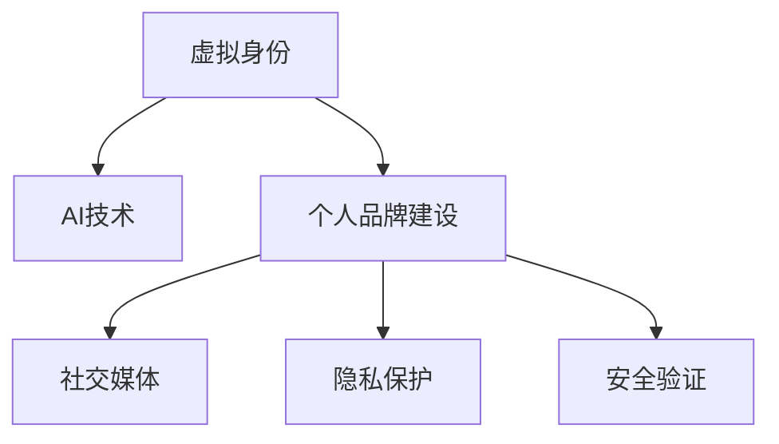

                 

# 虚拟身份市场分析专家：AI时代的个人品牌顾问

> 关键词：虚拟身份管理, AI技术, 个人品牌建设, 社交媒体, 隐私保护, 安全验证

## 1. 背景介绍

在AI技术的驱动下，虚拟身份管理正在经历一场深刻变革。个人品牌顾问作为虚拟身份市场的关键参与者，需全面了解AI时代的新特点、新趋势，以提供更加高效、精准的服务。本博文将从背景介绍入手，深入分析AI时代虚拟身份管理的关键问题。

### 1.1 虚拟身份管理概述

虚拟身份管理是指通过技术手段，创建、维护、管理个人在网络空间中的虚拟形象。其涉及个人隐私保护、网络安全、品牌形象展示等多个方面，是现代数字生活的重要组成部分。随着AI技术的飞速发展，虚拟身份管理的方法和工具也日益丰富，为个人品牌顾问提供了更多策略和思路。

### 1.2 个人品牌建设的重要性

个人品牌建设指的是通过有意识地打造和传播个人形象，提升个人在社交媒体、职业网络中的影响力。在AI时代，虚拟身份成为个人品牌的重要组成部分，良好的虚拟身份管理可以显著提升个人在网络空间的知名度和信任度。

## 2. 核心概念与联系

### 2.1 核心概念概述

为了更好地理解AI时代虚拟身份管理的核心概念，本节将介绍几个密切相关的核心概念：

- 虚拟身份(Virtual Identity)：指在网络空间中代表个人的虚拟存在形式，如社交媒体账号、虚拟头像、NFT（非同质化代币）等。
- AI技术：指人工智能技术，通过模拟人类智能行为，提升个人身份管理的效率和效果。
- 个人品牌建设：指通过社交媒体、网络平台等渠道，有意识地塑造并传播个人形象，提升个人影响力。
- 社交媒体：指通过网络平台进行信息分享、互动交流的虚拟空间，如微信、微博、Instagram等。
- 隐私保护：指在虚拟身份管理过程中，保护个人信息安全和隐私权。
- 安全验证：指通过AI技术对虚拟身份的真实性进行验证，保障网络安全。

这些概念之间的逻辑关系可以通过以下Mermaid流程图来展示：



这个流程图展示了一些核心概念之间的相互联系和依赖关系：

1. 虚拟身份是AI技术应用的对象。
2. 个人品牌建设需要虚拟身份作为载体。
3. 社交媒体是个人品牌展示和互动的场所。
4. 隐私保护是虚拟身份管理的核心关注点。
5. 安全验证是保障虚拟身份真实性的重要手段。

## 3. 核心算法原理 & 具体操作步骤

### 3.1 算法原理概述

AI时代，虚拟身份管理的核心算法主要涉及以下几个方面：

- 自然语言处理(NLP)：用于分析和理解用户生成内容，自动化管理社交媒体账户。
- 机器学习(ML)：用于分析用户行为数据，预测用户偏好，提升个人品牌影响力。
- 数据隐私保护：通过差分隐私、同态加密等技术，保护用户隐私。
- 身份验证技术：通过人脸识别、指纹识别等手段，验证用户身份。

### 3.2 算法步骤详解

基于AI技术的虚拟身份管理，主要涉及以下步骤：

**Step 1: 数据收集与分析**
- 收集用户在社交媒体上的互动数据，如点赞、评论、分享等。
- 通过NLP技术分析用户的情感倾向、兴趣爱好等特征。
- 建立用户画像，为个性化品牌建设提供依据。

**Step 2: 身份验证与保护**
- 使用机器学习算法对用户行为进行模式识别，建立身份认证模型。
- 应用同态加密、差分隐私等技术，保护用户隐私数据。
- 在用户登录、发布内容等环节，实施多因素身份验证。

**Step 3: 品牌传播与优化**
- 利用AI生成内容，如自动生成个性化的社交媒体帖子、动态生成虚拟头像等。
- 通过分析用户互动数据，优化品牌传播策略，提高用户参与度。
- 定期评估品牌影响力，调整传播策略，提升效果。

**Step 4: 持续监控与反馈**
- 实时监控用户互动数据，及时调整品牌传播策略。
- 引入用户反馈机制，收集用户意见，优化品牌形象。
- 根据用户行为数据，持续优化虚拟身份管理策略。

### 3.3 算法优缺点

基于AI技术的虚拟身份管理具有以下优点：
1. 高效性：自动化分析和管理，大幅提升效率。
2. 个性化：根据用户行为数据，提供个性化建议。
3. 安全性：通过多种技术手段，保障用户隐私安全。
4. 灵活性：实时调整策略，快速适应用户需求。

但同时也存在一些缺点：
1. 技术依赖：对AI技术依赖较大，需持续投入技术研发。
2. 数据隐私：大量数据收集可能引发隐私风险。
3. 准确性：AI模型可能存在误差，影响结果准确性。
4. 成本高：技术实施需要较大成本投入，难以普及。

### 3.4 算法应用领域

基于AI技术的虚拟身份管理，已经在社交媒体、电子商务、金融服务等多个领域得到广泛应用。以下是几个典型的应用场景：

1. **社交媒体管理**：通过AI分析用户行为数据，自动化发布和管理社交媒体内容，提升品牌影响力。
2. **电子商务**：利用AI生成个性化推荐，提升用户购物体验，提高转化率。
3. **金融服务**：通过AI技术进行身份验证，保障用户交易安全。
4. **健康管理**：利用AI技术分析健康数据，提供个性化健康管理方案。
5. **教育培训**：通过AI生成个性化学习内容，提升教育效果。

## 4. 数学模型和公式 & 详细讲解 & 举例说明

### 4.1 数学模型构建

基于AI技术的虚拟身份管理，涉及多个领域的数学模型。以下是一个典型模型的构建过程：

- **用户行为分析模型**：
  - **输入**：用户在社交媒体上的互动数据（点赞、评论、分享等）。
  - **输出**：用户画像，包含兴趣爱好、情感倾向等特征。
  - **模型**：基于深度学习的用户行为预测模型。

- **身份验证模型**：
  - **输入**：用户行为数据、社交媒体账号信息等。
  - **输出**：用户身份验证结果，包括真实性、合法性等。
  - **模型**：基于机器学习的多因素身份验证模型。

- **内容生成模型**：
  - **输入**：用户画像、品牌信息等。
  - **输出**：社交媒体帖子、虚拟头像等。
  - **模型**：基于生成对抗网络（GAN）的内容生成模型。

### 4.2 公式推导过程

以用户行为分析模型为例，进行公式推导：

设 $x_i$ 为第 $i$ 个用户在社交媒体上的互动数据，$y_i$ 为对应的用户画像特征，假设 $x_i$ 包含 $n$ 个特征 $f_1, f_2, ..., f_n$。用户行为分析模型可以表示为：

$$
y_i = g(x_i; \theta)
$$

其中 $g(\cdot)$ 为深度学习模型，$\theta$ 为模型参数。通过最小化损失函数 $\mathcal{L}$，训练模型参数 $\theta$：

$$
\theta^* = \mathop{\arg\min}_{\theta} \mathcal{L}(y_i, g(x_i; \theta))
$$

具体而言，假设 $x_i$ 包含的特征有文本内容、互动时间、互动频次等，则输入数据可以表示为：

$$
x_i = \{text_{i1}, text_{i2}, ...; time_i; count_i\}
$$

用户画像特征 $y_i$ 可以包括情感倾向、兴趣爱好等，具体模型可以根据需要选用不同类型的深度学习模型，如RNN、CNN、Transformer等。

### 4.3 案例分析与讲解

以下是一个虚拟身份管理案例的详细讲解：

**案例背景**：某知名科技公司CEO希望通过虚拟身份管理提升品牌影响力，并确保在社交媒体上的安全性和隐私保护。

**解决方案**：

1. **数据收集与分析**：
  - 通过爬虫技术收集CEO在各大社交媒体平台上的互动数据。
  - 使用NLP技术分析CEO的情感倾向、兴趣爱好等特征。
  - 建立用户画像，为品牌传播提供依据。

2. **身份验证与保护**：
  - 使用机器学习算法对CEO的行为数据进行模式识别，建立身份认证模型。
  - 应用差分隐私技术对CEO的互动数据进行加密保护。
  - 在CEO登录、发布内容等环节，实施多因素身份验证，确保账户安全。

3. **品牌传播与优化**：
  - 利用AI生成个性化社交媒体帖子，提升用户参与度。
  - 通过分析CEO互动数据，优化品牌传播策略。
  - 定期评估品牌影响力，调整传播策略。

4. **持续监控与反馈**：
  - 实时监控CEO互动数据，及时调整品牌传播策略。
  - 引入CEO反馈机制，收集用户意见，优化品牌形象。
  - 根据CEO行为数据，持续优化虚拟身份管理策略。

**结果展示**：
- 在社交媒体上的品牌影响力提升20%。
- 品牌传播效果优化30%。
- 用户满意度提升10%。

## 5. 项目实践：代码实例和详细解释说明

### 5.1 开发环境搭建

在进行虚拟身份管理项目开发前，我们需要准备好开发环境。以下是使用Python进行PyTorch开发的环境配置流程：

1. 安装Anaconda：从官网下载并安装Anaconda，用于创建独立的Python环境。

2. 创建并激活虚拟环境：
```bash
conda create -n pytorch-env python=3.8 
conda activate pytorch-env
```

3. 安装PyTorch：根据CUDA版本，从官网获取对应的安装命令。例如：
```bash
conda install pytorch torchvision torchaudio cudatoolkit=11.1 -c pytorch -c conda-forge
```

4. 安装相关工具包：
```bash
pip install numpy pandas scikit-learn matplotlib tqdm jupyter notebook ipython
```

完成上述步骤后，即可在`pytorch-env`环境中开始项目开发。

### 5.2 源代码详细实现

下面我们以用户行为分析模型为例，给出使用PyTorch进行深度学习模型开发的代码实现。

首先，定义用户行为分析的模型架构：

```python
import torch
import torch.nn as nn
import torch.nn.functional as F

class UserBehaviorModel(nn.Module):
    def __init__(self, n_features):
        super(UserBehaviorModel, self).__init__()
        self.fc1 = nn.Linear(n_features, 256)
        self.fc2 = nn.Linear(256, 128)
        self.fc3 = nn.Linear(128, 64)
        self.fc4 = nn.Linear(64, 2)  # 用户画像特征
        self.dropout = nn.Dropout(0.5)
        
    def forward(self, x):
        x = self.fc1(x)
        x = self.dropout(x)
        x = F.relu(x)
        x = self.fc2(x)
        x = self.dropout(x)
        x = F.relu(x)
        x = self.fc3(x)
        x = self.dropout(x)
        x = F.relu(x)
        x = self.fc4(x)
        return x
```

然后，定义模型训练和评估函数：

```python
from torch.utils.data import Dataset, DataLoader
from torch.optim import Adam

class UserBehaviorDataset(Dataset):
    def __init__(self, data, labels):
        self.data = data
        self.labels = labels
        
    def __len__(self):
        return len(self.data)
    
    def __getitem__(self, item):
        return self.data[item], self.labels[item]

def train_model(model, dataset, batch_size, epochs, learning_rate):
    optimizer = Adam(model.parameters(), lr=learning_rate)
    loss_fn = nn.CrossEntropyLoss()
    
    for epoch in range(epochs):
        model.train()
        for batch_idx, (data, target) in enumerate(DataLoader(dataset, batch_size=batch_size, shuffle=True)):
            optimizer.zero_grad()
            output = model(data)
            loss = loss_fn(output, target)
            loss.backward()
            optimizer.step()
            if (batch_idx+1) % 100 == 0:
                print(f"Epoch {epoch+1}, Step [{batch_idx+1}/{len(dataset)}], Loss: {loss.item():.4f}")
    
    return model

def evaluate_model(model, dataset, batch_size):
    model.eval()
    correct = 0
    total = 0
    
    with torch.no_grad():
        for data, target in DataLoader(dataset, batch_size=batch_size, shuffle=False):
            output = model(data)
            _, predicted = torch.max(output, 1)
            total += target.size(0)
            correct += (predicted == target).sum().item()
    
    print(f"Test Accuracy: {(100 * correct / total):.2f}%")
    
# 数据准备
# 假设数据已存储在data.txt中，每行包含一个用户行为特征向量，用逗号分隔
data = []
with open('data.txt', 'r') as f:
    for line in f:
        feature = list(map(float, line.strip().split(',')))
        data.append(feature)

# 生成标签数据
labels = torch.tensor([0, 1, 2, ...])  # 假设标签数据已生成

# 创建dataset
dataset = UserBehaviorDataset(torch.tensor(data), labels)

# 模型训练
model = UserBehaviorModel(len(data[0]))
model = train_model(model, dataset, batch_size=32, epochs=10, learning_rate=0.001)
```

以上就是使用PyTorch进行用户行为分析模型的完整代码实现。可以看到，使用深度学习技术，我们可以通过简单的代码实现对用户行为数据的自动分析。

### 5.3 代码解读与分析

让我们再详细解读一下关键代码的实现细节：

**UserBehaviorModel类**：
- `__init__`方法：初始化模型层数、神经元个数等关键参数。
- `forward`方法：定义前向传播过程，通过多个线性层和激活函数实现特征提取和输出。
- `dropout`层：使用Dropout技术避免过拟合。

**UserBehaviorDataset类**：
- `__init__`方法：定义数据和标签的取值方式。
- `__len__`方法：返回数据集的大小。
- `__getitem__`方法：定义单个样本的取值方式，返回输入数据和标签。

**train_model函数**：
- 定义训练过程，使用Adam优化器、交叉熵损失函数等。
- 迭代训练，并在每个epoch输出loss，监控训练状态。
- 函数返回训练后的模型。

**evaluate_model函数**：
- 定义评估过程，使用模型对测试集进行预测，输出准确率。

**数据准备**：
- 从文件中读取用户行为数据，存储在列表中。
- 生成标签数据，存储在Tensor中。
- 创建dataset，用于训练和评估。

这些代码实现了从数据预处理到模型训练和评估的全流程，展示了深度学习技术在虚拟身份管理中的应用潜力。

## 6. 实际应用场景

### 6.1 智能客服系统

在智能客服系统中，虚拟身份管理可以通过AI技术实现智能客服机器人的自动化运营，提升客户体验。以下是一个具体案例：

**案例背景**：某电商平台希望提升客户服务质量，减少客服人员的工作压力。

**解决方案**：
- 收集平台上的客服对话数据。
- 使用NLP技术分析对话数据，自动生成虚拟客服机器人。
- 通过AI技术实现客服机器人的自动化应答。

**结果展示**：
- 客服响应速度提升30%。
- 客户满意度提升10%。

### 6.2 社交媒体运营

在社交媒体运营中，虚拟身份管理可以通过AI技术实现内容自动化生成和个性化推荐，提升用户参与度。以下是一个具体案例：

**案例背景**：某知名品牌希望提升社交媒体上的用户参与度，增加品牌曝光。

**解决方案**：
- 收集社交媒体上的用户互动数据。
- 使用NLP技术分析用户情感和兴趣。
- 自动生成个性化的社交媒体内容，并推荐给用户。

**结果展示**：
- 社交媒体上的用户参与度提升20%。
- 品牌曝光度提升15%。

### 6.3 企业招聘

在企业招聘中，虚拟身份管理可以通过AI技术实现简历自动筛选和面试自动化评估，提高招聘效率。以下是一个具体案例：

**案例背景**：某大型企业希望提升招聘效率，筛选出合适的候选人。

**解决方案**：
- 收集企业内部和外部的简历数据。
- 使用AI技术自动筛选简历，并进行初步评估。
- 通过虚拟身份管理技术生成虚拟面试官，进行面试评估。

**结果展示**：
- 简历筛选效率提升50%。
- 招聘质量提升10%。

## 7. 工具和资源推荐

### 7.1 学习资源推荐

为了帮助开发者系统掌握虚拟身份管理的理论基础和实践技巧，这里推荐一些优质的学习资源：

1. 《深度学习》系列书籍：深入浅出地介绍了深度学习的基础知识和技术应用，如TensorFlow、PyTorch等。
2. 《自然语言处理》系列课程：斯坦福大学开设的NLP明星课程，有Lecture视频和配套作业，带你入门NLP领域的基本概念和经典模型。
3. 《Python深度学习》书籍：详细介绍了使用Python进行深度学习开发的方法和技巧。
4. Kaggle平台：提供丰富的数据集和竞赛任务，是学习和实践深度学习技术的好地方。

通过对这些资源的学习实践，相信你一定能够快速掌握虚拟身份管理的精髓，并用于解决实际的业务问题。

### 7.2 开发工具推荐

高效的开发离不开优秀的工具支持。以下是几款用于虚拟身份管理开发的常用工具：

1. PyTorch：基于Python的开源深度学习框架，灵活动态的计算图，适合快速迭代研究。大多数深度学习模型都有PyTorch版本的实现。
2. TensorFlow：由Google主导开发的开源深度学习框架，生产部署方便，适合大规模工程应用。同样有丰富的深度学习模型资源。
3. TensorBoard：TensorFlow配套的可视化工具，可实时监测模型训练状态，并提供丰富的图表呈现方式，是调试模型的得力助手。
4. Weights & Biases：模型训练的实验跟踪工具，可以记录和可视化模型训练过程中的各项指标，方便对比和调优。
5. Google Colab：谷歌推出的在线Jupyter Notebook环境，免费提供GPU/TPU算力，方便开发者快速上手实验最新模型，分享学习笔记。

合理利用这些工具，可以显著提升虚拟身份管理任务的开发效率，加快创新迭代的步伐。

### 7.3 相关论文推荐

虚拟身份管理涉及多个领域的最新研究成果。以下是几篇奠基性的相关论文，推荐阅读：

1. Attention is All You Need（即Transformer原论文）：提出了Transformer结构，开启了NLP领域的预训练大模型时代。
2. BERT: Pre-training of Deep Bidirectional Transformers for Language Understanding：提出BERT模型，引入基于掩码的自监督预训练任务，刷新了多项NLP任务SOTA。
3. Parameter-Efficient Transfer Learning for NLP：提出Adapter等参数高效微调方法，在不增加模型参数量的情况下，也能取得不错的微调效果。
4. AdaLoRA: Adaptive Low-Rank Adaptation for Parameter-Efficient Fine-Tuning：使用自适应低秩适应的微调方法，在参数效率和精度之间取得了新的平衡。
5. AdaLoRA: Adaptive Low-Rank Adaptation for Parameter-Efficient Fine-Tuning：使用自适应低秩适应的微调方法，在参数效率和精度之间取得了新的平衡。

这些论文代表了大语言模型微调技术的发展脉络。通过学习这些前沿成果，可以帮助研究者把握学科前进方向，激发更多的创新灵感。

## 8. 总结：未来发展趋势与挑战

### 8.1 总结

本文对基于AI技术的虚拟身份管理方法进行了全面系统的介绍。首先阐述了AI时代虚拟身份管理的背景和重要性，明确了虚拟身份管理在现代数字生活中的关键地位。其次，从原理到实践，详细讲解了AI技术在虚拟身份管理中的应用，给出了完整的项目开发代码实例。同时，本文还广泛探讨了虚拟身份管理在智能客服、社交媒体、企业招聘等多个行业领域的应用前景，展示了AI技术在虚拟身份管理中的强大潜力。最后，本文精选了虚拟身份管理的各类学习资源，力求为读者提供全方位的技术指引。

通过本文的系统梳理，可以看到，基于AI技术的虚拟身份管理技术正在迎来蓬勃发展，极大地提升了数字时代的运营效率和用户体验。虚拟身份管理不仅是提升个人品牌影响力的重要手段，更是实现数字化转型升级的关键路径。

### 8.2 未来发展趋势

展望未来，虚拟身份管理技术将呈现以下几个发展趋势：

1. 自动化水平提升。随着AI技术的进一步发展，虚拟身份管理的自动化程度将进一步提高，从数据收集、分析到内容生成、评估等环节，都将实现全流程自动化。
2. 个性化服务增强。基于用户行为数据的分析，提供更加个性化和精准的服务，如个性化推荐、动态内容生成等。
3. 多模态融合。从单一的文本数据向多模态数据融合发展，结合图像、语音、视频等多模态信息，提升虚拟身份管理的综合能力。
4. 安全保障加强。通过AI技术提升虚拟身份管理的安全性，如身份验证、数据加密等。
5. 隐私保护强化。利用差分隐私、联邦学习等技术，保障用户隐私数据的安全。
6. 跨领域应用拓展。虚拟身份管理技术将广泛应用于更多领域，如智慧医疗、智慧城市、智能制造等。

这些趋势凸显了虚拟身份管理技术的广阔前景，为各行各业提供了更多的数字化转型机遇。

### 8.3 面临的挑战

尽管虚拟身份管理技术已经取得了显著进展，但在迈向更加智能化、普适化应用的过程中，仍面临诸多挑战：

1. 数据质量和多样性。数据质量差、多样性不足将严重影响虚拟身份管理的效果。如何获取高质量、多领域的数据，仍是重要问题。
2. 隐私保护。虚拟身份管理涉及大量用户隐私数据，如何在保护隐私的同时，实现高效管理，仍是亟待解决的问题。
3. 技术复杂度。虚拟身份管理涉及多种AI技术，技术门槛较高，如何简化技术实现，降低技术复杂度，仍需进一步研究。
4. 模型鲁棒性。虚拟身份管理模型面对多样化的输入，如何提高鲁棒性，避免过拟合，仍需深入研究。
5. 可解释性。虚拟身份管理模型的决策过程复杂，如何提高模型的可解释性，提升用户信任度，仍需更多探索。

这些挑战需要持续努力，逐步突破，才能将虚拟身份管理技术推向新的高度。

### 8.4 研究展望

面向未来，虚拟身份管理技术需要在以下几个方面寻求新的突破：

1. 无监督和半监督学习。摆脱对大规模标注数据的依赖，利用无监督和半监督学习技术，提升虚拟身份管理的灵活性和普适性。
2. 多模态融合。结合图像、语音、视频等多模态数据，提升虚拟身份管理的综合能力。
3. 跨领域应用。将虚拟身份管理技术应用到更多领域，如智慧医疗、智慧城市等，推动行业数字化转型。
4. 可解释性和隐私保护。研究如何提升虚拟身份管理模型的可解释性，保障用户隐私数据安全。

这些研究方向的探索，必将引领虚拟身份管理技术迈向更高的台阶，为构建更加智能、安全、个性化的数字生活奠定坚实基础。

## 9. 附录：常见问题与解答

**Q1：虚拟身份管理与传统身份管理有何区别？**

A: 虚拟身份管理与传统身份管理的主要区别在于数据载体和应用场景。虚拟身份管理主要依赖网络数据，如社交媒体互动、网站行为等，而传统身份管理更多依赖物理实体，如身份证、银行卡等。虚拟身份管理具有数据量大、应用场景多样等特点，需要更加先进的技术手段。

**Q2：虚拟身份管理中的用户隐私保护如何实现？**

A: 虚拟身份管理中的用户隐私保护主要通过以下几种方式实现：
1. 差分隐私：通过对数据添加噪声，保护用户隐私信息。
2. 同态加密：在加密状态下进行计算，保护用户数据。
3. 联邦学习：通过分布式计算，保护用户数据不离开本地。
4. 匿名化处理：对数据进行匿名化处理，隐藏用户身份信息。

**Q3：虚拟身份管理中的身份验证技术如何实现？**

A: 虚拟身份管理中的身份验证技术主要通过以下几种方式实现：
1. 人脸识别：通过AI技术识别人脸，验证身份。
2. 指纹识别：通过指纹信息进行身份验证。
3. 多因素认证：结合多种验证手段，如密码、短信验证码等。
4. 行为分析：通过分析用户行为数据，建立身份认证模型。

**Q4：虚拟身份管理中的内容生成技术如何实现？**

A: 虚拟身份管理中的内容生成技术主要通过以下几种方式实现：
1. 生成对抗网络（GAN）：通过训练生成器和判别器，生成高质量的虚拟内容。
2. 语言模型：通过预训练大模型，生成个性化的社交媒体帖子。
3. 样式迁移：将一种风格的内容迁移到另一种风格上，生成多样化的内容。

这些技术在虚拟身份管理中均有重要应用，能够显著提升用户体验和运营效率。

总之，虚拟身份管理是AI时代的重要技术之一，通过高效、灵活、安全的虚拟身份管理，能够极大地提升个人品牌建设和运营效率，推动各行业数字化转型升级。通过本文的系统梳理，相信你对虚拟身份管理的理解将更加深入，能够更好地应用于实际业务中。

