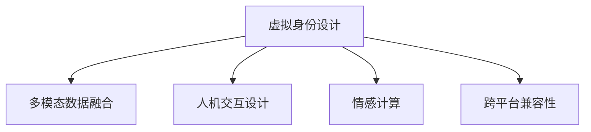

                 

# 虚拟身份设计师：AI时代的个人品牌塑造

> 关键词：虚拟身份设计, 人工智能, 个人品牌, 自我形象构建, 数字形象管理

## 1. 背景介绍

### 1.1 问题由来

在快速发展的数字时代，个人品牌的塑造已经成为了人们职业发展、社交互动、自我表达中不可或缺的一环。虚拟身份设计师，作为一个新兴职业，正逐渐崛起，运用人工智能技术帮助个人和组织在虚拟空间中构建和维护独特的数字形象。这一领域不仅关乎个人的职业形象，还涉及品牌策略、创意设计、技术实现等多个层面。

### 1.2 问题核心关键点

构建虚拟身份，不仅仅是设计一个视觉形象，更是通过多维度信息的整合，塑造一个在数字世界中具有辨识度、吸引力、说服力的统一形象。这涉及到：

- **形象设计**：如何根据用户需求和品牌定位，设计出具有个性化的虚拟形象。
- **信息融合**：如何将文本、图像、音频等多模态数据有效融合，形成一个完整的虚拟身份。
- **技术实现**：如何在不同的平台和场景中，实现虚拟身份的无缝展示。

### 1.3 问题研究意义

研究虚拟身份设计师的角色，对于理解AI技术如何辅助个人品牌塑造，提升个人职业竞争力，具有重要意义。通过深入探讨这一职业，可以：

1. **拓展AI应用领域**：了解AI技术在创意设计、信息融合、人机交互等新兴领域的潜力。
2. **提升职业发展**：为希望利用AI技术增强职业形象的个人提供方法和工具。
3. **促进技术普及**：帮助更多行业从业者了解和应用AI技术，推动技术普及。
4. **培养跨学科人才**：在AI、设计、市场营销等领域培养复合型人才，满足行业需求。

## 2. 核心概念与联系

### 2.1 核心概念概述

为更好地理解虚拟身份设计师的角色，本节将介绍几个密切相关的核心概念：

- **虚拟身份设计**：通过AI技术，结合用户需求和品牌定位，设计出能够在多个数字平台上展示的个性化虚拟形象。
- **多模态数据融合**：将文本、图像、音频等多种类型的数据进行有效整合，构建一个全面的虚拟身份。
- **人机交互设计**：设计用户与虚拟形象互动的方式，提升用户体验和交互质量。
- **情感计算**：通过分析用户行为和反馈，实时调整虚拟形象的情感表达，增强用户认同感。
- **跨平台兼容性**：确保虚拟形象在不同平台上的展示效果一致，提供无缝体验。

这些核心概念之间的逻辑关系可以通过以下Mermaid流程图来展示：



这个流程图展示虚拟身份设计师的角色涉及的关键任务和相关概念：

1. **虚拟身份设计**：从概念设计到最终呈现的整个流程。
2. **多模态数据融合**：技术实现的关键环节，涉及到数据的采集、处理和融合。
3. **人机交互设计**：提升用户体验的优化环节。
4. **情感计算**：增强用户互动的技术手段。
5. **跨平台兼容性**：保证一致性的技术挑战。

## 3. 核心算法原理 & 具体操作步骤
### 3.1 算法原理概述

虚拟身份设计师的角色需要利用AI技术，结合多学科知识，完成从概念设计到最终展示的全流程。其中，基于深度学习的多模态数据融合技术，是实现虚拟身份设计的核心。

### 3.2 算法步骤详解

以下是虚拟身份设计的主要步骤：

**Step 1: 需求分析与用户调研**
- 与用户进行深度交流，了解其职业背景、个性特征、品牌需求等关键信息。
- 分析用户需求，确定虚拟身份的核心价值点和设计方向。

**Step 2: 多模态数据采集与处理**
- 根据用户需求，收集相关的文本、图像、音频等多模态数据。
- 使用OCR、图像分割、语音识别等技术，对数据进行预处理。

**Step 3: 多模态数据融合**
- 通过深度学习模型，如CNN、RNN、GAN等，对不同模态的数据进行融合。
- 使用注意力机制、迁移学习等技术，增强融合效果，提升虚拟形象的全面性和准确性。

**Step 4: 人机交互设计**
- 设计自然语言处理(NLP)、语音识别、图像识别等技术，使虚拟形象能够与用户进行互动。
- 优化界面设计，提升用户体验，增强虚拟形象的亲和力和吸引力。

**Step 5: 情感计算**
- 通过情感分析、行为跟踪等技术，实时调整虚拟形象的情感表达。
- 确保情感表达符合用户期望，增强虚拟形象的互动性和真实感。

**Step 6: 跨平台兼容性**
- 设计API接口，确保虚拟形象在不同平台上的展示效果一致。
- 优化渲染效果，提升在不同设备上的用户体验。

### 3.3 算法优缺点

虚拟身份设计师采用的多模态数据融合技术具有以下优点：

1. **全面性**：通过多模态数据的融合，可以构建出更全面、更丰富的虚拟形象。
2. **准确性**：深度学习模型能够自动学习数据的特征，提高融合的准确性。
3. **动态性**：情感计算技术可以实时调整虚拟形象的情感表达，增强互动性和真实感。

同时，也存在一些局限性：

1. **数据依赖**：多模态数据融合的效果高度依赖于数据的质量和多样性。
2. **计算资源**：深度学习模型对计算资源的需求较高，可能影响项目的实施效率。
3. **技术门槛**：需要结合AI、设计、市场营销等多个领域的专业知识，技术门槛较高。

尽管存在这些局限性，但多模态数据融合技术在虚拟身份设计中具有不可替代的优势，能够显著提升虚拟形象的个性化和互动性。

### 3.4 算法应用领域

虚拟身份设计师的角色广泛应用于多个领域，包括但不限于：

- **企业品牌管理**：为企业设计虚拟CEO、虚拟代表，提升品牌形象和市场影响力。
- **个人职业发展**：帮助个人设计虚拟形象，提升社交媒体影响力，拓展职业机会。
- **影视娱乐**：为影视作品中的虚拟角色设计形象，增强故事情感和观众代入感。
- **教育培训**：设计虚拟讲师、虚拟助手，提升在线教育体验和学习效果。
- **游戏与虚拟现实**：设计虚拟角色，增强游戏或VR体验的沉浸感和互动性。

## 4. 数学模型和公式 & 详细讲解  
### 4.1 数学模型构建

虚拟身份设计涉及多个技术环节，下面以情感计算为例，构建数学模型。

假设用户与虚拟形象的交互数据为 $X=\{x_i\}_{i=1}^N$，其中 $x_i=(t_i,s_i)$ 表示在第 $i$ 次交互中，用户的文本和情感标签。情感标签 $s_i \in \{pos,neg,neu\}$ 表示用户情感的极性。

定义情感计算模型 $F$ 输出虚拟形象的情感表达 $y \in \{pos,neg,neu\}$，模型 $F$ 的损失函数为：

$$
\mathcal{L}(F) = \frac{1}{N}\sum_{i=1}^N \mathbb{1}(y \neq s_i)
$$

其中 $\mathbb{1}$ 为示性函数，当 $y$ 与 $s_i$ 不一致时，损失贡献为1，反之贡献为0。

### 4.2 公式推导过程

情感计算模型的训练过程可以通过监督学习实现。假设模型 $F$ 为一个二分类模型，其输出为 $y$ 的预测值 $y^*$，则损失函数 $\mathcal{L}(F)$ 可以表示为：

$$
\mathcal{L}(F) = \frac{1}{N}\sum_{i=1}^N \log (1+\exp(-y^*(s_i)))
$$

利用梯度下降等优化算法，最小化损失函数 $\mathcal{L}(F)$，更新模型参数 $\theta$，得到最终的情感计算模型。

### 4.3 案例分析与讲解

假设我们有一个虚拟客服，需要根据用户输入的文本，实时调整其情感表达。使用上述模型，我们可以训练一个基于文本情感分析的情感计算模型，使其能够预测用户的情感极性，并动态调整虚拟客服的情感表达。具体步骤如下：

1. 收集用户与虚拟客服的交互数据，包括用户的文本和情感标签。
2. 使用情感分析技术，将用户文本转换为情感标签。
3. 利用情感计算模型 $F$，预测虚拟客服的情感表达 $y^*$。
4. 根据 $y^*$ 和用户情感 $s_i$ 的差异，调整虚拟客服的情感表达。

通过这种方式，虚拟客服能够实时响应用户的情感变化，提升用户体验和互动质量。

## 5. 项目实践：代码实例和详细解释说明
### 5.1 开发环境搭建

在进行虚拟身份设计实践前，我们需要准备好开发环境。以下是使用Python进行PyTorch开发的环境配置流程：

1. 安装Anaconda：从官网下载并安装Anaconda，用于创建独立的Python环境。

2. 创建并激活虚拟环境：
```bash
conda create -n pytorch-env python=3.8 
conda activate pytorch-env
```

3. 安装PyTorch：根据CUDA版本，从官网获取对应的安装命令。例如：
```bash
conda install pytorch torchvision torchaudio cudatoolkit=11.1 -c pytorch -c conda-forge
```

4. 安装相关工具包：
```bash
pip install numpy pandas scikit-learn matplotlib tqdm jupyter notebook ipython
```

完成上述步骤后，即可在`pytorch-env`环境中开始虚拟身份设计的实践。

### 5.2 源代码详细实现

这里我们以情感计算模型的实现为例，展示一个基于PyTorch的情感计算模型的代码实现。

```python
import torch
import torch.nn as nn
import torch.optim as optim

class EmotionClassifier(nn.Module):
    def __init__(self, vocab_size, embedding_dim, hidden_dim):
        super(EmotionClassifier, self).__init__()
        self.embedding = nn.Embedding(vocab_size, embedding_dim)
        self.fc1 = nn.Linear(embedding_dim, hidden_dim)
        self.fc2 = nn.Linear(hidden_dim, 3)
        self.softmax = nn.Softmax(dim=1)
        
    def forward(self, x):
        x = self.embedding(x)
        x = torch.relu(self.fc1(x))
        x = self.fc2(x)
        return self.softmax(x)
    
def train_model(model, data_loader, epochs, learning_rate):
    optimizer = optim.Adam(model.parameters(), lr=learning_rate)
    criterion = nn.CrossEntropyLoss()
    
    for epoch in range(epochs):
        model.train()
        for i, (text, label) in enumerate(data_loader):
            optimizer.zero_grad()
            predictions = model(text)
            loss = criterion(predictions, label)
            loss.backward()
            optimizer.step()
            
    return model
```

### 5.3 代码解读与分析

让我们再详细解读一下关键代码的实现细节：

**EmotionClassifier类**：
- `__init__`方法：初始化模型结构，包括嵌入层、全连接层和Softmax输出层。
- `forward`方法：定义前向传播过程，通过多个线性层进行特征提取和分类。

**train_model函数**：
- 定义Adam优化器，选择交叉熵损失函数。
- 在每个epoch内，对每个批次数据进行前向传播和反向传播，更新模型参数。

**数据加载器**：
- 假设我们有一个包含文本和情感标签的数据集，使用PyTorch的数据加载器，将数据分批次加载到模型中。

通过上述代码，我们可以训练一个情感计算模型，并将其应用到虚拟客服的情感表达中。

### 5.4 运行结果展示

在实际应用中，我们可以通过可视化工具展示虚拟客服的情感表达效果。例如，使用TensorBoard记录训练过程中的各项指标，直观展示模型的训练进度和效果。

## 6. 实际应用场景
### 6.1 企业品牌管理

虚拟身份设计师在企业品牌管理中的应用，可以通过设计虚拟CEO、虚拟代表等形象，提升品牌形象和市场影响力。例如，某企业希望通过虚拟CEO进行线上直播，提升品牌知名度和用户互动率。设计师可以收集CEO的公开演讲视频、社交媒体互动数据等，构建CEO的虚拟形象，并通过AI技术进行实时互动和情感表达。

### 6.2 个人职业发展

虚拟身份设计师可以帮助个人设计虚拟形象，提升社交媒体影响力，拓展职业机会。例如，某职业经理人希望在LinkedIn上展示其专业形象，设计师可以为其设计一个专业的虚拟形象，包括头像、简介等，并在发布内容时使用情感计算技术，根据用户反馈实时调整形象的情感表达，增强用户互动。

### 6.3 影视娱乐

在影视娱乐领域，虚拟身份设计师可以为影视作品中的虚拟角色设计形象，增强故事情感和观众代入感。例如，某电影中的虚拟角色需要根据情节进行情感变化，设计师可以收集角色在不同情节中的对话和行为，构建虚拟角色的情感计算模型，使其能够实时调整情感表达，提升观众的沉浸感。

### 6.4 教育培训

在教育培训领域，虚拟身份设计师可以设计虚拟讲师、虚拟助手，提升在线教育体验和学习效果。例如，某在线教育平台希望通过虚拟讲师进行互动授课，设计师可以为讲师设计一个专业的虚拟形象，并在课程中引入情感计算技术，根据学生反馈实时调整讲师的情感表达，提升学生的学习体验。

### 6.5 游戏与虚拟现实

在游戏与虚拟现实领域，虚拟身份设计师可以设计虚拟角色，增强游戏或VR体验的沉浸感和互动性。例如，某游戏角色需要在不同情境中表现出不同的情感，设计师可以收集角色的对话和行为数据，构建虚拟角色的情感计算模型，使其能够根据情境变化实时调整情感表达，提升游戏的互动性和沉浸感。

## 7. 工具和资源推荐
### 7.1 学习资源推荐

为了帮助开发者系统掌握虚拟身份设计的理论基础和实践技巧，这里推荐一些优质的学习资源：

1. 《深度学习理论与实践》系列博文：由深度学习专家撰写，深入浅出地介绍了深度学习的基础理论、模型构建和应用场景。

2. 《计算机视觉基础》课程：斯坦福大学开设的计算机视觉课程，涵盖图像处理、深度学习等内容，是学习多模态数据融合的重要基础。

3. 《情感计算基础》书籍：介绍情感计算的基本原理和应用，适合对情感计算技术感兴趣的读者。

4. 《情感计算工具箱》工具包：提供了情感分析、情感计算等工具，方便进行情感计算模型的实验和优化。

5. 《自然语言处理与深度学习》在线课程：由斯坦福大学教授讲授，涵盖自然语言处理和深度学习的基本概念和前沿技术。

通过对这些资源的学习实践，相信你一定能够快速掌握虚拟身份设计的精髓，并用于解决实际的AI应用问题。

### 7.2 开发工具推荐

高效的开发离不开优秀的工具支持。以下是几款用于虚拟身份设计开发的常用工具：

1. PyTorch：基于Python的开源深度学习框架，灵活动态的计算图，适合快速迭代研究。支持多模态数据融合和情感计算等任务的实现。

2. TensorFlow：由Google主导开发的开源深度学习框架，生产部署方便，适合大规模工程应用。提供了丰富的工具和库，支持多模态数据融合和情感计算等任务的实现。

3. Transformers库：HuggingFace开发的NLP工具库，集成了众多SOTA语言模型，支持PyTorch和TensorFlow，是进行虚拟身份设计的利器。

4. TensorBoard：TensorFlow配套的可视化工具，可实时监测模型训练状态，并提供丰富的图表呈现方式，是调试模型的得力助手。

5. Weights & Biases：模型训练的实验跟踪工具，可以记录和可视化模型训练过程中的各项指标，方便对比和调优。与主流深度学习框架无缝集成。

6. Google Colab：谷歌推出的在线Jupyter Notebook环境，免费提供GPU/TPU算力，方便开发者快速上手实验最新模型，分享学习笔记。

合理利用这些工具，可以显著提升虚拟身份设计的开发效率，加快创新迭代的步伐。

### 7.3 相关论文推荐

虚拟身份设计师的角色涉及多学科知识的综合运用，以下是几篇奠基性的相关论文，推荐阅读：

1. "AI-Powered Personal Branding: A Survey"：总结了AI技术在个人品牌塑造中的应用，分析了相关技术和工具。

2. "Multi-Modal Data Fusion for Virtual Identity Design"：介绍多模态数据融合技术，探讨其在虚拟身份设计中的作用和效果。

3. "Emotion AI in Virtual Characters"：分析情感计算技术在虚拟角色设计中的应用，提出了一些关键算法和模型。

4. "Designing Virtual Assists for E-Learning"：探讨虚拟助手的应用，介绍了如何利用AI技术提升在线教育体验。

5. "Virtual Characters in Video Games"：讨论虚拟角色在游戏中的应用，介绍了一些关键技术和设计思路。

这些论文代表了大语言模型微调技术的发展脉络。通过学习这些前沿成果，可以帮助研究者把握学科前进方向，激发更多的创新灵感。

## 8. 总结：未来发展趋势与挑战
### 8.1 总结

本文对虚拟身份设计师的角色进行了全面系统的介绍。首先阐述了虚拟身份设计的重要性和应用前景，明确了虚拟身份设计师在AI技术辅助个人品牌塑造中的独特价值。其次，从原理到实践，详细讲解了多模态数据融合、情感计算等核心技术的数学原理和关键步骤，给出了虚拟身份设计任务开发的完整代码实例。同时，本文还广泛探讨了虚拟身份设计师在多个行业领域的应用前景，展示了AI技术在虚拟身份设计中的广泛应用。

通过本文的系统梳理，可以看到，虚拟身份设计师的角色结合了AI技术、设计创意和市场营销等多个领域的知识，是一个跨学科的复合型职业。虚拟身份设计师的应用，不仅提升了个人的职业形象和品牌价值，也推动了AI技术在多个领域的普及和应用。

### 8.2 未来发展趋势

展望未来，虚拟身份设计师的角色将呈现以下几个发展趋势：

1. **技术融合**：未来，虚拟身份设计师将更多地结合AI技术与创意设计，推出更加生动、个性化的虚拟形象。例如，结合图像生成技术，自动设计虚拟形象的服装、发型等。
2. **跨平台普及**：随着技术的不断进步，虚拟身份设计师将能够设计出在多个平台和场景中展示效果一致的虚拟形象，提供无缝体验。
3. **情感智能增强**：情感计算技术将进一步发展，增强虚拟形象的情感表达能力，使其更加贴合用户需求。
4. **个性化定制**：基于用户数据的深度分析，虚拟身份设计师将能够提供更加个性化的虚拟形象设计服务，提升用户体验。
5. **行业应用拓展**：虚拟身份设计师将在更多行业领域中得到应用，如医疗、法律、金融等，帮助这些领域提升品牌形象和用户互动。

以上趋势凸显了虚拟身份设计师角色的重要性和发展潜力。未来的研究需要在AI技术、设计创意、市场策略等多个方面进行深入探索，以满足不断增长的需求。

### 8.3 面临的挑战

尽管虚拟身份设计师的角色前景广阔，但在迈向更加智能化、普适化应用的过程中，仍面临诸多挑战：

1. **数据隐私**：在收集和处理用户数据时，需要严格遵守数据隐私法规，确保用户信息的保密和安全。
2. **技术门槛**：虚拟身份设计师需要具备跨学科的知识和技能，技术门槛较高。需要更多的教育和培训资源支持。
3. **用户体验**：虚拟形象的设计需要符合用户期望，提升用户体验。如何在不同平台和场景中提供一致的体验，需要持续优化和改进。
4. **成本控制**：大规模设计虚拟形象需要投入大量的计算资源和时间，如何降低成本，提高效率，是实际应用中的重要问题。
5. **伦理道德**：在虚拟身份设计中，需要考虑伦理和道德问题，确保虚拟形象的设计和使用符合社会价值观。

这些挑战需要行业各方共同努力，逐步解决，才能推动虚拟身份设计师角色的普及和应用。

### 8.4 研究展望

面向未来，虚拟身份设计师的研究需要在以下几个方面寻求新的突破：

1. **AI与创意结合**：进一步探索AI技术在创意设计中的应用，提升虚拟形象的个性化和互动性。
2. **跨模态融合**：结合图像、视频、音频等多模态数据，设计更加全面、立体的虚拟形象。
3. **情感计算优化**：研究情感计算的优化算法，提高情感表达的准确性和自然性。
4. **隐私保护技术**：开发隐私保护技术，确保用户数据的保密和安全。
5. **自动化设计工具**：开发自动化设计工具，降低技术门槛，提升设计效率。
6. **跨领域应用**：推动虚拟身份设计师在更多行业领域的应用，提升行业整体的数字化水平。

这些研究方向将为虚拟身份设计师的角色带来新的发展机遇，推动AI技术在个人品牌塑造、市场推广等方面的深入应用。

## 9. 附录：常见问题与解答

**Q1：虚拟身份设计师需要哪些关键技能？**

A: 虚拟身份设计师需要具备以下关键技能：
1. **AI技术知识**：掌握深度学习、多模态数据融合、情感计算等技术。
2. **设计创意**：具备创意设计和用户心理分析的能力。
3. **市场营销**：了解品牌策略和用户需求，能够根据用户需求设计虚拟形象。
4. **跨平台技术**：熟悉不同平台的技术实现和接口设计。
5. **项目管理和沟通**：能够与用户、开发团队和市场部门进行有效沟通和协作。

**Q2：如何设计一个高质量的虚拟形象？**

A: 设计高质量的虚拟形象需要遵循以下步骤：
1. **需求分析**：与用户进行深度交流，了解其职业背景、个性特征、品牌需求等关键信息。
2. **多模态数据采集**：根据用户需求，收集相关的文本、图像、音频等多模态数据。
3. **数据预处理**：使用OCR、图像分割、语音识别等技术，对数据进行预处理。
4. **模型训练**：使用深度学习模型进行多模态数据融合，训练情感计算模型。
5. **测试与优化**：在测试集上评估模型效果，根据反馈进行优化调整。
6. **发布与维护**：将模型部署到实际应用中，并根据用户反馈进行持续优化。

**Q3：如何提升虚拟形象的互动性和自然性？**

A: 提升虚拟形象的互动性和自然性需要以下几个方面的努力：
1. **情感计算技术**：使用情感计算技术，根据用户反馈实时调整虚拟形象的情感表达。
2. **多模态数据融合**：结合文本、图像、音频等多模态数据，设计全面、立体的虚拟形象。
3. **自然语言处理**：使用自然语言处理技术，提升虚拟形象的理解能力和回复质量。
4. **人机交互设计**：设计自然语言处理(NLP)、语音识别、图像识别等技术，使虚拟形象能够与用户进行互动。
5. **用户个性化**：根据用户行为和偏好，动态调整虚拟形象的设计，提升用户的认同感和满意度。

**Q4：虚拟身份设计师如何处理数据隐私问题？**

A: 处理数据隐私问题需要以下几个方面的考虑：
1. **数据匿名化**：在数据收集和处理过程中，使用匿名化技术，确保用户信息的安全。
2. **隐私保护技术**：开发隐私保护技术，如差分隐私、联邦学习等，保护用户数据的安全。
3. **用户知情同意**：在数据收集和使用前，明确告知用户数据的使用目的和方式，获取用户知情同意。
4. **数据最小化**：仅收集必要的数据，避免过度收集和滥用用户数据。

**Q5：虚拟身份设计师在实际应用中需要注意哪些问题？**

A: 虚拟身份设计师在实际应用中需要注意以下几个问题：
1. **技术实现**：确保虚拟形象在不同平台上的展示效果一致，提供无缝体验。
2. **用户体验**：设计自然语言处理(NLP)、语音识别、图像识别等技术，提升虚拟形象的互动性和自然性。
3. **成本控制**：大规模设计虚拟形象需要投入大量的计算资源和时间，需要优化算法和设计流程，降低成本。
4. **伦理道德**：在虚拟形象设计中，需要考虑伦理和道德问题，确保虚拟形象的使用符合社会价值观。
5. **用户反馈**：根据用户反馈，持续优化虚拟形象的设计和互动方式，提升用户体验。

通过以上问题的解答，相信你能够更好地理解虚拟身份设计师的角色和应用，为未来的发展做好准备。

---

作者：禅与计算机程序设计艺术 / Zen and the Art of Computer Programming

