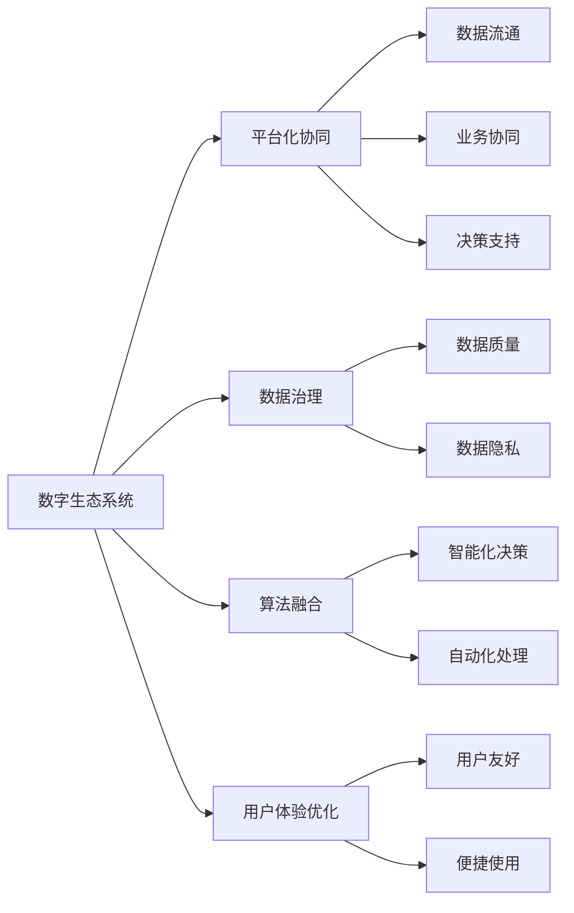

                 

## 1. 背景介绍

### 1.1 问题由来
当前，我们正处于一个数字化转型的关键时期，人工智能（AI）正在逐步渗透到各行各业，成为驱动数字经济的重要引擎。然而，传统的信息技术架构和技术体系，在应对AI带来的挑战和机遇时，存在诸多不足。无论是业务流程的自动化、数据的实时处理，还是复杂决策的智能化，都亟需新的架构和技术创新，以构建更加智能、灵活、高效的数字生态系统。

### 1.2 问题核心关键点
构建AI驱动的数字生态系统，关键在于以下几点：

- **数据驱动**：数字化转型离不开数据的全面采集、处理和分析，只有充分挖掘数据价值，才能实现业务的智能化升级。
- **平台化协同**：打破传统的烟囱式架构，通过统一的平台，实现业务组件的集成和协同，提升整体运行效率。
- **AI算法融合**：AI技术与传统信息技术体系的深度融合，能够提升决策的精准性和响应速度，实现智能化的业务管理。
- **系统安全性**：数字生态系统需要高度安全可靠，保障数据隐私、业务连续性和系统的稳定性。
- **用户体验优化**：以用户为中心，通过优化用户体验，增强系统的易用性和便捷性。

### 1.3 问题研究意义
构建AI驱动的数字生态系统，对于推动数字化转型、促进创新创业、提升产业竞争力，具有重要意义：

1. **提升效率与精度**：AI算法能够处理大量复杂数据，快速提供准确的分析结果，大幅提升业务运营的效率和精度。
2. **创新业务模式**：通过AI技术的应用，可以创新业务模式，开辟新的收入来源和市场空间。
3. **优化决策支持**：基于数据驱动的AI决策支持系统，能够提供实时的、全局最优的决策建议，帮助企业应对市场变化。
4. **增强竞争优势**：通过构建智能化、灵活化的数字生态系统，提升企业的核心竞争力，占据市场先机。
5. **促进产业升级**：AI技术的应用，可以加速传统产业的数字化、智能化转型，推动产业升级。

## 2. 核心概念与联系

### 2.1 核心概念概述

为更好地理解AI驱动的数字生态系统，本节将介绍几个关键概念：

- **数字生态系统**：由各类数字化组件和基础设施构成的整体，通过平台化协同，实现数据的无缝流动、业务的协同运作和AI算法的深度融合。
- **AI驱动**：通过AI技术，实现数据的高效处理、决策的精准化，提升系统的智能化水平。
- **数据治理**：在数字生态系统中，数据的采集、存储、处理、共享、利用等环节，需要建立健全的管理和治理机制，确保数据的安全、准确和有效。
- **平台化协同**：通过统一的平台，打破烟囱式架构，实现业务组件的集成和协同，提升整体运行效率。
- **算法融合**：将AI算法与业务流程深度结合，实现智能化决策、自动化处理，提升业务效率和质量。
- **用户体验优化**：以用户为中心，通过优化用户体验，增强系统的易用性和便捷性。

这些核心概念之间存在着密切的联系，通过平台化协同和算法融合，实现数据的高效利用和AI技术的深度应用，最终提升用户体验和业务效率。以下通过Mermaid流程图展示了这些概念之间的联系：



这个流程图展示了数字生态系统中的核心组件及其相互关系，通过数据治理和平台化协同，确保数据的有效流动和业务组件的深度集成，最终通过算法融合和用户体验优化，实现系统的智能化和高效运作。

## 3. 核心算法原理 & 具体操作步骤

### 3.1 算法原理概述

AI驱动的数字生态系统，本质上是基于AI技术的深度融合和应用，其实现原理包括以下几个关键点：

1. **数据集成**：将分散在不同业务组件中的数据进行统一管理和整合，建立完整的数据视图，为AI算法的应用提供基础。
2. **算法模型训练**：基于数据集，通过机器学习、深度学习等AI算法，训练出精准的预测和决策模型。
3. **模型部署与应用**：将训练好的模型部署到生产环境中，实现业务流程的智能化决策和自动化处理。
4. **系统监控与优化**：实时监控系统的运行情况，通过数据分析和反馈机制，持续优化模型的性能和系统的运行效率。

### 3.2 算法步骤详解

基于AI技术的数字生态系统构建，一般包括以下几个关键步骤：

**Step 1: 数据集成与治理**

1. **数据采集**：通过API、ETL工具等，从各个业务系统采集数据，建立统一的数据源。
2. **数据清洗与转换**：对采集的数据进行清洗、去重、转换，确保数据的准确性和一致性。
3. **数据标准化**：建立统一的数据标准和规范，确保数据的一致性和互操作性。
4. **数据存储与管理**：通过分布式数据库、数据湖等技术，实现数据的集中存储和管理。

**Step 2: 算法模型训练**

1. **数据预处理**：对数据进行分词、特征提取等预处理操作，为模型训练做好准备。
2. **模型训练**：选择合适的AI算法，如机器学习、深度学习等，基于预处理后的数据进行模型训练。
3. **模型评估与优化**：通过交叉验证、A/B测试等手段，评估模型的性能，并根据反馈进行模型优化。

**Step 3: 模型部署与应用**

1. **模型导出与打包**：将训练好的模型导出，并打包成可部署的格式。
2. **服务部署**：通过微服务、Docker容器等技术，将模型部署到生产环境中。
3. **业务集成**：将模型与其他业务组件集成，实现业务流程的智能化决策和自动化处理。

**Step 4: 系统监控与优化**

1. **监控指标定义**：定义系统的监控指标，如性能指标、资源消耗、故障率等。
2. **实时监控**：通过实时监控工具，收集系统的运行数据，分析系统的性能和状态。
3. **异常检测与预警**：设置异常检测机制，及时发现系统异常，并发出预警。
4. **持续优化**：根据监控数据和用户反馈，持续优化系统的性能和稳定性。

### 3.3 算法优缺点

AI驱动的数字生态系统，具有以下优点：

1. **高效性**：通过AI算法，能够快速处理大量数据，提供精准的决策支持。
2. **灵活性**：平台化协同和数据治理机制，使得系统能够快速适应业务变化，实现灵活化运作。
3. **智能化**：基于数据驱动的AI决策支持系统，能够提供实时的、全局最优的决策建议。
4. **安全性**：通过数据加密、访问控制等技术，保障数据和系统的安全性。

同时，该系统也存在一些缺点：

1. **初始成本高**：构建AI驱动的数字生态系统，需要投入大量的人力、物力和财力，初始成本较高。
2. **技术复杂度高**：涉及数据治理、算法模型训练、模型部署等多个环节，技术难度较大。
3. **数据隐私问题**：在数据共享和应用过程中，可能存在数据隐私泄露的风险。
4. **模型泛化能力不足**：部分模型可能存在过拟合现象，泛化能力有限。

尽管存在这些局限性，但AI驱动的数字生态系统已经在金融、医疗、制造等多个领域得到了广泛应用，并展示了巨大的潜力。未来，随着技术的进步和应用的深入，这些挑战将被逐步克服。

### 3.4 算法应用领域

AI驱动的数字生态系统，在多个领域都有广泛的应用，包括但不限于：

1. **金融行业**：通过AI技术，实现风险评估、信用评分、反欺诈检测等智能化应用。
2. **医疗健康**：通过AI算法，进行疾病预测、诊疗辅助、智能诊断等，提升医疗服务水平。
3. **制造业**：通过AI驱动的生产线优化、质量控制、供应链管理等，实现智能制造。
4. **零售电商**：通过AI技术，进行商品推荐、库存管理、客户行为分析等，提升运营效率。
5. **智能家居**：通过AI算法，实现语音识别、环境感知、智能控制等功能，提升用户体验。
6. **智慧城市**：通过AI技术，实现交通管理、环境监测、公共安全等，提升城市管理水平。

这些应用领域展示了AI驱动数字生态系统的强大能力和广泛前景，未来还将拓展到更多行业和场景，为社会带来深远影响。

## 4. 数学模型和公式 & 详细讲解  
### 4.1 数学模型构建

在AI驱动的数字生态系统中，数学模型构建是核心环节之一。以金融风险评估为例，构建数学模型的步骤如下：

1. **数据准备**：收集历史交易数据、市场数据、用户数据等，建立数据集。
2. **特征工程**：对数据进行特征提取、降维等操作，生成特征向量。
3. **模型训练**：基于训练数据集，选择合适的机器学习算法，如逻辑回归、随机森林等，进行模型训练。
4. **模型评估**：使用测试数据集评估模型性能，如准确率、召回率、F1分数等。
5. **模型优化**：根据评估结果，优化模型参数和结构，提升模型性能。

以逻辑回归为例，其数学模型构建如下：

$$
y = \beta_0 + \beta_1 x_1 + \beta_2 x_2 + ... + \beta_n x_n
$$

其中 $y$ 表示预测结果，$x_i$ 表示输入特征，$\beta_i$ 表示模型参数。

### 4.2 公式推导过程

逻辑回归的公式推导过程如下：

1. **假设函数**：假设输出结果 $y$ 是输入特征 $x$ 的线性组合，即 $y = \beta_0 + \beta_1 x_1 + \beta_2 x_2 + ... + \beta_n x_n$。
2. **损失函数**：引入交叉熵损失函数 $L(y, \hat{y}) = -(y \log \hat{y} + (1-y) \log(1-\hat{y}))$，其中 $\hat{y}$ 表示模型预测结果。
3. **梯度下降**：通过梯度下降算法更新模型参数，使得损失函数最小化。

### 4.3 案例分析与讲解

以金融风控系统为例，分析其数学模型构建和优化过程：

**Step 1: 数据准备**
收集历史交易数据、市场数据、用户数据等，建立数据集。

**Step 2: 特征工程**
对数据进行特征提取、降维等操作，生成特征向量。例如，将交易金额、时间戳、用户行为等数据，转化为模型的输入特征。

**Step 3: 模型训练**
基于训练数据集，使用逻辑回归算法进行模型训练。例如，使用梯度下降算法更新模型参数，最小化交叉熵损失函数。

**Step 4: 模型评估**
使用测试数据集评估模型性能，如准确率、召回率、F1分数等。例如，在测试集上计算模型对新交易的分类准确率。

**Step 5: 模型优化**
根据评估结果，优化模型参数和结构，提升模型性能。例如，通过调整特征权重、引入正则化等手段，提升模型的泛化能力和鲁棒性。

## 5. 项目实践：代码实例和详细解释说明

### 5.1 开发环境搭建

在进行AI驱动的数字生态系统构建时，开发环境搭建是第一步。以下是使用Python进行TensorFlow开发的开发环境配置流程：

1. 安装Anaconda：从官网下载并安装Anaconda，用于创建独立的Python环境。

2. 创建并激活虚拟环境：
```bash
conda create -n tf-env python=3.8 
conda activate tf-env
```

3. 安装TensorFlow：根据CUDA版本，从官网获取对应的安装命令。例如：
```bash
conda install tensorflow tensorflow-gpu cudatoolkit=11.1 -c conda-forge
```

4. 安装各类工具包：
```bash
pip install numpy pandas scikit-learn matplotlib tqdm jupyter notebook ipython
```

完成上述步骤后，即可在`tf-env`环境中开始AI驱动数字生态系统的构建实践。

### 5.2 源代码详细实现

下面我们以金融风险评估项目为例，给出使用TensorFlow进行逻辑回归模型训练的PyTorch代码实现。

首先，定义数据集：

```python
import tensorflow as tf
from tensorflow.keras.datasets import mnist
from tensorflow.keras.utils import to_categorical

(x_train, y_train), (x_test, y_test) = mnist.load_data()
x_train = x_train.reshape(-1, 28*28).astype('float32') / 255.0
x_test = x_test.reshape(-1, 28*28).astype('float32') / 255.0
y_train = to_categorical(y_train, num_classes=10)
y_test = to_categorical(y_test, num_classes=10)
```

然后，定义模型和优化器：

```python
from tensorflow.keras import layers, models

model = models.Sequential()
model.add(layers.Dense(128, activation='relu', input_shape=(28*28,)))
model.add(layers.Dense(10, activation='softmax'))

optimizer = tf.keras.optimizers.Adam(learning_rate=0.01)
```

接着，定义训练和评估函数：

```python
from tensorflow.keras import metrics

def train_epoch(model, dataset, batch_size, optimizer):
    model.compile(optimizer=optimizer, loss='categorical_crossentropy', metrics=['accuracy'])
    model.fit(dataset, batch_size=batch_size, epochs=1, verbose=0)
    return model.evaluate(dataset)

def evaluate(model, dataset, batch_size):
    return model.evaluate(dataset, batch_size=batch_size, verbose=0)
```

最后，启动训练流程并在测试集上评估：

```python
epochs = 10
batch_size = 128

for epoch in range(epochs):
    loss, accuracy = train_epoch(model, (x_train, y_train), batch_size, optimizer)
    print(f"Epoch {epoch+1}, train loss: {loss:.3f}, train accuracy: {accuracy:.3f}")
    
print(f"Epoch {epoch+1}, dev results:")
evaluate(model, (x_test, y_test), batch_size)
```

以上就是使用TensorFlow进行金融风险评估项目的完整代码实现。可以看到，借助TensorFlow的强大封装，我们可以用相对简洁的代码完成模型的训练和评估。

### 5.3 代码解读与分析

让我们再详细解读一下关键代码的实现细节：

**数据集定义**：
- `mnist.load_data()`：加载手写数字数据集。
- `to_categorical()`：将标签向量转化为one-hot编码，方便模型训练。

**模型定义**：
- `Sequential`：创建序列模型，按顺序添加层。
- `Dense`：添加全连接层，激活函数为ReLU。
- `softmax`：添加softmax激活函数，输出概率分布。

**优化器定义**：
- `Adam`：使用Adam优化器，学习率为0.01。

**训练函数**：
- `model.compile()`：编译模型，定义损失函数和评估指标。
- `model.fit()`：使用训练数据集进行模型训练，设定批量大小和轮数。
- `model.evaluate()`：在测试数据集上评估模型性能，返回损失和准确率。

**训练流程**：
- 定义总的轮数和批量大小，开始循环迭代。
- 每个轮次内，先在训练集上训练，输出损失和准确率。
- 在测试集上评估模型性能，输出准确率。
- 所有轮次结束后，给出最终评估结果。

可以看到，TensorFlow通过强大的API封装，使得模型训练和评估的过程变得简单高效。开发者可以专注于算法和业务逻辑，而不必过多关注底层实现细节。

## 6. 实际应用场景

### 6.1 智能客服系统

AI驱动的数字生态系统在智能客服系统中的应用，可以显著提升客户服务质量。传统的客服系统依赖于人工客服，存在响应速度慢、服务质量不稳定等问题。通过AI驱动的系统，可以实现7x24小时不间断服务，快速响应客户咨询，提升用户体验。

具体实现上，可以收集企业内部的历史客服对话记录，将问题和最佳答复构建成监督数据，在此基础上训练AI模型。训练好的模型可以自动理解用户意图，匹配最合适的答案模板进行回复。对于客户提出的新问题，还可以接入检索系统实时搜索相关内容，动态组织生成回答。如此构建的智能客服系统，能大幅提升客户咨询体验和问题解决效率。

### 6.2 金融风险管理系统

金融风险管理系统通过AI技术，实现风险评估、信用评分、反欺诈检测等智能化应用，可以有效降低金融机构的运营风险。

具体实现上，可以收集历史交易数据、市场数据、用户数据等，建立数据集。通过逻辑回归、随机森林等算法，训练出精准的风险评估模型。模型可以在新交易发生时，自动评估其风险等级，提供决策支持。同时，系统还可以实时监控交易行为，发现异常交易并发出预警，防范金融风险。

### 6.3 智能制造系统

AI驱动的数字生态系统在智能制造中的应用，可以实现生产线优化、质量控制、供应链管理等，提高生产效率和产品质量。

具体实现上，可以收集生产数据、设备数据、工人数据等，建立数据集。通过机器学习、深度学习等算法，训练出精准的生产线优化和质量控制模型。模型可以实时分析生产线状态，优化生产计划，提高生产效率。同时，系统还可以检测设备故障、优化供应链管理，保障生产的稳定性。

### 6.4 未来应用展望

随着AI技术的不断发展，基于AI驱动的数字生态系统将在更多领域得到应用，为社会带来深远影响。

1. **智慧城市**：通过AI技术，实现交通管理、环境监测、公共安全等，提升城市管理水平。
2. **智能医疗**：通过AI算法，进行疾病预测、诊疗辅助、智能诊断等，提升医疗服务水平。
3. **智能教育**：通过AI技术，进行个性化推荐、智能辅导、作业批改等，提升教育质量。
4. **智能家居**：通过AI算法，实现语音识别、环境感知、智能控制等功能，提升用户体验。
5. **智能物流**：通过AI技术，优化物流路线、预测货物需求、智能仓储管理等，提高物流效率。
6. **智能农业**：通过AI算法，进行农作物病虫害检测、土壤分析、智能灌溉等，提高农业生产效率。

未来，AI驱动的数字生态系统将更加全面和深入地渗透到各个领域，为社会带来更多的创新和便利。

## 7. 工具和资源推荐

### 7.1 学习资源推荐

为了帮助开发者系统掌握AI驱动的数字生态系统的理论基础和实践技巧，这里推荐一些优质的学习资源：

1. TensorFlow官方文档：TensorFlow的官方文档，提供了详细的API文档、教程和示例，适合初学者和高级开发者学习。
2. PyTorch官方文档：PyTorch的官方文档，介绍了PyTorch的原理、API和应用场景，适合深度学习开发者的学习。
3. Keras官方文档：Keras的官方文档，提供了简单易用的API封装，适合快速上手深度学习任务开发。
4. Coursera深度学习课程：Coursera与斯坦福大学合作的深度学习课程，系统讲解了深度学习的理论和实践，适合入门和进阶学习。
5. DeepLearning.AI课程：DeepLearning.AI提供的深度学习课程，涵盖深度学习的基础理论和应用实践，适合深度学习开发者的学习。
6. Google AI博客：Google AI的博客，分享了最新的AI研究成果和应用案例，适合了解前沿技术动态。

通过对这些资源的学习实践，相信你一定能够快速掌握AI驱动数字生态系统的精髓，并用于解决实际的业务问题。

### 7.2 开发工具推荐

高效的开发离不开优秀的工具支持。以下是几款用于AI驱动数字生态系统开发的常用工具：

1. TensorFlow：由Google主导开发的开源深度学习框架，生产部署方便，适合大规模工程应用。
2. PyTorch：基于Python的开源深度学习框架，灵活的动态计算图，适合快速迭代研究。
3. Keras：基于TensorFlow和Theano等底层框架的高级API封装，提供简单易用的API接口。
4. Weights & Biases：模型训练的实验跟踪工具，可以记录和可视化模型训练过程中的各项指标，方便对比和调优。
5. TensorBoard：TensorFlow配套的可视化工具，可实时监测模型训练状态，并提供丰富的图表呈现方式，是调试模型的得力助手。
6. Jupyter Notebook：交互式笔记本工具，支持Python等语言，方便编写、测试和分享代码。

合理利用这些工具，可以显著提升AI驱动数字生态系统的开发效率，加快创新迭代的步伐。

### 7.3 相关论文推荐

AI驱动的数字生态系统的发展源于学界的持续研究。以下是几篇奠基性的相关论文，推荐阅读：

1. TensorFlow: A System for Large-Scale Machine Learning：Google主导的TensorFlow项目，介绍了TensorFlow的架构和应用。
2. Keras: Deep Learning for humans：Keras项目，提供了简单易用的API封装，适合快速上手深度学习任务开发。
3. Deep Learning：Ian Goodfellow等人合著的深度学习经典教材，系统讲解了深度学习的理论基础和实践应用。
4. Reinforcement Learning：Sutton和Barto合著的强化学习经典教材，介绍了强化学习的理论基础和应用实践。
5. Generative Adversarial Networks：Goodfellow等人提出的生成对抗网络，成为近年来AI领域的热点研究方向。
6. AlphaGo Zero：DeepMind发布的AlphaGo Zero项目，通过自我博弈的方式，实现了在复杂博弈中取得最优策略的能力。

这些论文代表了大数据驱动数字生态系统的研究方向，通过学习这些前沿成果，可以帮助研究者把握学科前进方向，激发更多的创新灵感。

## 8. 总结：未来发展趋势与挑战

### 8.1 总结

本文对AI驱动的数字生态系统进行了全面系统的介绍。首先阐述了AI驱动数字生态系统的研究背景和意义，明确了平台化协同、数据治理、算法融合、用户体验优化等关键要素。其次，从原理到实践，详细讲解了AI算法的构建和应用流程，给出了金融风险评估项目的完整代码实现。同时，本文还广泛探讨了AI驱动数字生态系统在智能客服、金融风险管理、智能制造等多个行业领域的应用前景，展示了其广阔的应用空间。此外，本文精选了AI驱动数字生态系统的学习资源、开发工具和相关论文，力求为读者提供全方位的技术指引。

通过本文的系统梳理，可以看到，AI驱动的数字生态系统正在成为各行各业数字化转型的重要引擎，极大地提升了业务运营的效率和智能化水平。未来，伴随AI技术的不断进步和应用的深入，这些系统必将进一步拓展其应用边界，为社会带来更大的价值。

### 8.2 未来发展趋势

展望未来，AI驱动的数字生态系统将呈现以下几个发展趋势：

1. **技术融合加速**：AI技术与传统信息技术体系的深度融合，将推动更多行业实现数字化、智能化转型。
2. **数据治理完善**：随着数据量的不断增长，数据治理机制将逐步完善，确保数据的安全和高质量。
3. **智能化决策提升**：基于AI算法的决策支持系统将更加精准和可靠，提升业务运营的智能化水平。
4. **多模态数据整合**：未来的AI系统将支持更多数据类型和模态，实现全面、准确的信息整合。
5. **持续学习优化**：通过持续学习机制，AI系统将不断适应新环境和新需求，提升系统的稳定性和鲁棒性。
6. **系统安全性增强**：随着AI技术的应用，数据隐私和系统安全问题将受到更多关注，未来的AI系统将具备更强的安全防护能力。

这些趋势凸显了AI驱动数字生态系统的广阔前景，预示着未来将有更多的行业和应用场景受益于AI技术。

### 8.3 面临的挑战

尽管AI驱动的数字生态系统已经取得显著成果，但在迈向更加智能化、普适化应用的过程中，仍面临诸多挑战：

1. **初始成本高**：构建AI驱动的数字生态系统，需要大量的人力、物力和财力投入，初始成本较高。
2. **技术复杂度高**：涉及数据治理、算法模型训练、模型部署等多个环节，技术难度较大。
3. **数据隐私问题**：在数据共享和应用过程中，可能存在数据隐私泄露的风险。
4. **模型泛化能力不足**：部分模型可能存在过拟合现象，泛化能力有限。
5. **系统安全性问题**：随着AI技术的应用，数据隐私和系统安全问题将受到更多关注，未来的AI系统将面临更高的安全防护要求。
6. **模型透明性和可解释性不足**：当前AI模型的决策过程缺乏可解释性，难以对其推理逻辑进行分析和调试。

这些挑战需要通过持续的技术创新和优化，逐步解决，才能使AI驱动的数字生态系统真正落地应用，发挥其应有的价值。

### 8.4 研究展望

面对AI驱动数字生态系统所面临的挑战，未来的研究需要在以下几个方面寻求新的突破：

1. **无监督和半监督学习**：探索无监督和半监督学习算法，摆脱对大规模标注数据的依赖，最大限度利用非结构化数据，实现更加灵活高效的AI系统。
2. **持续学习与在线优化**：引入持续学习机制，使AI系统能够不断适应新环境和新需求，提升系统的稳定性和鲁棒性。
3. **多模态数据融合**：通过多模态数据融合技术，实现视觉、语音、文本等不同类型数据的协同处理和分析，提升AI系统的全面性和准确性。
4. **模型透明性与可解释性**：通过可解释性研究，提升AI模型的透明性和可解释性，增强系统的可信度和用户信任度。
5. **安全与隐私保护**：引入隐私保护和数据安全机制，保障数据隐私和系统安全，确保AI系统的可靠性和可控性。
6. **跨领域应用推广**：推动AI技术在更多行业和领域的应用，通过跨领域应用的推广，实现AI技术的广泛普及和深入应用。

这些研究方向的探索，必将引领AI驱动数字生态系统迈向更高的台阶，为构建安全、可靠、可解释、可控的智能系统铺平道路。面向未来，AI驱动数字生态系统还需要与其他人工智能技术进行更深入的融合，如知识表示、因果推理、强化学习等，多路径协同发力，共同推动自然语言理解和智能交互系统的进步。只有勇于创新、敢于突破，才能不断拓展AI驱动数字生态系统的边界，让智能技术更好地造福人类社会。

## 9. 附录：常见问题与解答

**Q1：AI驱动的数字生态系统是否适用于所有行业？**

A: AI驱动的数字生态系统，适用于数据丰富、业务流程可数字化的行业。但对于一些特定领域，如医学、法律等，传统的数据采集和处理方式可能难以满足AI系统的高要求，需要进一步优化和改进。

**Q2：构建AI驱动的数字生态系统需要哪些关键技术？**

A: 构建AI驱动的数字生态系统需要以下关键技术：
1. 数据治理：确保数据的高质量、一致性和安全性。
2. 平台化协同：通过统一的平台，实现业务组件的集成和协同，提升整体运行效率。
3. 算法融合：将AI算法与业务流程深度结合，实现智能化决策和自动化处理。
4. 系统监控与优化：实时监控系统的运行情况，通过数据分析和反馈机制，持续优化模型的性能和系统的运行效率。

**Q3：AI驱动的数字生态系统在实际应用中需要注意哪些问题？**

A: 在实际应用中，AI驱动的数字生态系统需要注意以下问题：
1. 初始成本高：构建AI驱动的数字生态系统，需要大量的人力、物力和财力投入，初始成本较高。
2. 技术复杂度高：涉及数据治理、算法模型训练、模型部署等多个环节，技术难度较大。
3. 数据隐私问题：在数据共享和应用过程中，可能存在数据隐私泄露的风险。
4. 模型泛化能力不足：部分模型可能存在过拟合现象，泛化能力有限。
5. 系统安全性问题：随着AI技术的应用，数据隐私和系统安全问题将受到更多关注，未来的AI系统将面临更高的安全防护要求。
6. 模型透明性与可解释性不足：当前AI模型的决策过程缺乏可解释性，难以对其推理逻辑进行分析和调试。

这些问题的解决需要开发者在系统设计、数据治理、算法选择等方面进行全面考虑，确保AI驱动的数字生态系统能够高效、可靠地运行。

**Q4：如何评估AI驱动的数字生态系统的性能？**

A: 评估AI驱动的数字生态系统性能，可以从以下几个方面进行：
1. 模型准确率：通过交叉验证等手段，评估模型在测试集上的准确率、召回率和F1分数等指标。
2. 系统响应速度：通过监控系统运行时间，评估模型的实时响应速度。
3. 系统稳定性：通过监控系统异常情况，评估系统的稳定性和鲁棒性。
4. 用户体验：通过用户满意度调查，评估系统的易用性和便捷性。

以上评估指标能够全面反映AI驱动数字生态系统的性能，帮助开发者优化系统设计，提升用户体验。

---

作者：禅与计算机程序设计艺术 / Zen and the Art of Computer Programming

