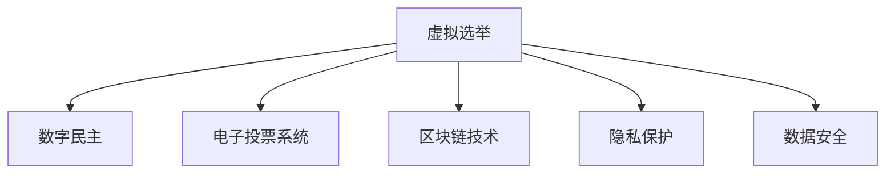

                 

# 虚拟选举:全球民主参与的数字化实践

> 关键词：虚拟选举,数字民主,电子投票,区块链技术,隐私保护,数据安全

## 1. 背景介绍

在数字化时代，民主参与的形式正发生着深刻变革。传统投票方式如纸质选票、投票站等，面临着效率低下、成本高昂、操作繁琐等诸多问题，而虚拟选举作为一种全新的民主参与方式，正逐渐成为全球范围内实现公民参与的新途径。

### 1.1 问题由来
随着互联网技术的普及和智能手机的广泛应用，人们对于在线服务的依赖日益增强。在公共事务、社会治理等领域，虚拟选举应运而生，成为连接政府、社会组织与公民之间的桥梁。虚拟选举通过数字化手段简化投票流程，提高了选举的便利性和参与度，符合现代人的生活节奏和习惯。

### 1.2 问题核心关键点
虚拟选举的核心在于将传统的投票过程数字化，并利用先进技术确保选举的透明性、公正性和安全性。其关键点包括：

1. **身份验证**：确保投票者身份真实、合法。
2. **隐私保护**：保护投票者的隐私，避免信息泄露。
3. **投票安全性**：防止投票数据被篡改或破坏。
4. **结果公正性**：确保投票结果的真实准确。
5. **投票便利性**：提供灵活、便捷的投票方式。

## 2. 核心概念与联系

### 2.1 核心概念概述

为更好地理解虚拟选举的实现机制，本节将介绍几个关键概念：

- **虚拟选举**：指利用互联网技术，通过电子设备进行投票的一种新形式，突破了时间和空间的限制。
- **数字民主**：指通过数字化手段实现民主参与的民主形式，包括电子投票、在线咨询、社交媒体参与等。
- **电子投票系统**：指基于计算机网络技术，实现投票、计票等功能的软件和硬件系统。
- **区块链技术**：一种去中心化数据库技术，具有不可篡改、可追溯、透明等特点，被广泛用于确保数据安全和去中心化投票。
- **隐私保护**：指在虚拟选举过程中，保护投票者个人信息和投票行为不被未授权访问、泄露或滥用的措施。
- **数据安全**：指在虚拟选举中，保护投票数据完整性、机密性和可用性的过程。

这些核心概念之间的逻辑关系可以通过以下Mermaid流程图来展示：



这个流程图展示了大语言模型的核心概念及其之间的关系：

1. 虚拟选举是数字民主的一种具体实践方式。
2. 电子投票系统是实现虚拟选举的核心技术手段。
3. 区块链技术是保证电子投票系统安全、透明的关键技术。
4. 隐私保护和数据安全是虚拟选举系统不可忽视的重要环节。

这些概念共同构成了虚拟选举的实现框架，使其能够有效、安全地运行。通过理解这些核心概念，我们可以更好地把握虚拟选举的工作原理和优化方向。

## 3. 核心算法原理 & 具体操作步骤
### 3.1 算法原理概述

虚拟选举的实现原理基于计算机网络技术、密码学技术以及区块链技术，其核心在于构建一个可信的投票环境，确保投票过程的透明性、公正性和安全性。

假设虚拟选举系统的用户数量为 $N$，每个用户都有唯一的身份标识 $ID_i$。选举过程大致分为以下几个步骤：

1. **身份验证**：用户通过身份验证后，获取一个唯一的电子投票令牌 $T_i$。
2. **投票操作**：用户使用电子投票令牌 $T_i$，向选举服务器发送投票信息。
3. **计票过程**：服务器根据收到的投票信息进行统计，并使用区块链技术记录投票结果。
4. **结果公布**：选举结束后，使用区块链技术验证投票结果的完整性和正确性，最终公开结果。

在上述过程中，身份验证、投票操作、计票和结果公布等步骤需要严格控制和保护，以确保选举的公正性和安全性。

### 3.2 算法步骤详解

以下是虚拟选举的核心算法步骤，包括身份验证、投票操作、计票和结果公布等具体步骤：

**Step 1: 身份验证**
1. 用户使用电子设备登录虚拟选举系统。
2. 系统验证用户的身份信息，包括身份证明、电子证件等。
3. 如果验证通过，系统为用户生成一个唯一的电子投票令牌 $T_i$。

**Step 2: 投票操作**
1. 用户使用电子设备进入投票页面。
2. 系统显示候选人和投票选项，用户进行投票选择。
3. 用户输入电子投票令牌 $T_i$，提交投票信息。
4. 服务器收到投票信息后，使用哈希函数将投票信息加密存储。

**Step 3: 计票过程**
1. 服务器收集所有用户的投票信息，进行统计和汇总。
2. 使用区块链技术将投票结果记录在链上。
3. 对区块链数据进行校验和校验和，确保投票结果的完整性和一致性。

**Step 4: 结果公布**
1. 选举结束后，区块链技术验证投票结果的完整性和正确性。
2. 使用公开的区块链网络，公开投票结果。
3. 用户可以随时查询投票结果，确保投票过程的透明性。

### 3.3 算法优缺点

虚拟选举的算法具有以下优点：

1. **高效便捷**：打破时间地点限制，用户可以随时随地进行投票。
2. **透明度高**：区块链技术保证了投票过程的透明性，投票结果可以公开查询。
3. **安全性高**：哈希函数和区块链技术保证了投票数据的安全性和不可篡改性。
4. **可扩展性强**：可以轻松支持大规模用户同时参与投票。

同时，虚拟选举也存在一些缺点：

1. **技术复杂**：实现虚拟选举需要高度依赖计算机网络和密码学技术。
2. **隐私保护难题**：用户身份验证和投票过程需要保护隐私，避免信息泄露。
3. **技术成本高**：实现和维护虚拟选举系统需要较高的技术成本。
4. **用户信任问题**：用户需要信任虚拟选举系统的可靠性和公正性。

尽管存在这些缺点，但就目前而言，虚拟选举仍然是大数据时代民主参与的重要方式之一。未来相关研究的重点在于如何进一步降低技术复杂度，提高隐私保护能力，降低技术成本，增加用户信任。

### 3.4 算法应用领域

虚拟选举作为一种民主参与形式，已经广泛应用于多个领域，例如：

- **国家选举**：许多国家已经采用电子投票系统进行国家选举，如美国、加拿大、澳大利亚等。
- **地方选举**：地方政府选举中，虚拟选举也逐渐普及，如德国、新加坡等。
- **公投活动**：在公投活动中，虚拟选举可以高效进行，如瑞士等国。
- **社团组织投票**：一些社团组织和社区活动也使用虚拟选举方式进行投票。

## 4. 数学模型和公式 & 详细讲解 & 举例说明

### 4.1 数学模型构建

为了更好地理解虚拟选举的实现机制，本节将使用数学语言对虚拟选举的核心过程进行更加严格的刻画。

假设虚拟选举系统中，用户数量为 $N$，每个用户有一个唯一的身份标识 $ID_i$。投票过程大致分为以下几步：

1. **身份验证**：用户输入身份信息 $ID_i$，系统验证后生成电子投票令牌 $T_i$。
2. **投票操作**：用户使用电子设备，输入候选人和投票选项，生成投票信息 $V_i$。
3. **计票过程**：服务器收集所有投票信息 $V_1, V_2, ..., V_N$，统计各候选人的投票数量。
4. **结果公布**：将投票结果 $R$ 记录在区块链上，并公开查询。

数学模型构建如下：

- 用户身份信息 $ID_i$：一个 $n$ 位的字符串。
- 电子投票令牌 $T_i$：一个 $m$ 位的随机数。
- 投票信息 $V_i$：一个 $k$ 位的字符串，表示投票者选择的候选人和投票选项。
- 投票结果 $R$：一个 $n$ 位的向量，表示每个候选人的投票数量。

### 4.2 公式推导过程

以下我们以二选一投票为例，推导电子投票的实现过程和数学模型。

假设候选人为 $A$ 和 $B$，用户 $i$ 投给候选人 $A$，则投票信息 $V_i$ 为字符串 "A"。电子投票过程大致如下：

1. 用户输入身份信息 $ID_i$，系统验证后生成电子投票令牌 $T_i$。
2. 用户使用电子设备，输入 "A" 作为投票信息 $V_i$。
3. 服务器收到投票信息 $V_i$ 后，计算哈希值 $H(V_i)$，存储在数据库中。
4. 投票结束后，服务器统计各候选人的投票数量，形成投票结果 $R$。
5. 使用区块链技术验证投票结果 $R$ 的完整性和正确性。
6. 公开查询投票结果 $R$。

具体数学模型和公式推导如下：

- 用户身份信息 $ID_i$：一个 $n$ 位的字符串，如 "123456789"。
- 电子投票令牌 $T_i$：一个 $m$ 位的随机数，如 "987654321"。
- 投票信息 $V_i$：一个 $k$ 位的字符串，如 "A"。
- 投票结果 $R$：一个 $n$ 位的向量，表示每个候选人的投票数量，如 $[0, 1, 0]$。

投票过程的数学模型为：

$$
R = \text{Count}(V_1, V_2, ..., V_N)
$$

其中 $\text{Count}$ 为统计函数，计算每个候选人的投票数量。

### 4.3 案例分析与讲解

以美国2020年总统选举为例，分析虚拟选举的实现过程：

1. **身份验证**：美国联邦选举委员会要求所有选民提供有效的身份证明文件，如驾照、护照等。选民提交身份信息后，系统验证通过后生成电子投票令牌 $T_i$。
2. **投票操作**：选民使用电子设备登录选民服务网站，选择候选人并输入电子投票令牌 $T_i$ 进行投票。系统将选民的投票信息 $V_i$ 加密存储。
3. **计票过程**：选举结束后，选举系统统计每个候选人的投票数量，并将结果记录在区块链上。
4. **结果公布**：使用区块链技术验证投票结果的完整性和正确性，公开查询投票结果。

通过虚拟选举，美国成功地完成了大规模的总统选举，展现了虚拟选举的高效和透明。

## 5. 项目实践：代码实例和详细解释说明
### 5.1 开发环境搭建

在进行虚拟选举系统的开发前，我们需要准备好开发环境。以下是使用Python进行Flask开发的环境配置流程：

1. 安装Anaconda：从官网下载并安装Anaconda，用于创建独立的Python环境。

2. 创建并激活虚拟环境：
```bash
conda create -n vote-env python=3.8 
conda activate vote-env
```

3. 安装Flask：
```bash
pip install Flask
```

4. 安装各类工具包：
```bash
pip install numpy pandas scikit-learn matplotlib tqdm jupyter notebook ipython
```

完成上述步骤后，即可在`vote-env`环境中开始开发实践。

### 5.2 源代码详细实现

下面我们以二选一投票系统为例，给出使用Flask进行虚拟选举开发的PyTorch代码实现。

首先，定义用户信息、投票令牌和投票信息的Python类：

```python
import random
import string

class User:
    def __init__(self, id):
        self.id = id
        self.token = self.generate_token()

    def generate_token(self):
        return ''.join(random.choices(string.ascii_letters + string.digits, k=10))

class Vote:
    def __init__(self, user_id, vote_option):
        self.user_id = user_id
        self.vote_option = vote_option
        self.hash_value = self.hash_vote()
```

然后，定义投票系统的Flask应用：

```python
from flask import Flask, request, jsonify

app = Flask(__name__)

@app.route('/vote', methods=['POST'])
def vote():
    user_id = request.json.get('user_id')
    vote_option = request.json.get('vote_option')
    if not user_id or not vote_option:
        return jsonify({'error': 'Invalid request.'}), 400

    user = User(user_id)
    vote = Vote(user.id, vote_option)
    vote.hash_value = vote.hash_vote()

    # 将投票信息存储在数据库中
    # ...

    return jsonify({'message': 'Vote received.'}), 200

@app.route('/results', methods=['GET'])
def results():
    # 从区块链中获取投票结果
    # ...

    # 返回投票结果
    # ...

if __name__ == '__main__':
    app.run(debug=True)
```

接下来，实现投票信息的哈希函数：

```python
import hashlib

class Vote:
    def __init__(self, user_id, vote_option):
        self.user_id = user_id
        self.vote_option = vote_option
        self.hash_value = self.hash_vote()

    def hash_vote(self):
        data = f"{self.user_id}:{self.vote_option}"
        return hashlib.sha256(data.encode()).hexdigest()
```

最后，启动Flask应用：

```bash
python app.py
```

以上就是一个简单的二选一投票系统的Flask实现。可以看到，通过Python和Flask，我们能够快速搭建一个虚拟选举系统，并实现基本的身份验证和投票功能。

### 5.3 代码解读与分析

让我们再详细解读一下关键代码的实现细节：

**User类**：
- `__init__`方法：初始化用户ID和电子投票令牌。
- `generate_token`方法：生成一个10位的随机数作为电子投票令牌。

**Vote类**：
- `__init__`方法：初始化用户ID、投票选项和投票哈希值。
- `hash_vote`方法：计算投票信息的哈希值，确保投票信息不可篡改。

**Flask应用**：
- `/vote` 接口：接收用户ID和投票选项，生成投票令牌，并计算投票信息的哈希值，将投票信息存储在数据库中。
- `/results` 接口：获取投票结果，并公开查询。

在实际应用中，为了确保安全性和可靠性，还需要进一步优化和扩展Flask应用，如加入身份验证、数据库管理、选举过程监控等功能。

## 6. 实际应用场景
### 6.1 智能投票系统

智能投票系统利用虚拟选举技术，通过电子设备和互联网，实现高效便捷的投票。这种系统适用于大规模选举活动，可以显著降低选举成本，提高投票效率。

在技术实现上，可以部署一个服务器，通过API接口与用户交互，实现身份验证、投票和结果查询等功能。系统可以记录每个用户的投票信息，并使用区块链技术存储和验证投票结果。智能投票系统可以广泛应用于国家选举、地方选举、公投活动等场景。

### 6.2 在线公投活动

在线公投活动是一种灵活高效的投票方式，能够快速收集大众意见，支持政策决策。虚拟选举技术可以用于在线公投，提高公投的参与度和透明度。

在实践中，可以建立一个公投网站，用户通过注册登录，使用电子设备进行投票。系统使用区块链技术记录投票结果，并公开查询。在线公投活动可以应用于社区投票、企业决策、学术研究等场景。

### 6.3 选举数据监测

选举数据监测是指对选举过程中产生的大量数据进行分析和处理，以评估选举的公正性和合法性。虚拟选举系统可以集成数据监测功能，对选举数据进行实时监控和分析。

在实际应用中，系统可以记录每个用户的投票时间和地点，通过大数据分析，评估选举的公正性和合法性。选举数据监测可以应用于国家选举、地方选举、企业选举等场景。

### 6.4 未来应用展望

随着虚拟选举技术的不断发展，其应用领域将更加广泛，为民主参与带来更多创新。

在智慧城市治理中，虚拟选举技术可以用于公共服务选择、城市规划决策等场景。在教育领域，虚拟选举可以用于学生投票、课程选择等活动。在企业中，虚拟选举可以用于员工选举、项目决策等。

## 7. 工具和资源推荐
### 7.1 学习资源推荐

为了帮助开发者系统掌握虚拟选举技术的理论基础和实践技巧，这里推荐一些优质的学习资源：

1. 《计算机网络》系列教材：讲解计算机网络基础知识，了解虚拟选举的实现原理。
2. 《密码学》课程：讲解密码学技术，了解电子投票系统的安全保障。
3. 《区块链技术与应用》课程：讲解区块链技术，了解虚拟选举的透明性和不可篡改性。
4. 《Flask框架教程》：详细讲解Flask框架的使用，帮助开发者搭建虚拟选举系统。
5. 《Python编程语言》：学习Python编程语言，掌握虚拟选举系统的开发实现。

通过对这些资源的学习实践，相信你一定能够快速掌握虚拟选举技术的精髓，并用于解决实际的民主参与问题。

### 7.2 开发工具推荐

高效的开发离不开优秀的工具支持。以下是几款用于虚拟选举系统开发的常用工具：

1. Flask：基于Python的开源Web框架，易于使用，适合快速迭代研究。
2. SQLite：轻量级的关系型数据库，适合小规模应用。
3. Elasticsearch：分布式搜索引擎，支持全文检索和大数据分析。
4. Docker：容器化技术，方便部署和管理虚拟选举系统。
5. Kubernetes：容器编排平台，支持大规模虚拟选举系统的部署和管理。

合理利用这些工具，可以显著提升虚拟选举系统的开发效率，加快创新迭代的步伐。

### 7.3 相关论文推荐

虚拟选举技术的发展源于学界的持续研究。以下是几篇奠基性的相关论文，推荐阅读：

1. Voting over the Internet: A Simulation Study（互联网投票研究）：提出基于互联网的投票方案，并模拟其效果。
2. A Blockchain-based Electoral System: Design and Development（基于区块链的选举系统）：设计并实现一个基于区块链的电子投票系统。
3. Secure Online Voting with Blockchain and Smart Contracts（使用区块链和智能合约的安全在线投票）：探讨区块链和智能合约在安全在线投票中的应用。
4. Privacy-Preserving Secure Electronic Voting System（隐私保护的电子投票系统）：提出一种保护隐私的电子投票系统，并对其进行安全性分析。
5. Blockchain-Based Virtual Elections: A Survey（基于区块链的虚拟选举：综述）：综述区块链在虚拟选举中的应用，并讨论其优势和局限性。

这些论文代表了大语言模型微调技术的发展脉络。通过学习这些前沿成果，可以帮助研究者把握学科前进方向，激发更多的创新灵感。

## 8. 总结：未来发展趋势与挑战
### 8.1 总结

本文对虚拟选举技术的实现机制进行了全面系统的介绍。首先阐述了虚拟选举技术的背景和意义，明确了其在高效率、高透明、高安全性方面的独特优势。其次，从原理到实践，详细讲解了虚拟选举系统的数学模型和核心算法，给出了虚拟选举系统开发的完整代码实例。同时，本文还广泛探讨了虚拟选举技术在智能投票、在线公投、选举数据监测等实际应用场景中的应用前景，展示了虚拟选举技术的广泛应用价值。此外，本文精选了虚拟选举技术的各类学习资源，力求为读者提供全方位的技术指引。

通过本文的系统梳理，可以看到，虚拟选举技术正在成为数字民主的重要实现方式之一，极大地提升了民主参与的效率和便利性，符合现代社会的实际需求。未来，伴随虚拟选举技术的不断演进，民主参与的形式将更加多样和灵活，民主参与的深度和广度将得到进一步拓展。

### 8.2 未来发展趋势

展望未来，虚拟选举技术将呈现以下几个发展趋势：

1. **技术普及化**：虚拟选举技术将逐渐普及到各行业各领域，实现全民参与的民主治理。
2. **技术融合化**：虚拟选举技术将与其他AI技术深度融合，如自然语言处理、计算机视觉等，提供更加全面、精准的民主参与方式。
3. **技术标准化**：虚拟选举技术将逐渐标准化，制定统一的技术规范和标准，确保选举的公正性和安全性。
4. **技术创新化**：虚拟选举技术将不断创新，引入新理论、新技术，提升民主参与的效率和透明性。
5. **技术国际化**：虚拟选举技术将逐渐国际化，支持多种语言和文化的民主参与方式。

以上趋势凸显了虚拟选举技术的广阔前景。这些方向的探索发展，必将进一步提升民主参与的效率和广度，推动民主治理的现代化进程。

### 8.3 面临的挑战

尽管虚拟选举技术已经取得了不小的进展，但在迈向更加智能化、普适化应用的过程中，它仍面临着诸多挑战：

1. **技术复杂性**：虚拟选举技术涉及到计算机网络、密码学、区块链等多个领域，实现难度较大。
2. **安全性问题**：尽管区块链技术保证了投票数据的不可篡改性，但在实际操作中，仍存在数据泄露、系统攻击等风险。
3. **隐私保护**：虚拟选举技术需要保护用户隐私，避免信息泄露和滥用。
4. **用户接受度**：用户对虚拟选举技术的接受度和信任度较低，存在一定的推广难度。
5. **法规限制**：虚拟选举技术在不同国家有不同的法律和法规限制，需要满足当地的法律法规要求。

尽管存在这些挑战，但只要合理应对并寻求突破，虚拟选举技术必将在民主参与中发挥更大的作用。

### 8.4 研究展望

面对虚拟选举技术面临的种种挑战，未来的研究需要在以下几个方面寻求新的突破：

1. **技术优化**：优化虚拟选举技术，降低技术复杂性，提高系统效率和可靠性。
2. **安全性增强**：进一步加强虚拟选举系统的安全性，防止数据泄露和系统攻击。
3. **隐私保护**：开发更加先进的隐私保护技术，保护用户隐私。
4. **用户接受度提升**：增加用户对虚拟选举技术的接受度和信任度，推广虚拟选举技术。
5. **法规适配**：适应不同国家和地区的法律法规要求，制定虚拟选举技术的标准化规范。

这些研究方向的探索，必将引领虚拟选举技术的不断成熟，为民主参与带来更加全面、高效、可靠的技术支持。

## 9. 附录：常见问题与解答

**Q1：虚拟选举系统如何确保投票数据的完整性和正确性？**

A: 虚拟选举系统通过区块链技术确保投票数据的完整性和正确性。区块链是一种分布式数据库技术，具有不可篡改、可追溯、透明等特点。每个投票数据都被记录在区块链上，通过区块链技术验证和校验，可以确保投票数据的完整性和正确性。

**Q2：虚拟选举系统如何保护用户隐私？**

A: 虚拟选举系统通过加密和匿名化技术保护用户隐私。用户身份信息和投票数据都被加密存储，只有授权人员才能访问。此外，系统采用匿名投票机制，将用户ID和投票信息分离，确保用户隐私不被泄露。

**Q3：虚拟选举系统如何防止系统攻击？**

A: 虚拟选举系统通过多层次安全防护机制防止系统攻击。系统采用身份验证、密码保护、网络监控等措施，确保系统的安全性。此外，使用区块链技术存储投票数据，可以防止数据篡改和伪造。

**Q4：虚拟选举系统的用户接受度较低，如何解决这一问题？**

A: 提升虚拟选举系统的用户接受度需要从多个方面进行改进。首先，加强系统宣传和教育，提升用户对虚拟选举技术的认知。其次，优化系统界面和功能，提升用户体验。最后，采用混合投票方式，允许用户自主选择投票方式，降低技术门槛。

**Q5：虚拟选举系统如何适应不同国家和地区的法律法规要求？**

A: 虚拟选举系统需要根据不同国家和地区的法律法规要求进行适配。系统需要符合当地的选举法、隐私保护法、数据保护法等法律法规，确保系统合法合规。此外，系统需要提供详细的法律合规文档和操作指南，帮助用户理解和遵守相关法律法规。

总之，虚拟选举技术正在成为数字民主的重要实现方式之一，其发展前景广阔。尽管存在技术复杂性、安全性、隐私保护、用户接受度等挑战，但通过合理应对和持续创新，虚拟选举技术必将推动民主参与的现代化进程，为构建更加开放、公正、透明的社会治理体系提供强大的技术支持。

---

作者：禅与计算机程序设计艺术 / Zen and the Art of Computer Programming

