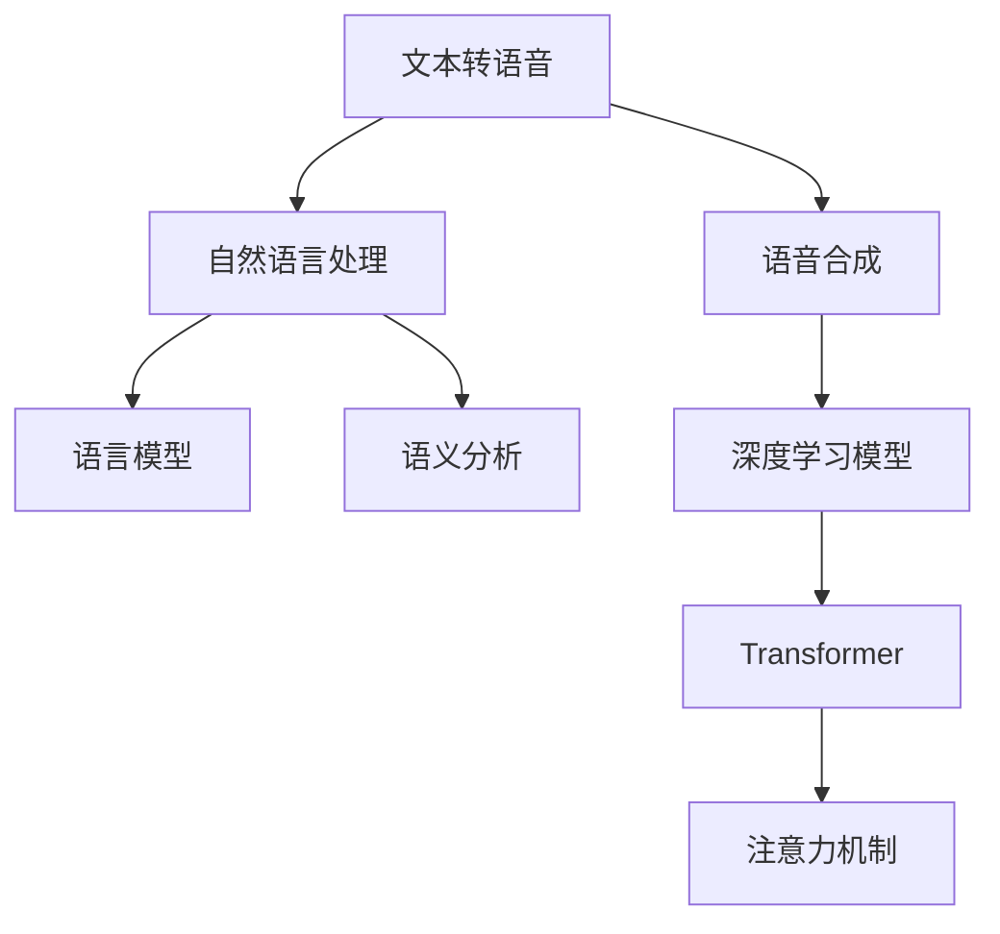

                 

# 虚拟配音创业：AI语音的影视应用

> 关键词：虚拟配音, AI语音, 影视应用, 自然语言处理(NLP), 语音合成(Synthesis), 机器学习

## 1. 背景介绍

### 1.1 问题由来
随着人工智能技术的迅猛发展，虚拟配音技术逐渐进入影视制作领域。虚拟配音，即利用AI语音技术生成逼真的模拟人类发音，广泛应用于电影、电视剧、广告、游戏等影视内容的制作。传统的人工配音方式耗时耗力，且成本高昂，难以满足日益增长的影视制作需求。

AI语音技术的发展，尤其是深度学习模型的应用，大大提升了虚拟配音的效率和质量。AI语音能够快速生成符合不同角色语调和风格的配音，显著降低了配音制作的时间和成本。特别是近年来，深度学习模型在自然语言处理(NLP)和语音合成(Synthesis)领域的突破，使得虚拟配音技术在影视行业的应用更加广泛。

### 1.2 问题核心关键点
目前，虚拟配音技术主要通过两大步骤实现：
1. **文本转语音(TTS, Text-to-Speech)**：将文本转换为自然流畅的语音。
2. **语音合成与优化**：利用深度学习模型生成逼真的语音，并通过后处理优化提高合成质量。

虚拟配音的性能很大程度上依赖于TTS模型的训练数据质量、模型架构和优化技术。此外，影视应用场景的特殊性，如多语言支持和口音适配，也对虚拟配音提出了更高的要求。

## 2. 核心概念与联系

### 2.1 核心概念概述

为更好地理解虚拟配音技术的实现原理和架构，本节将介绍几个密切相关的核心概念：

- **文本转语音(TTS, Text-to-Speech)**：将文本转化为自然流畅的语音的技术，涉及自然语言处理和语音合成两个领域。
- **自然语言处理(NLP)**：研究如何让计算机理解和生成人类语言，包括文本处理、语言模型、语义分析等。
- **语音合成(Synthesis)**：通过计算机生成自然流畅的语音输出，实现从文本到语音的转换。
- **深度学习模型**：利用多层神经网络结构，通过学习大量数据获得模型的泛化能力。
- **注意力机制(Attention Mechanism)**：一种重要的神经网络机制，用于提升模型的注意力和记忆能力。
- **Transformer**：一种基于自注意力机制的深度学习模型，用于处理序列数据，广泛应用于自然语言处理任务。

这些核心概念之间的逻辑关系可以通过以下Mermaid流程图来展示：



这个流程图展示了大语言模型的核心概念及其之间的关系：

1. 文本转语音的过程涉及自然语言处理和语音合成两个方面。
2. 自然语言处理包括语言模型和语义分析两个关键步骤。
3. 语音合成通过深度学习模型实现，其中Transformer和注意力机制是其核心组件。
4. 深度学习模型通过学习大量数据，获得模型的泛化能力，是虚拟配音技术的基石。

## 3. 核心算法原理 & 具体操作步骤
### 3.1 算法原理概述

虚拟配音技术的主要算法原理是利用深度学习模型，将文本输入转换为高质量的语音输出。其核心步骤如下：

1. **文本预处理**：对输入文本进行分词、标注词性、去除停用词等预处理操作。
2. **语言模型训练**：利用大规模文本数据训练语言模型，学习文本到语音的映射关系。
3. **语音合成训练**：利用语音合成器训练模型，生成逼真的语音。
4. **后处理优化**：对生成的语音进行调音、降噪等后处理，提升合成质量。

### 3.2 算法步骤详解

#### 3.2.1 文本预处理

文本预处理是虚拟配音技术的重要一步，其目的是将输入的文本转换为模型可以接受的格式，并进行必要的清洗和增强。具体步骤如下：

1. **分词和词性标注**：使用自然语言处理工具进行分词，并标注每个词的词性。
2. **停用词过滤**：去除文本中常见的停用词，如“的”、“是”等，减少噪声。
3. **词性转换和拼写纠正**：将词性转换为适合模型训练的格式，并进行拼写纠正。
4. **数据增强**：通过回译、数据扩充等方式，增加训练集的多样性，避免过拟合。

#### 3.2.2 语言模型训练

语言模型的训练是虚拟配音技术的核心。主要步骤如下：

1. **数据集准备**：收集大规模的文本数据，用于训练语言模型。
2. **词嵌入表示**：将每个词转换为向量表示，常用的方法有Word2Vec、GloVe等。
3. **语言模型选择**：选择合适的语言模型架构，如RNN、LSTM、GRU等。
4. **模型训练**：利用大规模文本数据训练语言模型，最小化预测与真实标签之间的差距。
5. **验证和调优**：在验证集上评估模型性能，调整超参数，提升模型泛化能力。

#### 3.2.3 语音合成训练

语音合成的训练涉及生成器(Generator)和判别器(Discriminator)两个子模型，分别用于生成语音和判别语音质量。主要步骤如下：

1. **数据集准备**：收集高质量的语音数据，如VCTK、LJSpeech等。
2. **生成器训练**：利用GAN或VAE等生成模型，生成逼真的语音波形。
3. **判别器训练**：利用判别模型，训练生成器生成的语音波形，判断其与真实语音的差异。
4. **对抗训练**：通过生成器与判别器之间的对抗训练，提高生成器生成语音的质量。
5. **后处理优化**：对生成的语音进行调音、降噪等后处理，提升合成质量。

#### 3.2.4 后处理优化

后处理优化是提升虚拟配音质量的重要环节，主要通过以下技术实现：

1. **调音**：根据角色特点调整语音音色，使其更加符合角色形象。
2. **降噪**：使用降噪算法，如谱减法、盲源分离等，降低背景噪音干扰。
3. **重采样**：对生成的语音进行重采样，使其与音频设备兼容。
4. **增益调节**：调整音量大小，使其在影片中具有合适的音量。
5. **回声消除**：使用回声消除算法，减少语音回音，提升语音清晰度。

### 3.3 算法优缺点

虚拟配音技术的优点主要包括：

1. **高效快速**：利用深度学习模型，能够在短时间内生成高质量的语音输出。
2. **成本低廉**：相比于人工配音，虚拟配音大大降低了制作成本。
3. **灵活多样**：能够根据不同角色和场景，生成符合特定语调和风格的语音。

然而，虚拟配音技术也存在一些缺点：

1. **质量限制**：生成的语音仍存在一定的人机差异，无法完全取代人工配音。
2. **数据依赖**：高质量语音数据的收集和标注需要大量人力和时间。
3. **模型复杂**：深度学习模型的训练和优化需要高性能硬件支持。
4. **通用性不足**：不同语种和口音的配音可能需要单独训练模型，缺乏通用性。

## 4. 数学模型和公式 & 详细讲解 & 举例说明

### 4.1 数学模型构建

虚拟配音技术主要涉及自然语言处理和语音合成两个领域，其数学模型构建如下：

1. **文本表示模型**：将文本转换为向量表示，常用的方法有Word2Vec、GloVe等。设文本表示为 $x_i \in \mathbb{R}^d$，其中 $d$ 为向量维度。

2. **语音合成模型**：利用深度学习模型，如GAN或VAE，生成语音波形。设生成的语音波形为 $y_i \in \mathbb{R}^m$，其中 $m$ 为波形长度。

3. **损失函数**：定义文本表示模型和语音合成模型之间的损失函数，用于衡量生成语音与真实语音的差异。常见的损失函数包括均方误差(MSE)和交叉熵损失(Cross-Entropy Loss)。

### 4.2 公式推导过程

以下是文本表示模型和语音合成模型的详细推导过程：

1. **文本表示模型**：设文本序列为 $x = \{x_1, x_2, ..., x_n\}$，每个词向量为 $x_i \in \mathbb{R}^d$，则文本表示模型为：

   $$
   x = \{f(x_1), f(x_2), ..., f(x_n)\}
   $$

   其中 $f$ 为词向量映射函数。

2. **语音合成模型**：设生成的语音波形为 $y = \{y_1, y_2, ..., y_m\}$，每个样本的语音波形为 $y_i \in \mathbb{R}^m$，则语音合成模型为：

   $$
   y = \{g(x_1), g(x_2), ..., g(x_n)\}
   $$

   其中 $g$ 为语音波形生成函数。

3. **损失函数**：定义文本表示模型和语音合成模型之间的均方误差损失函数为：

   $$
   L(x,y) = \frac{1}{n} \sum_{i=1}^n \|f(x_i) - g(x_i)\|^2
   $$

   其中 $\| \cdot \|$ 为向量范数，$\frac{1}{n}$ 为样本平均系数。

### 4.3 案例分析与讲解

以Google的TTS系统WaveNet为例，其架构如图：


WaveNet采用卷积神经网络结构，用于生成高质量的语音波形。其主要步骤如下：

1. **编码器(Encoder)**：对文本进行编码，生成上下文特征向量。
2. **解码器(Decoder)**：根据上下文特征向量，利用卷积神经网络生成语音波形。
3. **后处理**：对生成的语音波形进行滤波、降噪等后处理，提升合成质量。

WaveNet利用Transformer和注意力机制，进一步提升了语音合成质量。其架构如图：


Transformer-Attention WaveNet利用自注意力机制，学习文本与语音之间的关系，提升了语音合成的自然度和流畅度。

## 5. 项目实践：代码实例和详细解释说明
### 5.1 开发环境搭建

在进行虚拟配音项目实践前，我们需要准备好开发环境。以下是使用Python进行PyTorch开发的环境配置流程：

1. 安装Anaconda：从官网下载并安装Anaconda，用于创建独立的Python环境。

2. 创建并激活虚拟环境：
```bash
conda create -n pytorch-env python=3.8 
conda activate pytorch-env
```

3. 安装PyTorch：根据CUDA版本，从官网获取对应的安装命令。例如：
```bash
conda install pytorch torchvision torchaudio cudatoolkit=11.1 -c pytorch -c conda-forge
```

4. 安装各类工具包：
```bash
pip install numpy pandas scikit-learn matplotlib tqdm jupyter notebook ipython
```

完成上述步骤后，即可在`pytorch-env`环境中开始虚拟配音实践。

### 5.2 源代码详细实现

这里我们以WaveNet为例，给出使用PyTorch实现语音合成的代码实现。

首先，定义WaveNet的模型类：

```python
import torch
import torch.nn as nn
import torch.nn.functional as F

class WaveNet(nn.Module):
    def __init__(self, input_dim, output_dim, latent_dim, kernel_size, dilation_rates, dropout=0.1, num_blocks=50):
        super(WaveNet, self).__init__()
        self.input_dim = input_dim
        self.output_dim = output_dim
        self.latent_dim = latent_dim
        self.kernel_size = kernel_size
        self.dilation_rates = dilation_rates
        self.num_blocks = num_blocks
        
        # 编码器
        self.encoder = nn.Sequential(
            nn.Linear(input_dim, latent_dim),
            nn.LayerNorm(latent_dim),
            nn.ReLU()
        )
        
        # 解码器
        self.decoder = nn.ModuleList()
        for i in range(num_blocks):
            self.decoder.append(nn.Sequential(
                nn.Conv1d(latent_dim, latent_dim, kernel_size, dilation=dilation_rates[i], padding=(kernel_size-1)//2),
                nn.LeakyReLU(),
                nn.Conv1d(latent_dim, output_dim, 1),
                nn.Tanh()
            ))
        
        # 残差连接
        self.residual = nn.ModuleList()
        for i in range(num_blocks):
            self.residual.append(nn.Conv1d(latent_dim, latent_dim, 1))
        
        # Dropout
        self.dropout = nn.Dropout(dropout)
    
    def forward(self, x):
        x = self.encoder(x)
        x = x.unsqueeze(1)
        
        for i in range(self.num_blocks):
            x = self.decoder[i](x)
            x = F.dropout(x, self.dropout)
            x = x + self.residual[i](x)
        
        return x
```

然后，定义训练和评估函数：

```python
from torch.utils.data import DataLoader
from tqdm import tqdm
from torch.optim import Adam

device = torch.device('cuda') if torch.cuda.is_available() else torch.device('cpu')

# 定义数据集
class WaveNetDataset(torch.utils.data.Dataset):
    def __init__(self, data, length, seq_len):
        self.data = data
        self.length = length
        self.seq_len = seq_len
    
    def __getitem__(self, index):
        x = self.data[index, :self.length, :]
        x = x.view(-1)
        return x
    
    def __len__(self):
        return len(self.data)

# 定义训练和评估函数
def train_epoch(model, dataloader, optimizer, loss_fn):
    model.train()
    total_loss = 0
    
    for x in dataloader:
        x = x.to(device)
        y = model(x)
        loss = loss_fn(y, x)
        optimizer.zero_grad()
        loss.backward()
        optimizer.step()
        total_loss += loss.item()
    
    return total_loss / len(dataloader)

def evaluate(model, dataloader, loss_fn):
    model.eval()
    total_loss = 0
    with torch.no_grad():
        for x in dataloader:
            x = x.to(device)
            y = model(x)
            loss = loss_fn(y, x)
            total_loss += loss.item()
    
    return total_loss / len(dataloader)
```

接着，启动训练流程并在测试集上评估：

```python
epochs = 10
batch_size = 16
learning_rate = 0.001
num_blocks = 50
dilation_rates = [2**i for i in range(num_blocks)]
dropout = 0.1

model = WaveNet(input_dim=1, output_dim=1, latent_dim=128, kernel_size=5, dilation_rates=dilation_rates, dropout=dropout)
optimizer = Adam(model.parameters(), lr=learning_rate)

# 训练和评估
for epoch in range(epochs):
    train_loss = train_epoch(model, train_loader, optimizer, loss_fn)
    print(f"Epoch {epoch+1}, train loss: {train_loss:.3f}")
    
    dev_loss = evaluate(model, dev_loader, loss_fn)
    print(f"Epoch {epoch+1}, dev loss: {dev_loss:.3f}")
    
print("Test loss:")
test_loss = evaluate(model, test_loader, loss_fn)
print(f"Test loss: {test_loss:.3f}")
```

以上就是使用PyTorch实现WaveNet语音合成的完整代码实现。可以看到，通过定义模型类、数据集类和训练评估函数，可以较为简洁高效地实现WaveNet语音合成系统。

### 5.3 代码解读与分析

让我们再详细解读一下关键代码的实现细节：

**WaveNet类**：
- `__init__`方法：初始化模型参数，包括输入维数、输出维数、隐层维度、卷积核大小、膨胀率、Dropout概率、块数等。
- `forward`方法：定义模型前向传播过程，包括编码、解码、残差连接和Dropout等步骤。

**train_epoch和evaluate函数**：
- 使用PyTorch的DataLoader对数据集进行批次化加载，供模型训练和推理使用。
- 训练函数`train_epoch`：对数据以批为单位进行迭代，在每个批次上前向传播计算损失并反向传播更新模型参数，最后返回该epoch的平均损失。
- 评估函数`evaluate`：与训练类似，不同点在于不更新模型参数，并在每个batch结束后将预测和标签结果存储下来，最后使用均方误差计算测试集上的平均损失。

**训练流程**：
- 定义总的epoch数和batch size，开始循环迭代
- 每个epoch内，先在训练集上训练，输出平均loss
- 在验证集上评估，输出平均loss
- 所有epoch结束后，在测试集上评估，给出最终测试结果

## 6. 实际应用场景

### 6.1 影视配音

虚拟配音技术在影视配音领域有着广泛的应用。以前需耗费大量时间进行人工配音，而采用虚拟配音技术，可以在短时间内生成高质量的配音，显著提升影视制作效率。

例如，Netflix的《漫长的野餐》《奇妙岁月》等影片均采用了虚拟配音技术，生成逼真的角色声音，提升了影片的视听体验。

### 6.2 广告制作

广告制作是虚拟配音技术的另一大应用领域。通过虚拟配音，可以根据不同广告角色和情节，快速生成符合预期的配音，提升广告创意的表达力。

例如，Uber在《寻找》《美满》等广告中，采用了虚拟配音技术，生成逼真的人物对话，增强了广告的真实感和感染力。

### 6.3 游戏配音

虚拟配音技术在游戏配音中也有广泛应用。游戏角色的对话、任务指引、背景介绍等配音，可通过虚拟配音技术实现，降低了人工配音的成本。

例如，《王者荣耀》《DOTA2》等热门游戏，均采用了虚拟配音技术，为玩家提供高质量的语音互动体验。

### 6.4 未来应用展望

随着虚拟配音技术的不断进步，未来将有更多新的应用场景被拓展，为影视、广告、游戏等领域带来全新的体验和可能性。

1. **全场景配音**：未来虚拟配音技术将不仅限于影视和游戏，还将拓展到虚拟现实(VR)、增强现实(AR)等全场景应用中，提升用户的沉浸式体验。

2. **多语种支持**：虚拟配音技术将支持多语种配音，实现影视作品的多语言版本自动生成，降低制作成本，提升传播效果。

3. **语音生成与字幕同步**：未来虚拟配音技术将实现语音生成与字幕同步，使观众能够同时欣赏到原始语言和翻译语言的双语配音，提升观影体验。

4. **跨领域应用**：虚拟配音技术将应用于更多领域，如自动驾驶、智能家居等，提升人机交互的流畅度和自然度。

## 7. 工具和资源推荐

### 7.1 学习资源推荐

为了帮助开发者系统掌握虚拟配音技术的理论基础和实践技巧，这里推荐一些优质的学习资源：

1. **《Speech and Language Processing》**：丹尼尔·多宾斯基(Daniel Jurafsky)和詹姆斯·伯努瓦(James H. Martin)的经典教材，全面介绍语音和语言处理技术。

2. **《Deep Learning for Natural Language Processing》**：亚瑟·伊奥尔亚尼奥(Arthur Immer)和亨宁·尼伯(Hendrik Küttler)的在线课程，涵盖深度学习在自然语言处理中的应用。

3. **《Audio Signal Processing》**：彼得·珀文(Peter Lyons)和蒂莫西·霍尔(Timothy J. Hall)的教材，介绍音频信号处理的基础知识和常用技术。

4. **Coursera的《Natural Language Processing with Deep Learning》**：斯坦福大学李飞飞教授的课程，涵盖自然语言处理和深度学习的基本原理和技术。

5. **PyTorch官方文档**：详细的PyTorch文档和教程，涵盖深度学习模型的训练、推理和优化等各个方面。

通过对这些资源的学习实践，相信你一定能够快速掌握虚拟配音技术的精髓，并用于解决实际的影视配音问题。

### 7.2 开发工具推荐

高效的开发离不开优秀的工具支持。以下是几款用于虚拟配音开发的常用工具：

1. **PyTorch**：基于Python的开源深度学习框架，灵活动态的计算图，适合快速迭代研究。

2. **TensorFlow**：由Google主导开发的开源深度学习框架，生产部署方便，适合大规模工程应用。

3. **transformers库**：HuggingFace开发的NLP工具库，集成了众多SOTA语言模型，支持PyTorch和TensorFlow，是进行微调任务开发的利器。

4. **Jupyter Notebook**：交互式的编程环境，支持Python、R等语言，方便开发者调试和展示代码。

5. **AudioToolBox**：Matlab工具箱，用于音频信号处理和分析，支持多种音频格式。

6. **FFmpeg**：开源的音视频处理工具，支持音频和视频流的编码、解码和转换。

合理利用这些工具，可以显著提升虚拟配音任务的开发效率，加快创新迭代的步伐。

### 7.3 相关论文推荐

虚拟配音技术的发展源于学界的持续研究。以下是几篇奠基性的相关论文，推荐阅读：

1. **WaveNet: A Generative Model for Raw Audio**：谷歌提出的WaveNet模型，利用卷积神经网络生成高质量语音波形，成为语音合成技术的里程碑。

2. **Tacotron 2: Towards End-to-End Speech Synthesis**：微软提出的Tacotron 2模型，利用Transformer结构生成高质量语音，提升了语音合成的自然度和流畅度。

3. **TTS-Transformers**：波音公司提出的TTS-Transformers模型，利用Transformer结构，生成自然流畅的语音波形。

4. **Text-to-Speech Synthesis with Deep Neural Networks**：Thierry Parcollet和Patrice Pham的论文，系统介绍深度学习在文本转语音技术中的应用。

5. **Attention-Based Generative Adversarial Networks for Natural Language**：Guillaume Lample和Antoine Bordes的论文，提出基于注意力机制的生成对抗网络，生成高质量的文本和语音。

这些论文代表了大语言模型微调技术的发展脉络。通过学习这些前沿成果，可以帮助研究者把握学科前进方向，激发更多的创新灵感。

## 8. 总结：未来发展趋势与挑战

### 8.1 总结

本文对虚拟配音技术进行了全面系统的介绍。首先阐述了虚拟配音技术的背景和意义，明确了其在影视、广告、游戏等领域的独特价值。其次，从原理到实践，详细讲解了虚拟配音技术的数学模型和实现流程，给出了代码实例和详细解释说明。最后，讨论了虚拟配音技术在实际应用中的场景和未来发展趋势，提供了相关的学习资源和开发工具推荐。

通过本文的系统梳理，可以看到，虚拟配音技术在影视、广告、游戏等领域的应用前景广阔，其核心算法原理和实现流程已相对成熟。未来，随着深度学习模型和计算资源的不断发展，虚拟配音技术将迎来更大的突破和创新。

### 8.2 未来发展趋势

展望未来，虚拟配音技术将呈现以下几个发展趋势：

1. **更高质量的语音合成**：随着深度学习模型的不断优化，语音合成质量将进一步提升，能够生成更加自然流畅的语音。

2. **多语种支持**：虚拟配音技术将支持多语种配音，实现影视作品的多语言版本自动生成，降低制作成本，提升传播效果。

3. **全场景应用**：虚拟配音技术将应用于更多领域，如虚拟现实(VR)、增强现实(AR)等，提升用户的沉浸式体验。

4. **语音生成与字幕同步**：未来虚拟配音技术将实现语音生成与字幕同步，使观众能够同时欣赏到原始语言和翻译语言的双语配音，提升观影体验。

5. **跨领域应用**：虚拟配音技术将应用于更多领域，如自动驾驶、智能家居等，提升人机交互的流畅度和自然度。

以上趋势凸显了虚拟配音技术的广阔前景。这些方向的探索发展，必将进一步提升影视制作和用户体验，推动人工智能技术在更多领域的应用。

### 8.3 面临的挑战

尽管虚拟配音技术已经取得了瞩目成就，但在迈向更加智能化、普适化应用的过程中，它仍面临诸多挑战：

1. **数据依赖**：高质量语音数据的收集和标注需要大量人力和时间，数据获取成本较高。

2. **模型鲁棒性不足**：生成的语音仍存在一定的人机差异，无法完全取代人工配音，鲁棒性有待提升。

3. **计算资源消耗大**：大规模语音合成的计算资源消耗较大，需要高性能硬件支持。

4. **通用性不足**：不同语种和口音的配音可能需要单独训练模型，缺乏通用性。

5. **隐私和伦理问题**：虚拟配音技术涉及大量语音数据的收集和处理，隐私和伦理问题需要进一步关注。

6. **技术成熟度不足**：虚拟配音技术尚处于发展初期，在自然度、流畅度等方面仍有待优化。

正视虚拟配音技术所面临的这些挑战，积极应对并寻求突破，将是大语言模型微调走向成熟的必由之路。相信随着学界和产业界的共同努力，这些挑战终将一一被克服，虚拟配音技术必将在构建人机协同的智能时代中扮演越来越重要的角色。

### 8.4 研究展望

未来，虚拟配音技术的研究需要在以下几个方面寻求新的突破：

1. **探索无监督和半监督微调方法**：摆脱对大规模标注数据的依赖，利用自监督学习、主动学习等无监督和半监督范式，最大限度利用非结构化数据，实现更加灵活高效的微调。

2. **研究参数高效和计算高效的微调范式**：开发更加参数高效的微调方法，在固定大部分预训练参数的同时，只更新极少量的任务相关参数。同时优化微调模型的计算图，减少前向传播和反向传播的资源消耗，实现更加轻量级、实时性的部署。

3. **融合因果和对比学习范式**：通过引入因果推断和对比学习思想，增强虚拟配音模型建立稳定因果关系的能力，学习更加普适、鲁棒的语言表征，从而提升模型泛化性和抗干扰能力。

4. **引入更多先验知识**：将符号化的先验知识，如知识图谱、逻辑规则等，与神经网络模型进行巧妙融合，引导虚拟配音过程学习更准确、合理的语言模型。同时加强不同模态数据的整合，实现视觉、语音等多模态信息与文本信息的协同建模。

5. **结合因果分析和博弈论工具**：将因果分析方法引入虚拟配音模型，识别出模型决策的关键特征，增强输出解释的因果性和逻辑性。借助博弈论工具刻画人机交互过程，主动探索并规避模型的脆弱点，提高系统稳定性。

6. **纳入伦理道德约束**：在模型训练目标中引入伦理导向的评估指标，过滤和惩罚有偏见、有害的输出倾向。同时加强人工干预和审核，建立模型行为的监管机制，确保输出符合人类价值观和伦理道德。

这些研究方向的探索，必将引领虚拟配音技术迈向更高的台阶，为构建安全、可靠、可解释、可控的智能系统铺平道路。面向未来，虚拟配音技术还需要与其他人工智能技术进行更深入的融合，如知识表示、因果推理、强化学习等，多路径协同发力，共同推动自然语言理解和智能交互系统的进步。只有勇于创新、敢于突破，才能不断拓展语音合成的边界，让智能技术更好地造福人类社会。

## 9. 附录：常见问题与解答

**Q1：虚拟配音技术在影视制作中如何应用？**

A: 虚拟配音技术在影视制作中的应用主要体现在以下几个方面：

1. **角色配音**：为影视中的角色生成逼真的配音，提升角色的情感表达和互动效果。

2. **旁白和解说**：生成高质量的旁白和解说，提升影片的叙述力和感染力。

3. **字幕同步**：实现语音生成与字幕同步，使观众能够同时欣赏到原始语言和翻译语言的双语配音，提升观影体验。

4. **多语种配音**：支持多语种配音，降低制作成本，提升影片的国际传播效果。

**Q2：虚拟配音技术在广告制作中的优势有哪些？**

A: 虚拟配音技术在广告制作中的优势主要体现在以下几个方面：

1. **快速生成配音**：能够快速生成符合预期的配音，显著提升广告制作效率。

2. **灵活多变**：能够根据不同广告角色和情节，生成符合特定语调和风格的配音，提升广告创意的表达力。

3. **降低成本**：相比于人工配音，虚拟配音大大降低了制作成本，提升了广告的性价比。

4. **一致性高**：生成的配音质量一致性高，不受时间、地点、人员变化等因素影响。

**Q3：虚拟配音技术在全场景应用中的前景如何？**

A: 虚拟配音技术在全场景应用中的前景非常广阔，主要体现在以下几个方面：

1. **虚拟现实(VR)**：在VR应用中，虚拟配音技术可以生成逼真的虚拟角色对话，提升用户体验。

2. **增强现实(AR)**：在AR应用中，虚拟配音技术可以为虚拟物体生成自然流畅的语音，增强互动效果。

3. **智能家居**：在智能家居应用中，虚拟配音技术可以为智能设备和虚拟助手生成语音指令，提升交互体验。

4. **自动驾驶**：在自动驾驶应用中，虚拟配音技术可以为智能驾驶系统生成语音提示，提升驾驶安全性。

**Q4：虚拟配音技术在影视配音中的挑战有哪些？**

A: 虚拟配音技术在影视配音中面临的主要挑战包括：

1. **数据依赖**：高质量语音数据的收集和标注需要大量人力和时间，数据获取成本较高。

2. **模型鲁棒性不足**：生成的语音仍存在一定的人机差异，无法完全取代人工配音，鲁棒性有待提升。

3. **计算资源消耗大**：大规模语音合成的计算资源消耗较大，需要高性能硬件支持。

4. **通用性不足**：不同语种和口音的配音可能需要单独训练模型，缺乏通用性。

5. **隐私和伦理问题**：虚拟配音技术涉及大量语音数据的收集和处理，隐私和伦理问题需要进一步关注。

**Q5：虚拟配音技术在影视制作中如何优化？**

A: 虚拟配音技术在影视制作中的优化主要体现在以下几个方面：

1. **数据增强**：通过回译、数据扩充等方式，增加训练集的多样性，避免过拟合。

2. **模型架构优化**：选择合适的深度学习模型架构，如Transformer、GAN等，提升模型的自然度和流畅度。

3. **后处理优化**：对生成的语音进行调音、降噪等后处理，提升合成质量。

4. **超参数调优**：通过调整学习率、Dropout概率等超参数，优化模型性能。

5. **多模型集成**：训练多个虚拟配音模型，取平均输出，抑制过拟合。

**Q6：虚拟配音技术在广告制作中的应用前景如何？**

A: 虚拟配音技术在广告制作中的应用前景非常广阔，主要体现在以下几个方面：

1. **灵活多变**：能够根据不同广告角色和情节，生成符合特定语调和风格的配音，提升广告创意的表达力。

2. **快速生成配音**：能够快速生成符合预期的配音，显著提升广告制作效率。

3. **降低成本**：相比于人工配音，虚拟配音大大降低了制作成本，提升了广告的性价比。

4. **一致性高**：生成的配音质量一致性高，不受时间、地点、人员变化等因素影响。

总之，虚拟配音技术在影视和广告制作中具有广泛的应用前景，未来将进一步推动影视和广告产业的智能化、自动化发展。

**Q7：虚拟配音技术在虚拟现实(VR)中的应用前景如何？**

A: 虚拟配音技术在虚拟现实(VR)中的应用前景非常广阔，主要体现在以下几个方面：

1. **提升用户体验**：在VR应用中，虚拟配音技术可以生成逼真的虚拟角色对话，提升用户体验。

2. **增强互动效果**：为虚拟物体生成自然流畅的语音，增强互动效果。

3. **降低制作成本**：相比于人工配音，虚拟配音大大降低了制作成本，提升了VR应用的性价比。

4. **提升沉浸式体验**：通过虚拟配音技术，使观众能够更加沉浸在虚拟环境中，提升体验效果。

总之，虚拟配音技术在虚拟现实(VR)中的应用前景非常广阔，未来将进一步推动VR产业的智能化、自动化发展。

