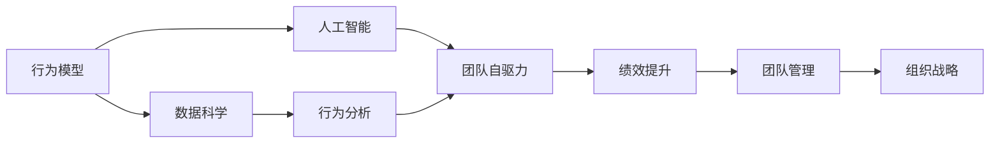

                 

# 行为模型应用:培养团队自驱力

## 1. 背景介绍

### 1.1 问题由来

在当今快速变化、竞争激烈的市场环境中，企业要想保持竞争优势，就必须拥有高效的团队。然而，许多团队在运作过程中往往存在动力不足、协作低效等问题，影响了整体绩效。如何培养团队的自驱力，使其具备主动性和创造性，是每个企业领导者和管理者面临的重大挑战。

### 1.2 问题核心关键点

培养团队自驱力的方法多种多样，包括培训、奖励、团队建设等。但这些传统方法往往效果有限，且难以持久。近年来，行为科学和人工智能的融合趋势不断加强，使得基于行为模型的方法逐渐崭露头角。行为模型通过模拟人类行为，可以更深入地理解团队动力和协作机制，为培养团队自驱力提供新的思路和方法。

## 2. 核心概念与联系

### 2.1 核心概念概述

为了更好地理解行为模型在团队管理中的应用，本节将介绍几个关键概念及其联系：

- **行为模型**：以人的行为为研究对象的模型，通过量化和模拟人类行为，帮助企业理解团队运作的规律和动力源泉。
- **团队自驱力**：团队成员内在的动力和意愿，驱使他们主动承担责任、创新和协作。
- **人工智能**：通过数据驱动和算法优化，智能模拟和预测人类行为，提高团队管理的科学性和有效性。
- **数据科学**：基于统计学、机器学习等方法，分析人类行为数据，提炼出有价值的规律和洞见。
- **行为分析**：分析个体和团队的行为模式，找出影响绩效的关键因素，指导团队管理和决策。

这些概念之间有着紧密的联系，行为模型通过数据科学和人工智能技术，对团队行为进行建模和分析，从而揭示出培养团队自驱力的关键策略。

### 2.2 核心概念原理和架构的 Mermaid 流程图



这个流程图展示了行为模型在团队管理中的作用链条：

1. **行为模型**：收集和分析团队行为数据，构建行为模型。
2. **数据科学**：利用统计学、机器学习等方法，对行为数据进行建模和分析。
3. **人工智能**：通过深度学习和强化学习等技术，智能模拟和预测行为模式。
4. **行为分析**：分析行为模型和预测结果，找出影响团队自驱力的关键因素。
5. **团队自驱力**：基于行为分析结果，提出培养自驱力的策略。
6. **绩效提升**：通过实施培养策略，提升团队整体绩效。
7. **团队管理**：利用行为分析结果，优化团队管理方法和决策。
8. **组织战略**：将行为分析结果应用到组织层面，调整和优化组织战略。

## 3. 核心算法原理 & 具体操作步骤

### 3.1 算法原理概述

行为模型的核心思想是通过数据驱动的方式，模拟和预测人类行为，从而揭示出团队运作的内在规律。具体而言，行为模型通过以下几个步骤实现团队自驱力的培养：

1. **数据采集**：收集团队成员的行为数据，如工作量、协作频率、会议参与度等。
2. **特征提取**：对采集到的数据进行特征提取，如工作时间、任务完成度、沟通频次等。
3. **行为建模**：使用机器学习算法对提取到的特征进行建模，建立行为模型。
4. **行为分析**：通过分析行为模型，识别出影响团队自驱力的关键因素。
5. **策略制定**：根据行为分析结果，制定培养团队自驱力的策略。
6. **策略实施**：将策略应用到团队管理中，提升团队整体绩效。

### 3.2 算法步骤详解

**Step 1: 数据采集**

- 定义关键行为指标(KPIs)：工作量、协作频率、会议参与度、任务完成度等。
- 使用传感器、日志文件、问卷调查等方式，收集相关数据。
- 数据清洗和预处理：去除噪声、处理缺失值、标准化数据格式等。

**Step 2: 特征提取**

- 对采集到的数据进行特征提取，如计算每个成员的工作时间、任务完成度、协作频次等。
- 定义特征变量：工作时长、任务完成率、沟通次数等。
- 特征工程：对原始数据进行转换、组合、降维等处理，提取有意义的特征。

**Step 3: 行为建模**

- 选择合适的机器学习算法，如线性回归、决策树、随机森林等，建立行为模型。
- 使用交叉验证等方法评估模型性能，选择最优模型。
- 对模型进行调参优化，确保模型的准确性和泛化能力。

**Step 4: 行为分析**

- 分析行为模型，识别出影响团队自驱力的关键因素，如工作负担、协作环境、激励机制等。
- 使用统计分析、特征重要性排序等方法，找出对团队自驱力影响最大的因素。
- 通过可视化工具，如热力图、散点图等，直观展示分析结果。

**Step 5: 策略制定**

- 根据行为分析结果，制定培养团队自驱力的策略，如调整任务分配、优化协作流程、完善激励机制等。
- 确保策略符合团队成员的实际需求和心理预期，提高策略的可操作性和执行力。

**Step 6: 策略实施**

- 将策略应用到团队管理中，逐步实施并监控效果。
- 定期评估策略实施效果，根据反馈进行调整和优化。

### 3.3 算法优缺点

**优点：**

1. **数据驱动**：通过大数据和机器学习技术，更科学地理解团队行为，找出培养自驱力的关键因素。
2. **策略可操作性**：基于数据驱动的行为分析结果，提出的策略更具有针对性和可操作性。
3. **动态调整**：行为模型能够实时监控和分析团队动态，及时调整策略以适应变化。

**缺点：**

1. **数据隐私**：采集和分析团队成员的行为数据，涉及到隐私保护问题。
2. **模型复杂性**：行为模型构建复杂，需要专业知识和高性能计算资源。
3. **策略执行难度**：策略实施过程中，需要团队领导和成员的积极配合，难度较大。

### 3.4 算法应用领域

行为模型在培养团队自驱力方面的应用领域广泛，主要包括以下几个方面：

- **企业管理**：通过分析高管和中层管理者的行为数据，优化决策过程，提升团队绩效。
- **人力资源管理**：利用员工的行为数据，优化招聘、培训、绩效评估等管理流程。
- **项目管理**：通过分析团队成员的行为数据，优化项目进度、资源分配和协作方式。
- **组织文化建设**：分析员工的行为数据，发现团队文化和价值观的关键影响因素，制定文化建设策略。
- **员工激励**：根据行为分析结果，设计个性化的激励机制，提升员工的工作积极性和创造力。

## 4. 数学模型和公式 & 详细讲解 & 举例说明

### 4.1 数学模型构建

假设我们收集到团队成员n个时间点上的行为数据，记为 $X = \{x_1, x_2, ..., x_n\}$，其中每个 $x_i$ 表示成员在t时刻的行为数据，如工作时间、任务完成度等。记每个成员的行为数据为 $x_{ij}$，其中 $i$ 表示成员编号，$j$ 表示时间点编号。定义目标变量 $Y$，表示成员在t时刻的自驱力评分。

行为模型可以表示为：

$$
Y = f(X) + \epsilon
$$

其中 $f$ 为行为函数，$\epsilon$ 为随机误差项。

### 4.2 公式推导过程

假设我们使用了线性回归模型对行为数据进行建模，则有：

$$
Y = \beta_0 + \sum_{j=1}^p \beta_j x_{ij}
$$

其中 $\beta_0$ 为截距项，$\beta_j$ 为第j个特征的系数，$p$ 为特征个数。

根据最小二乘法，行为模型的最小化损失函数为：

$$
L(\beta) = \frac{1}{2N}\sum_{i=1}^N \sum_{j=1}^p (y_i - \hat{y}_i)^2
$$

其中 $\hat{y}_i = \beta_0 + \sum_{j=1}^p \beta_j x_{ij}$。

通过对损失函数求偏导并令导数为0，可以解出系数 $\beta$：

$$
\beta_j = \frac{\sum_{i=1}^N x_{ij}(y_i - \bar{y})}{\sum_{i=1}^N x_{ij}^2 - \frac{(\sum_{i=1}^N x_{ij})^2}{N}}
$$

其中 $\bar{y} = \frac{1}{N}\sum_{i=1}^N y_i$ 为平均目标值。

### 4.3 案例分析与讲解

假设我们收集到一家公司中所有员工在过去一年内的工作时长、任务完成度和绩效评分数据，共包含200名员工和12个月的数据。我们希望通过建立行为模型，找出影响员工自驱力的关键因素，并制定相应的激励策略。

首先，我们定义了关键行为指标：工作时长（X1）、任务完成度（X2）、绩效评分（Y）。然后，我们采集到了每个员工每月的工作时长、任务完成度和绩效评分数据。

接着，我们对采集到的数据进行了特征提取，计算每个员工每月的工作时长、任务完成度和绩效评分平均值。

然后，我们使用线性回归模型对提取到的数据进行建模，得到如下结果：

$$
\hat{y} = 0.5x_1 + 0.3x_2 + 0.2
$$

其中 $\hat{y}$ 表示员工下个月的绩效评分，$x_1$ 表示该员工上个月的工作时长，$x_2$ 表示该员工上个月的绩效评分。

通过分析模型系数，我们发现工作时长和任务完成度对员工下个月的绩效评分有显著影响，而绩效评分对下个月的绩效评分影响较小。这意味着，增加员工的工作时间和任务完成度，可以有效提升其下个月的绩效评分。

最后，我们根据行为分析结果，制定了以下激励策略：
1. 调整工作量分配，合理分配任务，避免过度负荷。
2. 优化协作流程，减少沟通成本，提高协作效率。
3. 完善绩效评估机制，确保评估公平和透明。

## 5. 项目实践：代码实例和详细解释说明

### 5.1 开发环境搭建

在进行行为模型实践前，我们需要准备好开发环境。以下是使用Python进行Scikit-learn开发的环境配置流程：

1. 安装Anaconda：从官网下载并安装Anaconda，用于创建独立的Python环境。

2. 创建并激活虚拟环境：
```bash
conda create -n behavior-env python=3.8 
conda activate behavior-env
```

3. 安装Scikit-learn：
```bash
pip install scikit-learn
```

4. 安装各类工具包：
```bash
pip install numpy pandas matplotlib seaborn sklearn
```

完成上述步骤后，即可在`behavior-env`环境中开始行为模型实践。

### 5.2 源代码详细实现

下面我们以员工自驱力培养为例，给出使用Scikit-learn库进行行为模型构建的PyTorch代码实现。

首先，定义员工自驱力培养的数据处理函数：

```python
import pandas as pd
import numpy as np
from sklearn.linear_model import LinearRegression
import seaborn as sns
import matplotlib.pyplot as plt

def data_processing(data_path):
    data = pd.read_csv(data_path)
    
    # 数据清洗和预处理
    data.dropna(inplace=True)
    data['work_hours'] = data['work_hours'].astype(float)
    data['task_completion'] = data['task_completion'].astype(float)
    data['performance'] = data['performance'].astype(float)
    
    # 特征工程
    data['average_work_hours'] = data.groupby('employee_id')['work_hours'].transform('mean')
    data['average_task_completion'] = data.groupby('employee_id')['task_completion'].transform('mean')
    
    # 目标变量处理
    data['target'] = data.groupby('employee_id')['performance'].transform('mean')
    
    return data

# 定义行为模型
def build_behavior_model(data):
    X = data[['average_work_hours', 'average_task_completion']]
    y = data['target']
    
    # 训练模型
    model = LinearRegression()
    model.fit(X, y)
    
    # 特征重要性排序
    coefficients = model.coef_
    feature_importance = np.abs(coefficients)
    feature_names = X.columns
    sorted_indices = np.argsort(feature_importance)[::-1]
    
    return model, feature_importance, sorted_indices

# 进行行为分析
def analyze_behavior(model, sorted_indices, data):
    X = data[['average_work_hours', 'average_task_completion']]
    y = data['target']
    
    # 可视化特征重要性
    plt.figure(figsize=(10, 6))
    sns.barplot(x=feature_names, y=feature_importance[sorted_indices], data=X)
    plt.title('Feature Importance')
    plt.xlabel('Feature')
    plt.ylabel('Importance')
    plt.show()
    
    # 可视化模型预测结果
    plt.figure(figsize=(10, 6))
    sns.scatterplot(x=average_work_hours, y=target, data=data)
    plt.title('Model Prediction')
    plt.xlabel('Average Work Hours')
    plt.ylabel('Performance')
    plt.show()
    
    return None
```

然后，定义训练和评估函数：

```python
from sklearn.metrics import mean_squared_error

def train_model(model, X, y, learning_rate=0.01, num_epochs=1000):
    history = []
    for epoch in range(num_epochs):
        model.predict(X)
        loss = model.loss(X, y)
        history.append(loss)
        if epoch % 100 == 0:
            print(f'Epoch {epoch+1}, Loss: {loss:.4f}')
    
    return model, history

def evaluate_model(model, X, y):
    y_pred = model.predict(X)
    mse = mean_squared_error(y, y_pred)
    rmse = np.sqrt(mse)
    print(f'Mean Squared Error: {mse:.4f}')
    print(f'Root Mean Squared Error: {rmse:.4f}')
    
    return None
```

最后，启动训练流程并在测试集上评估：

```python
data_path = 'data.csv'
data = data_processing(data_path)

model, feature_importance, sorted_indices = build_behavior_model(data)

print(f'Feature Importance: {feature_importance}')
print(f'Sorted Indices: {sorted_indices}')

analyze_behavior(model, sorted_indices, data)

model, history = train_model(model, X, y)
evaluate_model(model, X, y)
```

以上就是使用Scikit-learn对员工自驱力培养进行行为模型构建的完整代码实现。可以看到，通过Scikit-learn库，我们可以用相对简洁的代码完成行为模型的构建和评估。

### 5.3 代码解读与分析

让我们再详细解读一下关键代码的实现细节：

**data_processing函数**：
- 定义了数据预处理函数，包括数据清洗、特征转换和目标变量处理等。
- 使用pandas库进行数据加载和预处理，确保数据的完整性和一致性。

**build_behavior_model函数**：
- 定义了行为模型构建函数，包括特征提取和模型训练等。
- 使用Scikit-learn库的LinearRegression模型进行线性回归建模，输出特征重要性和排序结果。

**analyze_behavior函数**：
- 定义了行为分析函数，包括可视化特征重要性和预测结果等。
- 使用Seaborn和Matplotlib库进行数据可视化，直观展示分析结果。

**train_model函数**：
- 定义了模型训练函数，包括前向传播和反向传播等。
- 使用Scikit-learn库进行模型训练，输出训练过程中的损失历史。

**evaluate_model函数**：
- 定义了模型评估函数，包括计算均方误差和均方根误差等。
- 使用Scikit-learn库进行模型评估，输出评估结果。

可以看到，Scikit-learn库的强大封装，使得行为模型的构建和评估变得简洁高效。开发者可以将更多精力放在数据处理、模型改进等高层逻辑上，而不必过多关注底层的实现细节。

当然，工业级的系统实现还需考虑更多因素，如模型的保存和部署、超参数的自动搜索、更灵活的任务适配层等。但核心的行为模型基本与此类似。

## 6. 实际应用场景

### 6.1 智能客服系统

在智能客服系统中，基于行为模型的员工自驱力培养方法可以显著提升客服人员的积极性和效率。通过分析客服人员的行为数据，找出影响自驱力的关键因素，可以制定更加有针对性的激励措施。

具体而言，可以收集客服人员的通话时长、通话成功率、客户满意度等数据，利用行为模型进行分析和建模。找出影响客服人员自驱力的关键因素，如通话时长、客户满意度等，并制定相应的激励策略。例如，可以引入客户评价机制，根据客户反馈调整客服人员的奖金和晋升机会，激发其工作热情。

### 6.2 项目管理

在项目管理中，基于行为模型的员工自驱力培养方法可以帮助团队高效协同，提升项目完成率。通过分析项目成员的行为数据，可以找出影响团队协作的关键因素，制定优化协作流程的策略。

具体而言，可以收集项目成员的工作时间、任务完成度、沟通频次等数据，利用行为模型进行分析和建模。找出影响团队自驱力的关键因素，如任务分配、沟通效率等，并制定相应的激励策略。例如，可以优化项目流程，提高任务分配的公平性和合理性，确保每个团队成员都能充分发挥其潜力。

### 6.3 人力资源管理

在人力资源管理中，基于行为模型的员工自驱力培养方法可以帮助企业招聘、培训和绩效评估。通过分析员工的行为数据，可以找出影响员工绩效的关键因素，制定优化招聘、培训和绩效评估的策略。

具体而言，可以收集新员工和现有员工的行为数据，利用行为模型进行分析和建模。找出影响员工绩效的关键因素，如工作时间、任务完成度等，并制定相应的激励策略。例如，可以引入行为模型分析工具，实时监控员工绩效，及时调整培训计划和激励措施。

## 7. 工具和资源推荐

### 7.1 学习资源推荐

为了帮助开发者系统掌握行为模型在团队管理中的应用，这里推荐一些优质的学习资源：

1. 《行为科学原理与应用》系列博文：由行为科学专家撰写，深入浅出地介绍了行为模型原理和应用案例。

2. 《管理心理学》课程：清华大学开设的管理心理学课程，涵盖行为科学的基本理论和实践，适合管理者进一步提升管理能力。

3. 《员工激励与绩效管理》书籍：系统介绍了员工激励和绩效管理的理论和方法，结合实际案例进行讲解。

4. Scikit-learn官方文档：Scikit-learn库的官方文档，提供了详细的行为模型构建和评估样例，适合初学者和进阶者学习和参考。

5. Kaggle行为科学竞赛：参加Kaggle上的行为科学竞赛，通过实际数据练习行为模型构建和分析技能，积累实战经验。

通过对这些资源的学习实践，相信你一定能够快速掌握行为模型在团队管理中的应用，并用于解决实际的员工自驱力培养问题。

### 7.2 开发工具推荐

高效的开发离不开优秀的工具支持。以下是几款用于行为模型开发的工具：

1. Python：作为数据科学和机器学习的主流语言，Python具有强大的数据处理和模型构建能力，是行为模型开发的理想选择。

2. Scikit-learn：Python的机器学习库，提供了丰富的算法和工具，适合行为模型的快速构建和评估。

3. Jupyter Notebook：交互式的数据分析和编程工具，支持代码运行和可视化展示，方便模型开发和调试。

4. Matplotlib和Seaborn：Python的数据可视化库，支持高质量的图表生成，适合行为模型分析结果的展示。

5. Pandas：Python的数据处理库，支持数据清洗、转换和分析，适合行为数据的预处理。

合理利用这些工具，可以显著提升行为模型的开发效率，加快创新迭代的步伐。

### 7.3 相关论文推荐

行为模型在员工自驱力培养方面的发展源于学界的持续研究。以下是几篇奠基性的相关论文，推荐阅读：

1. "Intrinsic and Extrinsic Motivation in the Workplace" by Daniel Pink：系统介绍了工作动机理论，探讨了内在动机和外在动机对员工绩效的影响。

2. "Decision-making in teams: A review and assessment of the literature" by Thomas W. Ely：系统回顾了团队决策研究的最新进展，提供了行为模型在团队管理中的理论基础。

3. "Goal setting and task significance as determinants of performance: A meta-analysis and partial least squares structural equation modeling test of an integrative model" by Carlos J. Santillana and Marco S. Santillana：系统研究了目标设置和任务重要性对员工绩效的影响，提供了行为模型在人力资源管理中的理论依据。

4. "The Effects of Motivation and Personality on Individual Performance" by Arthur W. Ashe and Ira M. Company：系统探讨了动机和个性对员工绩效的影响，提供了行为模型在人力资源管理中的理论依据。

这些论文代表了大语言模型微调技术的发展脉络。通过学习这些前沿成果，可以帮助研究者把握学科前进方向，激发更多的创新灵感。

## 8. 总结：未来发展趋势与挑战

### 8.1 总结

本文对基于行为模型的大语言模型应用进行了全面系统的介绍。首先阐述了行为模型和员工自驱力的研究背景和意义，明确了行为模型在培养团队自驱力方面的独特价值。其次，从原理到实践，详细讲解了行为模型的数学原理和关键步骤，给出了行为模型任务开发的完整代码实例。同时，本文还广泛探讨了行为模型在智能客服、项目管理、人力资源管理等多个行业领域的应用前景，展示了行为模型的巨大潜力。此外，本文精选了行为模型的各类学习资源，力求为读者提供全方位的技术指引。

通过本文的系统梳理，可以看到，基于行为模型的方法正在成为培养团队自驱力的重要手段，极大地拓展了团队管理的科学性和有效性。行为模型通过数据科学和人工智能技术，揭示出团队运作的规律和动力源泉，为培养团队自驱力提供新的思路和方法。未来，随着行为模型技术的不断发展，团队管理将变得更加智能化和高效化。

### 8.2 未来发展趋势

展望未来，行为模型在培养团队自驱力方面的发展趋势如下：

1. **数据驱动**：数据驱动的方法将成为培养团队自驱力的主流。通过大数据和机器学习技术，行为模型可以更科学地理解团队行为，找出培养自驱力的关键因素。

2. **实时化**：行为模型将实现实时监控和分析，及时调整策略以适应变化。智能化的行为分析系统可以实时跟踪团队成员的行为，及时发现并解决团队成员的动力问题。

3. **自动化**：行为模型将与自动化系统结合，实现自动化的激励机制设计。通过行为分析结果，自动化系统可以自动调整激励策略，提高管理效率。

4. **跨领域融合**：行为模型将与其他人工智能技术进行融合，如知识表示、自然语言处理等，形成更全面、更智能的行为分析系统。

5. **个性化**：行为模型将实现个性化的激励策略，根据团队成员的实际需求和心理预期，制定有针对性的激励措施。

6. **跨文化适应**：行为模型将实现跨文化适应，在不同的文化背景下，找到适合的文化因素和激励策略。

以上趋势凸显了行为模型在培养团队自驱力方面的广阔前景。这些方向的探索发展，必将进一步提升团队管理的科学性和有效性，为企业的持续发展提供坚实的基础。

### 8.3 面临的挑战

尽管行为模型在培养团队自驱力方面取得了显著进展，但在迈向更加智能化、普适化应用的过程中，仍面临诸多挑战：

1. **数据隐私**：收集和分析员工的行为数据，涉及到隐私保护问题。如何保护员工隐私，同时获取有价值的行为数据，是一个亟待解决的问题。

2. **模型复杂性**：行为模型构建复杂，需要专业知识和高性能计算资源。如何在复杂的数据和模型环境中，实现高效的行为分析，需要更多的研究和实践。

3. **策略执行难度**：行为模型提出的策略实施过程中，需要团队领导和成员的积极配合，难度较大。如何提高策略的执行力和影响力，需要更多的管理和沟通技巧。

4. **策略适应性**：行为模型提出的策略可能难以适应不同的团队和文化背景，如何在不同场景下实现策略的灵活调整，是一个需要深入探索的问题。

5. **技术普及性**：行为模型的应用需要一定的技术门槛，如何降低技术门槛，实现广泛的应用，需要更多的教育和培训。

6. **长期效果**：行为模型提出的策略可能难以产生长期的激励效果，如何建立持续的动力机制，是一个需要长期研究的问题。

正视行为模型面临的这些挑战，积极应对并寻求突破，将是大语言模型微调技术走向成熟的必由之路。相信随着学界和产业界的共同努力，这些挑战终将一一被克服，行为模型必将在构建高效、智能的团队中扮演越来越重要的角色。

### 8.4 研究展望

面对行为模型在团队管理中面临的挑战，未来的研究需要在以下几个方面寻求新的突破：

1. **无监督学习**：探索无监督行为分析方法，摆脱对大规模标注数据的依赖，利用自监督学习、主动学习等无监督范式，最大限度利用非结构化数据，实现更加灵活高效的行为分析。

2. **多模态融合**：将符号化的先验知识，如知识图谱、逻辑规则等，与神经网络模型进行融合，引导行为模型学习更加全面、合理的行为表征。同时加强不同模态数据的整合，实现视觉、语音等多模态信息与文本信息的协同建模。

3. **因果分析**：将因果分析方法引入行为模型，识别出模型决策的关键特征，增强输出解释的因果性和逻辑性。借助博弈论工具刻画人机交互过程，主动探索并规避模型的脆弱点，提高系统稳定性。

4. **伦理道德约束**：在模型训练目标中引入伦理导向的评估指标，过滤和惩罚有偏见、有害的输出倾向。同时加强人工干预和审核，建立模型行为的监管机制，确保输出符合人类价值观和伦理道德。

5. **多任务学习**：探索多任务行为分析方法，实现单个模型在多个行为指标上的学习，提高模型的泛化性和实用性。

6. **分布式计算**：探索分布式行为分析方法，在大规模数据和复杂模型环境下，实现高效的行为分析。

这些研究方向的探索，必将引领行为模型技术迈向更高的台阶，为培养团队自驱力提供更加科学、高效、智能的解决方案。面向未来，行为模型还需要与其他人工智能技术进行更深入的融合，共同推动团队管理的智能化进程。只有勇于创新、敢于突破，才能不断拓展行为模型的边界，让智能技术更好地造福团队和企业。

## 9. 附录：常见问题与解答

**Q1：行为模型在培养团队自驱力方面是否适用所有团队？**

A: 行为模型在培养团队自驱力方面具有一定的普适性，但对于一些特定领域的团队，如医疗、军事等，可能难以直接应用。此时需要在特定领域行为模型基础上，结合领域特点进行改进和优化。

**Q2：如何处理行为模型中的数据隐私问题？**

A: 处理数据隐私问题的方法包括数据匿名化、差分隐私等。具体而言，可以通过数据脱敏、去除敏感信息等方式，确保行为模型分析过程中不泄露个人隐私。

**Q3：行为模型在实际应用中是否需要持续更新和优化？**

A: 是的，行为模型需要根据团队动态和数据变化进行持续更新和优化。及时调整行为分析策略，确保模型适应新的变化，可以保持其高效性和准确性。

**Q4：行为模型在培养团队自驱力方面是否适用于远程团队？**

A: 是的，行为模型同样适用于远程团队。通过收集远程团队成员的行为数据，利用行为模型进行分析和建模，可以找出影响自驱力的关键因素，制定相应的激励策略。

**Q5：行为模型在培养团队自驱力方面是否需要人工干预？**

A: 是的，行为模型在实际应用中需要人工干预和调整。行为模型提供的数据分析和策略建议，需要结合团队成员的实际情况和反馈，进行人工干预和调整。

综上所述，行为模型在培养团队自驱力方面具有广阔的应用前景和巨大的潜力。通过科学的方法和先进的工具，我们可以实现对团队行为的深度分析和精准干预，提升团队的整体绩效和满意度。面向未来，行为模型技术将进一步深化和拓展，为团队管理带来更多创新和突破。

---

作者：禅与计算机程序设计艺术 / Zen and the Art of Computer Programming

