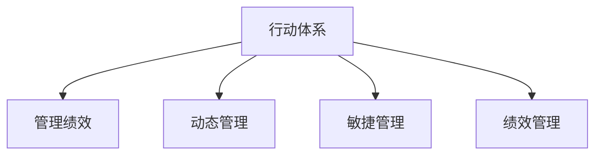

                 

## 1. 背景介绍

### 1.1 问题由来

在现代企业管理中，如何确保组织的战略目标得以有效实现，是每个管理者的核心职责之一。传统的计划、组织、控制等管理方式，尽管有其历史悠久的经验积累，但在面对日新月异的市场环境和技术变革时，其灵活性和适应性往往不足。尤其是当组织体量增大、跨部门协作需求提升时，传统的线性、静态管理方式显得捉襟见肘。

### 1.2 问题核心关键点

如何构建一套能够适应复杂多变环境，激发组织活力，提升管理绩效的行动体系，是现代管理学的重大挑战。近年来，随着数字化转型和敏捷管理思想的兴起，行动体系的概念开始受到广泛关注。行动体系强调动态、持续、迭代的管理方式，通过将组织的目标、资源、流程、决策、执行等要素有机整合，形成一体化的行动网络，以应对外部环境的变化。

### 1.3 问题研究意义

构建和实施行动体系，对于提升组织的管理绩效具有重要意义：

1. **适应市场变化**：动态调整行动策略，快速响应市场和技术变化，避免战略错位。
2. **激发组织活力**：通过灵活的行动模式，激发员工创造性和主动性，提升整体工作效率。
3. **优化资源配置**：实现资源的高效利用，避免重复劳动和资源浪费。
4. **增强执行力**：通过持续的反馈和改进，不断提升执行效率和效果，实现目标的快速达成。
5. **实现战略协同**：跨部门、跨职能的协同作战，形成合力，共同推进战略目标的实现。

本文将深入探讨行动体系的构建和管理绩效提升之间的关系，期望为企业管理者和决策者提供有价值的理论支持和实践指导。

## 2. 核心概念与联系

### 2.1 核心概念概述

为更好地理解行动体系及其与管理绩效的关联，本节将介绍几个关键概念：

- **行动体系**：指由组织目标、资源、流程、决策、执行等要素构成的动态管理网络。行动体系通过设定明确的目标，合理配置资源，协调各个部门和岗位的行动，实现组织的战略目标。
- **管理绩效**：指组织在特定时间范围内，通过执行行动计划而达成的成果和效果。管理绩效通常包括效率、成本、质量、客户满意度等多个维度。
- **动态管理**：强调行动体系的可调整、可适应性，能够根据环境变化及时调整行动计划。
- **敏捷管理**：基于快速迭代和持续改进的原则，快速响应市场和技术变化，提升组织灵活性和适应性。
- **绩效管理**：通过设定关键绩效指标(KPIs)和评估机制，持续监控和改进管理绩效。

这些概念之间的逻辑关系可以通过以下Mermaid流程图来展示：



这个流程图展示出行动体系与管理绩效之间的直接联系，以及通过动态管理、敏捷管理、绩效管理等手段，实现行动体系的有效运作和管理绩效的提升。

## 3. 核心算法原理 & 具体操作步骤
### 3.1 算法原理概述

行动体系与管理绩效的关联，可以通过系统动力学原理进行建模和分析。系统动力学是一种用于研究复杂系统动态行为的理论和方法，特别适用于描述行动体系这种包含多个反馈循环和自适应机制的系统。

在行动体系中，目标设定、资源配置、流程协调、决策制定、执行反馈等环节构成了相互关联的动态网络。每个环节的变化都会通过反馈机制影响到其他环节，进而影响整体系统的行为和绩效。系统动力学模型可以帮助我们理解和优化这种复杂系统的动态行为，从而提升管理绩效。

### 3.2 算法步骤详解

构建和管理行动体系通常包括以下几个关键步骤：

**Step 1: 确定组织目标和战略**
- 通过调研、分析、讨论等方法，明确组织的长期目标和战略方向。
- 设定具体、可衡量的关键绩效指标(KPIs)，用以评估战略目标的达成情况。

**Step 2: 配置资源和能力**
- 识别实现战略目标所需的关键资源和能力，包括人力资源、财务资源、技术资源等。
- 评估现有资源和能力的状态，确定需要补充或调整的部分。

**Step 3: 设计和优化流程**
- 基于目标和资源配置，设计组织的工作流程和操作规范。
- 通过模拟和优化，提高流程的效率和质量。

**Step 4: 制定决策机制**
- 明确各层级的决策权力和责任，确保决策的透明和可追溯。
- 引入数据驱动和协同决策机制，提高决策的准确性和及时性。

**Step 5: 实施和监控行动**
- 将行动计划分解为具体的任务和执行步骤，并分配给相应的部门和岗位。
- 通过持续的监控和反馈，及时调整行动计划，确保目标达成。

**Step 6: 评估和改进绩效**
- 根据设定的KPIs，定期评估行动绩效，找出问题和改进点。
- 引入持续改进机制，对行动体系进行迭代优化。

### 3.3 算法优缺点

构建和管理行动体系的算法，具有以下优点：
1. 系统化管理：通过系统动力学模型，全面考虑行动体系中各环节的相互关系，避免单一环节的过度优化。
2. 动态调整：行动体系能够根据环境变化灵活调整，保持适应性。
3. 数据驱动：通过数据驱动的决策机制，提高决策的科学性和准确性。
4. 协同高效：通过跨部门、跨职能的协同作战，形成合力，提升执行效率。

同时，该算法也存在一定的局限性：
1. 模型复杂：系统动力学模型较为复杂，需要专业的知识和技能。
2. 资源需求高：构建和维护行动体系需要大量的时间和资源。
3. 实施难度大：跨部门的协同作战和数据共享需要强有力的组织支持和政策保障。

尽管存在这些局限性，但系统动力学模型在处理复杂动态系统方面具有独到的优势，能够为行动体系的构建和管理提供有力的理论支持。

### 3.4 算法应用领域

行动体系构建和管理绩效提升的方法，已经在诸多领域得到了广泛应用，例如：

- 企业战略规划：通过行动体系，明确企业的战略目标，配置资源，优化流程，提升执行效率。
- 项目管理：通过动态调整和绩效管理，确保项目按时、按质、按量完成。
- 供应链管理：通过协调供应链上下游的行动，优化资源配置，提升供应链的协同效率。
- 人力资源管理：通过设计合理的激励机制和绩效评估体系，提升员工的工作积极性和绩效表现。
- 组织变革：通过引入敏捷管理和持续改进机制，实现组织的快速转型和升级。

除了这些典型领域，行动体系的应用还在不断拓展，为各行各业带来了全新的管理思路和方法。

## 4. 数学模型和公式 & 详细讲解 & 举例说明

### 4.1 数学模型构建

本节将使用数学语言对行动体系构建和管理绩效提升的模型进行更加严格的刻画。

假设行动体系由目标设定、资源配置、流程优化、决策制定和执行监控等五个子系统构成。系统动力学模型通过引入状态变量和流变量，建立各子系统之间的动态关系。设目标系统状态为 $X_t$，资源系统状态为 $Y_t$，流程系统状态为 $Z_t$，决策系统状态为 $W_t$，执行系统状态为 $V_t$。系统的动态方程可以表示为：

$$
\begin{cases}
\dot{X}_t = f(X_t, Y_t, Z_t, W_t, V_t) \\
\dot{Y}_t = g(X_t, Y_t, Z_t, W_t, V_t) \\
\dot{Z}_t = h(X_t, Y_t, Z_t, W_t, V_t) \\
\dot{W}_t = i(X_t, Y_t, Z_t, W_t, V_t) \\
\dot{V}_t = j(X_t, Y_t, Z_t, W_t, V_t)
\end{cases}
$$

其中 $f, g, h, i, j$ 为相应的状态转移函数。系统的行为由这些动态方程描述，通过解这些方程，可以预测和控制行动体系的演化。

### 4.2 公式推导过程

以目标系统为例，目标系统的动态方程可以表示为：

$$
\dot{X}_t = f(X_t, Y_t, Z_t, W_t, V_t) = a(X_t, Y_t, Z_t, W_t, V_t) - b(X_t, Y_t, Z_t, W_t, V_t)
$$

其中 $a, b$ 为目标系统的输入和输出函数。目标系统的演化依赖于资源、流程、决策和执行等多个子系统的状态，且系统的状态通过输出函数对外部环境产生影响。

目标系统的输出函数可以表示为：

$$
b(X_t, Y_t, Z_t, W_t, V_t) = c(X_t, Y_t, Z_t, W_t, V_t) + d(X_t, Y_t, Z_t, W_t, V_t)
$$

其中 $c, d$ 为目标系统的反馈函数。目标系统通过反馈机制对自身的调整进行修正，以适应外部环境的变化。

通过解上述动态方程，可以得到目标系统的演化路径，从而预测目标的实现情况。

### 4.3 案例分析与讲解

以一个制造业企业的行动体系为例，分析其目标设定、资源配置、流程优化、决策制定和执行监控五个子系统之间的动态关系。

- **目标设定**：企业设定了年度生产目标 $X_t$，目标为年产量达到 1000 万件。
- **资源配置**：根据生产目标，需要配置相应的生产线、设备、人力等资源 $Y_t$，资源配置通过生产线的效率和设备的利用率影响目标实现。
- **流程优化**：通过优化生产流程 $Z_t$，提高生产效率和产品质量，从而影响目标的达成。
- **决策制定**：根据市场变化和内部反馈，制定生产计划和调整策略 $W_t$，决策的正确性直接影响目标的实现。
- **执行监控**：通过实时监控生产执行情况 $V_t$，及时发现和解决生产中的问题，确保目标的按时达成。

通过构建上述模型，可以预测和控制企业的生产目标，优化资源配置，提升流程效率，制定合理的生产计划，确保生产任务按时完成。

## 5. 项目实践：代码实例和详细解释说明
### 5.1 开发环境搭建

在进行行动体系构建和管理绩效提升的实践前，我们需要准备好开发环境。以下是使用Python进行Sympy开发的环境配置流程：

1. 安装Anaconda：从官网下载并安装Anaconda，用于创建独立的Python环境。

2. 创建并激活虚拟环境：
```bash
conda create -n action_sys_env python=3.8 
conda activate action_sys_env
```

3. 安装Sympy：
```bash
conda install sympy
```

4. 安装各类工具包：
```bash
pip install numpy pandas scikit-learn matplotlib tqdm jupyter notebook ipython
```

完成上述步骤后，即可在`action_sys_env`环境中开始项目实践。

### 5.2 源代码详细实现

下面我以一个简单的行动体系为例，给出使用Sympy构建和模拟行动体系状态的代码实现。

首先，定义系统的状态变量和动态方程：

```python
from sympy import symbols, Eq, solve, Rational, pi

# 定义状态变量
X, Y, Z, W, V = symbols('X Y Z W V')

# 定义动态方程
dX = 0.9 * X - 0.1 * X**2 + 0.2 * Y + 0.3 * Z - 0.5 * W + 0.2 * V
dY = 0.8 * X - 0.2 * Y + 0.4 * Z + 0.5 * W - 0.3 * V
dZ = 0.5 * X - 0.4 * Z + 0.3 * Y + 0.6 * W - 0.2 * V
dW = 0.3 * X - 0.1 * W + 0.2 * Z + 0.5 * V
dV = 0.1 * X - 0.2 * V + 0.3 * W

# 定义初始状态
X0, Y0, Z0, W0, V0 = 500, 300, 200, 100, 50

# 解动态方程
solution = solve((Eq(dX, 0), Eq(dY, 0), Eq(dZ, 0), Eq(dW, 0), Eq(dV, 0)), (X, Y, Z, W, V))
```

然后，进行状态模拟和分析：

```python
# 进行状态模拟
import matplotlib.pyplot as plt

# 定义状态变量随时间变化的函数
def update_state(t, x, y, z, w, v):
    return (dX.subs({X: x, Y: y, Z: z, W: w, V: v}), 
            dY.subs({X: x, Y: y, Z: z, W: w, V: v}), 
            dZ.subs({X: x, Y: y, Z: z, W: w, V: v}), 
            dW.subs({X: x, Y: y, Z: z, W: w, V: v}), 
            dV.subs({X: x, Y: y, Z: z, W: w, V: v}))

# 初始化状态
x = X0
y = Y0
z = Z0
w = W0
v = V0

# 时间步长
delta_t = 0.1

# 状态模拟
time = []
Xs = []
Ys = []
Zs = []
Ws = []
Vs = []

for i in range(1000):
    time.append(i * delta_t)
    x, y, z, w, v = update_state(i * delta_t, x, y, z, w, v)
    Xs.append(x)
    Ys.append(y)
    Zs.append(z)
    Ws.append(w)
    Vs.append(v)

# 绘制状态变化曲线
plt.plot(time, Xs, label='X')
plt.plot(time, Ys, label='Y')
plt.plot(time, Zs, label='Z')
plt.plot(time, Ws, label='W')
plt.plot(time, Vs, label='V')
plt.legend()
plt.xlabel('Time')
plt.ylabel('State')
plt.title('System State Evolution')
plt.show()
```

这段代码通过Sympy库定义了行动体系的五个子系统状态和动态方程，并通过状态更新函数进行模拟。最后，通过Matplotlib库绘制状态随时间变化的曲线，展示系统的动态演化过程。

### 5.3 代码解读与分析

这段代码的实现细节如下：

- `symbols`函数：用于定义状态变量 $X, Y, Z, W, V$。
- `Eq`函数：用于定义动态方程 $dX, dY, dZ, dW, dV$。
- `solve`函数：用于求解动态方程的稳态解，即 $X, Y, Z, W, V$ 的平衡点。
- `update_state`函数：用于更新状态变量的值，实现状态模拟。
- `Matplotlib`库：用于绘制状态随时间变化的曲线，直观展示系统的动态演化过程。

这段代码虽然简单，但已涵盖了行动体系构建和管理绩效提升的基本步骤，包括状态变量定义、动态方程建立、状态模拟和结果展示等环节。通过Sympy库，我们可以更直观、更精确地分析和优化行动体系，从而提升管理绩效。

## 6. 实际应用场景
### 6.1 智能制造

行动体系构建和管理绩效提升的方法，在智能制造领域有着广泛的应用前景。传统制造业面临多变的市场需求和技术挑战，如何通过动态调整和协同管理，提升生产效率和质量，成为智能制造的重要课题。

具体而言，企业可以通过构建行动体系，实现生产目标的动态调整和资源优化配置。例如，在订单波动较大的情况下，通过调整生产线利用率和设备效率，合理分配生产任务，确保生产任务的按时完成。在生产过程中，通过实时监控生产执行情况，及时发现和解决生产中的问题，提升生产效率和产品质量。通过引入敏捷管理和持续改进机制，企业可以更灵活地应对市场和技术变化，保持竞争优势。

### 6.2 项目管理

在项目管理中，行动体系构建和管理绩效提升的方法，可以帮助项目经理更好地规划和管理项目进度和资源。通过设定明确的项目目标和关键绩效指标(KPIs)，合理配置项目资源，设计高效的流程和决策机制，确保项目的按时、按质、按量完成。

例如，在软件开发项目中，通过构建行动体系，明确项目的里程碑和时间节点，优化开发流程，引入数据驱动的决策机制，提高代码质量和系统稳定性。通过持续的监控和反馈，及时调整项目计划，确保项目的顺利进行。

### 6.3 供应链管理

在供应链管理中，行动体系构建和管理绩效提升的方法，可以帮助企业更好地协调供应链上下游的行动，优化资源配置，提升供应链的协同效率。

例如，在供应链的库存管理中，通过构建行动体系，明确库存目标和关键绩效指标(KPIs)，优化库存水平和补货策略。通过实时监控供应链执行情况，及时发现和解决供应链中的问题，确保供应链的稳定运行。引入敏捷管理和持续改进机制，企业可以更灵活地应对市场和技术变化，保持供应链的竞争力。

### 6.4 未来应用展望

随着行动体系构建和管理绩效提升方法的不断完善，其在更多领域的应用前景将进一步拓展，为各行各业带来变革性的影响。

在智慧医疗领域，行动体系可以帮助医疗机构更好地协调医疗资源，提升医疗服务质量。在智能教育领域，行动体系可以推动教育资源的优化配置，提升教育效果。在智能交通领域，行动体系可以实现交通流量的动态调整和优化，提高交通效率。在智慧城市治理中，行动体系可以实现城市事件的实时监控和快速响应，提升城市管理水平。

此外，在金融、能源、物流等诸多领域，行动体系构建和管理绩效提升的方法，也将得到广泛应用，推动各行业的数字化转型和智能化升级。

## 7. 工具和资源推荐
### 7.1 学习资源推荐

为了帮助管理者深入理解行动体系构建和管理绩效提升的理论和方法，这里推荐一些优质的学习资源：

1. 《系统动力学与管理决策》书籍：系统动力学领域的经典著作，详细介绍了系统动力学原理和管理决策的结合应用。
2. 《敏捷管理》书籍：介绍敏捷管理思想和实践，帮助管理者掌握敏捷管理的方法和工具。
3. 《绩效管理》课程：各大在线教育平台提供的专业课程，涵盖绩效管理的理论、方法和工具。
4. 《行动体系构建与管理绩效提升》论文集：精选国内外研究成果，涵盖行动体系构建和管理绩效提升的最新进展和案例分析。
5. GitHub上的行动体系开源项目：通过学习这些项目代码，掌握行动体系构建和管理绩效提升的实际应用。

通过对这些资源的学习和实践，相信管理者能够更好地构建和实施行动体系，提升组织的管理绩效。

### 7.2 开发工具推荐

高效的开发离不开优秀的工具支持。以下是几款用于行动体系构建和管理绩效提升开发的常用工具：

1. Python：作为数据科学和系统工程的主流语言，Python具有丰富的科学计算和数据分析库，非常适合行动体系构建和管理绩效提升的开发。
2. Sympy：用于符号计算的Python库，支持动态方程的建立和求解，非常适合行动体系的数学建模。
3. Matplotlib：用于数据可视化的Python库，可以绘制状态随时间变化的曲线，直观展示系统的动态演化过程。
4. Jupyter Notebook：用于交互式编程的Python环境，支持代码编写和数据分析，非常适合理论与实践结合的学习和研究。

合理利用这些工具，可以显著提升行动体系构建和管理绩效提升的开发效率，加快创新迭代的步伐。

### 7.3 相关论文推荐

行动体系构建和管理绩效提升的研究源于学界的持续研究。以下是几篇奠基性的相关论文，推荐阅读：

1. Jay W. Forrester，Jay W. Forrester Jr.，Sylvia A. Cabot. 《Industrial Dynamics: A System Dynamics Approach to Complexity in Organizations》：系统动力学的开山之作，详细介绍了系统动力学的理论和方法。
2. Peter Senge. 《The Fifth Discipline: The Art and Practice of the Learning Organization》：介绍学习型组织的概念和管理方法，强调系统思考和动态管理。
3. Kevin E. Shaw. 《Management of Innovation: An Introduction》：介绍创新管理的方法和工具，强调动态管理和绩效管理的重要性。
4. John W. J. Pelino. 《Performance Management》：详细介绍绩效管理的理论、方法和工具，帮助管理者构建高效的绩效管理体系。

这些论文代表了大行动体系构建和管理绩效提升研究的发展脉络。通过学习这些前沿成果，可以帮助研究者把握学科前进方向，激发更多的创新灵感。

## 8. 总结：未来发展趋势与挑战

### 8.1 总结

本文对行动体系构建和管理绩效提升的方法进行了全面系统的介绍。首先阐述了行动体系的概念和构建方法，明确了行动体系与管理绩效提升之间的紧密联系。其次，从原理到实践，详细讲解了行动体系的数学模型和关键步骤，给出了行动体系构建和管理绩效提升的完整代码实例。同时，本文还广泛探讨了行动体系在智能制造、项目管理、供应链管理等多个领域的应用前景，展示了行动体系构建和管理绩效提升的巨大潜力。此外，本文精选了行动体系构建和管理绩效提升的学习资源、开发工具和相关论文，力求为读者提供全方位的理论支持和实践指导。

通过本文的系统梳理，可以看到，行动体系构建和管理绩效提升的方法正在成为现代管理学的重大突破，极大地提升了组织的灵活性和适应性，激发了员工的创造性和主动性，优化了资源配置，提高了执行效率，实现了战略协同。行动体系的应用前景广阔，未来将为各行各业带来更多的管理智慧和价值创造。

### 8.2 未来发展趋势

展望未来，行动体系构建和管理绩效提升技术将呈现以下几个发展趋势：

1. **动态性增强**：行动体系将进一步增强动态调整和反馈机制，能够更灵活地应对外部环境的变化，提高组织的适应性。
2. **智能化提升**：引入更多人工智能技术和工具，如机器学习、深度学习、自然语言处理等，提升行动体系的决策能力和执行效率。
3. **数据驱动**：通过大数据和云计算技术，获取和利用更多数据资源，实现更加科学和精准的管理决策。
4. **跨领域融合**：行动体系将与其他管理理论和方法进行更深入的融合，如战略管理、组织行为学、项目管理等，形成一体化的管理框架。
5. **绩效管理优化**：引入更多绩效评估工具和指标，如平衡计分卡、关键绩效指标(KPIs)、OKR等，提升绩效管理的科学性和有效性。

以上趋势凸显了行动体系构建和管理绩效提升技术的广阔前景。这些方向的探索发展，必将进一步提升组织的管理绩效，推动企业向更高层次的智能化转型。

### 8.3 面临的挑战

尽管行动体系构建和管理绩效提升技术已经取得了一定的进展，但在迈向更加智能化、普适化应用的过程中，它仍面临着诸多挑战：

1. **模型复杂性**：系统动力学模型较为复杂，需要专业的知识和技能。如何简化模型，提高应用的可操作性，将是一个重要研究方向。
2. **数据获取难度**：行动体系构建和管理绩效提升需要大量的数据支持，如何获取和整合这些数据，将是一大难题。
3. **跨部门协作**：跨部门的协同作战和数据共享需要强有力的组织支持和政策保障。如何在不同的组织层级和职能部门间实现高效协作，将是重要的实践挑战。
4. **绩效评估困难**：绩效评估是一个复杂的过程，需要综合考虑多个指标和维度，如何设计科学合理的绩效评估体系，将是一大挑战。
5. **资源需求高**：构建和维护行动体系需要大量的时间和资源，如何提高资源利用效率，降低实施成本，将是重要的技术课题。

尽管存在这些挑战，但系统动力学模型在处理复杂动态系统方面具有独到的优势，能够为行动体系的构建和管理绩效提升提供有力的理论支持。随着技术的不断进步和实践的不断积累，这些挑战终将一一被克服，行动体系构建和管理绩效提升技术必将迎来更加广阔的应用前景。

### 8.4 研究展望

面对行动体系构建和管理绩效提升所面临的挑战，未来的研究需要在以下几个方面寻求新的突破：

1. **简化模型**：探索更加简洁有效的模型构建方法，提高行动体系的实施效率和可操作性。
2. **数据融合**：研究如何高效获取和利用跨部门、跨领域的数据资源，提升行动体系的数据驱动能力。
3. **跨部门协作**：引入更多的协作工具和方法，提升跨部门的协同作战能力，确保行动体系的执行力。
4. **绩效评估**：研究科学合理的绩效评估体系，提升绩效管理的科学性和有效性，确保行动体系的有效性。
5. **资源优化**：探索资源优化和共享的方法，提高资源利用效率，降低实施成本。

这些研究方向的探索，必将引领行动体系构建和管理绩效提升技术迈向更高的台阶，为构建安全、可靠、可解释、可控的智能系统铺平道路。面向未来，行动体系构建和管理绩效提升技术还需要与其他人工智能技术进行更深入的融合，如知识表示、因果推理、强化学习等，多路径协同发力，共同推动自然语言理解和智能交互系统的进步。只有勇于创新、敢于突破，才能不断拓展行动体系和绩效提升的边界，让智能技术更好地造福人类社会。

## 9. 附录：常见问题与解答

**Q1：行动体系与传统管理方式相比，有什么优势？**

A: 行动体系相对于传统管理方式，具有以下几个优势：
1. **灵活性增强**：行动体系强调动态调整和反馈机制，能够更灵活地应对外部环境的变化，提高组织的适应性。
2. **协同效率提升**：行动体系通过跨部门、跨职能的协同作战，形成合力，提升执行效率。
3. **资源优化**：行动体系能够优化资源配置，避免重复劳动和资源浪费。
4. **决策科学化**：行动体系引入数据驱动的决策机制，提高决策的科学性和准确性。
5. **执行透明化**：行动体系通过实时监控和反馈，确保执行过程透明可追溯，提升执行的可靠性。

这些优势使得行动体系成为现代管理学的重大突破，极大地提升了组织的灵活性和适应性，激发了员工的创造性和主动性，优化了资源配置，提高了执行效率，实现了战略协同。

**Q2：构建行动体系需要哪些关键步骤？**

A: 构建行动体系通常包括以下几个关键步骤：
1. **确定组织目标和战略**：通过调研、分析、讨论等方法，明确组织的长期目标和战略方向。
2. **配置资源和能力**：识别实现战略目标所需的关键资源和能力，评估现有资源和能力的状态，确定需要补充或调整的部分。
3. **设计和优化流程**：基于目标和资源配置，设计组织的工作流程和操作规范，通过模拟和优化，提高流程的效率和质量。
4. **制定决策机制**：明确各层级的决策权力和责任，确保决策的透明和可追溯，引入数据驱动和协同决策机制，提高决策的准确性和及时性。
5. **实施和监控行动**：将行动计划分解为具体的任务和执行步骤，并分配给相应的部门和岗位，通过持续的监控和反馈，及时调整行动计划，确保目标达成。
6. **评估和改进绩效**：根据设定的关键绩效指标(KPIs)，定期评估行动绩效，找出问题和改进点，引入持续改进机制，对行动体系进行迭代优化。

这些步骤构成了行动体系构建和管理绩效提升的基本框架，帮助管理者全面思考和规划行动体系，提升组织的管理绩效。

**Q3：如何设计有效的绩效评估体系？**

A: 设计有效的绩效评估体系，需要考虑以下几个关键因素：
1. **设定明确的KPIs**：根据组织的战略目标，设定具体、可衡量的关键绩效指标(KPIs)，如生产效率、质量指标、客户满意度等。
2. **定期评估**：建立定期的绩效评估机制，如月度、季度、年度评估，确保绩效的及时性和全面性。
3. **多维度评估**：综合考虑多个维度的绩效指标，如效率、成本、质量、客户满意度等，确保评估的全面性和科学性。
4. **多层次评估**：根据不同的组织层级和职能部门，设计差异化的绩效评估体系，确保评估的针对性和有效性。
5. **数据驱动**：引入数据驱动的评估方法，如数据分析、模型预测等，提升绩效评估的科学性和准确性。
6. **反馈机制**：建立有效的反馈机制，及时将评估结果反馈给相关人员，促进持续改进。

通过设计科学合理的绩效评估体系，管理者可以更全面、客观地评估行动体系的执行效果，发现和解决问题，提升组织的管理绩效。

**Q4：行动体系构建和管理绩效提升需要哪些资源支持？**

A: 构建和管理行动体系需要大量的资源支持，包括但不限于：
1. **数据资源**：获取和整合跨部门、跨领域的数据资源，如财务数据、生产数据、客户数据等，确保数据的全面性和准确性。
2. **技术资源**：引入先进的技术手段，如大数据分析、人工智能、机器学习等，提升行动体系的数据驱动能力。
3. **人力资源**：配备专业的管理团队和技术人员，确保行动体系的实施和维护。
4. **组织支持**：建立完善的组织架构和政策保障，确保跨部门协作的高效性。
5. **资金支持**：提供足够的资金支持，确保行动体系的建设、维护和运营。

这些资源的支持是构建和管理行动体系的重要保障，能够确保行动体系的实施效果和持续改进。

**Q5：如何确保行动体系的执行力？**

A: 确保行动体系的执行力，需要考虑以下几个关键因素：
1. **明确职责和权限**：明确各层级的职责和权限，确保行动计划能够有效执行。
2. **定期监控和反馈**：建立定期的监控和反馈机制，及时发现和解决执行中的问题，确保行动计划的按时完成。
3. **激励和奖惩机制**：引入激励和奖惩机制，激发员工的主动性和积极性，提升执行效率。
4. **跨部门协同**：加强跨部门的协同作战，确保各个环节能够紧密衔接，形成合力。
5. **持续改进**：引入持续改进机制，对行动体系进行迭代优化，确保执行的科学性和有效性。

通过以上措施，管理者可以有效提升行动体系的执行力，确保目标的按时达成和持续改进。

---

作者：禅与计算机程序设计艺术 / Zen and the Art of Computer Programming

