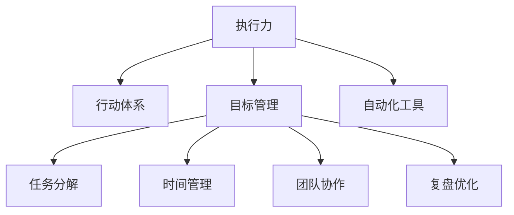

                 

# 行动体系如何提升执行力

> 关键词：执行力, 行动体系, 目标管理, 任务分解, 时间管理, 团队协作, 复盘优化, 自动化工具

## 1. 背景介绍

在数字化时代，信息技术的高速发展给企业带来了前所未有的机遇，同时也带来了新的挑战。如何在复杂多变的环境中，保持团队的执行力，迅速响应市场变化，实现持续的创新和成长，成为每个企业都必须面对的问题。特别是在高科技行业，如IT、互联网、通信等，企业的核心竞争力往往在于其快速执行和高效协作的能力。

执行力是一个团队乃至一个组织的核心能力，它直接关系到组织的战略目标能否实现。执行力的强弱，决定了一个团队的工作效率和绩效水平。然而，执行力并非天生，而是需要通过系统化的训练和管理，不断提升和优化。本文将从核心概念、算法原理、具体操作步骤、实际应用场景等多个方面，探讨如何构建和优化一个高效的执行力体系，帮助企业提升整体执行力。

## 2. 核心概念与联系

### 2.1 核心概念概述

为更好地理解执行力提升的原理和方法，本文将介绍几个密切相关的核心概念：

- **执行力**：指在确定目标后，能够高效、准确地完成任务的能力。它涵盖了计划、执行、监控和复盘等全过程，是组织能力的综合体现。

- **行动体系**：指为提升执行力而构建的系统化方法论，包括目标管理、任务分解、时间管理、团队协作、复盘优化等核心模块。

- **目标管理**：通过设定明确的目标和计划，对任务进行分解和优先排序，确保团队能够集中精力、高效执行。

- **任务分解**：将大目标分解为小任务，明确每个任务的具体内容和责任人，便于管理和执行。

- **时间管理**：通过科学的时间规划和分配，确保每个任务在规定时间内完成，提高工作效率。

- **团队协作**：通过合理的分工和沟通机制，确保团队成员之间的协调和配合，提升整体执行力。

- **复盘优化**：对已完成的任务进行回顾和总结，查找问题、总结经验，进行持续改进。

这些核心概念之间的逻辑关系可以通过以下Mermaid流程图来展示：



这个流程图展示了一致执行力提升的关键步骤和要素：

1. 执行力是行动体系的核心输出，通过系统化的方法论来实现。
2. 目标管理、任务分解、时间管理、团队协作和复盘优化是行动体系的主要组成部分，每个模块都是执行力提升的关键环节。
3. 自动化工具是提升执行力的辅助手段，通过技术手段提高工作效率和管理精度。

## 3. 核心算法原理 & 具体操作步骤

### 3.1 算法原理概述

提升执行力本质上是通过科学的管理方法论，将复杂的任务和目标分解为可执行的小任务，并高效地进行计划、执行、监控和复盘。这一过程涉及到多个算法和步骤，包括目标设定、任务分解、时间规划、团队协作和结果复盘等。

执行力提升的算法原理可以概括为：

1. **目标设定**：通过SMART原则（具体、可测量、可实现、相关、时限）设定明确的目标。
2. **任务分解**：将目标分解为具体的任务和子任务，明确责任人和完成时间。
3. **时间规划**：通过甘特图、看板、日历等工具，科学地规划每个任务的时间进度。
4. **团队协作**：建立透明的沟通机制和协作平台，确保信息流动和任务协调。
5. **结果复盘**：定期回顾任务的执行情况，总结经验和教训，进行持续改进。

### 3.2 算法步骤详解

提升执行力的具体操作步骤可以分为以下几个阶段：

**阶段一：目标设定**

1. **明确目标**：通过SMART原则，设定明确、具体、可实现的目标。例如，“在3个月内，提高产品的市场份额20%”。

2. **分解任务**：将大目标分解为具体的任务和子任务，每个任务都有明确的目标和责任人。例如，将目标分解为“市场调研、产品优化、营销推广、用户反馈”等任务。

3. **确定优先级**：对任务进行优先级排序，确定哪些任务需要优先完成，哪些任务可以稍后进行。

**阶段二：任务分解**

1. **细化任务**：将每个任务进一步分解为可执行的小任务。例如，“市场调研”可以分解为“数据收集、数据分析、市场趋势预测”等子任务。

2. **分配责任**：明确每个小任务的负责人和完成时间。例如，“数据分析”任务由小张负责，预计用2天完成。

3. **设置里程碑**：在任务分解中，设置关键节点和里程碑，用于监控任务的进度和状态。

**阶段三：时间规划**

1. **甘特图**：使用甘特图工具，将任务和时间规划可视化，清晰展示每个任务的时间进度和依赖关系。

2. **看板管理**：使用看板工具（如Jira、Trello等），实时跟踪任务的状态和进度，确保任务按时完成。

3. **日历安排**：使用日历工具（如Google Calendar），明确每个任务的开始和结束时间，确保时间规划的准确性。

**阶段四：团队协作**

1. **沟通机制**：建立透明的沟通机制，确保信息流通畅，团队成员之间可以随时交流任务进展和问题。

2. **协作平台**：使用协作平台（如Slack、微信等），集中管理和更新任务状态，便于团队成员随时查看和更新。

3. **定期会议**：定期召开团队会议，讨论任务进展和存在的问题，确保团队成员之间的高效协作。

**阶段五：结果复盘**

1. **回顾执行情况**：定期回顾任务的执行情况，总结成功经验和存在的问题。

2. **总结经验教训**：从执行情况中总结经验教训，形成可复用的知识库。

3. **持续改进**：根据总结的经验教训，不断优化和改进任务执行流程，提升整体执行力。

### 3.3 算法优缺点

提升执行力体系的优势包括：

1. **系统化管理**：通过科学的管理方法和工具，将复杂任务分解为可执行的小任务，提高执行的效率和准确性。
2. **透明化沟通**：通过透明的沟通机制和协作平台，确保信息流通畅，减少误解和遗漏。
3. **持续改进**：通过定期的复盘和总结，不断优化和改进任务执行流程，提升整体执行力。

其缺点主要在于：

1. **初期成本高**：在初期设置目标和分解任务的过程中，需要投入大量的时间和精力，可能面临较高的初始成本。
2. **依赖工具和技术**：提升执行力体系需要依赖各种工具和技术，工具选择和配置不当可能影响效率。
3. **管理复杂度**：对于大规模复杂项目，管理和协调任务可能会变得复杂，需要较高的管理水平和经验。

### 3.4 算法应用领域

提升执行力体系广泛应用于各种领域，特别是在高科技行业，如IT、互联网、通信等。以下是几个典型的应用场景：

- **产品开发**：通过提升执行力体系，确保产品开发项目按时按质完成，实现快速迭代和市场响应。
- **项目管理**：在项目管理中，通过提升执行力体系，确保项目任务有序推进，风险可控，按时交付。
- **客户服务**：在客户服务中，通过提升执行力体系，确保客户服务响应及时，服务质量高效，提升客户满意度。
- **市场推广**：在市场推广中，通过提升执行力体系，确保市场活动有序进行，提升市场占有率。
- **团队建设**：在团队建设中，通过提升执行力体系，提高团队成员的工作效率和协作能力，增强团队凝聚力。

## 4. 数学模型和公式 & 详细讲解 & 举例说明

### 4.1 数学模型构建

提升执行力体系的核心是目标管理、任务分解、时间管理、团队协作和复盘优化。以下将通过数学模型和公式对这些关键要素进行详细讲解。

1. **目标管理**

假设目标为 $T$，需要分解为 $N$ 个任务，每个任务的目标为 $t_i$，且 $t_i$ 满足 $t_i \leq T$。

2. **任务分解**

假设每个任务 $t_i$ 可以分解为 $M_i$ 个子任务，每个子任务的目标为 $s_{i,j}$，且 $s_{i,j} \leq t_i$。

3. **时间管理**

假设每个子任务 $s_{i,j}$ 的计划完成时间为 $p_{i,j}$，实际完成时间为 $c_{i,j}$。

4. **团队协作**

假设团队中有 $P$ 个成员，每个成员的任务分配为 $a_{i,j}$，且 $a_{i,j} \in [0,1]$。

5. **复盘优化**

假设在执行过程中出现 $E$ 个问题，每个问题的影响为 $e_{i,j}$，且 $e_{i,j} \in [0,1]$。

### 4.2 公式推导过程

通过上述假设，我们可以推导出以下数学模型：

1. **目标管理**

$$
\sum_{i=1}^N t_i = T
$$

2. **任务分解**

$$
\sum_{j=1}^{M_i} s_{i,j} = t_i
$$

3. **时间管理**

$$
c_{i,j} = f(p_{i,j}, e_{i,j})
$$

其中 $f$ 为时间规划函数，考虑了任务分解的粒度和问题的影响。

4. **团队协作**

$$
\sum_{i=1}^N \sum_{j=1}^{M_i} a_{i,j} = 1
$$

其中 $a_{i,j}$ 为任务 $t_i$ 中子任务 $s_{i,j}$ 的完成比例。

5. **复盘优化**

$$
\sum_{i=1}^N e_{i,j} = E
$$

其中 $E$ 为执行过程中出现的问题总数。

### 4.3 案例分析与讲解

以软件开发项目为例，进行具体的分析与讲解。

**项目目标**：开发一个新的移动应用，用户数达到100万，市场份额达到20%。

**任务分解**：

- 任务1：市场调研（调研用户需求、分析市场竞争）
- 任务2：产品设计（确定产品功能、界面设计）
- 任务3：技术开发（编码、测试、优化）
- 任务4：市场营销（制定营销策略、推广活动）
- 任务5：用户反馈（收集用户反馈、优化产品）

**时间管理**：

- 任务1：调研周期为2周，预算为1000美元。
- 任务2：设计周期为3周，预算为2000美元。
- 任务3：开发周期为8周，预算为10000美元。
- 任务4：市场推广周期为4周，预算为5000美元。
- 任务5：用户反馈周期为持续进行，预算为2000美元。

**团队协作**：

- 任务1：小李负责市场调研，小王负责数据分析。
- 任务2：小张负责产品设计，小刘负责界面设计。
- 任务3：小赵负责编码，小孙负责测试，小李负责优化。
- 任务4：小周负责制定策略，小王负责推广活动。
- 任务5：小李负责收集反馈，小王负责产品优化。

**复盘优化**：

- 问题1：任务1时间延误，原因是对市场调研的重视不足。
- 问题2：任务3超预算，原因是开发过程中出现了额外的功能需求。
- 问题3：任务4效果不佳，原因是市场推广策略不够精准。
- 问题4：任务5用户反馈量不足，原因是用户反馈机制不完善。

通过对以上案例的分析，可以看出，通过科学的目标管理和任务分解，结合合理的时间规划和团队协作，以及定期的复盘优化，可以显著提升执行力的水平。

## 5. 项目实践：代码实例和详细解释说明

### 5.1 开发环境搭建

为了更好地实现提升执行力体系，我们需要准备好开发环境。以下是使用Python进行开发的环境配置流程：

1. 安装Anaconda：从官网下载并安装Anaconda，用于创建独立的Python环境。

2. 创建并激活虚拟环境：
```bash
conda create -n execution-env python=3.8 
conda activate execution-env
```

3. 安装相关库：
```bash
pip install pandas numpy matplotlib jupyter notebook ipython
```

4. 配置自动化工具：
```bash
pip install Airflow
```

完成上述步骤后，即可在`execution-env`环境中开始提升执行力体系的项目实践。

### 5.2 源代码详细实现

下面我们以项目管理为例，给出使用Airflow实现提升执行力体系的PyTorch代码实现。

首先，定义任务和依赖关系：

```python
from airflow import DAG
from airflow.operators.python_operator import PythonOperator
import datetime

default_args = {
    'owner': 'airflow',
    'depends_on_past': False,
    'email': ['your_email@example.com'],
    'email_on_failure': False,
    'email_on_retry': False,
    'retries': 1,
    'retry_delay': timedelta(minutes=5),
}

dag = DAG('execution', default_args=default_args, description='Execution Management', schedule='@daily')

# 定义任务
task1 = PythonOperator(
    task_id='task1',
    python_callable=task1_function,
    dag=dag
)

task2 = PythonOperator(
    task_id='task2',
    python_callable=task2_function,
    dag=dag
)

task3 = PythonOperator(
    task_id='task3',
    python_callable=task3_function,
    dag=dag
)

task4 = PythonOperator(
    task_id='task4',
    python_callable=task4_function,
    dag=dag
)

task5 = PythonOperator(
    task_id='task5',
    python_callable=task5_function,
    dag=dag
)

# 定义依赖关系
task1 >> task2 >> task3 >> task4 >> task5
```

然后，定义各个任务的具体实现：

```python
def task1_function():
    # 市场调研任务
    # 具体实现略

def task2_function():
    # 产品设计任务
    # 具体实现略

def task3_function():
    # 技术开发任务
    # 具体实现略

def task4_function():
    # 市场营销任务
    # 具体实现略

def task5_function():
    # 用户反馈任务
    # 具体实现略
```

最后，启动任务执行流程：

```python
dag.start_date = datetime.datetime(2023, 1, 1)

# 任务1
task1 = PythonOperator(
    task_id='task1',
    python_callable=task1_function,
    dag=dag
)

# 任务2
task2 = PythonOperator(
    task_id='task2',
    python_callable=task2_function,
    dag=dag
)

# 任务3
task3 = PythonOperator(
    task_id='task3',
    python_callable=task3_function,
    dag=dag
)

# 任务4
task4 = PythonOperator(
    task_id='task4',
    python_callable=task4_function,
    dag=dag
)

# 任务5
task5 = PythonOperator(
    task_id='task5',
    python_callable=task5_function,
    dag=dag
)

# 依赖关系
task1 >> task2 >> task3 >> task4 >> task5
```

以上就是使用Airflow进行项目管理提升执行力的完整代码实现。可以看到，通过定义任务和依赖关系，使用Airflow工具自动化管理任务执行，可以显著提高项目管理效率。

### 5.3 代码解读与分析

让我们再详细解读一下关键代码的实现细节：

**DAG定义**：
- 通过`DAG`类定义一个DAG对象，设置任务名称、描述、调度策略等参数。

**任务定义**：
- 使用`PythonOperator`类定义具体的任务，设置任务ID、执行函数、依赖关系等参数。

**任务执行**：
- 通过设置`start_date`，指定任务执行的起始时间。
- 定义每个任务的执行函数，具体实现任务的逻辑。

通过以上步骤，可以构建一个基于Airflow的提升执行力体系，实现对项目任务的自动化管理。这种系统化的管理方式，可以显著提升执行力的水平，减少人为干预和管理成本。

## 6. 实际应用场景

### 6.1 智能制造

在智能制造领域，提升执行力体系可以显著提高生产效率和产品质量。通过对生产流程进行科学规划和管理，确保每个环节按时按质完成，从而实现生产线的智能化和自动化。例如，在汽车制造企业，可以通过提升执行力体系，确保每个零件的装配时间和质量，减少生产停滞和废品率。

### 6.2 智能物流

在智能物流领域，提升执行力体系可以提升物流配送的效率和准确性。通过对物流路径进行优化和管理，确保每个节点按时到达，减少配送时间和成本。例如，在亚马逊等电商企业，可以通过提升执行力体系，确保包裹按时送达，提高用户满意度和品牌声誉。

### 6.3 智能客服

在智能客服领域，提升执行力体系可以提升客户服务的响应速度和质量。通过对客户咨询进行科学管理，确保每个咨询及时响应和解决，从而提升客户满意度和忠诚度。例如，在电商平台，可以通过提升执行力体系，确保客户咨询和问题及时处理，提升用户体验和口碑。

### 6.4 未来应用展望

随着数字化技术的不断进步，提升执行力体系将更广泛地应用于各个行业领域。未来，提升执行力体系将会结合更多前沿技术，如AI、大数据、物联网等，实现更加智能化的管理和优化。以下是几个未来应用展望：

1. **智能化管理平台**：通过AI技术和大数据分析，提升执行力体系的管理效率和精度，实现自动化和智能化。
2. **实时监控与预警**：通过物联网技术，实时监控任务执行情况，及时发现和预警潜在问题，减少损失和延误。
3. **跨部门协作**：通过协同工具和平台，实现跨部门、跨职能的高效协作，提升整体执行力。
4. **持续改进与优化**：通过持续复盘和优化，不断提升执行力的水平，适应变化多端的市场环境。

## 7. 工具和资源推荐

### 7.1 学习资源推荐

为了帮助开发者系统掌握提升执行力体系的理论基础和实践技巧，这里推荐一些优质的学习资源：

1. **《精益执行》（The Lean Execution）**：作者Eric Ries，深入介绍了精益创业和执行力的关键理念和方法，是提升执行力体系的重要参考书籍。

2. **《高效能人士的七个习惯》（The 7 Habits of Highly Effective People）**：作者Stephen R. Covey，介绍了高效人士的七个习惯，对提升执行力体系具有重要的指导意义。

3. **《从优秀到卓越》（Good to Great）**：作者Jim Collins，通过对众多成功企业的研究，揭示了执行力体系的关键因素和方法。

4. **《Scrum敏捷管理》（Scrum: The Art of Doing Twice the Work in Half the Time）**：作者Ken Schwaber，介绍了敏捷管理和提升执行力的Scrum方法论。

5. **《OKR目标管理》（Objectives and Key Results）**：作者Gina Tricot，详细介绍了OKR目标管理的方法和实践，是提升执行力体系的有效工具。

通过对这些资源的学习实践，相信你一定能够快速掌握提升执行力体系的理论基础和实践技巧。

### 7.2 开发工具推荐

高效的开发离不开优秀的工具支持。以下是几款用于提升执行力体系开发的常用工具：

1. **JIRA**：项目管理和任务跟踪工具，可以灵活配置任务状态和优先级，支持团队协作和进度跟踪。

2. **Trello**：看板管理工具，通过视觉化的方式展示任务进度和状态，便于团队成员实时查看和更新。

3. **Confluence**：文档协作工具，用于记录项目计划、任务描述和执行情况，支持多人协作和文档管理。

4. **Slack**：团队沟通工具，通过实时消息和协作平台，确保信息流通畅，减少误解和遗漏。

5. **Zoom**：视频会议工具，用于远程团队协作和沟通，支持多人视频、音频和屏幕共享。

6. **Google Drive**：云存储工具，用于共享和存储文档、数据和资源，支持实时编辑和协作。

合理利用这些工具，可以显著提升提升执行力体系的管理效率和精度，提升整体执行力水平。

### 7.3 相关论文推荐

提升执行力体系的研究涉及多学科交叉，以下是几篇具有代表性的相关论文，推荐阅读：

1. **《精益思想》（The Lean Startup）**：作者Eric Ries，介绍了精益创业和执行力的关键理念和方法，是提升执行力体系的重要参考书籍。

2. **《敏捷管理》（Agile Management）**：作者Kent Beck，介绍了敏捷管理和提升执行力的Scrum方法论，是提升执行力体系的有效工具。

3. **《OKR目标管理》（Objectives and Key Results）**：作者Gina Tricot，详细介绍了OKR目标管理的方法和实践，是提升执行力体系的有效工具。

这些论文代表了大语言模型微调技术的发展脉络。通过学习这些前沿成果，可以帮助研究者把握学科前进方向，激发更多的创新灵感。

## 8. 总结：未来发展趋势与挑战

### 8.1 总结

本文对提升执行力体系进行了全面系统的介绍。首先阐述了执行力提升的原理和方法，明确了目标管理、任务分解、时间管理、团队协作、复盘优化等关键环节在提升执行力体系中的重要性。其次，从算法原理到具体操作步骤，详细讲解了提升执行力体系的理论基础和实践技巧，给出了提升执行力体系的完整代码实例。同时，本文还广泛探讨了提升执行力体系在智能制造、智能物流、智能客服等多个行业领域的应用前景，展示了提升执行力体系的系统化管理能力。

通过本文的系统梳理，可以看出，提升执行力体系在数字化时代具有广泛的应用前景，对于提升组织效率和竞争力具有重要的战略意义。未来，随着信息技术的发展和应用，提升执行力体系将进一步提升组织的管理水平和运营效率，成为数字化时代的关键竞争力。

### 8.2 未来发展趋势

展望未来，提升执行力体系将呈现以下几个发展趋势：

1. **智能化管理**：通过AI技术和大数据分析，提升执行力体系的管理效率和精度，实现自动化和智能化。

2. **实时监控与预警**：通过物联网技术，实时监控任务执行情况，及时发现和预警潜在问题，减少损失和延误。

3. **跨部门协作**：通过协同工具和平台，实现跨部门、跨职能的高效协作，提升整体执行力。

4. **持续改进与优化**：通过持续复盘和优化，不断提升执行力的水平，适应变化多端的市场环境。

5. **智能化自动化工具**：结合更多前沿技术，如AI、大数据、物联网等，实现更加智能化的管理和优化。

以上趋势凸显了提升执行力体系在数字化时代的广泛应用前景，这些方向的探索发展，必将进一步提升执行力的管理水平和运营效率，推动组织向智能化、高效化的方向迈进。

### 8.3 面临的挑战

尽管提升执行力体系已经取得了显著成效，但在迈向更加智能化、普适化应用的过程中，它仍面临诸多挑战：

1. **初期成本高**：在初期设置目标和分解任务的过程中，需要投入大量的时间和精力，可能面临较高的初始成本。

2. **依赖工具和技术**：提升执行力体系需要依赖各种工具和技术，工具选择和配置不当可能影响效率。

3. **管理复杂度**：对于大规模复杂项目，管理和协调任务可能会变得复杂，需要较高的管理水平和经验。

4. **人员培训成本高**：需要投入大量的时间和资源进行员工培训，提升执行力体系的接受度和执行力水平。

5. **文化变革难度大**：需要改变员工的传统工作习惯和管理模式，实现文化变革，提升执行力体系的执行力水平。

6. **数据安全和隐私问题**：需要确保数据的安全和隐私保护，避免数据泄露和滥用。

正视提升执行力体系面临的这些挑战，积极应对并寻求突破，将是大语言模型微调走向成熟的必由之路。相信随着学界和产业界的共同努力，这些挑战终将一一被克服，提升执行力体系必将在构建人机协同的智能时代中扮演越来越重要的角色。

### 8.4 研究展望

面对提升执行力体系所面临的种种挑战，未来的研究需要在以下几个方面寻求新的突破：

1. **智能化管理工具**：开发更加智能化、自动化、可视化管理的工具，降低人工干预和管理成本，提高管理效率。

2. **实时监控技术**：研究实时监控与预警技术，实现任务执行的实时监控和问题预警，减少延误和损失。

3. **跨部门协作机制**：研究跨部门、跨职能协作机制，实现高效的跨部门协作，提升整体执行力。

4. **持续改进与优化**：研究持续改进与优化的方法，不断提升执行力体系的执行力水平，适应变化多端的市场环境。

5. **数据安全和隐私保护**：研究数据安全和隐私保护技术，确保数据的安全和隐私保护，避免数据泄露和滥用。

这些研究方向将进一步推动提升执行力体系的发展，实现更加智能化、高效化的管理，为数字化时代的企业和组织提供强有力的支持。面向未来，提升执行力体系需要在技术、管理、文化等多方面进行全面创新和优化，才能真正实现智能化和高效化的管理目标。

## 9. 附录：常见问题与解答

**Q1：提升执行力体系是否适用于所有类型的组织？**

A: 提升执行力体系适用于各种类型的组织，包括制造业、服务业、金融业、科技业等。然而，不同类型的组织在执行力和管理需求上存在差异，需要结合实际情况进行调整和优化。

**Q2：提升执行力体系需要多少时间才能见效？**

A: 提升执行力体系的效果因人而异，取决于组织规模、管理水平、员工素质等因素。一般来说，经过3-6个月的持续实施和优化，可以显著提升执行力的水平。

**Q3：提升执行力体系是否需要全体员工参与？**

A: 提升执行力体系需要全体员工的积极参与和支持，才能取得最佳效果。可以通过培训、宣导和激励等手段，提高员工的认知和执行力水平。

**Q4：提升执行力体系是否可以与其他管理体系结合使用？**

A: 提升执行力体系可以与其他管理体系结合使用，如OKR目标管理、精益创业等，形成系统的管理体系，实现综合提升。

**Q5：提升执行力体系是否需要持续改进与优化？**

A: 是的，提升执行力体系需要持续改进与优化，以适应变化多端的市场环境。定期复盘和总结，不断优化管理流程和方法，才能保持竞争力。

通过本文的系统梳理，可以看出，提升执行力体系在数字化时代具有广泛的应用前景，对于提升组织效率和竞争力具有重要的战略意义。未来，随着信息技术的发展和应用，提升执行力体系将进一步提升组织的管理水平和运营效率，成为数字化时代的关键竞争力。

