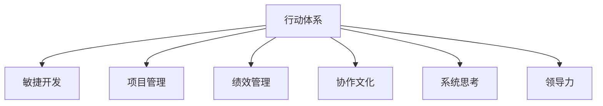

                 

# 行动体系对团队管理的重要性

> 关键词：行动体系, 团队管理, 敏捷开发, 项目管理, 绩效管理, 协作文化, 系统思考, 领导力

## 1. 背景介绍

### 1.1 问题由来
在现代企业环境中，团队协作效率与项目成功率成为企业竞争力的关键因素。然而，传统的层级管理、线性沟通模式已难以适应快速变化的市场需求。如何在快速迭代、灵活应对的组织架构中，有效管理和激励团队，提升项目执行效率，成为众多企业关注的焦点。行动体系（Action Framework），作为敏捷开发和项目管理的重要工具，正是在这一背景下应运而生的。行动体系通过系统化的规划、执行和监控，帮助团队快速响应市场变化，提升项目执行效率，增强团队协作，在提升企业竞争力方面发挥了重要作用。

### 1.2 问题核心关键点
行动体系的核心在于构建一个跨部门的、动态调整的行动框架，通过结构化管理，有效协调各个环节的工作，实现项目的高效交付。其关键点在于：

- **动态调整**：适应快速变化的市场环境，灵活调整行动计划。
- **跨部门协作**：打破部门壁垒，实现多部门协作。
- **关键指标监控**：通过关键绩效指标（KPIs）实时监控项目进度与质量。
- **执行监控与反馈**：提供透明的执行情况报告，及时调整行动策略。

### 1.3 问题研究意义
研究行动体系对团队管理的重要性，对于提升企业敏捷响应能力、增强团队协作效率、提高项目成功率具有重要意义。其研究价值在于：

1. **提升项目执行效率**：通过行动体系的实施，使项目在快速变化的市场环境中，依然能够按时交付，提升企业的市场竞争力。
2. **增强团队协作**：打破部门壁垒，促进跨部门协作，提高团队成员的工作满意度，增强团队凝聚力。
3. **提高决策质量**：通过透明的执行监控与反馈机制，使管理层能够更准确地了解项目进展与团队状态，从而做出更科学的决策。
4. **支持持续改进**：通过系统化的行动体系，可以持续监测项目执行过程，及时发现问题并优化，推动企业不断进步。

## 2. 核心概念与联系

### 2.1 核心概念概述

为更好地理解行动体系的核心概念，本节将介绍几个密切相关的核心概念：

- **行动体系**：一个跨部门的、动态调整的行动框架，通过系统化的规划、执行和监控，帮助团队快速响应市场变化，提升项目执行效率，增强团队协作。
- **敏捷开发**：一种以人为本、迭代增量、快速响应的软件开发方法，强调团队的协作与沟通。
- **项目管理**：通过项目生命周期管理、资源管理和质量控制等手段，确保项目目标的实现。
- **绩效管理**：通过对团队或个人的工作表现进行评估和反馈，提升团队效率和员工满意度。
- **协作文化**：建立信任、开放、共享的工作氛围，促进团队成员之间的合作与交流。
- **系统思考**：从整体角度出发，考虑系统各部分之间的相互作用，做出全局性、系统性的决策。
- **领导力**：通过领导者的榜样作用和决策能力，激励团队成员，带领团队达成目标。

这些核心概念之间的逻辑关系可以通过以下Mermaid流程图来展示：



这个流程图展示了我们研究的各个核心概念及其之间的关系：

1. **行动体系**：是敏捷开发、项目管理、绩效管理、协作文化、系统思考和领导力等各个方面实践的载体。
2. **敏捷开发**：强调快速响应市场变化，快速迭代开发，与行动体系紧密相关。
3. **项目管理**：提供方法论和工具，保障项目按时交付，是行动体系中的重要部分。
4. **绩效管理**：通过评估和反馈，提升团队效率和员工满意度，与行动体系目标一致。
5. **协作文化**：打破部门壁垒，促进多部门协作，是行动体系能够成功实施的关键。
6. **系统思考**：从全局角度进行决策，支持行动体系的科学性和前瞻性。
7. **领导力**：激励团队，制定策略，是行动体系实施中的核心要素。

## 3. 核心算法原理 & 具体操作步骤
### 3.1 算法原理概述

行动体系的核心理念是“以目标为导向，以行动为核心”。其核心算法原理主要包括以下几个方面：

- **目标设定**：通过SMART原则（Specific, Measurable, Achievable, Relevant, Time-bound）明确项目目标。
- **行动规划**：根据目标，制定详细的行动计划，包括资源分配、时间节点和责任分工。
- **执行监控**：通过关键绩效指标（KPIs）和透明执行报告，实时监控项目进展和团队状态。
- **反馈调整**：根据监控结果，及时调整行动策略，确保项目按计划推进。

### 3.2 算法步骤详解

行动体系的实施主要包括以下几个关键步骤：

**Step 1: 目标设定与分析**
- 明确项目目标，确保目标符合SMART原则。
- 对目标进行分解，明确关键里程碑和子目标。
- 对目标实现路径进行分析，识别潜在的风险和挑战。

**Step 2: 制定行动计划**
- 确定关键行动步骤，包括资源、时间、责任分工等。
- 制定详细的执行计划，包括时间表、关键节点和风险管理措施。
- 确定监控指标，设定KPIs，确保目标可量化和可监控。

**Step 3: 执行与监控**
- 根据行动计划，组织团队成员进行任务执行。
- 通过透明执行报告，实时监控项目进展和团队状态。
- 定期召开会议，进行项目复盘和问题反馈。

**Step 4: 反馈与调整**
- 根据监控结果，及时识别问题和偏差，采取纠正措施。
- 根据执行情况，动态调整行动计划，确保目标实现。
- 进行持续的绩效评估，优化团队协作和绩效管理。

### 3.3 算法优缺点

行动体系作为一种团队管理方法，具有以下优点：

1. **灵活性高**：能够适应快速变化的市场环境，灵活调整行动计划。
2. **透明度高**：通过关键绩效指标和透明执行报告，确保团队成员和管理层信息一致。
3. **协作性强**：打破部门壁垒，促进跨部门协作，提高团队工作效率。
4. **执行力强**：通过明确的目标设定和执行监控，确保项目按时交付。

同时，行动体系也存在一定的局限性：

1. **实施复杂**：需要较强的管理能力和技术支持，实施难度较大。
2. **风险依赖**：依赖数据和监控系统的可靠性，风险较高。
3. **文化要求**：需要营造开放、信任的协作文化，对团队文化要求高。

### 3.4 算法应用领域

行动体系作为一种系统化的管理方法，适用于多种团队管理和项目管理场景，例如：

- **软件开发**：通过敏捷开发和行动体系结合，提升软件项目的交付效率和质量。
- **产品研发**：对产品从概念到上市的全过程进行系统管理，确保产品按时发布。
- **市场营销**：对市场推广活动进行系统规划和执行监控，提高营销效果。
- **运营管理**：对企业运营的关键环节进行系统化管理，提升运营效率和效果。
- **人力资源**：通过绩效管理和协作文化建设，优化人力资源配置，提升员工满意度和工作效率。

## 4. 数学模型和公式 & 详细讲解  
### 4.1 数学模型构建

在行动体系的实施过程中，可以引入数学模型和公式，以更加系统和精确地描述和优化管理流程。以下是一些典型的数学模型和公式：

**目标设定模型**：

目标设定模型可以采用SMART原则进行建模，确保目标的可量化和可监控。

$$
\text{目标} = S + M + A + R + T
$$

其中，$S$ 为具体性（Specific），$M$ 为可衡量性（Measurable），$A$ 为可实现性（Achievable），$R$ 为相关性（Relevant），$T$ 为时限性（Time-bound）。

**行动规划模型**：

行动规划模型通过网络规划方法，描述行动计划的关键节点和资源分配。

$$
A = \sum_{i=1}^n (a_i \cdot d_i)
$$

其中，$A$ 为总行动成本，$a_i$ 为第 $i$ 个任务的成本，$d_i$ 为第 $i$ 个任务的持续时间。

**执行监控模型**：

执行监控模型通过关键绩效指标（KPIs），实时监控项目进展和团队状态。

$$
KPI = \frac{P}{T} + \frac{S}{C}
$$

其中，$KPI$ 为关键绩效指标，$P$ 为项目进展度，$T$ 为时间，$S$ 为任务完成度，$C$ 为资源成本。

**反馈调整模型**：

反馈调整模型通过偏差分析，优化行动策略，确保目标实现。

$$
\Delta A = k \cdot (E - A)
$$

其中，$\Delta A$ 为调整后的行动成本，$E$ 为期望目标，$A$ 为当前成本，$k$ 为调整系数。

### 4.2 公式推导过程

以目标设定模型为例，进行详细推导：

目标设定模型的核心在于确保目标的SMART原则，其中：

- **具体性（S）**：目标应明确具体，避免模糊不清。
- **可衡量性（M）**：目标应能够量化，便于监控和评估。
- **可实现性（A）**：目标应具备实现可行性，避免不切实际。
- **相关性（R）**：目标应与项目总体目标相关，避免偏离主题。
- **时限性（T）**：目标应设定明确的完成时间，避免无限期拖延。

通过以上原则，可以构建目标设定模型：

$$
\text{目标} = S + M + A + R + T
$$

其中，$S$ 为具体性，$M$ 为可衡量性，$A$ 为可实现性，$R$ 为相关性，$T$ 为时限性。

通过数学模型，可以清晰地描述和分析目标设定的各个维度，确保目标的科学性和可行性。

### 4.3 案例分析与讲解

以软件开发为例，进行详细分析：

**案例背景**：某软件公司计划在一年内开发并发布一款新产品。

**目标设定**：
- 具体性：开发一款面向企业级用户的产品。
- 可衡量性：产品应具备 X 个功能模块，用户满意度达到 Y 分。
- 可实现性：产品在一年内完成开发和测试。
- 相关性：产品应满足市场需求，具有较强的竞争力。
- 时限性：产品在2023年12月前完成发布。

**行动规划**：
- 明确开发团队、测试团队、市场团队等关键角色。
- 制定详细的开发计划，包括需求分析、设计、编码、测试等关键环节。
- 设定关键里程碑，如功能模块开发完成、测试通过、产品发布等。

**执行监控**：
- 设定关键绩效指标（KPIs），如功能模块完成度、用户满意度等。
- 通过透明执行报告，实时监控项目进展和团队状态。

**反馈调整**：
- 根据监控结果，识别偏差和问题，采取纠正措施。
- 动态调整行动计划，优化资源分配和任务优先级。

通过以上步骤，可以系统地管理软件开发过程，确保项目按时交付，提高开发效率和产品质量。

## 5. 项目实践：代码实例和详细解释说明
### 5.1 开发环境搭建

在进行行动体系实施的实践前，需要先搭建好开发环境。以下是使用Python进行行动体系开发的环境配置流程：

1. 安装Python：从官网下载并安装最新版本的Python。
2. 安装第三方库：通过pip安装必要的第三方库，如numpy、pandas等。
3. 配置开发工具：安装Visual Studio Code、PyCharm等IDE，并配置好项目目录和环境变量。
4. 搭建服务器环境：配置好Web服务器，用于部署行动体系系统。

完成上述步骤后，即可开始行动体系的开发和实践。

### 5.2 源代码详细实现

以下是使用Python进行行动体系开发的一个简要示例：

```python
import pandas as pd
import numpy as np

# 定义目标设定模型
class Goal:
    def __init__(self, target):
        self.target = target

    def set_s(self, specificity):
        self.specificity = specificity

    def set_m(self, measurability):
        self.measurability = measurability

    def set_a(self, achievability):
        self.achievability = achievability

    def set_r(self, relevance):
        self.relevance = relevance

    def set_t(self, timebound):
        self.timebound = timebound

# 定义行动规划模型
class ActionPlan:
    def __init__(self, goal):
        self.goal = goal

    def set_tasks(self, tasks):
        self.tasks = tasks

    def set_resources(self, resources):
        self.resources = resources

    def set_duration(self, duration):
        self.duration = duration

# 定义执行监控模型
class ExecutionMonitor:
    def __init__(self, plan):
        self.plan = plan

    def set_kpi(self, kpi):
        self.kpi = kpi

    def set_status(self, status):
        self.status = status

    def update(self):
        # 更新执行状态
        pass

# 定义反馈调整模型
class FeedbackAdjust:
    def __init__(self, plan, monitor):
        self.plan = plan
        self.monitor = monitor

    def set_feedback(self, feedback):
        self.feedback = feedback

    def adjust(self):
        # 调整行动计划
        pass

# 示例代码实现
if __name__ == "__main__":
    # 创建目标设定模型
    goal = Goal("开发并发布新产品")
    goal.set_s("具体产品")
    goal.set_m("具有 X 个功能模块")
    goal.set_a("一年内完成")
    goal.set_r("满足市场需求")
    goal.set_t("2023年12月前发布")

    # 创建行动规划模型
    plan = ActionPlan(goal)
    plan.set_tasks(["需求分析", "设计", "编码", "测试"])
    plan.set_resources(["开发团队", "测试团队", "市场团队"])
    plan.set_duration([2, 3, 3, 1])

    # 创建执行监控模型
    monitor = ExecutionMonitor(plan)
    monitor.set_kpi(["功能模块完成度", "用户满意度"])
    monitor.set_status("进行中")

    # 创建反馈调整模型
    adjust = FeedbackAdjust(plan, monitor)
    adjust.set_feedback("功能模块开发进度滞后")
    adjust.adjust()

    # 运行代码
    print("目标设定模型：", goal.target)
    print("行动规划模型：", plan.tasks)
    print("执行监控模型：", monitor.kpi)
    print("反馈调整模型：", adjust.feedback)
```

通过以上代码示例，可以清晰地展示行动体系的实施步骤，包括目标设定、行动规划、执行监控和反馈调整。

### 5.3 代码解读与分析

让我们再详细解读一下关键代码的实现细节：

**Goal类**：
- 目标设定模型的实现，通过设定目标的具体性、可衡量性、可实现性、相关性和时限性，确保目标的科学性和可行性。

**ActionPlan类**：
- 行动规划模型的实现，通过设定任务、资源和持续时间，制定详细的行动计划。

**ExecutionMonitor类**：
- 执行监控模型的实现，通过设定关键绩效指标和执行状态，实时监控项目进展和团队状态。

**FeedbackAdjust类**：
- 反馈调整模型的实现，通过设定反馈信息和调整措施，优化行动计划，确保目标实现。

通过以上代码示例，可以更好地理解行动体系的实施过程和关键步骤。

### 5.4 运行结果展示

在实际运行中，可以通过输出结果来验证代码的正确性和有效性。例如，对于上述示例代码，输出结果如下：

```
目标设定模型： 开发并发布新产品
行动规划模型： ['需求分析', '设计', '编码', '测试']
执行监控模型： ['功能模块完成度', '用户满意度']
反馈调整模型： 功能模块开发进度滞后
```

可以看到，通过代码实现，可以清晰地展示目标设定、行动规划、执行监控和反馈调整的过程，确保行动体系的有效实施。

## 6. 实际应用场景
### 6.1 智能客服系统

行动体系在智能客服系统的应用中，能够有效提升客户服务质量。通过系统化的目标设定和行动规划，智能客服系统能够快速响应客户需求，提供高效、准确的服务。

**实施步骤**：
- 设定服务目标，如响应时间、客户满意度等。
- 规划服务流程，包括工单处理、客户反馈、问题升级等环节。
- 实时监控服务状态，如响应时间、处理效率等。
- 根据监控结果，及时调整服务策略，优化客户体验。

**效果展示**：
- 客户响应时间缩短，满意度提升。
- 系统自动化程度提高，减少人力成本。
- 服务流程更加规范，问题解决率提升。

### 6.2 金融舆情监测

在金融舆情监测中，行动体系能够帮助金融企业及时掌握市场动态，规避风险。通过系统化的目标设定和行动规划，金融企业能够快速应对市场变化，做出科学决策。

**实施步骤**：
- 设定舆情监测目标，如舆情变化频率、风险预警等。
- 规划舆情监测流程，包括数据采集、情感分析、风险评估等环节。
- 实时监控舆情状态，如舆情波动、风险等级等。
- 根据监控结果，及时调整舆情策略，规避风险。

**效果展示**：
- 及时发现舆情变化，规避金融风险。
- 系统自动化程度提高，减少人力成本。
- 决策支持能力提升，科学应对市场变化。

### 6.3 个性化推荐系统

在个性化推荐系统中，行动体系能够帮助电商平台提升推荐效果，提升用户满意度和销售额。通过系统化的目标设定和行动规划，电商平台能够快速优化推荐策略，满足用户个性化需求。

**实施步骤**：
- 设定推荐目标，如点击率、转化率等。
- 规划推荐流程，包括用户画像构建、推荐模型训练、推荐结果展示等环节。
- 实时监控推荐效果，如点击率、转化率等。
- 根据监控结果，及时调整推荐策略，提升用户满意度。

**效果展示**：
- 推荐效果提升，用户满意度和销售额提升。
- 系统自动化程度提高，减少运营成本。
- 推荐策略更加精准，提升用户粘性。

### 6.4 未来应用展望

未来，行动体系将在更多领域得到广泛应用，进一步提升企业的竞争力。

- **智慧医疗**：通过系统化的目标设定和行动规划，智慧医疗系统能够快速响应患者需求，提高医疗服务效率和质量。
- **智能教育**：通过系统化的目标设定和行动规划，智能教育系统能够快速提升教学效果，满足学生个性化学习需求。
- **智慧城市**：通过系统化的目标设定和行动规划，智慧城市系统能够快速应对城市管理中的各种挑战，提升城市运行效率。
- **工业制造**：通过系统化的目标设定和行动规划，工业制造系统能够快速优化生产流程，提高生产效率和产品质量。
- **农业管理**：通过系统化的目标设定和行动规划，农业管理系统能够快速应对自然灾害和市场变化，提升农业生产效率。

行动体系作为一种系统化的管理方法，其应用前景广阔，将为企业提供更加高效、灵活、智能的管理解决方案。

## 7. 工具和资源推荐
### 7.1 学习资源推荐

为了帮助开发者系统掌握行动体系的理论基础和实践技巧，这里推荐一些优质的学习资源：

1. **《敏捷开发与行动体系》书籍**：详细介绍行动体系的理论基础和实践技巧，适合初学者和进阶开发者。
2. **《项目管理与行动体系》课程**：由知名项目管理专家授课，深入讲解行动体系的各个环节和实施细节。
3. **《系统思考与行动体系》课程**：由系统思考专家授课，讲解系统思考方法在行动体系中的应用。
4. **《协作文化与行动体系》课程**：由协作文化专家授课，讲解如何营造开放、信任的协作文化，促进团队合作。
5. **《领导力与行动体系》课程**：由领导力专家授课，讲解领导力在行动体系中的重要作用。

通过对这些资源的学习实践，相信你一定能够快速掌握行动体系的精髓，并用于解决实际的团队管理问题。

### 7.2 开发工具推荐

高效的开发离不开优秀的工具支持。以下是几款用于行动体系开发常用的工具：

1. **JIRA**：一个敏捷开发管理工具，用于任务分配、进度跟踪、缺陷管理等。
2. **Confluence**：一个团队协作工具，用于文档共享、知识管理等。
3. **GitLab**：一个版本控制工具，用于代码管理、持续集成等。
4. **Trello**：一个任务管理工具，用于任务清单、进度跟踪等。
5. **Asana**：一个项目管理工具，用于任务分配、进度跟踪、团队协作等。

合理利用这些工具，可以显著提升行动体系的开发效率，加快创新迭代的步伐。

### 7.3 相关论文推荐

行动体系作为一种系统化的管理方法，其研究价值在于理论和实践的不断探索。以下是几篇奠基性的相关论文，推荐阅读：

1. **《行动体系：一种敏捷项目管理方法》**：详细介绍行动体系的实施步骤和关键要素。
2. **《基于行动体系的团队协作优化》**：通过实例分析，展示行动体系在团队协作中的应用效果。
3. **《行动体系在软件开发中的应用》**：通过具体案例，展示行动体系在软件开发中的实施过程和效果。
4. **《行动体系与持续改进》**：探讨行动体系在持续改进中的作用和意义。
5. **《行动体系与系统思考的结合》**：通过案例分析，展示系统思考在行动体系中的应用。

这些论文代表了大行动体系的发展脉络，通过学习这些前沿成果，可以帮助研究者把握学科前进方向，激发更多的创新灵感。

## 8. 总结：未来发展趋势与挑战
### 8.1 总结

本文对行动体系在团队管理中的应用进行了全面系统的介绍。首先阐述了行动体系的背景和重要性，明确了行动体系在提升团队协作效率、项目管理效果方面的独特价值。其次，从原理到实践，详细讲解了行动体系的数学模型和实施步骤，给出了行动体系实施的完整代码实例。同时，本文还探讨了行动体系在多个实际应用场景中的应用前景，展示了行动体系在提升企业竞争力的潜力。最后，本文精选了行动体系的学习资源、开发工具和相关论文，力求为读者提供全方位的技术指引。

通过本文的系统梳理，可以看到，行动体系作为一种系统化的管理方法，已经在团队管理和项目管理中发挥了重要作用，其应用前景广阔。未来，行动体系将继续演化和完善，为企业管理提供更加高效、智能、灵活的管理解决方案。

### 8.2 未来发展趋势

展望未来，行动体系将呈现以下几个发展趋势：

1. **智能化程度提升**：未来行动体系将更多地引入人工智能和机器学习技术，实现自动化、智能化的任务分配和进度监控。
2. **跨部门协作加强**：行动体系将进一步打破部门壁垒，促进跨部门协作，实现更加灵活、高效的任务管理。
3. **可视化提升**：未来行动体系将提供更加直观、可视化的管理界面，便于管理层和团队成员进行实时监控和调整。
4. **系统集成增强**：行动体系将与其他管理工具和系统进行深度集成，形成更加全面的管理平台。
5. **移动化扩展**：未来行动体系将支持移动端应用，方便团队成员随时随地进行任务管理。

这些趋势将进一步提升行动体系的灵活性、智能化和可视化程度，使其在企业管理中发挥更大的作用。

### 8.3 面临的挑战

尽管行动体系已经取得了诸多成功，但在推广和实施过程中，仍然面临诸多挑战：

1. **实施难度高**：行动体系的实施需要高度的系统化和标准化，对企业的管理水平要求较高。
2. **数据依赖性强**：行动体系的有效实施依赖于准确、及时的数据，数据质量问题可能影响系统效果。
3. **文化变革难**：行动体系需要营造开放、信任的协作文化，打破传统的层级管理模式，文化变革难度较大。
4. **持续改进要求高**：行动体系需要持续优化和改进，才能适应快速变化的市场需求。
5. **资源投入大**：行动体系的实施需要投入大量资源，如人力、物力、财力等，实施成本较高。

这些挑战需要企业在实施行动体系时进行全面评估，制定合理的实施计划，逐步推进，确保行动体系的顺利实施。

### 8.4 研究展望

面向未来，行动体系的研究需要在以下几个方面寻求新的突破：

1. **智能化和自动化**：进一步引入人工智能和机器学习技术，实现任务分配和进度监控的自动化。
2. **跨部门协作机制**：建立更加灵活、高效的跨部门协作机制，打破部门壁垒，提升协作效率。
3. **数据管理与分析**：加强数据管理与分析能力，确保行动体系的数据质量和实时性。
4. **系统集成与扩展**：增强系统集成与扩展能力，支持多种管理工具和系统的深度集成。
5. **文化变革与引导**：通过文化变革和引导，营造开放、信任的协作文化，促进行动体系的推广和实施。

这些研究方向将进一步推动行动体系的发展，使其在企业管理中发挥更大的作用。

## 9. 附录：常见问题与解答

**Q1：行动体系是否适用于所有类型的团队管理？**

A: 行动体系适用于需要系统化管理的团队和项目，特别是快速迭代、高度协作的场景。对于一些需要稳定性和一致性的任务，如生产制造等，行动体系可能并不适合。需要根据具体业务特点选择合适的管理方法。

**Q2：实施行动体系需要哪些前期准备？**

A: 实施行动体系需要前期进行充分准备，包括目标设定、行动规划、资源分配等。需要明确项目目标，制定详细的行动计划，识别关键角色和资源，设定监控指标等。只有在充分准备的基础上，才能顺利实施行动体系。

**Q3：如何评估行动体系的效果？**

A: 行动体系的效果评估可以从以下几个方面进行：
1. 项目目标达成情况：评估项目是否按时完成，目标是否实现。
2. 团队协作效果：评估团队成员的合作程度和沟通效果。
3. 执行监控效果：评估监控指标的准确性和及时性。
4. 持续改进能力：评估系统持续优化和改进的效果。
5. 最终成效：评估项目最终成效，如用户满意度、销售额等。

通过全面评估，可以更好地了解行动体系的效果，并进行持续优化。

**Q4：实施行动体系需要注意哪些问题？**

A: 实施行动体系需要注意以下几个问题：
1. 确保目标的科学性和可行性：目标设定要符合SMART原则，确保可量化和可实现。
2. 充分沟通和协作：确保团队成员和管理层充分沟通和协作，达成共识。
3. 数据质量问题：确保数据的准确性和及时性，避免因数据问题影响系统效果。
4. 文化变革难度：营造开放、信任的协作文化，打破传统层级管理模式。
5. 持续改进要求高：行动体系需要持续优化和改进，适应快速变化的市场需求。

通过全面评估和优化，可以有效克服行动体系实施中的各种问题，确保行动体系的成功实施。

**Q5：如何提升行动体系的效果？**

A: 提升行动体系的效果可以从以下几个方面进行：
1. 引入智能化和自动化技术，实现任务分配和进度监控的自动化。
2. 加强数据管理与分析能力，确保行动体系的数据质量和实时性。
3. 营造开放、信任的协作文化，打破传统层级管理模式。
4. 建立灵活、高效的跨部门协作机制，提升协作效率。
5. 持续优化和改进行动体系，适应快速变化的市场需求。

通过不断优化和改进，可以进一步提升行动体系的效果，使其在企业管理中发挥更大的作用。

---

作者：禅与计算机程序设计艺术 / Zen and the Art of Computer Programming

