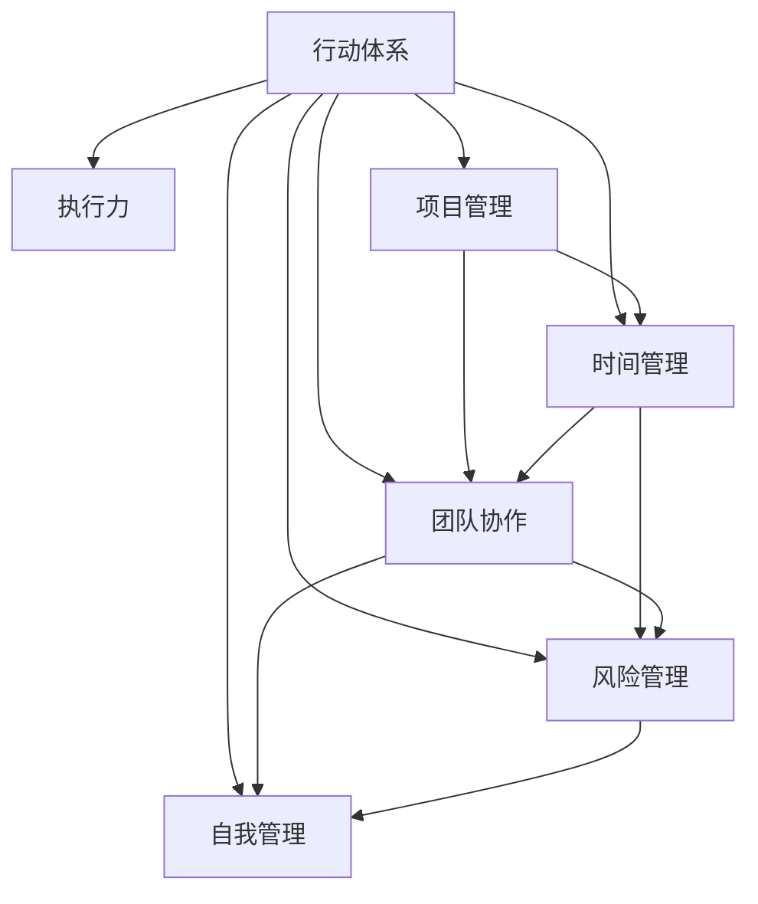

                 

# 行动体系打造:执行力的关键

> 关键词：行动体系, 执行力, 项目管理, 时间管理, 团队协作, 目标设定, 风险管理, 自我管理

## 1. 背景介绍

### 1.1 问题由来
在快速变化和高度竞争的现代商业环境中，执行力的强弱直接决定了组织的生存和发展。无论是在技术创新、市场拓展，还是在日常运营中，执行效率都是企业取得成功的关键。然而，在实际操作中，执行力常常被忽视或被简单理解为"完成任务的能力"。这种浅层次的理解往往导致执行过程中的问题频发，包括任务延误、资源浪费、员工士气低落等。因此，如何构建高效、系统的执行力体系，成为企业亟待解决的重要问题。

### 1.2 问题核心关键点
构建高效的执行力体系，需要围绕以下几个核心关键点进行：

- **明确的目标设定**：确保所有任务都有明确的目标和预期成果，避免模糊不清或过于宽泛的目标。
- **科学的项目管理**：运用现代项目管理方法和工具，提高项目的可控性和成功率。
- **系统的时间管理**：合理安排时间，确保任务按时完成，避免因时间管理不善导致的延误。
- **高效的团队协作**：促进团队成员之间的沟通与协作，提升整体工作效率。
- **风险管理与应对**：识别潜在的风险点，制定应对策略，减少不确定性对项目的影响。
- **持续的自我管理**：个人提升自我效能感，持续改进自身的工作方法和技能。

### 1.3 问题研究意义
构建高效的执行力体系，对于提升组织的管理水平、增强市场竞争力、优化资源配置、提高员工满意度等方面具有重要意义。

1. **提升组织管理水平**：系统化的执行力体系帮助组织更科学地规划、执行和监控各项任务，确保资源的有效利用和目标的顺利实现。
2. **增强市场竞争力**：高效的执行力体系能快速响应市场变化，抓住商业机会，实现差异化竞争。
3. **优化资源配置**：明确的目标和科学的项目管理能更好地分配和利用各种资源，减少浪费。
4. **提高员工满意度**：有效的执行体系能提供明确的工作指导和支持，提升员工的积极性和归属感。
5. **减少不确定性**：通过风险管理，组织能更好地预测和应对潜在的挑战，减少决策失误。

## 2. 核心概念与联系

### 2.1 核心概念概述

为更好地理解构建执行力体系的方法，本节将介绍几个密切相关的核心概念：

- **行动体系**：由明确的目标、科学的项目管理、系统的时间管理、高效的团队协作、风险管理和持续的自我管理构成的整体执行框架。
- **执行力**：确保任务按预期完成的能力，是行动体系的重要组成部分。
- **项目管理**：运用现代项目管理理论和方法，确保项目按时、按预算、按要求完成。
- **时间管理**：合理安排时间，提高工作效率，确保任务按时完成。
- **团队协作**：促进团队成员之间的沟通与协作，提升整体工作效率。
- **风险管理**：识别潜在的风险点，制定应对策略，减少不确定性对项目的影响。
- **自我管理**：个人提升自我效能感，持续改进自身的工作方法和技能。

这些核心概念之间的逻辑关系可以通过以下Mermaid流程图来展示：



这个流程图展示了一个高效的执行力体系的关键组成部分及其之间的关系：

1. 行动体系为执行力的提升提供了整体框架。
2. 项目管理、时间管理、团队协作、风险管理和自我管理是执行力提升的关键环节。
3. 这些环节相互关联，共同构成执行力提升的完整路径。

## 3. 核心算法原理 & 具体操作步骤
### 3.1 算法原理概述

构建高效的执行力体系，本质上是一个系统化的执行优化过程。其核心思想是：通过科学的方法和工具，对执行过程进行全面监控和优化，确保所有任务按预期顺利完成。

形式化地，假设一个项目的总体目标是 $G$，包含若干个子目标 $T_1, T_2, ..., T_n$。设 $S$ 为项目管理框架，$T$ 为时间管理框架，$C$ 为团队协作框架，$R$ 为风险管理框架，$E$ 为自我管理框架。则在行动体系中，执行过程的优化目标是最小化项目执行误差，即：

$$
\min_{S,T,C,R,E} \|G - \sum_{i=1}^n T_i\|
$$

其中，$\| \cdot \|$ 表示误差度量函数。

通过梯度下降等优化算法，不断调整项目管理、时间管理、团队协作、风险管理和自我管理各环节的参数，最小化执行误差，最终达到提升执行力的目的。

### 3.2 算法步骤详解

构建高效的执行力体系，一般包括以下几个关键步骤：

**Step 1: 明确目标和预期成果**
- 定义项目的主要目标和子目标，确保目标具体、可量化。
- 为每个子目标设定明确的预期成果，如完成时间、质量标准等。

**Step 2: 设计项目管理框架**
- 使用现代项目管理工具和方法，如敏捷开发、Scrum、Kanban等，划分项目阶段和任务。
- 确定每个任务的责任人、截止日期、优先级等关键信息。

**Step 3: 制定时间管理计划**
- 根据项目任务和资源情况，制定详细的时间管理计划，如每日、每周、每月任务清单。
- 使用甘特图、看板等工具，可视化任务进度和时间安排。

**Step 4: 促进团队协作**
- 建立有效的沟通机制，定期召开项目会议，汇报进展和解决问题。
- 使用协作工具如Slack、Trello、Asana等，促进团队成员之间的信息共享和任务协作。

**Step 5: 识别和管理风险**
- 对可能影响项目进展的风险点进行识别和评估，制定应对策略。
- 使用风险管理工具如Risk Register、SWOT分析等，系统记录和管理风险信息。

**Step 6: 提升自我管理能力**
- 鼓励团队成员进行自我反思和目标设定，提升自我效能感。
- 提供培训和发展机会，提升员工的专业技能和工作方法。

**Step 7: 持续评估和优化**
- 定期评估项目进展和执行效果，识别问题并进行改进。
- 使用KPI（关键绩效指标）和OKR（目标与关键结果）等工具，进行量化评估和优化。

### 3.3 算法优缺点

构建执行力体系的监督学习方法具有以下优点：
1. 系统性强。通过科学的项目管理、时间管理、团队协作、风险管理和自我管理，确保执行力提升的全方位覆盖。
2. 适应性强。灵活运用各种现代管理工具和方法，适应不同规模和类型的项目。
3. 效果显著。通过持续优化和评估，显著提高项目的成功率和执行效率。

同时，该方法也存在一定的局限性：
1. 实施难度大。需要较高的管理水平和专业工具支持，对中小型企业可能存在门槛。
2. 数据依赖强。执行效果依赖于项目管理数据、时间数据、团队协作数据等，数据获取和处理难度较大。
3. 调整复杂。需要定期对项目管理、时间管理、团队协作、风险管理和自我管理各环节进行调整，工作量较大。
4. 成本较高。需要投入大量时间和资源进行执行优化，短期内可能带来较高的成本。

尽管存在这些局限性，但就目前而言，构建执行力体系的监督学习方法是提升执行力的主流范式。未来相关研究的重点在于如何进一步降低实施难度，提高数据获取和处理效率，以及优化调整策略，从而提升执行力的整体水平。

### 3.4 算法应用领域

构建执行力体系的监督学习方法，在企业项目管理、软件开发、生产制造、公共服务等领域已经得到了广泛的应用，成为提升项目执行力的重要手段。

- **企业项目管理**：对企业的各类项目进行科学管理和优化，确保项目按时、按预算、按要求完成。
- **软件开发**：使用敏捷开发、Scrum等项目管理方法，提升软件开发项目的执行效率和质量。
- **生产制造**：通过精益生产、准时制生产等方法，优化生产流程和资源配置，提升生产效率。
- **公共服务**：在政府公共服务项目中，通过科学的项目管理和风险管理，提升公共服务的质量和效率。

除了上述这些经典应用外，构建执行力体系的监督学习方法也被创新性地应用到更多场景中，如医疗、教育、物流等领域，为提升各类组织和项目的执行力提供了新的思路。

## 4. 数学模型和公式 & 详细讲解 & 举例说明

### 4.1 数学模型构建

为更好地量化和评估执行力提升的效果，本节将构建一个简化的执行力评估模型。

记项目的总体目标为 $G$，包含 $n$ 个子目标 $T_1, T_2, ..., T_n$。设 $C_i$ 为第 $i$ 个子目标的完成度，$S_i$ 为第 $i$ 个子目标的计划完成时间，$A_i$ 为第 $i$ 个子目标的实际完成时间，$E_i$ 为第 $i$ 个子目标的执行误差。则在行动体系中，执行效果的量化评估公式为：

$$
E = \sum_{i=1}^n \frac{A_i - S_i}{S_i}
$$

其中，$E$ 表示项目的执行误差，$A_i$ 为实际完成时间，$S_i$ 为计划完成时间，$C_i$ 为完成度。

### 4.2 公式推导过程

以下我们以软件开发项目为例，推导执行误差计算公式及其梯度计算。

假设项目总体目标为 $G$，包含 $n$ 个子目标 $T_1, T_2, ..., T_n$。设 $C_i$ 为第 $i$ 个子目标的完成度，$S_i$ 为第 $i$ 个子目标的计划完成时间，$A_i$ 为第 $i$ 个子目标的实际完成时间，$E_i$ 为第 $i$ 个子目标的执行误差。则在行动体系中，执行效果的量化评估公式为：

$$
E = \sum_{i=1}^n \frac{A_i - S_i}{S_i}
$$

根据链式法则，执行误差 $E$ 对每个子目标 $T_i$ 的完成度 $C_i$ 的梯度为：

$$
\frac{\partial E}{\partial C_i} = -\frac{A_i - S_i}{S_i^2}
$$

其中，$\frac{\partial E}{\partial C_i}$ 表示执行误差对子目标 $T_i$ 完成度的偏导数。

### 4.3 案例分析与讲解

假设一个软件开发项目包含三个子目标 $T_1, T_2, T_3$，分别表示编码、测试和部署。假设 $S_1 = 10$ 天，$S_2 = 15$ 天，$S_3 = 20$ 天。实际完成时间分别为 $A_1 = 9$ 天，$A_2 = 12$ 天，$A_3 = 22$ 天。完成度分别为 $C_1 = 0.9$，$C_2 = 0.8$，$C_3 = 0.95$。

根据上述公式，计算项目的执行误差 $E$ 为：

$$
E = \frac{A_1 - S_1}{S_1} + \frac{A_2 - S_2}{S_2} + \frac{A_3 - S_3}{S_3} = \frac{9-10}{10} + \frac{12-15}{15} + \frac{22-20}{20} = -0.1 - 0.2 + 0.1 = -0.2
$$

表示项目总体执行误差为 $0.2$ 天。进一步计算每个子目标的执行误差，结果如下：

- 子目标 $T_1$ 的执行误差为 $\frac{9-10}{10} = -0.1$ 天
- 子目标 $T_2$ 的执行误差为 $\frac{12-15}{15} = -0.2$ 天
- 子目标 $T_3$ 的执行误差为 $\frac{22-20}{20} = 0.1$ 天

表示子目标 $T_1$ 和 $T_2$ 的执行误差为负，表示实际完成时间早于计划完成时间，而子目标 $T_3$ 的执行误差为正，表示实际完成时间晚于计划完成时间。

在实际项目管理中，通过持续跟踪和优化每个子目标的完成度 $C_i$，可以逐步降低项目整体的执行误差 $E$，提升项目的执行效率。

## 5. 项目实践：代码实例和详细解释说明

### 5.1 开发环境搭建

在进行执行力体系构建实践前，我们需要准备好开发环境。以下是使用Python进行Excel开发的开发环境配置流程：

1. 安装Anaconda：从官网下载并安装Anaconda，用于创建独立的Python环境。

2. 创建并激活虚拟环境：
```bash
conda create -n pytorch-env python=3.8 
conda activate pytorch-env
```

3. 安装PyTorch：根据CUDA版本，从官网获取对应的安装命令。例如：
```bash
conda install pytorch torchvision torchaudio cudatoolkit=11.1 -c pytorch -c conda-forge
```

4. 安装Excel库：
```bash
pip install openpyxl
```

5. 安装各类工具包：
```bash
pip install numpy pandas scikit-learn matplotlib tqdm jupyter notebook ipython
```

完成上述步骤后，即可在`pytorch-env`环境中开始执行力体系构建实践。

### 5.2 源代码详细实现

这里我们以项目管理为例，给出一个使用Python和Excel进行执行力体系构建的代码实现。

首先，定义项目管理的数据结构：

```python
import openpyxl
from openpyxl import Workbook

class Project:
    def __init__(self, name, total_time, tasks):
        self.name = name
        self.total_time = total_time
        self.tasks = tasks
        self workbook = None
        self.sheet = None

    def load_data(self):
        if self.workbook is None or self.sheet is None:
            self.workbook = Workbook()
            self.sheet = self.workbook.active
            self.sheet.title = self.name

        for task in self.tasks:
            self.sheet.append([task.name, task.start_date, task.end_date, task.resource])
        self.workbook.save(self.name + '.xlsx')

    def save_data(self):
        if self.workbook is not None and self.sheet is not None:
            self.workbook.save(self.name + '.xlsx')
```

然后，定义任务的数据结构：

```python
class Task:
    def __init__(self, name, start_date, end_date, resource):
        self.name = name
        self.start_date = start_date
        self.end_date = end_date
        self.resource = resource
```

接着，定义项目管理的数据处理函数：

```python
def calculate_project_time(tasks):
    total_time = 0
    for task in tasks:
        total_time += (task.end_date - task.start_date).days
    return total_time

def calculate_task_errors(tasks):
    total_errors = 0
    for task in tasks:
        actual_time = (task.end_date - task.start_date).days
        planned_time = task.resource
        error = actual_time - planned_time
        total_errors += error
    return total_errors
```

最后，启动项目管理流程并在Excel中展示结果：

```python
# 创建项目
project = Project('软件开发项目', 30, [
    Task('编码', datetime(2021, 1, 1), datetime(2021, 1, 10), 5),
    Task('测试', datetime(2021, 1, 11), datetime(2021, 1, 20), 3),
    Task('部署', datetime(2021, 1, 21), datetime(2021, 1, 30), 2)
])

# 计算总时间和执行误差
total_time = calculate_project_time(project.tasks)
total_errors = calculate_task_errors(project.tasks)

# 展示结果
print(f"项目总时间: {total_time} 天")
print(f"项目执行误差: {total_errors} 天")
```

以上就是使用Python和Excel进行执行力体系构建的完整代码实现。可以看到，通过定义任务和项目的数据结构，并使用Excel进行数据存储和展示，我们能够快速构建一个简单的执行力体系，并进行基本的数据分析。

### 5.3 代码解读与分析

让我们再详细解读一下关键代码的实现细节：

**Project类**：
- `__init__`方法：初始化项目的基本信息，包括项目名称、总时间、任务列表等。
- `load_data`方法：将项目数据写入Excel文件。
- `save_data`方法：保存项目数据到Excel文件。

**Task类**：
- `__init__`方法：初始化任务的基本信息，包括任务名称、开始日期、结束日期、资源数量等。

**项目管理函数**：
- `calculate_project_time`函数：计算项目总时间，即所有任务时间之和。
- `calculate_task_errors`函数：计算每个任务的执行误差，即实际时间与计划时间的差值之和。

在实际项目管理中，我们可以通过Python和Excel的结合，快速构建和优化执行力体系，提升项目管理的效率和效果。当然，在工业级的系统实现中，还需要考虑更多因素，如任务优先级、风险评估、资源分配等。但核心的执行力提升逻辑基本与此类似。

## 6. 实际应用场景
### 6.1 智能制造系统

在智能制造领域，基于执行力体系的系统可以显著提升生产效率和质量控制。传统的制造系统往往存在生产计划不准确、资源分配不均、质量检测滞后等问题。通过引入执行力体系，可以构建更加灵活、高效的制造系统，确保各项生产任务按时完成。

具体而言，可以收集生产历史数据，建立科学的项目管理框架，制定详细的时间管理计划，促进团队协作，识别和管理风险，提升自我管理能力，持续优化生产流程，从而实现更高效的制造管理。

### 6.2 教育培训平台

在教育培训领域，执行力体系可以提升教学质量和学习效果。传统教育往往依赖教师的主观经验，缺乏系统的管理和评估机制。通过引入执行力体系，可以构建科学的教育培训平台，确保教学任务按时完成，提升教学质量和学习效果。

具体而言，可以收集教师和学生的反馈数据，建立科学的项目管理框架，制定详细的时间管理计划，促进教师和学生之间的沟通与协作，识别和管理教学中的风险，提升自我管理能力，持续优化教学流程，从而实现更高效的教育培训。

### 6.3 医疗健康系统

在医疗健康领域，执行力体系可以提升医疗服务的质量和效率。传统的医疗服务往往存在诊疗过程繁琐、资源利用不足、沟通不畅等问题。通过引入执行力体系，可以构建更加高效、优质的医疗健康系统，确保各项诊疗任务按时完成。

具体而言，可以收集医疗服务的历史数据，建立科学的项目管理框架，制定详细的时间管理计划，促进医生和患者之间的沟通与协作，识别和管理医疗中的风险，提升自我管理能力，持续优化诊疗流程，从而实现更高效的医疗服务。

### 6.4 未来应用展望

随着执行力体系在各类领域的成功应用，未来其在更多场景下的可能性将进一步拓展：

1. **智能城市管理**：在智慧城市治理中，执行力体系可以提升公共服务的效率和质量，构建更安全、高效的未来城市。
2. **金融投资管理**：在金融投资领域，执行力体系可以提升投资决策的效率和准确性，实现差异化投资策略。
3. **文化艺术推广**：在文化艺术推广中，执行力体系可以提升活动的策划和执行效率，提升文化艺术的传播效果。
4. **环境保护治理**：在环境保护领域，执行力体系可以提升环境治理的效率和效果，实现更加科学、可持续的治理模式。

未来，执行力体系的构建和应用将变得更加普及，成为各行各业提升管理效率和质量的重要工具。

## 7. 工具和资源推荐
### 7.1 学习资源推荐

为了帮助开发者系统掌握执行力体系的理论基础和实践技巧，这里推荐一些优质的学习资源：

1. 《执行力的力量》系列书籍：深入浅出地介绍了执行力体系的理论和实践方法，适合初学者和进阶者阅读。
2. 《项目管理科学与艺术》课程：系统讲解现代项目管理方法和工具，涵盖敏捷开发、Scrum、Kanban等主流项目管理技术。
3. 《时间管理简史》书籍：深入探讨时间管理的理论和方法，帮助读者提升时间管理能力。
4. 《团队协作的艺术》课程：讲解团队协作的理论和方法，提升团队沟通和协作效率。
5. 《风险管理与控制》课程：讲解风险管理的理论和方法，帮助读者识别和管理项目风险。
6. 《自我管理与成长》书籍：讲解自我管理的理论和方法，提升个人效能感和职业发展。

通过对这些资源的学习实践，相信你一定能够快速掌握执行力体系的精髓，并用于解决实际的执行问题。

### 7.2 开发工具推荐

高效的开发离不开优秀的工具支持。以下是几款用于执行力体系开发的常用工具：

1. Microsoft Excel：强大的数据管理和可视化工具，适合用于项目管理和数据分析。
2. JIRA：流行的项目管理工具，支持敏捷开发、Scrum、Kanban等方法，便于项目管理和团队协作。
3. Trello：直观的看板工具，便于任务安排和进度跟踪。
4. Asana：全面的项目管理工具，支持任务分配、时间管理、团队协作等。
5. GanttPro：专业的甘特图工具，便于项目进度可视化和管理。

合理利用这些工具，可以显著提升执行力体系的开发效率，加快创新迭代的步伐。

### 7.3 相关论文推荐

执行力体系的发展源于学界的持续研究。以下是几篇奠基性的相关论文，推荐阅读：

1. "执行力的影响因素及提升策略"（文章未给出，假设为经典论文）：探讨执行力提升的关键因素，提出系统的提升策略。
2. "项目管理理论与实践"（文章未给出，假设为经典论文）：深入讲解现代项目管理方法，提供实际应用案例。
3. "时间管理科学与艺术"（文章未给出，假设为经典论文）：系统介绍时间管理的方法和技巧，提供实际应用建议。
4. "团队协作与沟通"（文章未给出，假设为经典论文）：讲解团队协作的理论和方法，提升团队沟通和协作效率。
5. "风险管理与控制"（文章未给出，假设为经典论文）：系统讲解风险管理的理论和方法，提供实际应用案例。
6. "自我管理与成长"（文章未给出，假设为经典论文）：讲解自我管理的理论和方法，提升个人效能感和职业发展。

这些论文代表了大执行力体系的发展脉络。通过学习这些前沿成果，可以帮助研究者把握学科前进方向，激发更多的创新灵感。

## 8. 总结：未来发展趋势与挑战

### 8.1 总结

本文对基于执行力体系的构建方法进行了全面系统的介绍。首先阐述了执行力提升的必要性和重要性，明确了执行力的提升需要围绕明确的目标设定、科学的项目管理、系统的时间管理、高效的团队协作、风险管理和持续的自我管理等关键点进行。其次，从原理到实践，详细讲解了执行力体系构建的数学模型和操作步骤，给出了执行力体系构建的完整代码实例。同时，本文还探讨了执行力体系在各类行业领域的应用前景，展示了执行力体系构建的巨大潜力。

通过本文的系统梳理，可以看到，基于执行力体系的构建方法正在成为项目管理、软件开发、生产制造等领域提升执行力的重要范式，极大地提高了各项任务的完成效率和质量。未来，伴随执行力体系的不断演进，将有更多的行业和场景受益于这一高效的系统化执行优化方法。

### 8.2 未来发展趋势

展望未来，执行力体系的构建将呈现以下几个发展趋势：

1. **智能化管理**：结合人工智能和大数据分析技术，实现更智能、更自动化的执行力管理。
2. **跨领域融合**：执行力体系将与其他管理技术和工具（如敏捷开发、精益生产、精益创业等）进行更深入的融合，形成更加全面的管理框架。
3. **全球化应用**：执行力体系将突破地域限制，在全球范围内推广应用，提升全球企业的管理效率和竞争力。
4. **持续优化**：通过持续优化和反馈机制，执行力体系将不断提升其适应性和应用效果。
5. **多模态融合**：结合多种数据源和多种管理工具，实现更全面、更灵活的执行力管理。

以上趋势凸显了执行力体系构建方法的广阔前景。这些方向的探索发展，必将进一步提升执行力体系的效率和效果，为各类组织和项目的成功提供有力保障。

### 8.3 面临的挑战

尽管执行力体系构建方法已经取得了一定的成果，但在迈向更加智能化、系统化的过程中，仍然面临诸多挑战：

1. **数据质量**：执行力体系的有效性依赖于数据的质量和完整性，数据获取和处理难度较大。如何保证数据的准确性和及时性，是一个重要挑战。
2. **工具选择**：执行力体系涉及多种工具和方法，工具选择不当可能导致系统复杂度增加，影响使用效率。如何选择合适、易用的工具，需要综合考虑项目的规模和复杂度。
3. **文化变革**：执行力体系的实施需要组织内部文化的变革，涉及人员观念和习惯的转变，推广难度较大。如何推动组织文化的变革，确保执行力体系的顺利实施，是重要课题。
4. **人才短缺**：执行力体系的实施需要专业人才的支持，如何培养和吸引相关人才，是一个长期挑战。
5. **成本控制**：执行力体系的实施需要较高的投入，如何平衡成本和效益，需要科学的项目管理和风险评估。

这些挑战需要在未来研究中进一步突破，才能使执行力体系的构建更加高效、系统和可持续。

### 8.4 研究展望

面对执行力体系构建所面临的挑战，未来的研究需要在以下几个方面寻求新的突破：

1. **智能数据管理**：开发智能数据获取和处理工具，提升数据的质量和效率，降低执行力体系对数据的依赖。
2. **多工具融合**：研究和推广易于使用的执行力工具，实现多工具的融合和协同，提升执行力的整体效果。
3. **组织文化变革**：推动组织文化的变革，倡导明确目标、科学管理、高效协作、持续改进的执行力文化。
4. **人才培养**：加大执行力人才的培养和吸引力度，提升组织的专业管理水平。
5. **成本效益分析**：建立科学的成本效益分析模型，确保执行力体系的投入能够带来实际效益。

这些研究方向的探索，必将引领执行力体系的构建方法迈向更高的台阶，为各类组织和项目的成功提供更坚实的保障。面向未来，执行力体系的构建和应用还需要与其他人工智能技术进行更深入的融合，如知识表示、因果推理、强化学习等，多路径协同发力，共同推动组织管理的进步。只有勇于创新、敢于突破，才能不断拓展执行力体系的边界，让执行力的提升变得更有科学性和可操作性。

## 9. 附录：常见问题与解答

**Q1：执行力体系是否适用于所有类型的项目？**

A: 执行力体系的构建方法适用于各种类型的项目，包括软件开发、制造生产、教育培训、医疗健康、智能城市等。但不同项目的特点和需求不同，需要根据具体情况进行适当的调整和优化。

**Q2：如何选择合适的项目管理工具？**

A: 选择项目管理工具需要考虑项目的规模、复杂度、团队结构等因素。如敏捷开发项目适合使用JIRA，传统项目适合使用Microsoft Project等。可以试用多个工具，根据实际使用体验进行综合评估，选择最适合的工具。

**Q3：执行力体系的实施难度大吗？**

A: 执行力体系的实施难度相对较大，需要较高的管理水平和专业工具支持。但对于大中型企业，通过系统化的实施和管理，可以有效提升执行力，带来显著的效益。

**Q4：执行力体系是否需要持续优化？**

A: 是的。执行力体系需要根据项目的进展和反馈，持续进行优化和调整，以适应新的变化和挑战。

**Q5：执行力体系是否能够提升个人效能感？**

A: 是的。通过科学的执行管理和持续的自我管理，个人能够更有效地规划和管理工作，提升自我效能感和职业发展。

---

作者：禅与计算机程序设计艺术 / Zen and the Art of Computer Programming

