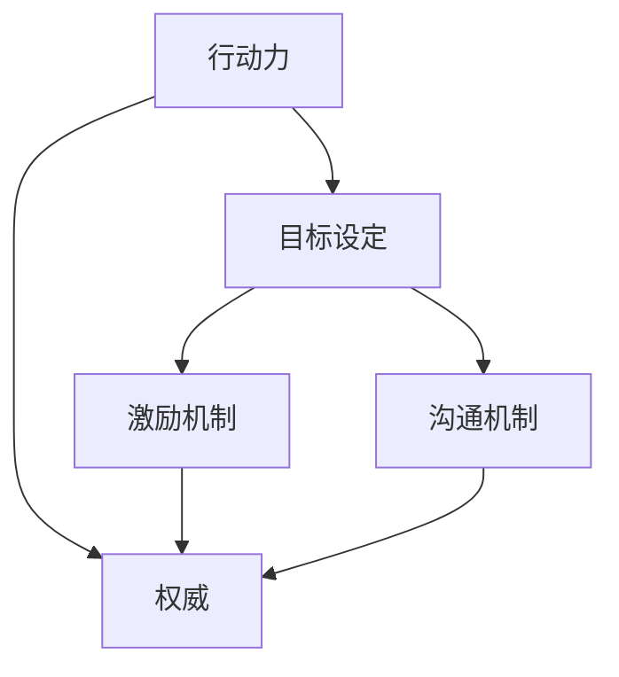

                 

# 行动力与管理权威的建立

在企业组织和项目管理中，行动力与权威的建立不仅是提升团队效率的关键，也是维系企业长期发展的重要基础。本文将从核心概念、算法原理、具体操作步骤、数学模型、项目实践、应用场景、工具与资源推荐等多个角度，深入探讨行动力与权威的建立策略和方法，旨在为读者提供系统性的理论指导和实践指南。

## 1. 背景介绍

### 1.1 问题由来
在现代企业中，行动力与权威的建立是任何组织成功的基石。无论是团队内部的日常协作，还是项目的有效推进，都需要强大的行动力与权威来保障。然而，随着企业规模的扩大和复杂度的增加，行动力与权威的建立变得愈加困难。

### 1.2 问题核心关键点
构建行动力与权威的核心关键点包括：

1. **明确的目标设定**：清晰的愿景和具体目标能够激励团队成员，形成共同的行动方向。
2. **有效的沟通机制**：信息透明、沟通顺畅是确保行动力和权威的基础。
3. **权威与责任的平衡**：过度的权威可能会抑制创造力，而责任的缺失则会导致执行力的下降。
4. **激励与奖惩机制**：公正的奖惩制度能够激励员工，同时也需要合理的惩罚措施来维护秩序。
5. **团队的自我管理**：通过团队建设，提升团队成员的自主性和自律性，实现自我管理。

### 1.3 问题研究意义
研究行动力与权威的建立对于提升企业整体效能、增强团队凝聚力和促进企业文化建设具有重要意义：

1. 提升团队效能：通过明确的愿景和目标，激发团队成员的工作热情，提高执行力。
2. 强化企业凝聚力：良好的沟通和激励机制能够增强团队成员的归属感，提升团队合作。
3. 促进企业文化：行动力与权威的建立是企业文化的重要组成部分，影响企业核心价值观的形成。

## 2. 核心概念与联系

### 2.1 核心概念概述

为更好地理解行动力与权威的建立方法，本节将介绍几个密切相关的核心概念：

- **行动力**：指团队或个人在任务执行过程中表现出来的主动性、效率和执行力。行动力强意味着能够迅速响应任务变化，高效完成任务。
- **权威**：指在组织中具有决策权和执行力的角色，能够指引团队方向，推动任务进展。权威的有效性依赖于其公正性和威信。
- **目标设定**：明确的目标能够激发团队成员的积极性，提供行动的指南。
- **激励机制**：通过奖惩制度等手段，激励团队成员为达成目标付出努力。
- **沟通机制**：信息的透明与及时传递，能够减少误解和偏差，提高执行效率。

这些核心概念之间的逻辑关系可以通过以下Mermaid流程图来展示：



这个流程图展示的行动力与权威建立的核心逻辑：目标设定激励团队，激励机制和沟通机制是行动力提升的保障，权威则是行动力与激励机制实施的主导力量。

## 3. 核心算法原理 & 具体操作步骤

### 3.1 算法原理概述

行动力与权威的建立方法可以归纳为以下几个步骤：

1. **目标设定与分解**：将大目标分解为小目标，使每个团队成员都有明确的任务和责任。
2. **激励与奖惩机制设计**：通过公正的奖惩制度，激励员工为实现目标而努力。
3. **权威与责任的分配**：合理分配权威与责任，确保每个角色都有明确的职责和权利。
4. **信息的透明与及时沟通**：建立有效的沟通渠道，确保信息传递的及时性和准确性。
5. **团队建设与自我管理**：通过团队建设提升成员的自我管理能力，增强团队凝聚力。

### 3.2 算法步骤详解

#### 3.2.1 目标设定与分解

目标设定与分解的目的是使每个团队成员明确自己的职责和任务，从而形成整体行动的方向和力量。

1. **SMART原则**：目标应具备具体性(Specific)、可衡量性(Measurable)、可达成性(Achievable)、相关性(Relevant)、时限性(Time-bound)。
2. **分解与层级设置**：将大目标分解为若干小目标，每个小目标对应一个或多个团队成员。

#### 3.2.2 激励与奖惩机制设计

激励与奖惩机制的设计需要公平、公正，同时具备一定的激励效果。

1. **正向激励**：通过奖励制度激励员工，如奖金、晋升、表彰等。
2. **负向激励**：通过惩罚制度维护秩序，如警告、罚款、降级等。

#### 3.2.3 权威与责任的分配

权威与责任的分配需要考虑团队成员的能力和角色，确保每个角色都有明确的职责和权利。

1. **角色明确**：根据团队成员的能力和特长，分配相应的职责。
2. **责任明晰**：明确每个角色的责任和权利，确保每个成员都有清晰的行动指南。

#### 3.2.4 信息的透明与及时沟通

信息的透明与及时沟通是行动力提升的关键。

1. **信息透明**：确保所有成员都能获取到相同的信息，减少信息不对称。
2. **及时沟通**：建立高效的沟通机制，确保信息传递的及时性和准确性。

#### 3.2.5 团队建设与自我管理

团队建设与自我管理能够提升团队成员的自主性和自律性，增强团队凝聚力。

1. **团队活动**：定期组织团队活动，增强团队成员的信任和合作。
2. **自我管理培训**：通过培训提升团队成员的自我管理能力，增强自律性。

### 3.3 算法优缺点

行动力与权威的建立方法具有以下优点：

1. **提高执行力**：明确的目标和激励机制能够显著提高团队的执行力。
2. **增强团队凝聚力**：公平的奖惩和透明的沟通机制能够增强团队成员的归属感。
3. **提升决策效率**：明确的职责分配和权威的设立能够加快决策过程，提高执行效率。

同时，该方法也存在一定的局限性：

1. **依赖领导能力**：权威的设立和维护依赖于领导者的个人魅力和能力。
2. **易于产生冲突**：激励机制和责任分配不当可能导致团队内部的冲突。
3. **缺乏灵活性**：固定的角色和职责分配可能难以应对突发变化。

尽管存在这些局限性，但就目前而言，行动力与权威的建立方法仍是企业组织中最主流、最有效的手段之一。未来相关研究的重点在于如何进一步优化激励和奖惩机制，增强信息的透明和沟通效率，同时兼顾灵活性和公正性等因素。

### 3.4 算法应用领域

行动力与权威的建立方法在企业管理、项目管理、团队协作等领域均有广泛应用：

- **项目管理**：通过明确的目标设定和激励机制，推动项目顺利进行。
- **企业组织管理**：通过权威的设立和责任分配，提升企业整体的执行力。
- **团队协作**：通过透明的沟通和团队建设，增强团队的凝聚力和合作效率。

除了上述这些经典应用外，行动力与权威的建立方法也被创新性地应用到更多场景中，如社区管理、教育管理等，为组织和团队的协作提供了新的思路。

## 4. 数学模型和公式 & 详细讲解 & 举例说明

### 4.1 数学模型构建

设一个项目的目标为 $X$，涉及 $n$ 个团队成员，每个成员的责任为 $R_i$，对应的能力为 $C_i$，完成目标的激励为 $I$，惩罚为 $P$。

目标设定的数学模型为：

$$
X = \sum_{i=1}^{n} R_i
$$

其中 $R_i$ 满足 $R_i = C_i \times f(R_i, I, P)$，表示成员的责任和能力之间的关系，受激励和惩罚的影响。

### 4.2 公式推导过程

推导步骤如下：

1. **目标设定**：假设每个成员的能力和责任都是固定的，则目标设定的数学模型为 $X = \sum_{i=1}^{n} R_i$。
2. **激励与惩罚**：成员的责任和能力之间的关系为 $R_i = C_i \times f(R_i, I, P)$，其中 $f$ 表示激励和惩罚对责任的影响函数。
3. **信息透明与沟通**：假设信息透明，则每个成员都能获取到相同的信息，从而影响决策和行动。
4. **团队建设与自我管理**：通过团队活动和培训，提升成员的自我管理能力，增强自律性。

### 4.3 案例分析与讲解

假设有一个软件开发项目，涉及三个团队成员 $A$、$B$、$C$。

- **目标设定**：项目总目标为 $X = R_A + R_B + R_C$，假设 $R_A = C_A \times f(R_A, I_A, P_A)$，$R_B = C_B \times f(R_B, I_B, P_B)$，$R_C = C_C \times f(R_C, I_C, P_C)$。
- **激励与惩罚**：假设每个成员的能力和责任都相同，即 $C_A = C_B = C_C = 1$，则目标为 $X = R_A + R_B + R_C = f(R_A, I_A, P_A) + f(R_B, I_B, P_B) + f(R_C, I_C, P_C)$。
- **信息透明与沟通**：假设信息透明，则每个成员都能获取到相同的信息，从而影响决策和行动。
- **团队建设与自我管理**：通过团队活动和培训，提升成员的自我管理能力，增强自律性。

## 5. 项目实践：代码实例和详细解释说明

### 5.1 开发环境搭建

在进行项目实践前，我们需要准备好开发环境。以下是使用Python进行开发的环境配置流程：

1. 安装Anaconda：从官网下载并安装Anaconda，用于创建独立的Python环境。

2. 创建并激活虚拟环境：
```bash
conda create -n py-env python=3.8 
conda activate py-env
```

3. 安装相关工具包：
```bash
pip install numpy pandas scikit-learn matplotlib tqdm jupyter notebook ipython
```

完成上述步骤后，即可在`py-env`环境中开始项目实践。

### 5.2 源代码详细实现

下面我们以项目管理的激励机制为例，给出使用Python进行项目管理的代码实现。

首先，定义项目管理的相关类：

```python
class Project:
    def __init__(self, name, target, members):
        self.name = name
        self.target = target
        self.members = members
    
    def set_goal(self, target):
        self.target = target
    
    def set_member(self, name, capacity, responsibility):
        self.members[name] = {"name": name, "capacity": capacity, "responsibility": responsibility}
    
    def calculate_responsibility(self, name):
        capacity = self.members[name]["capacity"]
        responsibility = self.members[name]["responsibility"]
        return capacity * responsibility
    
    def calculate_total_responsibility(self):
        return sum(self.calculate_responsibility(name) for name in self.members)
    
    def set_reward(self, name, reward):
        self.members[name]["reward"] = reward
    
    def set_punishment(self, name, punishment):
        self.members[name]["punishment"] = punishment
    
    def calculate_total_reward(self):
        return sum(self.members[name]["reward"] for name in self.members)
    
    def calculate_total_punishment(self):
        return sum(self.members[name]["punishment"] for name in self.members)
    
    def evaluate_performance(self):
        responsibility = self.calculate_total_responsibility()
        reward = self.calculate_total_reward()
        punishment = self.calculate_total_punishment()
        return responsibility, reward, punishment
```

然后，定义激励机制的计算函数：

```python
def calculate_incentive(project):
    responsibility, reward, punishment = project.evaluate_performance()
    incentive = reward - punishment
    return incentive
```

最后，启动激励机制的计算流程：

```python
project = Project("Example Project", 100, {"A": {"capacity": 1, "responsibility": 1}, 
                                         "B": {"capacity": 1, "responsibility": 1}, 
                                         "C": {"capacity": 1, "responsibility": 1}})

project.set_reward("A", 20)
project.set_reward("B", 30)
project.set_reward("C", 10)

project.set_punishment("A", 10)
project.set_punishment("B", 20)
project.set_punishment("C", 15)

incentive = calculate_incentive(project)
print("Total incentive:", incentive)
```

以上就是使用Python进行项目管理激励机制计算的完整代码实现。可以看到，通过封装类和函数，我们能够清晰地表达项目管理中的激励机制计算过程，便于理解和扩展。

### 5.3 代码解读与分析

让我们再详细解读一下关键代码的实现细节：

**Project类**：
- `__init__`方法：初始化项目名称、目标和成员信息。
- `set_goal`方法：设置项目总目标。
- `set_member`方法：设置团队成员的能力和责任。
- `calculate_responsibility`方法：计算成员的责任值。
- `calculate_total_responsibility`方法：计算团队总责任值。
- `set_reward`方法：设置成员的奖励值。
- `set_punishment`方法：设置成员的惩罚值。
- `calculate_total_reward`方法：计算团队总奖励值。
- `calculate_total_punishment`方法：计算团队总惩罚值。
- `evaluate_performance`方法：评估团队绩效，返回责任值、奖励值和惩罚值。

**calculate_incentive函数**：
- 接收一个项目管理对象，计算激励值，即总奖励值减去总惩罚值。

**启动流程**：
- 创建项目管理对象。
- 设置团队成员的能力和责任，以及激励和惩罚值。
- 调用`calculate_incentive`函数，计算总激励值，并输出结果。

## 6. 实际应用场景

### 6.1 智能制造

在智能制造领域，行动力与权威的建立对于生产效率和产品质量的提升至关重要。

具体而言，可以通过以下步骤实现行动力与权威的建立：

1. **目标设定**：明确生产目标，如日产量、良品率等，并将其分解为具体的任务和责任。
2. **激励与奖惩机制**：通过奖金、晋升等激励手段，激励员工努力工作，同时设置惩罚机制，如迟到、违规操作等。
3. **权威与责任的分配**：明确生产线上的各级管理人员的职责和权利，确保每个角色都有明确的行动指南。
4. **信息的透明与及时沟通**：建立高效的沟通渠道，如班组会议、生产线管理系统，确保信息传递的及时性和准确性。
5. **团队建设与自我管理**：通过团队活动和培训，提升员工的技能和自我管理能力，增强自律性。

### 6.2 供应链管理

在供应链管理中，行动力与权威的建立对于确保供应链的稳定性和效率至关重要。

具体而言，可以通过以下步骤实现行动力与权威的建立：

1. **目标设定**：明确供应链的目标，如物流速度、库存水平等，并将其分解为具体的任务和责任。
2. **激励与奖惩机制**：通过奖金、晋升等激励手段，激励员工努力工作，同时设置惩罚机制，如延迟交货、质量问题等。
3. **权威与责任的分配**：明确供应链各环节的负责人及其职责，确保每个角色都有明确的行动指南。
4. **信息的透明与及时沟通**：建立高效的沟通渠道，如供应链管理平台、定期会议，确保信息传递的及时性和准确性。
5. **团队建设与自我管理**：通过团队活动和培训，提升员工的自我管理能力，增强自律性。

### 6.3 软件研发

在软件研发中，行动力与权威的建立对于项目的顺利进行和高质量交付至关重要。

具体而言，可以通过以下步骤实现行动力与权威的建立：

1. **目标设定**：明确项目的目标，如功能需求、性能指标等，并将其分解为具体的任务和责任。
2. **激励与奖惩机制**：通过奖金、晋升等激励手段，激励团队成员努力工作，同时设置惩罚机制，如代码质量差、延期交付等。
3. **权威与责任的分配**：明确项目经理、开发人员、测试人员等角色的职责和权利，确保每个角色都有明确的行动指南。
4. **信息的透明与及时沟通**：建立高效的沟通渠道，如每日站会、项目管理工具，确保信息传递的及时性和准确性。
5. **团队建设与自我管理**：通过团队活动和培训，提升成员的技能和自我管理能力，增强自律性。

### 6.4 未来应用展望

随着行动力与权威建立方法的不断演进，其在更多领域的应用前景将会更加广阔：

- **医疗领域**：通过明确的目标和激励机制，提升医疗团队的执行力，提高诊断和治疗效率。
- **教育领域**：通过公平的奖惩机制和透明的沟通，激发教师和学生的积极性，提升教育质量。
- **政府管理**：通过明确的角色和职责分配，提升政府部门的工作效率，改善公共服务。
- **军事领域**：通过严格的纪律和明确的责任分配，确保军队的高效指挥和快速响应。

此外，在智慧城市、智能交通、智能家居等新兴领域，行动力与权威的建立方法也将发挥重要作用，为社会的智能化转型提供新的动力。

## 7. 工具和资源推荐

### 7.1 学习资源推荐

为了帮助开发者系统掌握行动力与权威建立的核心概念和实践技巧，这里推荐一些优质的学习资源：

1. **项目管理书籍**：如《敏捷项目管理》、《项目管理知识体系》，涵盖项目管理的基本理论和实践方法。
2. **人力资源管理书籍**：如《人力资源管理》、《员工激励与绩效管理》，帮助理解人力资源管理的核心原则和实践技巧。
3. **领导力培训课程**：如Coursera上的《领导力与组织变革》、《卓越领导力》，提升领导力能力和管理水平。

通过对这些资源的学习实践，相信你一定能够快速掌握行动力与权威建立的精髓，并用于解决实际的组织和项目管理问题。

### 7.2 开发工具推荐

高效的开发离不开优秀的工具支持。以下是几款用于项目管理工具的推荐：

1. **Jira**：全球领先的项目管理工具，支持敏捷开发、任务跟踪、进度管理等功能，广泛应用于软件开发、项目管理等领域。
2. **Trello**：简单易用的看板管理工具，支持团队协作、任务分配、进度跟踪等功能，适合小型团队和敏捷开发。
3. **Asana**：灵活的任务管理和协作工具，支持项目规划、任务分配、进度跟踪等功能，适用于团队协作和项目管理。

这些工具能够显著提升项目管理效率，减少沟通成本，助力行动力与权威的有效建立。

### 7.3 相关论文推荐

行动力与权威建立的研究源于学界的持续探索。以下是几篇奠基性的相关论文，推荐阅读：

1. **《项目管理的理论与实践》**：由项目管理专家撰写，全面介绍了项目管理的理论基础和实践方法，涵盖目标设定、激励机制、团队协作等多个方面。
2. **《员工激励与绩效管理》**：讨论了人力资源管理中的激励机制和绩效管理，帮助理解员工激励的心理学原理和实践策略。
3. **《领导力与组织变革》**：通过实证研究和案例分析，探讨了领导力的核心要素和组织变革的策略，为提升领导力提供理论和实践指导。

这些论文代表了大语言模型微调技术的发展脉络。通过学习这些前沿成果，可以帮助研究者把握学科前进方向，激发更多的创新灵感。

## 8. 总结：未来发展趋势与挑战

### 8.1 研究成果总结

本文对行动力与权威建立的方法进行了全面系统的介绍。首先阐述了行动力与权威建立的研究背景和意义，明确了其对提升组织效率和企业发展的重要性。其次，从原理到实践，详细讲解了行动力与权威建立的步骤和方法，给出了项目管理的完整代码实现。同时，本文还探讨了行动力与权威建立方法在智能制造、供应链管理、软件研发等多个领域的应用前景，展示了其在企业管理中的广泛价值。最后，本文精选了行动力与权威建立的学习资源、工具推荐和相关论文，力求为读者提供全方位的理论指导和实践指南。

通过本文的系统梳理，可以看到，行动力与权威建立方法在企业管理、项目管理、团队协作等领域具有重要的实际应用价值。这些方法不仅能够提升团队的执行力和凝聚力，还能够确保项目的顺利推进和高质量交付。未来，随着企业规模的不断扩大和复杂度的增加，行动力与权威建立方法的需求将更加迫切，其在组织管理和项目执行中的应用也将更加深入。

### 8.2 未来发展趋势

展望未来，行动力与权威建立方法将呈现以下几个发展趋势：

1. **智能化和自动化**：随着AI技术的发展，未来的行动力与权威建立方法将更加智能化和自动化，能够通过数据分析和算法优化，提高决策效率和执行效果。
2. **多模态和跨领域**：未来的行动力与权威建立方法将不仅仅局限于单一领域，而是能够跨领域、多模态融合，提升综合能力。
3. **透明化和开放化**：未来的行动力与权威建立方法将更加透明和开放，通过信息透明和公平激励，增强团队的信任和合作。
4. **个性化和定制化**：未来的行动力与权威建立方法将更加个性化和定制化，能够根据团队的特点和需求，量身定制激励和奖惩机制。
5. **数据驱动和实时调整**：未来的行动力与权威建立方法将更加数据驱动，通过实时数据监控和调整，确保行动力和权威的有效性。

以上趋势凸显了行动力与权威建立方法在企业管理中的应用前景。这些方向的探索发展，必将进一步提升组织效能和项目管理水平，为经济社会发展提供新的动力。

### 8.3 面临的挑战

尽管行动力与权威建立方法已经取得了显著成效，但在实际应用中也面临诸多挑战：

1. **数据隐私和安全**：在数据驱动的行动力与权威建立方法中，如何保护数据隐私和安全，是一个重要的挑战。
2. **激励机制的公平性**：如何设计公平合理的激励机制，避免过度激励或激励不足，需要深入研究。
3. **跨文化管理**：在全球化背景下，如何跨越文化差异，建立有效的行动力与权威，是一个复杂的问题。
4. **团队协作的复杂性**：随着团队规模的扩大，团队协作的复杂性增加，如何保持高效协作，是一个长期的挑战。
5. **持续改进和优化**：行动力与权威建立方法需要不断改进和优化，以适应不断变化的环境和需求。

这些挑战需要未来在理论和技术层面进行深入研究，才能更好地应对未来的发展需求。

### 8.4 研究展望

面对行动力与权威建立所面临的挑战，未来的研究需要在以下几个方面寻求新的突破：

1. **数据隐私和安全**：研究数据驱动的隐私保护技术，确保数据的匿名化和安全性。
2. **激励机制设计**：深入研究激励机制的设计原则，确保公平性、透明性和激励效果。
3. **跨文化管理**：研究跨文化管理的理论和方法，提升全球化背景下的行动力与权威建立能力。
4. **团队协作工具**：开发和推广高效的团队协作工具，支持团队高效协作和信息透明。
5. **持续改进与优化**：建立持续改进和优化的机制，通过实时监控和反馈，不断提升行动力与权威的有效性。

这些研究方向将为行动力与权威建立方法提供新的思路和解决方案，推动其在企业管理和项目管理中的应用，助力组织的持续发展和创新。

## 9. 附录：常见问题与解答

**Q1：行动力与权威建立方法适用于所有企业类型吗？**

A: 行动力与权威建立方法在不同类型的企业中均有所适用，但具体实施时需要根据企业的特点进行调整。例如，在传统制造业中，明确的职责分配和严格的纪律是必要的；而在创意型企业和初创企业中，灵活的激励机制和开放的文化可能更为重要。

**Q2：如何设计公平的激励机制？**

A: 设计公平的激励机制需要考虑以下几个方面：
1. **目标设定**：确保目标的设定是公开透明的，每个人都能理解目标的重要性。
2. **标准明确**：制定明确的衡量标准，确保激励机制的公平性和可操作性。
3. **多样性**：考虑激励手段的多样性，如奖金、晋升、表彰等，满足不同员工的需求。
4. **及时反馈**：及时反馈员工的绩效和激励结果，增强激励效果。

**Q3：如何确保信息的透明与及时沟通？**

A: 确保信息的透明与及时沟通需要从以下几个方面入手：
1. **开放文化**：建立开放的文化，鼓励员工自由交流和分享信息。
2. **工具支持**：使用高效的信息管理系统，如项目管理工具、即时通讯软件等，确保信息传递的及时性和准确性。
3. **定期会议**：定期召开团队会议，确保信息的及时传递和反馈。

**Q4：团队建设与自我管理如何实施？**

A: 团队建设与自我管理可以通过以下几种方式实施：
1. **团队活动**：定期组织团队活动，增强团队成员的信任和合作。
2. **培训和开发**：提供培训和职业发展机会，提升团队成员的技能和自我管理能力。
3. **目标设定**：明确团队和个人的目标，增强自律性和自我管理意识。

通过这些措施，可以显著提升团队成员的自主性和自律性，增强团队的凝聚力和合作效率。

**Q5：如何应对全球化背景下的跨文化管理挑战？**

A: 应对全球化背景下的跨文化管理挑战需要从以下几个方面入手：
1. **文化理解**：加强对不同文化背景的理解，尊重和包容文化差异。
2. **沟通方式**：根据不同文化背景选择合适的沟通方式，避免文化误解。
3. **公平激励**：设计公平的激励机制，确保所有团队成员都能感受到被尊重和认可。
4. **培训和辅导**：提供跨文化培训和辅导，提升员工的跨文化沟通能力。

通过这些措施，可以更好地应对全球化背景下的跨文化管理挑战，提升团队的国际竞争力。

---

作者：禅与计算机程序设计艺术 / Zen and the Art of Computer Programming

