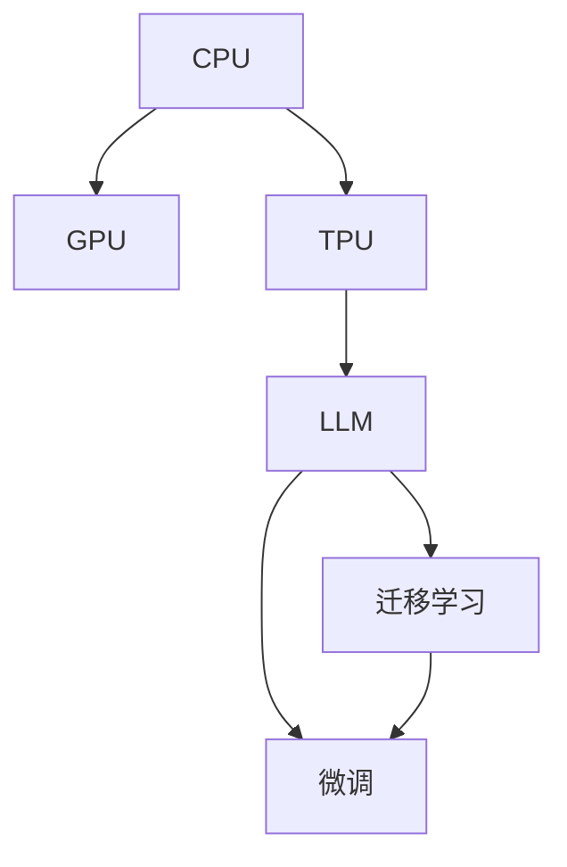

                 

# 计算范式的进化：从CPU到LLM的跨越

> 关键词：计算范式、CPU、LLM、深度学习、图灵奖、人工智能、架构演进

## 1. 背景介绍

### 1.1 问题由来
随着信息技术的高速发展，计算范式经历了多次重要转变，从最早的电子管到晶体管，再到集成电路的广泛应用，使得计算机从科学领域走向工业、商业等各个行业。然而，随着计算机性能的不断提升，传统CPU架构的局限性逐渐显现，如单核性能提升受限、功耗较高、计算密集型任务处理效率低下等。

为了突破这些瓶颈，研究人员和工程师探索了多种解决方案，如GPU、FPGA、ASIC等，以及新兴的计算范式，如量子计算、神经形态计算等。而深度学习技术的大规模应用，使得高性能计算范式进一步演进，最终催生了大规模语言模型(Large Language Models, LLMs)的兴起，在自然语言处理(Natural Language Processing, NLP)领域取得了显著突破。

### 1.2 问题核心关键点
本节将探讨计算范式的演变，特别是深度学习与大规模语言模型的崛起。深度学习，作为一门跨越数学、计算机科学、人工智能等领域的交叉学科，通过多层神经网络结构，赋予机器对数据的高效学习和处理能力。大规模语言模型，基于深度学习技术，通过在大量文本语料上进行预训练，学习到复杂的语言知识和模式，具备强大的自然语言理解和生成能力。

在深度学习的演进过程中，计算范式从传统的CPU、GPU逐步向新兴的TPU、ASIC等方向发展。本文将重点关注深度学习与大规模语言模型的结合，以及它们在计算范式转变中所起的作用，并展望未来的发展趋势。

### 1.3 问题研究意义
探讨计算范式的演变，不仅有助于理解深度学习和自然语言处理技术的突破，还能够为计算硬件的进一步演进提供理论基础和实践指导。通过分析深度学习与大规模语言模型，可以从技术层面和产业应用角度，深入了解计算范式进化的动因和价值，推动计算技术在更多领域的应用。

## 2. 核心概念与联系

### 2.1 核心概念概述

为更好地理解计算范式从CPU到LLM的演变，本节将介绍几个关键概念及其相互联系：

- **CPU (中央处理器)**：传统计算机的核心计算单元，负责数据处理和控制。
- **GPU (图形处理器)**：最初用于图形渲染，后被广泛应用于深度学习训练，具有高度并行计算能力。
- **TPU (张量处理单元)**：专门为深度学习而设计，提供更高效的计算资源和优化算法。
- **大规模语言模型(LLMs)**：基于深度学习技术，通过在大量文本语料上进行预训练，学习到复杂的语言知识和模式，具备强大的自然语言理解和生成能力。
- **迁移学习**：利用已有知识解决新任务的技术，特别是在深度学习和自然语言处理中，通过迁移学习可以提升模型在新任务上的性能。
- **微调(Fine-Tuning)**：在预训练模型的基础上，使用下游任务的少量标注数据，通过有监督学习优化模型在该任务上的性能。

这些概念之间的逻辑关系可以通过以下Mermaid流程图来展示：



这个流程图展示了从传统CPU到新兴计算范式，最终到深度学习和大规模语言模型的演变过程。

## 3. 核心算法原理 & 具体操作步骤
### 3.1 算法原理概述

从CPU到LLM的计算范式演变，本质上是一个从串行计算到并行计算，再到分布式计算的过程。这一演变过程在深度学习和大规模语言模型中得到了充分体现。

深度学习模型，如卷积神经网络(CNN)和循环神经网络(RNN)，通过多层非线性变换，实现了对复杂模式的高效学习。大规模语言模型，如GPT-3和BERT，通过在巨量文本数据上进行预训练，学习到了语言的通用表示，具备强大的语言理解和生成能力。

深度学习的核心在于神经网络的优化算法，如随机梯度下降(SGD)和其变种如Adam、Adagrad等，通过不断调整模型参数，最小化损失函数，从而提高模型的准确率。大规模语言模型，则进一步提升了计算范式的并行性和分布式处理能力，使得模型可以在更短的时间内完成训练，并处理更大规模的数据。

### 3.2 算法步骤详解

从CPU到LLM的演变，涉及以下几个关键步骤：

**Step 1: 硬件平台选择**
- 根据应用需求选择合适的硬件平台，如CPU、GPU、TPU等。对于深度学习和自然语言处理任务，GPU和TPU是更为高效的选择。

**Step 2: 模型选择与搭建**
- 选择合适的深度学习模型架构，如CNN、RNN、Transformer等，并搭建模型。
- 对于大规模语言模型，需要选择适合的语言模型架构，如GPT系列、BERT系列等，并加载预训练模型权重。

**Step 3: 数据准备与预处理**
- 收集和处理训练数据，进行数据增强、分批处理等预处理操作，以提高模型的泛化能力。
- 对于大规模语言模型，数据通常规模庞大，需要采用分布式存储和处理方式。

**Step 4: 模型训练与优化**
- 使用优化算法对模型进行训练，不断调整模型参数以最小化损失函数。
- 对于大规模语言模型，训练过程通常需要分布式计算资源，如多GPU、多TPU等。

**Step 5: 模型微调与评估**
- 在特定任务上，使用下游任务的少量标注数据对模型进行微调，以适应新任务。
- 评估模型在微调任务上的性能，使用准确率、召回率等指标进行衡量。

### 3.3 算法优缺点

从CPU到LLM的演变，带来了以下优点：

1. **并行计算能力**：通过并行计算，大规模语言模型可以在较短时间内完成训练，处理更大规模的数据。
2. **模型泛化能力**：大规模语言模型具备更强的泛化能力，能够在不同领域和任务上表现优异。
3. **高效分布式训练**：分布式训练技术可以充分利用多台计算资源的并行处理能力，提高训练效率。

同时，也存在一些缺点：

1. **资源需求高**：大规模语言模型需要高性能的计算资源，如GPU、TPU等，增加了部署成本。
2. **能耗高**：大规模语言模型在训练和推理时能耗较高，对环境影响较大。
3. **模型复杂度**：大规模语言模型结构复杂，参数量大，难以理解和调试。

### 3.4 算法应用领域

大规模语言模型在多个领域得到了广泛应用，包括但不限于以下几个方面：

- **自然语言处理(NLP)**：文本分类、命名实体识别、关系抽取、机器翻译等。
- **计算机视觉(CV)**：图像分类、目标检测、图像生成等。
- **语音识别与生成**：语音识别、语音合成、对话系统等。
- **推荐系统**：商品推荐、新闻推荐、音乐推荐等。
- **游戏与模拟**：虚拟助手、智能游戏、虚拟现实等。

此外，大规模语言模型还被应用于科研、教育、金融、医疗等领域，展示了其在各行各业中的巨大潜力。

## 4. 数学模型和公式 & 详细讲解 & 举例说明

### 4.1 数学模型构建

深度学习模型的构建基于数学模型和优化算法。以大规模语言模型为例，其数学模型通常包括输入表示、隐藏层表示、输出表示等。

假设输入为文本序列 $x=(x_1,x_2,...,x_n)$，隐藏层表示为 $h_1,h_2,...,h_n$，输出为 $y=(y_1,y_2,...,y_n)$。对于每个输入 $x_i$，模型通过多层非线性变换 $f_{i-1}(h_{i-1})$ 得到隐藏层表示 $h_i$，再通过线性变换 $g_i(h_i)$ 得到输出 $y_i$。

数学模型为：

$$
y = g(h_n) = g(f_n(f_{n-1}(...(f_1(h_1))))
$$

其中 $f$ 和 $g$ 分别为隐藏层和输出层的非线性变换函数。

### 4.2 公式推导过程

以BERT模型为例，其基于自编码的预训练任务包括掩盖单词预测任务和下一句预测任务。

**掩盖单词预测任务**：
模型输入为包含被掩盖单词 $x$ 的句子，输出预测被掩盖单词。模型首先通过掩码自编码器对输入进行预处理，得到表示向量 $h_1$，再通过线性变换 $g_1$ 和softmax函数得到输出 $y$。

损失函数为：

$$
L_{masks} = -\sum_{i=1}^{n} y_i \log \hat{y}_i + (1-y_i) \log(1-\hat{y}_i)
$$

其中 $\hat{y}_i$ 为模型预测的被掩盖单词的概率分布。

**下一句预测任务**：
模型输入为两句话 $(x,y)$，输出预测 $y$ 是否为 $x$ 的下一句。模型首先通过自编码器对 $x$ 和 $y$ 分别进行预处理，得到表示向量 $h_x$ 和 $h_y$，再通过线性变换和sigmoid函数得到输出 $y$。

损失函数为：

$$
L_{ns} = -y \log \hat{y} - (1-y) \log(1-\hat{y})
$$

其中 $\hat{y}$ 为模型预测的两句话连续的概率。

### 4.3 案例分析与讲解

以BERT模型的预训练和微调为例，进行详细分析。

BERT模型的预训练过程包括掩码语言模型(MLM)和下一句预测任务(NSP)。MLM任务中，模型通过掩盖部分单词，让模型预测被掩盖的单词，以学习到单词间的语义关系。NSP任务中，模型输入两句话，预测第二句话是否为第一句话的下一句，以学习句子间的逻辑关系。

预训练模型加载后，可以用于各种下游任务的微调。以情感分析任务为例，模型在输入句子后，通过多层非线性变换得到表示向量 $h_n$，再通过线性变换和softmax函数得到情感分类概率分布 $y$。

损失函数为：

$$
L_{task} = -\sum_{i=1}^{n} y_i \log \hat{y}_i + (1-y_i) \log(1-\hat{y}_i)
$$

其中 $y_i$ 为标签，$\hat{y}_i$ 为模型预测的情感分类概率。

## 5. 项目实践：代码实例和详细解释说明

### 5.1 开发环境搭建

在进行项目实践前，我们需要准备好开发环境。以下是使用Python进行PyTorch开发的环境配置流程：

1. 安装Anaconda：从官网下载并安装Anaconda，用于创建独立的Python环境。

2. 创建并激活虚拟环境：
```bash
conda create -n pytorch-env python=3.8 
conda activate pytorch-env
```

3. 安装PyTorch：根据CUDA版本，从官网获取对应的安装命令。例如：
```bash
conda install pytorch torchvision torchaudio cudatoolkit=11.1 -c pytorch -c conda-forge
```

4. 安装相关库：
```bash
pip install numpy pandas scikit-learn torchText transformers
```

5. 安装各类工具包：
```bash
pip install tqdm matplotlib jupyter notebook ipython
```

完成上述步骤后，即可在`pytorch-env`环境中开始项目实践。

### 5.2 源代码详细实现

下面以BERT模型进行情感分析任务的微调为例，给出使用Transformers库进行微调的PyTorch代码实现。

首先，定义情感分析任务的数据处理函数：

```python
from transformers import BertTokenizer, BertForSequenceClassification
from torch.utils.data import Dataset, DataLoader
import torch

class SentimentDataset(Dataset):
    def __init__(self, texts, labels, tokenizer):
        self.texts = texts
        self.labels = labels
        self.tokenizer = tokenizer
        
    def __len__(self):
        return len(self.texts)
    
    def __getitem__(self, item):
        text = self.texts[item]
        label = self.labels[item]
        
        encoding = self.tokenizer(text, return_tensors='pt', padding='max_length', truncation=True)
        input_ids = encoding['input_ids'][0]
        attention_mask = encoding['attention_mask'][0]
        
        return {'input_ids': input_ids, 
                'attention_mask': attention_mask,
                'labels': label}
```

然后，定义模型和优化器：

```python
from transformers import AdamW

model = BertForSequenceClassification.from_pretrained('bert-base-uncased', num_labels=2)
optimizer = AdamW(model.parameters(), lr=2e-5)
```

接着，定义训练和评估函数：

```python
from sklearn.metrics import classification_report

device = torch.device('cuda') if torch.cuda.is_available() else torch.device('cpu')
model.to(device)

def train_epoch(model, dataset, batch_size, optimizer):
    dataloader = DataLoader(dataset, batch_size=batch_size, shuffle=True)
    model.train()
    epoch_loss = 0
    for batch in dataloader:
        input_ids = batch['input_ids'].to(device)
        attention_mask = batch['attention_mask'].to(device)
        labels = batch['labels'].to(device)
        model.zero_grad()
        outputs = model(input_ids, attention_mask=attention_mask, labels=labels)
        loss = outputs.loss
        epoch_loss += loss.item()
        loss.backward()
        optimizer.step()
    return epoch_loss / len(dataloader)

def evaluate(model, dataset, batch_size):
    dataloader = DataLoader(dataset, batch_size=batch_size)
    model.eval()
    preds, labels = [], []
    with torch.no_grad():
        for batch in dataloader:
            input_ids = batch['input_ids'].to(device)
            attention_mask = batch['attention_mask'].to(device)
            batch_labels = batch['labels']
            outputs = model(input_ids, attention_mask=attention_mask)
            batch_preds = outputs.logits.argmax(dim=2).to('cpu').tolist()
            batch_labels = batch_labels.to('cpu').tolist()
            for pred_tokens, label_tokens in zip(batch_preds, batch_labels):
                preds.append(pred_tokens)
                labels.append(label_tokens)
                
    print(classification_report(labels, preds))
```

最后，启动训练流程并在测试集上评估：

```python
epochs = 5
batch_size = 16

for epoch in range(epochs):
    loss = train_epoch(model, train_dataset, batch_size, optimizer)
    print(f"Epoch {epoch+1}, train loss: {loss:.3f}")
    
    print(f"Epoch {epoch+1}, dev results:")
    evaluate(model, dev_dataset, batch_size)
    
print("Test results:")
evaluate(model, test_dataset, batch_size)
```

以上就是使用PyTorch对BERT进行情感分析任务微调的完整代码实现。可以看到，得益于Transformers库的强大封装，我们可以用相对简洁的代码完成BERT模型的加载和微调。

### 5.3 代码解读与分析

让我们再详细解读一下关键代码的实现细节：

**SentimentDataset类**：
- `__init__`方法：初始化文本、标签和分词器等关键组件。
- `__len__`方法：返回数据集的样本数量。
- `__getitem__`方法：对单个样本进行处理，将文本输入编码为token ids，将标签转换为模型可接受的格式，并进行定长padding。

**模型加载与优化器设置**：
- 加载预训练的BERT模型，并设置优化器。

**训练和评估函数**：
- 使用PyTorch的DataLoader对数据集进行批次化加载，供模型训练和推理使用。
- 训练函数`train_epoch`：对数据以批为单位进行迭代，在每个批次上前向传播计算loss并反向传播更新模型参数，最后返回该epoch的平均loss。
- 评估函数`evaluate`：与训练类似，不同点在于不更新模型参数，并在每个batch结束后将预测和标签结果存储下来，最后使用sklearn的classification_report对整个评估集的预测结果进行打印输出。

**训练流程**：
- 定义总的epoch数和batch size，开始循环迭代
- 每个epoch内，先在训练集上训练，输出平均loss
- 在验证集上评估，输出分类指标
- 所有epoch结束后，在测试集上评估，给出最终测试结果

可以看到，PyTorch配合Transformers库使得BERT微调的代码实现变得简洁高效。开发者可以将更多精力放在数据处理、模型改进等高层逻辑上，而不必过多关注底层的实现细节。

## 6. 实际应用场景

### 6.1 智能客服系统

基于大语言模型微调的对话技术，可以广泛应用于智能客服系统的构建。传统客服往往需要配备大量人力，高峰期响应缓慢，且一致性和专业性难以保证。而使用微调后的对话模型，可以7x24小时不间断服务，快速响应客户咨询，用自然流畅的语言解答各类常见问题。

在技术实现上，可以收集企业内部的历史客服对话记录，将问题和最佳答复构建成监督数据，在此基础上对预训练对话模型进行微调。微调后的对话模型能够自动理解用户意图，匹配最合适的答案模板进行回复。对于客户提出的新问题，还可以接入检索系统实时搜索相关内容，动态组织生成回答。如此构建的智能客服系统，能大幅提升客户咨询体验和问题解决效率。

### 6.2 金融舆情监测

金融机构需要实时监测市场舆论动向，以便及时应对负面信息传播，规避金融风险。传统的人工监测方式成本高、效率低，难以应对网络时代海量信息爆发的挑战。基于大语言模型微调的文本分类和情感分析技术，为金融舆情监测提供了新的解决方案。

具体而言，可以收集金融领域相关的新闻、报道、评论等文本数据，并对其进行主题标注和情感标注。在此基础上对预训练语言模型进行微调，使其能够自动判断文本属于何种主题，情感倾向是正面、中性还是负面。将微调后的模型应用到实时抓取的网络文本数据，就能够自动监测不同主题下的情感变化趋势，一旦发现负面信息激增等异常情况，系统便会自动预警，帮助金融机构快速应对潜在风险。

### 6.3 个性化推荐系统

当前的推荐系统往往只依赖用户的历史行为数据进行物品推荐，无法深入理解用户的真实兴趣偏好。基于大语言模型微调技术，个性化推荐系统可以更好地挖掘用户行为背后的语义信息，从而提供更精准、多样的推荐内容。

在实践中，可以收集用户浏览、点击、评论、分享等行为数据，提取和用户交互的物品标题、描述、标签等文本内容。将文本内容作为模型输入，用户的后续行为（如是否点击、购买等）作为监督信号，在此基础上微调预训练语言模型。微调后的模型能够从文本内容中准确把握用户的兴趣点。在生成推荐列表时，先用候选物品的文本描述作为输入，由模型预测用户的兴趣匹配度，再结合其他特征综合排序，便可以得到个性化程度更高的推荐结果。

### 6.4 未来应用展望

随着大语言模型微调技术的发展，其在各行各业中的应用前景将更加广阔。

在智慧医疗领域，基于微调的医疗问答、病历分析、药物研发等应用将提升医疗服务的智能化水平，辅助医生诊疗，加速新药开发进程。

在智能教育领域，微调技术可应用于作业批改、学情分析、知识推荐等方面，因材施教，促进教育公平，提高教学质量。

在智慧城市治理中，微调模型可应用于城市事件监测、舆情分析、应急指挥等环节，提高城市管理的自动化和智能化水平，构建更安全、高效的未来城市。

此外，在企业生产、社会治理、文娱传媒等众多领域，基于大模型微调的人工智能应用也将不断涌现，为经济社会发展注入新的动力。相信随着技术的日益成熟，微调方法将成为人工智能落地应用的重要范式，推动人工智能技术在更多领域的应用。

## 7. 工具和资源推荐
### 7.1 学习资源推荐

为了帮助开发者系统掌握大语言模型微调的理论基础和实践技巧，这里推荐一些优质的学习资源：

1. 《Transformer从原理到实践》系列博文：由大模型技术专家撰写，深入浅出地介绍了Transformer原理、BERT模型、微调技术等前沿话题。

2. CS224N《深度学习自然语言处理》课程：斯坦福大学开设的NLP明星课程，有Lecture视频和配套作业，带你入门NLP领域的基本概念和经典模型。

3. 《Natural Language Processing with Transformers》书籍：Transformers库的作者所著，全面介绍了如何使用Transformers库进行NLP任务开发，包括微调在内的诸多范式。

4. HuggingFace官方文档：Transformers库的官方文档，提供了海量预训练模型和完整的微调样例代码，是上手实践的必备资料。

5. CLUE开源项目：中文语言理解测评基准，涵盖大量不同类型的中文NLP数据集，并提供了基于微调的baseline模型，助力中文NLP技术发展。

通过对这些资源的学习实践，相信你一定能够快速掌握大语言模型微调的精髓，并用于解决实际的NLP问题。
###  7.2 开发工具推荐

高效的开发离不开优秀的工具支持。以下是几款用于大语言模型微调开发的常用工具：

1. PyTorch：基于Python的开源深度学习框架，灵活动态的计算图，适合快速迭代研究。大部分预训练语言模型都有PyTorch版本的实现。

2. TensorFlow：由Google主导开发的开源深度学习框架，生产部署方便，适合大规模工程应用。同样有丰富的预训练语言模型资源。

3. Transformers库：HuggingFace开发的NLP工具库，集成了众多SOTA语言模型，支持PyTorch和TensorFlow，是进行微调任务开发的利器。

4. Weights & Biases：模型训练的实验跟踪工具，可以记录和可视化模型训练过程中的各项指标，方便对比和调优。与主流深度学习框架无缝集成。

5. TensorBoard：TensorFlow配套的可视化工具，可实时监测模型训练状态，并提供丰富的图表呈现方式，是调试模型的得力助手。

6. Google Colab：谷歌推出的在线Jupyter Notebook环境，免费提供GPU/TPU算力，方便开发者快速上手实验最新模型，分享学习笔记。

合理利用这些工具，可以显著提升大语言模型微调任务的开发效率，加快创新迭代的步伐。

### 7.3 相关论文推荐

大语言模型和微调技术的发展源于学界的持续研究。以下是几篇奠基性的相关论文，推荐阅读：

1. Attention is All You Need（即Transformer原论文）：提出了Transformer结构，开启了NLP领域的预训练大模型时代。

2. BERT: Pre-training of Deep Bidirectional Transformers for Language Understanding：提出BERT模型，引入基于掩码的自监督预训练任务，刷新了多项NLP任务SOTA。

3. Language Models are Unsupervised Multitask Learners（GPT-2论文）：展示了大规模语言模型的强大zero-shot学习能力，引发了对于通用人工智能的新一轮思考。

4. Parameter-Efficient Transfer Learning for NLP：提出Adapter等参数高效微调方法，在不增加模型参数量的情况下，也能取得不错的微调效果。

5. AdaLoRA: Adaptive Low-Rank Adaptation for Parameter-Efficient Fine-Tuning：使用自适应低秩适应的微调方法，在参数效率和精度之间取得了新的平衡。

6. Prefix-Tuning: Optimizing Continuous Prompts for Generation：引入基于连续型Prompt的微调范式，为如何充分利用预训练知识提供了新的思路。

这些论文代表了大语言模型微调技术的发展脉络。通过学习这些前沿成果，可以帮助研究者把握学科前进方向，激发更多的创新灵感。

## 8. 总结：未来发展趋势与挑战

### 8.1 总结

本文对从CPU到LLM的计算范式演变进行了全面系统的介绍。首先阐述了深度学习和自然语言处理技术的突破，并介绍了计算范式从CPU、GPU到TPU的演变过程，及其在深度学习和自然语言处理中的应用。其次，从深度学习模型的构建和优化算法，到模型在实际应用中的训练和微调，详细讲解了从CPU到LLM的计算范式演变过程。最后，通过实际应用场景和工具资源推荐，进一步阐述了大语言模型微调技术的广泛应用和前景。

通过本文的系统梳理，可以看到，从CPU到LLM的计算范式演变，不仅代表了计算技术的发展方向，也推动了深度学习和大规模语言模型的兴起，极大地拓展了自然语言处理技术的边界。未来，随着计算硬件的进一步演进和深度学习技术的不断创新，大语言模型微调技术必将在更多领域得到应用，为各行各业带来新的变革和机遇。

### 8.2 未来发展趋势

展望未来，大语言模型微调技术将呈现以下几个发展趋势：

1. **模型规模持续增大**：随着算力成本的下降和数据规模的扩张，预训练语言模型的参数量还将持续增长。超大规模语言模型蕴含的丰富语言知识，有望支撑更加复杂多变的下游任务微调。

2. **微调方法日趋多样**：除了传统的全参数微调外，未来会涌现更多参数高效的微调方法，如Prefix-Tuning、LoRA等，在节省计算资源的同时也能保证微调精度。

3. **持续学习成为常态**：随着数据分布的不断变化，微调模型也需要持续学习新知识以保持性能。如何在不遗忘原有知识的同时，高效吸收新样本信息，将成为重要的研究课题。

4. **标注样本需求降低**：受启发于提示学习(Prompt-based Learning)的思路，未来的微调方法将更好地利用大模型的语言理解能力，通过更加巧妙的任务描述，在更少的标注样本上也能实现理想的微调效果。

5. **多模态微调崛起**：当前的微调主要聚焦于纯文本数据，未来会进一步拓展到图像、视频、语音等多模态数据微调。多模态信息的融合，将显著提升语言模型对现实世界的理解和建模能力。

6. **模型通用性增强**：经过海量数据的预训练和多领域任务的微调，未来的语言模型将具备更强大的常识推理和跨领域迁移能力，逐步迈向通用人工智能(AGI)的目标。

以上趋势凸显了大语言模型微调技术的广阔前景。这些方向的探索发展，必将进一步提升NLP系统的性能和应用范围，为人类认知智能的进化带来深远影响。

### 8.3 面临的挑战

尽管大语言模型微调技术已经取得了瞩目成就，但在迈向更加智能化、普适化应用的过程中，它仍面临着诸多挑战：

1. **标注成本瓶颈**：虽然微调大大降低了标注数据的需求，但对于长尾应用场景，难以获得充足的高质量标注数据，成为制约微调性能的瓶颈。如何进一步降低微调对标注样本的依赖，将是一大难题。

2. **模型鲁棒性不足**：当前微调模型面对域外数据时，泛化性能往往大打折扣。对于测试样本的微小扰动，微调模型的预测也容易发生波动。如何提高微调模型的鲁棒性，避免灾难性遗忘，还需要更多理论和实践的积累。

3. **推理效率有待提高**：大规模语言模型虽然精度高，但在实际部署时往往面临推理速度慢、内存占用大等效率问题。如何在保证性能的同时，简化模型结构，提升推理速度，优化资源占用，将是重要的优化方向。

4. **可解释性亟需加强**：当前微调模型更像是"黑盒"系统，难以解释其内部工作机制和决策逻辑。对于医疗、金融等高风险应用，算法的可解释性和可审计性尤为重要。如何赋予微调模型更强的可解释性，将是亟待攻克的难题。

5. **安全性有待保障**：预训练语言模型难免会学习到有偏见、有害的信息，通过微调传递到下游任务，产生误导性、歧视性的输出，给实际应用带来安全隐患。如何从数据和算法层面消除模型偏见，避免恶意用途，确保输出的安全性，也将是重要的研究课题。

6. **知识整合能力不足**：现有的微调模型往往局限于任务内数据，难以灵活吸收和运用更广泛的先验知识。如何让微调过程更好地与外部知识库、规则库等专家知识结合，形成更加全面、准确的信息整合能力，还有很大的想象空间。

正视微调面临的这些挑战，积极应对并寻求突破，将是大语言模型微调走向成熟的必由之路。相信随着学界和产业界的共同努力，这些挑战终将一一被克服，大语言模型微调必将在构建安全、可靠、可解释、可控的智能系统铺平道路。

### 8.4 研究展望

面向未来，大语言模型微调技术需要在以下几个方面寻求新的突破：

1. **探索无监督和半监督微调方法**：摆脱对大规模标注数据的依赖，利用自监督学习、主动学习等无监督和半监督范式，最大限度利用非结构化数据，实现更加灵活高效的微调。

2. **研究参数高效和计算高效的微调范式**：开发更加参数高效的微调方法，在固定大部分预训练参数的同时，只更新极少量的任务相关参数。同时优化微调模型的计算图，减少前向传播和反向传播的资源消耗，实现更加轻量级、实时性的部署。

3. **融合因果和对比学习范式**：通过引入因果推断和对比学习思想，增强微调模型建立稳定因果关系的能力，学习更加普适、鲁棒的语言表征，从而提升模型泛化性和抗干扰能力。

4. **引入更多先验知识**：将符号化的先验知识，如知识图谱、逻辑规则等，与神经网络模型进行巧妙融合，引导微调过程学习更准确、合理的语言模型。同时加强不同模态数据的整合，实现视觉、语音等多模态信息与文本信息的协同建模。

5. **结合因果分析和博弈论工具**：将因果分析方法引入微调模型，识别出模型决策的关键特征，增强输出解释的因果性和逻辑性。借助博弈论工具刻画人机交互过程，主动探索并规避模型的脆弱点，提高系统稳定性。

6. **纳入伦理道德约束**：在模型训练目标中引入伦理导向的评估指标，过滤和惩罚有偏见、有害的输出倾向。同时加强人工干预和审核，建立模型行为的监管机制，确保输出符合人类价值观和伦理道德。

这些研究方向的探索，必将引领大语言模型微调技术迈向更高的台阶，为构建安全、可靠、可解释、可控的智能系统铺平道路。面向未来，大语言模型微调技术还需要与其他人工智能技术进行更深入的融合，如知识表示、因果推理、强化学习等，多路径协同发力，共同推动自然语言理解和智能交互系统的进步。只有勇于创新、敢于突破，才能不断拓展语言模型的边界，让智能技术更好地造福人类社会。

## 9. 附录：常见问题与解答

**Q1：大语言模型微调是否适用于所有NLP任务？**

A: 大语言模型微调在大多数NLP任务上都能取得不错的效果，特别是对于数据量较小的任务。但对于一些特定领域的任务，如医学、法律等，仅仅依靠通用语料预训练的模型可能难以很好地适应。此时需要在特定领域语料上进一步预训练，再进行微调，才能获得理想效果。此外，对于一些需要时效性、个性化很强的任务，如对话、推荐等，微调方法也需要针对性的改进优化。

**Q2：微调过程中如何选择合适的学习率？**

A: 微调的学习率一般要比预训练时小1-2个数量级，如果使用过大的学习率，容易破坏预训练权重，导致过拟合。一般建议从1e-5开始调参，逐步减小学习率，直至收敛。也可以使用warmup策略，在开始阶段使用较小的学习率，再逐渐过渡到预设值。需要注意的是，不同的优化器(如AdamW、Adafactor等)以及不同的学习率调度策略，可能需要设置不同的学习率阈值。

**Q3：采用大模型微调时会面临哪些资源瓶颈？**

A: 目前主流的预训练大模型动辄以亿计的参数规模，对算力、内存、存储都提出了很高的要求。GPU/TPU等高性能设备是必不可少的，但即便如此，超大批次的训练和推理也可能遇到显存不足的问题。因此需要采用一些资源优化技术，如梯度积累、混合精度训练、模型并行等，来突破硬件瓶颈。同时，模型的存储和读取也可能占用大量时间和空间，需要采用模型压缩、稀疏化存储等方法进行优化。

**Q4：如何缓解微调过程中的过拟合问题？**

A: 过拟合是微调面临的主要挑战，尤其是在标注数据不足的情况下。常见的缓解策略包括：
1. 数据增强：通过回译、近义替换等方式扩充训练集
2. 正则化：使用L2正则、Dropout、Early Stopping等避免过拟合
3. 对抗训练：引入对抗样本，提高模型鲁棒性
4. 参数高效微调：只调整少量参数(如Adapter、Prefix等)，减小过拟合风险
5. 多模型集成：训练多个微调模型，取平均输出，抑制过拟合

这些策略往往需要根据具体任务和数据特点进行灵活组合。只有在数据、模型、训练、推理等各环节进行全面优化，才能最大限度地发挥大模型微调的威力。

**Q5：微调模型在落地部署时需要注意哪些问题？**

A: 将微调模型转化为实际应用，还需要考虑以下因素：
1. 模型裁剪：去除不必要的层和参数，减小模型尺寸，加快推理速度
2. 量化加速：将浮点模型转为定点模型，压缩存储空间，提高计算效率
3. 服务化封装：将模型封装为标准化服务接口，便于集成调用
4. 弹性伸缩：根据请求流量动态调整资源配置，平衡服务质量和成本
5. 监控告警：实时采集系统指标，设置异常告警阈值，确保服务稳定性
6. 安全防护：采用访问鉴权、数据脱敏等措施，保障数据和模型安全

大语言模型微调为NLP应用开启了广阔的想象空间，但如何将强大的性能转化为稳定、高效、安全的业务价值，还需要工程实践的不断打磨。唯有从数据、算法、工程、业务等多个维度协同发力，才能真正实现人工智能技术在垂直行业的规模化落地。总之，微调需要开发者根据具体任务，不断迭代和优化模型、数据和算法，方能得到理想的效果。

---

作者：禅与计算机程序设计艺术 / Zen and the Art of Computer Programming

