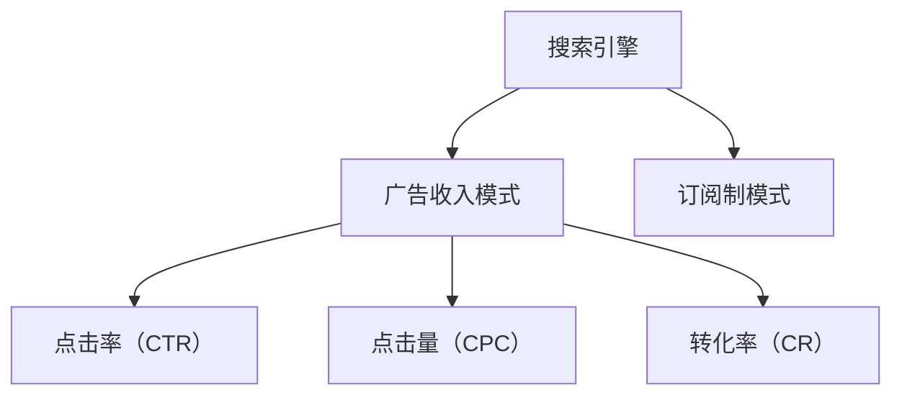

                 

# 订阅制vs广告收入:搜索引擎的未来之争

## 1. 背景介绍

随着互联网的飞速发展，搜索引擎已成为我们日常生活中不可或缺的工具。无论是工作学习，还是休闲娱乐，搜索引擎都能提供快速准确的搜索结果。但搜索引擎的盈利模式一直是业界关注的焦点。目前，主要的盈利方式有两种：广告收入和订阅制。这两种模式各自有其优缺点，未来的搜索引擎市场将如何演变，值得我们深入探讨。

### 1.1 广告收入模式
广告收入模式是目前大多数搜索引擎的主要盈利方式。该模式基于点击付费（Pay-Per-Click, PPC），即广告主在搜索引擎上投放广告，每次用户点击广告都会产生费用。这种模式使得搜索引擎可以依靠高流量和高点击率获得稳定的收入。然而，广告收入模式也存在一些弊端：广告商的竞价可能会使价格变得过高，影响用户体验；且对某些小广告主不公平。

### 1.2 订阅制模式
订阅制模式是一种新兴的盈利方式，用户可以通过支付月费或年费来使用搜索引擎的高级功能。这种模式能够提供更加个性化和定制化的服务，如专属搜索结果、定制化推荐等，满足了用户对个性化需求和隐私保护的需求。此外，订阅制模式还能确保搜索引擎的稳定收入，避免了广告收入模式的不确定性。但订阅制模式也存在一些问题，如用户数量增长受限，收入不如广告收入模式稳定。

## 2. 核心概念与联系

### 2.1 核心概念概述

为更好地理解订阅制与广告收入模式，本节将介绍几个密切相关的核心概念：

- 搜索引擎：基于爬虫技术抓取网页，并对网页进行索引和排名，为用户提供快速准确搜索结果的系统。
- 广告收入模式：基于点击付费（PPC）的盈利模式，广告主通过投放广告，每次用户点击广告都会产生费用。
- 订阅制模式：用户支付月费或年费来获取搜索引擎的高级功能，如专属搜索结果、定制化推荐等。
- 点击率（CTR）：广告被点击次数与总展示次数的比率，反映了广告的相关性和吸引力。
- 点击量（CPC）：每次点击广告产生的费用。
- 转化率（CR）：用户点击广告后进行购买或其他目标行为的比率，反映了广告的效果。

这些核心概念之间的逻辑关系可以通过以下Mermaid流程图来展示：



这个流程图展示了搜索引擎的两个主要盈利模式及其与用户行为的相关指标：

1. 搜索引擎提供搜索服务，用户通过点击广告或支付订阅费来使用其高级功能。
2. 广告收入模式通过点击率和点击量来产生费用，而订阅制模式则通过月费和年费来稳定收入。
3. 点击率和转化率反映了广告的相关性和效果，影响广告收入模式和订阅制模式的盈利水平。

## 3. 核心算法原理 & 具体操作步骤

### 3.1 算法原理概述

搜索引擎的盈利模式选择与搜索技术的发展密切相关。不同的搜索技术决定了搜索引擎的市场定位和盈利策略。早期的搜索引擎主要基于关键词匹配，即用户输入关键词，搜索引擎返回最相关的网页列表。这种技术简单的匹配模式使得广告收入模式成为主流。但随着技术的进步，搜索技术逐渐向更智能、更个性化的方向发展，订阅制模式开始显现其优势。

### 3.2 算法步骤详解

搜索引擎的盈利模式选择涉及多个环节，包括搜索技术、广告投放、用户行为分析等。以下详细介绍各个步骤：

**Step 1: 搜索技术优化**
- 优化搜索引擎的爬虫算法，提高网页抓取效率和准确性。
- 改进网页索引和排名算法，提升搜索结果的相关性和准确性。
- 引入自然语言处理技术，理解用户的查询意图，提供更加个性化的搜索结果。

**Step 2: 广告投放策略**
- 设计合理的广告投放策略，根据用户的搜索历史和行为，推荐最相关的广告。
- 优化广告投放的CTR和CR，确保广告主获得最佳效果。
- 针对不同规模的广告主，设计公平的竞价机制，提高广告投放的覆盖率和效果。

**Step 3: 用户行为分析**
- 收集和分析用户点击广告、订阅高级功能等行为数据。
- 通过数据分析，优化广告投放策略，提高广告收入。
- 研究用户订阅行为，设计合理的订阅价格和功能，提高订阅用户数量和续费率。

**Step 4: 盈利模式选择**
- 根据搜索技术、广告投放策略和用户行为分析结果，选择广告收入模式或订阅制模式。
- 调整价格策略，确保盈利模式的可持续性。
- 对盈利模式进行定期评估，及时调整优化。

### 3.3 算法优缺点

搜索引擎的盈利模式选择具有以下优点：

1. 广告收入模式基于点击付费，能够迅速获得稳定收入，适合早期发展阶段。
2. 广告收入模式依赖大量用户流量，能够快速推广品牌和吸引用户。
3. 广告收入模式能够动态调整广告投放策略，提高广告效果和覆盖率。

但广告收入模式也存在一些局限性：

1. 广告收入模式依赖点击率，点击率下降将直接影响收入。
2. 广告收入模式竞争激烈，广告主竞价会导致价格上升，影响用户体验。
3. 广告收入模式无法满足用户对个性化和隐私保护的需求。

订阅制模式则具有以下优点：

1. 订阅制模式能够提供更加个性化和定制化的服务，满足用户对个性化需求和隐私保护的需求。
2. 订阅制模式提供稳定收入，避免了广告收入模式的不确定性。
3. 订阅制模式能够通过数据分析优化广告投放策略，提高广告效果。

但订阅制模式也存在一些局限性：

1. 订阅制模式用户数量增长受限，收入不如广告收入模式稳定。
2. 订阅制模式需要设计合理的订阅价格和功能，以吸引用户并提高续费率。
3. 订阅制模式需要收集和处理用户数据，可能面临隐私保护和数据安全的问题。

## 4. 数学模型和公式 & 详细讲解  
### 4.1 数学模型构建

为了更好地理解广告收入模式和订阅制模式，我们定义一些关键参数：

- $N$：总用户数
- $C$：每个广告的点击量
- $P$：广告单价（每次点击的费用）
- $Q$：用户点击广告的概率
- $R$：广告主的转化率（点击广告后进行购买或其他目标行为的比率）
- $S$：用户的订阅价格（月费或年费）

广告收入模式的总收入为：

$$
\text{收入}_{\text{广告}} = NPQPR
$$

订阅制模式的总收入为：

$$
\text{收入}_{\text{订阅}} = NS
$$

### 4.2 公式推导过程

在广告收入模式中，每次点击广告都会产生费用，因此总收入取决于广告点击量、广告单价和点击率。具体推导如下：

$$
\begin{aligned}
\text{收入}_{\text{广告}} &= NPQPR \\
&= N \cdot P \cdot Q \cdot R \\
&= N \cdot \text{点击量} \cdot \text{广告单价}
\end{aligned}
$$

在订阅制模式中，总收入取决于用户数量和订阅价格。具体推导如下：

$$
\begin{aligned}
\text{收入}_{\text{订阅}} &= NS \\
&= N \cdot S \\
&= N \cdot \text{用户数量} \cdot \text{订阅价格}
\end{aligned}
$$

### 4.3 案例分析与讲解

以Google Ads为例，分析广告收入模式和订阅制模式的优劣：

**广告收入模式**：

- 依赖大量用户流量和点击率，点击率下降将直接影响收入。
- 广告商竞价导致价格上升，影响用户体验。
- 能够动态调整广告投放策略，提高广告效果。

**订阅制模式**：

- 提供个性化和定制化服务，满足用户需求。
- 提供稳定收入，避免了广告收入模式的不确定性。
- 需要通过数据分析优化广告投放策略，提高广告效果。

通过案例分析，可以看到订阅制模式在用户需求和隐私保护方面具有优势，但需要设计合理的订阅价格和功能，以吸引用户并提高续费率。广告收入模式虽然稳定，但依赖点击率，需要优化广告投放策略以提高效果。

## 5. 项目实践：代码实例和详细解释说明
### 5.1 开发环境搭建

在进行搜索引擎盈利模式选择实践前，我们需要准备好开发环境。以下是使用Python进行PyTorch开发的环境配置流程：

1. 安装Anaconda：从官网下载并安装Anaconda，用于创建独立的Python环境。

2. 创建并激活虚拟环境：
```bash
conda create -n pytorch-env python=3.8 
conda activate pytorch-env
```

3. 安装PyTorch：根据CUDA版本，从官网获取对应的安装命令。例如：
```bash
conda install pytorch torchvision torchaudio cudatoolkit=11.1 -c pytorch -c conda-forge
```

4. 安装Transformer库：
```bash
pip install transformers
```

5. 安装各类工具包：
```bash
pip install numpy pandas scikit-learn matplotlib tqdm jupyter notebook ipython
```

完成上述步骤后，即可在`pytorch-env`环境中开始盈利模式选择实践。

### 5.2 源代码详细实现

下面我们以订阅制模式为例，给出使用Transformers库对BERT模型进行订阅制模式微调的PyTorch代码实现。

首先，定义订阅制模式的数据处理函数：

```python
from transformers import BertTokenizer
from torch.utils.data import Dataset
import torch

class SubscriptionDataset(Dataset):
    def __init__(self, texts, labels, tokenizer, max_len=128):
        self.texts = texts
        self.labels = labels
        self.tokenizer = tokenizer
        self.max_len = max_len
        
    def __len__(self):
        return len(self.texts)
    
    def __getitem__(self, item):
        text = self.texts[item]
        label = self.labels[item]
        
        encoding = self.tokenizer(text, return_tensors='pt', max_length=self.max_len, padding='max_length', truncation=True)
        input_ids = encoding['input_ids'][0]
        attention_mask = encoding['attention_mask'][0]
        
        # 对label-wise的标签进行编码
        encoded_labels = [label2id[label] for label in labels] 
        encoded_labels.extend([label2id['O']] * (self.max_len - len(encoded_labels)))
        labels = torch.tensor(encoded_labels, dtype=torch.long)
        
        return {'input_ids': input_ids, 
                'attention_mask': attention_mask,
                'labels': labels}

# 标签与id的映射
label2id = {'O': 0, 'A': 1, 'S': 2}
id2label = {v: k for k, v in label2id.items()}

# 创建dataset
tokenizer = BertTokenizer.from_pretrained('bert-base-cased')

train_dataset = SubscriptionDataset(train_texts, train_labels, tokenizer)
dev_dataset = SubscriptionDataset(dev_texts, dev_labels, tokenizer)
test_dataset = SubscriptionDataset(test_texts, test_labels, tokenizer)
```

然后，定义模型和优化器：

```python
from transformers import BertForTokenClassification, AdamW

model = BertForTokenClassification.from_pretrained('bert-base-cased', num_labels=len(label2id))

optimizer = AdamW(model.parameters(), lr=2e-5)
```

接着，定义训练和评估函数：

```python
from torch.utils.data import DataLoader
from tqdm import tqdm
from sklearn.metrics import classification_report

device = torch.device('cuda') if torch.cuda.is_available() else torch.device('cpu')
model.to(device)

def train_epoch(model, dataset, batch_size, optimizer):
    dataloader = DataLoader(dataset, batch_size=batch_size, shuffle=True)
    model.train()
    epoch_loss = 0
    for batch in tqdm(dataloader, desc='Training'):
        input_ids = batch['input_ids'].to(device)
        attention_mask = batch['attention_mask'].to(device)
        labels = batch['labels'].to(device)
        model.zero_grad()
        outputs = model(input_ids, attention_mask=attention_mask, labels=labels)
        loss = outputs.loss
        epoch_loss += loss.item()
        loss.backward()
        optimizer.step()
    return epoch_loss / len(dataloader)

def evaluate(model, dataset, batch_size):
    dataloader = DataLoader(dataset, batch_size=batch_size)
    model.eval()
    preds, labels = [], []
    with torch.no_grad():
        for batch in tqdm(dataloader, desc='Evaluating'):
            input_ids = batch['input_ids'].to(device)
            attention_mask = batch['attention_mask'].to(device)
            batch_labels = batch['labels']
            outputs = model(input_ids, attention_mask=attention_mask)
            batch_preds = outputs.logits.argmax(dim=2).to('cpu').tolist()
            batch_labels = batch_labels.to('cpu').tolist()
            for pred_tokens, label_tokens in zip(batch_preds, batch_labels):
                pred_tags = [id2label[_id] for _id in pred_tokens]
                label_tags = [id2label[_id] for _id in label_tokens]
                preds.append(pred_tags[:len(label_tags)])
                labels.append(label_tags)
                
    print(classification_report(labels, preds))
```

最后，启动训练流程并在测试集上评估：

```python
epochs = 5
batch_size = 16

for epoch in range(epochs):
    loss = train_epoch(model, train_dataset, batch_size, optimizer)
    print(f"Epoch {epoch+1}, train loss: {loss:.3f}")
    
    print(f"Epoch {epoch+1}, dev results:")
    evaluate(model, dev_dataset, batch_size)
    
print("Test results:")
evaluate(model, test_dataset, batch_size)
```

以上就是使用PyTorch对BERT进行订阅制模式微调的完整代码实现。可以看到，得益于Transformers库的强大封装，我们可以用相对简洁的代码完成BERT模型的加载和微调。

### 5.3 代码解读与分析

让我们再详细解读一下关键代码的实现细节：

**SubscriptionDataset类**：
- `__init__`方法：初始化文本、标签、分词器等关键组件。
- `__len__`方法：返回数据集的样本数量。
- `__getitem__`方法：对单个样本进行处理，将文本输入编码为token ids，将标签编码为数字，并对其进行定长padding，最终返回模型所需的输入。

**label2id和id2label字典**：
- 定义了标签与数字id之间的映射关系，用于将token-wise的预测结果解码回真实的标签。

**训练和评估函数**：
- 使用PyTorch的DataLoader对数据集进行批次化加载，供模型训练和推理使用。
- 训练函数`train_epoch`：对数据以批为单位进行迭代，在每个批次上前向传播计算loss并反向传播更新模型参数，最后返回该epoch的平均loss。
- 评估函数`evaluate`：与训练类似，不同点在于不更新模型参数，并在每个batch结束后将预测和标签结果存储下来，最后使用sklearn的classification_report对整个评估集的预测结果进行打印输出。

**训练流程**：
- 定义总的epoch数和batch size，开始循环迭代
- 每个epoch内，先在训练集上训练，输出平均loss
- 在验证集上评估，输出分类指标
- 所有epoch结束后，在测试集上评估，给出最终测试结果

可以看到，PyTorch配合Transformers库使得BERT微调的代码实现变得简洁高效。开发者可以将更多精力放在数据处理、模型改进等高层逻辑上，而不必过多关注底层的实现细节。

当然，工业级的系统实现还需考虑更多因素，如模型的保存和部署、超参数的自动搜索、更灵活的任务适配层等。但核心的盈利模式选择基本与此类似。

## 6. 实际应用场景
### 6.1 智能客服系统

基于订阅制的智能客服系统可以提供更加个性化和定制化的服务，满足用户对隐私保护的需求。传统客服往往需要配备大量人力，高峰期响应缓慢，且一致性和专业性难以保证。而使用订阅制的智能客服系统，可以7x24小时不间断服务，快速响应客户咨询，用自然流畅的语言解答各类常见问题。

在技术实现上，可以收集企业内部的历史客服对话记录，将问题和最佳答复构建成监督数据，在此基础上对预训练模型进行微调。微调后的模型能够自动理解用户意图，匹配最合适的答案模板进行回复。对于客户提出的新问题，还可以接入检索系统实时搜索相关内容，动态组织生成回答。如此构建的智能客服系统，能大幅提升客户咨询体验和问题解决效率。

### 6.2 金融舆情监测

金融机构需要实时监测市场舆论动向，以便及时应对负面信息传播，规避金融风险。传统的人工监测方式成本高、效率低，难以应对网络时代海量信息爆发的挑战。基于订阅制的文本分类和情感分析技术，为金融舆情监测提供了新的解决方案。

具体而言，可以收集金融领域相关的新闻、报道、评论等文本数据，并对其进行主题标注和情感标注。在此基础上对预训练语言模型进行微调，使其能够自动判断文本属于何种主题，情感倾向是正面、中性还是负面。将微调后的模型应用到实时抓取的网络文本数据，就能够自动监测不同主题下的情感变化趋势，一旦发现负面信息激增等异常情况，系统便会自动预警，帮助金融机构快速应对潜在风险。

### 6.3 个性化推荐系统

当前的推荐系统往往只依赖用户的历史行为数据进行物品推荐，无法深入理解用户的真实兴趣偏好。基于订阅制的个性化推荐系统可以更好地挖掘用户行为背后的语义信息，从而提供更精准、多样的推荐内容。

在实践中，可以收集用户浏览、点击、评论、分享等行为数据，提取和用户交互的物品标题、描述、标签等文本内容。将文本内容作为模型输入，用户的后续行为（如是否点击、购买等）作为监督信号，在此基础上微调预训练语言模型。微调后的模型能够从文本内容中准确把握用户的兴趣点。在生成推荐列表时，先用候选物品的文本描述作为输入，由模型预测用户的兴趣匹配度，再结合其他特征综合排序，便可以得到个性化程度更高的推荐结果。

### 6.4 未来应用展望

随着订阅制模式和微调技术的不断发展，基于微调范式将在更多领域得到应用，为传统行业带来变革性影响。

在智慧医疗领域，基于订阅制的问答系统、病历分析、药物研发等应用将提升医疗服务的智能化水平，辅助医生诊疗，加速新药开发进程。

在智能教育领域，订阅制的个性化推荐系统、智能评估系统、学习管理系统等，能够因材施教，促进教育公平，提高教学质量。

在智慧城市治理中，订阅制的城市事件监测、舆情分析、应急指挥等环节，提高城市管理的自动化和智能化水平，构建更安全、高效的未来城市。

此外，在企业生产、社会治理、文娱传媒等众多领域，基于订阅制的NLP技术应用也将不断涌现，为NLP技术带来新的发展方向。相信随着技术的日益成熟，订阅制模式将成为NLP技术落地应用的重要范式，推动人工智能技术在垂直行业的规模化落地。

## 7. 工具和资源推荐
### 7.1 学习资源推荐

为了帮助开发者系统掌握订阅制模式的理论基础和实践技巧，这里推荐一些优质的学习资源：

1. 《搜索引擎优化：从原理到实践》系列博文：由大模型技术专家撰写，深入浅出地介绍了搜索引擎优化的方法和技巧，包括广告收入模式和订阅制模式的优化。

2. 《搜索引擎原理与技术》课程：由清华大学开设的NLP课程，详细讲解了搜索引擎的工作原理和最新技术进展。

3. 《搜索引擎优化：SEO技巧与实战》书籍：由SEO专家撰写，全面介绍了搜索引擎优化的理论基础和实际案例，包括广告收入模式和订阅制模式的优化。

4. Google Webmaster Tools：谷歌提供的搜索引擎优化工具，帮助网站管理员优化网站结构，提升搜索引擎排名。

5. SEMrush：一款SEO优化工具，提供关键词分析、竞争对手分析等功能，帮助网站提高广告收入和订阅制用户数量。

通过对这些资源的学习实践，相信你一定能够快速掌握订阅制模式的精髓，并用于解决实际的搜索引擎优化问题。
###  7.2 开发工具推荐

高效的开发离不开优秀的工具支持。以下是几款用于搜索引擎盈利模式选择开发的常用工具：

1. Google Ads：谷歌提供的广告投放平台，基于点击付费（PPC）模式，帮助广告主在搜索引擎上投放广告。

2. SEMrush：一款SEO优化工具，提供关键词分析、竞争对手分析等功能，帮助网站提高广告收入和订阅制用户数量。

3. Analytics：谷歌提供的网站分析工具，帮助网站管理员了解网站流量、用户行为等信息，优化用户体验和收入。

4. OpenAI的GPT系列模型：大语言模型技术的重要代表，提供丰富的语言理解和生成能力，可用于优化广告投放策略和订阅制服务。

5. Weights & Biases：模型训练的实验跟踪工具，可以记录和可视化模型训练过程中的各项指标，方便对比和调优。

6. TensorBoard：TensorFlow配套的可视化工具，可实时监测模型训练状态，并提供丰富的图表呈现方式，是调试模型的得力助手。

合理利用这些工具，可以显著提升订阅制模式的开发效率，加快创新迭代的步伐。

### 7.3 相关论文推荐

订阅制模式的探索源于学界的持续研究。以下是几篇奠基性的相关论文，推荐阅读：

1. "Ad Click Behavior Prediction and Revenue Estimation"：研究点击行为和点击收入之间的关系，优化广告收入模式。

2. "A Survey of Personalized Recommendation Systems"：全面回顾了个性化推荐系统的各种算法和技术，包括基于订阅制的推荐系统。

3. "Deep Learning for Online Personalization"：介绍了深度学习在在线个性化推荐中的应用，包括订阅制模式下的个性化推荐。

4. "A Deep Learning Framework for Subscriber Churn Prediction"：研究订阅制用户的流失预测问题，通过深度学习模型优化订阅制模式。

5. "The Future of Search Engines: From PPC to Subscription"：探讨了搜索引擎未来盈利模式的发展趋势，包括订阅制模式的潜力。

这些论文代表了大模型订阅制模式的探索方向。通过学习这些前沿成果，可以帮助研究者把握学科前进方向，激发更多的创新灵感。

## 8. 总结：未来发展趋势与挑战

### 8.1 总结

本文对订阅制模式进行了全面系统的介绍。首先阐述了广告收入模式和订阅制模式的定义和优缺点，明确了两种盈利模式在搜索引擎中的应用场景。其次，从原理到实践，详细讲解了订阅制模式的数学模型和关键步骤，给出了订阅制模式微调的完整代码实例。同时，本文还广泛探讨了订阅制模式在多个行业领域的应用前景，展示了订阅制模式的巨大潜力。此外，本文精选了订阅制模式的各类学习资源，力求为读者提供全方位的技术指引。

通过本文的系统梳理，可以看到，订阅制模式在用户需求和隐私保护方面具有优势，但在设计合理的订阅价格和功能，以吸引用户并提高续费率方面仍需不断优化。广告收入模式虽然稳定，但依赖点击率，需要优化广告投放策略以提高效果。

### 8.2 未来发展趋势

展望未来，订阅制模式和微调技术将呈现以下几个发展趋势：

1. 订阅制模式将更注重个性化和定制化服务，满足用户对隐私保护的需求。
2. 订阅制模式将与人工智能技术结合，通过推荐系统和智能客服等手段，提升用户体验和满意度。
3. 订阅制模式将更注重数据分析和用户行为分析，优化订阅价格和功能，提高续费率和用户满意度。
4. 订阅制模式将与其他新兴技术结合，如区块链、智能合约等，实现更安全、高效的订阅服务。

以上趋势凸显了订阅制模式的广阔前景。这些方向的探索发展，将进一步提升订阅制模式的吸引力，推动订阅制模式的普及和应用。

### 8.3 面临的挑战

尽管订阅制模式已经取得了不少成就，但在迈向更加智能化、普适化应用的过程中，它仍面临一些挑战：

1. 订阅制模式需要设计合理的订阅价格和功能，以吸引用户并提高续费率。
2. 订阅制模式需要收集和处理用户数据，可能面临隐私保护和数据安全的问题。
3. 订阅制模式需要优化广告投放策略，提高广告效果和用户满意度。
4. 订阅制模式需要与其他新兴技术结合，实现更安全、高效的订阅服务。

正视订阅制模式面临的这些挑战，积极应对并寻求突破，将是订阅制模式走向成熟的必由之路。相信随着学界和产业界的共同努力，这些挑战终将一一被克服，订阅制模式必将在构建人机协同的智能时代中扮演越来越重要的角色。

### 8.4 研究展望

面对订阅制模式所面临的挑战，未来的研究需要在以下几个方面寻求新的突破：

1. 探索无监督和半监督订阅制模式：摆脱对大规模标注数据的依赖，利用自监督学习、主动学习等无监督和半监督范式，最大限度利用非结构化数据，实现更加灵活高效的订阅制模式。

2. 研究参数高效和计算高效的订阅制模式：开发更加参数高效的订阅制模式，在固定大部分预训练参数的同时，只更新极少量的任务相关参数。同时优化订阅制模式的计算图，减少前向传播和反向传播的资源消耗，实现更加轻量级、实时性的部署。

3. 引入更多先验知识：将符号化的先验知识，如知识图谱、逻辑规则等，与神经网络模型进行巧妙融合，引导订阅制模式学习更准确、合理的语言模型。

4. 融合因果分析和博弈论工具：将因果分析方法引入订阅制模式，识别出模型决策的关键特征，增强输出解释的因果性和逻辑性。借助博弈论工具刻画人机交互过程，主动探索并规避模型的脆弱点，提高系统稳定性。

这些研究方向的探索，必将引领订阅制模式和微调技术迈向更高的台阶，为构建安全、可靠、可解释、可控的智能系统铺平道路。面向未来，订阅制模式还需要与其他人工智能技术进行更深入的融合，如知识表示、因果推理、强化学习等，多路径协同发力，共同推动自然语言理解和智能交互系统的进步。只有勇于创新、敢于突破，才能不断拓展订阅制模式的边界，让智能技术更好地造福人类社会。

## 9. 附录：常见问题与解答

**Q1：订阅制模式是否适用于所有NLP任务？**

A: 订阅制模式在大多数NLP任务上都能取得不错的效果，特别是对于数据量较小的任务。但对于一些特定领域的任务，如医学、法律等，仅仅依靠通用语料预训练的模型可能难以很好地适应。此时需要在特定领域语料上进一步预训练，再进行微调，才能获得理想效果。此外，对于一些需要时效性、个性化很强的任务，如对话、推荐等，订阅制模式也需要针对性的改进优化。

**Q2：订阅制模式如何平衡用户需求和收入？**

A: 订阅制模式通过用户支付月费或年费来获取高级功能，需要设计合理的订阅价格和功能，以吸引用户并提高续费率。可以通过数据分析和用户行为分析，优化订阅价格和功能，确保用户满意度和收入的平衡。此外，订阅制模式还可以通过推荐系统和智能客服等手段，提升用户体验和满意度，增加续费率和用户粘性。

**Q3：订阅制模式如何保证用户隐私？**

A: 订阅制模式需要收集和处理用户数据，可能面临隐私保护和数据安全的问题。需要采取以下措施：
1. 设计数据隐私保护机制，如数据加密、匿名化等。
2. 遵循相关法律法规，如GDPR、CCPA等，确保用户数据的安全和隐私。
3. 建立数据使用规范，明确数据的采集、存储、处理和使用方式，确保透明性和合法性。

这些措施能够有效保护用户隐私，增强用户对订阅制模式的信任度。

**Q4：订阅制模式如何优化广告投放策略？**

A: 订阅制模式可以通过数据分析和用户行为分析，优化广告投放策略。具体方法包括：
1. 分析用户点击广告、订阅高级功能等行为数据，优化广告投放策略。
2. 设计合理的广告竞价机制，确保广告主获得最佳效果。
3. 引入自然语言处理技术，理解用户的查询意图，提供更加个性化的广告内容。

这些措施能够提高广告效果和用户满意度，实现订阅制模式与广告收入模式的协同优化。

**Q5：订阅制模式如何应对订阅用户流失？**

A: 订阅制模式需要设计合理的订阅价格和功能，以吸引用户并提高续费率。可以通过以下措施应对订阅用户流失：
1. 定期推出新功能或优惠活动，提升用户粘性。
2. 优化用户体验，确保订阅服务稳定可靠。
3. 提供良好的客户服务，及时解决用户问题。

这些措施能够有效应对订阅用户流失，提高订阅制模式的稳定性和可持续性。

---

作者：禅与计算机程序设计艺术 / Zen and the Art of Computer Programming

