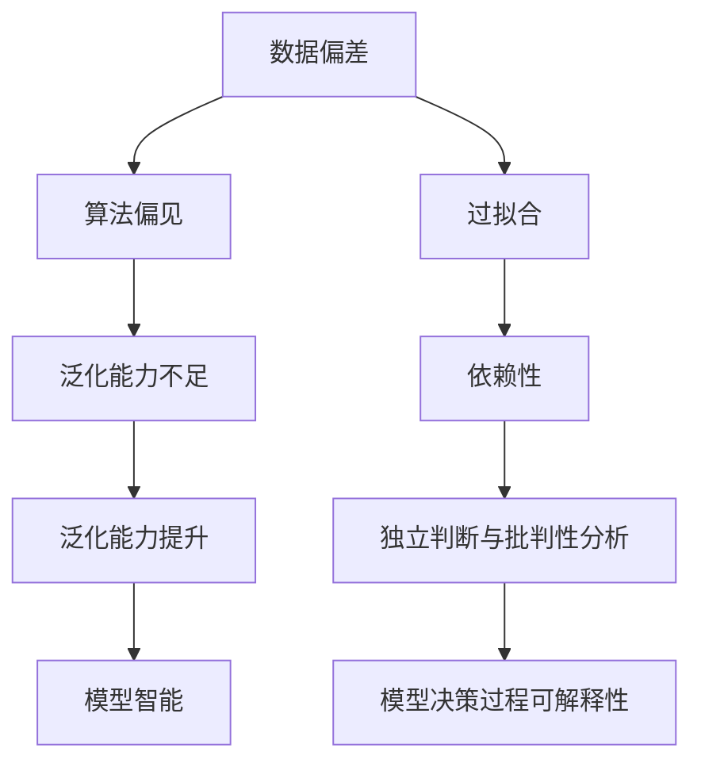

                 

# 认知偏差2.0：AI时代的新型思维陷阱

## 1. 背景介绍

### 1.1 问题由来

随着人工智能（AI）技术的高速发展，特别是深度学习算法的普及，人类在认知和决策过程中遭遇的诸多认知偏差逐渐显现，并形成了一系列新的思维陷阱。这些思维陷阱不仅影响了人工智能的发展方向，也对人类自身认识和决策过程带来了深刻挑战。

这些问题在AI时代的突出表现包括：

- **过拟合与泛化能力不足**：AI模型在训练集上表现优异，但面对未见过的数据，往往表现不佳，这背后可能是训练数据样本不足或模型复杂度过高导致的过拟合问题。
- **依赖先验知识与缺乏批判性思考**：AI模型在学习和决策过程中高度依赖于输入数据的先验知识，这可能导致模型在某些特定场景下出现依赖偏见或未能全面考虑问题的多面性。
- **数据偏差与算法偏见**：AI模型可能会继承训练数据中的偏见，从而导致不公正、歧视性的输出，这要求开发者和使用者必须对数据和算法进行细致的审视和调整。

### 1.2 问题核心关键点

认知偏差在AI时代的具体表现主要集中在以下几个方面：

- **数据偏差（Data Bias）**：训练数据集的代表性不足，导致模型在处理不同群体或场景时，输出结果出现偏见。
- **算法偏见（Algorithmic Bias）**：模型在训练过程中可能学习到数据中的隐含偏见，进而导致输出结果的偏见。
- **模型过拟合（Overfitting）**：模型过于复杂，容易在训练集上表现优异，但泛化能力不足，无法适应新的数据或场景。
- **依赖性（Dependency）**：AI模型高度依赖于输入数据的先验知识，缺乏对数据背后复杂因素的独立判断和批判性分析。
- **模型泛化（Generalization）**：模型在处理复杂任务和未知数据时，往往表现出较差的泛化能力，难以实现真正的“智能”。

这些问题不仅在学术界引起了广泛的关注，也促使业界开始从模型、算法、数据等多个层面，探讨和解决AI时代的新型思维陷阱。

## 2. 核心概念与联系

### 2.1 核心概念概述

为更好地理解认知偏差在AI时代的表现及其对思维的影响，本节将介绍几个关键概念：

- **数据偏差（Data Bias）**：训练数据集中不平衡或偏见，导致模型在处理特定群体或场景时，输出结果存在偏差。
- **算法偏见（Algorithmic Bias）**：模型在训练过程中学习到的隐含偏见，如性别、种族等偏见，可能导致输出结果的不公平。
- **过拟合（Overfitting）**：模型在训练数据上表现良好，但面对新数据或复杂任务时，表现不佳的现象。
- **依赖性（Dependency）**：AI模型高度依赖输入数据的先验知识，缺乏独立判断和批判性分析能力。
- **泛化（Generalization）**：模型在处理新数据或复杂任务时，能够将训练中学到的知识泛化应用，实现真正意义上的“智能”。

这些概念之间的逻辑关系可以通过以下Mermaid流程图来展示：



这个流程图展示了认知偏差在AI时代的主要表现及其影响：

1. 数据偏差影响模型的训练，导致算法偏见。
2. 过拟合问题限制了模型的泛化能力。
3. 依赖性使得模型缺乏独立判断。
4. 泛化能力不足和缺乏独立判断，导致模型智能受限。
5. 通过提高泛化能力和独立判断，模型智能得以提升。

这些概念共同构成了认知偏差在AI时代的表现和影响框架，为理解和解决相关问题提供了理论基础。

## 3. 核心算法原理 & 具体操作步骤
### 3.1 算法原理概述

认知偏差在AI时代的新型思维陷阱，主要源于训练数据、模型设计和实际应用过程中的多重因素。解决这些问题的核心在于，通过一系列技术手段，减少数据偏差，优化算法设计，提升模型的泛化能力和独立判断能力。

### 3.2 算法步骤详解

解决认知偏差在AI时代的新型思维陷阱，一般包括以下几个关键步骤：

**Step 1: 数据预处理与偏差识别**

- **数据清洗**：处理缺失值、异常值，保证数据的质量和代表性。
- **偏差识别**：使用统计方法和可视化工具，识别数据中的偏差模式，如性别、年龄、地域等。

**Step 2: 数据增强与平衡**

- **数据增强**：通过生成合成数据、数据重采样等技术，增加数据多样性，减少数据偏差。
- **数据平衡**：采用重采样、生成对抗网络（GAN）等方法，平衡数据集中各类别的样本数量。

**Step 3: 模型设计优化**

- **正则化技术**：使用L1、L2正则、Dropout等技术，防止模型过拟合。
- **参数高效设计**：采用模型压缩、参数共享等技术，减少模型的复杂度。
- **对抗训练**：引入对抗样本，增强模型的鲁棒性和泛化能力。

**Step 4: 模型验证与调整**

- **交叉验证**：使用k折交叉验证方法，评估模型在不同数据集上的泛化能力。
- **指标调整**：根据任务特点，选择合适的评价指标，如准确率、召回率、F1分数等。
- **调整超参数**：使用网格搜索、随机搜索等方法，优化模型的超参数，提高性能。

**Step 5: 模型部署与监控**

- **模型部署**：将优化后的模型部署到实际应用环境中，进行在线预测。
- **监控与调整**：实时监控模型性能，根据反馈数据调整模型参数，持续优化模型。

通过以上步骤，可以在数据、算法和模型部署等多个环节，有效减少认知偏差对AI系统性能的影响。

### 3.3 算法优缺点

解决认知偏差在AI时代的新型思维陷阱的方法，具有以下优点：

- **提升模型泛化能力**：通过数据增强和正则化技术，减少过拟合，提高模型的泛化能力。
- **减少数据偏差**：采用数据平衡和偏差识别技术，降低模型在特定群体或场景下的偏差。
- **提高模型独立判断能力**：通过模型压缩和参数高效设计，减少对先验知识的依赖。

然而，这些方法也存在一定的局限性：

- **数据处理复杂**：数据预处理和增强技术可能需要较高的计算资源和时间成本。
- **模型设计挑战**：复杂的模型设计需要丰富的经验和专业知识，可能导致过度工程化。
- **持续监控需求**：模型部署后的持续监控和调整需要大量的资源投入，且难以自动化。

尽管存在这些局限性，但相关技术手段的不断进步，使得认知偏差在AI时代的新型思维陷阱有望得到有效解决。

### 3.4 算法应用领域

解决认知偏差在AI时代的新型思维陷阱的方法，已经在多个领域得到了广泛应用，包括但不限于：

- **医疗领域**：通过减少数据偏差，避免算法偏见，提升模型的诊断准确性和公平性。
- **金融领域**：通过数据增强和模型优化，提高模型的风险预测能力和公平性。
- **司法领域**：通过数据清洗和模型验证，提升模型的判决公平性和可信度。
- **媒体内容推荐**：通过数据平衡和泛化能力提升，减少推荐内容的偏见，提供更加公平和多样化的内容。

## 4. 数学模型和公式 & 详细讲解 & 举例说明
### 4.1 数学模型构建

为更好地理解解决认知偏差在AI时代的新型思维陷阱的数学原理，本节将介绍几个关键数学模型：

- **损失函数（Loss Function）**：用于衡量模型预测与真实标签之间的差异，常见的损失函数包括交叉熵损失、均方误差损失等。
- **正则化项（Regularization Term）**：防止模型过拟合的技术，如L1正则、L2正则、Dropout等。
- **对抗样本（Adversarial Examples）**：用于增强模型鲁棒性的技术，通过生成对抗样本进行训练。

**交叉熵损失函数（Cross-Entropy Loss）**：

$$
L = -\frac{1}{N} \sum_{i=1}^{N} \sum_{j=1}^{C} y_{ij} \log(p_{ij})
$$

其中，$N$ 为样本数量，$C$ 为类别数，$y_{ij}$ 为样本$i$的第$j$个类别的真实标签，$p_{ij}$ 为模型预测的概率。

**L2正则化项（L2 Regularization）**：

$$
L_{reg} = \frac{\lambda}{2} \sum_{i=1}^{N} \|w_i\|^2
$$

其中，$\lambda$ 为正则化系数，$w_i$ 为模型第$i$层的参数向量。

**对抗样本生成（Adversarial Sample Generation）**：

通过对原始样本进行微小扰动，生成对抗样本，并使用梯度上升或下降算法，最大化模型预测误差。

### 4.2 公式推导过程

以下我们将推导交叉熵损失函数和L2正则化项的公式推导过程，并举例说明对抗样本的生成。

**交叉熵损失函数推导**：

将目标函数改写为对数形式：

$$
L = -\frac{1}{N} \sum_{i=1}^{N} \sum_{j=1}^{C} y_{ij} \log\left(\frac{e^{\log(p_{ij})}}{\sum_{k=1}^{C} e^{\log(p_{ik})}}\right)
$$

令 $p_{ik} = e^{\log(p_{ik})}$，则上式可以简化为：

$$
L = -\frac{1}{N} \sum_{i=1}^{N} \sum_{j=1}^{C} y_{ij} \log\left(\frac{p_{ij}}{\sum_{k=1}^{C} p_{ik}}\right)
$$

进一步，令 $y_{ij} = \mathbb{1}(y_i = j)$，其中 $\mathbb{1}(\cdot)$ 为示性函数，则上式变为：

$$
L = -\frac{1}{N} \sum_{i=1}^{N} y_i \log(\hat{y_i})
$$

其中 $\hat{y_i}$ 为模型对样本$i$的预测概率。

**L2正则化项推导**：

将目标函数改写为对数形式：

$$
L_{reg} = \frac{\lambda}{2} \sum_{i=1}^{N} \sum_{k=1}^{D_i} w_{ik}^2
$$

其中，$D_i$ 为第$i$层的参数向量维度。

**对抗样本生成示例**：

假设输入样本 $x$，模型输出 $y=f(x)$，生成对抗样本 $\bar{x}$，使得 $y+1=f(\bar{x})$。对样本 $x$ 进行微小扰动 $\delta$，得到 $\bar{x}=x+\delta$。

根据梯度上升算法，目标函数为：

$$
\max_{\delta} -\frac{\partial L(y+1, \bar{x})}{\partial \delta}
$$

其中，$L(y+1, \bar{x})$ 为模型在扰动样本上的损失函数。

通过求解上述目标函数，可以得到最优扰动 $\delta$，进而生成对抗样本 $\bar{x}$。

## 5. 项目实践：代码实例和详细解释说明
### 5.1 开发环境搭建

在进行AI应用开发前，我们需要准备好开发环境。以下是使用Python进行TensorFlow开发的典型环境配置流程：

1. 安装Anaconda：从官网下载并安装Anaconda，用于创建独立的Python环境。

2. 创建并激活虚拟环境：
```bash
conda create -n tf-env python=3.8 
conda activate tf-env
```

3. 安装TensorFlow：根据CUDA版本，从官网获取对应的安装命令。例如：
```bash
pip install tensorflow==2.4
```

4. 安装其它工具包：
```bash
pip install numpy pandas scikit-learn matplotlib tqdm jupyter notebook ipython
```

完成上述步骤后，即可在`tf-env`环境中开始AI应用开发。

### 5.2 源代码详细实现

下面我们以医疗领域的数据偏差和算法偏见处理为例，给出使用TensorFlow进行深度学习模型开发的PyTorch代码实现。

首先，定义医疗数据集，并进行数据清洗和偏差识别：

```python
import numpy as np
import pandas as pd
from sklearn.model_selection import train_test_split
from sklearn.preprocessing import StandardScaler

# 加载数据集
df = pd.read_csv('medical_data.csv')

# 数据清洗
df = df.dropna()
df = df.drop_duplicates()

# 偏差识别
bias = pd.DataFrame(df.groupby('gender').agg({'label': 'count'}))
print(bias)
```

然后，定义模型和损失函数：

```python
from tensorflow.keras import layers, models

# 定义模型
input_layer = layers.Input(shape=(128,))
hidden_layer = layers.Dense(64, activation='relu')(input_layer)
output_layer = layers.Dense(2, activation='softmax')(hidden_layer)
model = models.Model(inputs=input_layer, outputs=output_layer)

# 定义损失函数
loss_fn = tf.keras.losses.categorical_crossentropy

# 定义优化器
optimizer = tf.keras.optimizers.Adam()
```

接着，定义模型训练和评估函数：

```python
# 定义训练函数
def train(model, data, epochs=10, batch_size=32):
    model.compile(optimizer=optimizer, loss=loss_fn, metrics=['accuracy'])
    model.fit(data['x'], data['y'], epochs=epochs, batch_size=batch_size, validation_split=0.2)

# 定义评估函数
def evaluate(model, data):
    loss, accuracy = model.evaluate(data['x'], data['y'])
    print(f'Loss: {loss:.4f}, Accuracy: {accuracy:.4f}')
```

最后，启动模型训练并评估：

```python
# 数据集划分
x_train, x_val, y_train, y_val = train_test_split(data['x'], data['y'], test_size=0.2, random_state=42)

# 数据标准化
scaler = StandardScaler()
x_train = scaler.fit_transform(x_train)
x_val = scaler.transform(x_val)

# 模型训练
train(model, x_train, y_train)

# 模型评估
evaluate(model, x_val)
```

以上就是使用TensorFlow对医疗数据集进行偏差处理和算法优化的完整代码实现。可以看到，TensorFlow提供了方便的API和工具，可以快速搭建和训练深度学习模型。

### 5.3 代码解读与分析

让我们再详细解读一下关键代码的实现细节：

**医疗数据集定义**：
- 使用pandas库加载数据集，并进行数据清洗，去除缺失值和重复记录。
- 使用sklearn库的train_test_split方法，将数据集划分为训练集和验证集。

**模型定义**：
- 使用TensorFlow的Keras API，定义输入层、隐藏层和输出层，构建神经网络模型。
- 定义交叉熵损失函数，使用Adam优化器进行优化。

**模型训练与评估**：
- 使用fit方法进行模型训练，指定训练集、验证集和批量大小，设置迭代轮数。
- 使用evaluate方法在验证集上评估模型性能，输出损失和准确率。

可以看到，TensorFlow为深度学习模型的构建和训练提供了强大的API支持，使得模型开发更加高效和便捷。

## 6. 实际应用场景
### 6.1 医疗领域

在医疗领域，基于深度学习模型的AI应用广泛，包括医学影像诊断、基因组学研究、药物研发等。然而，数据偏差和算法偏见问题在这些应用中尤为突出，主要表现为：

- **数据偏差**：不同种族、性别、年龄、地域的患者数据分布不均，导致模型在处理特定群体时表现不佳。
- **算法偏见**：模型在训练过程中可能学习到数据中的隐含偏见，如种族、性别、地域等，导致诊断和治疗结果的不公平。

为了解决这些问题，通常采用以下方法：

- **数据增强**：通过数据合成、数据平衡等技术，增加数据多样性，减少数据偏差。
- **对抗训练**：通过对抗样本生成技术，增强模型鲁棒性，减少算法偏见。
- **多模型集成**：通过集成不同模型的输出，减少单一模型的偏见和过拟合问题。

### 6.2 金融领域

在金融领域，AI技术被广泛应用于风险评估、信用评分、欺诈检测等。数据偏差和算法偏见问题主要表现为：

- **数据偏差**：不同地区、职业、收入水平的客户数据分布不均，导致模型在处理特定群体时表现不佳。
- **算法偏见**：模型在训练过程中可能学习到数据中的隐含偏见，如性别、年龄、职业等，导致风险评估和信用评分的不公平。

为了解决这些问题，通常采用以下方法：

- **数据平衡**：通过重采样、生成对抗网络等技术，平衡数据集中各类别的样本数量。
- **正则化技术**：使用L1、L2正则、Dropout等技术，防止模型过拟合。
- **对抗训练**：通过对抗样本生成技术，增强模型鲁棒性，减少算法偏见。

### 6.3 司法领域

在司法领域，AI技术被广泛应用于案件判决、法律文书生成、证据分析等。数据偏差和算法偏见问题主要表现为：

- **数据偏差**：不同地域、种族、性别、年龄、职业的案件数据分布不均，导致模型在处理特定群体时表现不佳。
- **算法偏见**：模型在训练过程中可能学习到数据中的隐含偏见，如种族、性别、职业等，导致判决结果的不公平。

为了解决这些问题，通常采用以下方法：

- **数据清洗**：通过数据清洗技术，去除不平衡和偏差的数据，提高数据质量。
- **对抗训练**：通过对抗样本生成技术，增强模型鲁棒性，减少算法偏见。
- **多模型集成**：通过集成不同模型的输出，减少单一模型的偏见和过拟合问题。

## 7. 工具和资源推荐
### 7.1 学习资源推荐

为了帮助开发者系统掌握解决认知偏差在AI时代的新型思维陷阱的理论基础和实践技巧，这里推荐一些优质的学习资源：

1. **深度学习入门**：李沐的《动手学深度学习》是一本深入浅出的深度学习入门书籍，涵盖基本概念和常用技术。
2. **TensorFlow官方文档**：TensorFlow的官方文档提供了详细的API介绍和实战案例，是学习和应用TensorFlow的重要参考。
3. **Kaggle竞赛平台**：Kaggle提供了丰富的数据集和竞赛任务，通过实战练习，可以更好地理解和应用认知偏差问题。
4. **深度学习框架比较**：斯坦福大学开设的课程，比较了TensorFlow、PyTorch等深度学习框架的优缺点，帮助选择合适的工具。
5. **《Python深度学习》**：Francois Chollet的书籍，详细介绍了TensorFlow和Keras的使用方法和应用场景。

通过对这些资源的学习实践，相信你一定能够快速掌握解决认知偏差在AI时代的新型思维陷阱的精髓，并用于解决实际的AI问题。

### 7.2 开发工具推荐

高效的开发离不开优秀的工具支持。以下是几款用于AI开发常用的工具：

1. **Anaconda**：提供Python环境的创建和管理工具，支持虚拟环境、包管理等功能。
2. **Jupyter Notebook**：轻量级的交互式编程环境，支持多种编程语言和数据可视化。
3. **TensorFlow**：开源深度学习框架，提供灵活的模型构建和训练功能。
4. **PyTorch**：开源深度学习框架，提供动态计算图和灵活的模型构建功能。
5. **Scikit-learn**：开源机器学习库，提供丰富的算法和工具支持。

合理利用这些工具，可以显著提升AI应用的开发效率，加快创新迭代的步伐。

### 7.3 相关论文推荐

解决认知偏差在AI时代的新型思维陷阱的研究涉及多个领域，以下是几篇奠基性的相关论文，推荐阅读：

1. **《On the Importance of Being Data-Generative》**：探讨了生成对抗网络（GAN）在减少数据偏差方面的应用。
2. **《Reducing Bias in AI Algorithmic Decisions》**：介绍了减少算法偏见的方法，如对抗训练、公平性约束等。
3. **《Overfitting in Deep Learning》**：讨论了深度学习中的过拟合问题，并提供了多种解决策略。
4. **《Deep Learning in Healthcare》**：介绍了深度学习在医疗领域的应用，以及如何减少数据偏差和算法偏见。
5. **《Fairness-aware Deep Learning》**：探讨了深度学习中的公平性问题，并提供了多种公平性约束和评估方法。

这些论文代表了大语言模型微调技术的发展脉络。通过学习这些前沿成果，可以帮助研究者把握学科前进方向，激发更多的创新灵感。

## 8. 总结：未来发展趋势与挑战

### 8.1 总结

本文对解决认知偏差在AI时代的新型思维陷阱进行了全面系统的介绍。首先阐述了认知偏差在AI时代的突出表现和具体问题，明确了数据偏差、算法偏见、过拟合、依赖性、泛化能力不足等问题的核心关键点。其次，从原理到实践，详细讲解了解决这些问题的数学原理和关键步骤，给出了AI应用开发的完整代码实例。同时，本文还广泛探讨了认知偏差在医疗、金融、司法等多个行业领域的应用前景，展示了认知偏差问题对AI应用的影响。

通过本文的系统梳理，可以看到，认知偏差在AI时代的新型思维陷阱对AI系统性能和公平性带来了深刻影响。解决这些问题需要从数据、算法、模型部署等多个环节进行全面优化，同时也需要不断引入新的技术和理论，提升AI系统的泛化能力和独立判断能力。

### 8.2 未来发展趋势

展望未来，解决认知偏差在AI时代的新型思维陷阱的技术将呈现以下几个发展趋势：

1. **数据质量和多样性提升**：随着数据采集和标注技术的进步，数据的代表性和多样性将进一步提升，减少数据偏差和偏见问题。
2. **算法公平性和透明度增强**：随着公平性约束和解释性方法的发展，AI模型的决策过程将更加透明，减少算法偏见和歧视。
3. **模型泛化能力和鲁棒性提升**：通过对抗训练、生成对抗网络等技术，提升模型的泛化能力和鲁棒性，减少过拟合和数据偏差问题。
4. **知识图谱和符号逻辑的引入**：将符号化的先验知识与深度学习模型结合，提升模型的解释性和逻辑推理能力。
5. **多模态学习能力的增强**：将视觉、语音、文本等多模态信息融合，提升模型的综合理解和决策能力。

这些趋势凸显了解决认知偏差在AI时代的新型思维陷阱的技术前景。这些方向的探索发展，必将进一步提升AI系统的性能和公平性，为构建安全、可靠、可解释、可控的智能系统铺平道路。

### 8.3 面临的挑战

尽管解决认知偏差在AI时代的新型思维陷阱的技术已经取得了显著进展，但在迈向更加智能化、普适化应用的过程中，仍面临诸多挑战：

1. **数据获取成本高**：高质量、多样化的数据采集和标注成本高昂，需要大规模的投资和技术支持。
2. **模型复杂度难以控制**：复杂的模型设计需要丰富的经验和专业知识，可能导致过度工程化。
3. **模型部署和维护成本高**：AI模型的高性能需要高性能硬件支持，部署和维护成本较高。
4. **数据隐私和安全问题**：AI模型处理大量敏感数据，数据隐私和安全问题不容忽视。
5. **模型的可解释性和公平性**：AI模型的决策过程和输出结果缺乏可解释性，公平性问题也难以保证。

这些挑战需要在技术、政策、伦理等多个层面进行综合考虑和应对。只有在数据、算法、模型部署等多个维度协同发力，才能真正解决认知偏差在AI时代的新型思维陷阱，实现AI技术在各个领域的应用突破。

### 8.4 研究展望

解决认知偏差在AI时代的新型思维陷阱的研究，将在以下几个方向寻求新的突破：

1. **无监督学习和半监督学习**：摆脱对大规模标注数据的依赖，利用自监督学习、主动学习等无监督和半监督范式，最大限度利用非结构化数据，实现更加灵活高效的认知偏差处理。
2. **深度强化学习**：结合深度学习和强化学习，提升AI模型的自主学习能力和决策能力，减少对先验知识的依赖。
3. **多任务学习和迁移学习**：通过多任务学习和迁移学习，将知识从一种任务转移到另一种任务，提升模型的泛化能力和适应能力。
4. **知识图谱和符号逻辑的引入**：将符号化的先验知识与神经网络模型结合，提升模型的解释性和逻辑推理能力。
5. **模型压缩和优化**：通过模型压缩和优化技术，减少模型的复杂度和资源消耗，提升模型的效率和可解释性。

这些研究方向将推动解决认知偏差在AI时代的新型思维陷阱的深入发展，为构建更加智能、公平、可解释的AI系统提供新的理论和方法。

## 9. 附录：常见问题与解答

**Q1：什么是认知偏差？**

A: 认知偏差是指在认知和决策过程中，由于信息处理不当、先入为主等因素，导致决策过程出现系统性偏差。在AI时代，认知偏差可能表现为数据偏差、算法偏见、过拟合等问题。

**Q2：如何减少数据偏差？**

A: 减少数据偏差的方法包括数据清洗、数据增强、数据平衡等技术。数据清洗可以去除缺失值和异常值，保证数据质量。数据增强可以通过数据合成和重采样增加数据多样性。数据平衡可以采用重采样、生成对抗网络等方法，平衡数据集中各类别的样本数量。

**Q3：如何减少算法偏见？**

A: 减少算法偏见的方法包括对抗训练、公平性约束、对抗样本生成等技术。对抗训练可以通过对抗样本生成技术，增强模型鲁棒性。公平性约束可以通过正则化技术，限制模型输出中的偏见。对抗样本生成可以通过梯度上升或下降算法，生成对抗样本，减少模型输出中的偏见。

**Q4：什么是过拟合？**

A: 过拟合是指模型在训练数据上表现优异，但面对新数据或复杂任务时，表现不佳的现象。过拟合的主要原因是模型复杂度过高，容易在训练集上记忆数据细节，而无法泛化到新数据上。

**Q5：如何防止过拟合？**

A: 防止过拟合的方法包括正则化技术、参数高效设计、对抗训练等技术。正则化技术可以通过L1、L2正则、Dropout等方法，防止模型过拟合。参数高效设计可以通过模型压缩、参数共享等方法，减少模型复杂度。对抗训练可以通过对抗样本生成技术，增强模型鲁棒性，减少过拟合问题。

**Q6：什么是独立判断和批判性分析？**

A: 独立判断和批判性分析是指模型在处理复杂任务和未知数据时，能够独立地分析数据背后的复杂因素，不依赖于输入数据的先验知识，做出合理、公正的决策。

**Q7：什么是泛化能力？**

A: 泛化能力是指模型在处理新数据或复杂任务时，能够将训练中学到的知识泛化应用，实现真正意义上的“智能”。

通过本文的系统梳理，可以看到，解决认知偏差在AI时代的新型思维陷阱的技术在多个领域已经得到了广泛应用，但未来仍需进一步提升数据质量、增强模型公平性和透明性、提升泛化能力和独立判断能力。只有不断创新和突破，才能实现AI技术的全面落地和应用，推动人类社会的智能化进程。

