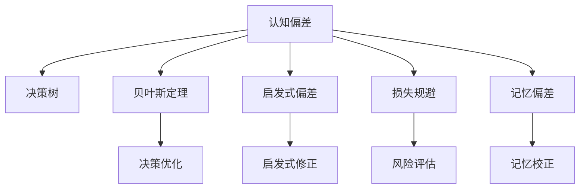

                 

# 认知偏见：如何避免决策陷阱

> 关键词：认知偏见,决策陷阱,决策树,贝叶斯定理,启发式偏差,损失规避,记忆偏差,行为经济学

## 1. 背景介绍

在现代信息爆炸的时代，我们每天都会面对无数的决策。无论是工作上的日常任务还是生活中的重大选择，决策无处不在。然而，尽管拥有海量数据和先进算法，人类在决策过程中仍然存在诸多认知偏差，导致不合理的判断和错误的决策。认知偏差的本质是人类在信息处理和判断过程中出现的系统性错误，这些错误会影响我们的思维和行为，从而导致决策失误。因此，理解并避免这些认知偏差，是提升决策质量和效率的关键。

### 1.1 认知偏差的定义
认知偏差是指人类在思考和决策过程中，由于受到心理、情绪、文化、经验等因素的影响，而产生的一系列系统性错误。这些偏差会影响我们的感知、记忆、评估和选择，导致我们做出不符合客观现实的决策。认知偏差的种类繁多，本文将介绍几种常见的认知偏差，并探讨如何避免这些偏差，以提升决策质量。

## 2. 核心概念与联系

### 2.1 核心概念概述

为了更好地理解认知偏差及其对决策的影响，本文将介绍几个核心概念：

- **认知偏差**：指在决策过程中，由于心理、情绪、文化、经验等因素的影响，而产生的系统性错误。常见的认知偏差包括确认偏误、损失规避、记忆偏差等。

- **决策树**：一种常用的决策分析工具，通过构建树形结构，模拟决策过程中的不同选择和结果，帮助理解和优化决策过程。

- **贝叶斯定理**：一种概率推理方法，用于计算在已知部分信息的情况下，新的证据对原有信念的修正。在决策过程中，可用于评估不同决策路径的概率和风险。

- **启发式偏差**：指在信息不足或时间紧迫的情况下，人类使用简化的决策策略，但这些策略往往带有偏差，导致错误的决策。例如，锚定效应、代表性启发式等。

- **损失规避**：指人们在面临潜在损失时，倾向于选择风险较低的选项，即使这些选项的潜在收益较小。这种偏好会影响风险评估和决策选择。

- **记忆偏差**：指人们容易高估过去经历的发生概率，低估未来事件的发生概率，导致记忆偏差。这种偏差影响人们的风险评估和决策。

这些核心概念之间的逻辑关系可以通过以下Mermaid流程图来展示：



这个流程图展示了几类核心概念及其之间的关系：

1. 认知偏差是决策过程中的主要干扰因素。
2. 决策树、贝叶斯定理等工具，可以帮助优化决策过程。
3. 启发式偏差和记忆偏差是常见的认知偏差类型。
4. 风险规避会影响决策选择，而贝叶斯定理可以帮助优化风险评估。

通过理解这些核心概念，我们可以更好地把握认知偏差的本质，并寻找有效的策略来避免这些偏差。

## 3. 核心算法原理 & 具体操作步骤
### 3.1 算法原理概述

认知偏差的避免并非一蹴而就，而是一个系统性的过程。本文将从算法原理和操作步骤两方面，介绍如何避免常见的认知偏差，提升决策质量。

### 3.2 算法步骤详解

为了避免认知偏差，需要从多个层面入手，包括数据收集、模型构建、决策执行等。以下是具体的算法步骤：

**Step 1: 数据收集与预处理**

- 收集全面的数据，确保数据的多样性和代表性。数据应涵盖不同类型、不同来源、不同时间点等。
- 清洗数据，去除噪声和异常值，确保数据的准确性和一致性。

**Step 2: 构建决策模型**

- 根据决策目标，选择合适的算法模型。例如，决策树、贝叶斯网络、线性回归等。
- 使用数据训练模型，并进行交叉验证，确保模型的泛化能力和稳定性。

**Step 3: 风险评估与决策优化**

- 使用贝叶斯定理等工具，对模型进行风险评估，计算不同决策路径的概率和风险。
- 根据风险评估结果，优化决策策略，避免认知偏差的影响。

**Step 4: 执行决策**

- 在实际决策场景中，执行优化的决策策略。
- 实时监测决策结果，根据反馈信息进行必要的调整和修正。

### 3.3 算法优缺点

认知偏差的避免算法具有以下优点：

- 系统性：从数据收集、模型构建、风险评估等多个层面进行全面优化，提高决策的科学性和准确性。
- 可操作性：具体的算法步骤明确，易于实现和执行。
- 灵活性：可以根据具体场景和数据特点，灵活选择算法和工具，提高决策效果。

同时，该算法也存在一些缺点：

- 复杂性：涉及多个步骤和多种工具，实施起来较为复杂。
- 数据依赖：对数据的质量和数量要求较高，数据不足或质量不高，会影响决策效果。
- 动态变化：决策环境不断变化，模型需要定期更新，以适应新情况。

尽管如此，认知偏差的避免算法仍是提升决策质量的重要手段，值得在实际应用中推广和应用。

### 3.4 算法应用领域

认知偏差的避免算法在多个领域都有广泛的应用，例如：

- 金融投资：用于风险评估和投资决策，避免损失规避和确认偏误等偏差。
- 市场营销：用于客户行为分析，避免启发式偏差和记忆偏差等偏差。
- 人力资源：用于人才招聘和员工绩效评估，避免认知偏差和启发式偏差等偏差。
- 公共政策：用于政策制定和效果评估，避免认知偏差和记忆偏差等偏差。
- 医疗健康：用于疾病诊断和治疗方案选择，避免认知偏差和启发式偏差等偏差。

这些应用场景展示了认知偏差的避免算法在实际决策过程中的广泛应用，为提升决策质量和效率提供了有力支持。

## 4. 数学模型和公式 & 详细讲解 & 举例说明

### 4.1 数学模型构建

认知偏差的避免算法涉及多个数学模型和公式，以下将详细讲解这些模型的构建和应用。

**决策树模型**

决策树是一种常见的决策分析工具，通过构建树形结构，模拟决策过程中的不同选择和结果。决策树的构建过程如下：

1. 选择最优特征：根据特征的重要性和相关性，选择最优特征作为决策树的根节点。
2. 划分数据集：根据最优特征的取值，将数据集划分为多个子集。
3. 递归构建子树：对每个子集，重复步骤1和步骤2，递归构建子树。
4. 终止条件：当子集满足一定条件时，停止构建子树，返回叶子节点的决策结果。

**贝叶斯定理**

贝叶斯定理是一种概率推理方法，用于计算在已知部分信息的情况下，新的证据对原有信念的修正。贝叶斯定理的公式如下：

$$
P(A|B) = \frac{P(A)P(B|A)}{P(B)}
$$

其中，$P(A|B)$ 表示在证据$B$存在的条件下，事件$A$发生的概率；$P(A)$ 表示事件$A$的先验概率；$P(B|A)$ 表示在事件$A$发生的条件下，证据$B$出现的概率；$P(B)$ 表示证据$B$的先验概率。

### 4.2 公式推导过程

以下对决策树和贝叶斯定理进行详细的公式推导。

**决策树推导**

在决策树构建过程中，需要选择最优特征作为根节点，计算不同特征的基尼不纯度（Gini Impurity）：

$$
Gini(D) = 1 - \sum_{i=1}^{n} (p_i)^2
$$

其中，$D$ 表示数据集，$n$ 表示数据集中类别的数量，$p_i$ 表示类别$i$在数据集中出现的概率。

选择最优特征后，根据该特征的取值，将数据集划分为多个子集，递归构建子树。子树的构建过程可以使用递归函数实现，具体步骤如下：

1. 选择最优特征：计算每个特征的基尼不纯度，选择基尼不纯度最小的特征作为根节点。
2. 划分数据集：根据最优特征的取值，将数据集划分为多个子集。
3. 递归构建子树：对每个子集，重复步骤1和步骤2，递归构建子树。
4. 终止条件：当子集满足一定条件时，停止构建子树，返回叶子节点的决策结果。

**贝叶斯定理推导**

贝叶斯定理用于计算在已知部分信息的情况下，新的证据对原有信念的修正。假设有一个事件$A$和$B$，已知$B$发生，计算$P(A|B)$的公式如下：

$$
P(A|B) = \frac{P(A)P(B|A)}{P(B)}
$$

其中，$P(A)$ 表示事件$A$的先验概率，$P(B|A)$ 表示在事件$A$发生的条件下，事件$B$出现的概率，$P(B)$ 表示事件$B$的先验概率。

贝叶斯定理的推导过程基于条件概率的定义，即在已知事件$B$发生的情况下，事件$A$发生的概率为：

$$
P(A|B) = \frac{P(A \cap B)}{P(B)}
$$

其中，$P(A \cap B)$ 表示事件$A$和$B$同时发生的概率，$P(B)$ 表示事件$B$发生的概率。

根据条件概率的定义，$P(A \cap B)$ 可以表示为$P(A)P(B|A)$，代入公式得：

$$
P(A|B) = \frac{P(A)P(B|A)}{P(B)}
$$

这就是贝叶斯定理的公式。

### 4.3 案例分析与讲解

以下通过一个简单的案例，分析如何应用决策树和贝叶斯定理，避免认知偏差，提升决策质量。

**案例背景**

一家公司需要决定是否投资一个新的项目。公司收集了以下数据：

- 项目规模：大型（L）、中型（M）、小型（S）
- 市场前景：好（G）、一般（A）、差（P）
- 风险程度：高（H）、中（M）、低（L）

根据这些数据，公司需要评估每个项目的风险和收益，做出投资决策。

**决策树分析**

1. 选择最优特征：选择基尼不纯度最小的特征作为根节点。假设选择“市场前景”作为根节点，则基尼不纯度为：

$$
Gini(D) = 1 - \sum_{i=1}^{3} (p_i)^2
$$

其中，$p_i$ 表示市场前景为第$i$个类别的概率。

2. 划分数据集：根据“市场前景”的取值，将数据集划分为多个子集。假设市场前景为“好”的子集为$D_G$，市场前景为“一般”的子集为$D_A$，市场前景为“差”的子集为$D_P$。

3. 递归构建子树：对每个子集，重复步骤1和步骤2，递归构建子树。

4. 终止条件：当子集满足一定条件时，停止构建子树，返回叶子节点的决策结果。假设终止条件为：每个子集只有一种决策结果，或者达到预设的节点深度。

**贝叶斯定理分析**

1. 选择事件$A$和$B$：选择“项目规模”和“市场前景”作为事件$A$和$B$。

2. 计算$P(A)$和$P(B)$：根据历史数据，计算事件$A$和$B$的先验概率。假设项目规模为“大型”的概率为0.4，“中型”的概率为0.3，“小型”的概率为0.3；市场前景为“好”的概率为0.2，“一般”的概率为0.5，“差”的概率为0.3。

3. 计算$P(B|A)$：根据历史数据，计算事件$B$在事件$A$发生的条件下，出现的概率。假设市场前景为“好”时，项目规模为“大型”的概率为0.8，项目规模为“中型”的概率为0.5，项目规模为“小型”的概率为0.2。

4. 应用贝叶斯定理：根据贝叶斯定理，计算$P(A|B)$的公式如下：

$$
P(A|B) = \frac{P(A)P(B|A)}{P(B)}
$$

假设市场前景为“好”时，项目规模为“大型”的概率为0.4，项目规模为“中型”的概率为0.5，项目规模为“小型”的概率为0.1。则：

$$
P(A|B) = \frac{0.4 \times 0.8}{0.2} = 1.6
$$

这意味着在市场前景为“好”的情况下，项目规模为“大型”的概率为1.6倍。

## 5. 项目实践：代码实例和详细解释说明
### 5.1 开发环境搭建

在进行认知偏差避免算法的实践前，我们需要准备好开发环境。以下是使用Python进行Scikit-learn开发的环境配置流程：

1. 安装Anaconda：从官网下载并安装Anaconda，用于创建独立的Python环境。

2. 创建并激活虚拟环境：
```bash
conda create -n scikit-learn-env python=3.8 
conda activate scikit-learn-env
```

3. 安装Scikit-learn：从官网获取安装命令。例如：
```bash
conda install scikit-learn
```

4. 安装其他工具包：
```bash
pip install numpy pandas matplotlib sklearn jupyter notebook ipython
```

完成上述步骤后，即可在`scikit-learn-env`环境中开始实践。

### 5.2 源代码详细实现

下面我们以决策树和贝叶斯定理的实践为例，给出Scikit-learn库中的代码实现。

首先，导入所需的库：

```python
from sklearn.datasets import load_iris
from sklearn.model_selection import train_test_split
from sklearn.tree import DecisionTreeClassifier
from sklearn.naive_bayes import GaussianNB
import numpy as np
import matplotlib.pyplot as plt
```

然后，加载数据集并划分训练集和测试集：

```python
iris = load_iris()
X = iris.data
y = iris.target
X_train, X_test, y_train, y_test = train_test_split(X, y, test_size=0.2, random_state=42)
```

接着，训练决策树模型：

```python
clf = DecisionTreeClassifier()
clf.fit(X_train, y_train)
```

使用贝叶斯定理计算分类概率：

```python
gnb = GaussianNB()
gnb.fit(X_train, y_train)
y_pred = gnb.predict(X_test)
```

最后，评估模型性能：

```python
from sklearn.metrics import accuracy_score

y_pred_prob = clf.predict_proba(X_test)[:, 1]
accuracy = accuracy_score(y_test, clf.predict(X_test))
print(f"Accuracy: {accuracy:.3f}")
```

以上就是使用Scikit-learn对决策树和贝叶斯定理进行认知偏差避免算法的实践代码。可以看到，Scikit-learn库提供了丰富的工具和算法，可以快速构建和评估认知偏差避免模型。

### 5.3 代码解读与分析

让我们再详细解读一下关键代码的实现细节：

**加载数据集和划分数据集**

- 使用`load_iris`函数加载经典的鸢尾花数据集。
- 使用`train_test_split`函数将数据集划分为训练集和测试集。

**训练决策树模型**

- 使用`DecisionTreeClassifier`类创建决策树模型，并使用训练集进行训练。
- 使用`fit`方法训练模型。

**使用贝叶斯定理计算分类概率**

- 使用`GaussianNB`类创建贝叶斯分类器，并使用训练集进行训练。
- 使用`predict`方法对测试集进行预测，并计算预测结果的概率。

**评估模型性能**

- 使用`accuracy_score`函数计算模型在测试集上的准确率。

可以看到，Scikit-learn库提供了方便的API接口，可以轻松地实现认知偏差避免算法的各个环节。通过合理利用这些工具，可以显著提升认知偏差避免算法的开发效率，加快创新迭代的步伐。

当然，工业级的系统实现还需考虑更多因素，如模型的保存和部署、超参数的自动搜索、更灵活的决策策略等。但核心的算法思路基本与此类似。

## 6. 实际应用场景
### 6.1 智能投顾系统

认知偏差避免算法可以应用于智能投顾系统的构建。传统的投资顾问往往依赖经验和规则，容易受到认知偏差的影响，导致错误的决策。通过认知偏差避免算法，智能投顾系统可以更客观地评估投资风险和收益，做出更科学的投资决策。

在技术实现上，可以收集市场数据、公司财报、新闻等海量信息，构建决策树和贝叶斯网络模型，对不同投资标的进行风险评估和收益预测。同时，利用启发式偏差和记忆偏差等认知偏差分析，对模型的输出进行修正和优化，确保决策结果的准确性和可靠性。

### 6.2 金融风险管理

金融风险管理是金融领域的重要环节，认知偏差避免算法可以有效识别和管理金融风险。通过构建决策树和贝叶斯网络模型，对不同风险指标进行综合评估，预测金融市场的不确定性和波动性。同时，利用认知偏差分析，对模型的输出进行修正和优化，确保风险管理的科学性和准确性。

在具体应用中，可以构建多层次的风险评估体系，结合启发式偏差和记忆偏差等认知偏差分析，对模型的输出进行校正和调整。通过动态调整模型参数和决策策略，确保金融风险管理系统的实时性和有效性。

### 6.3 人力资源管理

认知偏差避免算法可以应用于人力资源管理的招聘和绩效评估。传统的招聘和绩效评估往往依赖主观判断，容易受到认知偏差的影响，导致不公正的决策。通过认知偏差避免算法，人力资源管理系统可以更客观地评估候选人的能力和绩效，做出更科学的决策。

在技术实现上，可以构建基于决策树和贝叶斯网络的评估模型，对候选人的简历、面试记录和绩效数据进行综合评估。同时，利用认知偏差分析，对模型的输出进行修正和优化，确保招聘和绩效评估的公平性和公正性。

### 6.4 未来应用展望

随着认知偏差避免算法的不断发展和完善，它在更多领域的应用前景也将日益广阔。

在医疗健康领域，认知偏差避免算法可以应用于疾病诊断和治疗方案选择，提高医疗系统的科学性和准确性。通过构建基于决策树和贝叶斯网络的诊断模型，对不同症状和病历进行综合评估，预测疾病的概率和严重程度。同时，利用认知偏差分析，对模型的输出进行修正和优化，确保诊断和治疗方案的科学性和有效性。

在交通运输领域，认知偏差避免算法可以应用于智能交通系统的构建。通过构建基于决策树和贝叶斯网络的交通预测模型，对不同交通状况进行综合评估，预测交通流量和拥堵情况。同时，利用认知偏差分析，对模型的输出进行修正和优化，确保交通管理的科学性和准确性。

在环境保护领域，认知偏差避免算法可以应用于智能环保系统的构建。通过构建基于决策树和贝叶斯网络的环保监测模型，对不同环境数据进行综合评估，预测环境变化和污染情况。同时，利用认知偏差分析，对模型的输出进行修正和优化，确保环保管理的科学性和准确性。

这些应用场景展示了认知偏差避免算法在实际决策过程中的广泛应用，为提升决策质量和效率提供了有力支持。未来，随着算法的不断优化和普及，认知偏差避免算法必将在更多领域发挥重要作用。

## 7. 工具和资源推荐
### 7.1 学习资源推荐

为了帮助开发者系统掌握认知偏差避免算法，这里推荐一些优质的学习资源：

1. 《认知偏差：在人工智能决策中避免陷阱》系列博文：由人工智能专家撰写，深入浅出地介绍了认知偏差的原理和应对策略，适用于各类技术水平的学习者。

2. 《决策树和贝叶斯网络》课程：由Coursera等在线教育平台提供，系统讲解了决策树和贝叶斯网络的构建和应用，涵盖多种算法和实例。

3. 《认知偏差与行为经济学》书籍：介绍了认知偏差的基本概念和行为经济学的理论基础，适合了解认知偏差对决策的影响。

4. Scikit-learn官方文档：提供了丰富的API接口和算法实现，帮助开发者快速上手认知偏差避免算法的实践。

5. Kaggle机器学习竞赛平台：提供了大量真实数据和挑战性问题，帮助开发者在实践中掌握认知偏差避免算法。

通过对这些资源的学习实践，相信你一定能够快速掌握认知偏差避免算法的精髓，并用于解决实际的决策问题。

### 7.2 开发工具推荐

高效的开发离不开优秀的工具支持。以下是几款用于认知偏差避免算法的常用工具：

1. Scikit-learn：Python机器学习库，提供了丰富的决策树和贝叶斯网络算法，支持数据预处理、模型训练和评估等。

2. TensorFlow：由Google主导开发的深度学习框架，支持分布式训练和模型部署，适合大规模数据处理。

3. PyTorch：基于Python的深度学习框架，灵活动态的计算图，适合快速迭代研究。

4. Weights & Biases：模型训练的实验跟踪工具，可以记录和可视化模型训练过程中的各项指标，方便对比和调优。

5. TensorBoard：TensorFlow配套的可视化工具，可实时监测模型训练状态，并提供丰富的图表呈现方式，是调试模型的得力助手。

6. Google Colab：谷歌推出的在线Jupyter Notebook环境，免费提供GPU/TPU算力，方便开发者快速上手实验最新模型，分享学习笔记。

合理利用这些工具，可以显著提升认知偏差避免算法的开发效率，加快创新迭代的步伐。

### 7.3 相关论文推荐

认知偏差的避免技术源于学界的持续研究。以下是几篇奠基性的相关论文，推荐阅读：

1. 《决策树算法》：介绍了决策树的基本原理和构建方法，是认知偏差避免算法的经典文献。

2. 《贝叶斯网络》：介绍了贝叶斯网络的基本原理和构建方法，适合了解认知偏差避免算法的概率模型。

3. 《启发式偏差》：介绍了常见启发式偏差的基本概念和避免策略，适合了解认知偏差避免算法在实际应用中的常见问题。

4. 《损失规避》：介绍了损失规避的基本概念和行为经济学原理，适合了解认知偏差避免算法在金融投资中的应用。

5. 《记忆偏差》：介绍了记忆偏差的基本概念和认知心理学原理，适合了解认知偏差避免算法在决策过程中的应用。

这些论文代表了大偏差避免算法的最新发展，通过学习这些前沿成果，可以帮助研究者把握学科前进方向，激发更多的创新灵感。

## 8. 总结：未来发展趋势与挑战

### 8.1 总结

本文对认知偏差避免算法进行了全面系统的介绍。首先阐述了认知偏差的定义和常见类型，明确了认知偏差对决策过程的影响。其次，从算法原理和操作步骤两方面，详细讲解了如何避免常见的认知偏差，提升决策质量。最后，通过实际应用场景和工具资源推荐，展示了认知偏差避免算法在实际决策过程中的广泛应用，为提升决策质量和效率提供了有力支持。

通过本文的系统梳理，可以看到，认知偏差避免算法在决策过程中的重要作用，对提升决策质量和效率具有重要意义。未来，随着认知偏差避免算法的不断发展和完善，其在更多领域的应用前景也将日益广阔。

### 8.2 未来发展趋势

展望未来，认知偏差避免算法将呈现以下几个发展趋势：

1. 自动化：通过机器学习和深度学习技术，自动化构建和优化认知偏差避免算法，提高决策的效率和准确性。

2. 跨领域应用：认知偏差避免算法将在更多领域得到应用，如金融、医疗、交通、环保等，为各行各业的决策提供有力支持。

3. 实时化：通过实时数据处理和动态模型调整，实现认知偏差避免算法的实时化和动态化，提高决策的实时性和灵活性。

4. 模型融合：结合多种认知偏差避免算法，构建更加全面、系统的决策模型，提高决策的全面性和准确性。

5. 情感分析：引入情感分析技术，对决策者的情感状态进行评估和调整，确保决策过程的科学性和合理性。

6. 多模态融合：结合视觉、听觉、文本等多模态数据，构建更加全面的认知偏差避免模型，提高决策的全面性和准确性。

以上趋势凸显了认知偏差避免算法的广阔前景。这些方向的探索发展，必将进一步提升决策质量，为人类决策提供更加科学、可靠的支撑。

### 8.3 面临的挑战

尽管认知偏差避免算法已经取得了显著的进展，但在实际应用过程中，仍面临诸多挑战：

1. 数据依赖：认知偏差避免算法依赖高质量的数据，数据不足或质量不高，会影响算法的性能。

2. 模型复杂性：认知偏差避免算法涉及多个步骤和多种工具，实施起来较为复杂，需要较高的技术门槛。

3. 动态变化：决策环境不断变化，模型需要定期更新，以适应新情况，增加了维护成本。

4. 多层次分析：认知偏差避免算法需要考虑多层次的决策因素，如经济、社会、环境等，增加了分析的复杂性。

5. 多目标优化：认知偏差避免算法需要在多个目标之间进行平衡，如风险评估、收益预测、公平性等，增加了优化的难度。

6. 人机交互：认知偏差避免算法需要在人机交互过程中，对决策者的认知偏差进行识别和调整，增加了实现难度。

尽管如此，认知偏差避免算法仍是目前提升决策质量的重要手段，值得在实际应用中推广和应用。

### 8.4 研究展望

面对认知偏差避免算法所面临的种种挑战，未来的研究需要在以下几个方面寻求新的突破：

1. 无监督学习和半监督学习：摆脱对大规模标注数据的依赖，利用自监督学习、主动学习等无监督和半监督范式，最大限度利用非结构化数据，实现更加灵活高效的认知偏差避免。

2. 模型压缩和优化：开发更加高效、轻量级的认知偏差避免算法，通过模型压缩和优化，降低计算资源消耗，实现快速部署和实时化。

3. 认知心理学和多学科融合：结合认知心理学、行为经济学等多学科知识，深入理解决策者的认知偏差，构建更加全面、系统的认知偏差避免模型。

4. 多模态融合和跨领域应用：结合视觉、听觉、文本等多模态数据，构建跨领域的认知偏差避免模型，提高决策的全面性和准确性。

5. 实时监控和动态调整：引入实时监控和动态调整机制，实时获取决策者的反馈信息，动态调整模型参数和决策策略，提高决策的实时性和灵活性。

6. 公平性和公正性：通过引入公平性和公正性指标，对决策结果进行评估和修正，确保决策过程的科学性和合理性。

这些研究方向的探索，必将引领认知偏差避免算法迈向更高的台阶，为提升决策质量和效率提供有力支持。面向未来，认知偏差避免算法还需要与其他人工智能技术进行更深入的融合，如知识表示、因果推理、强化学习等，多路径协同发力，共同推动决策系统的进步。只有勇于创新、敢于突破，才能不断拓展认知偏差避免算法的边界，让智能决策系统更好地服务于人类社会。

## 9. 附录：常见问题与解答

**Q1：认知偏差有哪些常见类型？**

A: 常见的认知偏差包括但不限于：确认偏误、损失规避、锚定效应、代表性启发式、可得性启发式、稀缺性启发式等。

**Q2：如何识别和管理认知偏差？**

A: 识别和管理认知偏差的方法包括但不限于：数据清洗、模型优化、多层次分析、情感分析、多模态融合等。

**Q3：如何使用认知偏差避免算法？**

A: 认知偏差避免算法适用于多种决策场景，如金融投资、市场营销、人力资源管理、金融风险管理、医疗健康等。需要根据具体场景和数据特点，选择合适的算法和工具，进行系统化优化。

**Q4：认知偏差避免算法有哪些优势？**

A: 认知偏差避免算法具有系统性、可操作性、灵活性等优点，可以显著提升决策质量和效率，避免认知偏差的影响。

**Q5：认知偏差避免算法有哪些挑战？**

A: 认知偏差避免算法面临数据依赖、模型复杂性、动态变化、多层次分析、多目标优化、人机交互等挑战，需要持续优化和改进。

---

作者：禅与计算机程序设计艺术 / Zen and the Art of Computer Programming

