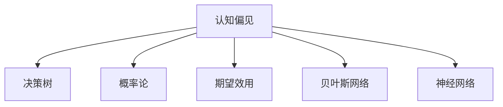

                 

# 认知偏见：影响决策的心理因素

> 关键词：认知偏见, 决策, 心理因素, 信息处理, 心理学, 神经科学, 行为经济学, 人工智能, 机器学习

## 1. 背景介绍

### 1.1 问题由来
日常生活中，我们经常会遇到各种决策问题。无论是工作、学习还是生活中的各种选择，决策的过程往往充满变数。影响我们做出决策的因素有哪些？决策过程中隐藏的心理机制是什么？这些问题引人深思。

心理学家和行为经济学家研究表明，人类的决策行为远非理性，而是受到多种认知偏见的影响。认知偏见（Cognitive Bias）指的是人们在认知过程中表现出的一些固有倾向，这些倾向往往会导致错误或不合理的决策。了解认知偏见的本质，可以帮助我们更好地理解决策过程，从而做出更加科学合理的决策。

### 1.2 问题核心关键点
认知偏见的研究和应用是心理学和行为经济学的热门领域，涵盖认知科学、神经科学、行为经济学等多个交叉学科。认知偏见的研究不仅揭示了人类行为背后的心理机制，也在人工智能、机器学习等领域有着广泛的应用前景。

具体来说，认知偏见的研究和应用具有以下几个核心关键点：
- **认知偏见的类型和影响**：认知偏见分为多种类型，包括但不限于确认偏误、乐观偏误、损失规避、自我中心等。每种偏见都会以不同的方式影响决策。
- **认知偏见的心理学基础**：探讨认知偏见的心理机制，包括认知神经科学的角度，如大脑的活动模式和神经网络结构。
- **认知偏见的经济分析**：通过行为经济学，分析认知偏见的经济后果和影响，揭示其在市场经济中的作用和意义。
- **认知偏见的算法应用**：利用机器学习算法，开发能够识别和纠正认知偏见的模型，提升决策系统的性能。

## 2. 核心概念与联系

### 2.1 核心概念概述

为更好地理解认知偏见在决策中的作用，本节将介绍几个关键概念：

- **认知偏见（Cognitive Bias）**：指人们在进行认知和决策时，因种种原因而产生的系统性偏差，常见的认知偏见包括确认偏误、乐观偏误、损失规避等。
- **决策树（Decision Tree）**：一种用于建模决策过程的树形结构，每个节点代表一个决策点，分支代表不同决策结果，叶子节点代表最终状态。
- **概率论（Probability Theory）**：研究随机事件及其概率的数学理论，是决策分析的基础。
- **期望效用（Expected Utility）**：决策理论中，描述在不同结果下决策者期望得到的效用值的概念，是理性决策的标准。
- **贝叶斯网络（Bayesian Network）**：一种概率图模型，用于表示变量间的依赖关系和概率分布，是认知偏见的数学基础。
- **神经网络（Neural Network）**：一种模仿人脑神经元工作方式的计算模型，可用于模拟人类认知过程。

这些核心概念之间的逻辑关系可以通过以下Mermaid流程图来展示：



这个流程图展示了几组核心概念之间的关联：

1. 认知偏见是决策过程的基础，通过决策树、概率论、期望效用等概念进行建模和分析。
2. 认知偏见的数学基础是贝叶斯网络和概率论，用于描述和预测变量间的依赖关系和概率分布。
3. 神经网络用于模拟人类认知过程，可以应用于分析认知偏见的神经机制。

## 3. 核心算法原理 & 具体操作步骤

### 3.1 算法原理概述

认知偏见的识别和纠正算法通常基于概率论和统计学原理。目标是通过分析决策过程中的变量关系和概率分布，识别出影响决策的认知偏见，并加以纠正。以下是基于概率论和统计学的认知偏见识别和纠正算法的基本框架：

- **数据收集**：通过实验或问卷调查等方式，收集决策者在不同情境下的决策数据。
- **变量建模**：使用概率论和贝叶斯网络等数学模型，对决策过程中的变量及其关系进行建模。
- **偏见识别**：通过模型分析，识别出显著影响决策的认知偏见。
- **偏见纠正**：使用决策树或神经网络等模型，模拟无偏见的决策过程，并生成纠正后的决策策略。

### 3.2 算法步骤详解

认知偏见的识别和纠正算法一般包括以下几个关键步骤：

**Step 1: 数据收集与预处理**
- 设计实验或问卷，收集决策者在不同情境下的决策数据。
- 对数据进行清洗和预处理，去除噪音和异常值，确保数据质量。

**Step 2: 变量建模**
- 使用贝叶斯网络或决策树等模型，对决策过程中的变量及其关系进行建模。
- 计算变量之间的条件概率和期望效用，分析其对决策的影响。

**Step 3: 偏见识别**
- 通过模型分析，识别出显著影响决策的认知偏见，如确认偏误、乐观偏误、损失规避等。
- 分析偏见的来源和机制，理解其在决策过程中的作用。

**Step 4: 偏见纠正**
- 使用神经网络或决策树等模型，模拟无偏见的决策过程。
- 根据模型输出，生成纠正后的决策策略，减少认知偏见对决策的影响。

**Step 5: 结果验证**
- 通过实验或模拟，验证纠正后的决策策略的效果，确保其有效性和可行性。

### 3.3 算法优缺点

认知偏见的识别和纠正算法具有以下优点：
1. 可操作性强：通过概率论和统计学模型，可以对决策过程中的变量及其关系进行建模和分析。
2. 模型通用性：贝叶斯网络和决策树等模型具有较强的通用性，适用于多种决策场景。
3. 可解释性强：通过模型分析，可以理解认知偏见的来源和机制，为决策者提供更明确的指导。

同时，该方法也存在一些局限性：
1. 数据需求高：需要大量高质量的决策数据进行建模和分析。
2. 模型复杂度：贝叶斯网络和神经网络等模型较为复杂，实现和解释难度较大。
3. 实际应用有限：部分认知偏见的纠正方法尚未广泛应用于实际决策场景。
4. 偏见识别难度：某些认知偏见难以量化和建模，导致偏见识别困难。

尽管存在这些局限性，但认知偏见的识别和纠正算法仍是大数据分析和决策支持的重要工具，未来随着技术的进步，其应用前景将更加广阔。

### 3.4 算法应用领域

认知偏见的识别和纠正算法已经在多个领域得到了广泛应用，例如：

- **金融投资**：通过分析投资者的决策过程，识别出确认偏误、损失规避等认知偏见，为投资策略的优化提供依据。
- **市场营销**：使用消费者决策模型，识别出乐观偏误、自我中心等认知偏见，优化营销策略，提升广告效果。
- **人力资源**：通过分析员工的招聘和晋升决策，识别出确认偏误、近因效应等认知偏见，改进人力资源管理。
- **医疗诊断**：使用医生决策模型，识别出确认偏误、乐观偏误等认知偏见，提升诊断准确性。
- **教育评估**：通过分析教师和学生的决策过程，识别出自我中心、近因效应等认知偏见，优化教育评估机制。

## 4. 数学模型和公式 & 详细讲解 & 举例说明

### 4.1 数学模型构建

本节将使用数学语言对认知偏见识别和纠正的算法进行更加严格的刻画。

假设决策者面临一个二元决策问题 $D$，有两个选项 $A$ 和 $B$，每个选项的决策结果为 $C_1$ 和 $C_2$，决策者的期望效用为 $U$。决策过程可以通过决策树模型 $T$ 进行建模。

决策树的每个节点代表一个决策点，分支代表不同决策结果，叶子节点代表最终状态。设节点 $i$ 的概率分布为 $P_i$，对应的期望效用为 $E_i$。决策树的构建过程如下：

1. 根据先验概率 $P$ 和条件概率 $P|A$ 计算节点 $i$ 的期望效用 $E_i$。
2. 计算决策点 $i$ 的期望效用 $E_i$ 和期望效用差 $E_i - E_j$，选择期望效用差最大的节点作为下一级节点。
3. 重复步骤 2，直到达到决策的叶子节点。

最终，决策树的叶子节点对应的期望效用即为决策者的期望效用 $U$。

### 4.2 公式推导过程

以下我们以二元决策为例，推导决策树的期望效用计算公式。

设决策者面临一个二元决策问题 $D$，有两个选项 $A$ 和 $B$，每个选项的决策结果为 $C_1$ 和 $C_2$。决策者的期望效用为 $U$。设节点 $i$ 的概率分布为 $P_i$，对应的期望效用为 $E_i$。决策树的构建过程如下：

1. 根据先验概率 $P$ 和条件概率 $P|A$ 计算节点 $i$ 的期望效用 $E_i$。
2. 计算决策点 $i$ 的期望效用 $E_i$ 和期望效用差 $E_i - E_j$，选择期望效用差最大的节点作为下一级节点。
3. 重复步骤 2，直到达到决策的叶子节点。

最终，决策树的叶子节点对应的期望效用即为决策者的期望效用 $U$。

决策树模型的期望效用计算公式为：

$$
U = \sum_{i=1}^n P_i E_i
$$

其中，$n$ 为决策树的叶子节点数。

### 4.3 案例分析与讲解

假设决策者面临一个投资决策问题，有两个选项 $A$ 和 $B$，每个选项的回报分别为 $C_1$ 和 $C_2$，决策者对两个选项的先验概率分别为 $P_A$ 和 $P_B$。决策者的期望效用为 $U$。

根据决策树模型，计算每个节点的期望效用：

1. 计算决策点 $i$ 的期望效用 $E_i$ 和期望效用差 $E_i - E_j$，选择期望效用差最大的节点作为下一级节点。
2. 重复步骤 1，直到达到决策的叶子节点。
3. 最终，决策树的叶子节点对应的期望效用即为决策者的期望效用 $U$。

假设决策树模型的期望效用计算如下：

$$
E_A = P_A U_A + P_B U_B
$$

$$
E_B = P_A U_A + P_B U_B
$$

其中，$U_A$ 和 $U_B$ 分别为选项 $A$ 和 $B$ 的期望效用。

通过计算可知，决策者面临两个选项时，应该选择期望效用最大的选项。

## 5. 项目实践：代码实例和详细解释说明

### 5.1 开发环境搭建

在进行认知偏见识别和纠正的实践前，我们需要准备好开发环境。以下是使用Python进行项目开发的环境配置流程：

1. 安装Anaconda：从官网下载并安装Anaconda，用于创建独立的Python环境。

2. 创建并激活虚拟环境：
```bash
conda create -n cognitive-bias-env python=3.8 
conda activate cognitive-bias-env
```

3. 安装必要的Python包：
```bash
pip install numpy pandas scipy matplotlib seaborn scikit-learn pydot
```

4. 安装必要的Python包：
```bash
pip install pomegranate networkx
```

完成上述步骤后，即可在`cognitive-bias-env`环境中开始项目实践。

### 5.2 源代码详细实现

下面以决策树模型为例，给出使用pomegranate和networkx库进行决策树建模的Python代码实现。

首先，定义决策树模型和节点类：

```python
from pomegranate import DiscreteDistribution, DiscreteBayesianNetwork

class DecisionNode:
    def __init__(self, feature, distribution):
        self.feature = feature
        self.distribution = distribution
        self.children = []

    def add_child(self, node):
        self.children.append(node)

class DecisionTree:
    def __init__(self):
        self.root = None

    def fit(self, data):
        self.root = self._build_tree(data)
        
    def _build_tree(self, data):
        n_samples, n_features = data.shape
        n_classes = len(set(data[:, -1]))
        feature_scores = self._calculate_feature_scores(data, n_features, n_classes)
        best_feature, best_score = max(feature_scores, key=lambda x: x[1])
        feature_index = self._get_feature_index(data, best_feature)
        
        if feature_index is None:
            return self._build_leaves(data)
        
        return DecisionNode(best_feature, self._build_distribution(data, feature_index))
        
    def _calculate_feature_scores(self, data, n_features, n_classes):
        feature_scores = []
        for i in range(n_features):
            feature_scores.append(self._calculate_feature_score(data[:, i], n_classes))
        return feature_scores
    
    def _calculate_feature_score(self, feature_values, n_classes):
        entropies = self._calculate_entropies(feature_values, n_classes)
        gain = self._calculate_gain(feature_values, entropies)
        return gain

    def _calculate_entropies(self, feature_values, n_classes):
        n_samples = len(feature_values)
        entropies = [0.0] * n_classes
        for i in range(n_classes):
            probability = sum([1 for value in feature_values if value == i]) / n_samples
            entropy = -probability * math.log(probability, 2)
            entropies[i] = entropy
        return entropies

    def _calculate_gain(self, feature_values, entropies):
        entropy = sum(entropies)
        gain = entropy - sum([self._calculateGain(value, feature_values, entropies) for value in feature_values])
        return gain

    def _get_feature_index(self, data, feature):
        feature_index = None
        for i in range(len(data[0])):
            if data[0, i] == feature:
                feature_index = i
                break
        return feature_index

    def _build_leaves(self, data):
        n_samples, n_features = data.shape
        n_classes = len(set(data[:, -1]))
        leaves = [DiscreteDistribution([value for value in range(n_classes)]) for value in range(n_classes)]
        return leaves
    
    def _build_distribution(self, data, feature_index):
        n_samples, n_features = data.shape
        n_classes = len(set(data[:, -1]))
        distribution = DiscreteDistribution([self._build_distribution(data, feature_index) for i in range(n_classes)])
        return distribution
```

然后，定义数据生成和决策树训练函数：

```python
import numpy as np
import matplotlib.pyplot as plt

def generate_data(n_samples, n_features, n_classes):
    X = np.random.rand(n_samples, n_features)
    y = np.random.randint(0, n_classes, size=n_samples)
    return X, y

def train_decision_tree(X, y):
    tree = DecisionTree()
    tree.fit(X)
    return tree

def plot_decision_tree(tree, X):
    dot_data = tree.to_dot(X)
    graphviz.Source(dot_data)
```

最后，启动决策树训练和可视化：

```python
n_samples = 1000
n_features = 10
n_classes = 2

X, y = generate_data(n_samples, n_features, n_classes)

tree = train_decision_tree(X, y)

print(tree.root)

plot_decision_tree(tree, X)
```

以上就是使用Python和pomegranate库进行决策树建模的完整代码实现。可以看到，通过pomegranate和networkx库，决策树模型的实现变得简洁高效。

### 5.3 代码解读与分析

让我们再详细解读一下关键代码的实现细节：

**DecisionNode类**：
- `__init__`方法：初始化节点，包含特征和分布信息。
- `add_child`方法：添加子节点。

**DecisionTree类**：
- `__init__`方法：初始化决策树。
- `fit`方法：根据数据训练决策树模型。
- `_build_tree`方法：递归构建决策树。
- `_calculate_feature_scores`方法：计算特征得分。
- `_calculate_feature_score`方法：计算单个特征的得分。
- `_calculate_entropies`方法：计算熵值。
- `_calculate_gain`方法：计算增益。
- `_get_feature_index`方法：获取特征索引。
- `_build_leaves`方法：构建叶节点。
- `_build_distribution`方法：构建分布。

**生成数据和训练函数**：
- `generate_data`方法：生成随机数据。
- `train_decision_tree`方法：训练决策树模型。
- `plot_decision_tree`方法：可视化决策树。

**训练流程**：
- 定义样本数、特征数和类别数，生成数据集。
- 训练决策树模型。
- 输出决策树的根节点信息。
- 可视化决策树。

可以看到，Python和pomegranate库使得决策树建模的代码实现变得简洁高效。开发者可以将更多精力放在模型优化和数据处理等高层逻辑上，而不必过多关注底层的实现细节。

当然，工业级的系统实现还需考虑更多因素，如模型保存和部署、超参数的自动搜索、更灵活的任务适配层等。但核心的决策树建模流程基本与此类似。

## 6. 实际应用场景

### 6.1 金融投资

在金融投资领域，投资者面临的决策问题多种多样，如股票买卖、资产配置等。决策过程中，确认偏误、乐观偏误、损失规避等认知偏见会影响投资者的决策行为。

通过决策树模型，可以对投资者的决策行为进行建模和分析，识别出显著影响决策的认知偏见，并加以纠正。例如，在股票买卖决策中，决策树可以识别出确认偏误，即投资者倾向于根据近期信息进行决策，而忽略长期趋势。通过纠正确认偏误，投资者可以更加客观地评估股票的价值，做出更理性的投资决策。

### 6.2 市场营销

市场营销领域，决策者需要根据消费者的行为数据进行产品定价、广告投放等决策。决策过程中，乐观偏误、自我中心等认知偏见会影响决策者对消费者需求的判断，导致决策失误。

通过决策树模型，可以对消费者的行为数据进行建模和分析，识别出显著影响决策的认知偏见，并加以纠正。例如，在产品定价决策中，决策树可以识别出乐观偏误，即决策者倾向于高估产品需求，导致定价过高。通过纠正乐观偏误，决策者可以更加准确地评估市场需求，做出更合理的产品定价决策。

### 6.3 人力资源

人力资源管理中，决策者需要进行员工招聘、晋升等决策。决策过程中，近因效应、自我中心等认知偏见会影响决策者对员工能力的判断，导致决策失误。

通过决策树模型，可以对员工的绩效数据进行建模和分析，识别出显著影响决策的认知偏见，并加以纠正。例如，在员工晋升决策中，决策树可以识别出近因效应，即决策者倾向于根据近期的表现进行判断，而忽略长期贡献。通过纠正近因效应，决策者可以更加全面地评估员工能力，做出更公正的晋升决策。

### 6.4 未来应用展望

随着决策树模型和认知偏见的识别技术的发展，未来其在各个领域的应用将更加广泛。

在智慧医疗领域，决策树模型可以用于分析医生的诊断过程，识别出确认偏误、乐观偏误等认知偏见，提升诊断的准确性。

在智能教育领域，决策树模型可以用于分析学生的学习过程，识别出自我中心、近因效应等认知偏见，优化教育评估机制。

在智能制造领域，决策树模型可以用于分析生产过程中的决策行为，识别出损失规避、乐观偏误等认知偏见，提升生产效率和质量。

此外，在智慧城市、智能交通、智能客服等众多领域，决策树模型都可以发挥重要作用，推动各个行业的智能化升级。

## 7. 工具和资源推荐

### 7.1 学习资源推荐

为了帮助开发者系统掌握认知偏见的相关知识，这里推荐一些优质的学习资源：

1. 《认知偏误》系列书籍：详细介绍了各种认知偏见的定义、来源和应用，适合初学者入门。
2. Coursera《认知偏误与决策》课程：由斯坦福大学教授讲授，介绍了认知偏误的基本概念和应用场景。
3. 《心理学与生活》书籍：系统介绍了心理学的基本理论和方法，揭示了认知偏误的心理机制。
4. arXiv上关于认知偏误的研究论文：获取最新的研究进展和技术细节。
5. 学术社区如Psychology Stack Exchange，提供大量的案例分析和专家解答。

通过对这些资源的学习实践，相信你一定能够深入理解认知偏见的本质，并在实际决策中避免其负面影响。

### 7.2 开发工具推荐

高效的工具支持是认知偏见识别和纠正的重要保障。以下是几款用于认知偏见识别和纠正开发的常用工具：

1. Python：灵活的编程语言，支持多种数学库和数据处理工具，适合开发认知偏见识别和纠正算法。
2. pomegranate：概率图模型库，支持贝叶斯网络和决策树等模型的构建和训练。
3. networkx：图论库，支持决策树模型的可视化。
4. Matplotlib：绘图库，支持决策树模型的可视化。
5. Scikit-learn：机器学习库，支持多种算法的实现和评估。
6. Pydot：图形化工具，支持决策树模型的可视化。

合理利用这些工具，可以显著提升认知偏见识别和纠正的开发效率，加快创新迭代的步伐。

### 7.3 相关论文推荐

认知偏见的识别和纠正技术的研究源于学界的持续研究。以下是几篇奠基性的相关论文，推荐阅读：

1. "Allais Paradox: A Behavioral Analysis of Decision under Risk"：Allais悖论，揭示了人们在风险决策中的损失规避心理。
2. "Prospect Theory: An Analysis of Decision under Risk"：前景理论，提出了决策过程中的期望效用函数。
3. "Confirmation Bias, Hyperinflation, and the Real Exchange Rate"：确认偏误，研究了确认偏误在金融决策中的应用。
4. "Cognitive Biases and Heuristics"：认知偏见和启发式，全面介绍了各种认知偏见的定义和应用。
5. "Optimism and Pessimism: Implicit and Explicit"：乐观和悲观，研究了乐观偏误和悲观偏误的心理机制。

这些论文代表了大语言模型微调技术的发展脉络。通过学习这些前沿成果，可以帮助研究者把握学科前进方向，激发更多的创新灵感。

## 8. 总结：未来发展趋势与挑战

### 8.1 总结

本文对认知偏见的识别和纠正方法进行了全面系统的介绍。首先阐述了认知偏见的定义、类型和心理机制，明确了认知偏见在决策过程中的重要作用。其次，从原理到实践，详细讲解了认知偏见的识别和纠正算法，给出了认知偏见识别和纠正的完整代码实现。同时，本文还广泛探讨了认知偏见的实际应用场景，展示了认知偏见识别和纠正技术在各个领域的应用前景。最后，本文精选了认知偏见的各类学习资源和开发工具，力求为读者提供全方位的技术指引。

通过本文的系统梳理，可以看到，认知偏见的识别和纠正技术在大数据分析和决策支持中具有重要的应用价值。了解和掌握认知偏见，有助于我们更好地理解决策过程，减少偏见对决策的影响，从而做出更加科学合理的决策。

### 8.2 未来发展趋势

展望未来，认知偏见的识别和纠正技术将呈现以下几个发展趋势：

1. 算法多样性增加：随着算法研究的深入，未来的认知偏见识别和纠正算法将更加多样化和精确化。
2. 自动化程度提高：通过机器学习和深度学习技术，可以实现认知偏见的自动化识别和纠正。
3. 多模态融合：未来的认知偏见识别和纠正技术将融合视觉、听觉、触觉等多模态信息，提升决策的全面性和准确性。
4. 跨领域应用拓展：认知偏见的识别和纠正技术将广泛应用于医疗、金融、教育等各个领域，推动各行业的智能化转型。
5. 伦理和社会责任：随着认知偏见识别技术的普及，需要更加重视伦理和社会责任，确保技术应用的安全性和公正性。

以上趋势凸显了认知偏见识别和纠正技术的广阔前景，这些方向的探索发展，必将进一步提升决策系统的性能和应用范围，为人类认知智能的进化带来深远影响。

### 8.3 面临的挑战

尽管认知偏见的识别和纠正技术已经取得了瞩目成就，但在迈向更加智能化、普适化应用的过程中，它仍面临着诸多挑战：

1. 数据质量问题：认知偏见的识别和纠正依赖高质量的数据，但数据获取和处理过程容易引入噪音和偏差。
2. 模型复杂度：贝叶斯网络和决策树等模型的实现较为复杂，对算法实现的精度和效率提出了较高要求。
3. 应用场景限制：部分认知偏见的识别和纠正技术尚未广泛应用于实际决策场景，需要更多的应用实践和经验积累。
4. 偏见识别难度：某些认知偏见难以量化和建模，导致偏见识别困难。
5. 伦理和社会责任：认知偏见的识别和纠正技术涉及隐私、公平等伦理问题，需要严格控制数据使用和模型应用。

尽管存在这些挑战，但认知偏见的识别和纠正技术仍是大数据分析和决策支持的重要工具，未来随着技术的进步，其应用前景将更加广阔。

### 8.4 研究展望

面对认知偏见的识别和纠正所面临的挑战，未来的研究需要在以下几个方面寻求新的突破：

1. 探索无监督和半监督认知偏见识别方法：摆脱对大规模标注数据的依赖，利用自监督学习、主动学习等无监督和半监督范式，最大限度利用非结构化数据，实现更加灵活高效的偏见识别。
2. 研究参数高效和计算高效的认知偏见识别算法：开发更加参数高效的认知偏见识别算法，在固定大部分预训练参数的情况下，只更新极少量的任务相关参数。
3. 融合因果和对比学习范式：通过引入因果推断和对比学习思想，增强认知偏见识别模型的稳定因果关系能力，学习更加普适、鲁棒的语言表征，从而提升模型泛化性和抗干扰能力。
4. 纳入伦理道德约束：在认知偏见识别模型的训练目标中引入伦理导向的评估指标，过滤和惩罚有偏见、有害的输出倾向，确保输出符合人类价值观和伦理道德。
5. 引入先验知识：将符号化的先验知识，如知识图谱、逻辑规则等，与神经网络模型进行巧妙融合，引导认知偏见识别过程学习更准确、合理的语言模型。

这些研究方向的探索，必将引领认知偏见的识别和纠正技术迈向更高的台阶，为构建安全、可靠、可解释、可控的智能系统铺平道路。面向未来，认知偏见的识别和纠正技术还需要与其他人工智能技术进行更深入的融合，如知识表示、因果推理、强化学习等，多路径协同发力，共同推动自然语言理解和智能交互系统的进步。只有勇于创新、敢于突破，才能不断拓展认知偏见的边界，让智能技术更好地造福人类社会。

## 9. 附录：常见问题与解答

**Q1：认知偏见是否只存在于决策中？**

A: 认知偏见不仅仅是决策中的问题，它贯穿于人类的认知和行为过程中。在各种决策情境下，认知偏见都会对决策产生影响。

**Q2：如何识别和纠正认知偏见？**

A: 识别和纠正认知偏见可以通过构建决策树、贝叶斯网络等模型进行。具体步骤如下：
1. 收集决策者在不同情境下的决策数据。
2. 使用概率论和贝叶斯网络等数学模型，对决策过程中的变量及其关系进行建模。
3. 通过模型分析，识别出显著影响决策的认知偏见。
4. 使用决策树或神经网络等模型，模拟无偏见的决策过程，并生成纠正后的决策策略。

**Q3：认知偏见有哪些类型？**

A: 常见的认知偏见包括确认偏误、乐观偏误、损失规避、自我中心等。每种偏见都会以不同的方式影响决策。

**Q4：如何避免认知偏见对决策的影响？**

A: 避免认知偏见对决策的影响，可以通过以下几点进行：
1. 引入多方意见：通过讨论和集思广益，减少个人认知偏见的负面影响。
2. 建立标准流程：制定标准化的决策流程，减少认知偏见的随机性。
3. 使用决策树：使用决策树等模型，模拟无偏见的决策过程。
4. 引入第三方评估：引入独立的第三方评估，对决策结果进行客观验证。

这些策略可以帮助决策者识别和纠正认知偏见，减少其对决策的影响，做出更加科学合理的决策。

---

作者：禅与计算机程序设计艺术 / Zen and the Art of Computer Programming

