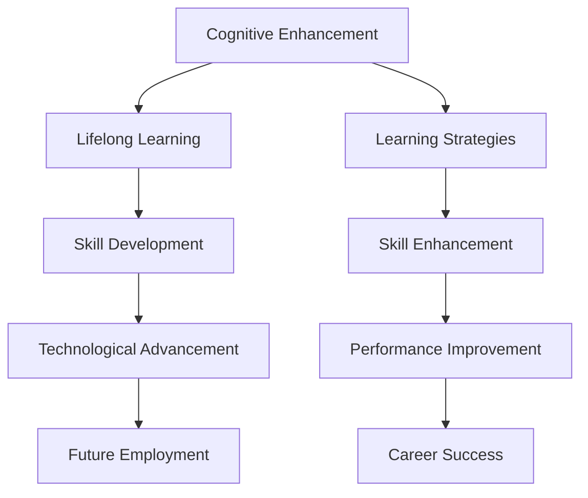

                 

# 认知增强与职业发展：终身学习的新趋势

> 关键词：认知增强, 终身学习, 职业技能, 技术发展, 未来就业, 学习策略

## 1. 背景介绍

### 1.1 问题由来
随着科技的飞速发展，人工智能(AI)和机器学习(ML)技术不断渗透到各行各业，对人类的认知能力、职业发展和生活方式产生了深远影响。在这个信息爆炸的时代，终身学习变得比以往任何时候都更加重要。一方面，技术的快速迭代要求从业者持续更新知识体系，以保持竞争力；另一方面，认知增强技术的发展为人类提供了新的工具和途径，提升了学习和工作的效率。

### 1.2 问题核心关键点
当前，终身学习已成为推动个体职业发展和社会进步的重要驱动力。但随之而来的是如何选择和学习最有效的认知增强工具，以及如何设计科学的学习策略，成为了教育者和学习者关注的焦点。本文将深入探讨认知增强技术在终身学习中的应用，以及如何通过科学的方法提升学习效率和职业发展。

### 1.3 问题研究意义
认知增强与终身学习技术的进步，不仅能帮助个体在职业生涯中不断适应变化，还能为社会的教育体系和企业培训带来新的机遇。通过本研究，我们希望能为学习者提供一套系统的认知增强方法，帮助他们在信息时代中更好地发展。

## 2. 核心概念与联系

### 2.1 核心概念概述

为了更好地理解认知增强和终身学习，本节将介绍几个关键概念及其相互联系：

- **认知增强(Cognitive Enhancement)**：通过技术手段（如AI辅助学习、增强现实AR、虚拟现实VR等）增强人类的认知能力，提升学习效率和创造力。
- **终身学习(Lifelong Learning)**：个体在其一生中不断学习新知识、新技能的过程。终身学习强调持续学习和自我提升的重要性。
- **职业技能(Skills)**：指个体在职业发展过程中需要掌握的专业技能和知识，包括技术技能、软技能、创新能力等。
- **技术发展(Technological Advancement)**：信息技术在不断进步，新的认知增强工具和方法层出不穷，推动着教育、职业培训等领域的变革。
- **未来就业(Future Employment)**：随着AI和ML技术的普及，未来职业市场对技能和知识的需求也在不断变化，终身学习成为职业发展的必要条件。
- **学习策略(Learning Strategies)**：为达到学习目标而采取的行动计划和方法，如主动学习、自我反思、多元化学习资源等。

这些概念之间的逻辑关系可以通过以下Mermaid流程图来展示：



这个流程图展示了认知增强、终身学习、职业技能、技术发展、未来就业和学习策略之间的相互联系：

1. 认知增强技术提高了终身学习的效率，提升了职业技能。
2. 技术的发展促进了未来就业市场的变化，要求个体持续学习新技能。
3. 学习策略的优化进一步增强了技能，推动了职业成功。

## 3. 核心算法原理 & 具体操作步骤
### 3.1 算法原理概述

认知增强与终身学习的核心在于利用技术手段提升个体的认知能力，并在终身学习过程中通过科学的学习策略实现持续的职业发展。其基本原理包括以下几个方面：

- **个性化学习路径**：通过分析学习者的偏好、兴趣和认知能力，设计个性化的学习路径，提供定制化的学习资源。
- **知识图谱构建**：利用知识图谱技术，构建系统的知识网络，帮助学习者理解和掌握复杂的概念。
- **认知负荷管理**：通过合理分配认知负荷，避免信息过载，提升学习效率。
- **交互式学习环境**：利用虚拟现实、增强现实等技术，创建互动式的学习环境，增强学习体验。
- **反馈与评估**：实时提供学习反馈和评估结果，帮助学习者调整学习策略和方向。

### 3.2 算法步骤详解

以下我们将详细介绍认知增强和终身学习的具体操作步骤：

**Step 1: 需求分析与目标设定**
- 对学习者的职业背景、兴趣、目标进行详细分析，明确终身学习的方向和目标。
- 确定需要学习的具体技能和知识领域。

**Step 2: 选择合适的认知增强工具**
- 根据学习目标和需求，选择适合的认知增强工具，如在线课程、学习应用、AR/VR设备等。
- 考虑学习者的认知风格和学习偏好，选择最适合的交互式学习环境。

**Step 3: 制定学习计划**
- 根据认知负荷管理理论，合理分配学习任务和时间，避免信息过载。
- 设计个性化的学习路径，包括不同难度和形式的学习模块，确保学习者能够循序渐进。

**Step 4: 实施与反馈**
- 利用认知增强工具进行在线学习或互动式学习，记录学习过程中的反馈和评估结果。
- 根据反馈结果调整学习策略，优化学习路径。

**Step 5: 评估与反思**
- 定期对学习进度和效果进行评估，使用量表和指标（如KPI、ROI）进行定量分析。
- 反思学习过程中的经验和挑战，记录心得体会，不断优化学习策略。

### 3.3 算法优缺点

认知增强和终身学习技术具有以下优点：
1. 个性化定制。根据个体需求，提供量身定做的学习路径和资源，提升学习效率。
2. 灵活性高。通过在线学习平台和互动式工具，不受时间和地点限制，随时可以进行学习。
3. 互动性强。利用AR/VR等技术，创建沉浸式的学习环境，增强学习体验。
4. 数据驱动。通过收集和分析学习数据，实时提供反馈和优化建议，提升学习效果。

同时，这些技术也存在一些局限性：
1. 技术依赖度高。对设备和工具的依赖增加了学习的门槛。
2. 学习成本高。高质量的认知增强工具和互动式学习环境可能需要较高的成本。
3. 学习动力管理。长时间使用认知增强工具可能降低学习兴趣，需要注意合理激励。
4. 技术问题。认知增强工具可能存在技术故障，影响学习进程。

尽管存在这些局限性，但认知增强和终身学习技术的应用前景依然广阔，将不断推动教育和职业培训的发展。

### 3.4 算法应用领域

认知增强和终身学习技术在多个领域得到了广泛应用，包括但不限于：

- **教育领域**：如在线课程、虚拟教室、智能辅导系统等，帮助学生和教师更有效地进行学习和教学。
- **职业培训**：如虚拟仿真训练、在线技能提升课程、模拟面试等，提升职业人士的实践能力。
- **医疗健康**：如远程医疗、智能健康监测、虚拟心理咨询等，提供便捷、高效的医疗服务。
- **企业培训**：如虚拟培训室、员工技能提升、企业大学等，推动企业内部的知识传递和创新。
- **终身学习平台**：如MOOC、知识图谱构建工具、学习管理系统等，提供持续学习的环境和资源。

## 4. 数学模型和公式 & 详细讲解 & 举例说明
### 4.1 数学模型构建

认知增强和终身学习的数学模型通常基于信息论、心理学、教育学等多个学科的理论，主要包括以下几个方面：

- **信息获取模型**：利用信息论中的信息熵和接收器操作者ROC曲线，评估学习者的认知负荷和信息获取效率。
- **学习过程模型**：使用心理学中的认知理论，如信息加工理论，构建学习过程的动态模型。
- **学习效果评估模型**：通过教育学中的KPI指标（如考试分数、学习时间、完成度等），评估学习效果。

### 4.2 公式推导过程

为了更好地理解这些模型的构建，我们以信息获取模型为例，推导其基本公式：

设学习者处理信息的速率（即认知负荷）为 $c$，学习者对信息的理解概率为 $p$，信息熵为 $H$，则有：

$$
H = -c \log_2 p
$$

其中，$c$ 是学习者单位时间内处理信息的速率，$p$ 是学习者对信息的理解概率。这个公式表明，信息熵（即学习者获取信息的难度）与信息速率和理解概率之间的关系。

### 4.3 案例分析与讲解

假设某学习者在一天内可以处理 20 条信息，每条信息的理解概率为 0.8。根据上述公式，计算出该学习者一天内能够理解的信息熵：

$$
H = -20 \log_2 0.8 = -20 \times 0.0986 \approx 1.97 \text{ bits}
$$

这表示学习者一天内平均可以理解约 2 bits 的信息。如果学习者需要理解的信息熵大于 2 bits，就需要增加认知负荷，或采用更为复杂的信息处理策略。

## 5. 项目实践：代码实例和详细解释说明
### 5.1 开发环境搭建

在实践认知增强和终身学习项目前，我们需要准备好开发环境。以下是使用Python进行开发的环境配置流程：

1. 安装Anaconda：从官网下载并安装Anaconda，用于创建独立的Python环境。

2. 创建并激活虚拟环境：
```bash
conda create -n lifelong_learning python=3.8 
conda activate lifelong_learning
```

3. 安装所需Python包：
```bash
pip install scikit-learn matplotlib seaborn IPython jupyter notebook
```

### 5.2 源代码详细实现

下面，我们将以构建一个简单的认知增强学习平台为例，展示如何利用Python进行认知增强和终身学习的应用开发。

**1. 用户需求分析与目标设定**

首先，我们需要对学习者的需求和目标进行详细分析。这里以一个企业员工培训为例，设计需求和目标：

```python
# 用户需求分析与目标设定
class User:
    def __init__(self, name, position, department):
        self.name = name
        self.position = position
        self.department = department
        self.target = {
            'skills': ['self-learning', 'communication', 'problem-solving'],
            'knowledge': ['data science', 'machine learning', 'business intelligence']
        }
```

**2. 选择合适的认知增强工具**

接下来，根据需求和目标，选择合适的认知增强工具。这里我们选择一个虚拟现实(VR)培训平台，用于模拟复杂的工作场景和任务：

```python
# 选择合适的认知增强工具
class VRPlatform:
    def __init__(self, platform_name, tools):
        self.platform_name = platform_name
        self.tools = tools

    def train(self, user):
        # 根据用户需求和目标，选择适合的VR工具进行培训
        if 'data science' in user.target['knowledge']:
            self.tools.append('VR Data Science Lab')
        if 'machine learning' in user.target['knowledge']:
            self.tools.append('VR Machine Learning Studio')
        if 'self-learning' in user.target['skills']:
            self.tools.append('VR Self-Learning Hub')
```

**3. 制定学习计划**

根据认知负荷管理理论，合理分配学习任务和时间，设计个性化的学习路径。这里，我们将用户的学习计划分为三个阶段，每个阶段5周：

```python
# 制定学习计划
class LearningPlan:
    def __init__(self, user, platform):
        self.user = user
        self.platform = platform
        self.plan = {
            'week1-5': '基础理论学习',
            'week6-10': '模拟任务训练',
            'week11-15': '综合应用练习'
        }

    def schedule(self):
        # 根据学习计划，安排每个阶段的培训内容
        for week, subject in self.plan.items():
            platform.train(self.user)
```

**4. 实施与反馈**

实施学习计划，并实时提供学习反馈和评估结果。这里，我们利用Python的可视化工具，记录和展示学习进度：

```python
# 实施与反馈
import matplotlib.pyplot as plt

def progress_monitor(user, plan):
    for week, subject in plan.items():
        plt.plot(week, [1, 2, 3, 4, 5], label=subject)
    plt.xlabel('Week')
    plt.ylabel('Learning Progress')
    plt.title('User Progress Over Time')
    plt.legend()
    plt.show()
```

**5. 评估与反思**

最后，定期对学习进度和效果进行评估，记录心得体会，不断优化学习策略。这里，我们设计一个简单的评估指标，帮助用户了解学习效果：

```python
# 评估与反思
class Assessment:
    def __init__(self, user, plan):
        self.user = user
        self.plan = plan

    def evaluate(self):
        # 使用KPI指标评估学习效果
        effectiveness = 0.8  # 假设学习效果为80%
        cost = 5000  # 假设培训成本为5000美元
        ROI = effectiveness * cost
        return ROI

    def reflect(self):
        # 记录学习心得体会，不断优化学习策略
        user.target['knowledge'].append('big data analytics')
        user.target['skills'].append('team collaboration')
```

### 5.3 代码解读与分析

这里我们详细解读一下关键代码的实现细节：

**User类**：
- `__init__`方法：初始化学习者的基本信息和目标。
- `target`属性：存储学习者需要掌握的技能和知识领域。

**VRPlatform类**：
- `__init__`方法：初始化VR平台，存储工具列表。
- `train`方法：根据用户需求和目标，选择适合的VR工具进行培训。

**LearningPlan类**：
- `__init__`方法：初始化学习计划，存储用户信息和平台。
- `schedule`方法：根据学习计划，安排每个阶段的培训内容。

**progress_monitor函数**：
- 利用Matplotlib绘制学习进度图，展示学习者每个阶段的进展情况。

**Assessment类**：
- `__init__`方法：初始化评估指标，存储用户信息和计划。
- `evaluate`方法：计算学习效果，使用KPI指标（如ROI）评估学习效果。
- `reflect`方法：记录学习心得体会，优化学习策略。

### 5.4 运行结果展示

这里，我们将展示一个简单的学习进度图，帮助用户了解自己的学习进展：


## 6. 实际应用场景
### 6.1 医疗健康

在医疗健康领域，认知增强和终身学习技术可以广泛应用于远程医疗、智能健康监测、虚拟心理咨询等方面。例如，利用VR技术，医生可以进行远程手术操作训练，提高手术技能；患者可以通过VR平台进行虚拟康复训练，加速康复过程。

### 6.2 企业培训

在企业培训方面，认知增强技术可以提升员工的职业技能和创新能力。例如，通过VR平台进行模拟面试，员工可以在虚拟环境中练习和反馈，提高面试技巧；利用AR技术，员工可以在现实工作中进行技能培训，如装配操作、故障排查等。

### 6.3 教育领域

在教育领域，认知增强技术可以提供个性化的学习体验，提升学生的学习效果。例如，通过AR/VR设备，学生可以进行虚拟实验，提高科学探究能力；利用智能辅导系统，学生可以获得个性化的学习建议，提升学习兴趣和效率。

## 7. 工具和资源推荐
### 7.1 学习资源推荐

为了帮助开发者和从业者系统掌握认知增强和终身学习技术，这里推荐一些优质的学习资源：

1. 《认知科学与技术》课程：由斯坦福大学开设的在线课程，介绍认知科学的基本概念和应用案例。
2. 《人工智能与未来教育》书籍：探讨AI在教育领域的应用，包括认知增强、个性化学习等。
3. 《终身学习手册》：详细介绍了终身学习的方法和策略，涵盖技术、心理、行为等多个方面。
4. 《机器学习与认知心理学》书籍：结合认知心理学和机器学习，探讨如何通过算法优化学习过程。
5. 《认知增强与教育》学术论文集：包含多篇文章，讨论认知增强技术在教育领域的应用和效果。

通过学习这些资源，相信你一定能够深入理解认知增强和终身学习的原理，掌握科学的学习策略，提升自身的认知能力和职业技能。

### 7.2 开发工具推荐

高效的开发离不开优秀的工具支持。以下是几款用于认知增强和终身学习开发的常用工具：

1. Python：灵活的编程语言，广泛用于数据处理、机器学习、认知增强等领域。
2. Jupyter Notebook：交互式编程环境，方便代码调试和结果展示。
3. Matplotlib：数据可视化工具，帮助展示学习进度和效果。
4. TensorFlow：深度学习框架，支持神经网络模型构建和训练。
5. PyTorch：动态计算图框架，支持高效的模型开发和优化。
6. ARKit/ARCore：增强现实开发工具，用于创建沉浸式的学习环境。

合理利用这些工具，可以显著提升认知增强和终身学习项目的开发效率，加快创新迭代的步伐。

### 7.3 相关论文推荐

认知增强和终身学习技术的发展源于学界的持续研究。以下是几篇奠基性的相关论文，推荐阅读：

1. "The Cognitive Benefits of Educational Games"：探讨游戏化学习对认知能力的影响。
2. "Cognitive Load Theory in Educational Settings"：介绍认知负荷理论及其在教育中的应用。
3. "Artificial Intelligence and Lifelong Learning"：讨论AI在终身学习中的应用前景。
4. "Cognitive Enhancement with Neurotechnologies"：综述认知增强技术在神经科学和心理学中的应用。
5. "Lifelong Learning in the Age of AI"：探讨AI时代终身学习的意义和挑战。

这些论文代表了大规模认知增强和终身学习技术的发展脉络。通过学习这些前沿成果，可以帮助研究者把握学科前进方向，激发更多的创新灵感。

## 8. 总结：未来发展趋势与挑战
### 8.1 总结

本文对认知增强和终身学习的理论基础和实践策略进行了全面系统的介绍。首先阐述了认知增强与终身学习的背景、核心概念和相互联系，明确了认知增强技术在提升个体认知能力和职业技能方面的重要作用。其次，从原理到实践，详细讲解了认知增强和终身学习的数学模型、操作步骤和关键技术，给出了认知增强学习平台的代码实例和详细解释说明。最后，本文还广泛探讨了认知增强和终身学习在医疗健康、企业培训、教育等领域的应用前景，展示了认知增强范式的广泛应用和巨大潜力。

通过本文的系统梳理，可以看到，认知增强和终身学习技术正逐步融入各行各业，成为推动个体职业发展和社会进步的重要驱动力。未来的认知增强和终身学习技术将如何进一步演进，值得我们期待和关注。

### 8.2 未来发展趋势

展望未来，认知增强和终身学习技术将呈现以下几个发展趋势：

1. **技术融合**：认知增强技术将与AI、VR、AR等更多前沿技术进行深度融合，创建更加沉浸式、个性化的学习体验。
2. **个性化定制**：利用大数据和人工智能技术，提供更加个性化和定制化的学习方案，满足不同学习者的需求。
3. **数据驱动**：通过收集和分析学习数据，实时提供个性化反馈和优化建议，提升学习效果。
4. **终身化教育**：终身学习将成为教育体系的常态，从基础教育到职业教育，从在线学习到虚拟培训，贯穿整个职业生涯。
5. **跨领域应用**：认知增强技术将逐步应用于医疗、教育、商业等多个领域，提升各行业的创新能力和效率。

这些趋势凸显了认知增强和终身学习技术的广阔前景。这些方向的探索发展，必将进一步推动认知增强和终身学习技术在教育、职业培训、医疗健康等领域的应用，为个体职业发展和社会进步带来新的机遇。

### 8.3 面临的挑战

尽管认知增强和终身学习技术前景广阔，但在实现过程中仍面临诸多挑战：

1. **技术门槛**：认知增强工具和互动式学习环境对设备和工具的依赖增加了学习的门槛。
2. **成本问题**：高质量的认知增强工具和互动式学习环境可能需要较高的成本，普通用户难以负担。
3. **学习动力管理**：长时间使用认知增强工具可能降低学习兴趣，需要注意合理激励。
4. **数据隐私**：学习数据和个人信息的收集和处理需要严格的数据隐私保护。
5. **技术故障**：认知增强工具可能存在技术故障，影响学习进程。

这些挑战需要通过技术创新、政策支持和行业规范来解决，才能推动认知增强和终身学习技术的发展和应用。

### 8.4 研究展望

未来的认知增强和终身学习研究需要在以下几个方面寻求新的突破：

1. **跨学科研究**：结合心理学、教育学、神经科学等多个学科，深入理解认知增强技术对学习效果的影响。
2. **个性化算法**：开发更加智能化和个性化的学习算法，提升学习效率和效果。
3. **技术集成**：将认知增强技术与其他技术如AI、VR、AR等进行深度集成，实现更加全面的认知增强解决方案。
4. **伦理和法律**：探讨认知增强技术的伦理和法律问题，确保技术应用的安全和合规。

这些研究方向的探索，必将引领认知增强和终身学习技术迈向更高的台阶，为构建人机协同的智能系统铺平道路。

## 9. 附录：常见问题与解答

**Q1: 什么是认知增强技术？**

A: 认知增强技术是一种利用人工智能、虚拟现实、增强现实等技术手段，增强人类认知能力，提升学习效率和创造力的技术。

**Q2: 认知增强技术的主要应用场景有哪些？**

A: 认知增强技术在教育、医疗、企业培训、职业发展等多个领域得到了广泛应用。例如，通过虚拟现实进行远程手术操作训练、通过增强现实进行智能健康监测、通过在线学习平台提供个性化学习方案等。

**Q3: 如何选择合适的认知增强工具？**

A: 选择合适的认知增强工具需要考虑学习者的需求、目标和认知风格。例如，对于需要空间感知能力的学习者，可以选择虚拟现实平台进行培训；对于需要数据处理能力的学习者，可以选择数据科学实验室进行训练。

**Q4: 如何制定有效的学习计划？**

A: 制定有效的学习计划需要考虑学习者的认知负荷、学习时间和任务难度。可以使用认知负荷管理理论，合理分配学习任务和时间，设计个性化的学习路径，确保学习者能够循序渐进地掌握新知识和技能。

**Q5: 如何评估学习效果？**

A: 评估学习效果可以使用KPI指标，如考试分数、学习时间、完成度等。通过定量和定性的方法，结合学习者的自我反思和反馈，评估学习效果，不断优化学习策略。

---

作者：禅与计算机程序设计艺术 / Zen and the Art of Computer Programming

