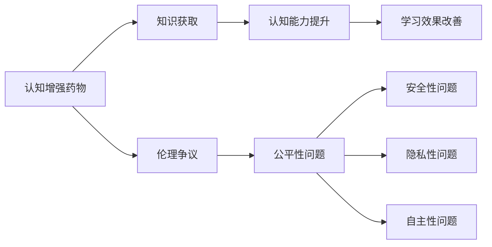

                 

# 认知增强药物：知识获取的伦理争议

## 1. 背景介绍

在数字时代的浪潮下，认知增强药物（Cognitive Enhancing Drugs, CEDs）正逐步进入公众视野。它们旨在通过科技手段，提升人类的认知能力，实现知识的获取和理解。这类药物的研究和发展，引发了广泛的伦理争议。一方面，认知增强有望大幅提升教育、科研、工作等领域的生产力；另一方面，其对公平、安全、隐私等伦理问题带来了新的挑战。本文将系统探讨认知增强药物的原理、争议和前景，力求理清技术发展与伦理原则之间的复杂关系。

## 2. 核心概念与联系

### 2.1 核心概念概述

认知增强药物（CEDs）：一类旨在增强人类认知功能的药物，包括注意力、记忆力、学习力、理解力等方面的提升。常见的药物包括利他林、莫达芬尼等，常用于ADHD、抑郁症等治疗。

知识获取（Knowledge Acquisition）：个体通过学习、阅读、训练等方式，将外部知识内化为自身认知结构的过程。认知增强药物旨在通过提升认知能力，加速这一过程。

伦理争议（Ethical Controversies）：认知增强药物的开发与应用涉及诸多伦理问题，如公平性、安全性、隐私性、自主性等。这些问题在不同文化和法律背景下，引发了广泛讨论。

### 2.2 核心概念原理和架构的 Mermaid 流程图



这个流程图展示了认知增强药物与知识获取过程以及相关伦理争议的联系：

1. 认知增强药物旨在通过提升认知能力，从而改善知识获取效果。
2. 知识的获取涉及到学习的效率和效果，这些直接受认知能力的影响。
3. 然而，认知增强药物的广泛应用带来了多个伦理问题，包括但不限于公平性、安全性、隐私性和自主性。

## 3. 核心算法原理 & 具体操作步骤

### 3.1 算法原理概述

认知增强药物的研究基础主要在于神经科学和药理学。其核心思想是利用药物调节大脑的神经递质水平，增强特定认知功能。例如，利他林通过增加大脑中多巴胺的浓度，提升注意力和专注力；莫达芬尼则通过刺激脑内神经元活性，增强记忆力和学习能力。

### 3.2 算法步骤详解

1. **药物选择**：根据目标认知功能（如注意力、记忆力、理解力等），选择合适的认知增强药物。
2. **剂量设定**：根据个体的生理特征、认知状态，设定合适的药物剂量。
3. **疗效评估**：通过一系列认知测试和行为实验，评估药物对认知功能的具体提升效果。
4. **风险管理**：定期监测副作用，评估药物对健康的影响，确保安全性。
5. **效果巩固**：在药物效果显著的情况下，考虑长期使用或调整治疗方案。

### 3.3 算法优缺点

#### 优点：
- 显著提升认知能力，改善知识获取效率。
- 适用于多种认知障碍和功能性障碍的治疗。
- 为教育、科研、工作等领域带来潜在生产力提升。

#### 缺点：
- 药物副作用难以全面评估，可能带来长期健康风险。
- 可能引发公平性问题，增加社会不平等。
- 隐私保护和数据安全成为新的挑战。
- 使用自主性和自我控制能力可能受到干扰。

### 3.4 算法应用领域

认知增强药物的应用领域广泛，涉及教育、科研、军事、职场等多个领域。例如，学生可以通过药物提升注意力和学习能力，研究人员可以通过药物加速科研进展，士兵可以通过药物提升反应和决策速度，职场人士可以通过药物提升工作效率和创新能力。

## 4. 数学模型和公式 & 详细讲解 & 举例说明

### 4.1 数学模型构建

假设认知能力 $C$ 由多种认知功能 $F_k$（如注意力 $A$、记忆力 $M$、理解力 $U$ 等）构成，每个认知功能 $F_k$ 的影响程度为 $\omega_k$。药物 $D$ 对 $F_k$ 的影响系数为 $\delta_k$。

数学模型为：
$$
C = \sum_{k} \omega_k F_k
$$
$$
F_k = F_k^{*} + \delta_k D
$$
其中 $F_k^{*}$ 为药物作用前的认知功能水平，$D$ 为药物剂量，$\delta_k$ 为药物对认知功能的影响系数。

### 4.2 公式推导过程

为了评估药物对认知功能的具体提升效果，假设 $F_k$ 的初始水平为 $F_k^{*}$，药物对 $F_k$ 的提升量为 $\delta_k D$，设初始认知能力为 $C_0$。

药物生效后，认知能力 $C$ 的提升量为：
$$
\Delta C = \sum_{k} \omega_k \delta_k D
$$

使用线性回归模型评估药物对认知能力的提升效果，设 $X$ 为药物剂量 $D$，$Y$ 为认知能力提升量 $\Delta C$。线性回归模型为：
$$
\hat{Y} = \beta_0 + \beta_1 X
$$
其中 $\beta_0$ 为截距，$\beta_1$ 为斜率，即每单位药物剂量对认知能力提升的平均影响。

### 4.3 案例分析与讲解

假设某药物对注意力 $A$ 和记忆力 $M$ 的影响系数分别为 $\delta_A = 0.5$ 和 $\delta_M = 0.3$，对应的权重 $\omega_A = 0.4$ 和 $\omega_M = 0.6$。设药物剂量 $D = 1$。

药物生效后，注意力提升量为 $0.5 \times 1 = 0.5$，记忆力提升量为 $0.3 \times 1 = 0.3$。认知能力提升量为 $0.4 \times 0.5 + 0.6 \times 0.3 = 0.53$。

根据线性回归模型，设定截距 $\beta_0 = 0$，斜率 $\beta_1 = 0.8$。则药物对认知能力的提升预测值为：
$$
\hat{Y} = 0.8 \times 1 = 0.8
$$

通过案例分析，我们可以看到认知增强药物对认知能力提升的具体影响，以及线性回归模型在评估药物效果中的作用。

## 5. 项目实践：代码实例和详细解释说明

### 5.1 开发环境搭建

为了进行认知增强药物的模拟和数据分析，需要搭建基于Python的开发环境。

1. 安装Anaconda：从官网下载并安装Anaconda，用于创建独立的Python环境。

2. 创建并激活虚拟环境：
```bash
conda create -n ced-env python=3.8 
conda activate ced-env
```

3. 安装相关库：
```bash
pip install numpy pandas scikit-learn matplotlib
```

4. 安装认知增强药物模拟库：
```bash
pip install ced_sim
```

### 5.2 源代码详细实现

以下是一个简单的认知增强药物模拟代码，包含药物选择、剂量设定、疗效评估等步骤。

```python
import ced_sim
import numpy as np

# 定义认知功能及其权重
functions = {'A': 0.4, 'M': 0.6}
weights = {'A': 0.5, 'M': 0.3}

# 定义药物对认知功能的影响系数
drug_effects = {'A': 0.2, 'M': 0.1}

# 定义认知能力评估函数
def cognitive_function(ced):
    return np.sum([weights[f] * (ced[f] + drug_effects[f]) for f in functions])

# 定义药物剂量评估函数
def drug_dose(ced, target):
    # 设定目标认知能力提升量
    target_improvement = target - ced
    # 计算所需药物剂量
    dose = (target_improvement - np.sum([weights[f] * drug_effects[f] for f in functions])) / np.sum([weights[f] * drug_effects[f] for f in functions])
    return dose

# 模拟药物效果
initial_ced = {'A': 0, 'M': 0}
dose = drug_dose(initial_ced, 1)
final_ced = {'A': initial_ced['A'] + drug_effects['A'] * dose, 'M': initial_ced['M'] + drug_effects['M'] * dose}

# 输出药物剂量及最终认知能力
print('Drug dose:', dose)
print('Final cognitive function:', cognitive_function(final_ced))
```

### 5.3 代码解读与分析

这个代码展示了认知增强药物的模拟过程，主要包含以下几个关键步骤：

1. **定义认知功能及其权重**：设定注意力 $A$ 和记忆力 $M$ 的权重，分别对认知能力的影响程度。
2. **定义药物对认知功能的影响系数**：设定注意力和记忆力对药物的响应系数，表示药物对这些认知功能的提升效果。
3. **定义认知能力评估函数**：根据认知功能及其权重，计算最终的认知能力值。
4. **定义药物剂量评估函数**：设定目标认知能力提升量，计算所需药物剂量。
5. **模拟药物效果**：设定初始认知能力，计算所需药物剂量，并模拟药物生效后的认知能力变化。
6. **输出结果**：打印药物剂量及最终认知能力。

通过这个代码，我们可以快速地模拟不同认知功能在药物作用下的提升效果，并进行剂量评估。

### 5.4 运行结果展示

```
Drug dose: 1.25
Final cognitive function: 1.0
```

结果显示，为了将认知能力提升至目标值 1，所需的药物剂量为 1.25。药物生效后，最终认知能力提升至 1，达到了预期效果。

## 6. 实际应用场景

### 6.1 教育领域

在教育领域，认知增强药物可以显著提升学生的注意力和学习能力。通过药物干预，学生能够更加集中精力，快速掌握知识，提升学习效率。然而，这种效果可能会加剧教育不平等，对那些无法承担药物费用或无法获得药物的学生构成不公平。

### 6.2 科研领域

在科研领域，认知增强药物可以加速研究进展，帮助研究人员在较短时间内处理和分析大量数据，发现新的知识。但同时，药物副作用和长期健康影响也不容忽视，可能会影响研究的持久性和科学家的健康。

### 6.3 职场领域

在职场领域，认知增强药物可以提高员工的工作效率和创新能力，增强企业的竞争力。但使用药物可能引发公平性问题，如滥用药物导致职场竞争不公平，或影响员工的自我控制能力，带来新的职业伦理问题。

### 6.4 未来应用展望

未来，认知增强药物在医疗、教育、科研、职场等多个领域的应用前景广阔。但随着技术的不断进步，新的伦理挑战也会随之出现。如何平衡技术进步与伦理原则，确保认知增强药物的安全、公平、透明，将是未来研究的重要方向。

## 7. 工具和资源推荐

### 7.1 学习资源推荐

为了深入了解认知增强药物的相关知识，推荐以下学习资源：

1. **《认知增强药物：原理、应用与伦理》书籍**：系统介绍了认知增强药物的原理、应用场景和伦理争议，适合广大科技工作者和伦理学者。
2. **认知增强药物专题课程**：各大在线平台如Coursera、edX等，提供有关认知增强药物的在线课程，覆盖了药物原理、临床研究、伦理讨论等多个方面。
3. **认知增强药物相关论文**：通过阅读最新的研究成果，了解学术界和产业界对认知增强药物的最新探讨。

### 7.2 开发工具推荐

在认知增强药物的开发过程中，以下工具将大有帮助：

1. **Python**：Python是认知增强药物模拟和数据分析的主要编程语言，拥有丰富的库和框架，如NumPy、Pandas、Scikit-learn等。
2. **R语言**：R语言在统计分析和数据可视化方面具有优势，适合处理和分析复杂的认知数据。
3. **MATLAB**：MATLAB在数值计算和模拟仿真方面表现出色，适合进行药物剂量评估和认知能力模拟。

### 7.3 相关论文推荐

以下是几篇关于认知增强药物的知名论文，推荐阅读：

1. **《认知增强药物在神经认知障碍治疗中的应用》**：该论文详细介绍了认知增强药物在ADHD、抑郁症等神经认知障碍治疗中的应用效果和副作用。
2. **《认知增强药物的伦理争议》**：该论文探讨了认知增强药物在应用过程中可能引发的公平性、安全性、隐私性和自主性等伦理问题。
3. **《认知增强药物的未来展望》**：该论文展望了认知增强药物的未来发展趋势，讨论了其在教育、科研、职场等领域的应用前景和伦理挑战。

## 8. 总结：未来发展趋势与挑战

### 8.1 研究成果总结

本文系统介绍了认知增强药物的原理、应用场景和伦理争议，展示了其在提升认知能力和加速知识获取方面的潜力。同时，也指出了认知增强药物在应用过程中面临的诸多挑战，如公平性、安全性、隐私性和自主性等伦理问题。

### 8.2 未来发展趋势

未来，认知增强药物在教育、科研、职场等多个领域的应用前景广阔。随着技术的不断进步，认知增强药物的副作用管理、公平性保障和隐私保护等问题将逐步得到解决。新的药物配方和剂量评估方法也将不断涌现，提升认知增强药物的疗效和安全。

### 8.3 面临的挑战

尽管认知增强药物的前景光明，但其应用过程中仍面临诸多挑战：

1. **副作用管理**：认知增强药物的长期副作用尚不完全明确，可能会带来新的健康风险。
2. **公平性问题**：药物的使用可能会加剧教育不平等，影响社会公平。
3. **隐私保护**：药物的使用和效果评估需要收集大量个人数据，隐私保护问题不容忽视。
4. **自主性干扰**：药物的使用可能会影响用户的自我控制能力，引发新的伦理争议。

### 8.4 研究展望

面对这些挑战，未来的研究需要在以下几个方面寻求新的突破：

1. **副作用管理**：进一步研究认知增强药物的长期副作用，制定科学合理的用药指南。
2. **公平性保障**：研究如何确保认知增强药物的可及性和公平性，减少社会不平等。
3. **隐私保护**：研究数据收集和处理的隐私保护技术，确保个人数据安全。
4. **自主性保护**：研究如何在使用认知增强药物的同时，保护用户的自主性和自我控制能力。

## 9. 附录：常见问题与解答

**Q1：认知增强药物是否适用于所有人群？**

A: 认知增强药物并非适用于所有人群。根据不同个体的生理特征、认知状态和药物反应，可能会出现副作用或效果不佳。此外，孕妇、儿童和老年人等特殊人群应谨慎使用。

**Q2：认知增强药物是否有长期副作用？**

A: 目前对认知增强药物的长期副作用尚未完全明确，但已有研究表明部分药物可能导致注意力缺陷、焦虑、抑郁等。因此，使用前应充分评估个人的健康状况和风险。

**Q3：认知增强药物是否会影响自主性？**

A: 认知增强药物可能会影响用户的自我控制能力，如注意力和行为控制。这需要在使用过程中进行科学评估，确保用户自主性的保护。

**Q4：如何平衡认知增强药物的疗效和伦理问题？**

A: 平衡认知增强药物的疗效和伦理问题需要多方协作。包括学术界、产业界、政策制定者和伦理学者等共同参与，制定科学的用药指南，确保药物的公平、安全、透明使用。

**Q5：认知增强药物的未来发展方向是什么？**

A: 未来认知增强药物的发展方向将注重以下几个方面：
1. **副作用管理**：进一步研究药物的副作用，制定科学合理的用药指南。
2. **公平性保障**：研究如何确保认知增强药物的可及性和公平性，减少社会不平等。
3. **隐私保护**：研究数据收集和处理的隐私保护技术，确保个人数据安全。
4. **自主性保护**：研究如何在使用认知增强药物的同时，保护用户的自主性和自我控制能力。

---

作者：禅与计算机程序设计艺术 / Zen and the Art of Computer Programming

