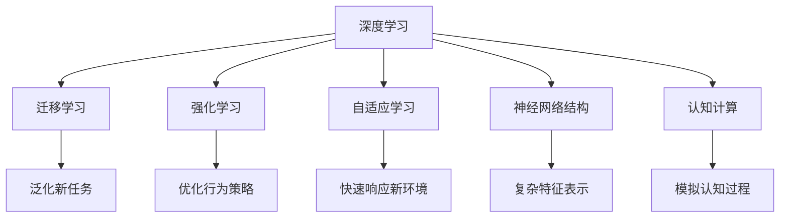

                 

# 认知弹性：适应快速变化的学习能力

> 关键词：认知弹性,适应性学习,深度学习,迁移学习,强化学习,自适应,神经网络,认知计算

## 1. 背景介绍

### 1.1 问题由来
在信息爆炸和知识迭代加快的今天，传统的学习方式已经难以适应快速变化的环境。认知弹性（Cognitive Elasticity）成为了研究的热点，因为它提供了一种新的学习范式，能够使学习系统更好地适应新环境、新任务，从而增强其应用范围和生命力。

这一概念最早出现在心理学领域，指的是生物体在面临环境变化时，能够快速调整自身行为以适应新环境的适应能力。将这一思想引入到机器学习领域，即希望学习系统在面临新数据、新任务时，能够通过不断学习和调整，提高自身的适应性和泛化能力。

### 1.2 问题核心关键点
目前，认知弹性主要是通过深度学习、迁移学习和强化学习等方法来实现的。这些技术分别在模型参数的灵活调整、已有知识的迁移应用和行为策略的动态优化上，展现了强大的适应性。

其核心目标在于：
- 快速响应新环境：通过学习模型的动态调整能力，使其能够适应新输入数据。
- 泛化新任务：利用迁移学习，将已有知识迁移到新任务上，提高模型在新场景下的表现。
- 优化行为策略：通过强化学习，模型能够根据环境反馈不断优化行为策略，提升系统决策的准确性和鲁棒性。

认知弹性的实现机制涉及多个领域，包括深度神经网络结构、迁移学习算法、强化学习策略等，是一个多学科交叉的研究方向。

## 2. 核心概念与联系

### 2.1 核心概念概述

为更好地理解认知弹性，我们首先介绍几个核心概念：

- **深度学习**：一种通过多层神经网络逼近复杂非线性关系的机器学习方法，广泛应用于图像、语音、自然语言处理等领域。
- **迁移学习**：指将在一个任务上学习到的知识迁移到另一个相关任务上，以减少新任务上的训练时间，提高性能。
- **强化学习**：通过智能体与环境的交互，利用反馈信息不断优化决策策略的机器学习方法，常用于游戏、机器人控制等领域。
- **自适应学习**：指学习系统能够根据输入数据的特点，自动调整学习策略和参数，以适应不同场景下的变化。
- **神经网络结构**：指通过多层非线性变换构成的网络结构，支持复杂的特征表示和模式识别。
- **认知计算**：将认知科学的理论和技术应用于计算系统的设计，强调模拟人类认知过程的能力。

这些概念之间的逻辑关系可以通过以下Mermaid流程图来展示：



这个流程图展示了深度学习、迁移学习、强化学习和自适应学习之间的逻辑关系：

1. 深度学习提供了一种强大的表示学习能力，通过多层神经网络提取复杂特征。
2. 迁移学习将已有知识迁移到新任务上，减少新任务的训练成本。
3. 强化学习通过智能体的反馈机制，优化决策策略，提升系统性能。
4. 自适应学习根据新环境和新数据，动态调整模型参数和学习策略。
5. 神经网络结构是深度学习的核心组件，支持复杂特征表示。
6. 认知计算模拟人类认知过程，提升计算系统的智能化水平。

这些概念共同构成了认知弹性技术的研究基础，使得学习系统能够更好地适应环境变化和新任务需求。

## 3. 核心算法原理 & 具体操作步骤
### 3.1 算法原理概述

认知弹性的核心在于通过动态调整模型参数和策略，适应新环境和新任务的需求。以下是认知弹性技术的主要算法原理：

- **迁移学习**：将预训练模型作为初始化参数，在小规模标注数据上进行微调，利用已有知识提高新任务的性能。
- **自适应学习**：根据新输入数据的特点，动态调整学习参数和学习率，以提高模型的适应性和泛化能力。
- **强化学习**：通过与环境的交互，不断优化决策策略，提升系统在复杂环境下的表现。
- **动态神经网络结构**：根据任务的复杂度和数据的特点，动态调整神经网络的结构和参数，实现灵活高效的学习。

这些算法通过不同的学习范式，使学习系统能够更好地适应环境变化和新任务的需求。

### 3.2 算法步骤详解

认知弹性算法主要分为以下几个步骤：

**Step 1: 模型初始化**
- 选择合适的深度学习模型，如卷积神经网络（CNN）、循环神经网络（RNN）、Transformer等，进行初始化。
- 加载预训练模型，作为模型的初始参数。

**Step 2: 迁移学习微调**
- 收集新任务的标注数据集，将其分为训练集和验证集。
- 使用迁移学习算法，在小规模标注数据上进行微调，更新模型的参数。
- 在验证集上评估模型性能，如果效果不佳，重复微调过程。

**Step 3: 自适应学习调整**
- 在新任务的训练过程中，根据数据的特点和模型表现，动态调整学习率和学习策略。
- 对于新环境，可以使用自适应学习算法，如学习率衰减、参数更新策略等，调整模型参数。

**Step 4: 强化学习优化**
- 将模型置于复杂环境中，通过与环境的交互，不断优化决策策略。
- 强化学习算法如Q-learning、Policy Gradient等，能够根据环境反馈，优化模型行为。

**Step 5: 动态神经网络结构优化**
- 根据任务需求，动态调整神经网络的结构和参数。
- 可以使用自适应神经网络结构优化算法，如网络剪枝、参数共享等方法，优化模型性能。

以上是认知弹性技术的主要操作步骤，具体的实现细节可以根据任务需求进行调整。

### 3.3 算法优缺点

认知弹性算法在提升模型适应性和泛化能力方面具有显著优势：
1. 减少新任务训练时间：通过迁移学习，利用已有知识，减少新任务上的训练时间。
2. 提高模型泛化能力：通过动态调整模型参数和策略，提高模型在新环境下的泛化能力。
3. 提升系统性能：通过强化学习，优化决策策略，提升系统在复杂环境下的表现。

但同时也存在一些局限性：
1. 对标注数据依赖较大：迁移学习需要一定量的标注数据，获取高质量标注数据的成本较高。
2. 模型复杂度较高：动态神经网络结构和自适应学习算法，使得模型结构复杂，训练和推理开销较大。
3. 算法复杂度高：强化学习算法通常需要较多的计算资源和时间，难以应用于实时任务。

尽管如此，认知弹性算法在提高模型适应性和泛化能力方面具有不可替代的价值，将成为机器学习领域的重要研究范式。

### 3.4 算法应用领域

认知弹性技术已经广泛应用于多个领域，取得显著成效：

- **自然语言处理**：利用迁移学习和自适应学习，提高语言模型在新场景下的性能。
- **图像识别**：通过迁移学习和动态神经网络结构优化，提升图像识别系统的泛化能力和鲁棒性。
- **智能推荐**：利用强化学习，优化推荐系统决策策略，提高推荐效果。
- **机器人控制**：通过强化学习，优化机器人行为策略，提升其适应复杂环境的能力。
- **金融交易**：利用自适应学习，动态调整交易策略，提高交易效率和风险控制能力。

这些应用场景展示了认知弹性技术在提升系统适应性和泛化能力方面的巨大潜力。

## 4. 数学模型和公式 & 详细讲解  
### 4.1 数学模型构建

认知弹性算法的主要数学模型包括迁移学习模型、自适应学习模型和强化学习模型。

**迁移学习模型**：
假设预训练模型为 $M_{\theta_0}$，新任务的数据集为 $D_{train}$，标注为 $y_{train}$。迁移学习的目标是最大化新任务的预测准确率：
$$
\max_{\theta} \mathcal{L}(\theta, D_{train})
$$
其中 $\mathcal{L}$ 为损失函数，通常使用交叉熵损失。

**自适应学习模型**：
假设当前模型参数为 $\theta_t$，新输入数据为 $x_{t+1}$。自适应学习的目标是在每一步更新模型参数 $\theta_{t+1}$，使得模型在新数据上的表现更好：
$$
\theta_{t+1} = \theta_t - \eta \nabla_{\theta} \mathcal{L}(\theta_t, x_{t+1})
$$
其中 $\eta$ 为学习率，$\nabla_{\theta} \mathcal{L}$ 为损失函数对模型参数的梯度。

**强化学习模型**：
假设智能体在环境中的策略为 $\pi$，环境的状态为 $s$，行动为 $a$，奖励为 $r$。强化学习的目标是最大化累计奖励：
$$
\max_{\pi} \sum_{t=1}^T r_t
$$
通常使用Q-learning等算法，通过环境反馈不断优化策略。

### 4.2 公式推导过程

以迁移学习为例，进行公式推导过程。

假设预训练模型 $M_{\theta_0}$ 在新任务 $T$ 上的损失函数为 $\mathcal{L}_{task}(\theta, D_{train})$。迁移学习的目标是最小化在新任务上的损失函数：
$$
\min_{\theta} \mathcal{L}_{task}(\theta, D_{train})
$$
通过反向传播算法，计算损失函数对模型参数 $\theta$ 的梯度：
$$
\nabla_{\theta} \mathcal{L}_{task}(\theta, D_{train}) = \frac{1}{N} \sum_{i=1}^N \nabla_{\theta} \ell(M_{\theta}(x_i), y_i)
$$
其中 $N$ 为训练样本数量，$\ell$ 为单样本损失函数。

在更新模型参数时，可以使用优化算法如AdamW、SGD等，结合学习率 $\eta$ 和动量 $\beta$：
$$
\theta \leftarrow \theta - \eta \nabla_{\theta} \mathcal{L}_{task}(\theta, D_{train}) - \eta\lambda \theta
$$
其中 $\lambda$ 为正则化系数，$\nabla_{\theta} \mathcal{L}_{task}(\theta, D_{train})$ 为损失函数对模型参数的梯度。

通过这一推导过程，我们可以看到，迁移学习模型利用预训练模型作为初始参数，通过反向传播算法和优化算法，不断更新模型参数，以提高新任务上的性能。

### 4.3 案例分析与讲解

以自然语言处理中的情感分析为例，说明认知弹性算法的应用过程。

假设我们有一项新的情感分析任务，需要从新闻评论中识别情感倾向（正面、负面或中性）。首先，我们选择一个预训练语言模型，如BERT，作为初始化参数。然后，收集一定量的标注数据集，划分为训练集和验证集。

使用迁移学习算法，将BERT模型在新任务上进行微调，更新模型的参数。在验证集上评估模型性能，如果效果不佳，重复微调过程。在自适应学习过程中，根据新输入数据的特点，动态调整学习率和学习策略。在强化学习过程中，将模型置于真实新闻评论数据中，通过环境反馈优化模型行为。

最终，我们得到一个能够在新情感分析任务上表现优异的BERT模型，通过动态调整模型参数和策略，实现了较高的认知弹性。

## 5. 项目实践：代码实例和详细解释说明
### 5.1 开发环境搭建

在进行认知弹性实践前，我们需要准备好开发环境。以下是使用Python进行PyTorch开发的环境配置流程：

1. 安装Anaconda：从官网下载并安装Anaconda，用于创建独立的Python环境。

2. 创建并激活虚拟环境：
```bash
conda create -n cognitive-env python=3.8 
conda activate cognitive-env
```

3. 安装PyTorch：根据CUDA版本，从官网获取对应的安装命令。例如：
```bash
conda install pytorch torchvision torchaudio cudatoolkit=11.1 -c pytorch -c conda-forge
```

4. 安装其他依赖：
```bash
pip install numpy pandas scikit-learn torchmetrics transformers
```

完成上述步骤后，即可在`cognitive-env`环境中开始认知弹性实践。

### 5.2 源代码详细实现

下面我们以情感分析任务为例，给出使用Transformers库进行认知弹性学习的PyTorch代码实现。

首先，定义情感分析任务的数据处理函数：

```python
from transformers import BertTokenizer
from torch.utils.data import Dataset
import torch

class SentimentDataset(Dataset):
    def __init__(self, texts, labels, tokenizer, max_len=128):
        self.texts = texts
        self.labels = labels
        self.tokenizer = tokenizer
        self.max_len = max_len
        
    def __len__(self):
        return len(self.texts)
    
    def __getitem__(self, item):
        text = self.texts[item]
        label = self.labels[item]
        
        encoding = self.tokenizer(text, return_tensors='pt', max_length=self.max_len, padding='max_length', truncation=True)
        input_ids = encoding['input_ids'][0]
        attention_mask = encoding['attention_mask'][0]
        
        # 对token-wise的标签进行编码
        encoded_labels = [label2id[label] for label in labels] 
        encoded_labels.extend([label2id['O']] * (self.max_len - len(encoded_labels)))
        labels = torch.tensor(encoded_labels, dtype=torch.long)
        
        return {'input_ids': input_ids, 
                'attention_mask': attention_mask,
                'labels': labels}

# 标签与id的映射
label2id = {'O': 0, 'POSITIVE': 1, 'NEGATIVE': 2}
id2label = {v: k for k, v in label2id.items()}

# 创建dataset
tokenizer = BertTokenizer.from_pretrained('bert-base-cased')

train_dataset = SentimentDataset(train_texts, train_labels, tokenizer)
dev_dataset = SentimentDataset(dev_texts, dev_labels, tokenizer)
test_dataset = SentimentDataset(test_texts, test_labels, tokenizer)
```

然后，定义模型和优化器：

```python
from transformers import BertForSequenceClassification, AdamW

model = BertForSequenceClassification.from_pretrained('bert-base-cased', num_labels=len(label2id))

optimizer = AdamW(model.parameters(), lr=2e-5)
```

接着，定义训练和评估函数：

```python
from torch.utils.data import DataLoader
from tqdm import tqdm
from sklearn.metrics import classification_report

device = torch.device('cuda') if torch.cuda.is_available() else torch.device('cpu')
model.to(device)

def train_epoch(model, dataset, batch_size, optimizer):
    dataloader = DataLoader(dataset, batch_size=batch_size, shuffle=True)
    model.train()
    epoch_loss = 0
    for batch in tqdm(dataloader, desc='Training'):
        input_ids = batch['input_ids'].to(device)
        attention_mask = batch['attention_mask'].to(device)
        labels = batch['labels'].to(device)
        model.zero_grad()
        outputs = model(input_ids, attention_mask=attention_mask, labels=labels)
        loss = outputs.loss
        epoch_loss += loss.item()
        loss.backward()
        optimizer.step()
    return epoch_loss / len(dataloader)

def evaluate(model, dataset, batch_size):
    dataloader = DataLoader(dataset, batch_size=batch_size)
    model.eval()
    preds, labels = [], []
    with torch.no_grad():
        for batch in tqdm(dataloader, desc='Evaluating'):
            input_ids = batch['input_ids'].to(device)
            attention_mask = batch['attention_mask'].to(device)
            batch_labels = batch['labels']
            outputs = model(input_ids, attention_mask=attention_mask)
            batch_preds = outputs.logits.argmax(dim=2).to('cpu').tolist()
            batch_labels = batch_labels.to('cpu').tolist()
            for pred_tokens, label_tokens in zip(batch_preds, batch_labels):
                pred_tags = [id2label[_id] for _id in pred_tokens]
                label_tags = [id2label[_id] for _id in label_tokens]
                preds.append(pred_tags[:len(label_tags)])
                labels.append(label_tags)
                
    print(classification_report(labels, preds))
```

最后，启动训练流程并在测试集上评估：

```python
epochs = 5
batch_size = 16

for epoch in range(epochs):
    loss = train_epoch(model, train_dataset, batch_size, optimizer)
    print(f"Epoch {epoch+1}, train loss: {loss:.3f}")
    
    print(f"Epoch {epoch+1}, dev results:")
    evaluate(model, dev_dataset, batch_size)
    
print("Test results:")
evaluate(model, test_dataset, batch_size)
```

以上就是使用PyTorch对BERT进行情感分析任务认知弹性学习的完整代码实现。可以看到，得益于Transformers库的强大封装，我们可以用相对简洁的代码完成BERT模型的认知弹性学习。

### 5.3 代码解读与分析

让我们再详细解读一下关键代码的实现细节：

**SentimentDataset类**：
- `__init__`方法：初始化文本、标签、分词器等关键组件。
- `__len__`方法：返回数据集的样本数量。
- `__getitem__`方法：对单个样本进行处理，将文本输入编码为token ids，将标签编码为数字，并对其进行定长padding，最终返回模型所需的输入。

**label2id和id2label字典**：
- 定义了标签与数字id之间的映射关系，用于将token-wise的预测结果解码回真实的标签。

**训练和评估函数**：
- 使用PyTorch的DataLoader对数据集进行批次化加载，供模型训练和推理使用。
- 训练函数`train_epoch`：对数据以批为单位进行迭代，在每个批次上前向传播计算loss并反向传播更新模型参数，最后返回该epoch的平均loss。
- 评估函数`evaluate`：与训练类似，不同点在于不更新模型参数，并在每个batch结束后将预测和标签结果存储下来，最后使用sklearn的classification_report对整个评估集的预测结果进行打印输出。

**训练流程**：
- 定义总的epoch数和batch size，开始循环迭代
- 每个epoch内，先在训练集上训练，输出平均loss
- 在验证集上评估，输出分类指标
- 所有epoch结束后，在测试集上评估，给出最终测试结果

可以看到，PyTorch配合Transformers库使得BERT认知弹性学习的代码实现变得简洁高效。开发者可以将更多精力放在数据处理、模型改进等高层逻辑上，而不必过多关注底层的实现细节。

当然，工业级的系统实现还需考虑更多因素，如模型的保存和部署、超参数的自动搜索、更灵活的任务适配层等。但核心的认知弹性学习范式基本与此类似。

## 6. 实际应用场景
### 6.1 智能客服系统

基于认知弹性的对话技术，可以广泛应用于智能客服系统的构建。传统客服往往需要配备大量人力，高峰期响应缓慢，且一致性和专业性难以保证。而使用认知弹性的对话模型，可以7x24小时不间断服务，快速响应客户咨询，用自然流畅的语言解答各类常见问题。

在技术实现上，可以收集企业内部的历史客服对话记录，将问题和最佳答复构建成监督数据，在此基础上对预训练对话模型进行认知弹性微调。微调后的对话模型能够自动理解用户意图，匹配最合适的答案模板进行回复。对于客户提出的新问题，还可以接入检索系统实时搜索相关内容，动态组织生成回答。如此构建的智能客服系统，能大幅提升客户咨询体验和问题解决效率。

### 6.2 金融舆情监测

金融机构需要实时监测市场舆论动向，以便及时应对负面信息传播，规避金融风险。传统的人工监测方式成本高、效率低，难以应对网络时代海量信息爆发的挑战。基于认知弹性的文本分类和情感分析技术，为金融舆情监测提供了新的解决方案。

具体而言，可以收集金融领域相关的新闻、报道、评论等文本数据，并对其进行主题标注和情感标注。在此基础上对预训练语言模型进行认知弹性微调，使其能够自动判断文本属于何种主题，情感倾向是正面、中性还是负面。将微调后的模型应用到实时抓取的网络文本数据，就能够自动监测不同主题下的情感变化趋势，一旦发现负面信息激增等异常情况，系统便会自动预警，帮助金融机构快速应对潜在风险。

### 6.3 个性化推荐系统

当前的推荐系统往往只依赖用户的历史行为数据进行物品推荐，无法深入理解用户的真实兴趣偏好。基于认知弹性的推荐系统可以更好地挖掘用户行为背后的语义信息，从而提供更精准、多样的推荐内容。

在实践中，可以收集用户浏览、点击、评论、分享等行为数据，提取和用户交互的物品标题、描述、标签等文本内容。将文本内容作为模型输入，用户的后续行为（如是否点击、购买等）作为监督信号，在此基础上微调预训练语言模型。微调后的模型能够从文本内容中准确把握用户的兴趣点。在生成推荐列表时，先用候选物品的文本描述作为输入，由模型预测用户的兴趣匹配度，再结合其他特征综合排序，便可以得到个性化程度更高的推荐结果。

### 6.4 未来应用展望

随着认知弹性技术的不断发展，其在更多领域得到应用，为传统行业带来变革性影响。

在智慧医疗领域，基于认知弹性的医疗问答、病历分析、药物研发等应用将提升医疗服务的智能化水平，辅助医生诊疗，加速新药开发进程。

在智能教育领域，认知弹性的自适应学习技术，可应用于作业批改、学情分析、知识推荐等方面，因材施教，促进教育公平，提高教学质量。

在智慧城市治理中，认知弹性的情感分析技术，可应用于城市事件监测、舆情分析、应急指挥等环节，提高城市管理的自动化和智能化水平，构建更安全、高效的未来城市。

此外，在企业生产、社会治理、文娱传媒等众多领域，基于认知弹性的AI应用也将不断涌现，为经济社会发展注入新的动力。相信随着技术的日益成熟，认知弹性技术将成为人工智能落地应用的重要范式，推动人工智能技术在垂直行业的规模化落地。

## 7. 工具和资源推荐
### 7.1 学习资源推荐

为了帮助开发者系统掌握认知弹性理论基础和实践技巧，这里推荐一些优质的学习资源：

1. 《深度学习与认知弹性》系列博文：由深度学习专家撰写，深入浅出地介绍了认知弹性的原理和应用。

2. 《认知弹性在自然语言处理中的应用》课程：斯坦福大学开设的NLP明星课程，涵盖认知弹性在语言处理中的经典应用。

3. 《认知弹性与深度学习》书籍：深度学习领域的专家所著，全面介绍了认知弹性的理论和应用，适合初学者学习。

4. PyTorch官方文档：PyTorch的官方文档，提供了丰富的认知弹性学习样例代码，是入门实践的必备资料。

5. TensorFlow官方文档：TensorFlow的官方文档，介绍了认知弹性在TensorFlow中的实现方法，适用于大规模工程应用。

通过对这些资源的学习实践，相信你一定能够快速掌握认知弹性技术的精髓，并用于解决实际的NLP问题。
###  7.2 开发工具推荐

高效的开发离不开优秀的工具支持。以下是几款用于认知弹性开发的常用工具：

1. PyTorch：基于Python的开源深度学习框架，灵活动态的计算图，适合快速迭代研究。大部分预训练语言模型都有PyTorch版本的实现。

2. TensorFlow：由Google主导开发的开源深度学习框架，生产部署方便，适合大规模工程应用。同样有丰富的预训练语言模型资源。

3. Transformers库：HuggingFace开发的NLP工具库，集成了众多SOTA语言模型，支持PyTorch和TensorFlow，是进行认知弹性任务开发的利器。

4. Weights & Biases：模型训练的实验跟踪工具，可以记录和可视化模型训练过程中的各项指标，方便对比和调优。与主流深度学习框架无缝集成。

5. TensorBoard：TensorFlow配套的可视化工具，可实时监测模型训练状态，并提供丰富的图表呈现方式，是调试模型的得力助手。

6. Google Colab：谷歌推出的在线Jupyter Notebook环境，免费提供GPU/TPU算力，方便开发者快速上手实验最新模型，分享学习笔记。

合理利用这些工具，可以显著提升认知弹性任务的开发效率，加快创新迭代的步伐。

### 7.3 相关论文推荐

认知弹性技术的发展源于学界的持续研究。以下是几篇奠基性的相关论文，推荐阅读：

1. Adaptive Deep Learning with Human-AI Interaction（即AdaDim论文）：提出了一种基于认知弹性的深度学习框架，通过人机交互动态调整模型参数，实现高效的学习。

2. A Survey of Cognitive Elasticity（认知弹性的综述论文）：全面总结了认知弹性的最新研究成果，包括迁移学习、自适应学习、强化学习等方法。

3. Towards Cognitive Elasticity in Multiagent Systems（多智能体系统的认知弹性）：提出了一种分布式认知弹性学习框架，通过智能体间的交互，实现高效的学习和适应。

4. Reinforcement Learning for Cognitive Elasticity in Human-Machine Interaction（交互系统中的认知弹性强化学习）：研究了交互系统中的认知弹性问题，通过强化学习优化用户和机器之间的互动策略。

5. Cognitive Elasticity in AI：A Survey and Outlook（认知弹性在AI中的应用展望）：探讨了认知弹性在AI系统中的实现方法和应用前景，为未来的研究指明了方向。

这些论文代表了大语言模型认知弹性技术的发展脉络。通过学习这些前沿成果，可以帮助研究者把握学科前进方向，激发更多的创新灵感。

## 8. 总结：未来发展趋势与挑战
### 8.1 总结

本文对认知弹性技术进行了全面系统的介绍。首先阐述了认知弹性技术的背景和意义，明确了其在提升模型适应性和泛化能力方面的独特价值。其次，从原理到实践，详细讲解了认知弹性算法的数学模型和关键步骤，给出了认知弹性任务开发的完整代码实例。同时，本文还广泛探讨了认知弹性技术在智能客服、金融舆情、个性化推荐等多个行业领域的应用前景，展示了认知弹性技术在提高系统适应性和泛化能力方面的巨大潜力。此外，本文精选了认知弹性技术的各类学习资源，力求为读者提供全方位的技术指引。

通过本文的系统梳理，可以看到，认知弹性技术通过动态调整模型参数和策略，能够更好地适应环境变化和新任务需求，提升模型的泛化能力和鲁棒性。受益于认知弹性算法的灵活性和高效性，未来的大语言模型将能够更高效地应对复杂的现实世界问题，为人工智能的落地应用提供坚实的技术保障。

### 8.2 未来发展趋势

展望未来，认知弹性技术将呈现以下几个发展趋势：

1. 学习范式的多样化：除了传统的迁移学习、自适应学习和强化学习外，未来还将涌现更多创新学习范式，如元学习、少样本学习等，进一步拓展认知弹性技术的边界。

2. 参数高效的认知弹性方法：未来的认知弹性算法将更加注重参数效率，通过动态神经网络结构优化等方法，减少模型训练和推理的开销，提升系统性能。

3. 跨领域知识的整合：认知弹性技术将与其他领域的知识进行更深层次的整合，如知识图谱、专家系统等，提升模型的决策能力和泛化能力。

4. 多模态认知弹性学习：未来的认知弹性技术将更加注重多模态数据的融合，如图像、语音、文本等多种信息源的整合，提升模型的跨模态泛化能力。

5. 自动化和智能化学习：未来的认知弹性算法将更加注重自动化和智能化学习，通过机器学习、深度强化学习等方法，实现更加高效和精准的学习过程。

这些趋势凸显了认知弹性技术在提升系统适应性和泛化能力方面的广阔前景。随着技术的不断演进，认知弹性算法将进一步拓展其应用范围，推动人工智能技术在更多领域的落地应用。

### 8.3 面临的挑战

尽管认知弹性技术已经取得了显著成就，但在迈向更加智能化、普适化应用的过程中，它仍面临诸多挑战：

1. 数据获取成本高：认知弹性技术需要大量标注数据，而高质量标注数据的获取成本较高，限制了技术的广泛应用。

2. 算法复杂度高：认知弹性算法涉及复杂的数学和工程问题，实现难度较大，需要跨学科的协作和努力。

3. 模型鲁棒性不足：认知弹性模型面对新环境和数据时，可能出现泛化能力不足的问题，需要进一步提高模型的鲁棒性。

4. 实时性和效率问题：认知弹性算法在实时性和计算效率方面仍有提升空间，需要进一步优化算法和模型结构。

5. 可解释性和透明度：认知弹性算法的决策过程缺乏可解释性，难以对其推理逻辑进行分析和调试，需要进一步提升模型的透明度。

6. 伦理和安全性问题：认知弹性算法可能学习到有偏见、有害的信息，传递到下游任务中，带来伦理和安全风险，需要加强管理和监管。

这些挑战需要研究者不断突破，通过技术创新和实践积累，逐步克服认知弹性技术的局限性，推动其在更多场景中的应用。

### 8.4 研究展望

未来，认知弹性技术需要在以下几个方向进行更深入的研究和探索：

1. 无监督和半监督学习：探索无监督和半监督学习范式，减少对标注数据的依赖，利用数据的内在关系进行高效学习。

2. 知识驱动的认知弹性：将知识图谱、规则库等外部知识与认知弹性算法结合，增强模型的决策能力和泛化能力。

3. 跨领域认知弹性学习：研究跨领域的认知弹性算法，实现不同领域知识的整合和迁移。

4. 多模态认知弹性学习：研究多模态数据融合的认知弹性算法，提升模型在多模态数据上的泛化能力。

5. 自动化和智能化认知弹性：研究自动化和智能化的认知弹性算法，实现更加高效和精准的学习过程。

6. 认知弹性的伦理和安全性：研究认知弹性算法的伦理和安全性问题，确保其决策过程符合人类价值观和伦理道德。

这些研究方向的探索，必将引领认知弹性技术迈向更高的台阶，为构建更加智能、可靠、可解释、可控的AI系统提供坚实的技术保障。

## 9. 附录：常见问题与解答

**Q1：认知弹性技术在当前的应用场景有哪些？**

A: 认知弹性技术在多个领域取得了显著应用效果，包括但不限于：

1. **自然语言处理**：利用认知弹性技术对预训练语言模型进行微调，提高模型在新场景下的性能。
2. **图像识别**：通过认知弹性技术对预训练图像模型进行微调，提高模型的泛化能力和鲁棒性。
3. **智能推荐**：利用认知弹性技术对推荐系统进行优化，提升推荐效果和用户满意度。
4. **金融交易**：通过认知弹性技术对交易系统进行优化，提高交易效率和风险控制能力。
5. **机器人控制**：通过认知弹性技术对机器人行为进行优化，提升机器人的适应性和智能水平。

**Q2：认知弹性算法在实现过程中需要注意哪些问题？**

A: 认知弹性算法的实现需要注意以下几个问题：

1. **数据质量**：高质量的数据是认知弹性算法成功的基础，需要确保数据的标注准确性和多样性。
2. **模型复杂度**：认知弹性算法涉及复杂的数学和工程问题，需要合理设计模型结构和优化算法。
3. **计算资源**：认知弹性算法需要较大的计算资源，包括GPU、TPU等高性能设备，需要合理分配资源。
4. **实时性**：在实时应用场景中，需要优化算法和模型结构，提高计算效率。
5. **可解释性**：认知弹性算法的决策过程需要具备可解释性，方便调试和优化。

**Q3：认知弹性算法与其他机器学习算法有何不同？**

A: 认知弹性算法与传统的机器学习算法有以下不同之处：

1. **动态调整**：认知弹性算法能够根据新数据和新环境动态调整模型参数和策略，提高模型的适应性和泛化能力。
2. **迁移学习**：认知弹性算法通过迁移学习，利用已有知识减少新任务的训练时间，提高性能。
3. **强化学习**：认知弹性算法通过强化学习，优化决策策略，提升系统在复杂环境下的表现。
4. **自适应学习**：认知弹性算法通过自适应学习，根据新数据和新环境动态调整学习参数，提高模型的鲁棒性。
5. **多模态学习**：认知弹性算法能够融合多模态数据，提高模型的跨模态泛化能力。

**Q4：认知弹性算法的未来发展方向有哪些？**

A: 认知弹性算法的未来发展方向包括：

1. **自动化学习**：研究自动化和智能化的认知弹性算法，实现更加高效和精准的学习过程。
2. **知识驱动学习**：将知识图谱、规则库等外部知识与认知弹性算法结合，增强模型的决策能力和泛化能力。
3. **多模态学习**：研究多模态数据融合的认知弹性算法，提升模型在多模态数据上的泛化能力。
4. **无监督和半监督学习**：探索无监督和半监督学习范式，减少对标注数据的依赖，利用数据的内在关系进行高效学习。
5. **跨领域学习**：研究跨领域的认知弹性算法，实现不同领域知识的整合和迁移。
6. **伦理和安全性**：研究认知弹性算法的伦理和安全性问题，确保其决策过程符合人类价值观和伦理道德。

---

作者：禅与计算机程序设计艺术 / Zen and the Art of Computer Programming

