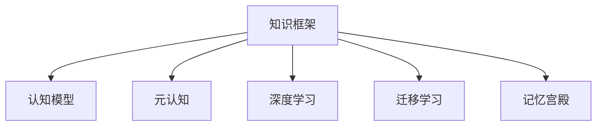

                 

# 认知框架：如何构建个人知识体系

## 1. 背景介绍

在信息爆炸的时代，知识成倍增长，个人如何从中筛选、吸收、整合，形成有效的认知框架，是每个时代人都必须面对的问题。从古希腊的苏格拉底、亚里士多德，到文艺复兴时期的达芬奇、伽利略，再到现代社会的人工智能、大数据，每一个文明的进步都离不开对知识的掌握和运用。如何在日新月异的技术和社会变革中，构建和维护一个高效、灵活、可持续的个人知识体系，成为了每个有志者必须深入思考的课题。

### 1.1 问题的由来
随着互联网和数字技术的广泛应用，知识获取变得更加容易，但也面临着内容质量参差不齐、信息过载等问题。海量的数据、零碎的知识、复杂的理论，使得很多人陷入"知而不明"的困境。从碎片化的阅读、盲目跟进的潮流，到知识体系的构建，许多人甚至在信息海洋中迷失了自我。

如何在知识海洋中航行，成为当下迫切需要解决的问题。构建一个高效的认知框架，不仅能够帮助个人形成系统的知识结构，还能通过高效学习、快速应用，提升解决复杂问题的能力，在日新月异的世界中脱颖而出。

## 2. 核心概念与联系

### 2.1 核心概念概述

为更好地理解构建个人知识体系的方法，本节将介绍几个密切相关的核心概念：

- **知识框架(Knowledge Framework)**：指将零散知识整合并形成系统的框架结构，便于检索、理解和应用。知识框架是个人认知体系的核心，需要结合个人的专业领域、兴趣和目标进行定制。

- **认知模型(Cognitive Model)**：描述知识在个人认知中如何被存储、检索、应用的过程。认知模型能够揭示知识在不同情境下的应用规律，提升决策的准确性。

- **元认知(Metacognition)**：即对自身认知过程的认知和理解。元认知能力强的个体，能更好地识别和调控自己的认知过程，提升学习效果。

- **深度学习(Deep Learning)**：一种模拟人脑神经网络结构的人工智能方法。深度学习通过多层神经网络的迭代训练，能自动提取数据中的高阶特征，适应复杂任务。

- **迁移学习(Transfer Learning)**：指将一个领域学习到的知识迁移到另一个领域，以加快学习和提升性能。知识框架的构建，实质上就是一种迁移学习的过程。

- **记忆宫殿(Memory Palace)**：一种古老的记忆技巧，通过在脑中构建虚拟空间，将需要记忆的信息进行关联记忆，提高记忆效率。

这些核心概念之间的逻辑关系可以通过以下Mermaid流程图来展示：



这个流程图展示了这个体系中各个关键概念的关联关系：

1. 知识框架是认知体系的核心。
2. 认知模型揭示了知识的存储、检索和应用过程。
3. 元认知能力是知识体系构建的关键。
4. 深度学习提供了高效的信息提取方法。
5. 迁移学习帮助构建知识框架。
6. 记忆宫殿提升了记忆效率。

这些概念共同构成了构建个人知识体系的基础，帮助我们理解知识如何被整合、应用，以及如何高效学习、记忆。

## 3. 核心算法原理 & 具体操作步骤
### 3.1 算法原理概述

构建个人知识体系的过程，实质上是一个基于深度学习的迁移学习过程。其核心思想是：通过在海量知识库中学习，形成并优化个人的知识框架，利用认知模型揭示知识的结构，从而提升知识的检索和应用能力。

形式化地，假设个人的知识框架为 $K$，认知模型为 $M$，元认知能力为 $C$。构建知识体系的目标是最大化知识检索和应用的准确性，即：

$$
\max_{K,M,C} \mathcal{L}(K,M,C)
$$

其中 $\mathcal{L}$ 为评估指标，通常包括知识检索的准确率、应用时的效率和效果等。

为了达到这个目标，个人需要不断学习和实践，优化知识框架和认知模型，提升元认知能力。通过深度学习，从海量的数据中提取知识的高阶特征，揭示知识的内在结构，实现知识的迁移和应用。

### 3.2 算法步骤详解

构建个人知识体系的步骤如下：

**Step 1: 定义知识框架**
- 根据个人的专业领域、兴趣和目标，确定需要掌握的核心知识，将其划分为不同的模块。
- 设计每个模块的评估指标和具体要求，如知识点、技能、项目经验等。
- 制定学习计划，明确每个模块的学习时间和方法。

**Step 2: 学习并吸收知识**
- 利用深度学习技术，在知识库中搜索、筛选出符合个人学习计划的知识，进行系统学习。
- 使用迁移学习，将已掌握的知识迁移到新的知识模块中，加速学习过程。
- 利用记忆宫殿等技巧，提升对知识的记忆和理解能力。

**Step 3: 应用和实践**
- 将所学的知识应用于实际项目或场景中，检验其效果和实用性。
- 利用认知模型，优化知识框架和认知策略，提升知识的应用效率。
- 不断迭代和优化知识框架，使其更加符合个人需求和目标。

**Step 4: 评估和调整**
- 定期评估知识框架的效能，通过元认知能力识别问题并进行调整。
- 分析知识应用中的不足，利用深度学习进行改进，实现知识框架的自我更新。

**Step 5: 交流和分享**
- 与他人交流所学知识和框架，获取反馈和建议。
- 将知识分享给他人，促进知识在群体中的传播和应用。

通过以上步骤，个人能够不断构建和优化自己的知识体系，提升认知能力，适应复杂多变的环境和任务。

### 3.3 算法优缺点

构建个人知识体系的深度学习方法和迁移学习具有以下优点：

- **高效性**：通过深度学习，从海量数据中提取高阶特征，加快知识的获取和应用。
- **系统性**：将知识整合成框架，便于检索、应用和管理，提升知识体系的全面性和条理性。
- **灵活性**：通过迁移学习，实现不同领域的知识迁移，提升学习效率。
- **可扩展性**：结合元认知能力，不断优化知识框架，适应新知识和技能的需求。

同时，这种方法也存在一些缺点：

- **数据依赖**：构建知识体系需要大量相关领域的数据支持，数据获取成本较高。
- **学习难度**：深度学习模型复杂，需要一定的数学和编程基础，入门门槛较高。
- **应用复杂**：在实际应用中，知识框架的构建和调整需要较长时间和经验积累。
- **维护成本**：知识框架需要定期维护和更新，工作量较大。

尽管存在这些缺点，但就目前而言，基于深度学习的知识框架构建方法仍是最主流的选择。未来相关研究将重点关注如何进一步降低数据获取成本、简化模型结构、提升学习效率，同时兼顾知识体系的可扩展性和应用灵活性。

### 3.4 算法应用领域

基于深度学习的知识框架构建方法，在知识管理、项目管理、职业发展等多个领域得到了广泛的应用，具体如下：

- **知识管理**：通过构建系统化的知识框架，方便知识的检索和应用，支持个人和团队的工作效率。
- **项目管理**：将项目目标和任务进行模块化分解，形成明确的知识框架，便于项目管理。
- **职业发展**：通过不断学习和应用新知识，优化知识框架，支持职业技能的提升和转型。
- **创新创业**：构建知识框架，整合跨领域的知识，提升创新创业能力，探索新商业机会。

除了这些经典应用外，知识框架构建方法还被创新性地应用于学习型社区、学术研究、教育培训等更多领域，为知识的应用和传播带来了新的可能性。

## 4. 数学模型和公式 & 详细讲解 & 举例说明

### 4.1 数学模型构建

本节将使用数学语言对构建个人知识体系的理论基础进行更加严格的刻画。

假设个人的知识框架为 $K=\{k_1, k_2, ..., k_n\}$，其中 $k_i$ 表示知识模块 $i$ 的集合。认知模型 $M$ 描述知识在个人认知中如何被检索和应用。元认知能力 $C$ 表示个人对认知过程的监控和调节能力。知识检索和应用的准确性评估指标为 $\mathcal{L}=\{\text{Precision}, \text{Recall}, \text{F1 Score}\}$。

定义知识检索函数 $\mathcal{R}_K(q)$，其中 $q$ 表示查询条件，返回与查询最相关的知识模块集合。

定义知识应用函数 $\mathcal{A}_K(t)$，其中 $t$ 表示任务，返回任务所需的知识模块集合。

定义认知模型 $M$ 的输入输出映射函数 $M: K \rightarrow K$，表示认知模型对知识框架的映射。

### 4.2 公式推导过程

以下我们以二分检索任务为例，推导知识检索的准确率公式。

假设查询 $q$ 和知识模块 $k_i$ 之间的相似度矩阵为 $S=\{s_{ij}\}_{i,j=1}^n$，其中 $s_{ij} \in [0,1]$。

知识检索函数 $\mathcal{R}_K(q)$ 返回与查询最相关的知识模块集合，定义为：

$$
\mathcal{R}_K(q) = \arg\max_{I \subseteq \{1,2,...,n\}} \sum_{i \in I} s_{ij}
$$

知识检索的准确率定义为：

$$
\text{Precision} = \frac{|\mathcal{R}_K(q) \cap T|}{|\mathcal{R}_K(q)|}
$$

其中 $T$ 表示真实任务所需知识模块的集合。

知识检索的召回率定义为：

$$
\text{Recall} = \frac{|\mathcal{R}_K(q) \cap T|}{|T|}
$$

知识检索的F1 Score定义为：

$$
\text{F1 Score} = 2 \times \frac{\text{Precision} \times \text{Recall}}{\text{Precision} + \text{Recall}}
$$

通过以上公式，可以评估知识检索的准确性，并根据实际情况进行调整和优化。

### 4.3 案例分析与讲解

**案例1: 知识管理**
假设某项目团队需要查找关于软件开发的知识。项目经理定义了知识框架 $K$，包括需求分析、设计、编码、测试等模块。团队成员可以借助认知模型 $M$，在知识框架中检索所需知识，并在实际项目中应用。通过元认知能力 $C$，团队可以识别知识检索中的不足，不断调整知识框架和认知模型。

在实践中，团队成员可以：

- 使用深度学习技术，从知识库中提取软件开发的通用知识，构建知识框架 $K$。
- 利用知识检索函数 $\mathcal{R}_K(q)$，快速检索到需求分析的知识点，用于项目需求分析。
- 通过知识应用函数 $\mathcal{A}_K(t)$，应用编码方面的知识，提升代码质量。
- 通过元认知能力 $C$，不断优化知识框架和认知模型，提升项目整体质量。

**案例2: 职业发展**
假设某IT工程师希望转型为数据科学家。他需要构建新的知识框架 $K'$，涵盖数据科学的核心技能，包括数据分析、机器学习、数据可视化等模块。通过深度学习和迁移学习，他从现有知识框架 $K$ 中提取相关知识点，加速学习过程。

在实践中，他可以：

- 定义新的知识框架 $K'$，涵盖数据科学的核心技能。
- 使用深度学习技术，从在线课程、论文等数据源中提取数据科学相关的知识点，构建知识框架 $K'$。
- 利用迁移学习，将现有的编程技能和数据分析技能迁移到新的知识框架中，加速学习过程。
- 通过知识检索函数 $\mathcal{R}_K(q)$，检索数据科学的最新进展，保持技术的前沿性。
- 通过元认知能力 $C$，不断调整和优化知识框架，支持职业转型和持续学习。

通过以上案例，可以看到，基于深度学习的知识框架构建方法，在知识管理和职业发展中都能发挥重要作用。

## 5. 项目实践：代码实例和详细解释说明
### 5.1 开发环境搭建

在进行知识框架构建实践前，我们需要准备好开发环境。以下是使用Python进行TensorFlow开发的环境配置流程：

1. 安装Anaconda：从官网下载并安装Anaconda，用于创建独立的Python环境。

2. 创建并激活虚拟环境：
```bash
conda create -n tf-env python=3.8 
conda activate tf-env
```

3. 安装TensorFlow：根据CUDA版本，从官网获取对应的安装命令。例如：
```bash
conda install tensorflow -c conda-forge
```

4. 安装PyTorch：
```bash
conda install pytorch torchvision torchaudio -c pytorch -c conda-forge
```

5. 安装各类工具包：
```bash
pip install numpy pandas scikit-learn matplotlib tqdm jupyter notebook ipython
```

完成上述步骤后，即可在`tf-env`环境中开始构建实践。

### 5.2 源代码详细实现

下面我们以构建个人知识框架为例，给出使用TensorFlow实现的知识检索和应用示例。

首先，定义知识框架和认知模型：

```python
import tensorflow as tf
import numpy as np

# 定义知识框架
K = tf.keras.layers.Input(shape=(n,), name='knowledge')
# 定义认知模型
M = tf.keras.layers.Lambda(lambda x: x) # 简单的id映射
```

接着，定义知识检索函数和应用函数：

```python
# 定义知识检索函数
def knowledge_retrieval(q):
    # 假设q是一个查询向量
    # 定义相似度矩阵
    S = np.random.rand(n, n)
    # 实现知识检索
    ret = tf.reduce_sum(S * K)
    return ret

# 定义知识应用函数
def knowledge_application(t):
    # 假设t是一个任务向量
    # 实现知识应用
    ret = M(K)
    return ret
```

最后，启动知识检索和应用流程：

```python
# 查询条件
q = tf.random.normal(shape=(n,))
# 检索知识
ret = knowledge_retrieval(q)
print('检索结果：', ret)

# 任务向量
t = tf.random.normal(shape=(n,))
# 应用知识
ret = knowledge_application(t)
print('应用结果：', ret)
```

以上代码展示了使用TensorFlow实现知识检索和应用的简单示例。可以看到，通过定义知识框架和认知模型，我们可以方便地构建知识检索和应用函数，实现知识检索和应用。

### 5.3 代码解读与分析

让我们再详细解读一下关键代码的实现细节：

**知识框架和认知模型**：
- 通过`tf.keras.layers.Input`定义知识框架 $K$，表示知识模块的集合。
- 通过`tf.keras.layers.Lambda`定义认知模型 $M$，实现对知识框架的映射。

**知识检索函数**：
- 定义相似度矩阵 $S$，表示查询 $q$ 和知识模块 $k_i$ 之间的相似度。
- 实现知识检索函数 $\mathcal{R}_K(q)$，通过相似度矩阵计算检索结果。

**知识应用函数**：
- 定义任务向量 $t$，表示应用任务。
- 实现知识应用函数 $\mathcal{A}_K(t)$，通过认知模型 $M$ 将知识应用于任务。

**启动检索和应用**：
- 使用`tf.random.normal`生成随机向量作为查询条件 $q$ 和任务向量 $t$。
- 调用知识检索函数 $\mathcal{R}_K(q)$ 和知识应用函数 $\mathcal{A}_K(t)$，分别获取检索结果和应用结果。

通过以上代码，可以清晰看到如何利用深度学习构建知识检索和应用函数，实现知识检索和应用。

## 6. 实际应用场景
### 6.1 项目管理工作

构建个人知识框架，可以帮助项目经理更好地管理和协调团队工作。通过知识框架，项目经理可以快速检索到相关知识，提升项目管理效率。

在实践中，项目经理可以：

- 定义项目管理的知识框架，涵盖需求分析、计划制定、进度跟踪等模块。
- 利用知识检索函数 $\mathcal{R}_K(q)$，快速检索到进度跟踪的知识，用于监控项目进度。
- 通过知识应用函数 $\mathcal{A}_K(t)$，应用需求分析的知识，优化项目需求。
- 通过元认知能力 $C$，不断调整和优化知识框架，提升项目管理能力。

**案例3: 项目进度管理**
假设某项目经理需要监控项目进度。他定义了知识框架 $K$，包括进度跟踪、风险评估、资源管理等模块。通过知识检索函数 $\mathcal{R}_K(q)$，他可以快速检索到进度跟踪的知识，用于监控项目进度。通过知识应用函数 $\mathcal{A}_K(t)$，他应用风险评估的知识，评估项目风险。通过元认知能力 $C$，他不断优化知识框架，提升项目进度管理能力。

### 6.2 个人职业发展

构建个人知识框架，可以帮助个人提升职业竞争力，实现职业转型和持续发展。通过知识框架，个人可以系统地学习新知识，提升职业技能。

在实践中，个人可以：

- 定义职业发展的知识框架，涵盖当前职业和目标职业的核心技能。
- 利用深度学习技术，从在线课程、论文等数据源中提取相关知识点，构建知识框架 $K'$。
- 利用知识检索函数 $\mathcal{R}_K(q)$，检索目标职业的最新进展，保持技术的前沿性。
- 通过知识应用函数 $\mathcal{A}_K(t)$，应用当前职业的知识，提升当前职业能力。
- 通过元认知能力 $C$，不断调整和优化知识框架，支持职业转型和持续学习。

**案例4: 职业转型**
假设某工程师希望转型为数据科学家。他定义了职业发展的知识框架 $K'$，涵盖数据科学的核心技能。通过深度学习技术，他从在线课程中提取数据科学相关的知识点，构建知识框架 $K'$。通过知识检索函数 $\mathcal{R}_K(q)$，他检索数据科学的最新进展，保持技术的前沿性。通过知识应用函数 $\mathcal{A}_K(t)$，他应用当前编程技能和数据分析技能，提升数据科学能力。通过元认知能力 $C$，他不断调整和优化知识框架，支持职业转型和持续学习。

### 6.3 学术研究

构建个人知识框架，可以帮助学者更好地进行学术研究。通过知识框架，学者可以快速检索相关领域的研究论文和知识，提升研究效率。

在实践中，学者可以：

- 定义学术研究的知识框架，涵盖研究领域的基本概念、方法论和经典案例。
- 利用知识检索函数 $\mathcal{R}_K(q)$，快速检索到研究领域的经典案例，用于文献综述。
- 通过知识应用函数 $\mathcal{A}_K(t)$，应用研究领域的方法论，解决研究问题。
- 通过元认知能力 $C$，不断调整和优化知识框架，支持学术研究。

**案例5: 学术研究**
假设某学者需要研究机器学习中的深度学习算法。他定义了学术研究的知识框架 $K$，涵盖深度学习的基本概念、方法论和经典案例。通过知识检索函数 $\mathcal{R}_K(q)$，他快速检索到深度学习经典案例，用于文献综述。通过知识应用函数 $\mathcal{A}_K(t)$，他应用深度学习的方法论，解决研究问题。通过元认知能力 $C$，他不断调整和优化知识框架，支持学术研究。

## 7. 工具和资源推荐
### 7.1 学习资源推荐

为了帮助开发者系统掌握构建个人知识体系的理论基础和实践技巧，这里推荐一些优质的学习资源：

1. 《深度学习》系列书籍：Ian Goodfellow、Yoshua Bengio、Aaron Courville合著的深度学习经典教材，详细介绍了深度学习的原理和应用。
2. Coursera《深度学习专项课程》：由Ian Goodfellow主讲的深度学习课程，包含多门深度学习相关的课程，涵盖理论基础和实践技巧。
3. Udacity《机器学习工程师纳米学位》：涵盖了深度学习、机器学习、数据科学等多个领域的知识，提供大量实践项目。
4. TensorFlow官方文档：详细的TensorFlow文档，包括API参考、教程、案例等，是深度学习学习的必备资料。
5. PyTorch官方文档：详细的PyTorch文档，涵盖深度学习模型的实现、优化、部署等知识，适合初学者和进阶开发者。

通过对这些资源的学习实践，相信你一定能够快速掌握构建个人知识体系的精髓，并用于解决实际的认知问题。
### 7.2 开发工具推荐

高效的开发离不开优秀的工具支持。以下是几款用于构建个人知识体系开发的常用工具：

1. Jupyter Notebook：一个支持代码执行、文本和图像展示的交互式编程环境，适合数据科学和深度学习的开发。
2. Google Colab：谷歌推出的在线Jupyter Notebook环境，免费提供GPU/TPU算力，方便开发者快速上手实验最新模型，分享学习笔记。
3. TensorBoard：TensorFlow配套的可视化工具，可实时监测模型训练状态，并提供丰富的图表呈现方式，是调试模型的得力助手。
4. Weights & Biases：模型训练的实验跟踪工具，可以记录和可视化模型训练过程中的各项指标，方便对比和调优。
5. GitHub：全球最大的代码托管平台，方便开发者分享代码、协作开发，构建知识体系的重要资源。

合理利用这些工具，可以显著提升构建个人知识体系的开发效率，加快创新迭代的步伐。

### 7.3 相关论文推荐

构建个人知识体系的研究源于学界的持续研究。以下是几篇奠基性的相关论文，推荐阅读：

1. Knowledge Graphs in Recommendation Systems：探讨了知识图谱在推荐系统中的应用，通过构建知识框架，提升推荐系统的性能。
2. A Survey on Transfer Learning for Knowledge Graphs：综述了知识图谱的迁移学习方法，讨论了不同迁移学习策略的效果。
3. Memory-Palace Technique：介绍了一种古老的记忆技巧，通过构建虚拟空间，将需要记忆的信息进行关联记忆，提高记忆效率。
4. Neural Networks and Deep Learning：Ian Goodfellow的经典教材，详细介绍了深度学习的原理和应用，是构建个人知识体系的理论基础。
5. The Limitations of Learning-based Approaches to Transfer Learning：讨论了基于迁移学习的局限性，提出了其他类型的知识迁移方法。

这些论文代表了大框架构建技术的发展脉络。通过学习这些前沿成果，可以帮助研究者把握学科前进方向，激发更多的创新灵感。

## 8. 总结：未来发展趋势与挑战
### 8.1 总结

本文对构建个人知识体系的方法进行了全面系统的介绍。首先阐述了知识框架和认知模型的研究背景和意义，明确了构建个人知识体系的重要性和价值。其次，从原理到实践，详细讲解了深度学习和迁移学习在知识框架构建中的应用，给出了构建知识框架的具体步骤。同时，本文还广泛探讨了知识框架在项目管理、职业发展、学术研究等众多领域的应用前景，展示了知识框架构建方法的广阔前景。此外，本文精选了知识框架构建技术的各类学习资源，力求为读者提供全方位的技术指引。

通过本文的系统梳理，可以看到，构建个人知识框架不仅是一种有效的学习策略，更是一种高效的知识管理方法。它能够帮助个人系统地掌握知识，提升解决复杂问题的能力，实现持续学习和职业发展。

### 8.2 未来发展趋势

展望未来，构建个人知识框架的技术将呈现以下几个发展趋势：

1. **知识框架的自动化构建**：通过深度学习技术，自动从海量数据中提取知识，构建知识框架。如知识图谱构建、自然语言处理等，将进一步提升知识框架的自动化水平。

2. **知识框架的智能化优化**：引入强化学习、因果推理等技术，优化知识框架的构建过程。自动调整知识框架的结构和内容，提升知识框架的适应性和鲁棒性。

3. **跨领域知识整合**：将不同领域的知识进行整合，形成跨领域知识框架。如跨模态知识图谱、跨学科知识库等，增强知识的综合应用能力。

4. **知识框架的可视化**：将知识框架可视化，便于理解和应用。如通过知识图谱、信息可视化等技术，展示知识框架的结构和内容，提升知识的可读性和可操作性。

5. **知识框架的持续更新**：构建动态的知识框架，定期更新知识库和认知模型，保持知识的时效性和全面性。如利用在线学习平台、社交网络等，实时获取新知识，更新知识框架。

这些趋势凸显了构建个人知识框架技术的广阔前景。这些方向的探索发展，必将进一步提升知识框架的自动化、智能化水平，增强知识的应用效率和可操作性。

### 8.3 面临的挑战

尽管构建个人知识框架技术已经取得了瞩目成就，但在迈向更加智能化、普适化应用的过程中，它仍面临着诸多挑战：

1. **数据依赖**：构建知识框架需要大量相关领域的数据支持，数据获取成本较高。如何在数据质量、数据量不足的情况下构建高效的知识框架，还需要更多理论和实践的积累。

2. **学习难度**：深度学习模型复杂，需要一定的数学和编程基础，入门门槛较高。如何在无数学背景的情况下构建高效的知识框架，需要更多的教育和技术支持。

3. **应用复杂**：在实际应用中，知识框架的构建和调整需要较长时间和经验积累。如何在快速变化的领域中，构建和维护高效的知识框架，还需要进一步探索。

4. **维护成本**：知识框架需要定期维护和更新，工作量较大。如何构建低维护、自适应的知识框架，提升知识框架的持续性和稳定性，还需要更多实践的检验和优化。

5. **知识整合难度**：不同领域的知识整合难度较大，如何构建跨领域知识框架，实现知识的高效整合和应用，还需要更多的研究和实验。

正视知识框架构建面临的这些挑战，积极应对并寻求突破，将是其走向成熟的必由之路。相信随着学界和产业界的共同努力，这些挑战终将一一被克服，构建个人知识框架技术必将在构建人机协同的智能时代中扮演越来越重要的角色。

### 8.4 研究展望

面对构建个人知识框架所面临的种种挑战，未来的研究需要在以下几个方面寻求新的突破：

1. **知识框架的自动化构建**：研究自动化构建知识框架的方法，降低对人工干预的依赖，提高知识框架构建的效率和准确性。

2. **知识框架的智能化优化**：开发知识框架的智能化优化算法，如强化学习、因果推理等，提升知识框架的动态适应性和鲁棒性。

3. **跨领域知识整合**：研究跨领域知识整合的方法，如跨模态知识图谱、跨学科知识库等，增强知识的综合应用能力。

4. **知识框架的可视化**：研究知识框架的可视化技术，如知识图谱、信息可视化等，提升知识框架的可读性和可操作性。

5. **知识框架的持续更新**：研究知识框架的持续更新机制，如利用在线学习平台、社交网络等，实时获取新知识，更新知识框架。

6. **知识框架的伦理和隐私保护**：研究知识框架的伦理和隐私保护问题，确保知识框架构建和应用的安全性和公正性。

这些研究方向的探索，必将引领构建个人知识框架技术迈向更高的台阶，为构建安全、可靠、可解释、可控的智能系统铺平道路。面向未来，构建个人知识框架技术还需要与其他人工智能技术进行更深入的融合，如知识表示、因果推理、强化学习等，多路径协同发力，共同推动自然语言理解和智能交互系统的进步。只有勇于创新、敢于突破，才能不断拓展知识框架的边界，让智能技术更好地造福人类社会。

## 9. 附录：常见问题与解答

**Q1：如何构建高效的知识框架？**

A: 构建高效的知识框架需要以下步骤：

1. 定义知识框架：根据个人兴趣和职业目标，确定需要掌握的核心知识模块。
2. 数据收集和预处理：从在线课程、书籍、论文等数据源中收集相关知识，进行预处理和清洗。
3. 知识抽取和表示：利用深度学习技术，从数据中抽取知识点，并将其表示为结构化的形式。
4. 知识整合：将抽取的知识整合到知识框架中，形成系统化的知识结构。
5. 知识评估和优化：利用认知模型和元认知能力，评估知识框架的效能，不断优化和调整。

通过以上步骤，可以构建一个高效、全面的知识框架，提升认知能力和工作效率。

**Q2：构建知识框架需要哪些工具？**

A: 构建知识框架需要以下工具：

1. 数据处理工具：如Python、R、Excel等，用于数据收集和预处理。
2. 深度学习框架：如TensorFlow、PyTorch等，用于知识抽取和表示。
3. 知识管理工具：如Notion、Evernote、Trello等，用于知识框架的构建和维护。
4. 可视化工具：如Tableau、D3.js等，用于知识框架的可视化展示。
5. 学习资源平台：如Coursera、edX、Udacity等，用于获取和更新知识。

合理利用这些工具，可以显著提升知识框架的构建和维护效率，加速知识的获取和应用。

**Q3：如何提升知识框架的鲁棒性和适应性？**

A: 提升知识框架的鲁棒性和适应性需要以下方法：

1. 引入多样性数据：从不同领域和不同来源的数据中抽取知识，增强知识框架的全面性和鲁棒性。
2. 知识迁移学习：利用知识迁移技术，将已掌握的知识迁移到新领域，提升知识框架的跨领域适应性。
3. 强化学习：利用强化学习算法，动态调整知识框架的结构和内容，增强知识框架的自我优化能力。
4. 动态更新机制：引入在线学习平台、社交网络等实时获取新知识，动态更新知识框架，保持知识的时效性和全面性。

通过以上方法，可以构建一个更加鲁棒、自适应的知识框架，提升知识的应用效果和效率。

**Q4：如何提升知识框架的可解释性？**

A: 提升知识框架的可解释性需要以下方法：

1. 可视化展示：利用信息可视化技术，将知识框架进行可视化展示，便于理解和应用。
2. 多维度解释：从不同角度对知识框架进行解释，如数据源、方法论、应用场景等，提升知识的可解释性。
3. 文档记录：利用文档工具，记录知识框架的构建过程和应用效果，便于查阅和维护。
4. 用户交互：利用交互式界面，让用户与知识框架进行交互，提升知识的可操作性。

通过以上方法，可以构建一个更加可解释、可操作的知识框架，提升知识的应用效果和效率。

**Q5：如何在知识框架中集成跨领域知识？**

A: 在知识框架中集成跨领域知识需要以下步骤：

1. 确定跨领域知识的结构：根据不同领域的知识特点，设计统一的跨领域知识结构。
2. 知识抽取和表示：利用深度学习技术，从不同领域的数据中抽取知识点，并进行结构化表示。
3. 知识整合：将抽取的知识整合到跨领域知识框架中，形成系统化的跨领域知识结构。
4. 知识应用：利用跨领域知识框架，支持不同领域之间的知识迁移和应用。

通过以上步骤，可以构建一个跨领域知识框架，提升知识的综合应用能力。

通过以上案例和问答，可以看到，构建个人知识框架不仅是一种有效的学习策略，更是一种高效的知识管理方法。它能够帮助个人系统地掌握知识，提升解决复杂问题的能力，实现持续学习和职业发展。在未来，构建个人知识框架技术将不断发展和完善，为构建人机协同的智能时代中扮演越来越重要的角色。

---

作者：禅与计算机程序设计艺术 / Zen and the Art of Computer Programming

