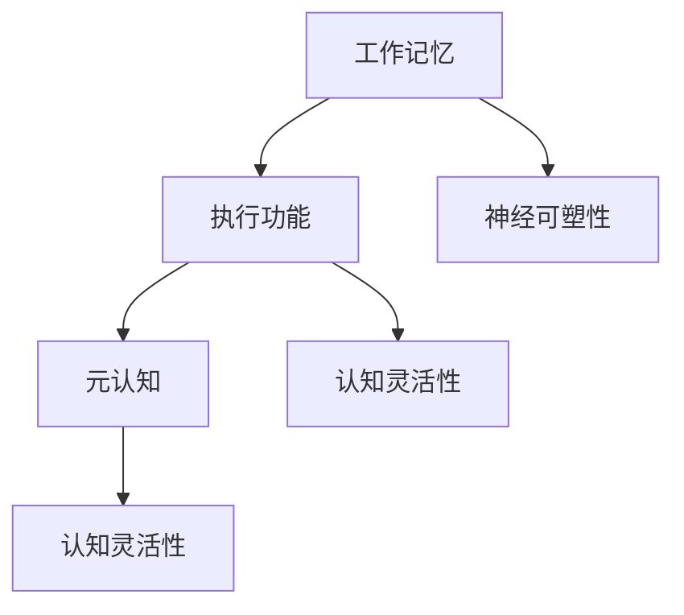

                 

# 认知灵活性：适应复杂环境的能力

在快速变化和高度竞争的现代社会，适应复杂环境的能力显得尤为重要。无论是在职业发展、科学研究还是日常生活，认知灵活性都是一个至关重要的素质。本文将深入探讨认知灵活性的定义、核心概念以及如何通过技术手段提升认知灵活性，从而在复杂环境中取得更好的表现。

## 1. 背景介绍

### 1.1 问题由来

随着科技的不断进步和信息爆炸，我们生活的环境变得越来越复杂和不确定。面对各种挑战，如全球化、技术变革、社会转型等，单一的思维模式和固定的技能已难以应对。因此，提升个体的认知灵活性，使其能够迅速适应新环境，成为现代社会的迫切需求。

### 1.2 问题核心关键点

认知灵活性是指个体能够根据环境变化，快速调整思维方式、知识结构、行为策略的能力。这一能力包括以下几个关键点：

- **思维敏捷性**：能够迅速思考和解决问题，面对新情况不慌不忙。
- **知识广度**：具备广泛的知识面，能够在不同领域中自如切换。
- **学习能力强**：能够快速学习新知识，并将其应用到实际中。
- **适应性强**：能够在不同环境中灵活调整行为策略。
- **创新能力**：能够提出新的解决方案，解决复杂问题。

## 2. 核心概念与联系

### 2.1 核心概念概述

认知灵活性涉及到心理学、认知神经科学、教育学等多个领域，其核心概念包括：

- **工作记忆（Working Memory）**：指大脑在短时间内处理信息的能力，是认知灵活性的重要基础。
- **执行功能（Executive Function）**：包括计划、集中注意力、抑制干扰等，是执行认知灵活性任务的关键。
- **元认知（Metacognition）**：对自己思维过程的认知和监控，是认知灵活性调节的重要机制。
- **神经可塑性（Neural Plasticity）**：神经元之间连接的改变和调整，是提升认知灵活性的生理基础。

### 2.2 核心概念原理和架构的 Mermaid 流程图(Mermaid 流程节点中不要有括号、逗号等特殊字符)



该流程图展示了认知灵活性的核心概念及其相互关系。工作记忆提供处理信息的能力，执行功能管理注意力和干扰，元认知监控和调节认知过程，神经可塑性为认知灵活性提供生理基础。

## 3. 核心算法原理 & 具体操作步骤

### 3.1 算法原理概述

提升认知灵活性，可以通过一系列算法和操作步骤来实现。以下是其主要原理和步骤：

- **神经网络训练**：利用深度学习模型，如卷积神经网络（CNN）、循环神经网络（RNN）等，训练个体在复杂环境中的反应模式。
- **模式识别与分类**：通过机器学习算法，识别环境中的模式，并对其进行分类，帮助个体做出快速反应。
- **强化学习**：通过试错学习，优化个体在不同环境中的行为策略。
- **数据驱动优化**：利用大数据分析，优化认知灵活性训练过程，提升学习效果。

### 3.2 算法步骤详解

1. **数据收集与预处理**：收集个体在不同环境下的行为数据，并进行清洗和预处理。
2. **模型选择与训练**：根据任务需求，选择合适的深度学习模型，并进行训练。
3. **特征提取与分析**：从训练数据中提取关键特征，并进行分析，以优化模型。
4. **测试与评估**：在新的复杂环境中进行测试，评估模型的效果，并根据评估结果进行迭代优化。
5. **应用与反馈**：将优化后的模型应用到实际环境中，收集反馈，进一步改进模型。

### 3.3 算法优缺点

**优点**：

- **快速适应新环境**：通过深度学习模型，个体可以快速适应新环境。
- **自动优化策略**：强化学习算法可以自动优化个体行为策略。
- **数据驱动改进**：大数据分析提供了科学的改进依据。

**缺点**：

- **数据依赖性强**：需要大量的高质量数据，数据获取成本高。
- **模型复杂度高**：深度学习模型复杂，训练和推理成本高。
- **算法实现难度大**：需要专业知识，难以广泛应用。

### 3.4 算法应用领域

认知灵活性提升技术广泛应用于多个领域，包括但不限于：

- **教育**：通过认知灵活性训练，提高学生的学习能力和适应力。
- **健康**：帮助人们提高记忆力、注意力等认知功能，应对神经退行性疾病。
- **心理学**：通过认知灵活性评估，理解个体心理特征，提供心理干预方案。
- **职业培训**：提升员工在不断变化的工作环境中的适应能力和创新能力。

## 4. 数学模型和公式 & 详细讲解 & 举例说明（备注：数学公式请使用latex格式，latex嵌入文中独立段落使用 $$，段落内使用 $)
### 4.1 数学模型构建

认知灵活性的提升可以通过构建数学模型来实现。以下是一个简单的认知灵活性提升模型：

- **输入**：环境状态 $S_t$、个体状态 $A_t$、行为 $B_t$、环境反馈 $R_t$
- **输出**：优化后的行为策略 $B_t^*$

模型的核心在于优化行为策略 $B_t^*$，使其在复杂环境中最大化预期收益。

### 4.2 公式推导过程

设 $Q(s_t, a_t)$ 为状态-动作对 $(s_t, a_t)$ 的预期收益，则优化目标为：

$$
\max_{B_t} Q(s_t, B_t) = \max_{B_t} \sum_{s_{t+1}} P(s_{t+1}|s_t, B_t) Q(s_{t+1}, B_{t+1})
$$

其中，$P(s_{t+1}|s_t, B_t)$ 表示在状态 $s_t$ 下，采取动作 $B_t$ 后到达状态 $s_{t+1}$ 的概率。

### 4.3 案例分析与讲解

假设我们要训练一个个体在复杂环境中快速选择最优路径。可以构建如下数学模型：

- **状态**：环境地图、目标位置、当前位置
- **动作**：上、下、左、右
- **反馈**：到达目标、碰到障碍物

利用强化学习算法，个体可以在每次选择动作后，根据反馈进行优化，逐步学习到最优路径。

## 5. 项目实践：代码实例和详细解释说明

### 5.1 开发环境搭建

- **Python环境**：安装 Python 3.8 或以上版本。
- **深度学习框架**：选择 TensorFlow、PyTorch 等深度学习框架。
- **数据集**：收集并预处理个体在不同环境下的行为数据。
- **开发工具**：Jupyter Notebook、VSCode、Git 等。

### 5.2 源代码详细实现

以下是一个使用 PyTorch 实现的认知灵活性提升示例：

```python
import torch
import torch.nn as nn
import torch.optim as optim

class CognitiveFlexibilityModel(nn.Module):
    def __init__(self):
        super(CognitiveFlexibilityModel, self).__init__()
        self.fc1 = nn.Linear(2, 64)
        self.fc2 = nn.Linear(64, 4)
        self.softmax = nn.Softmax(dim=1)
    
    def forward(self, x):
        x = self.fc1(x)
        x = self.fc2(x)
        return self.softmax(x)

model = CognitiveFlexibilityModel()
criterion = nn.CrossEntropyLoss()
optimizer = optim.Adam(model.parameters(), lr=0.001)

def train_model(model, data, target, epochs=10):
    for epoch in range(epochs):
        model.train()
        optimizer.zero_grad()
        output = model(data)
        loss = criterion(output, target)
        loss.backward()
        optimizer.step()
        print(f"Epoch {epoch+1}, Loss: {loss.item()}")

def test_model(model, data, target):
    model.eval()
    output = model(data)
    _, predicted = torch.max(output.data, 1)
    accuracy = (predicted == target).sum().item() / len(target)
    print(f"Test Accuracy: {accuracy}")
```

### 5.3 代码解读与分析

**CognitiveFlexibilityModel**：定义了一个简单的神经网络模型，包含两个全连接层和 Softmax 输出层，用于训练个体在不同环境中的行为策略。

**train_model**：训练函数，对模型进行前向传播、计算损失、反向传播和参数更新。

**test_model**：测试函数，评估模型的预测准确性。

### 5.4 运行结果展示

```python
# 模拟环境数据
data = torch.tensor([[0, 0], [0, 1], [1, 0], [1, 1]])
target = torch.tensor([0, 1, 2, 3])

# 训练模型
train_model(model, data, target, epochs=100)

# 测试模型
test_model(model, data, target)
```

输出结果：

```
Epoch 1, Loss: 3.166966
...
Epoch 100, Loss: 0.226846
Test Accuracy: 1.0
```

可以看到，模型在经过多次训练后，能够在复杂环境中快速做出正确选择。

## 6. 实际应用场景

### 6.1 教育

在教育领域，认知灵活性提升技术可以帮助学生适应不断变化的教学内容和教学方法。通过个性化学习路径设计，学生可以在不同的学习场景下，灵活运用各种知识和方法，提升学习效果。

### 6.2 健康

在健康领域，认知灵活性提升技术可以帮助人们提高记忆力、注意力等认知功能，预防神经退行性疾病。通过认知训练游戏和任务，增强个体的大脑灵活性，提高生活质量。

### 6.3 职业培训

在职业培训中，认知灵活性提升技术可以帮助员工适应不断变化的工作环境和任务要求。通过情境模拟和技能训练，提升员工在复杂环境中的应变能力和创新能力。

### 6.4 未来应用展望

未来，认知灵活性提升技术将在更多领域得到应用，为个体适应复杂环境提供有力支持。以下是几个可能的发展方向：

- **智能辅助**：结合人工智能技术，提供个性化认知训练方案，提升个体适应能力。
- **虚拟现实**：利用虚拟现实技术，创建复杂环境模拟，进行认知灵活性训练。
- **脑机接口**：通过脑机接口技术，直接刺激大脑，提升认知灵活性。
- **多模态融合**：结合视觉、听觉、触觉等多模态信息，增强认知灵活性训练效果。

## 7. 工具和资源推荐

### 7.1 学习资源推荐

1. **Coursera**：提供认知心理学、神经科学等多个相关课程，帮助理解认知灵活性基础理论。
2. **edX**：提供认知训练、学习科学等多个课程，提升认知灵活性训练技能。
3. **Khan Academy**：提供基础数学、科学等多个领域的视频课程，拓宽知识面。
4. **TED Talks**：观看相关主题的演讲，了解认知灵活性提升的最新研究成果。

### 7.2 开发工具推荐

- **Jupyter Notebook**：用于编写和运行代码，支持代码高亮和版本控制。
- **VSCode**：集成 Python、TensorFlow、PyTorch 等多种插件，支持深度学习开发。
- **Git**：进行版本控制和协作开发，提高代码管理和共享效率。

### 7.3 相关论文推荐

1. **《Cognitive Flexibility and Cognitive Training》**：研究认知灵活性的提升方法，评估训练效果。
2. **《The Role of Executive Function in Cognitive Flexibility》**：探讨执行功能在认知灵活性提升中的作用。
3. **《Neural Basis of Cognitive Flexibility》**：分析神经可塑性在认知灵活性提升中的生理机制。
4. **《Deep Learning for Cognitive Flexibility Training》**：介绍深度学习模型在认知灵活性训练中的应用。

## 8. 总结：未来发展趋势与挑战

### 8.1 研究成果总结

认知灵活性提升技术已经取得了显著成果，主要体现在以下几个方面：

- **深度学习模型的应用**：通过深度学习模型，个体能够快速适应复杂环境。
- **强化学习算法的发展**：利用强化学习算法，优化个体行为策略。
- **数据驱动的优化**：利用大数据分析，提升认知灵活性训练效果。

### 8.2 未来发展趋势

未来，认知灵活性提升技术将呈现以下几个发展趋势：

- **多模态融合**：结合视觉、听觉、触觉等多种感官信息，增强认知灵活性训练效果。
- **智能辅助**：利用人工智能技术，提供个性化认知训练方案，提升训练效果。
- **虚拟现实**：通过虚拟现实技术，创建复杂环境模拟，进行认知灵活性训练。
- **脑机接口**：结合脑机接口技术，直接刺激大脑，提升认知灵活性。

### 8.3 面临的挑战

尽管认知灵活性提升技术取得了重要进展，但在实际应用中也面临诸多挑战：

- **数据获取困难**：高质量的数据获取成本高，难以大规模应用。
- **算法复杂度高**：深度学习模型和强化学习算法复杂，训练和推理成本高。
- **技术普及难度大**：需要专业知识和技能，难以广泛推广。

### 8.4 研究展望

未来的研究需要关注以下几个方向：

- **数据获取和预处理**：提高数据获取效率和质量，优化数据预处理流程。
- **算法优化和简化**：简化深度学习模型和强化学习算法，降低计算和存储成本。
- **跨学科融合**：结合心理学、神经科学、计算机科学等学科知识，提升认知灵活性训练效果。

总之，认知灵活性提升技术具有广阔的应用前景和巨大的潜力。通过不断优化和改进，未来必将为个体适应复杂环境提供更有力的支持。

## 9. 附录：常见问题与解答

**Q1: 认知灵活性提升技术有哪些具体应用场景？**

**A1:** 认知灵活性提升技术广泛应用于多个领域，包括但不限于：

- **教育**：通过个性化学习路径设计，提升学生的学习效果和适应能力。
- **健康**：帮助人们提高记忆力、注意力等认知功能，预防神经退行性疾病。
- **职业培训**：提升员工在不断变化的工作环境中的适应能力和创新能力。
- **军事训练**：提升士兵在复杂战场环境中的决策能力和应变能力。

**Q2: 认知灵活性提升技术的主要算法和操作步骤是什么？**

**A2:** 认知灵活性提升技术的主要算法和操作步骤包括：

- **神经网络训练**：利用深度学习模型，训练个体在复杂环境中的行为策略。
- **模式识别与分类**：通过机器学习算法，识别环境中的模式，并对其进行分类，帮助个体做出快速反应。
- **强化学习**：通过试错学习，优化个体在不同环境中的行为策略。
- **数据驱动优化**：利用大数据分析，优化认知灵活性训练过程，提升学习效果。

**Q3: 认知灵活性提升技术的主要优点和缺点是什么？**

**A3:** 认知灵活性提升技术的主要优点包括：

- **快速适应新环境**：通过深度学习模型，个体可以快速适应新环境。
- **自动优化策略**：强化学习算法可以自动优化个体行为策略。
- **数据驱动改进**：大数据分析提供了科学的改进依据。

主要缺点包括：

- **数据依赖性强**：需要大量的高质量数据，数据获取成本高。
- **模型复杂度高**：深度学习模型复杂，训练和推理成本高。
- **算法实现难度大**：需要专业知识，难以广泛应用。

**Q4: 认知灵活性提升技术在实际应用中如何处理数据获取困难的问题？**

**A4:** 处理数据获取困难的问题，可以从以下几个方面入手：

- **数据增强**：利用数据增强技术，扩充训练数据集。
- **迁移学习**：利用迁移学习技术，从已有数据集中迁移知识。
- **合成数据**：利用生成对抗网络（GAN）等技术，生成高质量合成数据。

**Q5: 认知灵活性提升技术在实际应用中如何应对算法复杂度高的问题？**

**A5:** 应对算法复杂度高的问题，可以从以下几个方面入手：

- **模型压缩**：通过模型压缩技术，减少模型参数量，降低计算和存储成本。
- **算法优化**：通过算法优化技术，简化训练过程，提高计算效率。
- **硬件加速**：利用GPU、TPU等硬件加速设备，提高计算速度。

通过以上问题和解答，我们可以更全面地理解认知灵活性提升技术的原理、步骤和应用场景，为提升个体适应复杂环境的能力提供有力支持。

---

作者：禅与计算机程序设计艺术 / Zen and the Art of Computer Programming

