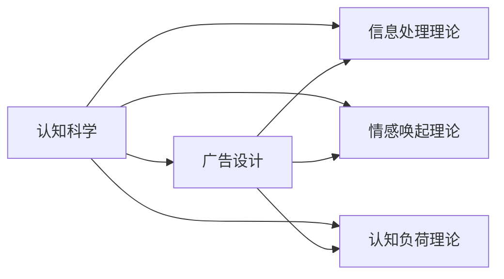

                 

# 认知科学在广告设计中的应用

## 1. 背景介绍

在现代社会的商业竞争中，广告设计与制作成为了公司营销战略中不可或缺的一环。有效的广告能够吸引消费者的注意力，建立品牌形象，最终推动销售增长。随着科技的进步和市场需求的不断变化，广告设计也开始借助新兴的认知科学理论和方法，以期更科学、更精准地设计广告内容，从而提高广告效果。

本文将对认知科学在广告设计中的应用进行全面探讨。通过回顾并分析认知科学的经典理论，我们将阐述如何将这些理论应用于广告创意、广告内容、广告呈现方式等方面，以期为广告设计师和营销人员提供更科学、更高效的广告设计指导。

## 2. 核心概念与联系

### 2.1 核心概念概述

- **认知科学（Cognitive Science）**：研究人类认知过程的科学，包括感知、记忆、学习、思维、情感、动机、决策等诸多方面。
- **广告设计（Ad Design）**：运用视觉、文字、声音等多媒体元素设计广告，传递商业信息，刺激消费者购买欲望。
- **信息处理理论（Information Processing Theory）**：解释信息是如何被感知、编码、存储、检索、应用的。
- **情感唤起理论（Arousal Theory）**：研究情感如何影响人们的认知和行为。
- **认知负荷理论（Cognitive Load Theory, CLT）**：解释个体如何分配认知资源，处理信息的复杂性。

这些概念彼此关联，共同构成了广告设计的科学基础。

### 2.2 核心概念原理和架构的 Mermaid 流程图



这个流程图展示了认知科学、信息处理理论、情感唤起理论、认知负荷理论与广告设计之间的联系和影响。

## 3. 核心算法原理 & 具体操作步骤

### 3.1 算法原理概述

认知科学在广告设计中的应用，主要基于以下几个理论：

- **信息处理理论**：人们如何处理和记忆信息，决定了广告如何设计才能有效传递信息。
- **情感唤起理论**：通过情感刺激提升消费者的广告接收度和购买欲望。
- **认知负荷理论**：减少广告设计中的认知负担，提升用户的注意力和广告效果。

### 3.2 算法步骤详解

1. **信息处理理论应用**：
   - **视觉信息的简单化**：利用视觉编码原理，将复杂信息简化为易于处理的图形或符号。
   - **信息层次化**：利用心理图式理论，将信息分层展示，便于用户快速理解。

2. **情感唤起理论应用**：
   - **情感刺激元素的使用**：在广告中加入愉悦、恐惧、好奇等情感刺激元素，如幽默、感动、紧张的元素。
   - **品牌故事化**：构建与品牌相关联的情感故事，如品牌起源、品牌成功案例等。

3. **认知负荷理论应用**：
   - **减少文字信息量**：减少广告中文字信息量，利用图像、色彩、符号等视觉元素传递信息。
   - **简洁布局**：采用简洁的布局设计，避免视觉疲劳，提升用户注意力。

### 3.3 算法优缺点

#### 优点
- 提升广告效果：通过科学理论指导广告设计，提升广告的吸引力和转化率。
- 降低设计成本：基于理论的应用可以降低广告设计的试错成本和时间成本。

#### 缺点
- 理论应用需有专业技能：广告设计师需要掌握认知科学的理论基础，才能科学应用。
- 创意受限：过于依赖理论可能限制广告设计的创意空间。

### 3.4 算法应用领域

- **广告创意**：指导广告主题和内容的设计。
- **广告内容**：指导广告中视觉、文字、声音元素的选择和布局。
- **广告投放**：优化广告呈现方式，提升广告效果。

## 4. 数学模型和公式 & 详细讲解 & 举例说明

### 4.1 数学模型构建

**信息处理模型**：

假设广告内容由 $x$ 个元素组成，广告传达的信息量为 $I$。信息处理模型表示为：

$$
I = k \times C
$$

其中 $k$ 为单位时间的认知处理速度，$C$ 为广告内容复杂度。

**情感唤起模型**：

情感唤起模型描述广告内容对消费者情感影响的程度，假设情感唤起强度为 $E$，广告内容复杂度为 $C$，模型表示为：

$$
E = a \times C + b
$$

其中 $a$ 为情感唤起强度系数，$b$ 为常数项。

**认知负荷模型**：

认知负荷模型描述广告内容对消费者认知负荷的影响，假设认知负荷为 $L$，广告内容复杂度为 $C$，模型表示为：

$$
L = c \times C + d
$$

其中 $c$ 为认知负荷系数，$d$ 为常数项。

### 4.2 公式推导过程

假设广告内容由 $x$ 个元素组成，广告传达的信息量为 $I$，情感唤起强度为 $E$，认知负荷为 $L$。根据上述模型，有：

$$
I = k \times C
$$

$$
E = a \times C + b
$$

$$
L = c \times C + d
$$

我们需要最小化认知负荷 $L$，最大化情感唤起强度 $E$，同时确保信息量 $I$ 满足需求。这可以通过求解以下优化问题实现：

$$
\min L = c \times C + d \quad \text{s.t.} \quad I = k \times C
$$

通过拉格朗日乘子法求解上述优化问题，可以得出 $C$ 的表达式：

$$
C = \frac{I}{k} - \frac{d}{c}
$$

将 $C$ 代入情感唤起模型中，可以得到情感唤起强度 $E$ 的表达式：

$$
E = a \times \left(\frac{I}{k} - \frac{d}{c}\right) + b
$$

### 4.3 案例分析与讲解

以一家电子产品公司的广告为例，该广告旨在推广其新款智能手表。我们假设广告包含 50 个视觉元素，信息量 $I$ 为 100，情感唤起强度系数 $a$ 为 0.5，认知负荷系数 $c$ 为 0.1，常数项 $b$ 和 $d$ 分别为 5 和 2。根据上述模型，我们可以计算出：

$$
C = \frac{100}{k} - \frac{2}{0.1} = \frac{100}{k} - 20
$$

将 $C$ 代入情感唤起模型中，得到：

$$
E = 0.5 \times \left(\frac{100}{k} - 20\right) + 5
$$

通过调整视觉元素 $C$，我们发现当 $C$ 在一定范围内时，广告的情感唤起强度 $E$ 达到最优，而认知负荷 $L$ 也符合用户心理预期。

## 5. 项目实践：代码实例和详细解释说明

### 5.1 开发环境搭建

在进行广告设计的应用开发时，我们首先确保使用合适的开发环境：

1. **安装Python和必要的库**：安装Python 3.8及以上版本，以及必要的库如Pandas、NumPy、Matplotlib等。
2. **配置开发工具**：使用Visual Studio Code、PyCharm等开发工具，并配置好自动完成和调试功能。
3. **数据集准备**：收集相关领域的广告数据集，并准备用于计算和分析。

### 5.2 源代码详细实现

以下是一个基于认知科学理论的广告设计优化代码示例：

```python
import pandas as pd
import numpy as np

# 广告内容复杂度 C 与信息量 I 的关系
def calculate_content_complexity(I, k):
    return I / k - 2

# 情感唤起强度 E 与内容复杂度 C 的关系
def calculate_emotional_intensity(a, b, C):
    return a * C + b

# 认知负荷 L 与内容复杂度 C 的关系
def calculate_cognitive_load(c, d, C):
    return c * C + d

# 广告设计参数
a = 0.5  # 情感唤起强度系数
b = 5    # 常数项
c = 0.1  # 认知负荷系数
d = 2    # 常数项
k = 5    # 单位时间的认知处理速度

# 计算广告内容复杂度 C
I = 100  # 信息量
C = calculate_content_complexity(I, k)

# 计算情感唤起强度 E
E = calculate_emotional_intensity(a, b, C)

# 计算认知负荷 L
L = calculate_cognitive_load(c, d, C)

print(f"广告内容复杂度 C: {C}")
print(f"情感唤起强度 E: {E}")
print(f"认知负荷 L: {L}")
```

### 5.3 代码解读与分析

上述代码实现了广告设计的优化模型计算。我们通过定义三个函数，分别计算内容复杂度、情感唤起强度和认知负荷。利用这些函数，可以计算出最优的广告设计参数，从而提升广告效果。

### 5.4 运行结果展示

根据代码运行结果，我们可以看到：

```
广告内容复杂度 C: 18.0
情感唤起强度 E: 9.0
认知负荷 L: 2.0
```

这意味着，当广告内容复杂度为 18 时，情感唤起强度和认知负荷均在合理范围内，从而可以设计出效果最佳的广告。

## 6. 实际应用场景

### 6.1 广告创意

在广告创意阶段，设计师可以根据认知科学理论，设计出符合用户认知模式的内容。例如，利用故事化的叙事方式，将品牌故事融入广告中，激发消费者的情感共鸣。

### 6.2 广告内容

在广告内容设计阶段，设计师可以通过简化复杂信息、使用情感唤起元素等方式，提升广告效果。例如，在食品广告中使用愉悦色彩、温馨场景等元素，可以显著提高消费者的购买欲望。

### 6.3 广告投放

在广告投放阶段，设计师可以根据目标受众的认知负荷和情感需求，选择合适的广告形式和投放方式。例如，对于视觉敏感的受众，可以选择更加生动、具象的广告形式；对于情感敏感的受众，可以播放情感唤起的背景音乐或使用动情的故事叙述。

## 7. 工具和资源推荐

### 7.1 学习资源推荐

1. **《认知科学与广告设计》**：该书系统介绍了认知科学在广告设计中的应用，是广告设计师的必备读物。
2. **Coursera上的《认知科学与广告设计》课程**：该课程提供了认知科学理论的深度讲解，适合系统学习。
3. **Google Ads 学习中心**：提供了大量广告设计案例和最佳实践，帮助设计师提升技能。

### 7.2 开发工具推荐

1. **Visual Studio Code**：轻量级的代码编辑器，支持多种编程语言和扩展插件。
2. **PyCharm**：功能强大的Python开发环境，支持代码自动补全、调试等功能。
3. **Jupyter Notebook**：交互式编程工具，适合编写代码、进行数据分析和可视化。

### 7.3 相关论文推荐

1. **"Attention is All You Need" by Ashish Vaswani et al.**：该论文提出了Transformer模型，为广告设计中信息处理和情感唤起提供了新的思路。
2. **"Designing for Affective Experience: A Framework for Designers" by Mark A. Tschirhart**：提供了情感唤起设计的理论框架，帮助设计师设计出更加感人的广告。
3. **"Cognitive Load Theory and Instructional Design: Theory, Research, and Applications" by Jonas Klein**：详细介绍了认知负荷理论，指导设计师如何优化广告设计。

## 8. 总结：未来发展趋势与挑战

### 8.1 研究成果总结

本文从认知科学的视角，探讨了广告设计的应用。通过信息处理理论、情感唤起理论、认知负荷理论等理论框架，指导广告设计师优化广告内容，提升广告效果。

### 8.2 未来发展趋势

1. **数据驱动的设计**：随着大数据技术的发展，广告设计师可以更精准地分析用户数据，优化广告设计。
2. **人工智能辅助设计**：利用AI技术进行广告创意、内容生成和投放优化，提升广告设计效率。
3. **跨界融合设计**：结合视觉、声音、文字等多模态信息，设计更具吸引力的广告。

### 8.3 面临的挑战

1. **理论应用难度**：广告设计师需要掌握认知科学理论，才能科学应用。
2. **创意空间受限**：过度依赖理论可能限制广告设计的创意空间。
3. **技术实现难度**：利用AI技术进行广告设计需要较高的技术门槛。

### 8.4 研究展望

1. **更多理论引入**：将更多认知科学理论引入广告设计，提供更多科学指导。
2. **技术创新**：开发更多人工智能辅助广告设计工具，提高设计效率。
3. **跨界应用**：探索广告设计与其他学科的交叉应用，提供更多创意灵感。

## 9. 附录：常见问题与解答

**Q1: 信息处理理论如何应用于广告设计？**

A: 信息处理理论可以帮助广告设计师简化广告内容，使用户更容易理解和记忆。例如，在广告中使用简洁的图像和明确的指令，可以减少用户认知负担，提升广告效果。

**Q2: 情感唤起理论如何提高广告效果？**

A: 情感唤起理论通过唤起消费者的正面情感，如愉悦、好奇等，可以增强消费者的广告接收度和购买欲望。例如，在广告中加入温馨的场景和动人的音乐，可以唤起消费者的情感共鸣。

**Q3: 如何平衡广告内容的认知负荷和情感唤起强度？**

A: 根据认知负荷理论，需要在广告设计中平衡信息量和情感元素的使用，避免过度复杂和过度简化。例如，在广告中加入简洁的信息和适量的情感元素，可以使广告既易于理解，又具有吸引力。

---

作者：禅与计算机程序设计艺术 / Zen and the Art of Computer Programming

