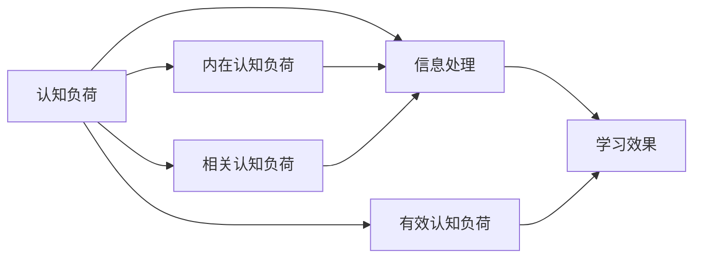

                 

# 认知负荷与信息设计：优化学习体验

## 1. 背景介绍

### 1.1 问题由来

随着信息技术的普及和互联网的广泛应用，人类已经步入信息爆炸的时代。信息无处不在，如何从海量数据中筛选、组织和提取有用的知识，成为了摆在现代人面前的一项重大挑战。在教育和学习领域，这一挑战尤为突出。教师和教育技术专家们致力于通过各种方式，提升学习者的学习效率和效果，实现认知负荷的合理分配。

### 1.2 问题核心关键点

当前，认知负荷理论和学习设计领域的研究者们普遍认同，信息处理过程中的认知负荷是学习效果的重要决定因素。认知负荷理论（Cognitive Load Theory, CLT）由瑞士心理学家让-罗杰·施瓦布（Jean Roger Schwab）在20世纪90年代初提出，认为信息处理需要占用认知资源，过多的信息处理会导致认知负荷过重，进而影响学习效果。因此，在设计学习资源时，需要合理控制认知负荷，避免因信息过载导致的认知负荷过重。

认知负荷理论将认知负荷分为三类：

1. **内在认知负荷**（Intrinsic Cognitive Load）：信息本身的难度和复杂度决定了内在认知负荷的大小。越复杂、越抽象的信息，需要的认知处理资源就越多。
2. **相关认知负荷**（Extraneous Cognitive Load）：设计上的不必要负担，如冗余信息、不合理的表述方式等，会导致相关认知负荷的增加。
3. **有效认知负荷**（Geldofic Cognitive Load）：通过优化设计，将内在认知负荷转化为有效认知负荷，从而提升学习效果。

有效的学习体验要求将内在认知负荷控制在合理范围内，同时减少相关认知负荷，最大化有效认知负荷。这就需要我们深入理解认知负荷的理论基础，并在此基础上进行信息设计，以优化学习体验。

### 1.3 问题研究意义

认知负荷理论的提出，为教育和学习设计提供了重要的理论指导，尤其是在信息技术驱动的教育创新中，如何通过合理的信息设计，减轻学习者的认知负荷，优化学习体验，成为教育技术研究的热点问题。

具体而言，认知负荷与信息设计的研究意义如下：

1. **提升学习效果**：通过合理分配认知负荷，避免过重的认知负担，有助于提高学习者的信息吸收能力和理解深度。
2. **促进主动学习**：设计能引发学习者主动思考和探究的学习材料，激发学习动机，提升学习兴趣。
3. **优化资源配置**：优化资源设计，减少无关信息，将有限的资源用于更有效的学习活动。
4. **增强信息记忆**：通过减少认知负荷，提高学习者对信息的记忆和保留能力，促进知识的长期储存。
5. **支持个性化学习**：根据学习者的认知能力和学习风格，调整信息呈现方式和难度，实现个性化教学。

总之，认知负荷与信息设计的研究，不仅有助于提升学习效果，还能为教育技术的发展提供新的思路和方法，推动教育信息化和智能化进程。

## 2. 核心概念与联系

### 2.1 核心概念概述

为更好地理解认知负荷与信息设计，本节将介绍几个关键概念：

- **认知负荷**（Cognitive Load）：指人在信息处理过程中所消耗的认知资源，包括内在认知负荷、相关认知负荷和有效认知负荷。
- **信息设计**（Information Design）：通过合理安排信息的呈现方式和组织结构，降低认知负荷，提升学习效果。
- **信息处理**（Information Processing）：学习者对信息的接收、解码、加工和存储的过程。
- **学习效果**（Learning Outcomes）：通过信息设计优化学习体验，提升学习者的知识掌握、理解能力和应用能力。

这些概念之间的联系可以通过以下Mermaid流程图来展示：



这个流程图展示了一些关键概念及其关系：

1. 认知负荷是信息处理的基础，直接决定了学习效果。
2. 内在认知负荷由信息本身的难度和复杂度决定。
3. 相关认知负荷由信息呈现方式和组织结构决定。
4. 有效认知负荷通过信息设计来提升，从而优化学习效果。

## 3. 核心算法原理 & 具体操作步骤
### 3.1 算法原理概述

认知负荷与信息设计的核心原理是通过合理的信息设计，降低学习者在信息处理过程中的认知负荷，提升学习效果。具体来说，认知负荷与信息设计的算法原理如下：

1. **信息选择与过滤**：根据学习目标和需求，选择必要的信息，过滤无关信息，降低内在认知负荷。
2. **信息结构化**：通过合理的组织结构和层次关系，帮助学习者更好地理解和记忆信息，减少相关认知负荷。
3. **信息可视化**：使用图表、符号、颜色等可视化手段，增强信息的呈现效果，提升学习者的信息处理能力。
4. **信息交互设计**：设计互动式的学习活动，鼓励学习者的主动参与，提高学习兴趣和动机。

### 3.2 算法步骤详解

基于认知负荷理论，认知负荷与信息设计的一般步骤包括：

1. **需求分析**：明确学习目标、学习者的认知能力和学习风格，识别信息处理过程中可能遇到的认知负荷。
2. **信息选择与过滤**：选择与学习目标最相关、难度适中的信息，去除冗余和无关信息，降低内在认知负荷。
3. **信息结构化**：设计清晰的层次结构和组织方式，将信息分成易于处理的小模块，减少相关认知负荷。
4. **信息可视化**：使用图表、符号、颜色等可视化手段，增强信息的可读性和吸引力，提升学习者的信息处理能力。
5. **信息交互设计**：设计互动式学习活动，鼓励学习者的主动参与，提高学习兴趣和动机。

### 3.3 算法优缺点

认知负荷与信息设计的优点如下：

1. **提升学习效果**：通过合理的信息设计，降低认知负荷，有助于提高学习者的信息吸收能力和理解深度。
2. **促进主动学习**：设计能引发学习者主动思考和探究的学习材料，激发学习动机，提升学习兴趣。
3. **优化资源配置**：优化资源设计，减少无关信息，将有限的资源用于更有效的学习活动。
4. **增强信息记忆**：通过减少认知负荷，提高学习者对信息的记忆和保留能力，促进知识的长期储存。
5. **支持个性化学习**：根据学习者的认知能力和学习风格，调整信息呈现方式和难度，实现个性化教学。

认知负荷与信息设计的缺点包括：

1. **设计复杂**：信息设计需要根据具体学习目标和内容，进行综合考虑，设计过程相对复杂。
2. **对资源要求高**：设计出优秀的信息呈现方式需要一定的技术支持，对资源要求较高。
3. **需要培训**：学习者需要适应新的信息呈现方式，可能需要一定的培训和学习适应期。
4. **效果依赖设计**：信息设计的效果取决于设计的合理性，设计不当可能导致认知负荷的增加。

### 3.4 算法应用领域

认知负荷与信息设计在多个领域都有广泛应用，具体如下：

1. **教育领域**：在教材、课件、在线课程等教育资源的设计中，合理控制认知负荷，提升学生的学习效果。
2. **商业领域**：在广告、网站、APP等商业信息的设计中，通过减少信息量，提升用户体验和转化率。
3. **医疗领域**：在医疗信息的设计中，使用图表、符号等可视化手段，帮助医生和患者更好地理解复杂的信息。
4. **政府领域**：在政策文件、法规规章的设计中，使用清晰的结构层次，减少相关认知负荷，提高公众理解和遵从度。
5. **公共服务领域**：在政府服务、社区公告、公益广告等的设计中，使用简洁明了的表达方式，降低认知负荷，提升服务质量。

这些应用领域展示了认知负荷与信息设计的广泛适用性，说明其对于提升信息理解和处理能力具有重要意义。

## 4. 数学模型和公式 & 详细讲解 & 举例说明
### 4.1 数学模型构建

认知负荷与信息设计的数学模型建立在认知负荷理论的基础上，可以用以下几个公式来表示：

1. **内在认知负荷公式**：

$$
I_{\text{in}} = K \cdot C
$$

其中，$I_{\text{in}}$ 表示内在认知负荷，$K$ 表示信息的复杂度，$C$ 表示学习者的认知能力。

2. **相关认知负荷公式**：

$$
I_{\text{re}} = \lambda_{\text{re}} \cdot C_{\text{re}}
$$

其中，$I_{\text{re}}$ 表示相关认知负荷，$\lambda_{\text{re}}$ 表示冗余信息的比率，$C_{\text{re}}$ 表示冗余信息的影响度。

3. **有效认知负荷公式**：

$$
I_{\text{ef}} = I_{\text{in}} - I_{\text{re}}
$$

其中，$I_{\text{ef}}$ 表示有效认知负荷，$I_{\text{in}}$ 表示内在认知负荷，$I_{\text{re}}$ 表示相关认知负荷。

### 4.2 公式推导过程

以上三个公式的推导过程如下：

1. **内在认知负荷公式**：

$$
I_{\text{in}} = K \cdot C
$$

该公式基于信息复杂度$K$和学习者认知能力$C$的乘积，表示信息复杂度越高，需要的认知能力越强，内在认知负荷越大。

2. **相关认知负荷公式**：

$$
I_{\text{re}} = \lambda_{\text{re}} \cdot C_{\text{re}}
$$

该公式基于冗余信息比率$\lambda_{\text{re}}$和冗余信息的影响度$C_{\text{re}}$，表示冗余信息占用的认知资源，越高，相关认知负荷越大。

3. **有效认知负荷公式**：

$$
I_{\text{ef}} = I_{\text{in}} - I_{\text{re}}
$$

该公式表示有效认知负荷，即在控制了内在认知负荷和相关认知负荷后，学习者可用的认知资源。

### 4.3 案例分析与讲解

以下是一个简单的案例分析，说明如何使用数学模型计算认知负荷：

假设有一个关于细胞生物学的在线课程，课程中包含以下信息：

- 细胞结构的描述：文本信息，难度适中。
- 细胞功能的动画演示：视觉信息，难度较高。
- 细胞实验的图像：视觉信息，难度中等。
- 学生反馈：文本信息，难度中等。

我们可以使用上述公式来计算每个信息模块的内在认知负荷、相关认知负荷和有效认知负荷：

1. **细胞结构的描述**：

$$
I_{\text{in}} = K \cdot C = 5 \cdot 5 = 25
$$

$$
I_{\text{re}} = \lambda_{\text{re}} \cdot C_{\text{re}} = 0.2 \cdot 5 = 1
$$

$$
I_{\text{ef}} = I_{\text{in}} - I_{\text{re}} = 25 - 1 = 24
$$

2. **细胞功能的动画演示**：

$$
I_{\text{in}} = K \cdot C = 8 \cdot 5 = 40
$$

$$
I_{\text{re}} = \lambda_{\text{re}} \cdot C_{\text{re}} = 0.1 \cdot 5 = 0.5
$$

$$
I_{\text{ef}} = I_{\text{in}} - I_{\text{re}} = 40 - 0.5 = 39.5
$$

3. **细胞实验的图像**：

$$
I_{\text{in}} = K \cdot C = 6 \cdot 5 = 30
$$

$$
I_{\text{re}} = \lambda_{\text{re}} \cdot C_{\text{re}} = 0.1 \cdot 5 = 0.5
$$

$$
I_{\text{ef}} = I_{\text{in}} - I_{\text{re}} = 30 - 0.5 = 29.5
$$

4. **学生反馈**：

$$
I_{\text{in}} = K \cdot C = 4 \cdot 5 = 20
$$

$$
I_{\text{re}} = \lambda_{\text{re}} \cdot C_{\text{re}} = 0.1 \cdot 5 = 0.5
$$

$$
I_{\text{ef}} = I_{\text{in}} - I_{\text{re}} = 20 - 0.5 = 19.5
$$

通过计算，可以发现细胞功能的动画演示和细胞实验的图像是最容易产生高认知负荷的信息模块，需要重点优化。

## 5. 项目实践：代码实例和详细解释说明
### 5.1 开发环境搭建

在进行信息设计实践前，我们需要准备好开发环境。以下是使用Python进行Jupyter Notebook开发的环境配置流程：

1. 安装Anaconda：从官网下载并安装Anaconda，用于创建独立的Python环境。

2. 创建并激活虚拟环境：
```bash
conda create -n pytorch-env python=3.8 
conda activate pytorch-env
```

3. 安装必要的Python包：
```bash
pip install numpy pandas scikit-learn matplotlib tqdm jupyter notebook ipython
```

4. 安装Jupyter Notebook：
```bash
pip install jupyterlab
```

5. 启动Jupyter Notebook：
```bash
jupyter lab
```

完成上述步骤后，即可在`pytorch-env`环境中开始信息设计实践。

### 5.2 源代码详细实现

下面以一个简单的教育应用为例，使用Python和Jupyter Notebook实现信息设计。

首先，定义一个简单的教育应用，包含两个信息模块：

```python
from IPython.display import display

# 定义信息模块
module1 = {
    "title": "细胞结构的描述",
    "content": "细胞是生命的基本单位，具有多种结构。包括细胞膜、细胞质和细胞核等。",
    "type": "text"
}

module2 = {
    "title": "细胞功能的动画演示",
    "content": "以下是一个细胞功能动画的链接：",
    "url": "https://example.com/cell-function-animation",
    "type": "link"
}

# 定义信息设计函数
def design_info(module):
    return f"<h2>{module['title']}</h2>\n<p>{module['content']}</p>\n{module['type']}：{module['type']}"

# 设计信息模块
info1 = design_info(module1)
info2 = design_info(module2)

# 输出设计结果
display(info1, info2)
```

接着，定义一个简化的认知负荷计算函数：

```python
from sympy import *

# 定义认知负荷计算函数
def calculate_cognitive_load(content, complexity, redundancy):
    intrinsic_load = complexity * 5
    extraneous_load = redundancy * 5
    effective_load = intrinsic_load - extraneous_load
    return intrinsic_load, extraneous_load, effective_load

# 计算每个信息模块的认知负荷
intrinsic1, extraneous1, effective1 = calculate_cognitive_load(module1["content"], 5, 0.2)
intrinsic2, extraneous2, effective2 = calculate_cognitive_load(module2["content"], 8, 0.1)
```

最后，总结每个信息模块的认知负荷情况：

```python
print(f"模块1的内在认知负荷：{intrinsic1}，相关认知负荷：{extraneous1}，有效认知负荷：{effective1}")
print(f"模块2的内在认知负荷：{intrinsic2}，相关认知负荷：{extraneous2}，有效认知负荷：{effective2}")
```

以上就是使用Python和Jupyter Notebook实现信息设计的完整代码示例。可以看到，通过设计信息模块和计算认知负荷，可以更好地理解信息设计对认知负荷的影响，从而优化学习体验。

### 5.3 代码解读与分析

让我们再详细解读一下关键代码的实现细节：

**设计信息模块**：
- `module1`和`module2`字典：定义了两个信息模块的内容和类型。
- `design_info`函数：将信息模块的内容和类型封装成HTML格式，方便在Jupyter Notebook中展示。

**认知负荷计算函数**：
- `calculate_cognitive_load`函数：计算给定内容的内在认知负荷、相关认知负荷和有效认知负荷。
- `complexity`和`redundancy`参数：表示信息复杂度和冗余信息比率，根据具体信息内容进行调整。
- 使用Sympy库进行符号计算，方便后续的数学推导和可视化。

**信息模块展示**：
- 使用`display`函数展示设计好的信息模块，方便观察和学习。

**认知负荷计算**：
- 计算每个信息模块的内在认知负荷、相关认知负荷和有效认知负荷，并输出结果。

可以看到，通过Python和Jupyter Notebook的结合，可以轻松进行信息设计和认知负荷的计算，大大提高了研究效率。开发者可以根据具体需求，编写更复杂的信息设计程序，进行更深入的研究和优化。

## 6. 实际应用场景

### 6.1 智能教育系统

在智能教育系统中，信息设计的应用可以显著提升学习效果和用户体验。例如，智能学习平台可以根据学生的认知能力和学习风格，调整信息呈现方式和难度，确保信息设计符合学生的认知负荷。

具体而言，智能教育系统可以包含以下几个模块：

1. **学习目标制定**：根据学习目标，选择相关知识模块，设计合理的难度和复杂度。
2. **信息模块设计**：根据学习者的认知能力和学习风格，设计适当的信息模块，控制认知负荷。
3. **互动学习设计**：设计互动式学习活动，鼓励学习者的主动参与，提升学习兴趣和动机。
4. **个性化推荐**：根据学习者的表现和学习数据，推荐适合的信息模块和学习资源，优化学习体验。
5. **反馈和调整**：通过学习者的反馈和评估结果，调整信息设计和学习路径，确保最佳学习效果。

### 6.2 商业信息设计

在商业信息设计中，合理的信息设计可以显著提升用户体验和转化率。例如，电商平台的商品介绍页面，通过合理的布局和信息呈现方式，降低认知负荷，提升用户的信息理解和购买决策。

具体而言，商业信息设计可以包含以下几个模块：

1. **产品信息选择**：选择关键的产品信息，去除冗余和无关信息，降低内在认知负荷。
2. **信息结构化**：设计清晰的产品信息结构，帮助用户快速获取关键信息，减少相关认知负荷。
3. **信息可视化**：使用图表、符号、颜色等可视化手段，增强产品信息的可读性和吸引力，提升用户的信息处理能力。
4. **信息交互设计**：设计互动式购物体验，鼓励用户的积极参与，提升用户满意度和转化率。
5. **反馈和优化**：通过用户反馈和行为数据，优化信息设计和用户体验，提升转化效果。

### 6.3 医疗信息设计

在医疗信息设计中，合理的信息设计可以显著提升医生和患者的信息理解和应用能力。例如，医院的信息系统，通过设计简洁明了的信息呈现方式，帮助医生和患者更好地理解复杂的信息。

具体而言，医疗信息设计可以包含以下几个模块：

1. **病人信息选择**：选择关键的患者信息，去除冗余和无关信息，降低内在认知负荷。
2. **信息结构化**：设计清晰的病历结构，帮助医生和患者快速获取关键信息，减少相关认知负荷。
3. **信息可视化**：使用图表、符号、颜色等可视化手段，增强病历信息的可读性和吸引力，提升医生和患者的信息处理能力。
4. **信息交互设计**：设计互动式的医疗信息平台，鼓励医生的积极参与，提升医疗服务的质量。
5. **反馈和优化**：通过医生和患者的反馈和评估结果，优化信息设计和医疗服务，提升医疗效果。

### 6.4 未来应用展望

随着信息技术的不断进步，认知负荷与信息设计的应用前景将更加广阔。以下是对未来应用展望的几点思考：

1. **智能教育技术的普及**：随着智能教育技术的普及，越来越多的学校和企业将采用信息设计优化学习体验，提升教育效果。
2. **商业信息设计的创新**：随着用户对用户体验的要求不断提高，商业信息设计将不断创新，提升用户的认知负荷控制和信息处理能力。
3. **医疗信息设计的改进**：随着医疗信息系统的智能化和信息化，医疗信息设计将不断优化，提升医疗服务的效率和质量。
4. **政府信息设计的优化**：随着政府信息公开和服务的数字化转型，政府信息设计将不断优化，提升公众的信息理解和遵从度。
5. **智能家居信息设计的引入**：随着智能家居设备的普及，信息设计将应用于智能家居系统的优化，提升用户的信息理解和操作体验。

总之，认知负荷与信息设计在多个领域都有广泛应用，未来的发展前景将更加广阔，有望带来更多的创新和进步。

## 7. 工具和资源推荐
### 7.1 学习资源推荐

为了帮助开发者系统掌握认知负荷与信息设计的理论基础和实践技巧，这里推荐一些优质的学习资源：

1. **《认知负荷理论与信息设计》系列博文**：由认知负荷与信息设计专家撰写，深入浅出地介绍了认知负荷理论、信息设计的原理和实践方法。

2. **CS224D《认知心理学与信息设计》课程**：斯坦福大学开设的信息设计课程，结合认知心理学和信息设计的最新研究成果，提供系统的理论知识和实践指导。

3. **《信息设计手册》书籍**：信息设计领域的经典著作，涵盖了信息设计的理论、方法和实践，是信息设计学习的必备工具书。

4. **Nielsen Norman Group**：全球知名的信息设计研究机构，提供大量实用的信息设计指南、工具和案例，帮助设计师优化信息设计。

5. **UX Design School**：在线信息设计课程平台，提供系统的信息设计理论、工具和方法，适合初学者和进阶者。

通过对这些资源的学习实践，相信你一定能够全面掌握认知负荷与信息设计的精髓，并用于解决实际的信息设计问题。

### 7.2 开发工具推荐

高效的信息设计开发离不开优秀的工具支持。以下是几款常用的信息设计工具：

1. **Adobe XD**：专业的UI/UX设计工具，提供丰富的设计元素和模板，支持设计稿预览和导出，适合信息设计项目开发。

2. **Sketch**：流行的UI/UX设计工具，提供流畅的矢量编辑和动画效果，支持跨平台设计，适合信息设计项目开发。

3. **Figma**：在线协作设计工具，支持实时同步和团队协作，提供丰富的设计组件和插件，适合信息设计项目开发。

4. **Balsamiq**：低保真原型设计工具，提供快速设计原型和用户测试功能，适合信息设计项目开发。

5. **Lucidchart**：在线图表设计工具，提供丰富的图表类型和模板，支持团队协作，适合信息设计项目开发。

合理利用这些工具，可以显著提升信息设计的开发效率，加快创新迭代的步伐。

### 7.3 相关论文推荐

认知负荷与信息设计的研究源于学界的持续研究。以下是几篇奠基性的相关论文，推荐阅读：

1. **Cognitive Load in Online Learning**：探讨在线学习中的认知负荷问题，提出通过合理的信息设计优化在线学习体验的方法。

2. **Designing for Cognitive Load**：介绍认知负荷理论在信息设计中的应用，提供具体的认知负荷优化策略。

3. **Educational Technology and Cognitive Load**：分析教育技术中的认知负荷问题，提出通过信息设计提升教育效果的方法。

4. **Designing for Usability in Information Systems**：介绍信息设计的基本原则和实践方法，强调认知负荷控制在信息设计中的重要性。

5. **Visualization for Data Understanding**：探讨通过信息可视化降低认知负荷的方法，提升数据理解和分析能力。

这些论文代表了大信息设计的发展脉络。通过学习这些前沿成果，可以帮助研究者把握学科前进方向，激发更多的创新灵感。

## 8. 总结：未来发展趋势与挑战
### 8.1 研究成果总结

本文对认知负荷与信息设计的核心概念和实践方法进行了全面系统的介绍。首先阐述了认知负荷理论在信息设计中的应用，明确了认知负荷的控制对学习效果的重要性。其次，从原理到实践，详细讲解了认知负荷与信息设计的算法原理和操作步骤，给出了信息设计任务开发的完整代码实例。同时，本文还广泛探讨了信息设计在多个领域的应用前景，展示了信息设计的重要价值。

通过本文的系统梳理，可以看到，认知负荷与信息设计已经成为优化学习体验的重要手段，其对提升教育效果、商业用户体验和医疗服务质量具有重要意义。未来，随着技术的不断进步，认知负荷与信息设计的应用将更加广泛，带来更多的创新和进步。

### 8.2 未来发展趋势

展望未来，认知负荷与信息设计的趋势将更加明显，主要体现在以下几个方面：

1. **智能化和个性化**：随着AI技术的发展，信息设计将更加智能化和个性化，通过智能推荐和自适应设计，优化学习体验。
2. **多模态信息设计**：信息设计将不仅仅是文本和图形的结合，还将扩展到视频、音频等多模态信息的融合，提升信息处理的效率和效果。
3. **跨平台和跨设备设计**：信息设计将更多地考虑跨平台和跨设备的兼容性和适应性，提升用户体验的一致性和便捷性。
4. **数据驱动的信息设计**：信息设计将更多地依赖数据驱动，通过用户行为和反馈分析，优化信息设计和用户体验。
5. **交互式和沉浸式设计**：信息设计将更加注重互动性和沉浸感，通过虚拟现实和增强现实技术，提升用户的参与度和体验感。

### 8.3 面临的挑战

尽管认知负荷与信息设计已经取得了显著进展，但在实际应用中仍面临一些挑战：

1. **设计复杂度高**：信息设计需要根据具体任务和用户需求，进行综合考虑，设计过程相对复杂。
2. **设计效果依赖质量**：信息设计的效果取决于设计的合理性，设计不当可能导致认知负荷的增加，影响用户体验。
3. **用户接受度不高**：用户需要适应新的信息呈现方式，可能存在一定的接受难度，需要进行持续的用户教育和引导。
4. **技术实现难度大**：信息设计涉及到多方面的技术实现，如用户界面设计、用户体验评估等，对技术要求较高。

### 8.4 研究展望

面对认知负荷与信息设计所面临的挑战，未来的研究需要在以下几个方面寻求新的突破：

1. **设计自动化**：通过AI技术，自动化信息设计流程，减少设计时间和工作量，提高设计效率和效果。
2. **个性化设计算法**：开发个性化信息设计算法，根据用户的认知能力和学习风格，自动生成合适的信息设计方案。
3. **多模态信息处理**：研究多模态信息处理技术，实现文本、图像、视频等多模态信息的协同设计和协同呈现，提升信息处理能力。
4. **数据驱动的优化**：基于用户行为和反馈数据，进行信息设计的动态优化，提升设计效果和用户体验。
5. **用户体验评价体系**：建立科学的用户体验评价体系，通过用户反馈和行为数据，不断优化信息设计和用户体验。

总之，认知负荷与信息设计在教育、商业、医疗等多个领域都有广泛应用，其对提升信息处理能力和用户体验具有重要意义。未来，伴随技术的不断进步和理论的深入研究，认知负荷与信息设计将更加智能化、个性化和数据驱动，带来更多的创新和进步。

## 9. 附录：常见问题与解答

**Q1：什么是认知负荷？**

A: 认知负荷指人在信息处理过程中所消耗的认知资源，包括内在认知负荷、相关认知负荷和有效认知负荷。其中，内在认知负荷由信息本身的难度和复杂度决定，相关认知负荷由信息呈现方式和组织结构决定，有效认知负荷通过信息设计来提升。

**Q2：如何衡量信息设计的认知负荷？**

A: 信息设计的认知负荷可以通过以下公式计算：

1. **内在认知负荷**：

$$
I_{\text{in}} = K \cdot C
$$

其中，$K$ 表示信息的复杂度，$C$ 表示学习者的认知能力。

2. **相关认知负荷**：

$$
I_{\text{re}} = \lambda_{\text{re}} \cdot C_{\text{re}}
$$

其中，$\lambda_{\text{re}}$ 表示冗余信息的比率，$C_{\text{re}}$ 表示冗余信息的影响度。

3. **有效认知负荷**：

$$
I_{\text{ef}} = I_{\text{in}} - I_{\text{re}}
$$

其中，$I_{\text{in}}$ 表示内在认知负荷，$I_{\text{re}}$ 表示相关认知负荷。

**Q3：如何进行信息设计？**

A: 信息设计的过程包括需求分析、信息选择与过滤、信息结构化、信息可视化和信息交互设计等步骤。其中，需求分析需要明确学习目标和用户需求；信息选择与过滤需要选择相关和必要的信息，去除冗余和无关信息；信息结构化需要设计清晰的层次结构和组织方式；信息可视化需要使用图表、符号等可视化手段；信息交互设计需要设计互动式学习活动，鼓励用户积极参与。

**Q4：信息设计在商业领域有哪些应用？**

A: 信息设计在商业领域可以应用于广告设计、网站设计、APP设计等多个方面。通过合理的信息设计，降低认知负荷，提升用户体验和转化率。例如，电商平台的商品介绍页面，通过合理的布局和信息呈现方式，降低认知负荷，提升用户的信息理解和购买决策。

**Q5：信息设计在医疗领域有哪些应用？**

A: 信息设计在医疗领域可以应用于病人信息设计、病历结构设计、信息可视化等多个方面。通过合理的信息设计，帮助医生和患者更好地理解复杂的信息，提升医疗服务的效率和质量。例如，医院的信息系统，通过设计简洁明了的信息呈现方式，帮助医生和患者更好地理解病历信息。

---

作者：禅与计算机程序设计艺术 / Zen and the Art of Computer Programming

