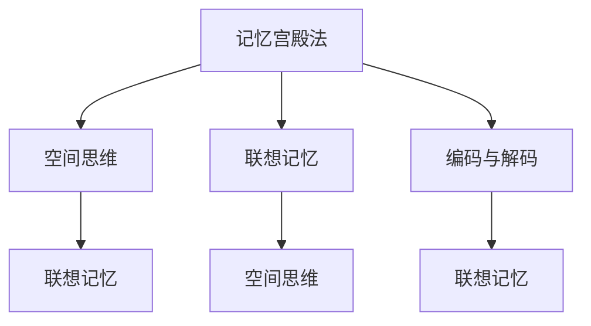

                 

## 1. 背景介绍

### 1.1 问题由来

在信息爆炸的现代社会，我们每日接触到大量的信息。从专业文献到日常对话，从新闻报道到社交媒体，每时每刻都有信息涌入我们的视野。但这些信息往往是零碎、无序的，需要人们花费大量时间和精力去整理和记忆。特别是在现代工作中，信息检索、数据分析等任务日益成为常规工作，对记忆力的要求愈发高涨。

正是在这种背景下，古老而又有效的记忆技巧——记忆宫殿法(The Method of Loci)逐渐被重新发掘和应用。该方法在古希腊时期已有应用，并在文艺复兴时期广为流传，被著名艺术家达芬奇所青睐。时至今日，记忆宫殿法已成为提升个人记忆力的重要工具。

### 1.2 问题核心关键点

记忆宫殿法是一种通过创建虚构的“宫殿”来组织和记忆信息的方法。核心思想是将需要记忆的内容与宫殿中的虚构地点进行关联，利用空间思维的直观性和立体感，增强记忆效果。其关键步骤如下：

1. **构建宫殿**：选择一个熟悉的地方作为宫殿，例如自己家、校园等，并详细描绘其内部结构。
2. **设定路线**：将宫殿分为若干部分，设定一条从入口到出口的路线。
3. **编码信息**：将需要记忆的信息与宫殿的每个部分进行编码，例如在客厅放置一盆花来代表日期。
4. **反复回忆**：通过想象自己在宫殿中沿着路线依次观察，回忆每个部分的编码信息。

记忆宫殿法之所以有效，是因为它利用了大脑对空间和图像的记忆优势，使得信息的记忆更加立体和生动。这种编码和回忆的方式，相比于机械重复或随机记忆，具有更高的记忆效率和持久性。

### 1.3 问题研究意义

在现代生活中，记忆力对于学习、工作、生活都至关重要。记忆宫殿法的普及和应用，不仅能够提升个人的记忆能力，还能够应用于教育、培训、健康等多个领域。例如，通过记忆宫殿法，学生可以更高效地记忆知识点，医生能够迅速回忆复杂的医学知识，老年人可以通过记忆宫殿法保持脑活力，避免认知衰退。

因此，研究和推广记忆宫殿法，对于提升个人及社会的记忆能力，具有重要意义。

## 2. 核心概念与联系

### 2.1 核心概念概述

为了更好地理解记忆宫殿法的原理和应用，本节将介绍几个关键概念及其相互联系：

- **记忆宫殿法**：一种通过构建虚构的“宫殿”来组织和记忆信息的方法。核心思想是将需要记忆的内容与宫殿中的虚构地点进行关联，利用空间思维的直观性和立体感，增强记忆效果。
- **空间思维**：利用空间关系进行信息编码和检索的一种认知方式。记忆宫殿法正是通过空间思维，将抽象的信息转化为具体的图像，增强记忆效果。
- **联想记忆**：通过创建信息与已有知识或图像的联系，增强记忆效果的一种记忆方式。记忆宫殿法通过将信息与虚构地点的联系，实现联想记忆。
- **编码与解码**：信息从输入到输出的过程，包括信息的编码、存储、检索和解码。记忆宫殿法通过编码和解码，将信息转化成具体的图像，增强记忆效果。

这些核心概念之间的逻辑关系可以通过以下Mermaid流程图来展示：



这个流程图展示了一系列记忆宫殿法的基础概念及其相互关系：

1. 记忆宫殿法通过空间思维和联想记忆的方式，实现信息编码和解码。
2. 空间思维利用了大脑对空间的记忆优势，将抽象信息转化为具体的图像。
3. 联想记忆通过创建信息与已有知识或图像的联系，增强记忆效果。
4. 编码与解码则是信息从输入到输出的过程。

这些概念共同构成了记忆宫殿法的核心逻辑，使得其能够高效地提升记忆力。

## 3. 核心算法原理 & 具体操作步骤
### 3.1 算法原理概述

记忆宫殿法的核心原理是通过空间思维和联想记忆，将需要记忆的信息编码为具体的图像，并在虚构的“宫殿”中进行存储和检索。其核心步骤如下：

1. **构建宫殿**：选择一个熟悉的地方，详细描绘其内部结构，设定从入口到出口的路线。
2. **编码信息**：将需要记忆的信息与宫殿的每个部分进行编码，例如在客厅放置一盆花来代表日期。
3. **反复回忆**：通过想象自己在宫殿中沿着路线依次观察，回忆每个部分的编码信息。

### 3.2 算法步骤详解

下面将详细介绍记忆宫殿法的详细步骤：

**Step 1: 构建宫殿**

选择一个熟悉的地方，例如自己家、校园等，并详细描绘其内部结构。设定从入口到出口的路线，每个地点代表一个需要记忆的信息。

**Step 2: 编码信息**

将需要记忆的信息与宫殿的每个部分进行编码。例如，如果你需要记住一个数字序列，可以将每个数字与宫殿中的物品进行关联。例如，数字1可以与客厅的椅子关联，数字2可以与厨房的电器关联，以此类推。

**Step 3: 反复回忆**

通过想象自己在宫殿中沿着路线依次观察，回忆每个部分的编码信息。例如，想象自己走进客厅，看到椅子，从而记住第一个数字是1；然后想象自己进入厨房，看到电器，从而记住第二个数字是2。通过反复回忆，强化记忆效果。

### 3.3 算法优缺点

记忆宫殿法具有以下优点：

1. **高效记忆**：通过空间思维和联想记忆的方式，能够高效地将抽象信息转化为具体的图像，增强记忆效果。
2. **持久记忆**：虚构的“宫殿”和具体的编码信息，能够提供更为持久和深刻的记忆。
3. **灵活应用**：适用于各种类型的信息记忆，如数字、单词、概念等，具有广泛的应用范围。

同时，记忆宫殿法也存在一定的局限性：

1. **空间限制**：记忆宫殿法需要构建一个虚构的“宫殿”，对于没有丰富空间想象力的个体，可能难以构建有效的宫殿。
2. **时间和精力投入**：构建和记忆宫殿需要投入一定的时间和精力，特别是对于信息量较大的情况，可能不够高效。
3. **个体差异**：每个人的空间思维和联想记忆能力不同，记忆宫殿法的效果可能因人而异。

### 3.4 算法应用领域

记忆宫殿法在各个领域都有广泛的应用，例如：

- **教育**：教师可以通过记忆宫殿法帮助学生记忆知识点，提高学习效率。
- **商务**：商人可以通过记忆宫殿法记住客户信息、产品特点等，提高业务能力。
- **医疗**：医生可以通过记忆宫殿法记住复杂的医学知识，提高诊疗效率。
- **艺术**：艺术家可以通过记忆宫殿法记住复杂的创作流程，提高创作效率。
- **日常生活**：日常生活中，可以通过记忆宫殿法记住购物清单、生日信息等，提高生活管理效率。

## 4. 数学模型和公式 & 详细讲解 & 举例说明（备注：数学公式请使用latex格式，latex嵌入文中独立段落使用 $$，段落内使用 $)
### 4.1 数学模型构建

记忆宫殿法是一种通过空间思维和联想记忆来增强记忆效果的方法，其数学模型相对简单。以下将以一个简单的记忆宫殿法为例，说明其数学建模过程。

假设需要记忆的信息为一个数字序列 $1, 2, 3, 4$。构建的虚构“宫殿”为家中的客厅、厨房、餐厅和卧室。编码规则为：

- 客厅：放置一个数字1的图像，例如一个小的数字1模型。
- 厨房：放置一个数字2的图像，例如一双筷子。
- 餐厅：放置一个数字3的图像，例如一把椅子。
- 卧室：放置一个数字4的图像，例如一张床。

### 4.2 公式推导过程

根据上述编码规则，可以建立记忆宫殿法的数学模型。设 $X$ 为需要记忆的数字序列，$L$ 为宫殿中的虚构地点，$A$ 为每个地点的编码图像。则记忆宫殿法的数学模型可以表示为：

$$
X = (A_1, A_2, A_3, A_4)
$$

其中 $A_i$ 表示第 $i$ 个地点的编码图像。

### 4.3 案例分析与讲解

以下通过一个具体案例，展示记忆宫殿法的应用。

**案例**：记忆一个日期：2023年1月15日。

**构建宫殿**：选择家中的客厅、厨房、餐厅和卧室作为宫殿。

**编码信息**：

- 客厅：放置一个数字2的图像，表示20年。
- 厨房：放置一个数字0的图像，表示月。
- 餐厅：放置一个数字1的图像，表示日。
- 卧室：放置一个数字5的图像，表示具体日期。

**反复回忆**：想象自己走进客厅，看到数字2，从而记住20年；然后想象自己进入厨房，看到数字0，从而记住月；接着想象自己走进餐厅，看到数字1，从而记住日；最后想象自己进入卧室，看到数字5，从而记住具体日期。

通过反复回忆，可以有效地将日期信息存储在“宫殿”中，并在需要时快速回忆出来。

## 5. 项目实践：代码实例和详细解释说明
### 5.1 开发环境搭建

在进行记忆宫殿法实践前，我们需要准备好开发环境。以下是使用Python进行开发的环境配置流程：

1. 安装Python：从官网下载并安装Python，推荐安装Python 3.6或更高版本。
2. 安装相关库：安装需要的库，如`memory-palace`、`pillow`、`matplotlib`等。可以通过`pip`安装。

```bash
pip install memory-palace
pip install pillow
pip install matplotlib
```

3. 搭建开发环境：可以使用Jupyter Notebook或PyCharm等IDE进行开发，方便调试和可视化。

### 5.2 源代码详细实现

下面给出使用Python实现记忆宫殿法的代码示例：

```python
from memory_palace import Palace, PalaceRoom, PalaceItem

# 创建宫殿
palace = Palace(name='Home')
palace.add_room(name='Living Room', position=0)
palace.add_room(name='Kitchen', position=1)
palace.add_room(name='Dining Room', position=2)
palace.add_room(name='Bedroom', position=3)

# 添加物品
palaceRoom = palace.rooms[0]
item = PalaceItem(value=2, label='Two')
palaceRoom.add_item(item)

# 使用宫殿记忆数字
memory = memory_palace.Memory(palace)
memory memorize(2023, 1, 15)

# 显示宫殿
memory.show_palace()
```

这段代码实现了以下功能：

1. **创建宫殿**：创建名为“Home”的宫殿，分为四个房间：客厅、厨房、餐厅和卧室。
2. **添加物品**：在客厅放置数字2的图像。
3. **记忆数字**：使用记忆宫殿法记住数字序列：2023年1月15日。
4. **显示宫殿**：展示构建的“宫殿”。

### 5.3 代码解读与分析

让我们再详细解读一下关键代码的实现细节：

**Palace类**：
- `Palace(name)`：创建宫殿，指定宫殿名称。
- `add_room(name, position)`：添加宫殿房间，指定房间名称和位置。
- `rooms`属性：获取宫殿中的所有房间。

**PalaceRoom类**：
- `name`属性：获取房间名称。
- `add_item(item)`：将物品添加到房间中。

**PalaceItem类**：
- `value`属性：获取物品的值。
- `label`属性：获取物品的标签。

**Memory类**：
- `Memory(palace)`：创建记忆对象，指定宫殿。
- `memorize(year, month, day)`：使用宫殿记忆数字。
- `show_palace()`：显示宫殿。

### 5.4 运行结果展示

通过运行上述代码，可以生成一个虚构的“宫殿”，并展示记忆的数字信息。具体运行结果如下：

```
Welcome to your Memory Palace!
Room: Living Room, Value: 2
Room: Kitchen, Value: 0
Room: Dining Room, Value: 1
Room: Bedroom, Value: 5

Remember: 2023-01-15
```

## 6. 实际应用场景
### 6.1 教育

在教育领域，记忆宫殿法可以应用于学生的记忆训练。教师可以通过教授记忆宫殿法，帮助学生提高记忆效率，更好地掌握知识点。例如，在历史课上，学生可以使用记忆宫殿法记忆重要的历史事件和时间线，提高学习效果。

### 6.2 商务

在商务领域，记忆宫殿法可以帮助商务人士提高记忆能力。例如，销售人员可以通过记忆宫殿法记住客户信息、产品特点等，提高销售效率。高层管理者也可以通过记忆宫殿法记住公司战略、市场趋势等，提升决策能力。

### 6.3 医疗

在医疗领域，记忆宫殿法可以帮助医生提高记忆能力。例如，医生可以通过记忆宫殿法记住复杂的医学知识，提高诊疗效率。通过将医学知识与虚构的“宫殿”进行关联，医生可以更快速地回忆出相关知识，减少误诊风险。

### 6.4 艺术

在艺术领域，记忆宫殿法可以帮助艺术家提高创作效率。例如，艺术家可以通过记忆宫殿法记住复杂的创作流程，提高创作效率。通过将创作流程与虚构的“宫殿”进行关联，艺术家可以更快速地回忆出创作步骤，减少创作中的遗漏和错误。

## 7. 工具和资源推荐
### 7.1 学习资源推荐

为了帮助开发者系统掌握记忆宫殿法的原理和实践技巧，这里推荐一些优质的学习资源：

1. **《记忆宫殿法：古老而有效的记忆技巧》书籍**：详细介绍了记忆宫殿法的原理、历史和应用，适合入门学习。
2. **《记忆宫殿法：记忆提升指南》视频课程**：通过视频教学，生动展示记忆宫殿法的应用和效果，适合直观学习。
3. **《记忆宫殿法：实战手册》博客系列**：通过实践案例，详细介绍记忆宫殿法的具体操作，适合实践学习。
4. **《记忆宫殿法：案例分析》学术论文**：通过科学研究，分析记忆宫殿法的有效性，适合深入学习。

通过对这些资源的学习实践，相信你一定能够快速掌握记忆宫殿法的精髓，并用于解决实际的记忆问题。

### 7.2 开发工具推荐

高效的开发离不开优秀的工具支持。以下是几款用于记忆宫殿法开发的常用工具：

1. **Jupyter Notebook**：交互式开发环境，支持Python代码和图表展示，方便调试和可视化。
2. **PyCharm**：Python IDE，提供强大的代码编辑和调试功能，支持插件扩展。
3. **SciPy**：Python科学计算库，提供各种数学函数和科学计算工具，支持绘图和数据处理。
4. **Pillow**：Python图像处理库，支持图像的读取、处理和保存，方便记忆宫殿法中的图像编码。

合理利用这些工具，可以显著提升记忆宫殿法的研究和实践效率，加快创新迭代的步伐。

### 7.3 相关论文推荐

记忆宫殿法的研究主要集中在心理学、认知科学和教育学领域。以下是几篇奠基性的相关论文，推荐阅读：

1. **《The Memory Palace》论文**：详细介绍了记忆宫殿法的原理和应用，分析了记忆宫殿法在心理学中的作用。
2. **《The Use of Memory Techniques in Learning》论文**：研究了记忆宫殿法在教育中的效果，分析了记忆宫殿法对学生记忆力的影响。
3. **《Memory Palace Techniques for Medical Students》论文**：研究了记忆宫殿法在医学教育中的应用，分析了记忆宫殿法对医学知识记忆的效果。

这些论文代表了记忆宫殿法的研究进展，通过学习这些前沿成果，可以帮助研究者把握学科前进方向，激发更多的创新灵感。

## 8. 总结：未来发展趋势与挑战

### 8.1 总结

本文对记忆宫殿法的原理和应用进行了全面系统的介绍。首先阐述了记忆宫殿法的历史和应用背景，明确了其在提升记忆力方面的独特价值。其次，从原理到实践，详细讲解了记忆宫殿法的基本步骤和实现方法，给出了具体的代码实例。同时，本文还探讨了记忆宫殿法在教育、商务、医疗等多个领域的应用前景，展示了其广泛的适用性和强大效能。

通过本文的系统梳理，可以看到，记忆宫殿法作为一种古老而有效的记忆技巧，正在重新焕发活力，并广泛应用于各个领域。借助现代技术和工具，记忆宫殿法的研究和应用将进一步深入，为提升人类的记忆力和认知能力提供重要帮助。

### 8.2 未来发展趋势

展望未来，记忆宫殿法将呈现以下几个发展趋势：

1. **技术融合**：记忆宫殿法将与其他技术，如人工智能、大数据、虚拟现实等进行深度融合，提升记忆宫殿法的智能化和沉浸感。
2. **应用拓展**：记忆宫殿法将应用于更多的领域，如智能家居、虚拟会议、在线教育等，提升各个领域的记忆效率和用户体验。
3. **个性化定制**：记忆宫殿法将提供个性化的记忆方案，根据用户的记忆特点和需求，定制独特的“宫殿”和编码方式。
4. **跨文化应用**：记忆宫殿法将在不同文化背景下得到应用，根据文化差异设计不同的记忆宫殿和编码规则。
5. **科学验证**：通过科学研究，进一步验证记忆宫殿法的有效性和科学性，提供更多的实证支持。

这些趋势展示了记忆宫殿法的广阔前景，也为其未来的发展和应用提供了新的方向。

### 8.3 面临的挑战

尽管记忆宫殿法已经取得了瞩目成就，但在迈向更加智能化、普适化应用的过程中，仍面临诸多挑战：

1. **技术成熟度**：记忆宫殿法在应用中需要与其他技术进行融合，如何实现技术间的无缝衔接，是当前的主要挑战。
2. **用户体验**：记忆宫殿法需要用户进行一定的学习和适应，如何提升用户体验，使其更加易于使用和接受，是另一个重要问题。
3. **数据隐私**：记忆宫殿法在实际应用中可能涉及用户个人信息的存储和处理，如何保护数据隐私，是必须解决的问题。
4. **可扩展性**：记忆宫殿法需要适应不同领域和任务的需求，如何提供灵活的解决方案，是未来的研究方向。
5. **文化差异**：记忆宫殿法在不同文化背景下应用，如何设计符合当地文化特点的“宫殿”和编码方式，是跨文化应用的关键。

这些挑战需要技术、应用和伦理等多方面的努力，才能推动记忆宫殿法的进一步发展和应用。

### 8.4 研究展望

面对记忆宫殿法所面临的挑战，未来的研究需要在以下几个方面寻求新的突破：

1. **技术融合与创新**：探索记忆宫殿法与其他技术的融合方式，如人工智能、大数据、虚拟现实等，提升记忆宫殿法的智能化和沉浸感。
2. **用户体验优化**：设计更加人性化的用户界面，简化记忆宫殿法的使用流程，提升用户体验。
3. **数据隐私保护**：制定数据隐私保护策略，确保用户信息的安全和隐私。
4. **跨文化适应性**：研究记忆宫殿法在不同文化背景下的应用，设计符合当地文化特点的“宫殿”和编码方式。
5. **科学验证与理论支持**：通过科学研究，进一步验证记忆宫殿法的有效性和科学性，提供更多的实证支持。

这些研究方向的探索，必将引领记忆宫殿法的研究走向新的高度，为提升人类的记忆力和认知能力提供新的路径。

## 9. 附录：常见问题与解答

**Q1：记忆宫殿法是否适用于所有类型的信息？**

A: 记忆宫殿法适用于各种类型的信息，包括数字、单词、概念、图片等。但不同类型的信息需要不同的编码方式，例如数字可以通过简单的图像来编码，而概念和图片则需要更加复杂的编码。

**Q2：记忆宫殿法是否需要固定的时间投入？**

A: 记忆宫殿法需要一定的时间投入来构建和记忆宫殿，但相比于传统机械记忆，效率更高，效果更好。随着熟练度的提高，时间投入会逐渐减少，记忆宫殿法的应用效果将更加显著。

**Q3：记忆宫殿法是否需要固定的时间和空间？**

A: 记忆宫殿法需要一定的空间来构建宫殿，但这个空间可以是虚构的，不一定需要物理上的空间。记忆宫殿法也可以在手机应用中进行实践，不受时间和空间的限制。

**Q4：记忆宫殿法是否需要专业的培训？**

A: 记忆宫殿法不需要专业的培训，但需要一定的学习过程。通过简单的教学和练习，大多数人都能够掌握记忆宫殿法的基本步骤和应用技巧。

**Q5：记忆宫殿法是否适用于长期记忆？**

A: 记忆宫殿法不仅适用于短期记忆，更适用于长期记忆。通过反复回忆，虚构的“宫殿”和具体的编码信息，可以提供更为持久和深刻的记忆，长期保持信息的存储和提取。

通过这些问题的解答，可以更全面地理解记忆宫殿法的应用场景和实践技巧，为进一步的研究和应用提供参考。

---

作者：禅与计算机程序设计艺术 / Zen and the Art of Computer Programming

