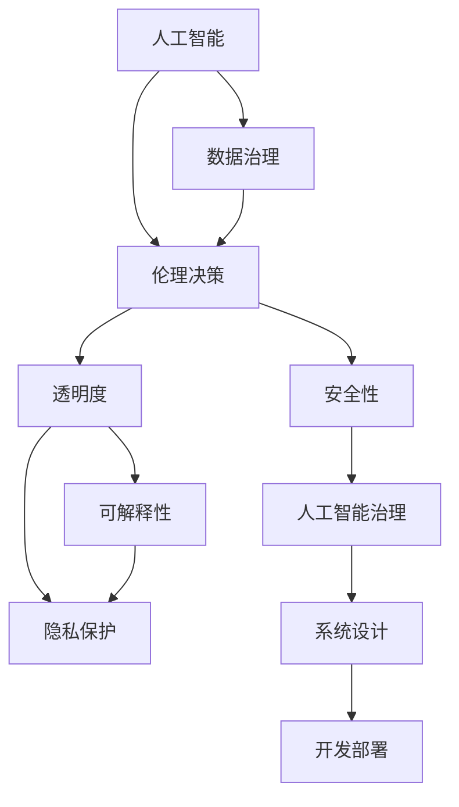

                 

# 负责任的人工智能：人类计算的伦理思考

> 关键词：人工智能, 伦理, 道德, 透明性, 可解释性, 隐私, 安全性, 数据治理, 伦理决策, 人工智能治理

## 1. 背景介绍

### 1.1 问题由来

随着人工智能(AI)技术的迅猛发展，特别是在深度学习和机器学习领域，AI已经开始渗透到人类社会的各个方面，从医疗健康到金融交易，从教育培训到娱乐游戏。然而，AI的发展也带来了诸多伦理道德问题，这些问题不仅涉及技术本身的边界，更关乎人类的生存发展和社会价值。这些问题包括但不限于数据隐私、模型偏见、透明度与可解释性、安全性与可信度等。

### 1.2 问题核心关键点

AI伦理的核心在于如何平衡技术进步与社会责任。伦理道德问题从根本上影响着AI系统的设计、开发和部署，这些问题涉及的不仅仅是技术细节，更是人机交互的基础，是推动AI技术健康发展的关键。以下是几个主要的核心问题：

1. **数据隐私与保护**：在AI系统中，大量的个人数据被收集和分析，如何保护这些数据不受侵害，避免滥用和泄露，是AI伦理的关键问题。
2. **模型偏见与公平性**：AI模型可能会学习并放大现实中的偏见，导致模型决策的不公平，如何识别和消除这些偏见，确保模型的公平性，是AI伦理的另一重要问题。
3. **透明度与可解释性**：AI模型的复杂性和黑箱特性使得其决策过程难以解释，如何提升模型的透明度，使其决策逻辑可追溯、可理解，是提高AI系统可信度的重要手段。
4. **安全性与可信度**：AI系统在关键基础设施中的应用，如自动驾驶、医疗诊断等，如何确保其安全性、鲁棒性和可信度，是确保其大规模部署的基础。
5. **数据治理与伦理决策**：如何在数据收集、处理、分析过程中，遵循伦理原则，确保数据的使用符合道德规范，是数据治理的核心。

这些问题不仅需要技术上的解决方案，更需要伦理道德上的深刻思考和制度设计。只有这样，才能确保AI技术在推动社会进步的同时，不损害人类福祉。

### 1.3 问题研究意义

AI伦理的研究具有深远的社会意义：

1. **保障人权**：通过确保数据隐私和安全，防止AI系统侵犯个人权利。
2. **促进公平**：通过识别和消除模型偏见，确保AI系统在不同群体间的公平性。
3. **提升透明度**：通过提高模型的透明度和可解释性，增强AI系统的可信度。
4. **确保安全**：通过确保AI系统的安全性，防止其在关键领域出现故障或滥用。
5. **推动治理**：通过合理的数据治理和伦理决策，确保AI技术的负责任使用。

这些问题的解决不仅有助于提升AI技术的社会价值，也是推动AI技术可持续发展的重要保障。

## 2. 核心概念与联系

### 2.1 核心概念概述

为了更好地理解AI伦理的核心问题，本节将介绍几个关键概念及其相互之间的联系：

- **人工智能**：通过计算模拟人的智能活动，包括学习、推理、感知和决策等。
- **伦理道德**：规范人类行为的道德准则，包括公平、正义、责任等原则。
- **透明度**：系统决策过程的可追溯性和可理解性。
- **可解释性**：AI系统输出结果的可解释性，即通过何种机制得出的结果。
- **隐私**：个人数据的保护和信息安全。
- **安全性**：系统运行的安全性，防止系统被恶意攻击或滥用。
- **数据治理**：数据收集、处理和使用的规范化管理。
- **伦理决策**：基于伦理道德原则的决策过程。
- **人工智能治理**：对AI系统设计、开发和应用进行伦理规范和政策指导。

这些概念之间的关系可以通过以下Mermaid流程图来展示：



这个流程图展示了AI伦理问题的各个维度及其之间的联系：

1. **数据治理**：为AI系统的训练和运行提供规范的数据管理。
2. **伦理决策**：基于伦理道德原则进行系统设计和开发。
3. **透明度**：确保AI系统决策过程的透明和可理解。
4. **可解释性**：提高AI系统输出的可解释性，增强可信度。
5. **隐私保护**：确保数据在收集和处理过程中的隐私和安全。
6. **安全性**：保障AI系统在运行过程中的安全性，防止滥用和攻击。
7. **人工智能治理**：对AI系统的设计、开发和应用进行伦理规范和政策指导。

这些概念共同构成了AI伦理问题的全貌，有助于我们从多个维度全面理解和应对AI伦理挑战。

## 3. 核心算法原理 & 具体操作步骤

### 3.1 算法原理概述

AI伦理问题涉及的算法原理主要包括数据隐私保护、模型公平性、透明度和可解释性、安全性等方面。以下是这些原理的简要概述：

- **数据隐私保护**：通过差分隐私、联邦学习等技术，确保数据在收集和处理过程中不被滥用。
- **模型公平性**：通过公平性约束、重加权等技术，识别和消除模型中的偏见。
- **透明度和可解释性**：通过模型蒸馏、特征重要性分析等技术，提高模型的透明度和可解释性。
- **安全性**：通过对抗训练、鲁棒性测试等技术，确保模型的鲁棒性和安全性。

### 3.2 算法步骤详解

为了详细解释这些算法原理，本节将分别介绍各个算法步骤的实现。

**Step 1: 数据隐私保护**

数据隐私保护是AI伦理问题的核心之一。以下是常用的数据隐私保护技术：

1. **差分隐私**：通过在数据中添加噪声，使得任何个体数据的泄露不会导致模型性能显著下降。
2. **联邦学习**：在多个不共享数据的设备上进行模型训练，避免数据泄露和集中存储。

**Step 2: 模型公平性**

模型公平性涉及识别和消除模型中的偏见。以下是常用的方法：

1. **公平性约束**：在损失函数中加入公平性约束项，确保模型在不同群体上的表现一致。
2. **重加权**：通过重新加权训练数据，使得少数群体在训练过程中得到更多关注。

**Step 3: 透明度和可解释性**

透明度和可解释性是提高AI系统可信度的重要手段。以下是常用的技术：

1. **模型蒸馏**：将复杂模型转化为简洁模型，以提高可解释性。
2. **特征重要性分析**：通过分析模型中各特征的贡献度，提高透明度。

**Step 4: 安全性**

安全性是AI系统部署的基础。以下是常用的技术：

1. **对抗训练**：通过引入对抗样本，提高模型的鲁棒性。
2. **鲁棒性测试**：对模型进行多种攻击测试，确保其鲁棒性。

### 3.3 算法优缺点

数据隐私保护、模型公平性、透明度和可解释性、安全性等算法各有优缺点：

- **优点**：
  - 数据隐私保护和联邦学习确保数据安全，避免滥用。
  - 公平性约束和重加权确保模型公平，提升社会信任。
  - 模型蒸馏和特征重要性分析提高透明度，增强可信度。
  - 对抗训练和鲁棒性测试提高安全性，保障系统稳定。

- **缺点**：
  - 差分隐私和联邦学习可能导致模型性能下降。
  - 公平性约束和重加权可能增加模型训练难度。
  - 模型蒸馏和特征重要性分析可能增加计算复杂度。
  - 对抗训练和鲁棒性测试可能增加模型复杂度。

这些技术需要根据具体应用场景进行选择和优化，以平衡效果和效率。

### 3.4 算法应用领域

AI伦理问题涉及的算法和技术在多个领域都有广泛应用，以下是几个典型应用场景：

1. **医疗健康**：通过差分隐私保护患者数据，确保医疗信息安全。
2. **金融服务**：通过模型公平性，避免信贷和保险中的偏见，提升服务公平性。
3. **教育培训**：通过透明度和可解释性，提高学生数据使用的透明度和信任度。
4. **交通运输**：通过安全性保障自动驾驶系统的稳定性，防止事故发生。

这些应用场景展示了AI伦理问题的广泛影响，也突出了其在现实社会中的重要性和必要性。

## 4. 数学模型和公式 & 详细讲解 & 举例说明

### 4.1 数学模型构建

本节将使用数学语言对AI伦理问题中的核心算法进行更加严格的刻画。

**Step 1: 数据隐私保护**

差分隐私的数学模型为：

$$
L_\epsilon(x) = \log \left( \frac{1}{\epsilon} e^{\frac{\epsilon}{\delta} f(x)} \right)
$$

其中，$x$ 为输入数据，$f(x)$ 为模型输出，$\epsilon$ 和 $\delta$ 为隐私参数。

**Step 2: 模型公平性**

公平性约束的数学模型为：

$$
L(y, \theta) = \sum_i (y_i - \theta^T x_i)^2 + \lambda \sum_j \left[ (E[y_j] - \mu_j)^2 \right]
$$

其中，$y_i$ 为模型输出，$x_i$ 为输入数据，$\theta$ 为模型参数，$\lambda$ 为公平性权重。

**Step 3: 透明度和可解释性**

模型蒸馏的数学模型为：

$$
L(x, y, \theta) = \sum_i (y_i - \hat{y_i})^2 + \alpha \sum_i \left( \log \left( \frac{\hat{y_i}}{y_i} \right) + \log \left( 1 - \hat{y_i} \right) \right)
$$

其中，$\hat{y_i}$ 为蒸馏后的输出，$\alpha$ 为蒸馏损失权重。

**Step 4: 安全性**

对抗训练的数学模型为：

$$
L(x, \theta) = \sum_i \log (1 + e^{-y_i \theta^T x_i})
$$

其中，$x$ 为输入数据，$y$ 为标签，$\theta$ 为模型参数。

### 4.2 公式推导过程

以下是差分隐私、公平性约束、透明度和可解释性、安全性等核心算法公式的推导过程：

**差分隐私**

差分隐私的推导基于拉普拉斯分布的密度函数，其推导过程如下：

$$
f_\epsilon(x) = \frac{1}{2\pi\sigma^2} e^{-\frac{(x-\mu)^2}{2\sigma^2}}
$$

其中，$x$ 为随机变量，$\sigma$ 为方差，$\mu$ 为均值。

**公平性约束**

公平性约束的推导基于均方误差损失函数，其推导过程如下：

$$
L(y, \theta) = \sum_i (y_i - \theta^T x_i)^2 + \lambda \sum_j \left[ (E[y_j] - \mu_j)^2 \right]
$$

其中，$y_i$ 为模型输出，$x_i$ 为输入数据，$\theta$ 为模型参数，$\lambda$ 为公平性权重。

**模型蒸馏**

模型蒸馏的推导基于信息熵和交叉熵，其推导过程如下：

$$
L(x, y, \theta) = \sum_i (y_i - \hat{y_i})^2 + \alpha \sum_i \left( \log \left( \frac{\hat{y_i}}{y_i} \right) + \log \left( 1 - \hat{y_i} \right) \right)
$$

其中，$\hat{y_i}$ 为蒸馏后的输出，$\alpha$ 为蒸馏损失权重。

**对抗训练**

对抗训练的推导基于对抗样本的生成，其推导过程如下：

$$
L(x, \theta) = \sum_i \log (1 + e^{-y_i \theta^T x_i})
$$

其中，$x$ 为输入数据，$y$ 为标签，$\theta$ 为模型参数。

### 4.3 案例分析与讲解

为了更具体地理解这些算法，以下是几个典型案例分析：

**案例 1: 差分隐私**

某电商平台收集了用户购物数据，用于个性化推荐。为了保护用户隐私，采用了差分隐私技术。在模型训练过程中，每次取样时都加入一定量的随机噪声，确保即使单个用户的加入或离开对模型性能影响不大。

**案例 2: 模型公平性**

某银行开发了贷款评估模型，用于评估客户的贷款申请。该模型在训练过程中发现对不同性别客户的评分存在偏见。为了消除偏见，采用公平性约束，引入性别平衡约束项，使得模型对男女客户的评分一致。

**案例 3: 透明度和可解释性**

某医疗诊断系统用于辅助医生诊断肿瘤。该系统采用深度学习模型，但医生无法理解模型决策过程。为了提高透明度，采用了模型蒸馏技术，将复杂模型转化为简洁模型，并分析了模型中各特征的贡献度。

**案例 4: 安全性**

某自动驾驶系统在测试过程中发现对某些攻击样本的鲁棒性较差。为了提升安全性，采用了对抗训练技术，生成对抗样本并对模型进行重新训练，提高了系统的鲁棒性。

## 5. 项目实践：代码实例和详细解释说明

### 5.1 开发环境搭建

在进行AI伦理问题的算法实践前，我们需要准备好开发环境。以下是使用Python进行TensorFlow开发的环境配置流程：

1. 安装Anaconda：从官网下载并安装Anaconda，用于创建独立的Python环境。

2. 创建并激活虚拟环境：
```bash
conda create -n tf-env python=3.8 
conda activate tf-env
```

3. 安装TensorFlow：从官网获取对应的安装命令。例如：
```bash
pip install tensorflow==2.7
```

4. 安装各类工具包：
```bash
pip install numpy pandas scikit-learn matplotlib tqdm jupyter notebook ipython
```

完成上述步骤后，即可在`tf-env`环境中开始AI伦理问题的算法实践。

### 5.2 源代码详细实现

下面我们以差分隐私为例，给出使用TensorFlow进行差分隐私保护的PyTorch代码实现。

首先，定义差分隐私保护函数：

```python
import tensorflow as tf

def laplace_mechanism(data, epsilon, delta):
    noise = tf.random.normal(shape=tf.shape(data), mean=0, stddev=1.0 / epsilon)
    return data + noise, noise

def differential_privacy(data, epsilon, delta):
    n = tf.shape(data)[0]
    data, noise = laplace_mechanism(data, epsilon, delta)
    return data, noise
```

然后，定义数据生成函数：

```python
def generate_data(n_samples):
    data = tf.random.normal(shape=(n_samples, 10), mean=0, stddev=1.0)
    return data

n_samples = 1000
data = generate_data(n_samples)
```

接着，定义差分隐私保护函数：

```python
epsilon = 0.1
delta = 0.1

data, noise = differential_privacy(data, epsilon, delta)
```

最后，输出差分隐私保护后的数据和噪声：

```python
print("Data after differential privacy:", data.numpy())
print("Noise added by differential privacy:", noise.numpy())
```

以上就是使用TensorFlow进行差分隐私保护的完整代码实现。可以看到，差分隐私保护的实现主要依赖于拉普拉斯噪声的生成，其参数 epsilon 和 delta 控制着隐私保护的程度。

### 5.3 代码解读与分析

让我们再详细解读一下关键代码的实现细节：

**差分隐私保护函数**：
- `laplace_mechanism`函数：生成拉普拉斯噪声，用于隐私保护。
- `differential_privacy`函数：计算差分隐私保护后的数据和噪声。

**数据生成函数**：
- `generate_data`函数：生成随机数据，用于隐私保护实验。

**差分隐私保护过程**：
- 首先调用`differential_privacy`函数进行隐私保护，其中参数 epsilon 和 delta 控制隐私保护程度。
- 输出保护后的数据和噪声，观察隐私保护的效果。

可以看到，差分隐私保护的主要过程在于生成噪声并添加到原始数据中，确保单个数据点的加入或离开对模型性能的影响不大。通过调整 epsilon 和 delta 参数，可以控制隐私保护的程度，在隐私保护和模型性能之间找到平衡。

## 6. 实际应用场景

### 6.1 医疗健康

医疗健康领域涉及大量敏感数据，如何在保护患者隐私的前提下进行数据分析和模型训练，是AI伦理问题的重要应用场景。差分隐私技术在此场景中得到了广泛应用。

例如，某医院开发了基于患者病历数据的诊断模型，但在数据收集过程中，必须保护患者隐私。通过差分隐私技术，将患者病历数据进行隐私保护，确保数据在分析过程中不被滥用。

### 6.2 金融服务

金融服务领域涉及大量个人财务数据，如何在保护用户隐私的前提下进行数据分析和模型训练，是AI伦理问题的另一个重要应用场景。

例如，某金融公司开发了贷款评估模型，用于评估客户的信用风险。在模型训练过程中，必须保护客户隐私。通过差分隐私技术，将客户数据进行隐私保护，确保数据在分析过程中不被滥用。

### 6.3 教育培训

教育培训领域涉及大量学生数据，如何在保护学生隐私的前提下进行数据分析和模型训练，是AI伦理问题的又一个重要应用场景。

例如，某教育机构开发了基于学生数据的学习推荐模型，用于个性化推荐学习内容。在模型训练过程中，必须保护学生隐私。通过差分隐私技术，将学生数据进行隐私保护，确保数据在分析过程中不被滥用。

### 6.4 未来应用展望

随着AI技术的不断进步，AI伦理问题将得到更加广泛的关注和应用。以下是几个未来应用展望：

1. **智能城市**：智能城市中涉及大量公共数据，如何在保护公民隐私的前提下进行数据分析和决策，是AI伦理问题的重要应用场景。
2. **自动驾驶**：自动驾驶系统涉及大量驾驶员数据，如何在保护用户隐私的前提下进行数据收集和分析，是AI伦理问题的又一个重要应用场景。
3. **精准医疗**：精准医疗领域涉及大量患者数据，如何在保护患者隐私的前提下进行数据分析和模型训练，是AI伦理问题的又一个重要应用场景。

这些应用场景展示了AI伦理问题的广泛影响，也突出了其在现实社会中的重要性和必要性。

## 7. 工具和资源推荐
### 7.1 学习资源推荐

为了帮助开发者系统掌握AI伦理问题的理论基础和实践技巧，这里推荐一些优质的学习资源：

1. 《AI伦理与道德》系列课程：由知名AI专家主讲，深入浅出地介绍了AI伦理和道德问题的核心内容。
2. 《AI伦理实践指南》书籍：全面介绍AI伦理问题的方方面面，包括隐私保护、公平性、透明度等。
3. 《AI治理与伦理决策》课程：详细讲解AI治理和伦理决策的基础知识和实践方法。
4. 《数据隐私保护技术》课程：讲解差分隐私、联邦学习等数据隐私保护技术。
5. 《AI模型公平性》课程：讲解模型公平性的识别和消除方法。

通过对这些资源的学习实践，相信你一定能够系统地掌握AI伦理问题的理论基础和实践技巧，并在实际应用中更好地处理伦理道德问题。

### 7.2 开发工具推荐

高效的开发离不开优秀的工具支持。以下是几款用于AI伦理问题算法开发的常用工具：

1. TensorFlow：开源深度学习框架，支持差分隐私、联邦学习等技术。
2. PyTorch：开源深度学习框架，支持差分隐私、模型蒸馏等技术。
3. TensorBoard：TensorFlow配套的可视化工具，用于监控和分析AI模型性能。
4. Weights & Biases：模型训练的实验跟踪工具，记录和可视化模型训练过程中的各项指标。
5. Google Colab：谷歌推出的在线Jupyter Notebook环境，免费提供GPU/TPU算力，方便开发者快速实验。

合理利用这些工具，可以显著提升AI伦理问题的算法开发效率，加快创新迭代的步伐。

### 7.3 相关论文推荐

AI伦理问题的研究源于学界的持续研究。以下是几篇奠基性的相关论文，推荐阅读：

1. 《A Framework for Data-Driven Policy and Privacy Protection》：介绍差分隐私的基本概念和应用。
2. 《Fairness-aware Stochastic Gradient Descent》：讲解模型公平性的识别和消除方法。
3. 《Model-agnostic Interpretation of Deep Learning》：介绍模型蒸馏和可解释性的实现。
4. 《Adversarial Machine Learning》：讲解对抗训练和模型鲁棒性的方法。
5. 《Ethical AI and Machine Learning: How to Future-Proof Your Organization》：全面介绍AI伦理和道德问题的核心内容。

这些论文代表了大语言模型微调技术的发展脉络。通过学习这些前沿成果，可以帮助研究者把握学科前进方向，激发更多的创新灵感。

## 8. 总结：未来发展趋势与挑战

### 8.1 总结

本文对AI伦理问题进行了全面系统的介绍。首先阐述了AI伦理问题的研究背景和意义，明确了伦理道德问题对AI系统设计、开发和应用的重要影响。其次，从原理到实践，详细讲解了差分隐私、模型公平性、透明度和可解释性、安全性等核心算法，给出了AI伦理问题的完整代码实例。同时，本文还广泛探讨了AI伦理问题在医疗健康、金融服务、教育培训等多个行业领域的应用前景，展示了AI伦理问题的广泛影响。

通过本文的系统梳理，可以看到，AI伦理问题涉及的算法和技术在多个领域都有广泛应用，其重要性不容忽视。只有通过深入研究，系统解决这些伦理道德问题，才能确保AI技术在推动社会进步的同时，不损害人类福祉。

### 8.2 未来发展趋势

展望未来，AI伦理问题的研究将呈现以下几个发展趋势：

1. **技术进步**：差分隐私、模型公平性、透明度和可解释性等技术将不断进步，为AI伦理问题提供更强大的工具。
2. **应用广泛**：AI伦理问题将广泛应用于医疗健康、金融服务、教育培训、智能城市等多个领域。
3. **标准制定**：AI伦理问题将逐步纳入行业标准和政策指导，确保AI技术的负责任使用。
4. **多方协同**：AI伦理问题需要政府、企业、学术界等各方协同努力，共同解决。
5. **公众参与**：公众参与和监督将成为AI伦理问题的重要组成部分，提升透明度和可信度。

这些趋势凸显了AI伦理问题的重要性和紧迫性，需要各方共同努力，才能确保AI技术的健康发展。

### 8.3 面临的挑战

尽管AI伦理问题的研究已经取得了一定进展，但在迈向更加智能化、普适化应用的过程中，仍面临诸多挑战：

1. **隐私保护**：如何在保护隐私的前提下，充分利用数据价值，仍然是一个难题。
2. **模型公平性**：如何在不同群体之间实现公平，避免偏见，仍然需要进一步探索。
3. **透明度和可解释性**：如何提高模型的透明度和可解释性，增强可信度，仍然是一个重要挑战。
4. **安全性**：如何确保AI系统的安全性，防止滥用和攻击，仍然是一个重要问题。
5. **数据治理**：如何在数据收集、处理、分析过程中，遵循伦理原则，仍然需要进一步规范。

这些挑战需要各方共同努力，才能逐步解决，确保AI技术的负责任使用。

### 8.4 研究展望

未来，AI伦理问题的研究需要在以下几个方面寻求新的突破：

1. **隐私保护技术**：探索更高效、更安全的隐私保护技术，确保数据在分析过程中不被滥用。
2. **模型公平性技术**：探索更有效的模型公平性技术，确保不同群体之间的公平性。
3. **透明度和可解释性技术**：探索更有效的透明度和可解释性技术，提高模型的可信度。
4. **安全性技术**：探索更有效的安全性技术，确保AI系统的鲁棒性和安全性。
5. **数据治理技术**：探索更有效的数据治理技术，确保数据在收集、处理和分析过程中遵循伦理原则。

这些研究方向将推动AI伦理问题的进一步研究，为AI技术的健康发展提供有力保障。

## 9. 附录：常见问题与解答

**Q1: 什么是差分隐私？其基本原理是什么？**

A: 差分隐私是一种隐私保护技术，其基本原理是在数据中添加噪声，使得单个数据点的加入或离开对模型性能影响不大。具体来说，差分隐私通过拉普拉斯分布生成噪声，将其添加到原始数据中，从而保护数据隐私。

**Q2: 如何实现模型的公平性？**

A: 实现模型的公平性需要识别和消除模型中的偏见。常用的方法包括在损失函数中加入公平性约束项，或通过重加权训练数据，使得少数群体在训练过程中得到更多关注。

**Q3: 如何提高模型的透明度和可解释性？**

A: 提高模型的透明度和可解释性需要分析模型的决策过程。常用的方法包括模型蒸馏和特征重要性分析，将其转化为简洁模型，并分析各特征的贡献度。

**Q4: 如何确保AI系统的安全性？**

A: 确保AI系统的安全性需要引入对抗训练和鲁棒性测试，提高模型的鲁棒性。对抗训练通过引入对抗样本，使得模型在攻击下仍能保持稳定。

**Q5: 如何平衡隐私保护和数据利用？**

A: 平衡隐私保护和数据利用需要综合考虑多个因素。例如，差分隐私技术可以在保护隐私的前提下，充分利用数据价值。

---

作者：禅与计算机程序设计艺术 / Zen and the Art of Computer Programming

