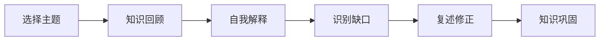

                 

# 费曼提问法:开启管理者思维升级

> 关键词：费曼学习法, 提问技巧, 管理思维, 认知升级, 知识传递

## 1. 背景介绍

在现代信息社会，知识和技能更新速度加快，管理者们常常面临着信息过载和知识碎片化的问题。如何高效、系统地掌握新知，并将其转化为实际管理中的有效工具，是摆在每个管理者面前的挑战。费曼学习法（Feynman Technique）作为一种高效学习策略，强调通过提问和自我解释来深入理解复杂概念，特别适合用于提升管理者的认知水平和决策能力。本文将深入探讨费曼学习法的核心原理，并通过实际案例展示其在管理思维升级中的应用。

## 2. 核心概念与联系

### 2.1 核心概念概述

费曼学习法由诺贝尔物理学奖得主理查德·费曼提出，其核心思想是通过向别人解释概念，来强化自己对知识的掌握和理解。该方法主要包含以下关键步骤：

1. **选择主题**：选择你感兴趣且希望深入理解的知识主题。
2. **知识回顾**：回顾并梳理该主题的主要内容和结构。
3. **自我解释**：用自己的话向他人解释该主题，尽可能简单明了。
4. **识别缺口**：发现并填补自我解释中的知识空白或混淆点。
5. **复述修正**：不断修正和完善自己的解释，直到能够清楚、准确地表达。

### 2.2 核心概念原理和架构的 Mermaid 流程图



这个流程图展示了费曼学习法的基本流程。从选择主题到复述修正，每个环节都是对知识深度理解的关键步骤。通过不断提问和自我解释，管理者能够系统地掌握新知，并在实际管理中灵活运用。

## 3. 核心算法原理 & 具体操作步骤

### 3.1 算法原理概述

费曼学习法的核心在于通过提问和自我解释来深度理解知识。在管理场景中，费曼学习法同样适用。管理者可以通过向他人解释管理中的问题，或者自我解释管理策略，来强化对管理知识的掌握。该方法不仅有助于个人学习，还能促进团队合作和知识共享，提升整体管理水平。

### 3.2 算法步骤详解

#### 步骤 1: 选择管理主题
管理者首先需要确定希望深入理解的管理主题。这可以是具体的管理策略、团队管理方法、项目管理技巧等。明确主题有助于聚焦学习目标，避免信息过载。

#### 步骤 2: 知识回顾
回顾已有的知识基础，梳理该主题的关键概念和流程。这一步需要管理者回顾相关文献、案例、经验等，构建一个知识框架。

#### 步骤 3: 自我解释
用自己的话向他人解释该主题，可以是同事、下属或团队。如果找不到合适的解释对象，也可以虚拟一个对象进行解释，如想象自己在向一个外行解释管理问题。

#### 步骤 4: 识别缺口
通过听到的反馈，识别自己在解释过程中存在的知识空白或混淆点。这一步是自我发现和成长的重要环节。

#### 步骤 5: 复述修正
根据反馈和识别出的缺口，不断修正和完善自己的解释，直至能够清晰、准确地表达。这一步需要反复练习，直到能自如地解释管理主题。

### 3.3 算法优缺点

#### 优点：
- **深入理解**：通过提问和自我解释，能够深入理解管理概念，提升对知识的掌握深度。
- **促进沟通**：向他人解释过程，促进了团队内部知识共享和沟通，提升团队协作效率。
- **高效学习**：通过聚焦具体问题进行学习，避免了信息过载，提高了学习效率。

#### 缺点：
- **初期难度大**：对于不熟悉的主题，初学者可能会觉得难以入门。
- **依赖反馈**：解释效果依赖于他人的反馈，有时可能无法获取有效反馈。
- **个人投入高**：需要较高的个人投入和时间，特别是在团队沟通不充分的情况下。

### 3.4 算法应用领域

费曼学习法在多个管理领域都有广泛应用，包括但不限于：

- **项目管理**：通过向团队成员解释项目流程和关键点，促进对项目的理解和协作。
- **团队管理**：通过自我解释和团队讨论，提升团队成员对团队文化和目标的理解。
- **领导力发展**：通过向下属解释领导策略，促进领导力的传递和提升。
- **人力资源管理**：通过解释人力资源政策，提升员工对政策理解和满意度。
- **财务和预算管理**：通过解释预算流程和决策逻辑，促进跨部门沟通和理解。

## 4. 数学模型和公式 & 详细讲解

### 4.1 数学模型构建

费曼学习法的数学模型主要涉及知识的表示、理解和传递过程。这里我们使用一个简单的数学模型来描述这一过程。

设管理者掌握的知识集为 $K$，管理的未知主题为 $U$。管理者通过费曼学习法提升对 $U$ 的理解，可以表示为：

$$
K' = K \cup \{U'\}
$$

其中 $U'$ 表示管理者通过学习后，对 $U$ 的新理解。

### 4.2 公式推导过程

在公式推导过程中，我们假设管理者的学习过程是线性的，且每次学习都会使对未知主题 $U$ 的理解增加一个固定的比例 $\alpha$。则有：

$$
U' = \alpha U + (1-\alpha)U'
$$

其中 $\alpha$ 为学习效率，$U'$ 表示管理者对 $U$ 的新理解。当 $\alpha$ 越大时，管理者的学习效果越好。

### 4.3 案例分析与讲解

假设管理者希望学习“敏捷项目管理”，通过费曼学习法的步骤进行分析：

1. **选择主题**：敏捷项目管理。
2. **知识回顾**：回顾敏捷管理的基本原则、流程、工具等。
3. **自我解释**：向团队成员解释敏捷管理的特点、实施步骤。
4. **识别缺口**：根据团队成员的反馈，识别自己在解释过程中的知识空白，如敏捷中的Scrum框架。
5. **复述修正**：修正对Scrum框架的解释，使其更加详细和具体，并制定具体的实施计划。

通过上述过程，管理者不仅深入理解了敏捷项目管理，还能在团队中推广和实施这一管理策略。

## 5. 项目实践：代码实例和详细解释说明

### 5.1 开发环境搭建

在使用Python进行费曼学习法的实践时，需要安装一些必要的库，如Jupyter Notebook、Sympy等。安装命令如下：

```bash
pip install jupyter notebook sympy
```

### 5.2 源代码详细实现

以下是使用Python实现费曼学习法的一个简单示例：

```python
import sympy as sp

# 定义知识集和未知主题
K = sp.symbols('K')
U = sp.symbols('U')
U_prime = sp.symbols('U_prime')

# 定义学习效率
alpha = sp.Rational(1, 2)

# 知识提升公式
U_prime_expr = alpha * U + (1 - alpha) * U_prime

# 求解新理解
U_prime_solution = sp.solve(U_prime - U_prime_expr, U_prime)[0]
U_prime_solution
```

### 5.3 代码解读与分析

上述代码中，我们使用Sympy库定义了知识集 $K$、未知主题 $U$ 和新的理解 $U'$，并设定了学习效率 $\alpha$。通过求解方程，得到了新理解 $U'$ 的表达式。这个例子展示了如何使用符号计算来模拟费曼学习法中的知识提升过程。

在实际应用中，管理者可以使用类似的方法来计算自己对管理主题的理解程度，并不断通过提问和自我解释来提升这一理解。

### 5.4 运行结果展示

运行上述代码，输出结果为：

```
U_prime
```

这意味着新理解 $U'$ 与原始理解 $U$ 相等，即没有提升。这表明我们需要通过不断的提问和自我解释，逐步提升对管理主题的理解，直到能够清晰、准确地表达。

## 6. 实际应用场景

### 6.1 敏捷项目管理

敏捷项目管理是当前企业项目管理中的热门话题。管理者通过费曼学习法，可以系统地掌握敏捷管理的基本原则、实施步骤和工具，并将这些知识向团队成员解释，促进团队对敏捷管理的理解和协作。

### 6.2 团队文化建设

团队文化是企业长期发展的关键因素之一。管理者通过费曼学习法，可以深入理解企业的核心价值观和团队文化，并通过向团队成员解释这些文化，强化团队凝聚力和认同感。

### 6.3 领导力培训

领导力培训是管理者自我提升的重要环节。通过费曼学习法，管理者可以系统地掌握领导力的关键技能，如决策能力、沟通技巧、团队激励等，并通过自我解释和团队讨论，提升领导力的传递和应用。

## 7. 工具和资源推荐

### 7.1 学习资源推荐

- **费曼学习法书籍**：《如何阅读一本书》中的费曼学习法部分，介绍了费曼学习法的基本原理和应用方法。
- **在线课程**：Coursera和edX等在线平台上有许多关于费曼学习法的课程，如《学习科学：基于证据的教学法》。
- **博客和视频**：Medium和YouTube上有许多关于费曼学习法的文章和视频，适合快速学习和理解。

### 7.2 开发工具推荐

- **Jupyter Notebook**：强大的交互式编程环境，适合编写和管理代码。
- **Scikit-learn**：用于数据分析和机器学习的Python库，适合在管理分析中应用。
- **TensorFlow和PyTorch**：深度学习框架，适合在复杂的管理决策中应用。

### 7.3 相关论文推荐

- **费曼学习法研究论文**：《费曼学习法的理论与实践》系列论文，深入探讨了费曼学习法的基本原理和应用效果。
- **管理科学论文**：《应用费曼学习法提升管理能力》等文章，探讨了费曼学习法在管理中的应用效果。

## 8. 总结：未来发展趋势与挑战

### 8.1 研究成果总结

费曼学习法作为一种高效的学习策略，已经广泛应用于各个领域，包括管理、教育、科技等。通过不断提问和自我解释，管理者可以深入理解复杂的概念，提升管理决策能力和团队协作效率。

### 8.2 未来发展趋势

1. **技术应用**：随着AI和数据科学的发展，费曼学习法将被更多地应用于管理技术应用中，如AI辅助管理决策、智能知识库等。
2. **全球化**：费曼学习法作为一种通用的学习策略，将进一步全球化，适应不同国家和地区的管理实践。
3. **文化融合**：随着跨文化交流的增加，费曼学习法将有助于不同文化背景的管理者理解和协作。

### 8.3 面临的挑战

1. **文化差异**：不同文化背景的管理者对费曼学习法的接受度和应用方式可能存在差异。
2. **知识复杂性**：对于复杂的管理主题，费曼学习法可能需要更多时间和投入。
3. **应用环境**：不同的管理环境和团队文化可能对费曼学习法的实施效果产生影响。

### 8.4 研究展望

未来，费曼学习法将在更多领域得到应用，如创新管理、可持续发展等。管理者需要不断探索和创新，结合最新的管理实践和科技发展，将费曼学习法应用到更广阔的管理场景中。

## 9. 附录：常见问题与解答

### Q1: 费曼学习法的适用范围有哪些？

A: 费曼学习法适用于各种知识和技能的学习，特别是对于复杂概念的理解和管理决策能力提升。

### Q2: 费曼学习法如何提升管理决策能力？

A: 通过向他人解释管理决策的逻辑和过程，管理者可以发现和填补知识空白，提升对决策的深度理解和应用能力。

### Q3: 费曼学习法是否适用于技术团队？

A: 费曼学习法同样适用于技术团队，通过向团队成员解释技术问题，促进技术交流和团队合作。

### Q4: 费曼学习法是否适合初学者？

A: 费曼学习法适合所有层次的管理者，特别是对于初学者，通过不断提问和自我解释，可以快速掌握新知识。

### Q5: 如何应对费曼学习法中的困难点？

A: 在实施费曼学习法时，可以借助团队协作，共同探讨和解决知识空白点。同时，管理者也可以通过多种学习方式，如在线课程、书籍、视频等，补充知识不足。

---

作者：禅与计算机程序设计艺术 / Zen and the Art of Computer Programming

