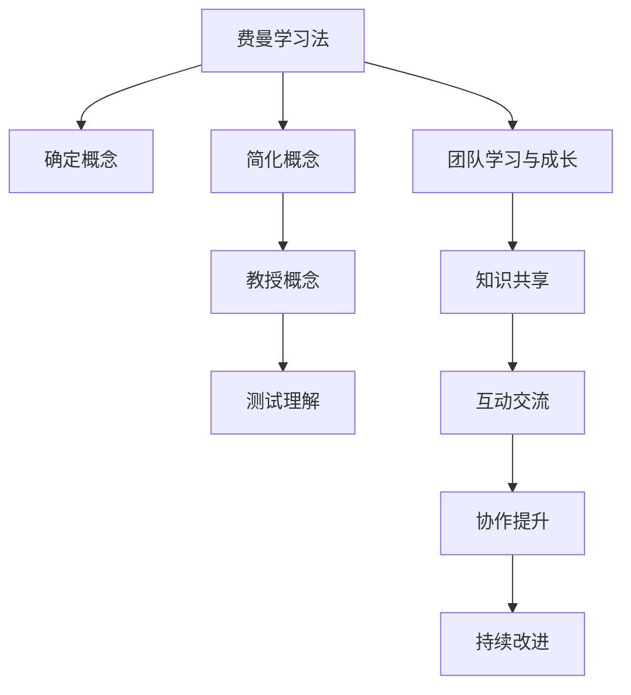

                 

# 费曼提问法促进团队学习与成长

> 关键词：费曼学习法, 团队学习, 知识共享, 技术传播, 问题导向, 迭代改进, 知识管理

## 1. 背景介绍

在现代企业中，团队合作成为提升工作效率和创新能力的关键因素。随着知识和技术日新月异，如何在快速变化的环境中，有效地进行知识共享、学习与成长，成为了团队管理的重要课题。费曼学习法（Feynman Technique）以其独特的以教为学（Teaching as Learning）策略，为团队提供了一种高效的学习与成长机制。本文将详细介绍费曼学习法的基本原理，分析其在促进团队学习与成长中的应用策略，以及如何通过问题导向（Problem-oriented）和迭代改进（Iterative Improvement），不断提升团队的知识水平和问题解决能力。

## 2. 核心概念与联系

### 2.1 核心概念概述

费曼学习法，又称为费曼技巧、费曼学习技巧，是一种通过将复杂概念简化并传授给他人，以深化自身理解的学习方法。其核心在于将学习者置于“教”的角色，通过解释、演示和测试来巩固和强化自身知识。

费曼学习法的核心步骤包括：
1. **确定概念**：选择一项你想要掌握的复杂概念。
2. **简化概念**：用自己的语言解释该概念，直到简单到连六岁小孩都能理解。
3. **教授概念**：假设你正在向一个毫无背景知识的听众解释该概念，遇到障碍时，回过头来重新学习。
4. **测试理解**：寻找不懂的部分，重新学习，直到完全理解。

团队学习与成长则是指通过团队成员之间的互动和协作，不断交流和学习，共同提升团队的知识水平和技能。有效的团队学习不仅能够促进个人技能的提升，还能增强团队整体的创新能力和协作效率。

### 2.2 核心概念原理和架构的 Mermaid 流程图



该流程图展示了费曼学习法和团队学习与成长之间的联系：

1. 从费曼学习法的核心步骤可以看出，其核心在于“教”与“学”的结合，通过简化和解释复杂概念，不断强化自身理解。
2. 团队学习与成长则强调了通过团队成员之间的互动，共享知识，共同提升技能和解决复杂问题。
3. 团队中的每个成员都可以使用费曼学习法，将复杂的知识简化并传授给他人，促进团队的知识共享和协作。
4. 团队通过不断交流和协作，遇到问题时集体讨论和解决，实现迭代改进，从而不断提升团队的整体水平。

## 3. 核心算法原理 & 具体操作步骤

### 3.1 算法原理概述

费曼学习法通过将学习者置于“教”的角色，通过解释、演示和测试来巩固和强化自身知识。其核心在于将复杂概念简化并传授给他人，以深化自身理解。通过这种以教为学的策略，学习者不仅能够更好地掌握知识，还能发现自身知识的盲点和薄弱环节，进一步提升学习效果。

团队学习与成长则强调通过团队成员之间的互动和协作，共同提升团队的知识水平和技能。费曼学习法与团队学习与成长的结合，通过知识共享和问题导向，促进团队成员之间的深度交流和合作，实现团队的整体提升。

### 3.2 算法步骤详解

**步骤1：确定概念**
- 选择团队需要掌握的复杂概念或技能。
- 确定哪些概念或技能团队成员相对较为薄弱，需要重点关注。

**步骤2：简化概念**
- 使用简单的语言和类比，尝试将复杂概念解释给一个毫无背景知识的听众。
- 确保解释能够覆盖概念的核心要点，且易于理解。

**步骤3：教授概念**
- 假设在向一个毫无背景知识的听众讲解该概念，进行模拟演示或实际讲解。
- 遇到解释障碍时，回过头来重新学习，不断优化和完善解释。

**步骤4：测试理解**
- 通过团队成员之间的提问和回答，验证对概念的理解是否准确。
- 遇到不清楚或未掌握的部分，进一步学习和深入探讨。

**步骤5：知识共享**
- 将简化后的概念和解释分享给团队成员，促进知识共享。
- 在团队中建立知识库或文档，记录学习成果和常见问题。

**步骤6：互动交流**
- 在团队内部进行定期的讨论和分享，促进成员之间的互动交流。
- 使用工具如在线协作平台、定期会议等，确保团队成员之间的持续沟通。

**步骤7：协作提升**
- 根据团队成员的学习反馈，不断调整和改进学习内容和方法。
- 通过团队协作，共同解决问题，提升整体能力。

**步骤8：持续改进**
- 定期回顾团队学习进展和效果，总结经验教训。
- 通过迭代改进，不断提升团队的学习效率和效果。

### 3.3 算法优缺点

**优点**：
1. **深度理解**：通过将复杂概念简化并传授给他人，学习者能够更深入地理解概念。
2. **知识共享**：促进团队成员之间的知识共享，提升团队整体的知识水平。
3. **问题导向**：通过问题导向的学习方式，聚焦于团队需要掌握的实际问题，提升解决问题的能力。
4. **迭代改进**：通过不断反馈和调整，实现团队的持续改进和提升。

**缺点**：
1. **时间和资源投入**：费曼学习法和团队学习与成长需要较长时间的投入和资源。
2. **复杂概念难以简化**：对于过于复杂或抽象的概念，简化和解释可能较为困难。
3. **团队动力**：需要团队成员的主动参与和持续投入，才能达到最佳效果。

### 3.4 算法应用领域

费曼学习法不仅适用于技术类知识的学习，在各类专业领域、企业管理、教育培训等方面都有广泛的应用。

1. **技术开发**：通过团队内部的知识共享和问题导向，提升技术开发效率和质量。
2. **产品管理**：通过团队学习与成长，提升产品设计和管理的创新性和协同效率。
3. **项目管理**：通过问题导向和迭代改进，优化项目管理流程，提升项目执行力。
4. **组织培训**：通过费曼学习法，提升员工的知识水平和技能，促进组织的整体发展。
5. **教育培训**：通过问题导向和深度交流，提升教育培训的效果和质量。

## 4. 数学模型和公式 & 详细讲解 & 举例说明

### 4.1 数学模型构建

费曼学习法主要通过模拟教学过程中的互动和反馈，来提升学习者的理解能力和知识水平。其核心步骤可以用数学模型来描述，包括以下几个关键变量：

- $C$：学习者需要掌握的复杂概念。
- $S$：简化后的概念。
- $T$：通过讲解和演示，学习者对该概念的理解程度。
- $F$：团队成员之间的反馈和问题。

### 4.2 公式推导过程

假设一个概念$C$的难度为$D$，学习者对其简化后的理解程度为$S$，通过讲解和演示后对其理解程度为$T$，团队成员的反馈和问题为$F$，则有：

$$
T = f(C, S, F)
$$

其中$f$表示复杂概念简化后的理解和团队反馈之间的关系。

简化后的概念$S$和讲解后的理解程度$T$之间的关系可以用图灵机模型描述，即：

$$
S = g(C, T)
$$

其中$g$表示复杂概念简化和理解程度之间的关系。

团队反馈和问题$F$对理解程度$T$的影响可以用公式表示为：

$$
F = h(T)
$$

其中$h$表示理解程度对团队反馈和问题的影响。

### 4.3 案例分析与讲解

假设一个团队需要掌握的复杂概念是“机器学习算法中的梯度下降”。通过费曼学习法，团队成员可以按照以下步骤进行学习与成长：

1. **确定概念**：选择“梯度下降”作为学习目标。
2. **简化概念**：尝试用简单的语言解释梯度下降的基本原理。
3. **教授概念**：假设向一个毫无背景知识的听众讲解梯度下降，逐步优化解释。
4. **测试理解**：通过团队成员之间的提问和回答，验证对梯度下降的理解是否准确。
5. **知识共享**：将简化后的概念和解释分享给团队成员，促进知识共享。
6. **互动交流**：在团队内部进行定期的讨论和分享，促进成员之间的互动交流。
7. **协作提升**：根据团队成员的学习反馈，不断调整和改进学习内容和方法。
8. **持续改进**：定期回顾团队学习进展和效果，总结经验教训。

通过以上步骤，团队成员不仅能够深入理解梯度下降的原理，还能发现和解决实际应用中的问题，提升团队的整体能力。

## 5. 项目实践：代码实例和详细解释说明

### 5.1 开发环境搭建

进行费曼学习法的项目实践，首先需要搭建一个支持团队协作的开发环境。常用的开发工具包括Git、GitHub、Jira、Slack等。

1. **版本控制**：使用Git和GitHub进行代码版本控制，确保团队成员的代码一致性和版本管理。
2. **任务管理**：使用Jira进行任务管理，确保团队成员对任务的理解和执行。
3. **协作工具**：使用Slack进行团队沟通，促进成员之间的交流和协作。
4. **在线文档**：使用Confluence或Notion等工具，建立在线知识库和文档，记录学习成果和常见问题。

### 5.2 源代码详细实现

假设团队需要学习“机器学习中的深度神经网络”，可以通过以下步骤进行项目实践：

1. **确定学习目标**：使用GitHub创建项目，明确学习目标和任务。
2. **简化概念**：使用Markdown编写简化的概念解释，并提交到GitHub。
3. **教授概念**：录制视频讲解或编写详细的文档，并在GitHub和Slack上分享。
4. **测试理解**：使用Jira跟踪任务进度，并在Slack上讨论和解答问题。
5. **知识共享**：使用Confluence建立在线文档，记录学习成果和常见问题，供团队成员查阅。
6. **互动交流**：使用Slack创建相关话题和讨论组，促进成员之间的互动交流。
7. **协作提升**：根据团队成员的反馈和问题，调整和改进学习内容和方法。
8. **持续改进**：定期回顾学习进展和效果，总结经验教训，更新在线文档和代码。

### 5.3 代码解读与分析

通过费曼学习法的项目实践，团队成员不仅能够深入理解深度神经网络的概念和原理，还能在实际应用中发现和解决问题。以下是一个简化的代码示例：

```python
# 定义一个简单的神经网络模型
class SimpleNN:
    def __init__(self, input_size, hidden_size, output_size):
        self.input_size = input_size
        self.hidden_size = hidden_size
        self.output_size = output_size
        self.weights1 = torch.randn(input_size, hidden_size)
        self.bias1 = torch.randn(hidden_size)
        self.weights2 = torch.randn(hidden_size, output_size)
        self.bias2 = torch.randn(output_size)

    def forward(self, x):
        hidden = torch.relu(torch.matmul(x, self.weights1) + self.bias1)
        output = torch.matmul(hidden, self.weights2) + self.bias2
        return output

# 训练模型
def train(model, train_data, epochs):
    optimizer = torch.optim.SGD(model.parameters(), lr=0.01)
    for epoch in range(epochs):
        for x, y in train_data:
            optimizer.zero_grad()
            y_pred = model(x)
            loss = torch.nn.functional.cross_entropy(y_pred, y)
            loss.backward()
            optimizer.step()
```

通过以上代码，团队成员可以逐步理解神经网络的结构、前向传播和反向传播的基本原理，并进行实际训练和测试。

### 5.4 运行结果展示

通过费曼学习法的项目实践，团队成员不仅能够掌握深度神经网络的概念和原理，还能在实际应用中发现和解决问题。以下是一些典型的运行结果展示：

1. **神经网络结构可视化**：使用在线可视化工具如TensorBoard，展示神经网络的结构和参数，帮助团队成员理解模型构建过程。
2. **训练结果展示**：通过Jupyter Notebook展示训练过程和结果，验证模型的效果和性能。
3. **实际应用案例**：使用实际数据集进行模型测试和应用，展示模型在实际场景中的效果和优势。

## 6. 实际应用场景

### 6.1 软件开发生命周期

在软件开发生命周期中，费曼学习法可以帮助团队提升技术能力和协作效率。通过知识共享和问题导向，团队成员能够更好地理解和应用新的技术，提升开发效率和质量。

### 6.2 项目管理

在项目管理中，费曼学习法可以帮助团队成员掌握复杂的技术和流程，提升项目管理的创新性和协同效率。通过问题导向和迭代改进，团队能够不断优化项目管理流程，提升项目执行力。

### 6.3 产品设计和开发

在产品设计和开发中，费曼学习法可以帮助团队掌握新技术和设计思路，提升产品的创新性和竞争力。通过知识共享和问题导向，团队能够更好地理解和应用新技术，提升产品的质量和用户体验。

## 7. 工具和资源推荐

### 7.1 学习资源推荐

1. **费曼学习法书籍**：《费曼学习法》（Lewis J.D.），深入浅出地介绍了费曼学习法的基本原理和操作步骤。
2. **在线课程**：Coursera上的“Learning How to Learn”课程，介绍费曼学习法的实践方法和效果。
3. **开源工具**：GitHub、Jira、Slack等，提供强大的协作和项目管理工具。
4. **知识库工具**：Confluence、Notion等，建立在线知识库和文档，记录学习成果和常见问题。

### 7.2 开发工具推荐

1. **版本控制**：Git和GitHub，确保代码版本控制和安全。
2. **任务管理**：Jira，跟踪任务进度和执行情况。
3. **协作工具**：Slack，促进团队沟通和协作。
4. **在线文档**：Confluence或Notion，建立在线知识库和文档。
5. **可视化工具**：TensorBoard，展示模型结构和训练结果。

### 7.3 相关论文推荐

1. **费曼学习法的研究**：
   - Feynman Technique: How to Learn Anything Fast by Robert Levine。
   - The Feynman Technique: A New Path to Mastery by David Kelley。

2. **团队学习与成长的研究**：
   - The Impact of Learning on Organizational Development and Team Effectiveness by Vincent Dang。
   - The Transformational Power of Distributed Teams: A Learning Systems Approach by Amy Csizsek-Keller。

3. **知识管理和共享的研究**：
   - Knowledge Sharing and Learning in Organizations by David F. Heritage。
   - Knowledge Management Systems: Supporting Organizational Memory by Michael Resmini。

## 8. 总结：未来发展趋势与挑战

### 8.1 总结

费曼学习法通过将学习者置于“教”的角色，通过解释、演示和测试来巩固和强化自身知识。其核心在于将复杂概念简化并传授给他人，以深化自身理解。通过问题导向和迭代改进，费曼学习法不仅能够提升个人学习效果，还能促进团队成员之间的深度交流和协作，共同提升团队的知识水平和技能。

费曼学习法在软件开发生命周期、项目管理、产品设计和开发等实际应用中，已经得到了广泛的应用和验证。通过知识共享和问题导向，费曼学习法帮助团队成员掌握复杂技术和流程，提升开发效率和质量，优化项目管理流程，提升产品创新性和竞争力。

### 8.2 未来发展趋势

展望未来，费曼学习法将呈现出以下几个发展趋势：

1. **个性化学习**：根据团队成员的学习特点和能力，定制个性化的学习计划和内容，提升学习效果。
2. **自动化评估**：使用AI技术进行学习效果的自动评估和反馈，提高学习效率和质量。
3. **多模态学习**：将文本、视频、音频等多模态数据结合起来，提升学习的综合性和效果。
4. **跨领域应用**：将费曼学习法应用到更多领域，如教育、医疗、金融等，提升这些领域的知识水平和创新能力。

### 8.3 面临的挑战

尽管费曼学习法在实际应用中已经取得了显著效果，但在推广和应用过程中，仍面临以下挑战：

1. **时间和资源投入**：费曼学习法和团队学习与成长需要较长时间的投入和资源。
2. **复杂概念难以简化**：对于过于复杂或抽象的概念，简化和解释可能较为困难。
3. **团队动力**：需要团队成员的主动参与和持续投入，才能达到最佳效果。
4. **技术实现难度**：在实际应用中，需要结合多种工具和技术手段，实现有效的知识共享和协作。

### 8.4 研究展望

未来的研究需要在以下几个方面寻求新的突破：

1. **智能化评估**：利用AI技术，实现学习效果的自动化评估和反馈，提高学习效率和质量。
2. **多模态学习**：将文本、视频、音频等多模态数据结合起来，提升学习的综合性和效果。
3. **跨领域应用**：将费曼学习法应用到更多领域，如教育、医疗、金融等，提升这些领域的知识水平和创新能力。
4. **技术实现优化**：结合多种工具和技术手段，实现有效的知识共享和协作。

## 9. 附录：常见问题与解答

**Q1：费曼学习法的核心步骤是什么？**

A: 费曼学习法的核心步骤包括：确定概念、简化概念、教授概念、测试理解和知识共享。

**Q2：费曼学习法在实际应用中需要注意哪些问题？**

A: 费曼学习法在实际应用中需要注意时间、资源投入、复杂概念的简化和团队成员的主动参与。

**Q3：如何使用费曼学习法促进团队学习与成长？**

A: 通过知识共享和问题导向，促进团队成员之间的深度交流和协作，共同提升团队的知识水平和技能。

**Q4：费曼学习法在项目管理中有什么应用？**

A: 通过问题导向和迭代改进，提升项目管理流程的创新性和协同效率。

**Q5：费曼学习法在产品设计和开发中有什么应用？**

A: 通过知识共享和问题导向，提升产品的创新性和竞争力。

---

作者：禅与计算机程序设计艺术 / Zen and the Art of Computer Programming

