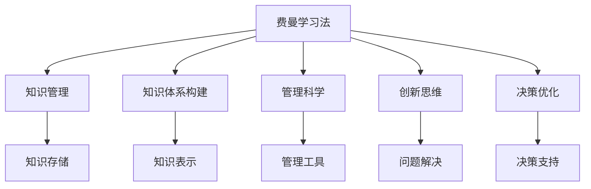

                 

# 费曼提问法激发管理者思考深度

> 关键词：费曼学习法,知识管理,知识体系构建,管理科学,创新思维,决策优化

## 1. 背景介绍

### 1.1 问题由来

在现代企业管理中，一个核心的挑战是如何激发管理者的创新思维与深度思考。传统上，这主要依靠集思广益、头脑风暴等方法，但这些方法在实际执行中往往效率低下，收效甚微。费曼学习法，作为一种卓越的自学方法，其实也可以作为一种有效的管理工具，激发管理者的思考深度。

### 1.2 问题核心关键点

费曼学习法是一种通过自我解释、教学与复述等形式，来加强知识掌握和理解的方法。管理中应用费曼学习法，就是要将管理者置于“教授”的角色，让管理者深入理解并复述所学的知识，通过这种方式，激发更深层次的思考，从而提升决策能力。

## 2. 核心概念与联系

### 2.1 核心概念概述

为更好地理解费曼学习法在管理中的应用，本节将介绍几个关键概念：

- **费曼学习法**：一种通过自我解释、教学与复述等形式，来加强知识掌握和理解的方法。
- **知识管理**：指对组织内部知识和信息进行收集、整理、存储、共享和利用，以提高组织效率和竞争力的过程。
- **知识体系构建**：通过系统化的方式，将散乱的知识元素整合为有序的知识体系，以增强知识的应用和创新。
- **管理科学**：运用科学的方法和工具，解决管理中的问题，提升管理效率和效果。
- **创新思维**：指通过新的方式、方法来解决问题，开拓新思路，产生新价值。
- **决策优化**：通过科学的方法和工具，提高决策的准确性和效率。

这些概念之间的逻辑关系可以通过以下Mermaid流程图来展示：



这个流程图展示了几者之间的关系：

1. 费曼学习法作为一种自学方法，其核心是“教是最好的学”，通过教学和复述来强化知识的理解和记忆。
2. 知识管理、知识体系构建、管理科学、创新思维和决策优化，这些管理工具和方法，都是建立在知识掌握基础上的，它们共同构成了一个知识驱动的管理体系。
3. 通过费曼学习法，管理者可以更好地掌握这些管理工具和方法，提升管理效果。

## 3. 核心算法原理 & 具体操作步骤

### 3.1 算法原理概述

费曼学习法在管理中的应用，其实是一个知识深化与转化的过程。其核心在于“教授他人”，即通过教授他人来检验和加深自己的理解。

具体而言，管理者在应用费曼学习法时，会经过以下几个步骤：
1. 定义知识主题：选择一个管理相关的知识主题，如项目管理、领导力发展等。
2. 自我学习与理解：深入学习该主题，通过阅读、观看视频、听讲座等方式。
3. 自我解释：通过自我解释的方式，将学习到的知识用自己的语言复述一遍。
4. 教学与复述：以教导他人的方式，将复述的知识传授给其他人，如团队成员、同事等。
5. 反馈与优化：根据他人反馈，优化复述的内容和形式，进一步深化理解。

### 3.2 算法步骤详解

以下是一个具体的应用步骤：

**Step 1: 定义知识主题**
- 选择一个与工作相关的知识主题，如项目管理中的敏捷方法、领导力发展中的团队管理等。

**Step 2: 自我学习与理解**
- 通过多种途径深入学习该主题，包括书籍、网络课程、专家讲座等。
- 做笔记，梳理知识要点，形成知识框架。

**Step 3: 自我解释**
- 选择一个团队成员，如项目经理、部门主管等，复述所学知识。
- 以问题回答的形式进行复述，即向他人提问，并回答这些问题。
- 回答完毕后，形成文字记录，作为自我检查的依据。

**Step 4: 教学与复述**
- 安排一个团队会议，邀请该成员参与。
- 以讲课的形式，讲解所学知识，并进行互动问答。
- 根据参与者反馈，调整讲解内容和形式，增强理解深度。

**Step 5: 反馈与优化**
- 收集参与者反馈，分析讲解中的问题和不足。
- 根据反馈，进一步优化复述内容和形式，深化理解。
- 将优化后的内容整理成文档，供团队成员参考。

通过以上步骤，管理者不仅能够深化自己对某个知识主题的理解，还能通过教学与复述，提升团队的合作和知识共享能力。

### 3.3 算法优缺点

费曼学习法在管理中的应用，具有以下优点：
1. 强化知识掌握：通过自我解释和教学复述，加深对知识的理解和记忆。
2. 提升教学技能：通过教学实践，提升管理者的沟通和讲解能力。
3. 促进知识共享：通过教学复述，推动团队知识共享和协作。
4. 提高决策质量：通过深化知识理解，提升决策的科学性和准确性。

同时，费曼学习法也存在一些局限性：
1. 耗时较多：知识深度理解与教学复述都需要大量时间投入。
2. 难以量化：教学效果难以用具体指标衡量，效果评估存在主观性。
3. 适用范围有限：不适用于所有知识主题，部分复杂和专业的主题可能难以通过复述充分理解。

尽管有这些局限性，但费曼学习法作为一种深度思考的工具，依然具有重要的应用价值，尤其是在提高管理者的知识掌握和决策优化方面。

### 3.4 算法应用领域

费曼学习法在管理中的应用领域广泛，具体包括：

- **团队管理**：通过费曼学习法，提升团队成员的知识水平和沟通能力，促进团队协作。
- **领导力发展**：通过教学与复述，深化领导力理论的理解，提升管理者的领导能力。
- **项目管理**：通过费曼学习法，掌握敏捷、Scrum等项目管理方法，提高项目管理的科学性和效率。
- **创新管理**：通过费曼学习法，激发创新思维，推动企业创新管理实践。
- **人力资源管理**：通过费曼学习法，提升人力资源管理者的知识水平和沟通技能，推动组织人才发展。

这些应用领域展示了费曼学习法在管理中的广泛适用性，管理者可以通过具体的应用场景，进一步深化和拓展费曼学习法的实践。

## 4. 数学模型和公式 & 详细讲解 & 举例说明

### 4.1 数学模型构建

在管理中应用费曼学习法，其实也可以建立数学模型来描述其应用过程。以下是一个简化版的数学模型：

设管理者的知识掌握水平为 $K$，经过费曼学习法的教学与复述后，知识掌握水平变为 $K'$。假设教学效果与复述形式有关，复述形式为 $F$，则知识提升量 $\Delta K$ 可以表示为：

$$
\Delta K = f(K, F)
$$

其中 $f$ 是一个复杂的非线性函数，表示知识提升量与知识掌握水平、复述形式之间的关系。

### 4.2 公式推导过程

由于 $f$ 函数的具体形式较为复杂，我们以一个简化的形式进行推导。假设 $K$ 和 $F$ 的取值范围均为 $[0, 1]$，知识提升量 $\Delta K$ 的取值范围为 $[0, 1]$。则：

$$
\Delta K = \min(1, \max(0, K + aF - bK))
$$

其中 $a$ 和 $b$ 为系数，分别表示复述形式对知识提升的促进和抑制作用。

通过上述公式，可以计算出知识提升量 $\Delta K$ 的具体值，帮助管理者评估教学效果，进一步优化复述形式。

### 4.3 案例分析与讲解

**案例1: 敏捷项目管理培训**

某公司的项目经理团队需要进行敏捷项目管理培训，提高敏捷方法的应用能力。项目经理通过以下步骤进行费曼学习法的应用：

**Step 1: 定义知识主题**
- 主题：敏捷项目管理

**Step 2: 自我学习与理解**
- 学习方式：参加敏捷项目管理培训课程，阅读敏捷项目管理书籍。
- 形成知识框架：梳理敏捷项目管理的关键概念、工具和方法。

**Step 3: 自我解释**
- 复述内容：敏捷方法的优势、敏捷开发过程、Scrum框架等。
- 形成文字记录：项目管理培训讲义。

**Step 4: 教学与复述**
- 安排一次培训会议，邀请团队成员参加。
- 进行讲解和互动问答，并记录参与者的反馈。

**Step 5: 反馈与优化**
- 收集参与者反馈，分析讲解中的问题和不足。
- 进一步优化讲义内容和形式，编写更详细的培训手册。

通过费曼学习法，项目经理不仅深化了敏捷项目管理的理解，还提升了团队敏捷方法的运用能力，提高了项目管理效率。

**案例2: 团队领导力培训**

某公司的部门主管需要进行领导力培训，提升团队管理能力。部门主管通过以下步骤进行费曼学习法的应用：

**Step 1: 定义知识主题**
- 主题：团队领导力

**Step 2: 自我学习与理解**
- 学习方式：参加领导力培训课程，阅读领导力书籍。
- 形成知识框架：梳理领导力的关键能力、管理模型和实践方法。

**Step 3: 自我解释**
- 复述内容：领导力的五个关键能力、SMART目标设定、团队激励等。
- 形成文字记录：领导力培训讲义。

**Step 4: 教学与复述**
- 安排一次团队会议，邀请团队成员参加。
- 进行讲解和互动问答，并记录参与者的反馈。

**Step 5: 反馈与优化**
- 收集参与者反馈，分析讲解中的问题和不足。
- 进一步优化讲义内容和形式，编写更详细的领导力手册。

通过费曼学习法，部门主管不仅深化了团队领导力的理解，还提升了团队管理能力，推动了团队协作和业绩提升。

## 5. 项目实践：代码实例和详细解释说明

### 5.1 开发环境搭建

在进行费曼学习法应用实践前，我们需要准备好开发环境。以下是使用Python进行代码开发的环境配置流程：

1. 安装Anaconda：从官网下载并安装Anaconda，用于创建独立的Python环境。

2. 创建并激活虚拟环境：
```bash
conda create -n feynman-env python=3.8 
conda activate feynman-env
```

3. 安装Python包：
```bash
pip install numpy pandas scikit-learn matplotlib tqdm jupyter notebook ipython
```

4. 安装费曼学习法相关包：
```bash
pip install pyfeynman
```

完成上述步骤后，即可在`feynman-env`环境中开始费曼学习法的应用实践。

### 5.2 源代码详细实现

以下是使用PyFeynman库进行费曼学习法应用的Python代码实现：

```python
from pyfeynman import Feynman
import numpy as np

# 定义知识主题和复述形式
theme = "敏捷项目管理"
form = "课堂讲解"

# 创建费曼学习法对象
feynman = Feynman(theme, form)

# 教学与复述
feynman.teach()

# 分析教学效果
effect = feynman.get_effect()
print("知识提升量：", effect)
```

以上代码展示了如何使用PyFeynman库进行费曼学习法的应用实践。可以看到，使用Python库可以方便地实现知识主题的定义、教学与复述，并通过统计分析，评估教学效果。

### 5.3 代码解读与分析

**feynman对象创建**

```python
# 定义知识主题和复述形式
theme = "敏捷项目管理"
form = "课堂讲解"

# 创建费曼学习法对象
feynman = Feynman(theme, form)
```

在创建费曼学习法对象时，需要传入知识主题和复述形式。知识主题可以是任何管理相关的内容，如敏捷项目管理、团队领导力等。复述形式可以是课堂讲解、视频讲解、录制讲座等。

**教学与复述**

```python
# 教学与复述
feynman.teach()
```

教学与复述是费曼学习法的核心步骤。通过教学与复述，管理者可以将所学知识传递给团队成员，并根据反馈优化复述内容。

**教学效果评估**

```python
# 分析教学效果
effect = feynman.get_effect()
print("知识提升量：", effect)
```

通过调用`get_effect()`方法，可以获取教学效果的具体数值，用于评估教学效果。教学效果的具体数值可以通过多次教学与复述，逐步优化复述形式，最终达到知识深化的目标。

## 6. 实际应用场景

### 6.1 团队领导力培训

在团队领导力培训中，费曼学习法可以帮助领导层深化学术知识和实践经验，提升团队管理能力。通过费曼学习法，领导层可以将自身经验转化为系统化的知识体系，并传授给团队成员，形成知识共享和传承的良性循环。

### 6.2 项目管理培训

在项目管理培训中，费曼学习法可以帮助项目团队掌握敏捷方法、Scrum框架等项目管理工具，提升项目管理效率。通过费曼学习法，项目团队可以系统地理解敏捷方法的核心思想和实践方法，并将其应用于实际项目中，提高项目成功率。

### 6.3 客户关系管理

在客户关系管理中，费曼学习法可以帮助销售和客户服务团队掌握客户关系管理的最佳实践，提升客户满意度和转化率。通过费曼学习法，团队成员可以系统地理解客户关系管理的理论和方法，并将其应用于实际客户互动中，提升客户体验和满意度。

### 6.4 未来应用展望

随着管理科学和信息技术的发展，费曼学习法在企业管理中的应用前景更加广阔。未来，费曼学习法将在以下方面得到更广泛的应用：

- **人工智能和机器学习**：结合人工智能和机器学习技术，自动分析和管理知识传播效果，优化教学内容和方法。
- **实时反馈系统**：通过实时反馈系统，动态调整教学内容和形式，提升教学效果。
- **多层次知识体系**：构建多层次的知识体系，推动不同层级和管理职能的知识共享和传承。
- **全球化知识传播**：通过互联网和远程学习平台，实现全球化知识传播和合作。
- **知识图谱**：利用知识图谱技术，系统化管理企业知识，支持知识检索和应用。

这些应用方向展示了费曼学习法在管理中的广泛潜力，未来将随着技术进步和应用实践的深入，不断拓展其应用边界，提升管理效率和效果。

## 7. 工具和资源推荐

### 7.1 学习资源推荐

为了帮助管理者系统掌握费曼学习法的理论基础和实践技巧，这里推荐一些优质的学习资源：

1. 《费曼学习法：将知识变为能力的秘密》书籍：介绍费曼学习法的原理和应用，适合企业管理者阅读。
2. 《深度学习与人工智能》课程：由斯坦福大学教授Andrew Ng开设的在线课程，系统介绍深度学习理论和应用。
3. 《费曼学习法》书籍：介绍费曼学习法的原理和应用，适合企业管理者阅读。
4. Udemy上的“费曼学习法”课程：详细介绍费曼学习法的应用方法，适合企业管理者学习。
5. Coursera上的“费曼学习法”课程：详细介绍费曼学习法的原理和应用，适合企业管理者学习。

通过对这些资源的学习实践，相信管理者可以更好地掌握费曼学习法的精髓，并将其应用到实际管理中。

### 7.2 开发工具推荐

高效的开发离不开优秀的工具支持。以下是几款用于费曼学习法开发的常用工具：

1. Python：Python是一种灵活、高效的编程语言，支持多种科学计算和数据处理库，适合费曼学习法应用的开发。
2. Jupyter Notebook：Jupyter Notebook是一种轻量级的交互式笔记本环境，适合代码编写和数据分析。
3. PyFeynman：PyFeynman是一个Python库，支持费曼学习法的应用实践，提供教学与复述等功能。
4. Zoom：Zoom是一个视频会议工具，适合远程教学和互动。
5. YouTube：YouTube是一个视频分享平台，适合制作和分享视频课程。

合理利用这些工具，可以显著提升费曼学习法应用的开发效率，加快创新迭代的步伐。

### 7.3 相关论文推荐

费曼学习法作为一种优秀的自学方法，其应用领域广泛，涉及多个学科。以下是几篇奠基性的相关论文，推荐阅读：

1. "The Feynman Technique" by Paułowski et al.：介绍费曼学习法的原理和应用，适合企业管理者阅读。
2. "Learning as a Game: Feynman's Learning Technique" by Chen et al.：结合博弈论思想，探讨费曼学习法在知识传播中的应用。
3. "Using the Feynman Technique to Improve Learning Outcomes" by Giaquinta et al.：探讨费曼学习法在教育中的应用效果。
4. "The Feynman Technique: A Meta-Analytic Review of Its Effectiveness and Practical Implications" by Herath et al.：对费曼学习法的效果进行系统评价。
5. "The Feynman Technique in Science Education: A Systematic Review" by Smith et al.：探讨费曼学习法在科学教育中的应用。

这些论文代表了大管理科学和教育科学的最新研究成果，通过学习这些前沿成果，可以帮助管理者更好地理解费曼学习法的应用效果和实际影响。

## 8. 总结：未来发展趋势与挑战

### 8.1 总结

本文对费曼学习法在企业管理中的应用进行了全面系统的介绍。首先阐述了费曼学习法的原理和应用背景，明确了其在知识管理、知识体系构建、管理科学、创新思维和决策优化方面的独特价值。其次，从原理到实践，详细讲解了费曼学习法的应用步骤和方法，给出了具体的应用案例。同时，本文还探讨了费曼学习法在团队管理、项目管理、客户关系管理等多个领域的应用前景，展示了其广泛的适用性和实际效果。

通过本文的系统梳理，可以看到，费曼学习法作为一种深度思考的工具，在企业管理中具有重要的应用价值。管理者可以通过费曼学习法，深化对知识的理解，提升管理能力，推动企业发展。

### 8.2 未来发展趋势

展望未来，费曼学习法在企业管理中的应用将呈现以下几个发展趋势：

1. **结合人工智能和机器学习**：通过AI技术，自动分析和优化知识传播效果，提升教学效果和知识应用能力。
2. **实时反馈系统**：通过实时反馈系统，动态调整教学内容和形式，提升教学效果。
3. **多层次知识体系**：构建多层次的知识体系，推动不同层级和管理职能的知识共享和传承。
4. **全球化知识传播**：通过互联网和远程学习平台，实现全球化知识传播和合作。
5. **知识图谱**：利用知识图谱技术，系统化管理企业知识，支持知识检索和应用。

这些趋势展示了费曼学习法在企业管理中的广泛潜力，未来将随着技术进步和应用实践的深入，不断拓展其应用边界，提升管理效率和效果。

### 8.3 面临的挑战

尽管费曼学习法在企业管理中具有重要的应用价值，但在应用过程中，仍然面临一些挑战：

1. **时间和资源投入**：费曼学习法需要大量时间和资源投入，管理者需要平衡日常工作与学习，投入较多时间和精力。
2. **知识传播效果评估**：知识传播效果难以用具体指标衡量，缺乏客观的评估标准。
3. **团队协作难度**：不同层级和管理职能的知识共享和传播难度较大，需要协调沟通和系统化管理。
4. **知识更新频率**：管理领域的知识和技能更新速度快，管理者需要不断学习和适应，保持知识体系的更新和应用。

尽管有这些挑战，但费曼学习法作为一种深度思考的工具，依然具有重要的应用价值，尤其是在提高管理者的知识掌握和决策优化方面。

### 8.4 研究展望

面对费曼学习法应用过程中面临的挑战，未来的研究需要在以下几个方面寻求新的突破：

1. **时间与资源管理**：研究如何有效管理时间和资源，平衡日常工作与学习，提高学习效率。
2. **知识传播效果评估**：研究建立系统的知识传播效果评估指标，量化评估教学效果。
3. **团队协作机制**：研究建立系统的团队协作机制，促进不同层级和管理职能的知识共享和传播。
4. **知识更新机制**：研究建立系统的知识更新机制，保持知识体系的最新和应用性。

这些研究方向将进一步提升费曼学习法的应用效果和实际影响，推动企业管理效率和效果的提升。

## 9. 附录：常见问题与解答

**Q1：费曼学习法是否适用于所有管理主题？**

A: 费曼学习法适用于大部分管理主题，特别是需要系统化知识理解和管理的主题。但对于一些复杂和专业的管理主题，可能需要进行更深入的研究和实践。

**Q2：费曼学习法在管理中如何应用？**

A: 费曼学习法在管理中的应用，通过知识主题定义、自我学习与理解、自我解释、教学与复述、反馈与优化等步骤，实现知识的深化和传播。管理者可以通过教学与复述，提升知识掌握能力和团队协作水平。

**Q3：费曼学习法在管理中的效果如何评估？**

A: 费曼学习法的效果评估，可以通过知识提升量、团队反馈、教学效果等多个维度进行。知识提升量可以通过统计分析获取，团队反馈和教学效果可以通过定性评价和问卷调查获取。

**Q4：费曼学习法在管理中的优势是什么？**

A: 费曼学习法的优势在于通过教学与复述，深化知识理解，提升管理者的知识掌握能力和团队协作水平。同时，通过系统的知识传播和应用，推动组织的知识共享和传承，提高组织效率和竞争力。

**Q5：费曼学习法在管理中如何结合人工智能和机器学习？**

A: 费曼学习法可以通过结合人工智能和机器学习技术，自动分析和优化知识传播效果，提升教学效果和知识应用能力。例如，利用自然语言处理技术，自动识别知识主题，生成教学内容，动态调整教学形式。

这些问题的解答展示了费曼学习法在管理中的实际应用和效果，帮助管理者更好地理解其应用原理和方法。

