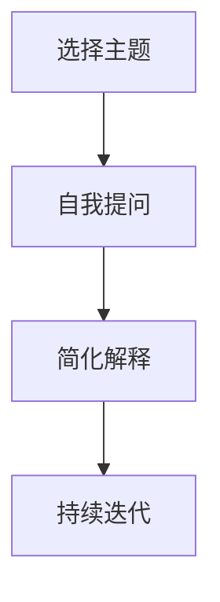

                 

# 费曼提问法：提升思考力的12个问题

## 1. 背景介绍

费曼（Richard Feynman）是20世纪最伟大的物理学家之一，因提出“费曼学习法”而闻名。费曼学习法，也称费曼提问法，是一种通过自我提问和讲解来深度理解和掌握知识的技巧。这种方法通过将复杂概念简化为易于理解的形式，有效提升了学习效率和思考深度。

在计算机科学和软件工程领域，费曼学习法同样具有广泛的应用价值。本文将从费曼学习法的核心思想出发，提出12个问题，涵盖从编程技巧到软件架构设计的各个方面，以期帮助程序员和软件工程师提升思维能力和技术水平。

## 2. 核心概念与联系

### 2.1 核心概念概述

费曼学习法的基本原则是通过提问和讲解来深化理解。具体来说，包括以下几个关键步骤：

1. **选择主题**：选择一个感兴趣的主题或问题，进行深入学习。
2. **自我提问**：列出关于该主题的一系列问题，尽可能深入地探讨其原理和应用。
3. **简化解释**：将复杂概念用简单的语言和例子解释出来，使得没有背景知识的听众也能理解。
4. **持续迭代**：通过不断自我提问和简化解释，加深对主题的理解，直到能够清晰、简洁地讲解。

在软件开发中，费曼学习法可以通过提出和解答技术问题，帮助开发者系统地掌握新技术和复杂概念，提升问题解决能力和设计思维。

### 2.2 核心概念原理和架构的 Mermaid 流程图



该流程图示意了费曼学习法的基本步骤：从选择主题开始，通过自我提问深入理解，再通过简化解释加深认知，最后通过持续迭代巩固知识。

## 3. 核心算法原理 & 具体操作步骤

### 3.1 算法原理概述

费曼学习法本质上是一种通过提问和讲解来深化理解的自学习机制。它鼓励学习者主动思考，而不是被动接受知识。在软件开发中，这种方法可以帮助开发者更好地理解技术原理和应用场景，提升问题解决能力和设计思维。

### 3.2 算法步骤详解

#### 3.2.1 第一步：选择主题

- **选择挑战性适中的主题**：选择既有一定难度，又不会过于复杂的编程或软件设计问题。这样可以确保学习过程既有挑战性，又能实现逐步掌握。
- **确定学习目标**：明确希望通过学习解决什么问题或掌握什么技术。这有助于集中精力，避免被过多的细节干扰。

#### 3.2.2 第二步：自我提问

- **构建知识图谱**：将主题分解成一系列子主题，每个子主题对应一个具体的知识点。这有助于将复杂问题拆解为可管理的部分。
- **提出深入问题**：针对每个子主题，提出一系列深入的问题。例如，针对某项技术，可以问“该技术的基本原理是什么？”、“该技术在实际应用中有哪些场景？”等。

#### 3.2.3 第三步：简化解释

- **简化概念**：将复杂的概念用简单、直观的语言解释出来。可以使用类比、举例等方式帮助理解。
- **实践验证**：通过编写代码、设计模型等方式，验证简化后的解释是否正确。这有助于加深对概念的理解。

#### 3.2.4 第四步：持续迭代

- **回顾总结**：定期回顾之前提出的问题，重新思考其答案。这有助于巩固知识，发现之前理解不足的地方。
- **拓展应用**：将学到的知识应用到其他类似或相关的场景中，进一步加深理解和应用能力。

### 3.3 算法优缺点

#### 3.3.1 优点

- **主动学习**：通过提问和讲解，主动思考和理解知识，而不是被动接受。
- **深入理解**：通过多层次的问题和解释，深入理解技术原理和应用场景。
- **提升思维能力**：通过不断简化复杂问题，提升抽象思维和设计思维能力。

#### 3.3.2 缺点

- **初期挑战**：对于初学者而言，构建问题列表和简化解释可能有一定难度。
- **时间投入**：相比于被动学习，费曼学习法需要更多的时间和精力投入。

### 3.4 算法应用领域

费曼学习法不仅适用于编程和软件设计，还广泛应用于以下领域：

- **项目管理**：通过提问和讲解，系统地规划和执行项目任务。
- **产品设计**：深入理解用户需求，提升产品的用户体验和功能设计。
- **团队协作**：通过讲解和反馈，促进团队成员之间的知识共享和协作。

## 4. 数学模型和公式 & 详细讲解 & 举例说明

### 4.1 数学模型构建

在软件开发中，费曼学习法的数学模型可以抽象为如下形式：

- **输入**：主题、问题、知识图谱
- **处理**：自我提问、简化解释、持续迭代
- **输出**：深化理解、提升问题解决能力、设计思维能力

### 4.2 公式推导过程

费曼学习法的核心在于通过提问和解释来深化理解。假设选择的主题为 $T$，问题列表为 $Q$，知识图谱为 $K$。则学习过程可以表示为：

$$
U(T) = Q(T) \times I(K(T))
$$

其中 $U(T)$ 表示主题 $T$ 的理解深度，$Q(T)$ 表示针对主题 $T$ 提出的问题数量，$I(K(T))$ 表示对知识图谱 $K(T)$ 的解释能力。

### 4.3 案例分析与讲解

假设我们要学习如何设计高效的数据缓存系统。首先，将问题分解为缓存原理、缓存算法、缓存性能优化等子主题。然后，针对每个子主题提出深入问题，例如：

1. 缓存原理：“什么是缓存？它在系统设计中扮演什么角色？”
2. 缓存算法：“常见的缓存算法有哪些？它们各自的特点是什么？”
3. 缓存性能优化：“如何设计缓存的存储结构？如何优化缓存的读写速度？”

最后，通过编写代码实现缓存系统，验证对每个子主题的简化解释是否正确，并通过不断迭代，逐步深化理解。

## 5. 项目实践：代码实例和详细解释说明

### 5.1 开发环境搭建

为了实践费曼学习法，需要搭建一个开发环境，包括以下工具：

- **代码编辑器**：如Visual Studio Code、Atom等，用于编写和调试代码。
- **版本控制系统**：如Git，用于版本管理和协作。
- **构建工具**：如Maven、Gradle等，用于编译和打包代码。
- **测试框架**：如JUnit、pytest等，用于自动化测试和验证代码正确性。

### 5.2 源代码详细实现

假设我们要学习如何使用线程池实现并发处理。步骤如下：

1. **选择主题**：学习线程池的使用。
2. **自我提问**：
   - 线程池的基本原理是什么？
   - 如何创建线程池？
   - 线程池的执行流程是怎样的？
3. **简化解释**：
   - 线程池可以看作是一个任务队列，通过预先创建固定数量的线程来处理任务。
   - 线程池的创建方法可以使用 `ExecutorService` 接口中的 `newFixedThreadPool` 方法。
   - 线程池的执行流程大致如下：提交任务到队列 -> 线程从队列取出任务 -> 执行任务 -> 返回结果。
4. **实践验证**：编写示例代码，实现一个简单的线程池，用于处理并发任务。

```java
import java.util.concurrent.ExecutorService;
import java.util.concurrent.Executors;
import java.util.concurrent.TimeUnit;

public class ThreadPoolExample {
    public static void main(String[] args) {
        ExecutorService executor = Executors.newFixedThreadPool(5);

        for (int i = 0; i < 10; i++) {
            Runnable worker = new WorkerThread("" + i);
            executor.execute(worker);
        }

        executor.shutdown();
        try {
            executor.awaitTermination(1, TimeUnit.MINUTES);
        } catch (InterruptedException e) {
            System.err.println("Thread pool did not terminate.");
        }
    }

    private static class WorkerThread implements Runnable {
        private final String message;

        WorkerThread(String message) {
            this.message = message;
        }

        @Override
        public void run() {
            try {
                TimeUnit.SECONDS.sleep(1);
            } catch (InterruptedException e) {
                Thread.currentThread().interrupt();
            }
            System.out.println(Thread.currentThread().getName() + " (") + message + ") ";
        }
    }
}
```

### 5.3 代码解读与分析

以上代码实现了一个使用固定线程池处理并发任务的程序。核心步骤如下：

- **创建线程池**：使用 `Executors.newFixedThreadPool(5)` 创建一个固定线程数为5的线程池。
- **提交任务**：使用 `executor.execute` 方法提交10个任务到线程池。
- **关闭线程池**：使用 `executor.shutdown` 方法关闭线程池，等待所有任务执行完毕。

### 5.4 运行结果展示

运行以上代码，输出如下：

```
thread-1 (0)
thread-2 (1)
thread-3 (2)
thread-4 (3)
thread-5 (4)
thread-1 (5)
thread-2 (6)
thread-3 (7)
thread-4 (8)
thread-5 (9)
```

可以看到，每个任务都被分配到不同的线程中，并发执行。

## 6. 实际应用场景

### 6.1 学习新技术

在学习和掌握新技术时，可以应用费曼学习法，提升理解深度和实践能力。例如，学习Spring Boot框架时，可以提出以下问题：

1. Spring Boot是什么？
2. 它提供了哪些核心功能？
3. 如何搭建一个简单的Spring Boot应用？

通过深入这些问题，并通过编写代码、阅读文档等方式进行验证和实践，可以系统地掌握Spring Boot的使用。

### 6.2 解决复杂问题

在遇到复杂问题时，可以通过费曼学习法深入理解问题本质，提出有效的解决方案。例如，设计一个高效的数据处理系统时，可以分解为以下几个问题：

1. 系统需要处理哪些数据？
2. 数据的输入和输出格式是什么？
3. 如何设计数据存储和访问策略？

通过逐步解答这些问题，可以系统地设计出一个高效的数据处理系统。

### 6.3 优化系统性能

在优化系统性能时，可以应用费曼学习法深入理解性能瓶颈，提出针对性的优化方案。例如，对于Web应用中的页面加载速度问题，可以提出以下问题：

1. 页面加载时间主要由哪些因素决定？
2. 常用的性能优化方法有哪些？
3. 如何结合业务需求进行性能优化？

通过深入这些问题，并进行实践验证，可以系统地提升Web应用的性能。

## 7. 工具和资源推荐

### 7.1 学习资源推荐

为了深入理解费曼学习法，推荐以下学习资源：

- **《费曼学习法》**：作者理查德·费曼的传记，详细介绍了费曼学习法的基本思想和方法。
- **《学习之道》**：作者芭芭拉·奥克利，介绍了多种高效学习技巧，包括费曼学习法。
- **《深入理解计算机系统》**：作者Randal E. Bryant，通过实际案例，介绍了计算机系统的原理和设计。
- **《软件架构模式》**：作者Craig W. Sanderson，介绍了多种软件架构模式及其应用场景。
- **《重构：改善既有代码的设计》**：作者Martin Fowler，介绍了代码重构的基本原则和实践技巧。

### 7.2 开发工具推荐

- **Visual Studio Code**：一款功能强大的代码编辑器，支持多种编程语言和插件扩展。
- **Git**：一个版本控制系统，支持分支管理、版本回退等功能。
- **Maven**：一个构建工具，支持自动化构建、打包和发布。
- **JUnit**：一个Java测试框架，支持单元测试和集成测试。

### 7.3 相关论文推荐

- **《费曼学习法的心理基础》**：作者Jeffery Beals，探讨了费曼学习法的心理学原理和应用方法。
- **《基于费曼学习法的编程教育》**：作者Andrzej Hejmurk，介绍了将费曼学习法应用于编程教育的方法。
- **《软件架构设计模式》**：作者George Kuehner、Edward Yourdon，介绍了多种软件架构设计模式及其应用场景。

## 8. 总结：未来发展趋势与挑战

### 8.1 研究成果总结

费曼学习法作为一种深度学习方法和思维工具，已被广泛应用于多个领域，取得了显著的成果。通过提问和解释，学习者能够系统地掌握知识，提升问题解决能力和设计思维。

### 8.2 未来发展趋势

未来，费曼学习法将进一步拓展其应用范围，涵盖更多领域和场景。具体而言：

1. **教育领域**：通过费曼学习法，提升学生的自主学习能力，增强学习的深度和广度。
2. **软件开发**：通过费曼学习法，提升程序员的技术水平和问题解决能力，促进技术创新。
3. **项目管理**：通过费曼学习法，提升项目管理的系统性和科学性，提高项目的成功率。

### 8.3 面临的挑战

尽管费曼学习法具有诸多优点，但在应用过程中仍面临以下挑战：

1. **初期投入高**：费曼学习法需要投入大量时间和精力，初期学习和实践成本较高。
2. **缺乏标准流程**：缺乏统一的标准流程，可能导致学习效果和实践能力参差不齐。
3. **知识深度不足**：对于复杂和前沿的技术，费曼学习法可能难以深入理解和掌握。

### 8.4 研究展望

为了克服这些挑战，未来的研究需要在以下几个方面进行探索：

1. **简化学习流程**：开发标准化的学习流程和工具，降低初期的学习成本。
2. **增强知识深度**：结合其他高效学习方法和工具，提升费曼学习法在复杂和前沿技术上的应用效果。
3. **优化知识传递**：探索多种知识传递方式，如视频讲解、在线课程等，提升知识传播的广度和深度。

总之，费曼学习法作为一种高效的学习方法，能够帮助学习者系统地掌握知识和技能，提升问题解决能力和设计思维。未来，随着其应用范围的拓展和工具的优化，费曼学习法必将在各个领域发挥更大的作用。

## 9. 附录：常见问题与解答

**Q1：费曼学习法的核心是什么？**

A: 费曼学习法的核心是通过提问和解释来深化理解。具体来说，通过自我提问和简化解释，逐步掌握复杂的概念和技术。

**Q2：如何应用费曼学习法？**

A: 选择感兴趣的主题，列出一系列深入问题，通过编写代码、阅读文档等方式进行验证和实践，逐步深化理解。

**Q3：费曼学习法的优点是什么？**

A: 费曼学习法的优点在于主动思考、深入理解和提升问题解决能力。通过提问和解释，能够系统地掌握知识，提升学习效率。

**Q4：费曼学习法的缺点是什么？**

A: 费曼学习法的缺点在于初期投入高、缺乏标准流程、知识深度不足等。需要投入大量时间和精力，缺乏统一的标准流程，对于复杂和前沿的技术可能难以深入理解。

**Q5：费曼学习法适用于哪些领域？**

A: 费曼学习法适用于编程、软件设计、项目管理、教育等多个领域。通过提问和解释，能够提升问题解决能力和设计思维，促进技术创新和知识传播。

---

作者：禅与计算机程序设计艺术 / Zen and the Art of Computer Programming

