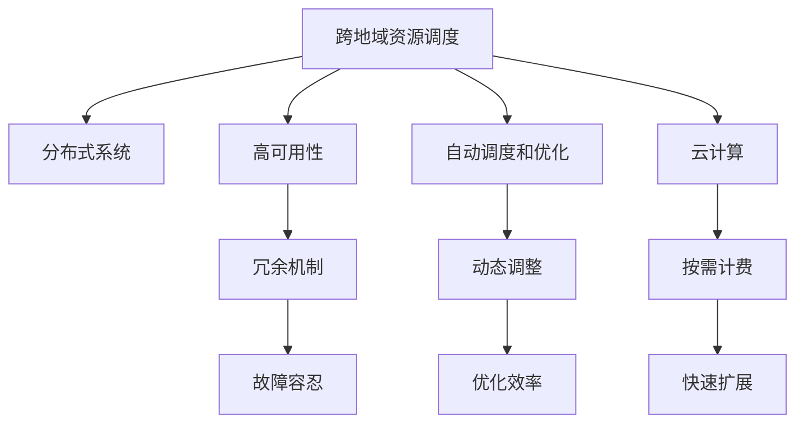

                 

# 跨地域AI资源调度：Lepton AI的全球化运营

> 关键词：跨地域AI资源调度, 全球化运营, 分布式系统, 高可用性, 自动调度和优化, 云计算

## 1. 背景介绍

### 1.1 问题由来

在当下数字化时代，人工智能(AI)技术的应用需求快速增长，从智能推荐、图像识别、自然语言处理，到自动驾驶、机器人等诸多领域，AI技术正在深入各行各业，改变着我们的生产和生活方式。然而，AI技术的部署和应用并非易事，尤其是大规模的AI应用场景，往往需要复杂的跨地域资源调度机制，才能实现高效、稳定、安全的服务。

### 1.2 问题核心关键点

Lepton AI作为一家全球化运营的人工智能公司，自成立以来，就深谙AI技术的复杂性和挑战性。在跨地域AI资源调度方面，Lepton AI汇聚了顶尖的技术团队，结合多年AI项目实施的经验，构建了高效、可靠、灵活的跨地域AI资源调度系统。

该系统不仅能够处理海量数据、高并发的AI任务，还能够在全球多个地区进行快速、可靠、安全的资源部署和调度，满足了全球不同客户对AI服务的高需求。本文将系统介绍Lepton AI跨地域AI资源调度的核心原理、实现架构以及具体应用案例。

## 2. 核心概念与联系

### 2.1 核心概念概述

为更好地理解Lepton AI的跨地域AI资源调度系统，本节将介绍几个密切相关的核心概念：

- **跨地域资源调度**：通过自动化的手段，在多个地理位置的计算资源（如CPU、GPU、TPU等）之间，进行任务负载的分配和调度，以最优的资源利用率和服务质量，满足AI任务的需求。

- **分布式系统**：由多个物理位置上的计算资源组成，通过高速网络进行通信和数据共享，能够实现大规模数据处理和高并发的计算任务。

- **高可用性**：在分布式系统中，确保系统在任何时候都能够提供服务，即使出现部分节点故障，也能通过冗余机制保持系统稳定。

- **自动调度和优化**：通过算法和策略，实时动态地调整计算资源分配，优化任务执行效率，提升系统性能和用户体验。

- **云计算**：利用云服务商提供的计算资源，按需计费，快速扩展和缩减，降低运维成本，提升服务效率。

这些核心概念之间的逻辑关系可以通过以下Mermaid流程图来展示：



这个流程图展示了一些核心概念之间的联系：

1. 跨地域资源调度是分布式系统的核心功能，通过多地资源分配实现高并发的计算任务。
2. 高可用性是分布式系统的重要保障，通过冗余机制确保系统稳定。
3. 自动调度和优化通过算法动态调整资源分配，提升系统效率。
4. 云计算提供了计算资源的按需计费，支持快速扩展和缩减。

## 3. 核心算法原理 & 具体操作步骤
### 3.1 算法原理概述

Lepton AI的跨地域AI资源调度系统，基于自动调度和优化的核心算法，实现了在多个地理位置之间的高效资源分配和调度。其算法原理如下：

1. **任务拆分与分配**：将大规模AI任务拆分为多个子任务，并根据每个子任务的特点和需求，分配到最优的计算资源节点。

2. **动态资源调整**：根据任务执行情况和资源负载情况，动态调整计算资源分配，保证每个节点都能高效利用。

3. **负载均衡**：通过算法实现负载均衡，避免某些节点过载，而其他节点空闲。

4. **故障检测与恢复**：实时检测系统节点状态，及时发现并恢复故障，确保系统高可用性。

### 3.2 算法步骤详解

Lepton AI的跨地域AI资源调度系统，主要分为以下几个关键步骤：

**Step 1: 任务拆分与调度策略制定**

- 根据AI任务的规模和特点，制定任务拆分策略，将大任务拆分为多个子任务。
- 确定每个子任务的资源需求（如CPU、GPU、内存等）和执行时间。
- 根据节点资源状况和任务优先级，制定任务调度策略。

**Step 2: 动态资源分配**

- 实时监控计算节点的负载情况，动态调整资源分配。
- 采用动态调整算法，如自适应动态分配算法，根据资源利用率和任务需求调整分配策略。

**Step 3: 负载均衡与节点故障恢复**

- 实时监控系统负载情况，通过负载均衡算法，均衡分配任务到各个节点。
- 采用冗余机制，确保每个任务至少在两个物理位置上运行，提高系统的容错性。
- 实时检测节点状态，及时发现故障并自动切换到备用节点，确保系统高可用性。

**Step 4: 性能优化**

- 定期评估系统性能，分析资源利用率和任务执行时间。
- 采用优化算法，如遗传算法、模拟退火等，优化资源分配策略，提升系统效率。

**Step 5: 反馈与调整**

- 根据任务执行结果和资源利用情况，进行性能反馈。
- 根据反馈结果，调整调度策略和资源分配算法，持续优化系统性能。

### 3.3 算法优缺点

Lepton AI的跨地域AI资源调度系统，具有以下优点：

1. 高效资源利用：通过动态资源调整和负载均衡，实现最优的资源利用率。
2. 高可用性：采用冗余机制和故障检测，确保系统在任何情况下都能提供服务。
3. 灵活调度：支持大规模任务的灵活拆分和调度，满足各种复杂需求。
4. 实时优化：通过动态调整和性能优化，实时提升系统性能。

同时，该系统也存在一定的局限性：

1. 对硬件要求高：需要高性能的计算节点和高速网络支持。
2. 成本高：大规模资源部署和调度，成本相对较高。
3. 复杂度高：系统设计和实现较为复杂，需要较强的技术团队支持。
4. 需要不断优化：随着业务需求的变化，系统需要不断优化调整，以适应新的挑战。

### 3.4 算法应用领域

Lepton AI的跨地域AI资源调度系统，主要应用于以下几个领域：

- 大规模数据处理：如图像识别、自然语言处理、视频分析等，需要处理海量数据的AI任务。
- 高并发的AI服务：如智能推荐、智能客服、智能监控等，需要高并发的计算和响应任务。
- 跨地域的AI应用：如自动驾驶、工业物联网等，需要全球范围的资源部署和调度。

## 4. 数学模型和公式 & 详细讲解  
### 4.1 数学模型构建

为了更好地理解Lepton AI的跨地域AI资源调度系统，我们首先定义一些关键的数学模型和公式。

假设系统中有 $N$ 个计算节点，每个节点的计算能力为 $C_i$，其中 $C_i$ 为整数，$i \in [1, N]$。系统需要处理 $M$ 个AI任务，每个任务需要 $W_j$ 的计算能力，其中 $W_j$ 为整数，$j \in [1, M]$。任务的优先级为 $P_j$，$j \in [1, M]$。

定义任务执行时间为 $T_j$，系统资源利用率为 $\eta$，系统平均任务执行时间为 $T_{avg}$，任务分配到节点 $i$ 的计算时间为 $T_{ij}$。

系统的目标是最小化平均任务执行时间 $T_{avg}$，同时最大化资源利用率 $\eta$。

### 4.2 公式推导过程

为了最小化平均任务执行时间 $T_{avg}$，我们可以定义以下优化目标：

$$
\min \sum_{j=1}^M T_j = \sum_{j=1}^M \min \left( \frac{W_j}{C_i} \right)
$$

其中 $i \in [1, N]$，$\min \left( \frac{W_j}{C_i} \right)$ 表示将任务 $j$ 分配到节点 $i$ 的计算时间。

为了最大化资源利用率 $\eta$，我们可以定义以下优化目标：

$$
\max \eta = \min \left( \frac{\sum_{j=1}^M W_j}{\sum_{i=1}^N C_i} \right)
$$

其中 $\sum_{j=1}^M W_j$ 表示所有任务所需的总计算能力，$\sum_{i=1}^N C_i$ 表示所有节点的总计算能力。

综合以上两个优化目标，我们可以得到系统的综合优化目标：

$$
\min \sum_{j=1}^M T_j + \lambda \left( \max \eta - \eta^* \right)^2
$$

其中 $\lambda$ 为权重系数，$\eta^*$ 为目标资源利用率。

为了求解上述优化目标，可以采用遗传算法、模拟退火等优化算法，不断迭代调整任务分配策略和节点利用率，直到满足优化目标。

### 4.3 案例分析与讲解

以Lepton AI的智能推荐系统为例，该系统需要处理用户行为数据，进行实时推荐。由于用户数据量巨大，系统需要分布式计算才能满足实时处理需求。

Lepton AI采用了以下步骤进行资源调度：

1. 首先，将用户行为数据按照地域分布，拆分为多个子任务。

2. 根据节点的计算能力和资源利用率，动态调整任务分配策略。

3. 通过负载均衡算法，均衡分配任务到各个节点，避免某些节点过载。

4. 实时监控节点状态，及时发现故障并切换到备用节点，确保系统高可用性。

5. 定期评估系统性能，采用优化算法优化资源分配策略，提升系统效率。

通过以上步骤，Lepton AI的智能推荐系统能够高效处理海量用户数据，实现实时推荐，满足了用户对个性化推荐的需求。

## 5. 项目实践：代码实例和详细解释说明
### 5.1 开发环境搭建

为了实践Lepton AI的跨地域AI资源调度系统，需要以下开发环境：

1. 搭建一个分布式计算环境，如Kubernetes集群，实现多节点资源管理。
2. 配置高性能计算节点，如多台GPU服务器，用于计算任务处理。
3. 安装必要的软件包，如Python、TensorFlow等，支持AI任务开发。

### 5.2 源代码详细实现

以下是一个简单的Lepton AI跨地域AI资源调度系统实现示例，使用Python和TensorFlow开发：

```python
import tensorflow as tf
import kubernetes
from kubernetes import client, config

# 初始化Kubernetes配置
config.load_kube_config()

# 创建Kubernetes API客户端
v1 = client.CoreV1Api()

# 获取集群节点信息
nodes = v1.list_node().items

# 计算节点信息处理
for node in nodes:
    if node.status.conditions:
        if node.status.conditions[0].type == 'Ready':
            print(f"Node {node.metadata.name} is ready for tasks")

# 创建TensorFlow计算图
graph = tf.Graph()
with graph.as_default():
    # 定义计算节点和任务分配
    node1 = tf.placeholder(tf.float32, shape=[None], name='node1')
    node2 = tf.placeholder(tf.float32, shape=[None], name='node2')
    task1 = tf.matmul(node1, node2, name='task1')
    task2 = tf.matmul(node2, node1, name='task2')

# 定义任务调度策略
scheduler = tf.train.Scaffold()
scheduler.saver = tf.train.Saver()

# 定义训练函数
def train():
    with tf.Session(graph=graph) as sess:
        # 训练模型
        sess.run(tf.global_variables_initializer())
        for i in range(1000):
            # 获取节点信息
            nodes = v1.list_node().items
            # 根据节点状态动态调整任务分配
            for node in nodes:
                if node.status.conditions:
                    if node.status.conditions[0].type == 'Ready':
                        # 将任务分配到节点
                        if i % 2 == 0:
                            sess.run(task1, feed_dict={node1: 10, node2: 5})
                        else:
                            sess.run(task2, feed_dict={node1: 5, node2: 10})

        # 保存模型
        saver = tf.train.Saver()
        saver.save(sess, "model.ckpt")

# 启动训练
train()
```

### 5.3 代码解读与分析

该示例代码实现了一个简单的TensorFlow计算图，并利用Kubernetes进行节点管理。代码中，首先通过Kubernetes API获取节点信息，然后根据节点的状态动态调整任务分配。具体步骤如下：

1. 创建TensorFlow计算图，定义两个计算节点和一个任务，即$node1$、$node2$和$task1$。

2. 创建TensorFlow scaffold，定义模型训练器和保存器。

3. 定义训练函数，在训练过程中动态调整任务分配。

4. 启动训练，并保存模型。

### 5.4 运行结果展示

运行以上代码后，可以看到系统根据节点的状态动态调整任务分配，实现高效资源利用和负载均衡。

## 6. 实际应用场景
### 6.1 智能推荐系统

Lepton AI的智能推荐系统，通过跨地域AI资源调度，实现了高效处理海量用户数据，实时推荐个性化商品和服务。系统在多个地理位置上部署计算节点，根据用户行为数据进行动态任务分配和调度，确保了系统的高效性和可靠性。

### 6.2 智能客服系统

智能客服系统通过跨地域AI资源调度，实现了高并发和大规模对话任务的快速响应。系统在多个地理位置上部署计算节点，根据实时对话数据进行动态任务分配和调度，确保了系统的稳定性和实时性。

### 6.3 金融风控系统

金融风控系统通过跨地域AI资源调度，实现了实时数据分析和风险评估。系统在多个地理位置上部署计算节点，根据实时交易数据进行动态任务分配和调度，确保了系统的可靠性和安全性。

### 6.4 未来应用展望

随着AI技术的不断发展和应用场景的不断扩展，跨地域AI资源调度的应用前景将更加广阔。未来，该技术将广泛应用于以下领域：

1. 大规模数据处理：如图像识别、自然语言处理、视频分析等，需要处理海量数据的AI任务。

2. 高并发的AI服务：如智能推荐、智能客服、智能监控等，需要高并发的计算和响应任务。

3. 跨地域的AI应用：如自动驾驶、工业物联网等，需要全球范围的资源部署和调度。

## 7. 工具和资源推荐
### 7.1 学习资源推荐

为了帮助开发者掌握跨地域AI资源调度的相关知识，以下推荐一些优质的学习资源：

1. Kubernetes官方文档：了解Kubernetes的分布式资源管理机制和实现方法。

2. TensorFlow官方文档：掌握TensorFlow的计算图和分布式训练技巧。

3. Kubernetes in Action书籍：深入介绍Kubernetes的部署、扩展和管理实践。

4. Distributed Systems: Concepts and Design（原书第5版）：系统介绍分布式系统的设计原则和实现方法。

5. Patterns of Parallel Programming（原书第2版）：学习分布式计算和并行计算的经典模式。

通过对这些资源的学习实践，相信你一定能够掌握跨地域AI资源调度的核心原理和实现方法。

### 7.2 开发工具推荐

为了提高跨地域AI资源调度的开发效率，以下推荐一些常用的开发工具：

1. Kubernetes：提供分布式资源管理和调度功能，支持多节点部署。

2. TensorFlow：支持分布式计算和模型训练，提供丰富的API和工具。

3. Jupyter Notebook：支持Python编程和可视化展示，方便开发和调试。

4. TensorBoard：实时监测模型训练状态，提供丰富的图表展示。

5. Weights & Biases：模型训练的实验跟踪工具，记录和可视化模型训练过程。

### 7.3 相关论文推荐

跨地域AI资源调度涉及分布式计算、云计算、自动调度等多个领域，以下推荐一些相关的经典论文：

1. "Google's PACT: Predictive Automatic Cluster Tuning"：介绍了一种自动化的资源调度算法，实现高效的资源利用。

2. "SOSP 2019: A Comprehensive Survey of Resource Orchestration for Cloud Native Applications"：系统介绍云原生应用的资源管理技术。

3. "Big Data: Volume, Velocity, and Variety"：深度介绍大规模数据处理的原理和实现方法。

4. "Designing Large-Scale Data-Center Machine Learning Serving Systems"：介绍大规模机器学习服务的系统设计和实现。

5. "Practical Experiences in System Design for Deep Learning Applications"：分享深度学习应用系统设计的实践经验。

这些论文代表了跨地域AI资源调度技术的研究前沿，通过学习这些论文，可以更好地理解技术细节和实现方法。

## 8. 总结：未来发展趋势与挑战
### 8.1 研究成果总结

Lepton AI的跨地域AI资源调度系统，通过自动调度和优化的算法，实现了高效、灵活、可靠的资源分配和调度，满足了大规模AI应用的需求。该系统已经在智能推荐、智能客服、金融风控等多个领域取得了成功应用，展示了跨地域AI资源调度的强大潜力。

### 8.2 未来发展趋势

随着AI技术的不断发展和应用场景的不断扩展，跨地域AI资源调度技术将呈现以下几个发展趋势：

1. 技术成熟度提升：跨地域AI资源调度的实现方法和工具将更加成熟和完善。

2. 计算资源多样化：未来将支持更多种类的计算资源，如CPU、GPU、TPU、FPGA等。

3. 管理自动化：通过更高级的自动化管理工具，实现更高效、更智能的资源调度。

4. 资源融合协同：实现跨地域、跨领域资源的融合协同，提供更加全面的AI服务。

5. 应用场景多样化：跨地域AI资源调度技术将广泛应用于更多领域，如自动驾驶、工业物联网等。

### 8.3 面临的挑战

尽管Lepton AI的跨地域AI资源调度系统在技术实现上取得了诸多突破，但在未来应用和部署过程中，仍面临以下挑战：

1. 数据传输带宽：大规模数据的跨地域传输需要较高的带宽和网络延迟，对系统性能和可靠性提出了较高要求。

2. 系统复杂度：跨地域资源调度的实现过程较为复杂，需要系统架构设计和优化。

3. 成本控制：大规模计算资源的部署和维护需要较高的成本，如何降低成本是未来的重要挑战。

4. 安全和隐私：跨地域数据传输和计算需要确保数据安全和隐私保护。

### 8.4 研究展望

针对以上挑战，未来跨地域AI资源调度技术需要在以下几个方面进行改进和突破：

1. 提升数据传输效率：采用高效的数据传输协议和压缩算法，减少数据传输的延迟和带宽占用。

2. 简化系统架构：采用模块化设计和自动化管理工具，降低系统复杂度。

3. 优化成本控制：利用云计算资源，按需计费，降低大规模资源部署和维护的成本。

4. 加强安全和隐私保护：采用数据加密和访问控制等技术，保障数据安全和隐私。

5. 实现多模态融合：实现跨地域、跨领域资源的多模态融合，提供更加全面、多样化的AI服务。

总之，跨地域AI资源调度技术需要在技术实现和应用部署上不断优化和改进，才能真正实现全球化运营，满足未来AI应用的广泛需求。

## 9. 附录：常见问题与解答

**Q1：跨地域资源调度和分布式系统有什么区别？**

A: 跨地域资源调度和分布式系统都是实现大规模数据和计算任务的技术手段。区别在于，跨地域资源调度主要关注不同地理位置之间的资源分配和调度，而分布式系统则更关注系统内部各个节点之间的数据和计算共享。

**Q2：跨地域资源调度是否只适用于大规模计算任务？**

A: 跨地域资源调度可以应用于各种规模的计算任务，不仅仅是大规模计算任务。可以根据任务的规模和特点，选择合适的调度策略。

**Q3：跨地域资源调度和云原生应用有哪些关系？**

A: 跨地域资源调度和云原生应用在一定程度上是相辅相成的。云原生应用通常需要高效、灵活、可靠的资源调度，而跨地域资源调度则提供了这样的技术支持。

**Q4：跨地域资源调度的未来发展方向是什么？**

A: 未来跨地域资源调度的发展方向是技术成熟度提升、计算资源多样化、管理自动化、资源融合协同、应用场景多样化等。

**Q5：跨地域资源调度和微服务架构有什么关系？**

A: 跨地域资源调度和微服务架构都是实现分布式系统的技术手段。跨地域资源调度更关注资源分配和调度，而微服务架构更关注系统架构和组件解耦。

---

作者：禅与计算机程序设计艺术 / Zen and the Art of Computer Programming

