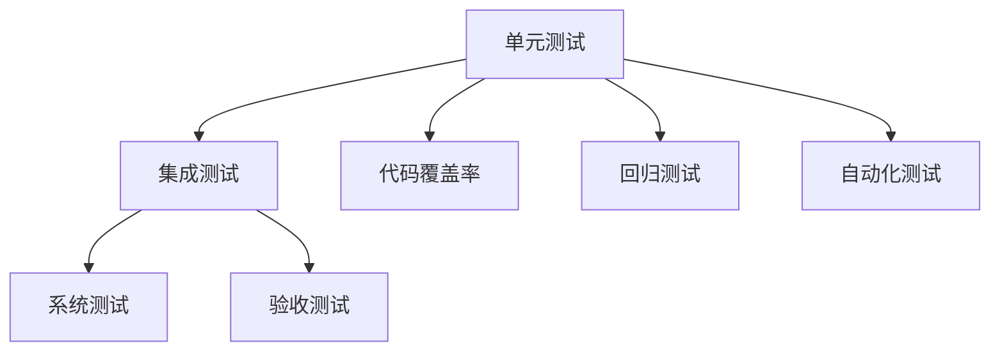
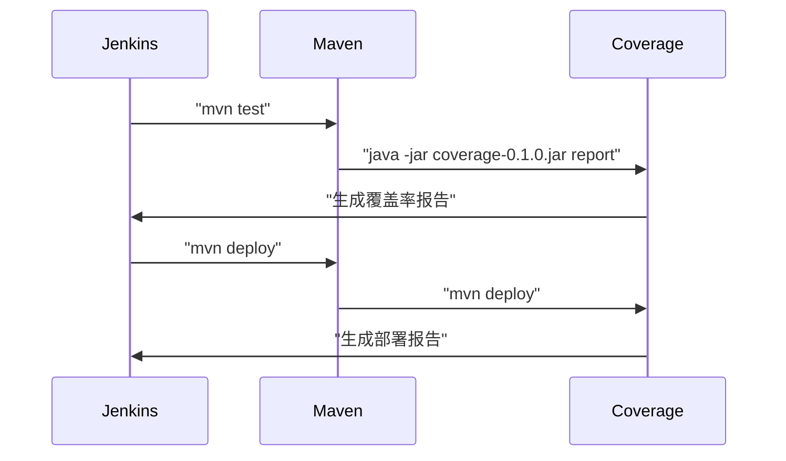

                 

# 软件测试策略：单元测试到集成测试

软件测试是软件开发过程中至关重要的一环，旨在验证软件的正确性和可靠性，确保其功能符合设计需求。然而，随着系统规模的不断扩大，测试成本和复杂度也随之增加。本文将深入探讨从单元测试到集成测试的软件测试策略，揭示不同测试阶段的优点、缺点以及应用场景，为软件开发的测试实践提供全面指导。

## 1. 背景介绍

### 1.1 问题由来

在软件开发过程中，软件测试通常分为多个阶段，包括单元测试、集成测试、系统测试和验收测试等。每个阶段都有其特定的测试目标和测试方法，但同时也会面临一系列的挑战。

- **单元测试**：测试代码的最小单元，即函数的正确性。旨在发现源代码错误。
- **集成测试**：测试模块间的接口和交互关系，确保模块之间的协同工作正常。
- **系统测试**：测试整个系统，包括功能、性能、安全和易用性等方面。
- **验收测试**：验证系统是否满足需求规格。

随着软件规模的不断扩大，单个模块或组件的测试难度增加，同时模块间的交互关系变得更加复杂，这就使得从单元测试到集成测试，再到系统测试的测试策略显得尤为重要。

### 1.2 问题核心关键点

软件测试的核心目标在于提高软件质量，保证其稳定性和可靠性。不同测试阶段具有不同的关注点和测试方法，但其共同目标都是确保软件功能正确，性能可靠。

在实际测试过程中，常见的挑战包括：

- **测试成本和复杂度增加**：随着系统规模的扩大，测试工作量呈指数级增长。
- **测试覆盖率不足**：特别是对于复杂的系统，难以全面覆盖所有功能和场景。
- **跨模块依赖关系复杂**：模块之间的依赖关系增加了测试的难度。
- **测试效率和可维护性**：如何平衡测试效率和代码可维护性，是每个测试团队面临的重要课题。

## 2. 核心概念与联系

### 2.1 核心概念概述

为了更好地理解软件测试的策略，我们首先介绍几个核心概念：

- **单元测试(Unit Testing)**：测试代码的最小单元，通常是一个函数或方法。旨在验证代码的正确性，保证代码质量。
- **集成测试(Integration Testing)**：测试模块之间的交互关系，确保模块之间的协同工作正常。
- **代码覆盖率(Coverage)**：测试过程中代码被执行的次数与总代码行的比例。是评估测试完整性的重要指标。
- **回归测试(Regression Testing)**：在修改代码后，重新运行所有测试用例，确保修改不会引入新的错误。
- **自动化测试(Automatic Testing)**：通过脚本或工具自动化执行测试用例，提高测试效率和可维护性。

这些核心概念之间的逻辑关系可以通过以下Mermaid流程图来展示：



这个流程图展示了软件测试的主要流程和各个阶段之间的联系：

1. 单元测试是基础，通过测试代码的最小单元，发现源代码错误。
2. 集成测试确保模块之间的协同工作正常。
3. 代码覆盖率评估测试的完整性，指导测试策略。
4. 回归测试在修改代码后，确保功能不受影响。
5. 自动化测试提高测试效率和可维护性。
6. 系统测试和验收测试确保整个系统满足需求。

这些核心概念共同构成了软件测试的框架，指导测试团队如何有效地进行测试实践。

## 3. 核心算法原理 & 具体操作步骤

### 3.1 算法原理概述

软件测试的策略和算法主要基于以下几个原理：

- **隔离性**：测试应尽可能隔离，避免相互影响。
- **覆盖率**：测试应尽可能覆盖所有代码路径。
- **自动化**：通过脚本或工具自动化执行测试，提高效率。
- **回归测试**：通过定期回归测试，确保新代码不会引入新的错误。
- **持续集成**：通过持续集成，在代码变更后快速发现和解决问题。

这些原理共同构成了软件测试的基石，指导测试团队如何有效地进行测试实践。

### 3.2 算法步骤详解

软件测试的策略和算法通常包括以下几个关键步骤：

**Step 1: 制定测试计划**

1. 确定测试目标和范围。
2. 制定详细的测试计划，包括测试方法和工具。
3. 分配测试资源，包括测试人员和测试工具。

**Step 2: 编写测试用例**

1. 根据需求规格编写测试用例，包括输入、预期输出和测试步骤。
2. 确保测试用例覆盖所有功能点和异常情况。
3. 编写自动化测试脚本，提高测试效率。

**Step 3: 执行测试**

1. 按照测试计划和测试用例，执行测试用例。
2. 记录测试结果，包括通过、失败和异常情况。
3. 分析测试结果，查找问题原因。

**Step 4: 修复和回归测试**

1. 对发现的缺陷进行修复。
2. 重新执行相关测试用例，确保修复不会引入新的问题。
3. 重复执行回归测试，确保整个系统不受影响。

**Step 5: 评估和报告**

1. 评估测试结果，计算代码覆盖率和测试覆盖率。
2. 编写测试报告，包括测试结果和缺陷统计。
3. 提供改进建议，指导开发团队改进软件质量。

### 3.3 算法优缺点

软件测试的策略和算法具有以下优点：

1. **早期发现问题**：通过早期测试，能够及时发现和修复问题，避免问题累积。
2. **提高代码质量**：通过测试，能够确保代码的正确性和可靠性。
3. **提高效率**：通过自动化测试，能够提高测试效率和可维护性。
4. **减少维护成本**：通过定期回归测试，能够减少维护成本，提高系统稳定性。

同时，这些策略和算法也存在一些缺点：

1. **测试成本高**：特别是对于大规模系统，测试成本和复杂度增加。
2. **测试覆盖率不足**：特别是对于复杂的系统，难以全面覆盖所有功能和场景。
3. **依赖测试环境**：测试环境与实际生产环境可能存在差异，影响测试结果。
4. **测试自动化难度大**：对于一些复杂的测试场景，自动化测试难度大，成本高。

## 4. 数学模型和公式 & 详细讲解 & 举例说明

### 4.1 数学模型构建

软件测试的数学模型通常包括以下几个关键要素：

- **测试用例数量(N)**：测试用例的数量，用于评估测试覆盖率。
- **代码行数(L)**：代码的总行数，用于计算代码覆盖率。
- **测试用例覆盖率(C)**：测试用例覆盖的代码行数与总代码行数的比例。
- **代码覆盖率(T)**：执行的代码行数与总代码行数的比例。

这些要素之间的关系可以通过以下公式来描述：

$$
C = \frac{L_{cover}}{L}
$$

$$
T = \frac{L_{exec}}{L}
$$

其中，$L_{cover}$ 表示测试用例覆盖的代码行数，$L_{exec}$ 表示实际执行的代码行数。

### 4.2 公式推导过程

通过上述公式，可以计算测试用例的覆盖率和代码的覆盖率。例如，如果测试用例覆盖了50%的代码行，即 $C = 0.5$，实际执行了70%的代码行，即 $T = 0.7$。则测试用例的覆盖率和代码的覆盖率分别为：

$$
C = \frac{L_{cover}}{L} = 0.5 \\
T = \frac{L_{exec}}{L} = 0.7
$$

这意味着测试用例覆盖了一半的代码行，而实际执行了70%的代码行。

### 4.3 案例分析与讲解

假设一个系统有10000行代码，其中1000行是关键代码，需要进行严格测试。通过编写100个测试用例，覆盖了其中的50%代码行，即5000行代码。根据上述公式，可以计算出测试用例的覆盖率和代码的覆盖率分别为：

$$
C = \frac{L_{cover}}{L} = \frac{5000}{10000} = 0.5 \\
T = \frac{L_{exec}}{L} = \frac{7000}{10000} = 0.7
$$

这意味着测试用例覆盖了一半的关键代码行，但只执行了70%的总代码行。这表明测试用例的设计和执行还有改进的空间。

## 5. 项目实践：代码实例和详细解释说明

### 5.1 开发环境搭建

在进行软件测试实践前，我们需要准备好开发环境。以下是使用Jenkins进行自动化测试环境搭建的流程：

1. 安装Jenkins：从官网下载并安装Jenkins，部署到服务器。
2. 安装插件：安装必要的插件，如Maven、Git等。
3. 配置环境变量：配置Jenkins环境变量，包括Java路径、Maven路径等。
4. 配置Jenkins Pipeline：配置Jenkins Pipeline，定义测试流程和自动化脚本。

完成上述步骤后，即可在Jenkins平台上执行自动化测试任务。

### 5.2 源代码详细实现

下面以Java项目为例，给出Jenkins Pipeline的代码实现：

```groovy
pipeline {
    agent any

    stages {
        stage('Build') {
            steps {
                sh 'mvn clean install'
            }
        }
        stage('Test') {
            steps {
                withMaven('maven') {
                    sh 'mvn test -Dsurefire.skipTests=false -Dmaven.test.skip=false'
                }
            }
        }
        stage('Check Cover') {
            steps {
                sh 'java -jar coverage-0.1.0.jar report -html -gcov -overwrite'
            }
        }
        stage('Deploy') {
            steps {
                sh 'mvn deploy'
            }
        }
    }
}
```

### 5.3 代码解读与分析

**pipeline代码解读**：
- `agent any`：指定任意的执行器。
- `stage`：定义测试流程的各个阶段，包括构建、测试、检查覆盖率、部署等。
- `steps`：在每个阶段执行具体的任务，如编译、测试、生成覆盖率报告等。

**测试用例实现**：
- `mvn test`：执行Maven编译和测试，生成测试报告。
- `-Dsurefire.skipTests=false -Dmaven.test.skip=false`：确保Maven测试执行，不跳过任何测试用例。
- `java -jar coverage-0.1.0.jar report -html -gcov -overwrite`：使用Coverage工具生成代码覆盖率报告，并保存为HTML格式。

**测试结果分析**：
- 通过上述Jenkins Pipeline，可以自动化执行测试用例，生成测试报告和覆盖率报告。
- 测试结果可以通过Jenkins界面进行查看，并实时记录和分析。

### 5.4 运行结果展示

下图展示了Jenkins测试结果的界面：



这个序列图展示了Jenkins与Maven、Coverage工具的交互过程，包括测试、生成覆盖率报告和部署等环节。

## 6. 实际应用场景

### 6.1 自动化测试

自动化测试在软件开发的各个阶段都有广泛应用，特别是在单元测试和集成测试中。以下是几个实际应用场景：

- **持续集成**：通过Jenkins、GitLab CI等工具，自动执行测试用例，快速发现和解决问题。
- **回归测试**：在新代码提交后，自动执行回归测试，确保新代码不会引入新的错误。
- **性能测试**：通过模拟高负载场景，测试系统的稳定性和性能。

### 6.2 单元测试

单元测试是软件测试的基础，通常用于验证代码的最小单元。以下是几个实际应用场景：

- **模块测试**：测试代码模块的正确性和可靠性。
- **接口测试**：测试模块之间的接口和交互关系。
- **异常测试**：测试代码在异常情况下的正确处理。

### 6.3 集成测试

集成测试用于测试模块之间的协同工作，确保系统整体功能正确。以下是几个实际应用场景：

- **服务测试**：测试微服务之间的协同工作，确保服务间的通信正常。
- **API测试**：测试API接口的正确性和稳定性。
- **数据测试**：测试数据的完整性和一致性，确保系统数据的正确性。

## 7. 工具和资源推荐

### 7.1 学习资源推荐

为了帮助开发者掌握软件测试策略和算法，这里推荐一些优质的学习资源：

1. 《软件测试基础》书籍：全面介绍了软件测试的基础知识，包括测试策略、测试方法、测试工具等。
2. 《软件测试实践指南》书籍：涵盖软件测试的各个阶段和实践细节，提供了详细的案例分析。
3. 《测试驱动开发》书籍：介绍了测试驱动开发(TDD)的方法和实践，强调测试的重要性。
4. 《软件测试自动化》课程：介绍了自动化测试的工具和方法，涵盖Jenkins、Selenium、JUnit等常用工具。
5. 《软件测试高级技术》课程：深入讲解了高级测试技术和工具，如覆盖率分析、性能测试、安全测试等。

通过对这些资源的学习，相信你一定能够系统掌握软件测试的策略和算法，为软件开发提供可靠的技术保障。

### 7.2 开发工具推荐

高效的开发离不开优秀的工具支持。以下是几款用于软件测试开发的常用工具：

1. Jenkins：开源的持续集成和自动化测试工具，支持插件扩展，灵活性高。
2. GitLab CI/CD：开源的持续集成和持续交付工具，支持多种源码管理、构建和部署。
3. Selenium：开源的Web应用程序测试框架，支持自动化测试和交互式测试。
4. JUnit：开源的Java测试框架，支持单元测试和集成测试。
5. TestNG：开源的Java测试框架，支持单元测试、集成测试和功能测试。
6. JaCoCo：开源的Java覆盖率分析工具，支持多种测试框架和构建工具。

合理利用这些工具，可以显著提升软件测试的效率和质量，加速软件的迭代和部署。

### 7.3 相关论文推荐

软件测试的持续演进得益于学界的不断探索和研究。以下是几篇奠基性的相关论文，推荐阅读：

1. "Automated Software Testing: Introduction and Overview" by Sanford F. Fredkin：介绍了自动化软件测试的基本概念和策略。
2. "Model-Driven Software Testing" by Chong Zhou et al.：探讨了模型驱动的测试方法，提出了基于模型的测试框架。
3. "Evaluation of Software Testing Techniques" by Loretta Jimenez et al.：总结了多种软件测试技术的评价和比较。
4. "Software Testing with Test-Driven Development" by Kent Beck：介绍了测试驱动开发(TDD)的方法和实践。
5. "Coverage-Based Software Testing" by G.F. Weyuker：介绍了代码覆盖率的计算方法和应用场景。

这些论文代表了软件测试的最新研究方向，通过阅读这些文献，可以深入理解软件测试的理论基础和实践方法。

## 8. 总结：未来发展趋势与挑战

### 8.1 总结

本文对软件测试的策略和算法进行了全面系统的介绍。首先阐述了软件测试的各个阶段和测试方法，明确了测试的目标和重要性。其次，从原理到实践，详细讲解了单元测试和集成测试的策略和算法，给出了测试实践的完整代码实现。同时，本文还广泛探讨了测试方法在软件开发中的应用场景，展示了测试策略的广阔前景。最后，本文精选了测试技术的各类学习资源，力求为读者提供全方位的技术指引。

通过本文的系统梳理，可以看到，软件测试在软件开发过程中扮演着至关重要的角色。从单元测试到集成测试，再到系统测试和验收测试，每一步都为软件的稳定性和可靠性提供保障。未来，随着测试技术的不懈探索和持续创新，软件测试将迎来更加智能、高效、可靠的新时代。

### 8.2 未来发展趋势

展望未来，软件测试技术将呈现以下几个发展趋势：

1. **自动化测试的普及**：自动化测试在软件开发的各个阶段得到广泛应用，提升测试效率和覆盖率。
2. **持续集成和持续交付**：通过持续集成和持续交付，实现快速构建和部署，提高软件开发速度。
3. **测试驱动开发**：测试驱动开发成为主流开发模式，提高代码质量，减少维护成本。
4. **基于模型的测试**：基于模型的方法，如UML、BDD等，提供系统化的测试策略和工具。
5. **智能测试技术**：引入机器学习和人工智能技术，提高测试的智能化和自动化水平。

以上趋势凸显了软件测试技术的广阔前景。这些方向的探索发展，必将进一步提升软件测试的效率和质量，为软件开发的持续创新提供有力保障。

### 8.3 面临的挑战

尽管软件测试技术已经取得了显著进展，但在迈向更加智能化、自动化、高效化的过程中，仍面临诸多挑战：

1. **测试成本高**：特别是对于大规模系统，测试成本和复杂度增加。
2. **测试覆盖率不足**：特别是对于复杂的系统，难以全面覆盖所有功能和场景。
3. **依赖测试环境**：测试环境与实际生产环境可能存在差异，影响测试结果。
4. **测试自动化难度大**：对于一些复杂的测试场景，自动化测试难度大，成本高。
5. **测试结果分析困难**：测试结果往往复杂多变，难以进行有效分析和优化。

这些挑战需要开发团队不断探索和改进测试策略和算法，才能真正实现软件测试的智能化和自动化。

### 8.4 研究展望

未来，软件测试技术需要在以下几个方面寻求新的突破：

1. **探索无监督和半监督测试方法**：摆脱对大规模标注数据的依赖，利用自监督学习、主动学习等方法，提高测试的全面性和自动化水平。
2. **研究参数高效和计算高效的测试方法**：开发更加参数高效和计算高效的测试方法，减少测试成本和资源消耗。
3. **融合因果和对比学习范式**：通过引入因果推断和对比学习，提高测试的智能性和鲁棒性。
4. **引入更多先验知识**：将符号化的先验知识，如知识图谱、逻辑规则等，与测试工具进行融合，提高测试的全面性和准确性。
5. **结合因果分析和博弈论工具**：通过因果分析，识别测试结果的因果关系，提高测试的解释性和可解释性。

这些研究方向代表了软件测试技术的最新探索方向，相信随着测试技术的不懈探索和持续创新，软件测试必将迎来更加智能化、自动化、可靠性的新未来。

## 9. 附录：常见问题与解答

**Q1: 软件测试和软件开发的关系是什么？**

A: 软件测试是软件开发过程中不可或缺的一环，通过测试验证软件的正确性和可靠性，确保软件功能符合设计需求。软件测试与软件开发相互依存，共同推进软件的开发进程。

**Q2: 自动化测试的优点和缺点是什么？**

A: **优点**：
- 提高测试效率和覆盖率。
- 降低人为错误，提高测试结果的可靠性。
- 减少测试成本和维护成本。

**缺点**：
- 需要投入更多的时间和资源进行测试工具和脚本的开发和维护。
- 对测试环境的依赖性强，测试结果可能与实际生产环境存在差异。
- 难以处理复杂的测试场景和边际情况。

**Q3: 如何进行单元测试的覆盖率分析？**

A: 单元测试的覆盖率分析可以通过JaCoCo等工具实现。JaCoCo支持多种测试框架和构建工具，通过分析测试执行情况，计算代码覆盖率，提供详细的覆盖率报告。

**Q4: 如何实现高效的持续集成和持续交付？**

A: 实现高效的持续集成和持续交付需要依赖工具链的协同工作。Jenkins、GitLab CI/CD等持续集成工具提供了丰富的插件和扩展，可以与构建工具、测试工具、部署工具无缝集成，实现自动化测试、自动化构建和自动化部署。

**Q5: 软件测试在软件开发过程中的重要性是什么？**

A: 软件测试在软件开发过程中扮演着至关重要的角色。通过测试，可以早期发现和修复软件缺陷，提高软件质量，降低维护成本。测试是软件开发的重要保障，是实现软件稳定性和可靠性的基础。

本文通过系统介绍软件测试的策略和算法，揭示了不同测试阶段的优点、缺点以及应用场景，为软件开发提供了全面的测试实践指导。通过深入探索软件测试的技术和工具，可以更好地提升软件开发的质量和效率，加速软件产品的创新和迭代。

