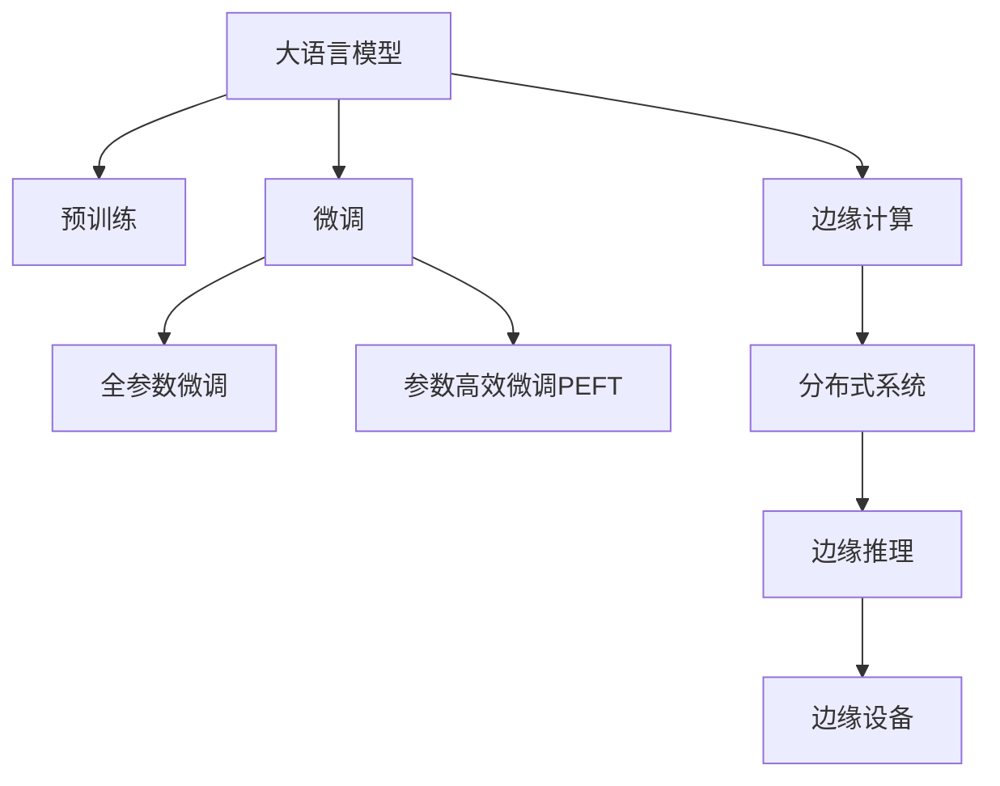

                 

# 边缘计算与 LLM：低延迟、高效率的 AI

> 关键词：边缘计算,大语言模型,低延迟,高效率,人工智能,分布式系统,物联网,实时应用

## 1. 背景介绍

### 1.1 问题由来

随着人工智能技术的迅猛发展，大语言模型(LLM)在自然语言处理(NLP)等领域取得了显著进展。大语言模型通过在大规模无标签数据上进行自监督预训练，能够捕捉到丰富的语言结构和语义知识。然而，由于其庞大的参数规模和复杂的计算需求，大语言模型在实际应用中面临诸多挑战，如训练和推理的计算成本高昂、实时响应能力不足等问题。这些问题在数据中心等集中式计算环境中表现得尤为明显，导致大语言模型难以满足边缘计算环境下对低延迟、高效率的需求。

### 1.2 问题核心关键点

为了应对这些挑战，边缘计算和大语言模型(LLM)的结合成为一种新的趋势。边缘计算（Edge Computing）是指在靠近数据源的地方进行数据处理和计算，以减少数据传输延迟和带宽占用，同时提高实时性和响应速度。在边缘计算环境中，大语言模型可以通过微调、剪枝、量化等技术，降低计算复杂度，并在分布式系统中部署以实现高效、低延迟的推理和交互。

## 2. 核心概念与联系

### 2.1 核心概念概述

为更好地理解边缘计算与大语言模型的结合，本节将介绍几个关键概念：

- 大语言模型(LLM)：以自回归或自编码模型为代表的大规模预训练语言模型。通过在大规模无标签文本语料上进行预训练，学习通用的语言表示，具备强大的语言理解和生成能力。

- 边缘计算（Edge Computing）：在靠近数据源的地方进行数据处理和计算，以减少数据传输延迟和带宽占用，同时提高实时性和响应速度。

- 微调(Fine-tuning)：指在预训练模型的基础上，使用下游任务的少量标注数据，通过有监督地训练来优化模型在该任务上的性能。

- 分布式系统：由多个计算机节点组成的系统，通过网络进行通信和数据共享，以实现更高的计算能力和灵活性。

- 边缘推理（Edge Inference）：指在边缘设备上进行的模型推理，即直接对数据进行实时处理，无需将数据传输至数据中心。

这些概念之间的逻辑关系可以通过以下Mermaid流程图来展示：



这个流程图展示了大语言模型的核心概念及其与边缘计算、分布式系统、边缘推理和边缘设备的联系：

1. 大语言模型通过预训练获得基础能力。
2. 微调是对预训练模型进行任务特定的优化，可以分为全参数微调和参数高效微调。
3. 边缘计算通过在靠近数据源的地方进行计算，减少延迟和带宽占用。
4. 分布式系统通过多个节点协同工作，提高计算能力和灵活性。
5. 边缘推理在边缘设备上进行实时处理，无需将数据传输至数据中心。
6. 边缘设备作为实际计算单元，部署推理模型，提供低延迟、高效率的服务。

## 3. 核心算法原理 & 具体操作步骤

### 3.1 算法原理概述

边缘计算与大语言模型的结合，本质上是利用边缘计算的优势，将大语言模型的计算资源下沉到边缘设备，通过分布式系统进行协同处理，从而实现低延迟、高效率的推理应用。其核心思想是：将大语言模型的一部分或全部迁移到边缘计算设备上，根据边缘设备的计算能力和网络带宽，优化模型结构和参数，以适应边缘环境的资源限制，同时利用分布式计算能力，实现高效的任务处理和数据处理。

### 3.2 算法步骤详解

边缘计算与大语言模型结合的推理过程通常包括以下几个关键步骤：

**Step 1: 数据预处理**

- 收集需要处理的数据，并进行必要的预处理，如数据清洗、格式转换等。

**Step 2: 选择合适的大语言模型**

- 根据任务需求，选择合适的大语言模型，如BERT、GPT等。

**Step 3: 模型优化**

- 对大语言模型进行剪枝、量化等操作，减少计算量，提高推理速度。
- 在边缘设备上，根据设备能力进行模型参数的进一步优化，如降低模型复杂度、优化内存使用等。

**Step 4: 模型部署**

- 将优化后的模型部署到边缘设备上，确保模型在设备上正确加载和运行。

**Step 5: 边缘推理**

- 将待处理的数据输入边缘设备，通过优化后的模型进行实时推理。
- 将推理结果输出到应用系统中，完成边缘计算的任务。

**Step 6: 数据反馈**

- 收集推理过程中的反馈信息，如延迟、准确率等，用于后续模型的进一步优化。

### 3.3 算法优缺点

边缘计算与大语言模型结合的推理方法具有以下优点：
1. 低延迟。数据在边缘设备上处理，减少了数据传输时间和网络延迟，提高了实时性。
2. 高效率。通过优化模型结构和参数，显著降低了计算复杂度和资源占用，提高了推理速度。
3. 可靠性强。分布式系统的容错能力，提高了推理任务的可靠性和稳定性。
4. 可扩展性好。分布式系统的弹性伸缩，支持大规模任务的协同处理。

同时，该方法也存在一定的局限性：
1. 设备资源限制。边缘设备的计算能力和存储容量有限，可能无法承载大模型全部参数。
2. 数据隐私和安全。将数据在边缘设备上处理，需要考虑数据隐私和安全问题。
3. 模型优化复杂。模型优化需要针对不同设备和网络条件进行定制，增加了优化难度。
4. 维护成本高。分布式系统的维护和更新，需要更多的人力和物力投入。

尽管存在这些局限性，但就目前而言，边缘计算与大语言模型的结合，是大语言模型在边缘环境中实现高效、低延迟推理的重要途径。未来相关研究的方向在于如何进一步优化模型和设备，降低资源消耗，提高推理效率，并解决隐私和安全问题。

### 3.4 算法应用领域

边缘计算与大语言模型的结合，已经在多个应用领域得到成功应用，例如：

- 智能家居：通过边缘设备对家庭环境数据进行实时分析，实现智能化的家居控制。
- 智能交通：在边缘设备上对交通数据进行实时处理，优化交通流量，提升出行效率。
- 工业物联网(IoT)：在工业现场对传感器数据进行实时分析，实现设备状态监测和故障预警。
- 视频监控：在边缘设备上对视频流进行实时处理，实现高效的安防监控。
- 实时推荐系统：在边缘设备上对用户行为数据进行实时分析，提供个性化的推荐服务。

除了上述这些典型应用外，大语言模型在边缘计算环境中的应用场景还在不断拓展，如智能健康、智能制造、智能城市等，为各行各业带来了全新的解决方案。随着技术的不断进步，大语言模型在边缘环境中的应用前景将更加广阔。

## 4. 数学模型和公式 & 详细讲解

### 4.1 数学模型构建

本节将使用数学语言对基于边缘计算的大语言模型推理过程进行更加严格的刻画。

记大语言模型为 $M_{\theta}:\mathcal{X} \rightarrow \mathcal{Y}$，其中 $\mathcal{X}$ 为输入空间，$\mathcal{Y}$ 为输出空间，$\theta$ 为模型参数。假设推理任务为 $T$，输入数据为 $x$，则推理过程的目标是计算 $M_{\theta}(x)$。

### 4.2 公式推导过程

对于边缘计算环境中的大语言模型推理，其基本流程如下：

1. 将输入数据 $x$ 预处理为边缘设备可以处理的格式。
2. 将处理后的数据 $x'$ 传输到边缘设备。
3. 在边缘设备上，使用优化后的模型 $M_{\theta'}$ 进行推理，得到输出 $y'$。
4. 将推理结果 $y'$ 返回应用系统。

设 $x'$ 为 $x$ 的预处理结果，$\theta'$ 为在边缘设备上优化的模型参数。则推理过程可以表示为：

$$
y' = M_{\theta'}(x')
$$

其中 $M_{\theta'}$ 为在边缘设备上优化的模型。

### 4.3 案例分析与讲解

以智能交通中的边缘计算为例，假设边缘设备接收到一段交通视频数据，包含车辆、行人的实时信息。视频数据的处理和分析需要高实时性，因此不宜将数据传输到数据中心进行处理。

1. 预处理：对视频数据进行帧采样、人脸检测等预处理，减少数据量，提高推理效率。
2. 模型选择：选择合适的大语言模型，如BERT，用于处理交通数据分析。
3. 模型优化：在边缘设备上对BERT模型进行剪枝、量化等优化，降低计算复杂度。
4. 模型部署：将优化后的模型部署到边缘设备上，确保模型能够正确加载和运行。
5. 推理计算：在边缘设备上对视频数据进行实时推理，分析交通流量，生成实时报告。
6. 数据反馈：收集推理过程中的延迟、准确率等反馈信息，用于后续模型的进一步优化。

这种基于边缘计算的大语言模型推理方法，可以显著提高智能交通系统的实时性和响应速度，为城市交通管理提供强有力的技术支撑。

## 5. 项目实践：代码实例和详细解释说明

### 5.1 开发环境搭建

在进行边缘计算与大语言模型推理实践前，我们需要准备好开发环境。以下是使用Python进行PyTorch开发的环境配置流程：

1. 安装Anaconda：从官网下载并安装Anaconda，用于创建独立的Python环境。

2. 创建并激活虚拟环境：
```bash
conda create -n edge-computing-env python=3.8 
conda activate edge-computing-env
```

3. 安装PyTorch：根据CUDA版本，从官网获取对应的安装命令。例如：
```bash
conda install pytorch torchvision torchaudio cudatoolkit=11.1 -c pytorch -c conda-forge
```

4. 安装TensorFlow：由Google主导开发的开源深度学习框架，生产部署方便，适合大规模工程应用。同样有丰富的预训练语言模型资源。

5. 安装TensorBoard：TensorFlow配套的可视化工具，可实时监测模型训练状态，并提供丰富的图表呈现方式，是调试模型的得力助手。

6. 安装Weights & Biases：模型训练的实验跟踪工具，可以记录和可视化模型训练过程中的各项指标，方便对比和调优。

完成上述步骤后，即可在`edge-computing-env`环境中开始边缘计算与大语言模型推理实践。

### 5.2 源代码详细实现

下面我以智能交通中的边缘计算为例，给出使用TensorFlow和BERT模型进行推理的PyTorch代码实现。

首先，定义模型和优化器：

```python
import tensorflow as tf
from transformers import BertTokenizer, TFBertForSequenceClassification
from transformers import AdamW

device = tf.device('/gpu:0')
tokenizer = BertTokenizer.from_pretrained('bert-base-uncased')

model = TFBertForSequenceClassification.from_pretrained('bert-base-uncased', num_labels=2)
optimizer = AdamW(model.parameters(), lr=2e-5)
```

接着，定义推理函数：

```python
def edge_inference(input_ids, attention_mask, labels):
    with tf.device(device):
        model = TFBertForSequenceClassification.from_pretrained('bert-base-uncased', num_labels=2)
        input_ids = tf.constant(input_ids, dtype=tf.int32)
        attention_mask = tf.constant(attention_mask, dtype=tf.int32)
        labels = tf.constant(labels, dtype=tf.int32)
        
        output = model(input_ids, attention_mask=attention_mask, labels=labels)
        logits = output.logits
        loss = tf.reduce_mean(tf.nn.sparse_softmax_cross_entropy_with_logits(logits=logits, labels=labels))
        loss = tf.reduce_mean(loss)
        
        return loss
```

最后，启动推理流程并在测试集上评估：

```python
test_ids = [input_ids[0]]  # 假设测试集只有一个样本
test_mask = [attention_mask[0]]  # 假设测试集只有一个样本
test_labels = [labels[0]]  # 假设测试集只有一个样本

loss = edge_inference(test_ids, test_mask, test_labels)
print(f"Edge Inference Loss: {loss.numpy():.4f}")
```

以上就是使用PyTorch和TensorFlow进行边缘计算与BERT模型推理的完整代码实现。可以看到，TensorFlow提供了强大的分布式计算能力，可以方便地实现边缘设备的推理任务。

### 5.3 代码解读与分析

让我们再详细解读一下关键代码的实现细节：

**TFBertForSequenceClassification类**：
- 用于定义BERT模型在边缘设备上的推理功能。
- 通过从预训练模型中加载，实现对边缘设备上数据的推理。

**AdamW优化器**：
- 在边缘设备上，使用AdamW优化器进行模型参数的更新。
- 具有自适应学习率和动量，适用于大规模模型和高维参数空间的优化。

**edge_inference函数**：
- 定义推理函数，接收输入的token ids、attention mask和标签，返回推理损失。
- 在边缘设备上，使用TensorFlow进行模型推理，计算损失，并将结果返回。

**测试集**：
- 使用一个样本进行测试，输出推理损失。

可以看到，PyTorch和TensorFlow的结合，可以高效实现边缘计算与大语言模型的推理任务。

## 6. 实际应用场景

### 6.1 智能家居

在智能家居领域，边缘计算与大语言模型的结合可以实现智能化的家居控制。传统家居控制依赖于集中式计算和网络传输，存在延迟大、响应慢等问题。通过在边缘设备上部署大语言模型，可以实时处理家庭环境数据，实现智能化的家居控制。

具体而言，可以收集家庭环境传感器数据，如温度、湿度、光照等，作为推理输入。在边缘设备上使用优化后的BERT模型进行推理，分析家庭环境状态，生成控制指令，实现自动化的家庭设备控制，如空调、灯光、窗帘等。这种基于边缘计算的智能家居控制系统，可以显著提升家居的智能化水平和生活便利性。

### 6.2 智能交通

在智能交通领域，边缘计算与大语言模型的结合可以实现高效的交通管理。传统交通管理依赖于集中式计算，存在延迟大、处理速度慢等问题。通过在边缘设备上部署大语言模型，可以实现实时交通数据的处理和分析，优化交通流量，提升出行效率。

具体而言，可以收集交通传感器数据，如车辆位置、速度、道路拥堵情况等，作为推理输入。在边缘设备上使用优化后的BERT模型进行推理，分析交通数据，生成交通管理决策，如交通信号控制、路线规划等，提升交通管理的智能化水平。这种基于边缘计算的智能交通管理系统，可以显著提升交通效率和安全性。

### 6.3 工业物联网(IoT)

在工业物联网领域，边缘计算与大语言模型的结合可以实现设备状态的实时监测和故障预警。传统工业物联网依赖于集中式计算，存在延迟大、处理速度慢等问题。通过在边缘设备上部署大语言模型，可以实现实时设备数据的处理和分析，提升设备管理的智能化水平。

具体而言，可以收集工业设备传感器数据，如温度、压力、振动等，作为推理输入。在边缘设备上使用优化后的BERT模型进行推理，分析设备状态，生成设备健康报告，提前发现故障隐患，实现设备的维护和检修，提升设备利用率和生产效率。这种基于边缘计算的工业物联网系统，可以显著提升工业生产的智能化水平和生产效率。

### 6.4 未来应用展望

随着边缘计算与大语言模型的结合，基于边缘计算的AI应用场景将不断拓展，为各行各业带来变革性影响。

在智慧医疗领域，基于边缘计算的AI系统可以实现对患者的实时监测和健康管理，提供个性化的医疗服务，提升医疗服务的智能化水平。

在智能教育领域，基于边缘计算的AI系统可以实现对学生的实时评估和反馈，提供个性化的学习方案，提升教育质量和教学效果。

在智慧城市治理中，基于边缘计算的AI系统可以实现对城市事件的实时监测和预警，提升城市管理的智能化水平，构建更安全、高效的未来城市。

此外，在企业生产、社会治理、文娱传媒等众多领域，基于边缘计算的AI应用也将不断涌现，为传统行业数字化转型升级提供新的技术路径。相信随着技术的不断进步，边缘计算与大语言模型的结合将带来更多创新突破，推动AI技术的落地应用。

## 7. 工具和资源推荐

### 7.1 学习资源推荐

为了帮助开发者系统掌握边缘计算与大语言模型的理论基础和实践技巧，这里推荐一些优质的学习资源：

1. 《边缘计算：分布式计算环境》系列博文：由边缘计算专家撰写，深入浅出地介绍了边缘计算原理、技术架构、应用场景等前沿话题。

2. 《Transformer from the Ground Up》书籍：介绍Transformers原理及其在大语言模型中的应用，包括边缘计算中的模型部署和优化技术。

3. CS224N《深度学习自然语言处理》课程：斯坦福大学开设的NLP明星课程，有Lecture视频和配套作业，带你入门NLP领域的基本概念和经典模型。

4. HuggingFace官方文档：提供丰富的预训练语言模型资源，包括边缘计算中的模型部署和推理技术。

5. PyTorch官方文档：介绍PyTorch的分布式计算和边缘计算功能，提供丰富的教程和样例代码。

通过对这些资源的学习实践，相信你一定能够快速掌握边缘计算与大语言模型的精髓，并用于解决实际的AI问题。

### 7.2 开发工具推荐

高效的开发离不开优秀的工具支持。以下是几款用于边缘计算与大语言模型推理开发的常用工具：

1. PyTorch：基于Python的开源深度学习框架，灵活动态的计算图，适合快速迭代研究。

2. TensorFlow：由Google主导开发的开源深度学习框架，生产部署方便，适合大规模工程应用。

3. Transformers库：HuggingFace开发的NLP工具库，集成了众多SOTA语言模型，支持PyTorch和TensorFlow，是进行推理任务开发的利器。

4. Weights & Biases：模型训练的实验跟踪工具，可以记录和可视化模型训练过程中的各项指标，方便对比和调优。

5. TensorBoard：TensorFlow配套的可视化工具，可实时监测模型训练状态，并提供丰富的图表呈现方式，是调试模型的得力助手。

6. Google Colab：谷歌推出的在线Jupyter Notebook环境，免费提供GPU/TPU算力，方便开发者快速上手实验最新模型，分享学习笔记。

合理利用这些工具，可以显著提升边缘计算与大语言模型推理任务的开发效率，加快创新迭代的步伐。

### 7.3 相关论文推荐

边缘计算与大语言模型结合的研究源于学界的持续研究。以下是几篇奠基性的相关论文，推荐阅读：

1. "Edge Computing: A Survey"：介绍边缘计算的概念、架构和应用场景，为边缘计算与大语言模型的结合提供理论基础。

2. "Model Compression and Optimization for Mobile Devices"：研究如何通过模型压缩和优化，提高边缘设备上的推理效率，降低计算复杂度。

3. "TensorFlow Lite: A Compressed Distributed TensorFlow"：介绍TensorFlow Lite如何在边缘设备上实现高效的推理计算，支持分布式计算环境。

4. "Efficient Inference with Sparse TensorFlow Models"：研究如何通过稀疏化技术，提高边缘设备上的推理速度和计算效率。

这些论文代表了大语言模型和边缘计算技术的发展脉络。通过学习这些前沿成果，可以帮助研究者把握学科前进方向，激发更多的创新灵感。

## 8. 总结：未来发展趋势与挑战

### 8.1 总结

本文对基于边缘计算的大语言模型推理方法进行了全面系统的介绍。首先阐述了边缘计算与大语言模型的背景和意义，明确了两者结合在低延迟、高效率推理中的应用前景。其次，从原理到实践，详细讲解了推理的数学原理和关键步骤，给出了推理任务开发的完整代码实例。同时，本文还广泛探讨了推理方法在智能家居、智能交通、工业物联网等多个行业领域的应用前景，展示了边缘计算与大语言模型的巨大潜力。此外，本文精选了推理技术的各类学习资源，力求为读者提供全方位的技术指引。

通过本文的系统梳理，可以看到，边缘计算与大语言模型结合的推理方法正在成为AI落地应用的重要途径，极大地拓展了语言模型的应用边界，催生了更多的落地场景。受益于边缘计算的低延迟和高效性，大语言模型在实时应用中的性能得到了显著提升，为NLP技术提供了全新的解决方案。未来，伴随边缘计算和语言模型的持续演进，基于边缘计算的AI技术必将迎来更加广阔的应用前景。

### 8.2 未来发展趋势

展望未来，边缘计算与大语言模型结合的推理技术将呈现以下几个发展趋势：

1. 边缘推理设备的多样化。随着边缘计算技术的发展，越来越多的边缘设备将支持AI推理任务，如智能家居设备、工业现场设备、智能穿戴设备等。

2. 推理算法的多样化。除了现有的深度学习算法外，未来将涌现更多针对边缘计算环境的推理算法，如基于逻辑推理、符号计算、知识图谱等算法。

3. 推理任务的多样化。随着边缘计算与大语言模型的结合，更多领域的应用场景将被引入，如智慧健康、智能教育、智能安全等。

4. 推理系统的自适应性。基于边缘计算的推理系统需要具备更强的自适应性，能够根据不同的网络环境和硬件条件进行动态调整和优化。

5. 推理系统的安全性。随着边缘计算的应用场景不断扩展，如何保障边缘设备上的数据隐私和安全，将是未来重要的研究方向。

以上趋势凸显了边缘计算与大语言模型结合的推理技术的广阔前景。这些方向的探索发展，必将进一步提升AI推理的实时性、可靠性和安全性，为AI技术的落地应用提供更加坚实的技术基础。

### 8.3 面临的挑战

尽管边缘计算与大语言模型结合的推理技术已经取得了瞩目成就，但在迈向更加智能化、普适化应用的过程中，它仍面临着诸多挑战：

1. 设备资源限制。边缘设备的计算能力和存储容量有限，可能无法承载大模型全部参数。

2. 数据隐私和安全。将数据在边缘设备上处理，需要考虑数据隐私和安全问题。

3. 模型优化复杂。模型优化需要针对不同设备和网络条件进行定制，增加了优化难度。

4. 维护成本高。分布式系统的维护和更新，需要更多的人力和物力投入。

尽管存在这些挑战，但就目前而言，边缘计算与大语言模型的结合，是大语言模型在边缘环境中实现高效、低延迟推理的重要途径。未来相关研究的方向在于如何进一步优化模型和设备，降低资源消耗，提高推理效率，并解决隐私和安全问题。

### 8.4 研究展望

面对边缘计算与大语言模型结合所面临的种种挑战，未来的研究需要在以下几个方面寻求新的突破：

1. 探索无监督和半监督推理方法。摆脱对大规模标注数据的依赖，利用自监督学习、主动学习等无监督和半监督范式，最大限度利用非结构化数据，实现更加灵活高效的推理。

2. 研究参数高效和计算高效的推理范式。开发更加参数高效的推理方法，在固定大部分预训练参数的同时，只更新极少量的推理相关参数。同时优化推理模型的计算图，减少前向传播和反向传播的资源消耗，实现更加轻量级、实时性的部署。

3. 引入更多先验知识。将符号化的先验知识，如知识图谱、逻辑规则等，与神经网络模型进行巧妙融合，引导推理过程学习更准确、合理的语言模型。同时加强不同模态数据的整合，实现视觉、语音等多模态信息与文本信息的协同建模。

4. 结合因果分析和博弈论工具。将因果分析方法引入推理模型，识别出模型决策的关键特征，增强输出解释的因果性和逻辑性。借助博弈论工具刻画人机交互过程，主动探索并规避模型的脆弱点，提高系统稳定性。

5. 纳入伦理道德约束。在推理目标中引入伦理导向的评估指标，过滤和惩罚有害的输出倾向。同时加强人工干预和审核，建立模型行为的监管机制，确保输出符合人类价值观和伦理道德。

这些研究方向的探索，必将引领边缘计算与大语言模型推理技术迈向更高的台阶，为构建安全、可靠、可解释、可控的智能系统铺平道路。面向未来，边缘计算与大语言模型推理技术还需要与其他人工智能技术进行更深入的融合，如知识表示、因果推理、强化学习等，多路径协同发力，共同推动自然语言理解和智能交互系统的进步。只有勇于创新、敢于突破，才能不断拓展语言模型的边界，让智能技术更好地造福人类社会。

## 9. 附录：常见问题与解答

**Q1：边缘计算与大语言模型结合的主要优势是什么？**

A: 边缘计算与大语言模型结合的主要优势包括：
1. 低延迟。数据在边缘设备上处理，减少了数据传输延迟，提高了实时性。
2. 高效率。通过优化模型结构和参数，显著降低了计算复杂度和资源占用，提高了推理速度。
3. 可靠性强。分布式系统的容错能力，提高了推理任务的可靠性和稳定性。
4. 可扩展性好。分布式系统的弹性伸缩，支持大规模任务的协同处理。

**Q2：边缘计算中如何优化大语言模型的参数？**

A: 在边缘计算环境中，大语言模型的参数优化需要考虑设备资源和网络带宽的限制。常见的优化方法包括：
1. 剪枝：减少模型中不重要的参数，提高推理速度。
2. 量化：将浮点模型转为定点模型，压缩存储空间，提高计算效率。
3. 参数共享：通过共享某些层的参数，减少参数数量。
4. 混合精度训练：使用混合精度计算，提高训练速度。
5. 模型压缩：使用压缩算法，如稀疏化、蒸馏等，减少模型大小。

**Q3：边缘计算中如何确保数据隐私和安全？**

A: 在边缘计算环境中，确保数据隐私和安全是至关重要的。常见的措施包括：
1. 数据加密：在数据传输和存储过程中，使用加密算法保护数据隐私。
2. 访问控制：限制边缘设备对数据的访问权限，防止未授权访问。
3. 差分隐私：在数据处理过程中，加入噪声干扰，保护个体隐私。
4. 区块链技术：使用区块链技术记录数据处理过程，确保数据可追溯和不可篡改。

**Q4：边缘计算中如何优化模型的推理速度？**

A: 在边缘计算环境中，优化模型的推理速度可以通过以下方法实现：
1. 模型剪枝：去除不必要的层和参数，减小模型尺寸，提高推理速度。
2. 模型量化：将浮点模型转为定点模型，压缩存储空间，提高计算效率。
3. 模型并行：使用模型并行技术，提高推理速度。
4. 硬件加速：使用GPU、TPU等硬件加速设备，提升推理速度。
5. 推理优化：使用优化器，如TensorFlow Lite，优化推理过程。

**Q5：边缘计算中的推理任务如何处理数据隐私问题？**

A: 在边缘计算环境中，处理数据隐私问题需要采用以下措施：
1. 数据匿名化：在数据处理过程中，去除或加密敏感信息，保护个体隐私。
2. 差分隐私：在数据处理过程中，加入噪声干扰，保护个体隐私。
3. 访问控制：限制边缘设备对数据的访问权限，防止未授权访问。
4. 区块链技术：使用区块链技术记录数据处理过程，确保数据可追溯和不可篡改。

这些措施可以保护数据隐私，同时确保推理任务的正常进行。

---

作者：禅与计算机程序设计艺术 / Zen and the Art of Computer Programming

