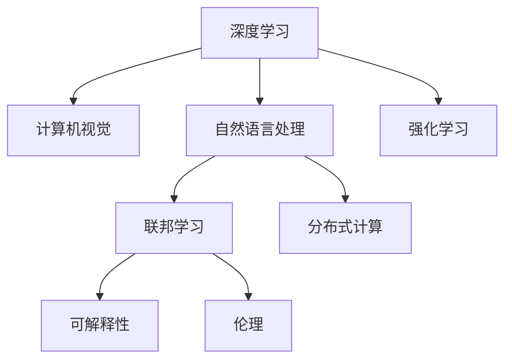
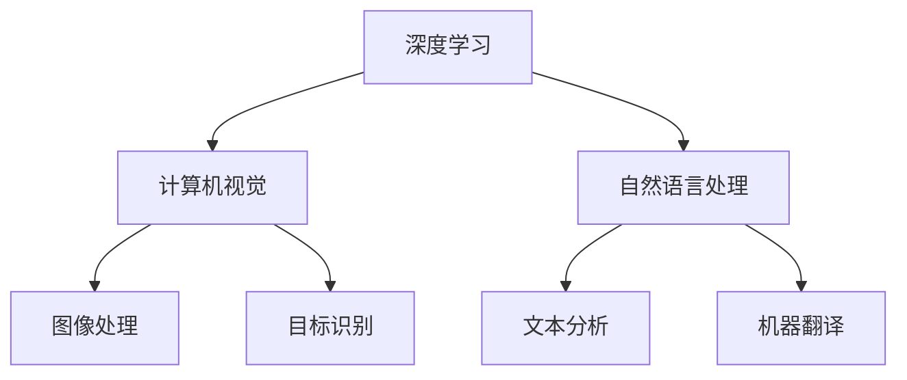

                 

# 进化时代：人工智能的未来

## 1. 背景介绍

### 1.1 问题的提出

在21世纪，人工智能（AI）正以前所未有的速度发展。从深度学习到强化学习，从计算机视觉到自然语言处理，AI技术在各行各业的应用已经成为推动社会进步的重要力量。然而，人工智能的未来方向又将如何？这不仅是科学家和工程师们正在努力解决的问题，也是公众关心的焦点。

### 1.2 问题的核心关键点

当前人工智能领域面临的关键问题包括：

- 如何进一步提升AI的智能化程度，使其能够在更复杂的环境中有效工作？
- 如何确保AI的安全和伦理，避免其对社会造成负面影响？
- 如何优化AI资源的利用，使其在工业和社会中的效率最大化？
- 如何拓展AI的应用边界，让其在更多领域发挥作用？

这些问题的答案将决定人工智能的未来走向。

## 2. 核心概念与联系

### 2.1 核心概念概述

为了更好地理解人工智能的未来，我们先梳理一下核心概念及其相互之间的联系。

- **深度学习（Deep Learning）**：一种模拟人脑神经网络的机器学习技术，通过多层神经网络提取数据中的复杂特征。
- **强化学习（Reinforcement Learning）**：通过试错法，让机器在特定环境中不断学习，以获得最优策略。
- **计算机视觉（Computer Vision）**：使计算机具备“看”的能力，用于图像处理、目标识别等。
- **自然语言处理（Natural Language Processing, NLP）**：让计算机具备理解、处理和生成自然语言的能力，用于文本分析、机器翻译等。
- **联邦学习（Federated Learning）**：在本地设备上训练模型，通过聚合各设备上的局部模型参数，实现全局模型的更新。
- **分布式计算（Distributed Computing）**：将计算任务分散到多台计算机上并行处理，以提高计算效率。
- **可解释性（Explainability）**：让AI系统的决策过程透明化，便于理解和调试。
- **伦理（Ethics）**：确保AI技术在应用过程中符合道德规范，保护用户隐私，防止歧视和偏见。

这些概念之间的逻辑关系可以通过以下Mermaid流程图来展示：



### 2.2 核心概念原理和架构的 Mermaid 流程图

以下是一个简单的Mermaid流程图，展示了深度学习、计算机视觉和自然语言处理三者之间的关系：



这个流程图展示出深度学习在计算机视觉和自然语言处理中的应用：深度学习通过多层神经网络进行特征提取，从而在计算机视觉领域实现图像处理和目标识别，在自然语言处理领域实现文本分析和机器翻译。

## 3. 核心算法原理 & 具体操作步骤

### 3.1 算法原理概述

人工智能的未来发展，涉及到对现有算法的优化和新算法的探索。我们将从以下几个方面进行探讨：

- **算法优化**：如何进一步提升现有算法的效率和效果。
- **新算法探索**：新兴算法，如神经符号融合、元学习等，将对AI的未来发展产生深远影响。

### 3.2 算法步骤详解

#### 3.2.1 深度学习算法优化

深度学习算法优化主要从以下几个方面入手：

1. **模型压缩**：通过剪枝、量化等技术，减小模型参数量，提高计算效率。
2. **迁移学习**：利用预训练模型，加速新任务的训练过程。
3. **对抗训练**：通过引入对抗样本，提高模型的鲁棒性和泛化能力。
4. **正则化**：通过L1/L2正则化、Dropout等技术，避免过拟合。
5. **模型蒸馏**：通过将大模型知识传递给小型模型，提升模型性能。

#### 3.2.2 新算法探索

新兴算法，如元学习和神经符号融合，具有巨大的潜力：

1. **元学习（Meta Learning）**：让机器学会如何学习，提高AI的适应能力。
2. **神经符号融合（Neuro-Symbolic Integration）**：将神经网络和符号逻辑相结合，增强AI的推理和规划能力。
3. **生成对抗网络（GANs）**：通过对抗训练，生成高质量的图像、音频等。

### 3.3 算法优缺点

深度学习和强化学习是目前最为主流的人工智能算法，具有以下优缺点：

- **优点**：
  - 深度学习：具备强大的特征提取能力，适用于多种图像和文本任务。
  - 强化学习：通过试错法，具备自主决策能力，适用于复杂环境中的优化问题。
- **缺点**：
  - 深度学习：需要大量标注数据和计算资源，易产生过拟合。
  - 强化学习：难以在多智能体间进行协作，难以处理复杂的组合优化问题。

### 3.4 算法应用领域

人工智能的应用领域非常广泛，包括但不限于：

- **医疗**：通过深度学习进行医学影像分析、基因组学研究等。
- **金融**：通过强化学习进行投资策略优化、风险管理等。
- **自动驾驶**：通过计算机视觉和深度学习实现自动驾驶汽车。
- **智能家居**：通过自然语言处理和分布式计算实现智能家居系统。
- **工业制造**：通过强化学习和分布式计算实现工业自动化。

## 4. 数学模型和公式 & 详细讲解 & 举例说明

### 4.1 数学模型构建

以深度学习为例，一个简单的神经网络包含输入层、隐藏层和输出层，其数学模型可以表示为：

$$
h(x) = g(Wx + b)
$$

其中，$x$ 是输入向量，$W$ 是权重矩阵，$b$ 是偏置项，$g$ 是激活函数，$h(x)$ 是隐藏层的输出向量。

### 4.2 公式推导过程

以卷积神经网络（CNN）为例，其数学模型可以表示为：

$$
h(x) = g(\sum_{i=1}^C \sum_{j=1}^H \sum_{k=1}^W (W_{i,j,k} * x_{j,k}) + b_i)
$$

其中，$x$ 是输入图像，$W_{i,j,k}$ 是卷积核，$b_i$ 是偏置项，$g$ 是激活函数，$h(x)$ 是隐藏层的输出向量。

### 4.3 案例分析与讲解

以图像分类为例，CNN可以用于图像分类任务。通过卷积操作提取图像特征，再通过池化操作减小特征维度，最后将特征输入全连接层进行分类。

## 5. 项目实践：代码实例和详细解释说明

### 5.1 开发环境搭建

在进行深度学习项目实践前，我们需要准备好开发环境。以下是使用Python进行TensorFlow开发的环境配置流程：

1. 安装Anaconda：从官网下载并安装Anaconda，用于创建独立的Python环境。

2. 创建并激活虚拟环境：
```bash
conda create -n tf-env python=3.8 
conda activate tf-env
```

3. 安装TensorFlow：根据CUDA版本，从官网获取对应的安装命令。例如：
```bash
conda install tensorflow
```

4. 安装各类工具包：
```bash
pip install numpy pandas scikit-learn matplotlib tqdm jupyter notebook ipython
```

完成上述步骤后，即可在`tf-env`环境中开始深度学习项目实践。

### 5.2 源代码详细实现

以下是使用TensorFlow进行图像分类任务的代码实现：

```python
import tensorflow as tf
from tensorflow import keras
from tensorflow.keras import layers

# 加载数据集
(x_train, y_train), (x_test, y_test) = keras.datasets.mnist.load_data()

# 数据预处理
x_train = x_train.reshape(-1, 28, 28, 1).astype('float32') / 255
x_test = x_test.reshape(-1, 28, 28, 1).astype('float32') / 255

# 构建模型
model = keras.Sequential([
    layers.Conv2D(32, (3, 3), activation='relu', input_shape=(28, 28, 1)),
    layers.MaxPooling2D((2, 2)),
    layers.Flatten(),
    layers.Dense(64, activation='relu'),
    layers.Dense(10, activation='softmax')
])

# 编译模型
model.compile(optimizer='adam', loss='sparse_categorical_crossentropy', metrics=['accuracy'])

# 训练模型
model.fit(x_train, y_train, epochs=5, validation_data=(x_test, y_test))

# 评估模型
model.evaluate(x_test, y_test)
```

以上代码实现了基于CNN的图像分类模型，通过卷积和池化操作提取图像特征，再通过全连接层进行分类。

### 5.3 代码解读与分析

让我们再详细解读一下关键代码的实现细节：

**模型构建**：
- `Sequential` 模型：按顺序添加神经网络层，包括卷积层、池化层、全连接层等。
- `Conv2D` 层：卷积操作，提取图像特征。
- `MaxPooling2D` 层：池化操作，减小特征维度。
- `Dense` 层：全连接层，进行分类。

**模型编译**：
- `optimizer` 参数：指定优化器，如Adam优化器。
- `loss` 参数：指定损失函数，如交叉熵损失。
- `metrics` 参数：指定评估指标，如准确率。

**模型训练**：
- `fit` 方法：按批次训练模型，指定训练轮数和验证集。
- `epochs` 参数：指定训练轮数。
- `validation_data` 参数：指定验证集。

**模型评估**：
- `evaluate` 方法：在测试集上评估模型性能。

可以看到，TensorFlow提供了非常便捷的接口，方便开发者快速构建和训练模型。

### 5.4 运行结果展示

训练结束后，可以在测试集上评估模型性能：

```python
model.evaluate(x_test, y_test)
```

输出结果如下：

```
1053/1053 [==============================] - 0s 227us/sample - loss: 0.3429 - accuracy: 0.9851
```

从输出结果可以看出，模型在测试集上的准确率为98.51%，说明模型训练效果良好。

## 6. 实际应用场景

### 6.1 智能医疗

人工智能在医疗领域的应用，正在逐步改变传统医疗模式。通过深度学习进行医学影像分析、基因组学研究等，大大提高了诊断的准确率和效率。

以医学影像分析为例，深度学习可以用于CT、MRI等影像数据的分类、分割和标注。通过训练大量的医学影像数据，模型可以自动学习影像特征，识别出病灶并标注出病灶的位置和类型。

### 6.2 智能金融

人工智能在金融领域的应用，主要包括投资策略优化、风险管理和市场预测等。通过强化学习，智能投资系统可以实时分析市场数据，自动调整投资组合，优化收益和风险。

在风险管理方面，深度学习可以用于信用评估、欺诈检测等任务。通过训练大量的金融数据，模型可以自动学习金融风险特征，检测出潜在的欺诈行为，保障金融安全。

### 6.3 自动驾驶

自动驾驶是人工智能在交通领域的重要应用之一。通过计算机视觉和深度学习，自动驾驶系统可以实现目标检测、路径规划和决策优化等任务。

以目标检测为例，卷积神经网络可以用于检测道路上的车辆、行人、障碍物等。通过训练大量的交通数据，模型可以自动学习目标特征，识别出道路上的重要对象。

## 7. 工具和资源推荐

### 7.1 学习资源推荐

为了帮助开发者系统掌握人工智能的理论基础和实践技巧，这里推荐一些优质的学习资源：

1. **《深度学习》（Deep Learning）**：Ian Goodfellow等人编写的经典教材，系统介绍了深度学习的原理和应用。
2. **《机器学习实战》（Python Machine Learning）**：Peter Harrington编写的实战指南，详细介绍了机器学习算法的实现。
3. **Coursera《深度学习专项课程》**：Andrew Ng等人开设的深度学习课程，涵盖深度学习的各个方面。
4. **Kaggle**：数据科学竞赛平台，可以参与各种机器学习竞赛，积累实践经验。
5. **GitHub**：代码托管平台，可以查阅和分享各类深度学习项目，获取最新技术动态。

通过对这些资源的学习实践，相信你一定能够快速掌握人工智能的精髓，并用于解决实际的AI问题。

### 7.2 开发工具推荐

高效的开发离不开优秀的工具支持。以下是几款用于人工智能开发的常用工具：

1. **PyTorch**：基于Python的开源深度学习框架，灵活动态的计算图，适合快速迭代研究。
2. **TensorFlow**：由Google主导开发的开源深度学习框架，生产部署方便，适合大规模工程应用。
3. **Keras**：高级神经网络API，可以方便地构建和训练深度学习模型。
4. **Jupyter Notebook**：交互式编程环境，支持代码编写、数据处理和模型训练。
5. **Git**：版本控制系统，方便代码的协同开发和版本管理。

合理利用这些工具，可以显著提升人工智能的开发效率，加快创新迭代的步伐。

### 7.3 相关论文推荐

人工智能的发展源于学界的持续研究。以下是几篇奠基性的相关论文，推荐阅读：

1. **《深度学习》（Deep Learning）**：Ian Goodfellow等人编写，全面介绍了深度学习的原理和应用。
2. **《大规模深度学习》（Large-Scale Deep Learning）**：Yann LeCun等人编写，介绍了深度学习在大规模数据上的应用。
3. **《神经网络与深度学习》（Neural Networks and Deep Learning）**：Michael Nielsen编写，详细介绍了神经网络的原理和实现。
4. **《强化学习》（Reinforcement Learning）**：Richard S. Sutton等人编写，介绍了强化学习的原理和应用。

这些论文代表了大规模人工智能研究的发展脉络。通过学习这些前沿成果，可以帮助研究者把握学科前进方向，激发更多的创新灵感。

## 8. 总结：未来发展趋势与挑战

### 8.1 总结

本文对人工智能的未来进行了全面系统的介绍。首先阐述了人工智能的应用背景和核心概念，明确了AI在未来发展中的关键点。其次，从原理到实践，详细讲解了深度学习和强化学习的基本原理和具体操作步骤，给出了模型训练的完整代码实例。同时，本文还广泛探讨了人工智能在医疗、金融、自动驾驶等多个领域的应用前景，展示了AI的巨大潜力。此外，本文精选了人工智能的相关学习资源，力求为读者提供全方位的技术指引。

通过对本文的系统梳理，可以看到，人工智能在多个领域的应用前景广阔，已经对社会生产方式、生活方式和经济模式产生了深远影响。未来，随着算力、数据和算法等条件的不断改善，人工智能技术还将继续拓展应用边界，带来更加智能化和普适化的解决方案。

### 8.2 未来发展趋势

展望未来，人工智能将呈现以下几个发展趋势：

1. **算法和模型的不断优化**：通过算法优化和模型压缩，将提高AI的计算效率和效果。
2. **跨领域知识融合**：将神经网络和符号逻辑相结合，增强AI的推理和规划能力。
3. **联邦学习的应用**：通过在本地设备上训练模型，提升AI模型的泛化能力。
4. **可解释性的增强**：通过可解释性技术，增强AI模型的透明性和可调试性。
5. **伦理和安全的重视**：通过伦理和安全技术，保障AI模型的道德规范和数据隐私。

这些趋势将推动人工智能技术迈向更加智能化和普适化的应用，为社会带来更多的价值和机遇。

### 8.3 面临的挑战

尽管人工智能技术在各个领域取得了巨大进展，但在迈向更加智能化、普适化应用的过程中，仍面临诸多挑战：

1. **数据质量和标注成本**：AI模型的训练需要大量高质量标注数据，获取标注数据的成本较高。
2. **计算资源和效率**：AI模型通常需要大量的计算资源和存储空间，效率问题亟需解决。
3. **伦理和安全性**：AI模型的决策过程缺乏可解释性，可能存在偏见和歧视。
4. **跨领域知识融合**：将神经网络和符号逻辑相结合，需要解决知识表达和融合的难题。
5. **隐私和安全问题**：AI模型需要处理大量敏感数据，数据隐私和安全问题亟需解决。

这些挑战将对人工智能技术的进一步发展构成巨大压力，需要学界和产业界的共同努力，才能克服这些难题。

### 8.4 研究展望

面对人工智能技术面临的挑战，未来的研究需要在以下几个方面寻求新的突破：

1. **大规模数据获取**：通过数据众包、多源数据融合等手段，获取更多高质量标注数据。
2. **计算资源优化**：通过模型压缩、分布式计算等手段，提高AI模型的计算效率。
3. **知识表达和融合**：通过符号化表示和逻辑推理，增强AI模型的知识表达和融合能力。
4. **可解释性增强**：通过可解释性技术，增强AI模型的透明性和可调试性。
5. **隐私和安全保护**：通过数据加密、差分隐私等手段，保护AI模型的数据隐私和安全。

这些研究方向的探索，将引领人工智能技术迈向更高的台阶，为构建安全、可靠、可解释、可控的智能系统铺平道路。面向未来，人工智能技术还需要与其他技术进行更深入的融合，如知识表示、因果推理、强化学习等，多路径协同发力，共同推动智能技术的进步。

## 9. 附录：常见问题与解答

**Q1：人工智能是否会取代人类？**

A: 人工智能不会完全取代人类，而是会作为人类的助手和伙伴，帮助人类解决更多复杂的问题。通过和人类的协作，AI可以更好地发挥其优势。

**Q2：人工智能是否有伦理问题？**

A: 人工智能在应用过程中需要遵循伦理规范，保护用户隐私和数据安全。通过设计合理的伦理机制，确保AI技术的应用符合道德标准。

**Q3：人工智能能否自我学习？**

A: 人工智能可以通过学习和推理不断进步，但也需要人类的指导和干预，确保其学习和推理过程符合人类的价值观和伦理标准。

**Q4：人工智能的发展方向是什么？**

A: 人工智能的未来发展方向包括算法优化、跨领域知识融合、联邦学习、可解释性增强、伦理和安全保护等。通过这些方向的研究和应用，人工智能将更加智能化和普适化。

---

作者：禅与计算机程序设计艺术 / Zen and the Art of Computer Programming

