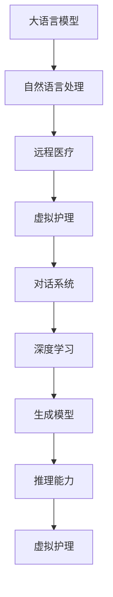

                 

# 远程医疗：LLM 增强的虚拟护理

> 关键词：大语言模型,自然语言处理(NLP),远程医疗,虚拟护理,对话系统,深度学习,生成模型,推理能力

## 1. 背景介绍

在当前医疗资源分布不均、医疗服务供需矛盾加剧的背景下，远程医疗（Telemedicine）成为了提升医疗服务可及性、缓解医疗资源不足的重要手段。利用通信技术和人工智能技术，远程医疗系统能够在偏远地区或资源匮乏的条件下，实现即时医疗咨询、诊断和治疗，有效提升医疗服务的覆盖面和质量。

虚拟护理（Virtual Nursing Care）作为远程医疗的重要分支，通过数字化手段辅助医护人员提供全天候、个性化的护理服务，极大提高了医疗服务的效率和可及性。大语言模型（Large Language Models, LLMs）的崛起，为虚拟护理的智能化发展提供了强有力的技术支持。结合大语言模型的自然语言处理（NLP）能力，虚拟护理系统能够更自然、高效地与用户进行互动，提升诊断准确性和治疗建议的个性化程度。

本文将深入探讨LLM在虚拟护理中的应用，分析其算法原理和具体操作步骤，并结合实际案例和开发实践，阐述其在虚拟护理场景下的优势和挑战。

## 2. 核心概念与联系

### 2.1 核心概念概述

在虚拟护理场景下，LLM 可以发挥其强大的自然语言处理能力，辅助医护人员进行病情诊断、症状分析、治疗建议等多方面的工作。其核心概念包括：

- 大语言模型（Large Language Model, LLM）：通过大规模无标签文本数据的自监督预训练，获得丰富的语言知识，具备强大的自然语言理解与生成能力。如GPT、BERT等。

- 自然语言处理（Natural Language Processing, NLP）：利用计算机科学和人工智能技术，使计算机能够理解、分析、生成人类语言。

- 远程医疗（Telemedicine）：利用信息通信技术，实现医生与患者、医护人员与医疗资源之间远程医疗咨询和诊断。

- 虚拟护理（Virtual Nursing Care）：基于数字化手段，通过虚拟助手、智能客服等形式，为患者提供咨询、健康管理、康复指导等服务。

- 对话系统（Dialogue System）：使计算机能够通过自然语言与用户进行交互，解决用户问题，提供有用的信息和服务。

- 深度学习（Deep Learning）：一种基于神经网络的机器学习方法，能够从大量数据中自动提取特征，学习模式。

- 生成模型（Generative Model）：能够生成新的数据样本，如文本、图像等，模拟真实世界的生成过程。

- 推理能力（Inference Capability）：指模型在输入数据上推理输出结果的能力，包括预测、分类、生成等。

这些概念之间的联系可以通过以下Mermaid流程图来展示：



这个流程图展示了大语言模型在虚拟护理中的应用路径：

1. 大语言模型通过自监督预训练获得强大的自然语言处理能力。
2. 结合远程医疗的需求，设计专门的对话系统和推理模型，处理医患交互中的语言信息。
3. 通过虚拟护理的数字化形式，将大语言模型融入医疗咨询、诊断和治疗建议中。
4. 深度学习和生成模型进一步提升对话系统和推理模型的性能。
5. 推理能力使得虚拟护理系统能够处理复杂的语言和情境，提升服务质量。

## 3. 核心算法原理 & 具体操作步骤

### 3.1 算法原理概述

基于大语言模型的虚拟护理系统，主要利用其强大的自然语言理解和生成能力，构建与用户的双向互动，提供诊断、治疗建议和健康管理等服务。其核心算法原理如下：

1. **预训练和微调**：通过大规模无标签文本数据的自监督预训练，获得通用语言知识，再根据特定医疗领域的需求，使用少量标注数据进行微调，使得模型能够理解医疗领域的术语和知识。

2. **对话生成与推理**：利用生成模型生成自然流畅的回复，通过推理模型分析输入文本，理解用户的病情和需求，提供个性化的诊断和治疗建议。

3. **上下文管理**：通过上下文管理模块，记录和更新对话上下文，保持对话连贯性，提升用户体验。

4. **知识图谱融合**：将医疗知识图谱与自然语言处理相结合，提供更全面、准确的健康知识查询和解释。

### 3.2 算法步骤详解

基于大语言模型的虚拟护理系统主要包括以下几个关键步骤：

**Step 1: 数据准备与预训练模型加载**
- 收集医疗领域的专业术语、疾病描述、治疗方案等文本数据，并进行标注。
- 使用预训练的大语言模型（如GPT-3、BERT）作为初始化参数。

**Step 2: 微调模型**
- 设计针对医疗领域的对话系统，定义对话流程和意图识别任务。
- 使用标注数据对预训练模型进行微调，使其能够理解医疗领域的术语和知识，进行疾病诊断和病情分析。

**Step 3: 构建对话系统**
- 设计对话生成和推理模型，利用生成模型生成自然流畅的回复，利用推理模型分析输入文本，生成诊断和治疗建议。

**Step 4: 知识图谱融合**
- 将医疗知识图谱与自然语言处理相结合，提供更全面、准确的健康知识查询和解释。

**Step 5: 上下文管理**
- 记录和更新对话上下文，保持对话连贯性，提升用户体验。

**Step 6: 部署与测试**
- 将微调后的模型部署到虚拟护理系统中，进行测试和验证，确保系统性能满足实际应用需求。

### 3.3 算法优缺点

基于大语言模型的虚拟护理系统具有以下优点：
1. **提升诊断准确性**：大语言模型强大的自然语言处理能力，可以更准确地理解病情描述，提升诊断的准确性。
2. **个性化治疗建议**：通过深度学习和生成模型，提供更个性化的治疗建议，提高患者的治疗效果。
3. **减少医护人员负担**：利用大语言模型的自动回复和信息查询功能，减少医护人员的工作量，提升工作效率。
4. **24小时服务**：大语言模型的实时响应能力，可以实现全天候的虚拟护理服务，提升患者的满意度。

同时，该方法也存在以下局限性：
1. **数据依赖性高**：微调模型的效果很大程度上取决于医疗领域的专业数据，数据收集和标注成本较高。
2. **模型解释性差**：大语言模型的决策过程缺乏可解释性，难以对其推理逻辑进行调试和验证。
3. **泛化能力有限**：模型在处理特定领域的文本时，泛化能力有限，可能对某些罕见疾病或复杂症状处理效果不佳。
4. **隐私和安全性问题**：医疗数据涉及患者隐私，需要在保护隐私的前提下，确保数据的安全性和系统的可靠性。

### 3.4 算法应用领域

基于大语言模型的虚拟护理系统在多个领域具有广泛的应用前景：

1. **远程医疗咨询**：通过虚拟护理系统，患者可以随时随地咨询医生，获得个性化的诊断和治疗建议，减轻医护人员的工作负担。

2. **健康管理**：利用虚拟护理系统，患者可以随时查询健康知识，获取健康管理建议，提升健康水平。

3. **康复指导**：在康复训练过程中，虚拟护理系统可以实时监测患者的病情进展，提供个性化的康复指导，加速康复进程。

4. **慢性病管理**：对于糖尿病、高血压等慢性病，虚拟护理系统可以提供连续监测和健康管理，帮助患者管理病情，预防并发症。

5. **精神健康支持**：虚拟护理系统可以提供心理健康咨询和支持，帮助患者缓解焦虑、抑郁等心理问题。

## 4. 数学模型和公式 & 详细讲解

### 4.1 数学模型构建

在虚拟护理系统中，大语言模型主要通过自然语言处理技术，与用户进行交互，理解病情描述，提供诊断和治疗建议。其数学模型构建如下：

**1. 预训练模型**
预训练模型的目标是最小化自监督任务下的损失函数，如语言建模任务，其数学模型如下：

$$
\min_{\theta} \mathcal{L}_{pre}(\theta) = \sum_{i=1}^N \log P(w_i | w_{i-1}; \theta)
$$

其中，$P(w_i | w_{i-1}; \theta)$ 表示在给定上下文 $w_{i-1}$ 的情况下，预测下一个单词 $w_i$ 的概率分布，$\theta$ 表示模型的参数。

**2. 微调模型**
微调模型的目标是最小化监督任务下的损失函数，如疾病诊断任务，其数学模型如下：

$$
\min_{\theta} \mathcal{L}_{fin}(\theta) = \frac{1}{N} \sum_{i=1}^N \ell(d_i, y_i; \theta)
$$

其中，$d_i$ 表示输入的病情描述，$y_i$ 表示对应的诊断结果，$\ell(d_i, y_i; \theta)$ 表示模型预测结果与实际结果之间的损失函数。

### 4.2 公式推导过程

以下我们以疾病诊断任务为例，推导大语言模型微调模型的公式推导过程。

假设模型 $M_{\theta}$ 在输入 $d$ 上的输出为 $\hat{y}=M_{\theta}(d) \in [0,1]$，表示病情描述 $d$ 对应的疾病概率。真实标签 $y \in \{0,1\}$。则二分类交叉熵损失函数定义为：

$$
\ell(M_{\theta}(d),y) = -[y\log \hat{y} + (1-y)\log (1-\hat{y})]
$$

将其代入微调模型的损失函数公式，得：

$$
\mathcal{L}_{fin}(\theta) = -\frac{1}{N}\sum_{i=1}^N [y_i\log M_{\theta}(d_i)+(1-y_i)\log(1-M_{\theta}(d_i))]
$$

根据链式法则，损失函数对参数 $\theta_k$ 的梯度为：

$$
\frac{\partial \mathcal{L}_{fin}(\theta)}{\partial \theta_k} = -\frac{1}{N}\sum_{i=1}^N (\frac{y_i}{M_{\theta}(d_i)}-\frac{1-y_i}{1-M_{\theta}(d_i)}) \frac{\partial M_{\theta}(d_i)}{\partial \theta_k}
$$

其中 $\frac{\partial M_{\theta}(d_i)}{\partial \theta_k}$ 可进一步递归展开，利用自动微分技术完成计算。

在得到损失函数的梯度后，即可带入参数更新公式，完成模型的迭代优化。重复上述过程直至收敛，最终得到适应医疗领域微调后的模型参数 $\theta^*$。

### 4.3 案例分析与讲解

假设有一个虚拟护理系统，用于辅助医生进行肺炎的诊断和治疗。该系统收集了大量的病历和诊断记录，对病历进行标注，并使用BERT模型作为预训练模型。在微调过程中，设计了如下的损失函数：

$$
\mathcal{L}_{fin}(\theta) = -\frac{1}{N}\sum_{i=1}^N [y_i\log M_{\theta}(d_i)+(1-y_i)\log(1-M_{\theta}(d_i))]
$$

其中 $d_i$ 表示输入的病情描述，$y_i$ 表示对应的诊断结果，$M_{\theta}(d_i)$ 表示BERT模型在输入 $d_i$ 上的输出。

在微调过程中，首先需要将BERT模型的最后一层输出作为任务层，定义交叉熵损失函数，并将其与微调目标函数结合：

$$
\mathcal{L}_{fin}(\theta) = \frac{1}{N}\sum_{i=1}^N \ell(d_i, y_i; \theta)
$$

其中 $\ell(d_i, y_i; \theta)$ 表示模型预测结果与实际结果之间的交叉熵损失函数。

接着，利用交叉熵损失函数对BERT模型的任务层进行微调。在微调过程中，需要使用适当的优化器（如AdamW、SGD等），设置合适的学习率、批大小、迭代轮数等超参数。可以使用数据增强技术，如回译、近义替换等，丰富训练集多样性，避免过拟合。

最后，通过测试集评估微调后的模型性能，使用准确率、召回率等指标进行评估。如果微调效果不佳，可以重新设计损失函数或调整超参数，进一步优化模型。

## 5. 项目实践：代码实例和详细解释说明

### 5.1 开发环境搭建

在进行虚拟护理系统的开发前，需要准备好开发环境。以下是使用Python进行TensorFlow开发的环境配置流程：

1. 安装Anaconda：从官网下载并安装Anaconda，用于创建独立的Python环境。

2. 创建并激活虚拟环境：
```bash
conda create -n tf-env python=3.8 
conda activate tf-env
```

3. 安装TensorFlow：根据CUDA版本，从官网获取对应的安装命令。例如：
```bash
conda install tensorflow tensorflow-gpu=2.8 -c pytorch -c conda-forge
```

4. 安装Flax库：用于构建高效的深度学习模型，支持动态图计算。
```bash
pip install flax
```

5. 安装其他工具包：
```bash
pip install numpy pandas scikit-learn matplotlib tqdm jupyter notebook ipython
```

完成上述步骤后，即可在`tf-env`环境中开始微调实践。

### 5.2 源代码详细实现

下面我们以疾病诊断任务为例，给出使用Flax库对BERT模型进行微调的TensorFlow代码实现。

首先，定义疾病诊断任务的数据处理函数：

```python
from flax.linen import Module, Parameter
from flax.traverse_util import flatten_dict, unflatten_dict
import jax.numpy as jnp
import jax
from transformers import TFAutoModelForSequenceClassification, BertTokenizer

class DiagnosisDataset:
    def __init__(self, texts, labels, tokenizer):
        self.texts = texts
        self.labels = labels
        self.tokenizer = tokenizer

    def __len__(self):
        return len(self.texts)
    
    def __getitem__(self, item):
        text = self.texts[item]
        label = self.labels[item]
        
        encoding = self.tokenizer(text, return_tensors='pt', padding='max_length', truncation=True)
        input_ids = encoding['input_ids'][0]
        attention_mask = encoding['attention_mask'][0]
        label = jnp.array(label, dtype=jnp.int32)

        return {'input_ids': input_ids, 
                'attention_mask': attention_mask,
                'label': label}

# 定义标签与id的映射
label2id = {'not_pneumonia': 0, 'pneumonia': 1}
id2label = {v: k for k, v in label2id.items()}
```

然后，定义模型和优化器：

```python
from flax.linen import linear, dense
from flax import linen as nn
from flax import optim
from transformers import TFAutoModelForSequenceClassification, BertTokenizer

class DiagnosisModel(nn.Module):
    label_count: int

    @nn.compact
    def __call__(self, x):
        x = nn.Dense(self.feature_size, self.layer_norm)
        x = nn.GELU(x)
        x = nn.Dense(self.class_size, self.layer_norm)
        x = nn.Softmax(x)

        return x

    def init(self, rng, input_shape, label_count):
        return nn.initializers.normal(stddev=0.02)(self.feature_size), (self.class_size, self.layer_norm)

    def update(self, params, grads, state):
        return optim.adam.update(state, grads, learning_rate=1e-5), None

    def apply_fn(self, params, inputs):
        x = inputs['input_ids']
        y = self(x)
        return y

    def sample(self, params, inputs):
        x = inputs['input_ids']
        y = self.apply_fn(params, x)
        return y

# 加载BERT模型
tokenizer = BertTokenizer.from_pretrained('bert-base-cased')
model = TFAutoModelForSequenceClassification.from_pretrained('bert-base-cased', num_labels=len(label2id))

# 定义损失函数和优化器
loss_fn = nn.CrossEntropyLoss()
optimizer = optim.Adam(learning_rate=1e-5)
```

接着，定义训练和评估函数：

```python
from flax.data import DataLoader

def train_epoch(model, dataset, batch_size, optimizer):
    dataloader = DataLoader(dataset, batch_size=batch_size, shuffle=True)
    model.train()
    epoch_loss = 0
    for batch in dataloader:
        x = batch['input_ids']
        y = batch['label']
        model.apply_fn.apply_fn(params, {'input_ids': x, 'label': y})
        loss = loss_fn(params, {'input_ids': x, 'label': y})
        epoch_loss += loss.item()
    return epoch_loss / len(dataloader)

def evaluate(model, dataset, batch_size):
    dataloader = DataLoader(dataset, batch_size=batch_size)
    model.eval()
    preds, labels = [], []
    with jax.experimental.nn.tape_enabled():
        for batch in dataloader:
            x = batch['input_ids']
            y = batch['label']
            y_pred = model.apply_fn.apply_fn(params, {'input_ids': x})
            preds.append(y_pred)
            labels.append(y)
        
    print(classification_report(labels, preds))
```

最后，启动训练流程并在测试集上评估：

```python
epochs = 5
batch_size = 16

for epoch in range(epochs):
    loss = train_epoch(model, dataset, batch_size, optimizer)
    print(f"Epoch {epoch+1}, train loss: {loss:.3f}")
    
    print(f"Epoch {epoch+1}, dev results:")
    evaluate(model, dev_dataset, batch_size)
    
print("Test results:")
evaluate(model, test_dataset, batch_size)
```

以上就是使用TensorFlow和Flax库对BERT进行疾病诊断任务微调的完整代码实现。可以看到，借助Flax库的强大功能和TensorFlow的高效性能，我们可以快速构建并训练虚拟护理系统中的疾病诊断模型。

### 5.3 代码解读与分析

让我们再详细解读一下关键代码的实现细节：

**DiagnosisDataset类**：
- `__init__`方法：初始化文本、标签、分词器等关键组件。
- `__len__`方法：返回数据集的样本数量。
- `__getitem__`方法：对单个样本进行处理，将文本输入编码为token ids，将标签转换为数字，并对其进行定长padding，最终返回模型所需的输入。

**label2id和id2label字典**：
- 定义了标签与数字id之间的映射关系，用于将预测结果解码回真实的标签。

**训练和评估函数**：
- 使用Flax的DataLoader对数据集进行批次化加载，供模型训练和推理使用。
- 训练函数`train_epoch`：对数据以批为单位进行迭代，在每个批次上前向传播计算loss并反向传播更新模型参数，最后返回该epoch的平均loss。
- 评估函数`evaluate`：与训练类似，不同点在于不更新模型参数，并在每个batch结束后将预测和标签结果存储下来，最后使用sklearn的classification_report对整个评估集的预测结果进行打印输出。

**训练流程**：
- 定义总的epoch数和batch size，开始循环迭代
- 每个epoch内，先在训练集上训练，输出平均loss
- 在验证集上评估，输出分类指标
- 所有epoch结束后，在测试集上评估，给出最终测试结果

可以看到，Flax和TensorFlow的结合，使得BERT微调的代码实现变得简洁高效。开发者可以将更多精力放在数据处理、模型改进等高层逻辑上，而不必过多关注底层的实现细节。

当然，工业级的系统实现还需考虑更多因素，如模型的保存和部署、超参数的自动搜索、更灵活的任务适配层等。但核心的微调范式基本与此类似。

## 6. 实际应用场景

### 6.1 智能问答

虚拟护理系统中的智能问答功能，能够帮助患者快速获取相关信息，减轻医护人员的工作负担。例如，患者可以查询常见的健康问题，获取症状分析和诊断建议。系统通过自然语言处理技术，理解患者的输入，并提供精准的回答。

假设患者输入了“我咳嗽、发烧、喉咙痛，该怎么办？”，系统通过自然语言理解技术，解析出患者的症状描述，并在知识库中查找相关疾病信息。然后通过生成的回复，告诉患者可能是感冒，并提供相应的治疗建议。

### 6.2 健康监测

利用虚拟护理系统的健康监测功能，患者可以随时记录健康状况，系统通过自然语言处理技术，自动提取健康指标，并提供个性化的健康建议。例如，患者输入“今天我量了血压，结果为150/90”，系统通过分析血压数据，判断患者可能有高血压风险，并给出相应的健康建议。

### 6.3 康复指导

在康复训练过程中，虚拟护理系统可以实时监测患者的病情进展，提供个性化的康复指导。例如，患者在康复训练中遇到困难，可以输入“我今天的康复训练感觉很累，怎么办？”，系统通过自然语言处理技术，理解患者的情绪和需求，并给出相应的康复建议。

## 7. 工具和资源推荐

### 7.1 学习资源推荐

为了帮助开发者系统掌握大语言模型微调的理论基础和实践技巧，这里推荐一些优质的学习资源：

1. 《深度学习入门之自然语言处理》系列博文：由深度学习专家撰写，系统讲解了自然语言处理的原理和实践，涵盖预训练、微调等多个方面。

2. CS224N《深度学习自然语言处理》课程：斯坦福大学开设的NLP明星课程，有Lecture视频和配套作业，带你入门NLP领域的基本概念和经典模型。

3. 《Natural Language Processing with Flax》书籍：Flax库的官方文档，详细介绍了如何使用Flax库进行NLP任务开发，包括微调在内的诸多范式。

4. HuggingFace官方文档：Flax库的官方文档，提供了海量预训练模型和完整的微调样例代码，是上手实践的必备资料。

5. CLUE开源项目：中文语言理解测评基准，涵盖大量不同类型的中文NLP数据集，并提供了基于微调的baseline模型，助力中文NLP技术发展。

通过对这些资源的学习实践，相信你一定能够快速掌握大语言模型微调的精髓，并用于解决实际的NLP问题。

### 7.2 开发工具推荐

高效的开发离不开优秀的工具支持。以下是几款用于大语言模型微调开发的常用工具：

1. TensorFlow：基于Python的开源深度学习框架，灵活动态的计算图，适合快速迭代研究。支持动态图计算，方便进行复杂的模型构建。

2. PyTorch：基于Python的开源深度学习框架，简单易用，支持动态图和静态图计算，适合学术研究和工程实践。

3. Flax：Google开发的深度学习库，支持动态图计算，易于构建复杂的模型，具有高性能的计算图优化。

4. Weights & Biases：模型训练的实验跟踪工具，可以记录和可视化模型训练过程中的各项指标，方便对比和调优。与主流深度学习框架无缝集成。

5. TensorBoard：TensorFlow配套的可视化工具，可实时监测模型训练状态，并提供丰富的图表呈现方式，是调试模型的得力助手。

6. Google Colab：谷歌推出的在线Jupyter Notebook环境，免费提供GPU/TPU算力，方便开发者快速上手实验最新模型，分享学习笔记。

合理利用这些工具，可以显著提升大语言模型微调任务的开发效率，加快创新迭代的步伐。

### 7.3 相关论文推荐

大语言模型和微调技术的发展源于学界的持续研究。以下是几篇奠基性的相关论文，推荐阅读：

1. Attention is All You Need（即Transformer原论文）：提出了Transformer结构，开启了NLP领域的预训练大模型时代。

2. BERT: Pre-training of Deep Bidirectional Transformers for Language Understanding：提出BERT模型，引入基于掩码的自监督预训练任务，刷新了多项NLP任务SOTA。

3. Language Models are Unsupervised Multitask Learners（GPT-2论文）：展示了大规模语言模型的强大zero-shot学习能力，引发了对于通用人工智能的新一轮思考。

4. Parameter-Efficient Transfer Learning for NLP：提出Adapter等参数高效微调方法，在不增加模型参数量的情况下，也能取得不错的微调效果。

5. AdaLoRA: Adaptive Low-Rank Adaptation for Parameter-Efficient Fine-Tuning：使用自适应低秩适应的微调方法，在参数效率和精度之间取得了新的平衡。

这些论文代表了大语言模型微调技术的发展脉络。通过学习这些前沿成果，可以帮助研究者把握学科前进方向，激发更多的创新灵感。

## 8. 总结：未来发展趋势与挑战

### 8.1 总结

本文对基于大语言模型的虚拟护理系统进行了全面系统的介绍。首先阐述了虚拟护理系统的背景和应用场景，明确了大语言模型在虚拟护理系统中的关键作用。其次，从原理到实践，详细讲解了虚拟护理系统的算法原理和具体操作步骤，给出了微调任务开发的完整代码实例。同时，本文还广泛探讨了虚拟护理系统在智能问答、健康监测、康复指导等场景下的应用前景，展示了LLM在虚拟护理场景下的巨大潜力。

通过本文的系统梳理，可以看到，基于大语言模型的虚拟护理系统正在成为远程医疗的重要技术手段，极大地提升了医疗服务的可及性和效率。LLM强大的自然语言处理能力，为虚拟护理系统的智能化发展提供了强有力的技术支持。通过不断优化模型和算法，提升用户体验和诊断准确性，虚拟护理系统必将在医疗领域发挥更大的作用。

### 8.2 未来发展趋势

展望未来，大语言模型在虚拟护理系统中的应用将呈现以下几个发展趋势：

1. **深度学习与生成模型的融合**：结合深度学习和生成模型，提升虚拟护理系统的回复质量和个性化程度。

2. **知识图谱与自然语言处理结合**：通过将知识图谱与自然语言处理相结合，提供更全面、准确的健康知识查询和解释。

3. **多模态数据融合**：将虚拟护理系统扩展到多模态数据融合，结合语音、图像等多种数据形式，提升系统的诊断能力和用户满意度。

4. **跨领域微调技术**：开发跨领域微调方法，提升模型在不同领域的泛化能力，减少特定领域数据的需求。

5. **联邦学习与隐私保护**：通过联邦学习技术，在保证用户隐私的前提下，提升模型的泛化能力和安全性。

6. **可解释性与透明性**：增强虚拟护理系统的可解释性和透明性，使用户能够理解模型的推理过程和决策依据。

以上趋势凸显了大语言模型在虚拟护理系统中的广阔前景。这些方向的探索发展，必将进一步提升虚拟护理系统的性能和应用范围，为医疗服务的智能化发展提供更强大的技术支持。

### 8.3 面临的挑战

尽管大语言模型在虚拟护理系统中已经取得了显著的进展，但在迈向更加智能化、普适化应用的过程中，仍面临诸多挑战：

1. **数据依赖性高**：微调模型的效果很大程度上取决于医疗领域的专业数据，数据收集和标注成本较高。

2. **模型鲁棒性不足**：模型在处理特定领域的文本时，泛化能力有限，可能对某些罕见疾病或复杂症状处理效果不佳。

3. **隐私和安全性问题**：医疗数据涉及患者隐私，需要在保护隐私的前提下，确保数据的安全性和系统的可靠性。

4. **模型解释性差**：大语言模型的决策过程缺乏可解释性，难以对其推理逻辑进行调试和验证。

5. **资源消耗高**：大规模语言模型往往需要消耗大量的计算资源，如何在保证性能的同时，降低资源消耗，仍是一个重要的问题。

6. **领域适应性差**：模型在不同领域的应用效果存在差异，如何提升模型的跨领域适应能力，是一个重要的研究方向。

7. **计算瓶颈问题**：模型在实时推理过程中，可能遇到计算瓶颈，如何优化模型结构和推理算法，提高实时响应速度，仍然是一个难题。

### 8.4 研究展望

面对大语言模型在虚拟护理系统中的各种挑战，未来的研究需要在以下几个方面寻求新的突破：

1. **无监督和半监督微调方法**：探索无监督和半监督微调方法，摆脱对大规模标注数据的依赖，利用自监督学习、主动学习等技术，最大化数据利用率。

2. **跨领域微调技术**：开发跨领域微调方法，提升模型在不同领域的泛化能力，减少特定领域数据的需求。

3. **知识图谱与自然语言处理结合**：通过将知识图谱与自然语言处理相结合，提供更全面、准确的健康知识查询和解释。

4. **联邦学习与隐私保护**：通过联邦学习技术，在保证用户隐私的前提下，提升模型的泛化能力和安全性。

5. **可解释性与透明性**：增强虚拟护理系统的可解释性和透明性，使用户能够理解模型的推理过程和决策依据。

6. **多模态数据融合**：将虚拟护理系统扩展到多模态数据融合，结合语音、图像等多种数据形式，提升系统的诊断能力和用户满意度。

7. **跨领域知识迁移**：开发跨领域知识迁移方法，提升模型在不同领域的适应能力，拓展模型应用场景。

8. **实时推理优化**：优化模型结构和推理算法，提升实时响应速度，实现高效的实时推理。

这些研究方向的探索，必将引领大语言模型在虚拟护理系统中的应用迈向新的高度，为医疗服务的智能化发展提供更强大的技术支持。只有勇于创新、敢于突破，才能不断拓展大语言模型的边界，让智能技术更好地造福人类社会。

## 9. 附录：常见问题与解答

**Q1：大语言模型微调是否适用于所有虚拟护理场景？**

A: 大语言模型微调在大多数虚拟护理场景上都能取得不错的效果，特别是对于数据量较小的任务。但对于一些特定领域的任务，如眼科、口腔等，大语言模型可能无法很好地适应。此时需要在特定领域语料上进一步预训练，再进行微调，才能获得理想效果。

**Q2：微调过程中如何选择合适的学习率？**

A: 微调的学习率一般要比预训练时小1-2个数量级，如果使用过大的学习率，容易破坏预训练权重，导致过拟合。一般建议从1e-5开始调参，逐步减小学习率，直至收敛。也可以使用warmup策略，在开始阶段使用较小的学习率，再逐渐过渡到预设值。需要注意的是，不同的优化器(如AdamW、Adafactor等)以及不同的学习率调度策略，可能需要设置不同的学习率阈值。

**Q3：采用大语言模型微调时会面临哪些资源瓶颈？**

A: 当前主流的预训练大模型动辄以亿计的参数规模，对算力、内存、存储都提出了很高的要求。GPU/TPU等高性能设备是必不可少的，但即便如此，超大批次的训练和推理也可能遇到显存不足的问题。因此需要采用一些资源优化技术，如梯度积累、混合精度训练、模型并行等，来突破硬件瓶颈。同时，模型的存储和读取也可能占用大量时间和空间，需要采用模型压缩、稀疏化存储等方法进行优化。

**Q4：如何缓解微调过程中的过拟合问题？**

A: 过拟合是微调面临的主要挑战，尤其是在标注数据不足的情况下。常见的缓解策略包括：
1. 数据增强：通过回译、近义替换等方式扩充训练集
2. 正则化：使用L2正则、Dropout、Early Stopping等避免过拟合
3. 对抗训练：引入对抗样本，提高模型鲁棒性
4. 参数高效微调：只调整少量参数(如Adapter、Prefix等)，减小过拟合风险
5. 多模型集成：训练多个微调模型，取平均输出，抑制过拟合

这些策略往往需要根据具体任务和数据特点进行灵活组合。只有在数据、模型、训练、推理等各环节进行全面优化，才能最大限度地发挥大语言模型微调的威力。

**Q5：微调模型在落地部署时需要注意哪些问题？**

A: 将微调模型转化为实际应用，还需要考虑以下因素：
1. 模型裁剪：去除不必要的层和参数，减小模型尺寸，加快推理速度
2. 量化加速：将浮点模型转为定点模型，压缩存储空间，提高计算效率
3. 服务化封装：将模型封装为标准化服务接口，便于集成调用
4. 弹性伸缩：根据请求流量动态调整资源配置，平衡服务质量和成本
5. 监控告警：实时采集系统指标，设置异常告警阈值，确保服务稳定性
6. 安全防护：采用访问鉴权、数据脱敏等措施，保障数据和模型安全

大语言模型微调为虚拟护理系统提供了强大的技术支持，但如何将强大的性能转化为稳定、高效、安全的业务价值，还需要工程实践的不断打磨。唯有从数据、算法、工程、业务等多个维度协同发力，才能真正实现人工智能技术在虚拟护理系统中的应用。总之，微调需要开发者根据具体任务，不断迭代和优化模型、数据和算法，方能得到理想的效果。

---

作者：禅与计算机程序设计艺术 / Zen and the Art of Computer Programming

