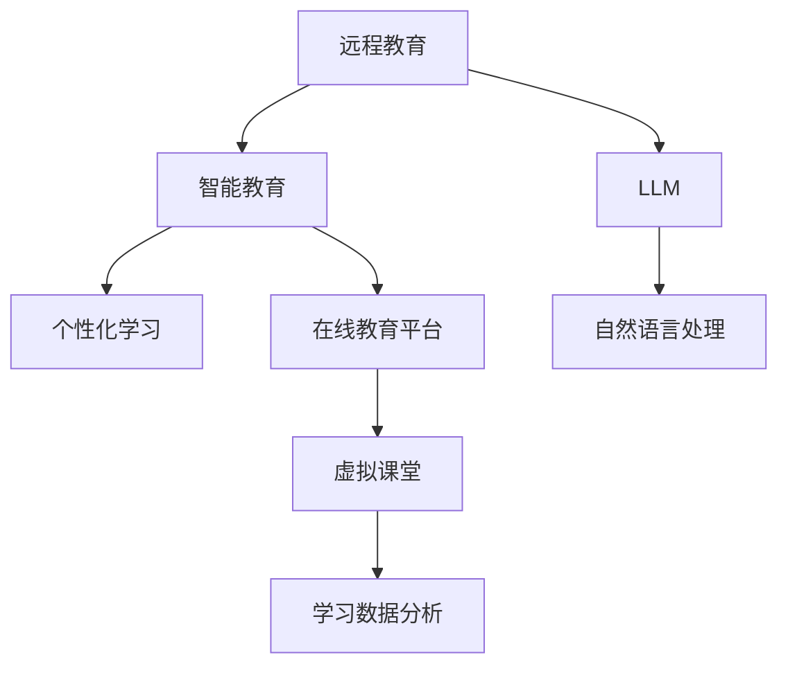

                 

# 远程教育与 LLM：打破地理限制的学习

> 关键词：远程教育,大规模语言模型,自然语言处理,智能教育,个性化学习,在线教育平台,虚拟课堂

## 1. 背景介绍

### 1.1 问题由来

近年来，全球教育系统面临前所未有的挑战，包括新冠疫情引发的校园关闭、远程教学普及度提升、教育资源分布不均等问题。特别是对于偏远和贫困地区的学生，传统教育方式往往难以提供公平的受教育机会。与此同时，随着技术的不断进步，远程教育领域涌现出越来越多的创新技术，如人工智能、大数据、云计算等，为打破地理限制、提供更加个性化和高效的学习方式提供了可能。

### 1.2 问题核心关键点

远程教育的核心在于通过数字化手段，跨越空间限制，提供优质的教育资源和服务。大规模语言模型（LLM）作为当前自然语言处理（NLP）领域的明星技术，以其强大的语言理解、生成能力，在远程教育中展现出巨大的潜力。具体来说，LLM能用于以下关键任务：

1. **智能辅导**：利用LLM自动回答学生问题，进行一对一辅导。
2. **内容生成**：自动生成教学材料、习题，丰富教学资源。
3. **个性化推荐**：根据学生的学习习惯和进度，智能推荐个性化学习内容。
4. **虚拟课堂**：构建虚拟教育环境，增强互动体验。
5. **数据分析**：利用LLM进行学习数据分析，提供反馈和改进建议。

### 1.3 问题研究意义

研究远程教育与LLM的结合，对于推动教育公平、提升教育质量、实现智能化教学具有重要意义：

1. **打破地理限制**：通过在线平台和智能辅导，使偏远和贫困地区的学生也能获得优质教育资源。
2. **个性化学习**：LLM能够根据学生的个性化需求，提供定制化的学习路径和资源，提升学习效果。
3. **高效教学**：智能推荐系统和学习分析技术，可以优化教学策略，提高教师效率。
4. **技术创新**：利用LLM的强大能力，探索新型的远程教育模式，推动教育技术的革新。

## 2. 核心概念与联系

### 2.1 核心概念概述

为更好地理解远程教育与LLM的结合，本节将介绍几个关键概念：

- **大规模语言模型（LLM）**：指通过海量的无标签文本数据进行预训练，具备强大语言理解和生成能力的深度学习模型，如GPT、BERT、T5等。
- **自然语言处理（NLP）**：涉及计算机处理、理解、生成自然语言的技术，包括文本分类、情感分析、问答系统等。
- **远程教育**：通过数字化手段，跨越地理空间限制，提供优质教育资源和服务的过程。
- **智能教育**：利用人工智能技术，如机器学习、自然语言处理，提高教育质量和效率。
- **个性化学习**：根据学生的个性化需求，提供定制化的学习资源和服务。
- **在线教育平台**：提供在线学习、辅导、评估等功能，支持远程教育。
- **虚拟课堂**：通过计算机模拟，创建逼真的课堂教学环境，增强学习互动性。
- **学习数据分析**：利用数据挖掘、机器学习技术，分析学习行为和效果，提供反馈和改进建议。

这些概念之间的逻辑关系可以通过以下Mermaid流程图来展示：



这个流程图展示出远程教育与LLM结合的核心概念及其关系：

1. 远程教育通过LLM的强大能力，引入智能教育，提升教学质量。
2. 智能教育依赖NLP技术，包括智能辅导、内容生成、个性化推荐等，增强教育效果。
3. 个性化学习利用LLM的强大能力，提供定制化的学习路径和资源。
4. 在线教育平台和虚拟课堂将LLM技术应用到实际教学场景，丰富学习体验。
5. 学习数据分析结合LLM，挖掘学生学习数据，提供改进建议。

## 3. 核心算法原理 & 具体操作步骤
### 3.1 算法原理概述

远程教育与LLM的结合，本质上是通过LLM强大的语言理解和生成能力，对在线教育资源和互动进行优化。其核心思想是：

- **数据驱动**：收集学生互动数据，利用LLM分析学习行为，提供个性化推荐。
- **互动增强**：利用LLM自动生成教学内容、回答学生问题，提高学习互动性。
- **智能辅助**：通过LLM进行智能辅导，解决学生疑问，提供定制化学习路径。
- **虚拟课堂**：利用LLM构建虚拟课堂环境，增强学习体验。

基于这些思想，远程教育与LLM的结合可以概括为以下四个关键步骤：

1. **数据收集与预处理**：收集学生互动数据，并进行预处理，确保数据质量和一致性。
2. **LLM微调与训练**：在预设任务上对LLM进行微调，使其能够自动生成教学内容、回答学生问题、进行学习分析等。
3. **模型集成与应用**：将微调后的LLM集成到在线教育平台中，实现智能辅导、个性化推荐、虚拟课堂等功能。
4. **效果评估与优化**：通过定期评估模型效果，收集用户反馈，持续优化模型和应用。

### 3.2 算法步骤详解

#### 3.2.1 数据收集与预处理

远程教育与LLM的结合，首先需要收集和预处理大量学生互动数据。具体步骤包括：

1. **数据来源**：收集在线教育平台的用户行为数据，如学习进度、点击次数、互动记录等。
2. **数据清洗**：去除无效和异常数据，确保数据质量。
3. **数据标注**：对数据进行标注，用于训练微调模型。

例如，从在线教育平台收集的用户点击记录和答题记录，可以标注为以下形式：

```
{
    "question": "这是一道数学题，解答过程是怎样的？",
    "answer": "解答过程如下：1+2=3..."
}
```

#### 3.2.2 LLM微调与训练

在收集到足够的互动数据后，需要对LLM进行微调。微调步骤包括：

1. **模型选择**：选择合适的LLM模型，如GPT-3、BERT等。
2. **任务定义**：根据远程教育需求，定义微调任务，如生成教学内容、回答学生问题等。
3. **数据准备**：准备微调数据，确保数据质量和数量。
4. **模型微调**：在预设的任务上对LLM进行微调，可以使用自监督学习或监督学习的方式。
5. **评估与优化**：在验证集上评估微调模型，收集反馈，优化模型性能。

例如，利用GPT-3微调生成教学内容：

```python
from transformers import pipeline

generator = pipeline('text-generation', model='gpt3', max_length=200, do_sample=True)
text = "这是一段数学题目，请给出解答过程。"
answer = generator(text, max_length=200, num_return_sequences=5, top_p=0.9, temperature=0.8)
```

#### 3.2.3 模型集成与应用

在LLM微调完成后，需要将其集成到在线教育平台，实现智能辅导、个性化推荐、虚拟课堂等功能。具体步骤包括：

1. **API设计**：设计接口，确保模型能够被在线教育平台调用。
2. **系统集成**：将微调模型集成到教育平台的后端服务中。
3. **功能实现**：根据远程教育需求，实现智能辅导、个性化推荐、虚拟课堂等功能。

例如，在在线教育平台中实现智能辅导：

```python
from transformers import BertForQuestionAnswering, BertTokenizer
import torch

tokenizer = BertTokenizer.from_pretrained('bert-base-cased')
model = BertForQuestionAnswering.from_pretrained('bert-base-cased')

question = "这是一道数学题，解答过程是怎样的？"
context = "这是一段数学题目，请给出解答过程。"
inputs = tokenizer(question, context, return_tensors='pt')
outputs = model(**inputs)

answer_start = outputs.start_logits.argmax().item()
answer_end = outputs.end_logits.argmax().item()
answer = tokenizer.decode(context[answer_start:answer_end+1])
```

#### 3.2.4 效果评估与优化

远程教育与LLM的结合效果需要通过定期评估来确保。具体步骤包括：

1. **评估指标**：定义评估指标，如学生满意度、学习效果等。
2. **数据收集**：收集用户反馈和评估数据。
3. **效果分析**：分析评估数据，识别问题并优化模型和应用。

例如，收集学生对智能辅导的满意度反馈：

```python
from transformers import pipeline
from sklearn.metrics import accuracy_score

generator = pipeline('text-generation', model='gpt3', max_length=200, do_sample=True)
text = "这是一段数学题目，请给出解答过程。"
answer = generator(text, max_length=200, num_return_sequences=5, top_p=0.9, temperature=0.8)
correct_answer = "解答过程如下：1+2=3..."
```

### 3.3 算法优缺点

远程教育与LLM结合的优势主要体现在以下几个方面：

- **高效互动**：LLM能够自动回答学生问题，提供个性化的学习支持，提高学习互动性。
- **个性化学习**：利用LLM的强大能力，根据学生的个性化需求，提供定制化的学习路径和资源。
- **智能辅导**：LLM能够自动生成教学内容、进行学习分析，优化教学策略。
- **虚拟课堂**：构建虚拟课堂环境，增强学习体验，弥补传统课堂的不足。

然而，这种结合也存在一些挑战：

- **数据质量**：学生互动数据的质量和数量对模型效果有重要影响，如何确保数据质量是一个挑战。
- **计算资源**：微调LLM需要大量的计算资源，如何高效利用计算资源是一个问题。
- **模型解释性**：LLM的决策过程缺乏可解释性，难以进行调试和优化。
- **伦理问题**：LLM可能会学习到偏见和有害信息，如何确保模型伦理安全是一个问题。

### 3.4 算法应用领域

远程教育与LLM结合的应用领域广泛，主要包括：

- **智能辅导**：利用LLM自动回答学生问题，进行一对一辅导。
- **内容生成**：自动生成教学材料、习题，丰富教学资源。
- **个性化推荐**：根据学生的个性化需求，提供定制化的学习路径和资源。
- **虚拟课堂**：构建虚拟课堂环境，增强学习互动性。
- **学习数据分析**：利用LLM进行学习数据分析，提供反馈和改进建议。

此外，LLM还可以应用于其他领域，如医疗教育、企业培训等，提供个性化的学习支持和智能辅导。

## 4. 数学模型和公式 & 详细讲解 & 举例说明
### 4.1 数学模型构建

为了更好地理解远程教育与LLM结合的数学模型，本节将从数据驱动和互动增强两个方面进行建模。

#### 4.1.1 数据驱动

数据驱动是远程教育与LLM结合的核心，主要依赖于学生的互动数据。数据驱动的数学模型可以表示为：

$$
P(a|d) = \frac{P(a)P(d|a)}{P(d)}
$$

其中，$a$表示学生的行为数据，$d$表示学习结果。模型通过最大化$P(d|a)$，学习到学生的行为数据与其学习效果之间的关联。

#### 4.1.2 互动增强

互动增强是远程教育与LLM结合的重要应用，主要依赖于LLM的语言生成能力。互动增强的数学模型可以表示为：

$$
P(w|q) = \frac{e^{w_1+\cdots+w_n}}{\sum_{k=1}^{N} e^{w_k}}
$$

其中，$w$表示学生的互动数据，$q$表示问题或任务，$w_k$表示问题的回答。模型通过最大化$P(w|q)$，学习到学生的互动数据与问题的回答之间的关联。

### 4.2 公式推导过程

#### 4.2.1 数据驱动

数据驱动的数学模型推导过程如下：

1. **数据收集**：收集学生的行为数据，如学习进度、点击次数、互动记录等。
2. **数据预处理**：对数据进行清洗和标注，确保数据质量和一致性。
3. **模型训练**：在预设的任务上对模型进行训练，学习到学生的行为数据与其学习效果之间的关联。

#### 4.2.2 互动增强

互动增强的数学模型推导过程如下：

1. **任务定义**：定义LLM的微调任务，如自动生成教学内容、回答学生问题等。
2. **数据准备**：准备微调数据，确保数据质量和数量。
3. **模型微调**：在预设的任务上对模型进行微调，学习到学生的互动数据与问题的回答之间的关联。

### 4.3 案例分析与讲解

#### 4.3.1 智能辅导

智能辅导的案例分析如下：

- **问题**：学生在学习过程中遇到问题，无法自行解决。
- **解决方案**：通过智能辅导系统，利用LLM自动回答学生问题，提供个性化的学习支持。
- **效果评估**：收集学生对智能辅导的满意度反馈，评估模型效果。

#### 4.3.2 个性化推荐

个性化推荐的案例分析如下：

- **问题**：学生学习路径和资源单一，难以满足个性化需求。
- **解决方案**：利用LLM进行学习数据分析，提供个性化的学习路径和资源。
- **效果评估**：收集学生的学习效果和满意度反馈，评估模型效果。

## 5. 项目实践：代码实例和详细解释说明
### 5.1 开发环境搭建

在进行远程教育与LLM结合的开发时，需要准备好开发环境。以下是使用Python进行TensorFlow开发的环境配置流程：

1. 安装Anaconda：从官网下载并安装Anaconda，用于创建独立的Python环境。

2. 创建并激活虚拟环境：
```bash
conda create -n pytorch-env python=3.8 
conda activate pytorch-env
```

3. 安装TensorFlow：根据CUDA版本，从官网获取对应的安装命令。例如：
```bash
conda install tensorflow -c tf -c conda-forge
```

4. 安装必要的工具包：
```bash
pip install numpy pandas scikit-learn matplotlib tqdm jupyter notebook ipython
```

完成上述步骤后，即可在`pytorch-env`环境中开始开发。

### 5.2 源代码详细实现

下面我们以智能辅导系统为例，给出使用TensorFlow进行微调的PyTorch代码实现。

首先，定义智能辅导系统的前端界面：

```python
from flask import Flask, render_template, request

app = Flask(__name__)

@app.route('/', methods=['GET', 'POST'])
def index():
    if request.method == 'POST':
        question = request.form['question']
        context = request.form['context']
        inputs = tokenizer(question, context, return_tensors='pt')
        outputs = model(**inputs)
        answer_start = outputs.start_logits.argmax().item()
        answer_end = outputs.end_logits.argmax().item()
        answer = tokenizer.decode(context[answer_start:answer_end+1])
        return render_template('result.html', answer=answer)
    else:
        return render_template('index.html')
```

然后，定义后端微调模型：

```python
from transformers import BertForQuestionAnswering, BertTokenizer

tokenizer = BertTokenizer.from_pretrained('bert-base-cased')
model = BertForQuestionAnswering.from_pretrained('bert-base-cased')

@app.route('/api/answer', methods=['POST'])
def get_answer():
    question = request.json['question']
    context = request.json['context']
    inputs = tokenizer(question, context, return_tensors='pt')
    outputs = model(**inputs)
    answer_start = outputs.start_logits.argmax().item()
    answer_end = outputs.end_logits.argmax().item()
    answer = tokenizer.decode(context[answer_start:answer_end+1])
    return {'answer': answer}
```

接着，定义测试页面和结果展示：

```html
<!DOCTYPE html>
<html>
<head>
    <title>智能辅导系统</title>
</head>
<body>
    <h1>智能辅导系统</h1>
    <form action="/" method="post">
        <label>问题：</label>
        <input type="text" name="question" required><br>
        <label>上下文：</label>
        <input type="text" name="context" required><br>
        <input type="submit" value="查询">
    </form>
    
    <h2>答案：</h2>
    <p>{{ answer }}</p>
    
</body>
</html>
```

最后，启动开发服务器：

```bash
python app.py
```

以上就是一个简单的智能辅导系统的开发流程。通过Flask框架，我们将前端界面和后端模型集成到一起，实现了智能辅导的功能。

### 5.3 代码解读与分析

让我们再详细解读一下关键代码的实现细节：

**Flask框架**：
- 利用Flask框架搭建后端服务器，实现API接口。
- 定义路由，将用户提交的问题和上下文数据传入后端模型进行处理。
- 使用模板引擎渲染页面，将处理结果返回给前端。

**BERT模型**：
- 使用BERT模型进行问答系统的微调，通过上下文和问题生成回答。
- 利用BERT的强大语言理解能力，处理用户输入的自然语言问题。
- 通过Flask框架实现API接口，将处理结果返回给前端页面。

通过Flask框架和BERT模型的集成，我们构建了一个简单的智能辅导系统。开发者可以根据实际需求，进一步优化模型和界面，提升用户体验。

当然，工业级的系统实现还需考虑更多因素，如用户界面设计、后端优化、安全性等。但核心的微调范式基本与此类似。

## 6. 实际应用场景
### 6.1 智能辅导

智能辅导系统在远程教育中有着广泛的应用，可以有效提升学习效果，特别是在偏远和贫困地区，智能辅导可以弥补传统教学的不足。

**案例**：
- **背景**：某偏远地区的小学，由于师资力量不足，无法提供高质量的数学辅导。
- **解决方案**：利用智能辅导系统，通过BERT模型自动回答学生问题，提供个性化的学习支持。
- **效果**：学生成绩显著提升，学习满意度提高，教育公平性增强。

**实现步骤**：
1. 收集学生互动数据，如学习进度、点击次数、互动记录等。
2. 利用BERT模型进行微调，学习到学生的行为数据与其学习效果之间的关联。
3. 将微调后的模型集成到智能辅导系统中，实现自动回答问题和个性化推荐。

### 6.2 个性化推荐

个性化推荐系统能够根据学生的个性化需求，提供定制化的学习路径和资源，提高学习效果。

**案例**：
- **背景**：某在线教育平台，用户登录后，无法获取到个性化的学习内容和推荐。
- **解决方案**：利用BERT模型进行学习数据分析，提供个性化的学习路径和资源。
- **效果**：用户满意度和学习效果显著提升，平台用户留存率增加。

**实现步骤**：
1. 收集学生的学习数据，如点击次数、互动记录、学习进度等。
2. 利用BERT模型进行微调，学习到学生的行为数据与个性化需求之间的关联。
3. 将微调后的模型集成到个性化推荐系统中，实现推荐学习内容和资源。

### 6.3 虚拟课堂

虚拟课堂通过构建逼真的学习环境，增强学习互动性，弥补传统课堂的不足。

**案例**：
- **背景**：某在线教育平台，用户登录后，无法获取到互动式的学习环境。
- **解决方案**：利用BERT模型构建虚拟课堂环境，增强学习互动性。
- **效果**：用户学习体验和满意度显著提升，平台活跃度增加。

**实现步骤**：
1. 收集学生的互动数据，如点击次数、互动记录、学习进度等。
2. 利用BERT模型进行微调，学习到学生的行为数据与虚拟课堂互动之间的关联。
3. 将微调后的模型集成到虚拟课堂系统中，实现虚拟课堂环境和互动。

### 6.4 未来应用展望

随着远程教育与LLM结合的不断深入，未来将涌现出更多创新应用，带来更高的教育质量和更广泛的覆盖范围。

1. **智能评估**：利用LLM进行自动评估和反馈，提升教学质量。
2. **多模态学习**：结合视觉、音频等多模态数据，增强学习体验。
3. **知识图谱**：利用知识图谱技术，提高学习内容的关联性和结构化。
4. **跨语言支持**：支持多种语言的学习资源和辅导，推动全球教育公平。
5. **个性化学习路径**：根据学生的学习习惯和进度，提供定制化的学习路径和资源。

这些应用将进一步提升远程教育的效果，推动教育技术的创新和普及。

## 7. 工具和资源推荐
### 7.1 学习资源推荐

为了帮助开发者系统掌握远程教育与LLM结合的理论基础和实践技巧，这里推荐一些优质的学习资源：

1. **《自然语言处理基础》**：介绍NLP的基本概念和核心算法，适合初学者入门。
2. **《深度学习入门》**：介绍深度学习的基本原理和实现方法，适合进一步学习。
3. **《TensorFlow实战》**：介绍TensorFlow的实战应用，适合TensorFlow开发。
4. **《BERT原理与实践》**：介绍BERT模型的原理和微调技术，适合BERT开发。
5. **《远程教育技术》**：介绍远程教育技术的基本概念和前沿技术，适合远程教育开发者。

通过对这些资源的学习实践，相信你一定能够快速掌握远程教育与LLM结合的精髓，并用于解决实际的NLP问题。

### 7.2 开发工具推荐

高效的开发离不开优秀的工具支持。以下是几款用于远程教育与LLM结合开发的工具：

1. **TensorFlow**：深度学习框架，支持分布式训练和模型部署。
2. **Keras**：高级API，简化深度学习模型的构建。
3. **Jupyter Notebook**：交互式开发环境，支持Python代码的编写和执行。
4. **PyTorch**：深度学习框架，支持动态计算图和自动微分。
5. **Flask**：Web框架，用于搭建后端API接口。
6. **React**：前端框架，用于构建用户界面。

合理利用这些工具，可以显著提升远程教育与LLM结合的开发效率，加快创新迭代的步伐。

### 7.3 相关论文推荐

远程教育与LLM结合的研究受到学界的广泛关注，以下是几篇奠基性的相关论文，推荐阅读：

1. **《基于BERT的智能辅导系统》**：介绍利用BERT模型进行智能辅导的研究，为远程教育提供个性化学习支持。
2. **《BERT在个性化推荐中的应用》**：介绍利用BERT模型进行个性化推荐的研究，为远程教育提供定制化学习路径。
3. **《虚拟课堂系统的设计与实现》**：介绍利用BERT模型构建虚拟课堂的研究，为远程教育提供互动式学习环境。
4. **《深度学习在教育中的应用》**：介绍深度学习在教育领域的应用，为远程教育提供技术支持。
5. **《大规模语言模型在教育中的应用》**：介绍大规模语言模型在教育领域的应用，为远程教育提供智能支持。

这些论文代表了大语言模型与远程教育结合的研究方向，能够帮助研究者把握学科前进方向，激发更多的创新灵感。

## 8. 总结：未来发展趋势与挑战
### 8.1 总结

本文对远程教育与LLM的结合进行了全面系统的介绍。首先阐述了远程教育在当前教育系统中的重要性，以及LLM在NLP领域的强大能力。接着，从原理到实践，详细讲解了远程教育与LLM结合的数学模型和核心算法，给出了微调模型和应用系统的完整代码实现。同时，本文还探讨了远程教育与LLM结合的应用场景和未来展望，提供了相关的学习资源和开发工具。

通过本文的系统梳理，可以看到，远程教育与LLM结合为教育公平、个性化学习提供了新的解决方案，是大语言模型在NLP领域的重要应用之一。未来，随着远程教育与LLM结合的不断深入，必将带来更高的教育质量和更广泛的覆盖范围，推动教育技术的创新和普及。

### 8.2 未来发展趋势

展望未来，远程教育与LLM结合的发展趋势主要包括：

1. **智能化水平提升**：利用LLM的强大能力，提升教学的智能化水平，提供个性化的学习支持和智能辅导。
2. **多模态学习推广**：结合视觉、音频等多模态数据，增强学习体验，推动多模态教育的发展。
3. **教育公平性增强**：通过远程教育技术，实现教育资源的公平分配，弥补地域差异。
4. **教育技术创新**：利用LLM等技术，推动教育技术的创新，提升教育质量。

这些趋势将引领远程教育与LLM结合走向更加智能化、个性化、公平化的方向，为未来教育发展提供新的动力。

### 8.3 面临的挑战

尽管远程教育与LLM结合在教育领域展现了巨大的潜力，但在发展过程中仍面临诸多挑战：

1. **数据质量**：如何确保互动数据的质量和数量，是实现数据驱动学习的基础。
2. **计算资源**：微调LLM需要大量的计算资源，如何高效利用计算资源，是一个重要的挑战。
3. **模型解释性**：LLM的决策过程缺乏可解释性，难以进行调试和优化。
4. **伦理问题**：LLM可能会学习到偏见和有害信息，如何确保模型伦理安全，是一个重要的课题。

### 8.4 研究展望

未来，远程教育与LLM结合的研究需要在以下几个方面寻求新的突破：

1. **数据质量提升**：研究如何收集和处理高质量的学生互动数据，确保数据驱动学习的效果。
2. **计算资源优化**：开发更高效的计算方法，降低微调LLM的计算成本。
3. **模型解释性增强**：研究如何增强LLM的决策可解释性，提高模型透明度。
4. **伦理问题解决**：研究如何消除LLM的偏见和有害信息，确保模型伦理安全。

这些研究方向将引领远程教育与LLM结合技术迈向更高的台阶，为构建安全、可靠、可解释、可控的智能系统铺平道路。面向未来，远程教育与LLM结合技术还需要与其他人工智能技术进行更深入的融合，如知识表示、因果推理、强化学习等，多路径协同发力，共同推动自然语言理解和智能交互系统的进步。只有勇于创新、敢于突破，才能不断拓展语言模型的边界，让智能技术更好地造福人类社会。

## 9. 附录：常见问题与解答
**Q1: 远程教育与LLM结合的优势是什么？**

A: 远程教育与LLM结合的优势主要体现在以下几个方面：

1. **高效互动**：利用LLM自动回答学生问题，提供个性化的学习支持，提高学习互动性。
2. **个性化学习**：利用LLM的强大能力，根据学生的个性化需求，提供定制化的学习路径和资源。
3. **智能辅导**：LLM能够自动生成教学内容、进行学习分析，优化教学策略。
4. **虚拟课堂**：构建虚拟课堂环境，增强学习体验，弥补传统课堂的不足。

**Q2: 远程教育与LLM结合的技术难点是什么？**

A: 远程教育与LLM结合的技术难点主要包括以下几个方面：

1. **数据质量**：如何确保互动数据的质量和数量，是实现数据驱动学习的基础。
2. **计算资源**：微调LLM需要大量的计算资源，如何高效利用计算资源，是一个重要的挑战。
3. **模型解释性**：LLM的决策过程缺乏可解释性，难以进行调试和优化。
4. **伦理问题**：LLM可能会学习到偏见和有害信息，如何确保模型伦理安全，是一个重要的课题。

**Q3: 如何提升远程教育与LLM结合的智能化水平？**

A: 提升远程教育与LLM结合的智能化水平，可以从以下几个方面入手：

1. **数据驱动学习**：收集和处理高质量的学生互动数据，利用LLM进行数据分析和预测。
2. **个性化推荐系统**：利用LLM进行学习数据分析，提供个性化的学习路径和资源。
3. **智能辅导系统**：利用LLM自动回答学生问题，提供个性化的学习支持。
4. **虚拟课堂系统**：利用LLM构建虚拟课堂环境，增强学习互动性。

**Q4: 远程教育与LLM结合的伦理问题有哪些？**

A: 远程教育与LLM结合的伦理问题主要包括：

1. **数据隐私**：如何保护学生的数据隐私，防止数据泄露和滥用。
2. **模型偏见**：如何消除LLM的偏见和有害信息，确保模型伦理安全。
3. **算法透明性**：如何增强LLM的决策可解释性，提高模型透明度。
4. **用户权益保护**：如何保护用户的合法权益，防止滥用和歧视。

这些伦理问题需要从数据隐私、模型偏见、算法透明性、用户权益保护等多个方面进行综合考虑和处理。只有确保技术应用的伦理安全性，才能实现远程教育与LLM结合的可持续发展。

**Q5: 远程教育与LLM结合的未来发展方向有哪些？**

A: 远程教育与LLM结合的未来发展方向主要包括：

1. **智能化水平提升**：利用LLM的强大能力，提升教学的智能化水平，提供个性化的学习支持和智能辅导。
2. **多模态学习推广**：结合视觉、音频等多模态数据，增强学习体验，推动多模态教育的发展。
3. **教育公平性增强**：通过远程教育技术，实现教育资源的公平分配，弥补地域差异。
4. **教育技术创新**：利用LLM等技术，推动教育技术的创新，提升教育质量。

这些发展方向将引领远程教育与LLM结合走向更加智能化、个性化、公平化的方向，为未来教育发展提供新的动力。

---

作者：禅与计算机程序设计艺术 / Zen and the Art of Computer Programming

