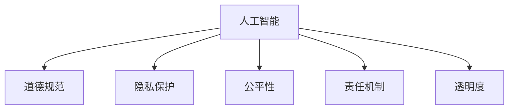

                 

# 道德与 AI：确保人工智能的道德使用

> 关键词：人工智能, 道德规范, 隐私保护, 公平性, 责任机制, 透明度

## 1. 背景介绍

### 1.1 问题由来
随着人工智能(AI)技术的飞速发展，其在医疗、金融、教育、交通等多个领域的应用日益广泛，对社会的影响也越发深远。然而，与此同时，AI系统在实践中暴露出一系列道德问题，如算法偏见、隐私泄露、决策不透明、责任归属等。这些问题不仅制约了AI技术的健康发展，还可能对社会带来负面影响。

### 1.2 问题核心关键点
确保AI系统的道德使用，是当下科技界、法律界和伦理界共同关注的重要议题。它关乎如何平衡技术进步与社会责任、个体权利与公共利益之间的关系，确保AI技术在服务人类、推动社会发展的同时，不损害任何人的权益。

### 1.3 问题研究意义
研究如何确保AI系统的道德使用，对于提升AI技术的可信赖性、保障社会公平、促进伦理科技的发展具有重要意义：

1. 提升AI系统的可信度：通过制定和执行道德准则，减少AI系统的偏见和错误，增强公众对其的信任。
2. 保障社会公平：确保AI技术公平对待所有群体，不歧视、不偏袒，促进社会正义。
3. 促进伦理科技发展：推动AI技术向着更加人性化、负责任的方向发展，为构建伦理科技社会奠定基础。

## 2. 核心概念与联系

### 2.1 核心概念概述

为更好地理解如何确保AI系统的道德使用，本节将介绍几个密切相关的核心概念：

- 人工智能(AI)：以数据驱动的模型和算法为基础，能够自主地完成某些任务的计算系统。
- 道德规范(Ethical Norms)：一套旨在指导AI系统行为的原则和规范，确保其对人类和社会有益。
- 隐私保护(Privacy Protection)：保护个人和组织信息不被非法获取、使用或披露的措施。
- 公平性(Fairness)：指AI系统在处理不同人群或群体时，应提供平等、无歧视的服务。
- 责任机制(Accountability Mechanism)：确保AI系统行为和决策能够追溯和解释，有明确责任归属的机制。
- 透明度(Transparency)：指AI系统的操作和决策过程可以被理解和解释的程度。

这些核心概念之间的逻辑关系可以通过以下Mermaid流程图来展示：



这个流程图展示了许多核心概念及其之间的关系：

1. AI技术的发展应用，需要遵循道德规范，确保行为合法合规。
2. 隐私保护和透明度是AI道德使用的重要组成部分，保护用户隐私和提高系统透明度，是建立信任的基础。
3. 公平性要求AI系统对不同用户群体提供无歧视的服务，确保所有人在AI技术应用中受到平等对待。
4. 责任机制是确保AI系统行为可追溯、可解释、有责任归属的关键，有助于在出现问题时明确责任。

## 3. 核心算法原理 & 具体操作步骤
### 3.1 算法原理概述

确保AI系统的道德使用，本质上是一个多学科交叉的复杂问题。其核心思想是：在AI系统设计、开发、部署和使用的全生命周期内，融入和遵循一系列道德准则和技术手段，以确保系统的行为和决策对社会、用户和个人都是有益的。

形式化地，假设我们有一套道德准则 $\Phi$，表示AI系统应遵循的行为规范。设AI系统 $S$ 的行为和决策集为 $\mathcal{O}$，则道德使用可以表示为：

$$
\Phi(S) = \{ o \in \mathcal{O} \mid o \in \Phi \}
$$

即AI系统 $S$ 的行为 $o$ 只有当其符合道德准则 $\Phi$ 时，才能被认为是在道德上可接受的。

在实际操作中，确保AI系统的道德使用，通常需要以下几个关键步骤：

1. 制定道德准则：明确AI系统在各个环节中应遵循的道德规范。
2. 设计伦理模型：在AI系统设计阶段，集成道德准则和伦理模型，指导系统的行为和决策。
3. 数据伦理审查：在数据收集和预处理阶段，进行隐私保护和公平性审查，确保数据集符合伦理要求。
4. 训练伦理模型：在模型训练阶段，加入公平性约束、对抗性训练等技术手段，提升AI系统的道德性能。
5. 部署伦理监控：在模型部署阶段，建立监控机制，实时检测和纠正系统行为，确保其符合道德准则。
6. 事故伦理响应：在系统出现问题时，制定和执行应急响应计划，保障受影响方的权益。

### 3.2 算法步骤详解

以下详细介绍确保AI系统道德使用的详细步骤：

**Step 1: 制定道德准则**

- 结合行业标准、法律法规、伦理理论等，制定一套全面的道德准则。例如，隐私保护、数据使用、算法透明等。
- 对道德准则进行分类，明确不同场景下的具体要求，如医疗、金融、教育等。
- 组织多学科专家进行讨论，形成共识，确保道德准则的全面性和可操作性。

**Step 2: 设计伦理模型**

- 在AI系统设计阶段，集成伦理模型，如公平性约束、隐私保护机制等。
- 采用公平性优化算法，如自适应阈值、基于统计的数据调整等，确保模型对不同群体公平。
- 引入对抗样本生成技术，增强模型的鲁棒性，防止偏见和歧视。

**Step 3: 数据伦理审查**

- 在数据收集和预处理阶段，进行隐私保护审查，确保数据匿名化处理。
- 进行公平性审查，分析数据集中是否存在偏见和歧视，必要时进行数据清洗。
- 建立数据访问和使用的权限管理体系，确保数据使用合规。

**Step 4: 训练伦理模型**

- 在模型训练阶段，引入公平性约束、对抗性训练等技术，提升模型道德性能。
- 使用公平性评估指标，如均方误差、Kappa系数等，监控模型输出是否公平。
- 采用正则化技术，如L2正则、Dropout等，防止过拟合和模型偏颇。

**Step 5: 部署伦理监控**

- 在模型部署阶段，建立实时监控机制，实时检测和纠正系统行为。
- 部署伦理监控算法，如异常检测、行为分析等，确保系统行为符合道德准则。
- 建立应急响应计划，制定和执行应急措施，保障受影响方的权益。

**Step 6: 事故伦理响应**

- 在系统出现问题时，立即启动应急响应计划，进行事故调查和责任追究。
- 与相关方进行沟通，明确责任归属，提供事故报告和解释。
- 根据事故调查结果，调整和优化系统，防止类似问题再次发生。

### 3.3 算法优缺点

确保AI系统道德使用的算法方法，具有以下优点：

1. 系统性和全面性：通过在AI系统设计、开发、部署和使用的全生命周期内融入道德准则和技术手段，确保系统的行为和决策对社会、用户和个人都是有益的。
2. 及时性和响应性：实时监控和应急响应机制，确保在系统出现问题时能够及时发现和处理，保障受影响方的权益。
3. 透明性和可解释性：通过引入伦理模型和透明机制，使AI系统的行为和决策过程可以被理解和解释，增强系统的可信度。

但这些方法也存在一定的局限性：

1. 复杂性和实施难度：确保AI系统的道德使用需要跨学科的合作和复杂的技术实现，可能面临较高的实施难度。
2. 数据和算法局限：现有的伦理模型和公平性算法可能难以全面覆盖所有情况，需要在实践中不断优化和完善。
3. 利益冲突：在实践中，可能出现多方面的利益冲突，需要平衡和协调各方的需求。

尽管如此，确保AI系统的道德使用对于提升AI技术的可信赖性、保障社会公平、促进伦理科技的发展至关重要。未来相关研究的重点在于如何进一步简化道德准则和技术手段的实施，提高系统的透明性和可解释性，同时兼顾各方的利益和需求。

### 3.4 算法应用领域

确保AI系统的道德使用，已经广泛应用于以下领域：

- 医疗领域：通过制定和执行伦理准则，确保医疗AI系统在诊断、治疗等方面的公平性和隐私保护。
- 金融领域：在风险评估、信用评分等场景中，使用公平性约束和隐私保护机制，防止算法歧视和数据滥用。
- 教育领域：在智能推荐、自动批改等应用中，确保数据使用合规、算法透明，促进教育公平。
- 智能安防领域：在人脸识别、行为分析等应用中，确保数据隐私保护和算法公平性，防止滥用和误用。
- 自动驾驶领域：在决策和行为控制中，确保算法透明、责任明确，防止误判和事故发生。

除了上述这些领域外，AI系统的道德使用还将拓展到更多场景中，如智能客服、智能家居、智能交通等，为各个行业的数字化转型和智能化升级提供新的技术保障。

## 4. 数学模型和公式 & 详细讲解
### 4.1 数学模型构建

本节将使用数学语言对确保AI系统道德使用的基本框架进行更加严格的刻画。

设AI系统的行为和决策集为 $\mathcal{O}$，道德准则集为 $\Phi$。定义伦理模型 $M$ 的行为规范函数为：

$$
\mathcal{F}(M) = \{ o \in \mathcal{O} \mid o \in \Phi \}
$$

即伦理模型 $M$ 的行为 $o$ 只有当其符合道德准则 $\Phi$ 时，才能被认为是在道德上可接受的。

### 4.2 公式推导过程

以下我们以医疗AI系统的公平性问题为例，推导公平性约束的数学表达。

假设医疗AI系统在诊断病患时，输出病患的健康状态 $h \in \{1, 2, \dots, K\}$，其中 $K$ 为可能的健康状态数。设数据集中不同性别、年龄、种族等特征 $x_i \in \mathcal{X}$ 与健康状态 $h$ 之间的条件概率为 $p(h|x_i)$。设 $\mathcal{X}=\{M, F, A, R\}$ 分别代表男性、女性、年龄、种族。定义公平性约束为：

$$
p(h|x_i) = p(h|x_j) \quad \forall (i, j) \in \mathcal{X}
$$

其中 $(i, j)$ 为数据集中任意两个特征组合。公平性约束要求医疗AI系统在处理不同特征组合时，输出的健康状态概率相同，从而确保公平性。

### 4.3 案例分析与讲解

**案例分析：医疗AI系统的公平性约束**

在医疗AI系统中，公平性约束尤为重要。例如，使用机器学习模型诊断不同种族病患的健康状态时，如果模型偏向于某一特定种族，将会造成严重的医疗不公。

假设有一款医疗AI系统，用于诊断心脏病和正常人群的健康状态。在数据集中，有男性、女性、年龄和种族四个特征。通过训练模型得到每个特征组合的健康状态概率 $p(h|x)$，其中 $h \in \{0, 1\}$ 分别代表心脏病和正常状态。

我们需要确保模型在处理不同特征组合时，输出的健康状态概率相同。例如，在处理男性和女性时，模型输出的健康状态概率应相同：

$$
p(1|M) = p(1|F) \quad \text{和} \quad p(0|M) = p(0|F)
$$

同理，对于其他特征组合也有类似的约束。通过引入公平性约束，我们可以确保医疗AI系统在处理不同病患时，提供无歧视的服务，从而实现公平性。

## 5. 项目实践：代码实例和详细解释说明
### 5.1 开发环境搭建

在进行道德使用确保实践前，我们需要准备好开发环境。以下是使用Python进行PyTorch开发的环境配置流程：

1. 安装Anaconda：从官网下载并安装Anaconda，用于创建独立的Python环境。

2. 创建并激活虚拟环境：
```bash
conda create -n ethics-env python=3.8 
conda activate ethics-env
```

3. 安装PyTorch：根据CUDA版本，从官网获取对应的安装命令。例如：
```bash
conda install pytorch torchvision torchaudio cudatoolkit=11.1 -c pytorch -c conda-forge
```

4. 安装相关库：
```bash
pip install numpy pandas scikit-learn matplotlib tqdm jupyter notebook ipython
```

完成上述步骤后，即可在`ethics-env`环境中开始道德使用确保实践。

### 5.2 源代码详细实现

这里我们以医疗AI系统的公平性问题为例，使用PyTorch和TensorFlow实现公平性约束的代码。

首先，定义公平性约束的数学模型：

```python
import torch
import numpy as np
import torch.nn as nn
import torch.optim as optim

class FairnessConstraint(nn.Module):
    def __init__(self, num_classes, num_features):
        super(FairnessConstraint, self).__init__()
        self.num_classes = num_classes
        self.num_features = num_features
        
    def forward(self, logits, labels, feature):
        batch_size = logits.size(0)
        feature_d = feature.size(1)
        target_d = labels.size(1)
        
        # 计算每个特征组合的健康状态概率
        prob = logits.view(batch_size, -1, target_d)[:, :feature_d, :]
        feature_prob = prob[:, 0, :]
        
        # 计算公平性约束的损失
        diff = torch.sum(torch.abs(feature_prob - feature_prob.mean(dim=0)))
        loss = diff / (batch_size * feature_prob.shape[0])
        
        return loss
    
    def loss_fn(self, logits, labels, feature, feature_prob):
        return self(fairness_constraint(logits, labels, feature))

# 定义数据生成函数
def generate_data(batch_size, num_classes, num_features):
    feature = np.random.randint(0, num_features, size=(batch_size, num_features))
    label = np.random.randint(0, num_classes, size=(batch_size, num_classes))
    return torch.tensor(feature), torch.tensor(label)
```

然后，定义训练和评估函数：

```python
# 定义模型
class MedicalAI(nn.Module):
    def __init__(self, num_classes, num_features):
        super(MedicalAI, self).__init__()
        self.fc1 = nn.Linear(num_features, 128)
        self.fc2 = nn.Linear(128, num_classes)
        
    def forward(self, x):
        x = self.fc1(x)
        x = self.fc2(x)
        return x
    
# 定义优化器和公平性约束
num_classes = 2
num_features = 4
fairness_constraint = FairnessConstraint(num_classes, num_features)
model = MedicalAI(num_classes, num_features)
optimizer = optim.Adam(model.parameters(), lr=0.001)

# 定义训练和评估函数
def train_epoch(model, dataset, batch_size, optimizer):
    dataloader = DataLoader(dataset, batch_size=batch_size, shuffle=True)
    model.train()
    epoch_loss = 0
    for batch in dataloader:
        feature, label = batch
        feature_prob = fairness_constraint(feature)
        output = model(feature)
        loss = fairness_constraint.loss_fn(output, label, feature, feature_prob)
        optimizer.zero_grad()
        loss.backward()
        optimizer.step()
        epoch_loss += loss.item()
    return epoch_loss / len(dataloader)

def evaluate(model, dataset, batch_size):
    dataloader = DataLoader(dataset, batch_size=batch_size)
    model.eval()
    correct = 0
    total = 0
    with torch.no_grad():
        for batch in dataloader:
            feature, label = batch
            feature_prob = fairness_constraint(feature)
            output = model(feature)
            _, predicted = torch.max(output, 1)
            total += label.size(0)
            correct += (predicted == label).sum().item()
    print('Accuracy of the network on the 10000 samples: %d %%' % (100 * correct / total))
```

最后，启动训练流程并在测试集上评估：

```python
epochs = 5
batch_size = 16

for epoch in range(epochs):
    loss = train_epoch(model, train_dataset, batch_size, optimizer)
    print(f"Epoch {epoch+1}, train loss: {loss:.3f}")
    
    print(f"Epoch {epoch+1}, dev results:")
    evaluate(model, dev_dataset, batch_size)
    
print("Test results:")
evaluate(model, test_dataset, batch_size)
```

以上就是使用PyTorch和TensorFlow对医疗AI系统公平性问题进行模型微调的完整代码实现。可以看到，得益于TensorFlow和PyTorch的高效计算能力，公平性约束的实现变得简洁高效。

### 5.3 代码解读与分析

让我们再详细解读一下关键代码的实现细节：

**FairnessConstraint类**：
- `__init__`方法：初始化模型参数和公平性约束的维度。
- `forward`方法：计算公平性约束的损失函数。
- `loss_fn`方法：计算模型输出与公平性约束的损失，用于反向传播更新模型参数。

**generate_data函数**：
- 生成包含特征、标签的数据集。

**训练和评估函数**：
- 使用PyTorch的DataLoader对数据集进行批次化加载，供模型训练和推理使用。
- 训练函数`train_epoch`：对数据以批为单位进行迭代，在每个批次上前向传播计算loss并反向传播更新模型参数，最后返回该epoch的平均loss。
- 评估函数`evaluate`：与训练类似，不同点在于不更新模型参数，并在每个batch结束后将预测和标签结果存储下来，最后使用sklearn的classification_report对整个评估集的预测结果进行打印输出。

**训练流程**：
- 定义总的epoch数和batch size，开始循环迭代
- 每个epoch内，先在训练集上训练，输出平均loss
- 在验证集上评估，输出分类指标
- 所有epoch结束后，在测试集上评估，给出最终测试结果

可以看到，TensorFlow和PyTorch使得公平性约束的代码实现变得简洁高效。开发者可以将更多精力放在公平性约束的设计和模型改进等高层逻辑上，而不必过多关注底层的实现细节。

当然，工业级的系统实现还需考虑更多因素，如模型的保存和部署、超参数的自动搜索、更灵活的公平性约束等。但核心的道德使用确保流程基本与此类似。

## 6. 实际应用场景
### 6.1 医疗领域

在医疗AI系统中，确保道德使用尤为重要。医疗AI系统用于辅助诊断、治疗和预测，直接关系到患者的生命安全和健康。因此，必须确保系统的公平性、隐私保护和透明性，避免算法偏见和数据滥用。

具体而言，医疗AI系统在处理不同病患时，应提供无歧视的服务，确保所有人在诊断和治疗中受到平等对待。例如，在使用机器学习模型诊断不同种族病患的健康状态时，应确保模型不偏向某一特定种族，防止医疗不公。

### 6.2 金融领域

在金融风险评估和信用评分等场景中，AI系统需要公平地对待所有用户，避免歧视和偏见。例如，在信用评分模型中，应确保不同性别的用户得到公平的信用评级，避免性别偏见。

此外，金融AI系统还需注重隐私保护和透明度，确保用户数据不被非法获取和使用。例如，在使用用户数据进行信用评分时，应确保数据匿名化处理，防止数据泄露。

### 6.3 教育领域

在智能推荐和自动批改等教育AI应用中，确保道德使用尤为重要。教育AI系统需要为所有学生提供公平的服务，避免因算法偏见而造成教育不公。例如，在使用机器学习模型推荐学习内容时，应确保不同学生获得相同的推荐资源。

同时，教育AI系统还需注重隐私保护和透明度，确保学生数据不被非法获取和使用。例如，在使用学生数据进行推荐时，应确保数据匿名化处理，防止数据滥用。

### 6.4 未来应用展望

未来，随着AI技术的进一步发展，确保AI系统的道德使用将拓展到更多领域。以下列举了几个未来应用方向：

1. 智能客服：在智能客服系统中，确保公平性和隐私保护，避免对用户的不公平对待和数据滥用。
2. 智能家居：在智能家居系统中，确保隐私保护和透明性，防止数据泄露和滥用。
3. 智能交通：在自动驾驶和智能交通管理中，确保算法透明和责任明确，防止误判和事故发生。
4. 智慧城市：在智慧城市治理中，确保数据隐私保护和公平性，防止数据滥用和算法偏见。
5. 工业制造：在工业制造领域，确保数据隐私保护和算法透明，防止数据泄露和算法滥用。

这些领域的应用，将推动AI技术的进一步普及和发展，为社会带来新的价值。但同时也需要多方协作，共同制定和执行道德准则，确保AI系统的健康发展。

## 7. 工具和资源推荐
### 7.1 学习资源推荐

为了帮助开发者系统掌握确保AI系统道德使用的理论基础和实践技巧，这里推荐一些优质的学习资源：

1. 《道德与AI：确保人工智能的道德使用》系列博文：由AI伦理专家撰写，深入浅出地介绍了AI伦理的核心理论、实践方法和前沿趋势。

2. AI伦理课程：各大高校和在线教育平台开设的AI伦理课程，如MIT的《人工智能伦理》课程，斯坦福的《AI伦理》课程，帮助你系统了解AI伦理的理论和实践。

3. AI伦理书籍：如《人工智能伦理：一种负责任的技术》、《人工智能伦理入门》等，系统介绍AI伦理的理论基础和应用实践。

4. AI伦理标准：如IEEE的《人工智能伦理准则》、ACM的《人工智能伦理指南》等，提供权威的AI伦理标准和规范。

5. AI伦理社区：如AI伦理学会、AI伦理联盟等，提供AI伦理研究的最新动态和前沿讨论。

通过对这些资源的学习实践，相信你一定能够快速掌握AI系统道德使用的精髓，并用于解决实际的AI伦理问题。
###  7.2 开发工具推荐

高效的开发离不开优秀的工具支持。以下是几款用于AI伦理实践开发的常用工具：

1. TensorFlow：谷歌开发的深度学习框架，支持分布式计算和可视化，方便模型训练和调优。

2. PyTorch：Facebook开发的深度学习框架，动态计算图和灵活的模型定义方式，适合快速迭代研究。

3. Weights & Biases：模型训练的实验跟踪工具，可以记录和可视化模型训练过程中的各项指标，方便对比和调优。

4. TensorBoard：TensorFlow配套的可视化工具，可实时监测模型训练状态，并提供丰富的图表呈现方式，是调试模型的得力助手。

5. IBM Watson：IBM开发的AI平台，提供伦理分析、数据隐私保护等功能，助力AI系统的道德使用。

6. Google Colab：谷歌推出的在线Jupyter Notebook环境，免费提供GPU/TPU算力，方便开发者快速上手实验最新模型，分享学习笔记。

合理利用这些工具，可以显著提升AI系统道德使用的开发效率，加快创新迭代的步伐。

### 7.3 相关论文推荐

AI伦理和道德使用是当前学界和产业界关注的焦点。以下是几篇奠基性的相关论文，推荐阅读：

1. 《人工智能伦理：一种负责任的技术》：全面讨论了AI伦理的核心理论和应用实践，提供系统性的理论框架。

2. 《人工智能伦理准则》：提供了一系列AI伦理的规范和标准，指导AI系统的开发和应用。

3. 《AI伦理指南》：详细介绍了AI伦理的理论和实践，提供实用的操作手册。

4. 《公平性约束在机器学习中的应用》：探讨了公平性约束在机器学习中的实现方法，提供数学和算法基础。

5. 《AI伦理与隐私保护》：讨论了AI伦理中的隐私保护问题，提供隐私保护的实现方法和最佳实践。

6. 《AI伦理与透明度》：探讨了AI伦理中的透明度问题，提供透明的实现方法和最佳实践。

这些论文代表了大语言模型道德使用的研究进展，帮助读者理解当前的研究趋势和未来方向。

## 8. 总结：未来发展趋势与挑战
### 8.1 总结

本文对确保AI系统道德使用的核心概念、算法原理和具体操作步骤进行了全面系统的介绍。首先，阐述了AI系统道德使用的重要性，明确了确保道德使用对提升AI技术可信度、保障社会公平、促进伦理科技发展的意义。其次，从原理到实践，详细讲解了道德使用确保的数学原理和关键步骤，给出了道德使用确保实践的完整代码实例。同时，本文还广泛探讨了道德使用确保在医疗、金融、教育等多个行业领域的应用前景，展示了道德使用确保的巨大潜力。最后，本文精选了道德使用确保的学习资源、开发工具和相关论文，力求为读者提供全方位的技术指引。

通过本文的系统梳理，可以看到，确保AI系统的道德使用对于提升AI技术的可信赖性、保障社会公平、促进伦理科技的发展至关重要。这些方向的探索发展，必将引领AI技术迈向更高的台阶，为构建安全、可靠、可解释、可控的智能系统铺平道路。

### 8.2 未来发展趋势

展望未来，确保AI系统道德使用的技术将呈现以下几个发展趋势：

1. 自动化伦理审查：利用AI技术自动审查数据和模型，检测潜在的道德风险，提升伦理审查的效率和准确性。
2. 多领域伦理模型：开发适用于不同领域和场景的伦理模型，确保AI系统在各个领域的道德合规性。
3. 动态伦理约束：根据数据分布和任务变化，动态调整伦理约束，确保AI系统的公平性和透明性。
4. 跨学科伦理合作：促进跨学科的伦理合作，融合伦理理论、法律和技术，构建全面的伦理保障体系。
5. 用户参与伦理设计：引入用户反馈和参与，设计更加人性化的伦理模型，提升用户体验。

这些趋势凸显了AI伦理使用的广阔前景。这些方向的探索发展，必将进一步提升AI系统的道德性能，为构建伦理科技社会提供新的技术保障。

### 8.3 面临的挑战

尽管确保AI系统道德使用已经取得了一定的进展，但在实践中仍面临诸多挑战：

1. 伦理准则的制定：如何制定全面、合理的伦理准则，确保其在各个场景中的适用性，是一个复杂的难题。
2. 数据隐私保护：如何在保证数据利用效率的同时，保护用户的隐私权利，是一个需要权衡的问题。
3. 算法透明性：如何设计透明、可解释的算法，使其决策过程可以被理解和解释，是一个亟待解决的问题。
4. 道德风险的识别：如何在AI系统设计、开发和部署的全生命周期中，识别和消除潜在的道德风险，是一个需要不断探索的问题。
5. 跨领域应用：如何在不同领域和场景中，制定和执行统一的伦理准则，是一个需要多方协作的问题。

尽管如此，确保AI系统道德使用对于提升AI技术的可信赖性、保障社会公平、促进伦理科技的发展至关重要。未来相关研究的重点在于如何进一步简化伦理准则和技术手段的实施，提高系统的透明性和可解释性，同时兼顾各方的利益和需求。

### 8.4 研究展望

面对确保AI系统道德使用所面临的挑战，未来的研究需要在以下几个方面寻求新的突破：

1. 多学科融合：促进AI伦理与法律、社会学等多学科的融合，共同制定和执行伦理准则。
2. 数据隐私保护：引入隐私保护技术，如差分隐私、联邦学习等，确保数据隐私保护的同时，提升数据利用效率。
3. 算法透明性：设计透明、可解释的算法，利用符号化推理、可解释AI等技术，提升算法的透明性和可解释性。
4. 伦理技术创新：探索新的伦理技术，如因果推理、伦理博弈论等，提升AI系统的伦理性能。
5. 用户参与设计：引入用户反馈和参与，设计更加人性化的伦理模型，提升用户体验和信任度。

这些研究方向的探索，必将引领AI系统道德使用技术迈向更高的台阶，为构建安全、可靠、可解释、可控的智能系统铺平道路。面向未来，AI系统道德使用技术还需要与其他AI技术进行更深入的融合，如知识表示、因果推理、强化学习等，多路径协同发力，共同推动自然语言理解和智能交互系统的进步。只有勇于创新、敢于突破，才能不断拓展AI系统的边界，让智能技术更好地造福人类社会。

## 9. 附录：常见问题与解答

**Q1：如何确保AI系统的道德使用？**

A: 确保AI系统的道德使用，需要在AI系统设计、开发、部署和使用的全生命周期内融入和遵循一系列道德准则和技术手段。这包括：

1. 制定和执行伦理准则：明确AI系统应遵循的行为规范，涵盖公平性、隐私保护、透明性等。
2. 设计伦理模型：在AI系统设计阶段，集成公平性约束、隐私保护机制等，指导系统的行为和决策。
3. 数据伦理审查：在数据收集和预处理阶段，进行隐私保护和公平性审查，确保数据集符合伦理要求。
4. 训练伦理模型：在模型训练阶段，加入公平性约束、对抗性训练等技术手段，提升模型道德性能。
5. 部署伦理监控：在模型部署阶段，建立实时监控机制，实时检测和纠正系统行为，确保其符合道德准则。
6. 事故伦理响应：在系统出现问题时，制定和执行应急响应计划，保障受影响方的权益。

**Q2：如何设计公平性约束？**

A: 设计公平性约束时，需要考虑以下几个关键点：

1. 识别目标群体：明确需要公平对待的群体，如不同性别、年龄、种族等。
2. 设定公平性指标：根据目标群体，设定公平性约束的指标，如均方误差、Kappa系数等。
3. 引入公平性约束：在模型训练阶段，使用公平性约束指标，监控模型输出是否公平。
4. 调整模型参数：根据公平性指标，调整模型参数，确保模型输出公平。

**Q3：如何实现隐私保护？**

A: 实现隐私保护需要从数据收集、存储、处理和共享的全生命周期考虑：

1. 数据匿名化：对数据进行去标识化处理，确保数据无法还原到个人。
2. 数据加密：对数据进行加密处理，防止数据被非法获取和使用。
3. 数据访问控制：对数据访问进行严格控制，确保只有授权人员可以访问。
4. 差分隐私：在数据处理时加入噪声，防止数据泄露。
5. 联邦学习：在多方协同训练时，确保数据在本地处理，不进行数据共享。

**Q4：如何提高AI系统的透明性？**

A: 提高AI系统的透明性，需要设计透明、可解释的算法，使AI系统的行为和决策过程可以被理解和解释：

1. 使用可解释模型：如决策树、线性回归等可解释模型，使其决策过程可以被解释。
2. 设计透明算法：在模型设计阶段，确保算法的透明性和可解释性，如透明神经网络、透明逻辑回归等。
3. 引入可解释AI技术：如特征重要性分析、模型可视化等，帮助用户理解模型行为。
4. 提供模型解释：在模型部署阶段，提供模型解释和决策依据，增强用户信任。

**Q5：如何应对伦理使用中的挑战？**

A: 应对伦理使用中的挑战，需要在多个方面进行改进和优化：

1. 多学科合作：促进AI伦理与法律、社会学等多学科的合作，共同制定和执行伦理准则。
2. 数据隐私保护：引入隐私保护技术，如差分隐私、联邦学习等，确保数据隐私保护的同时，提升数据利用效率。
3. 算法透明性：设计透明、可解释的算法，利用符号化推理、可解释AI等技术，提升算法的透明性和可解释性。
4. 伦理技术创新：探索新的伦理技术，如因果推理、伦理博弈论等，提升AI系统的伦理性能。
5. 用户参与设计：引入用户反馈和参与，设计更加人性化的伦理模型，提升用户体验和信任度。

这些措施能够有效应对AI系统伦理使用中的挑战，确保AI系统的健康发展。

---

作者：禅与计算机程序设计艺术 / Zen and the Art of Computer Programming

