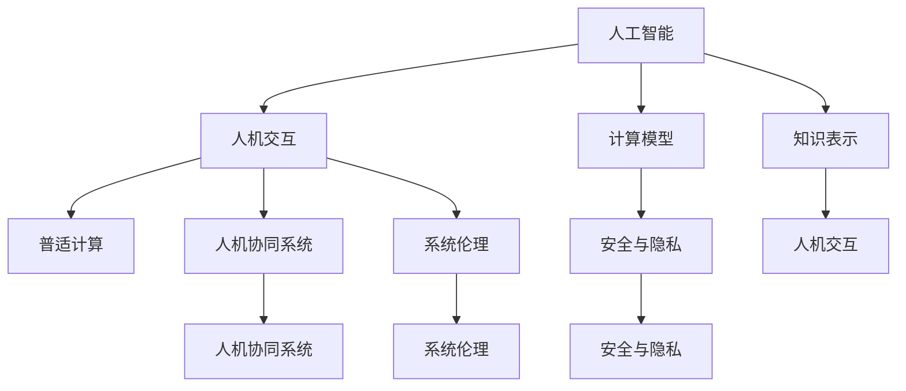

                 

## 1. 背景介绍

### 1.1 问题由来
在现代信息爆炸的时代，计算已经成为人类进步的基石。随着AI技术不断发展和普及，计算的需求不断增加，其应用场景从简单的数据处理延伸至复杂的决策制定、智能推理等高阶任务。人类计算的目标，在于通过计算技术，充分释放人类的潜力，赋能人类的各项活动。本文将探讨这一目标如何通过人工智能、计算机科学等领域的不断创新得以实现。

### 1.2 问题核心关键点
为了实现这一目标，我们需要通过计算技术与人类智能的有机结合，探索以下核心关键点：

- **人机协同**：结合人类智慧和计算能力，以智能机器辅助人类进行决策、推理和创造。
- **知识融合**：融合人类的先验知识和经验，通过计算增强其智能水平。
- **普适应用**：构建普适性计算平台，使其能适用于各种复杂且不断变化的环境。
- **伦理责任**：确保计算技术在伦理、法律和道德方面负责。
- **安全保障**：防范计算中的潜在威胁，保障数据和系统的安全。

这些关键点构成了人类计算的最终目标，即通过计算技术，充分释放人类的潜力，让计算更加人性化、智能化和普适化。

## 2. 核心概念与联系

### 2.1 核心概念概述

要实现人类计算的最终目标，我们需要理解以下核心概念及其之间的联系：

- **人工智能**：通过算法和计算技术模拟人类智能过程，实现各种复杂的智能任务。
- **人机交互**：计算技术与人类之间的交流与互动，提升人机协同效率。
- **计算模型**：用于描述和模拟计算过程的数学模型，指导计算系统的设计。
- **知识表示**：将人类的知识、经验和推理过程转化为机器可处理的形式。
- **普适计算**：一种能够适应各种环境和场景的计算技术。
- **人机协同系统**：结合人类与智能机器的强强联合系统，实现复杂任务。
- **系统伦理**：确保计算技术在开发和应用过程中遵循伦理准则。
- **安全与隐私**：通过技术手段保护计算系统及其数据的安全与隐私。

这些概念相互关联，共同构成了实现人类计算目标的基础。

### 2.2 核心概念原理和架构的 Mermaid 流程图



以上流程图展示了这些核心概念之间的联系。人工智能通过计算模型进行计算，并将知识表示输入系统中；人机交互使得计算结果可以以易于理解的方式反馈给人类用户；普适计算保障系统能够在各种环境和场景下运行；人机协同系统结合了计算技术与人类智慧；系统伦理确保计算技术在伦理、法律和道德方面的合规；安全与隐私保护则确保计算过程中数据和系统的安全。

## 3. 核心算法原理 & 具体操作步骤

### 3.1 算法原理概述
实现人类计算目标的核心算法应包括人机协同、知识表示与融合、普适计算、系统伦理与安全等几个方面。

- **人机协同算法**：结合人类的先验知识和智能推理，与机器学习模型进行协同工作，提高决策和推理的准确性和效率。
- **知识表示与融合算法**：将人类的知识、经验和推理过程转化为机器可处理的形式，并通过计算技术增强其智能水平。
- **普适计算算法**：设计适应不同环境和场景的计算模型，使系统具备自适应能力和泛化能力。
- **系统伦理算法**：在计算模型中融入伦理考量，确保计算技术在开发和应用过程中遵循伦理准则。
- **安全与隐私算法**：采用安全加密、数据脱敏等技术手段，保障计算系统及其数据的安全与隐私。

### 3.2 算法步骤详解
以下是具体步骤：

**Step 1: 设计人机协同系统**
- 确定需要协同解决的任务。
- 选择合适的算法和计算模型。
- 设计人机交互界面。

**Step 2: 知识表示与融合**
- 将人类知识转换为机器可处理的形式。
- 使用知识图谱、逻辑推理等技术进行知识表示。
- 通过计算模型融合知识与计算结果，实现智能增强。

**Step 3: 普适计算**
- 设计适应不同环境和场景的计算模型。
- 实现自适应算法和泛化能力。
- 测试模型的普适性，确保其在各种场景下均能稳定运行。

**Step 4: 系统伦理与安全**
- 在计算模型中融入伦理考量，确保决策公正。
- 采用安全加密、数据脱敏等技术手段，保障数据和系统的安全。
- 定期进行系统审计，确保系统遵循伦理和法律准则。

**Step 5: 部署与测试**
- 将系统部署到实际环境中。
- 测试系统性能，调整参数，优化算法。
- 收集反馈，持续优化系统。

### 3.3 算法优缺点
**优点**：
- 结合人类智慧与计算能力，提高决策的准确性和效率。
- 适应不同环境和场景，具备普适性和泛化能力。
- 遵循伦理和法律准则，确保系统安全与隐私。

**缺点**：
- 算法复杂度高，开发和优化难度大。
- 数据需求大，需要大量标注数据和先验知识。
- 系统部署和维护成本高，需要大量资源支持。

### 3.4 算法应用领域
这些算法广泛应用于以下领域：

- **医疗健康**：通过计算辅助医生诊断和治疗，提高医疗效率。
- **金融**：使用计算技术进行风险评估和投资决策。
- **制造业**：通过智能制造和机器人技术提升生产效率。
- **教育**：通过智能辅助和个性化学习，提升教育质量。
- **农业**：利用计算技术优化农业生产和资源管理。
- **能源**：采用智能电网和可再生能源计算优化能源分配。
- **交通**：通过智能交通管理和规划，提高交通效率。
- **安全**：利用计算技术进行网络安全监测和反恐。
- **公共服务**：通过智能城市和公共管理计算，提高服务质量。

## 4. 数学模型和公式 & 详细讲解 & 举例说明

### 4.1 数学模型构建
假设我们有一个计算模型 $M$，其输入为 $x$，输出为 $y$。则该模型的形式可以表示为 $y = M(x)$。

### 4.2 公式推导过程
以逻辑回归模型为例，其数学表达式为：

$$
y = \sigma(Wx + b)
$$

其中 $\sigma$ 为激活函数，$W$ 为权重矩阵，$b$ 为偏置向量，$x$ 为输入向量。其推导过程如下：

1. 定义损失函数：
$$
L = \frac{1}{N} \sum_{i=1}^N L(y_i, \hat{y}_i)
$$

2. 定义均方误差损失函数：
$$
L(y_i, \hat{y}_i) = \frac{1}{2}(y_i - \hat{y}_i)^2
$$

3. 求导并更新参数：
$$
\frac{\partial L}{\partial W} = \frac{\partial L}{\partial y} \cdot \frac{\partial y}{\partial W} = (y - \hat{y}) \cdot \sigma(Wx + b) \cdot (1 - \sigma(Wx + b)) \cdot x
$$

4. 更新权重矩阵和偏置向量：
$$
W \leftarrow W - \eta \cdot \frac{\partial L}{\partial W}, b \leftarrow b - \eta \cdot \frac{\partial L}{\partial b}
$$

其中 $\eta$ 为学习率。

### 4.3 案例分析与讲解
以医疗健康领域为例，计算模型可以辅助医生进行疾病诊断。通过融合医学知识库，将患者的症状、历史数据等输入模型中，模型将输出患病概率和推荐治疗方案。这一过程可以通过计算模型和人机协同算法实现。

## 5. 项目实践：代码实例和详细解释说明

### 5.1 开发环境搭建
搭建Python 3.8的环境，安装所需的深度学习框架PyTorch和TensorFlow，安装数据处理库NumPy和Pandas，以及数据可视化库Matplotlib和Scikit-Learn。

```bash
pip install torch torchvision torchaudio cudatoolkit=11.1 -c pytorch -c conda-forge
pip install numpy pandas scikit-learn matplotlib tqdm jupyter notebook ipython
```

### 5.2 源代码详细实现
以下是一个基于PyTorch的逻辑回归模型的实现：

```python
import torch
import torch.nn as nn
import torch.optim as optim

# 定义模型
class LogisticRegression(nn.Module):
    def __init__(self, input_dim, output_dim):
        super(LogisticRegression, self).__init__()
        self.linear = nn.Linear(input_dim, output_dim)
    
    def forward(self, x):
        return torch.sigmoid(self.linear(x))
    
# 加载数据集
X = torch.randn(100, 2)
y = torch.randint(0, 2, (100,))
model = LogisticRegression(2, 1)

# 定义损失函数和优化器
loss_fn = nn.BCELoss()
optimizer = optim.SGD(model.parameters(), lr=0.01)

# 训练模型
for epoch in range(100):
    optimizer.zero_grad()
    y_pred = model(X)
    loss = loss_fn(y_pred, y)
    loss.backward()
    optimizer.step()
```

### 5.3 代码解读与分析
该代码实现了基于PyTorch的逻辑回归模型，其步骤如下：

1. 定义模型：通过继承nn.Module，定义一个包含一个线性层的逻辑回归模型。
2. 加载数据集：生成一个包含100个随机数据的输入向量X和标签y。
3. 定义损失函数和优化器：使用交叉熵损失函数和随机梯度下降优化器。
4. 训练模型：迭代100次，在每个epoch中计算损失并更新模型参数。

### 5.4 运行结果展示
运行代码，可以输出训练过程中的损失值变化，从而评估模型的效果。

## 6. 实际应用场景

### 6.1 医疗健康
在医疗健康领域，计算模型可以辅助医生进行疾病诊断和治疗方案推荐。通过融合医学知识库，将患者的症状、历史数据等输入模型中，模型将输出患病概率和推荐治疗方案。这一过程可以通过计算模型和人机协同算法实现。

### 6.2 金融
在金融领域，计算模型可以帮助进行风险评估和投资决策。通过融合历史数据和市场信息，模型可以预测股票市场走势和风险水平，辅助投资者做出明智决策。

### 6.3 制造业
在制造业领域，计算模型可以用于智能制造和机器人控制。通过融合机械原理和传感器数据，模型可以优化生产流程和机器人动作，提高生产效率和安全性。

### 6.4 教育
在教育领域，计算模型可以用于个性化学习和智能辅导。通过融合学习行为数据和知识图谱，模型可以推荐个性化的学习材料和辅导方案，提高教育效果和效率。

## 7. 工具和资源推荐

### 7.1 学习资源推荐
- 《深度学习》系列课程（Coursera）：由Andrew Ng教授主讲，深入讲解深度学习原理和应用。
- 《TensorFlow实战》书籍：介绍TensorFlow的原理和实践，适合入门和进阶学习。
- 《人工智能导论》（Ian Goodfellow）：全面介绍AI的各个方面，包括计算模型、知识表示和系统伦理等。
- PyTorch官方文档：详细说明PyTorch的使用方法和API。
- Weights & Biases：记录和可视化模型训练过程中的各项指标，方便对比和调优。

### 7.2 开发工具推荐
- PyTorch：基于Python的深度学习框架，灵活性强，适合研究性开发。
- TensorFlow：由Google开发的深度学习框架，性能优异，适合大规模工程应用。
- TensorBoard：TensorFlow的可视化工具，实时监测模型训练状态。
- Jupyter Notebook：Python开发环境，支持代码编写、数据处理和可视化。

### 7.3 相关论文推荐
- 《Deep Learning》（Goodfellow等）：深度学习的经典教材，涵盖理论基础和实践技巧。
- 《Neural Computation》期刊：发表高质量AI领域的最新研究成果。
- 《Arxiv》预印本平台：获取最新和最前沿的AI研究成果。

## 8. 总结：未来发展趋势与挑战

### 8.1 总结
本文对实现人类计算的最终目标涉及的核心算法进行了详细探讨。通过结合人工智能、计算机科学等领域的不断创新，可以充分释放人类的潜力，赋能各项活动。

### 8.2 未来发展趋势
未来，计算技术将持续发展，推动人类计算的不断进步。

1. **深度学习**：深度学习技术的不断进步，将使计算模型更加智能，具备更加复杂和强大的推理能力。
2. **普适计算**：普适计算技术的发展，将使计算系统更加适应各种环境和场景，具备更高的可扩展性和可维护性。
3. **人机协同**：人机协同技术的进步，将使计算与人类智慧更加紧密结合，提高决策和推理的准确性和效率。
4. **系统伦理**：系统伦理的研究，将使计算技术在开发和应用过程中更加公正和透明。
5. **安全与隐私**：安全与隐私技术的发展，将使计算系统更加安全可靠，保障数据和系统的安全与隐私。

### 8.3 面临的挑战
尽管计算技术在不断进步，但在实现人类计算的最终目标的过程中，仍然面临诸多挑战。

1. **数据需求**：计算模型需要大量的标注数据和先验知识，数据获取和处理成本高昂。
2. **算法复杂性**：计算模型的算法复杂度高，开发和优化难度大。
3. **计算资源**：计算模型需要大量的计算资源，硬件成本高昂。
4. **伦理和法律**：计算技术在开发和应用过程中需要遵循伦理和法律准则，确保公平和透明。
5. **安全与隐私**：计算系统需要保障数据和系统的安全与隐私，防止潜在威胁。

### 8.4 研究展望
未来，计算技术需要结合多领域的知识和研究，才能实现人类计算的最终目标。

1. **跨领域融合**：计算技术需要与心理学、社会学等学科进行跨领域融合，更好地理解人类需求和行为。
2. **智能增强**：计算技术需要结合人类智慧，通过智能增强的方式，提高决策和推理的准确性和效率。
3. **普适性和泛化能力**：计算系统需要具备普适性和泛化能力，适应各种环境和场景。
4. **伦理和安全**：计算技术需要遵循伦理和法律准则，保障数据和系统的安全与隐私。

## 9. 附录：常见问题与解答

### Q1: 人类计算的最终目标是什么？
**A:** 通过计算技术充分释放人类的潜力，赋能人类的各项活动，使计算更加人性化、智能化和普适化。

### Q2: 实现人类计算的最终目标需要哪些核心算法？
**A:** 人机协同、知识表示与融合、普适计算、系统伦理与安全等算法。

### Q3: 当前实现人类计算的最终目标面临哪些挑战？
**A:** 数据需求高、算法复杂度高、计算资源需求大、伦理和安全问题等。

### Q4: 未来计算技术的发展方向是什么？
**A:** 深度学习、普适计算、人机协同、系统伦理和安全等方面的进步。

---

作者：禅与计算机程序设计艺术 / Zen and the Art of Computer Programming

