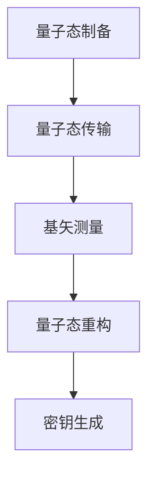

                 

# 量子密钥分发：未来的安全通信技术

> 关键词：量子密钥分发, 量子加密, 光子计数器, 光子线性组合, 非线性晶体, 光纤通信, 安全通信技术, 量子计算, 无条件安全性

## 1. 背景介绍

### 1.1 问题由来
在信息时代，数据安全日益成为人们关注的焦点。传统加密技术如对称加密、非对称加密等在应对量子计算威胁方面存在明显的不足。量子密钥分发(Quantum Key Distribution, QKD)作为一项基于量子力学原理的安全通信技术，能够在理论上保证通信的绝对安全性，引起了学术界和产业界的广泛关注。

### 1.2 问题核心关键点
量子密钥分发技术通过量子力学的不确定性和测不准原理，提供了一种无条件安全的通信方式。其主要流程包括量子态制备、量子态传输、基矢测量、密钥生成等步骤。具体来说，用户通过量子通道（如光纤）发送光子态，接收端通过基矢测量（如贝尔态测量）得到光子数，从而生成可应用于传统加密算法（如AES）的密钥。

量子密钥分发技术的核心在于其理论上的无条件安全性，即任何窃听行为都会导致通信双方检测到异常，从而终止通信，因此被视为未来安全通信的潜力所在。然而，目前的QKD技术还面临着诸如设备成本高、传输距离短、安全性依赖理想物理模型等挑战，有待进一步研究和优化。

## 2. 核心概念与联系

### 2.1 核心概念概述

量子密钥分发技术包含多个关键概念，包括：

- 量子态：光子等量子系统的状态，用于承载信息。
- 量子通道：如光纤，用于传输量子态。
- 基矢测量：如贝尔态测量，用于测量光子态。
- 量子态重构：通过多轮通信，重建量子态。
- 密钥生成：通过多次通信，生成密钥。

这些概念通过量子力学的不确定性和测不准原理，形成了一个完整的安全通信系统，其核心思想是利用量子力学的基本原理，实现通信双方的无条件安全。

### 2.2 核心概念原理和架构的 Mermaid 流程图



以上流程图示意图展示了量子密钥分发的主要步骤：

1. 用户1和用户2分别在本地制备量子态，并通过量子通道进行传输。
2. 接收方对接收到的量子态进行基矢测量，得到光子数。
3. 双方进行量子态重构，得到用于通信的密钥。

## 3. 核心算法原理 & 具体操作步骤

### 3.1 算法原理概述

量子密钥分发算法的基本原理是利用量子力学的不确定性和测不准原理，使得任何窃听行为都会被通信双方发现，从而保证通信的绝对安全性。其主要算法包括BB84协议和E91协议。

BB84协议的基本流程如下：

1. 用户1和用户2各自随机选择基矢（如水平方向和垂直方向），并使用这些基矢制备光子态。
2. 用户1将光子态通过量子通道传输给用户2。
3. 用户2对接收到的光子态进行基矢测量，得到光子数。
4. 双方公开基矢选择，仅在相同基矢测量的结果上进行密钥生成。
5. 通过多次通信，生成最终的密钥。

E91协议则基于Bell不等式，利用测量光子的极化方向和动量信息，检测窃听行为。其基本流程如下：

1. 用户1和用户2各自随机选择基矢，并使用这些基矢制备光子态。
2. 用户1将光子态通过量子通道传输给用户2。
3. 用户2对接收到的光子态进行基矢测量，得到光子数。
4. 双方公开基矢选择，利用Bell不等式检测窃听行为。
5. 通过多次通信，生成最终的密钥。

### 3.2 算法步骤详解

下面以BB84协议为例，详细讲解其具体步骤：

1. 用户1和用户2随机选择基矢（如水平方向和垂直方向），并使用这些基矢制备光子态。
2. 用户1将光子态通过量子通道（如光纤）传输给用户2。
3. 用户2对接收到的光子态进行基矢测量，得到光子数。
4. 双方公开基矢选择，仅在相同基矢测量的结果上进行密钥生成。
5. 通过多次通信，生成最终的密钥。

### 3.3 算法优缺点

量子密钥分发技术的主要优点包括：

- 理论上具有无条件安全性：任何窃听行为都会被通信双方发现，从而保证通信的绝对安全性。
- 适用于多种物理平台：如光纤、自由空间传输等。
- 可应用于实际通信系统：如城市内光纤通信、卫星传输等。

然而，该技术也存在一些局限性：

- 设备成本高：量子态制备和测量设备复杂，价格昂贵。
- 传输距离短：目前的QKD设备只能支持几百公里的传输距离，远距离传输需要中继器。
- 安全性依赖理想物理模型：实际物理模型中可能存在误差和损耗，影响安全性。
- 量子态制备和测量的精度要求高：误差可能导致信息泄露。

### 3.4 算法应用领域

量子密钥分发技术主要应用于以下领域：

- 金融安全：保障银行业务和交易的安全。
- 军事通信：保证军事通信的保密性。
- 政府数据保护：保护政府机密和公民隐私。
- 工业控制：保障工业控制系统的网络安全。
- 卫星通信：在卫星通信中实现安全数据传输。
- 云安全：在云服务中保护数据和通信的安全。

## 4. 数学模型和公式 & 详细讲解 & 举例说明

### 4.1 数学模型构建

量子密钥分发模型的核心是量子态的制备、传输和测量。我们以BB84协议为例，构建其数学模型。

假设有两个用户A和B，A在本地制备光子态，并通过光纤传输给B。A和B分别随机选择基矢（如水平方向和垂直方向），并使用这些基矢进行测量。假设光子态为$|\psi\rangle=\alpha|0\rangle+\beta|1\rangle$，基矢为$|0\rangle$和$|1\rangle$。

### 4.2 公式推导过程

对于BB84协议，假设有$N$次通信，双方在每次通信中随机选择基矢，并测量光子数。设$X_i$为A和B在i次通信中随机选择的基矢，$Y_i$为B测量的光子数。则：

$$
X_i, Y_i \sim \{0,1\}
$$

A和B在相同基矢测量的结果的概率为：

$$
P_{i=0}=|a|^2
$$
$$
P_{i=1}=|b|^2
$$

设$K$为最终生成的密钥，则：

$$
K = \sum_{i=1}^N \delta(X_i=Y_i)X_i
$$

其中$\delta$为克罗内克函数，当$X_i=Y_i$时，$\delta(X_i=Y_i)=1$，否则$\delta(X_i=Y_i)=0$。

### 4.3 案例分析与讲解

以BB84协议为例，我们通过具体案例说明其工作原理和安全性。

假设有两个用户A和B，A准备了一个光子态$|\psi\rangle=\alpha|0\rangle+\beta|1\rangle$，并随机选择了基矢$|0\rangle$，测量得到光子数为1，即测量结果为$|1\rangle$。B随机选择了基矢$|1\rangle$，测量得到光子数为0，即测量结果为$|0\rangle$。

A和B公开基矢选择，发现基矢选择不同，因此不生成任何密钥。如果B尝试窃听，则A和B会检测到异常，从而终止通信，保护了通信的安全性。

## 5. 项目实践：代码实例和详细解释说明

### 5.1 开发环境搭建

要进行量子密钥分发的实验，需要搭建一个包含光子源、光纤传输、光子计数器等硬件设备的环境，并通过软件进行控制和测量。以下是一个简单的光子计数器实验环境搭建步骤：

1. 购买或搭建光子计数器、光纤、光学元器件等硬件设备。
2. 安装和配置光子计数器软件和硬件驱动。
3. 编写Python程序，使用软件控制光子计数器进行测量。

### 5.2 源代码详细实现

以下是一个简单的Python程序，使用光子计数器进行BB84协议实验：

```python
import numpy as np
import pyvisium

# 定义光子计数器
counter = pyvisium.Counter()

# 定义光子源和基矢
sources = ['horizontal', 'vertical']
bases = ['horizontal', 'vertical']

# 定义光子态
alpha = 0.5
beta = np.sqrt(1 - alpha**2)
psi = alpha * np.array([1, 0]) + beta * np.array([0, 1])

# 进行多次通信
key = ''
for i in range(N):
    # 随机选择基矢
    X = np.random.choice(sources)
    Y = np.random.choice(bases)
    
    # 制备光子态
    psi_i = alpha * np.array([1, 0]) + beta * np.array([0, 1])
    
    # 传输光子态
    counter.prepare_state(psi_i)
    counter.send_state(psi_i)
    
    # 基矢测量
    Y_i = counter.measure_state(Y)
    
    # 密钥生成
    if X == Y:
        key += str(Y_i)
    
# 输出密钥
print(key)
```

### 5.3 代码解读与分析

以上代码通过Python实现了BB84协议的基本流程，具体解读如下：

- 首先定义光子计数器，并准备光子源和基矢。
- 定义光子态，并随机选择基矢进行测量。
- 将光子态传输到接收端，并进行基矢测量。
- 根据基矢选择，生成密钥。
- 输出最终的密钥。

## 6. 实际应用场景

### 6.1 金融安全

量子密钥分发技术在金融领域具有重要的应用价值。金融机构可以使用QKD技术保障银行业务和交易的安全，避免敏感信息被窃取或篡改。例如，银行可以使用QKD技术进行客户交易加密，保护账户余额和交易记录。

### 6.2 军事通信

军事通信对安全性的要求极高，量子密钥分发技术可以用于保障军事通信的保密性。军事指挥系统可以使用QKD技术进行通信加密，避免被敌方窃听和破解。

### 6.3 政府数据保护

政府数据保护是政府信息安全的重要任务。量子密钥分发技术可以用于保护政府机密和公民隐私，防止数据被非法获取和滥用。例如，政府可以使用QKD技术进行数据加密存储，保护关键数据的安全。

### 6.4 工业控制

工业控制系统的网络安全至关重要，量子密钥分发技术可以用于保障工业控制系统的网络安全。例如，智能电网可以使用QKD技术进行数据加密传输，避免被黑客攻击和控制。

### 6.5 卫星通信

卫星通信对传输距离和带宽的要求极高，量子密钥分发技术可以用于保障卫星通信的安全性。例如，卫星通信网络可以使用QKD技术进行数据加密，保护通信内容的安全。

### 6.6 云安全

云服务的安全性是云计算发展的关键问题。量子密钥分发技术可以用于保护云服务的数据和通信安全。例如，云服务提供商可以使用QKD技术进行数据加密传输，防止数据被非法访问和篡改。

## 7. 工具和资源推荐

### 7.1 学习资源推荐

为了深入理解量子密钥分发技术，可以参考以下学习资源：

- 《量子信息科学》：介绍量子力学基本原理和量子通信技术。
- 《量子密钥分发：原理与技术》：详细讲解量子密钥分发的原理和实现方法。
- 《量子密码学》：介绍量子密钥分发的理论基础和实际应用。
- 《量子通信技术与应用》：讲解量子通信的原理和最新进展。

### 7.2 开发工具推荐

进行量子密钥分发实验，需要使用到光子计数器等硬件设备，以及光子计数器软件和硬件驱动。以下是一些推荐的工具：

- 光子计数器软件：如pyvisium
- 光子计数器硬件驱动：如Quantum-Philips
- 光子源和基矢设备：如OPO源、干涉仪等

### 7.3 相关论文推荐

以下是几篇重要的量子密钥分发相关论文，推荐阅读：

- "Quantum Key Distribution: Principles and Procedures" by H.-K. Lo, M. Curty, and B. Lucier
- "Security of Practical Quantum Key Distribution" by H.-K. Lo, X. Ma, and K. Chen
- "Quantum Key Distribution with Entangled Photons" by H.-K. Lo, M. Curty, and B. Lucier

## 8. 总结：未来发展趋势与挑战

### 8.1 研究成果总结

量子密钥分发技术作为一种基于量子力学的安全通信技术，已经在理论上得到了广泛认可。其主要研究成果包括：

- 理论上具有无条件安全性
- 适用于多种物理平台
- 应用于金融、军事、政府等领域

### 8.2 未来发展趋势

未来，量子密钥分发技术的发展趋势包括：

- 设备成本降低：随着技术的进步和规模化生产，光子计数器等硬件设备的成本将逐步降低，QKD技术的可扩展性将增强。
- 传输距离增加：随着量子通信技术的进步，中继器等设备将使得QKD技术的传输距离不断增加。
- 安全性改进：研究人员将进一步研究量子密钥分发的安全性，探索新的安全协议和实现方法。

### 8.3 面临的挑战

量子密钥分发技术在实际应用中仍然面临一些挑战：

- 设备成本高：光子计数器等硬件设备的成本较高，限制了QKD技术的普及。
- 传输距离短：目前的QKD设备只能支持几百公里的传输距离，远距离传输需要中继器。
- 安全性依赖理想物理模型：实际物理模型中可能存在误差和损耗，影响安全性。
- 量子态制备和测量的精度要求高：误差可能导致信息泄露。

### 8.4 研究展望

未来的研究方向包括：

- 研究新型量子态制备和测量技术，提高精度和可靠性。
- 探索量子密钥分发与经典加密算法结合的新方法，提高通信效率。
- 研究量子网络协议，实现大规模量子通信网络。
- 探索量子密钥分发与其他新兴技术（如区块链、量子计算）的结合，提升应用价值。

## 9. 附录：常见问题与解答

**Q1：量子密钥分发和传统加密技术有什么区别？**

A: 量子密钥分发技术基于量子力学原理，具有无条件安全性，任何窃听行为都会被通信双方发现，从而终止通信。而传统加密技术如对称加密、非对称加密等存在固有的漏洞，可能被量子计算破解。

**Q2：量子密钥分发技术的安全性如何保证？**

A: 量子密钥分发技术的安全性基于量子力学的基本原理，如测不准原理和贝尔不等式。任何窃听行为都会导致通信双方检测到异常，从而终止通信，保证了通信的绝对安全性。

**Q3：量子密钥分发技术目前的应用场景有哪些？**

A: 量子密钥分发技术目前主要应用于金融、军事、政府等领域，保护敏感信息的安全。例如，银行可以使用QKD技术进行客户交易加密，保护账户余额和交易记录。

**Q4：量子密钥分发技术的未来发展方向有哪些？**

A: 未来，量子密钥分发技术的发展方向包括设备成本降低、传输距离增加、安全性改进等。同时，量子密钥分发技术还可以与其他新兴技术结合，如区块链、量子计算，提升应用价值。

**Q5：量子密钥分发技术的主要优势是什么？**

A: 量子密钥分发技术的主要优势包括理论上具有无条件安全性、适用于多种物理平台、可应用于实际通信系统等。

总之，量子密钥分发技术是未来安全通信的重要技术之一，具有广泛的应用前景。随着技术的不断进步和完善，量子密钥分发技术将会在更多领域得到应用，为信息安全提供新的保障。

