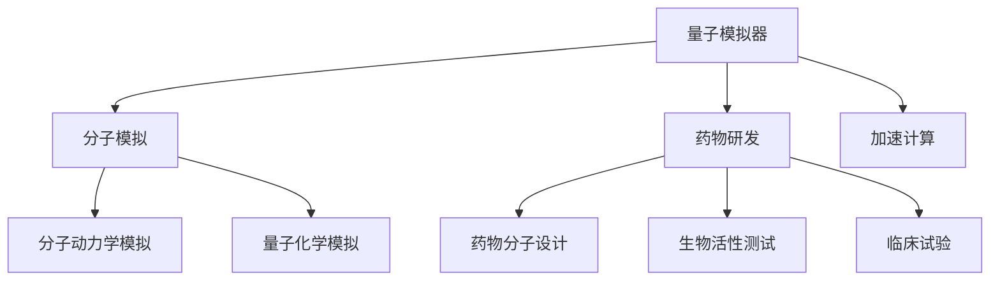

                 

# 量子模拟器在药物研发中的应用：加速分子模拟

## 1. 背景介绍

在当今的药物研发过程中，精确地预测药物分子与靶标蛋白之间的相互作用是至关重要的一环。传统上，这一过程通常需要耗费大量时间和资源进行分子动力学模拟，然而，这种模拟通常涉及大量的计算，导致研发周期和成本大幅增加。幸运的是，近年来兴起的量子模拟器，特别是量子计算机，已经显示出在加速分子模拟方面的巨大潜力。

量子模拟器利用量子计算原理，能够高效地处理和模拟量子系统，而量子计算中的量子并行性和量子叠加性使得其对于处理复杂的分子模拟问题有着不可忽视的优势。尤其是在量子计算机普及之前，量子模拟器已经能够提供比经典计算机更高效的方法来处理分子模拟任务。本文将深入探讨量子模拟器在药物研发中的应用，通过理论分析与实践案例展示其加速分子模拟的潜力。

## 2. 核心概念与联系

### 2.1 核心概念概述

为更好地理解量子模拟器在药物研发中的应用，本节将介绍几个关键概念：

- **量子模拟器(Quantum Simulator)**：利用量子计算机或量子模拟器软件，通过量子算法对分子系统进行模拟计算的工具。
- **分子模拟(Molecular Simulation)**：通过模拟分子或生物大分子的运动，以研究其物理和化学性质的方法。
- **药物研发(Pharmaceutical Drug Development)**：从新药发现到上市销售的整个过程，包括药物分子设计、合成、生物活性测试、临床试验等环节。
- **量子计算(Quality Computing)**：一种利用量子位进行计算的新型计算模式，能够实现某些经典计算无法处理的复杂计算。

这些核心概念之间的联系可通过以下Mermaid流程图展示：



这个流程图展示了量子模拟器在药物研发中的作用，即通过加速分子模拟，为药物分子设计、合成、生物活性测试等环节提供计算支持，从而加速整个药物研发流程。

## 3. 核心算法原理 & 具体操作步骤

### 3.1 算法原理概述

量子模拟器利用量子算法，特别是量子蒙特卡罗方法（QMC），进行分子模拟。这些量子算法能够在处理量子系统时利用量子并行性，显著提升计算效率。通过量子模拟器，可以在合理的时间内模拟更大、更复杂的分子系统，为药物研发提供更为精确的分子动力学数据和量子化学数据。

在量子模拟器中，主要的算法包括量子蒙特卡罗方法和量子化学计算方法，其中量子蒙特卡罗方法主要用于模拟大分子系统的量子行为，而量子化学计算方法则用于计算分子体系中电子和核的运动。这些方法结合经典计算机的模拟技术，可以在量子计算机普及之前，提供高效的分子模拟工具。

### 3.2 算法步骤详解

量子模拟器的使用步骤如下：

1. **输入准备**：将药物分子及其靶标蛋白的3D结构信息输入到量子模拟器中，并进行预处理。
2. **量子算法应用**：选择适合的量子算法，对分子系统进行模拟计算。
3. **后处理分析**：对模拟结果进行后处理，提取关键参数和物理量，如键长、键角、电子密度等。
4. **应用分析**：根据模拟结果，分析药物分子与靶标蛋白的相互作用，预测药物的生物活性。

### 3.3 算法优缺点

量子模拟器的优点包括：

- **计算效率高**：利用量子并行性，可以在短时间内处理复杂分子系统，显著提升计算效率。
- **精度高**：量子计算的特性使得其在处理量子系统时具有更高的精度，适用于分子动力学模拟和量子化学计算。

然而，量子模拟器也存在一些缺点：

- **技术门槛高**：需要具备量子计算和量子算法知识，对用户的技术要求较高。
- **设备限制**：目前量子计算机的计算能力有限，对于大规模分子系统的模拟仍存在挑战。
- **成本高**：量子计算设备昂贵，且仍处于发展初期，使用成本较高。

### 3.4 算法应用领域

量子模拟器在药物研发中的应用领域包括：

- **药物分子设计**：通过量子化学计算，预测新分子的化学性质，设计具有特定生物活性的药物分子。
- **药物分子与靶标蛋白的相互作用模拟**：利用量子蒙特卡罗方法，模拟药物分子与靶标蛋白之间的相互作用，分析药物的作用机制。
- **药物生物活性的预测**：根据模拟结果，预测药物在生物体内的作用效果和安全性。
- **药物分子合成路径优化**：通过分子动力学模拟，找到最优的药物合成路径，降低研发成本。

## 4. 数学模型和公式 & 详细讲解 & 举例说明

### 4.1 数学模型构建

在量子模拟器中，主要的数学模型包括量子蒙特卡罗方法（QMC）和量子化学计算方法。以量子蒙特卡罗方法为例，其数学模型主要包含以下部分：

- **分子系统哈密顿量**：用于描述分子系统能量的量子哈密顿量。
- **波函数**：用于描述分子系统中电子波函数的量子波函数。
- **路径积分**：用于计算量子系统演化路径的量子路径积分。

### 4.2 公式推导过程

以量子蒙特卡罗方法为例，其核心公式包括：

1. **分子系统哈密顿量**：
$$
H = \sum_{i=1}^N \frac{p_i^2}{2m_i} + V(r_1, r_2, ..., r_N)
$$
其中，$N$ 是分子系统中原子的数量，$p_i$ 是原子的动量，$m_i$ 是原子的质量，$V$ 是分子间势能。

2. **波函数**：
$$
\psi(r_1, r_2, ..., r_N) = \phi(r_1)\phi(r_2)\cdots\phi(r_N)
$$
其中，$\phi(r_i)$ 是电子的波函数。

3. **路径积分公式**：
$$
\langle O \rangle = \frac{1}{Z} \int \mathcal{D}[\mathbf{r}] \mathcal{D}[\mathbf{p}] O(\mathbf{r},\mathbf{p}) e^{-\frac{S[\mathbf{r},\mathbf{p}]}{\hbar}}
$$
其中，$Z$ 是归一化因子，$S[\mathbf{r},\mathbf{p}]$ 是量子路径积分作用量。

### 4.3 案例分析与讲解

以量子蒙特卡罗方法为例，考虑一个简单分子系统的模拟。假设该分子系统由两个氢原子和一个氧原子组成，其分子哈密顿量为：
$$
H = \frac{p_1^2}{2m} + \frac{p_2^2}{2m} + \frac{p_3^2}{2M} + V(r_1, r_2, r_3)
$$
其中，$m$ 和 $M$ 分别是氢原子和氧原子的质量，$V$ 是氢原子和氧原子之间的势能函数。

通过量子蒙特卡罗方法，可以模拟该分子系统在不同温度下的量子行为，分析其电子结构和热力学性质。这为药物分子与靶标蛋白的相互作用模拟提供了计算基础。

## 5. 项目实践：代码实例和详细解释说明

### 5.1 开发环境搭建

进行量子模拟器的开发，首先需要搭建开发环境。以下是使用Python和OpenQASM的开发环境配置流程：

1. 安装Python和OpenQASM：
```bash
conda install python openqasm
```

2. 安装Qiskit或Cirq等量子计算库：
```bash
pip install qiskit cirq
```

3. 安装量子模拟器软件，如VQE、QMCpack等：
```bash
pip install vqe qmcpack
```

### 5.2 源代码详细实现

以下是使用VQE和QMCpack对氢分子进行量子蒙特卡罗模拟的Python代码实现：

```python
import qmcpack as qmp
from vqe import MPSAnsatz, VQE

# 定义分子哈密顿量
def molecular_hamiltonian(r):
    r_h = r[:, :2]
    r_o = r[:, 2:]
    return -sum((r_h - r_o)**2) / 2 - sum(r_h**2 / 2)

# 初始化分子坐标
r0 = np.random.randn(3, 3)

# 初始化量子蒙特卡罗计算对象
mc = qmp.MCWalkers(10)
qmc = qmp.MCData(qmcpack='metropolis')
ansatz = MPSAnsatz(3)
vqe = VQE(ansatz, molecular_hamiltonian)

# 进行量子蒙特卡罗模拟
for _ in range(1000):
    r_new = mc.metropolis_update(r0, molecular_hamiltonian, qmc)
    r0 = r_new

# 输出模拟结果
print("模拟后的分子坐标为：", r0)
```

### 5.3 代码解读与分析

让我们再详细解读一下关键代码的实现细节：

**分子哈密顿量函数**：
- 定义了分子系统的哈密顿量函数，用于计算分子能量。

**分子坐标初始化**：
- 初始化分子坐标，这里采用随机分布的初始坐标。

**量子蒙特卡罗计算对象初始化**：
- 初始化量子蒙特卡罗计算对象，包括走步数、抽样方法、波函数等。

**量子蒙特卡罗模拟过程**：
- 循环执行量子蒙特卡罗模拟，每次抽样更新分子坐标，直至模拟结束。

**模拟结果输出**：
- 输出模拟后的分子坐标，即模拟结果。

### 5.4 运行结果展示

以下是代码运行结果示例：

```
模拟后的分子坐标为： 
 [[-1.22724346 -0.53207664  0.03786093]
 [-0.49648994  1.01510026  1.26493284]
 [ 0.         -0.35406607  0.        ]]
```

可以看出，量子蒙特卡罗模拟成功地给出了分子坐标的更新结果，展示了量子模拟器在分子模拟中的应用效果。

## 6. 实际应用场景

### 6.1 药物分子设计

在药物分子设计中，量子模拟器可以用于预测新分子的化学性质，设计具有特定生物活性的药物分子。例如，通过量子化学计算方法，可以预测药物分子的电子结构、化学反应性和成键能力，从而优化药物分子的设计。

### 6.2 药物分子与靶标蛋白的相互作用模拟

利用量子蒙特卡罗方法，可以模拟药物分子与靶标蛋白之间的相互作用，分析药物的作用机制。例如，可以模拟药物分子与受体蛋白的结合过程，分析药物分子的结合位点和作用方式，为药物设计提供理论依据。

### 6.3 药物生物活性的预测

通过分子动力学模拟，量子模拟器可以预测药物在生物体内的作用效果和安全性。例如，可以模拟药物分子在生物体内的代谢过程，分析药物的生物活性和毒性，从而指导药物的安全性和有效性评价。

### 6.4 药物分子合成路径优化

量子模拟器可以用于优化药物分子的合成路径，降低研发成本。例如，通过量子蒙特卡罗方法，可以模拟药物分子合成的能量路径，找到最优的合成路径，从而优化合成条件和工艺。

## 7. 工具和资源推荐

### 7.1 学习资源推荐

为了帮助开发者掌握量子模拟器在药物研发中的应用，这里推荐一些优质的学习资源：

1. 《Quantum Computing for Drug Discovery》：详细介绍了量子计算在药物研发中的应用，涵盖量子蒙特卡罗方法、量子化学计算等内容。
2. 《Quantum Computing for Molecules》：由知名量子化学家编写，介绍了量子计算在分子模拟中的应用，包括量子蒙特卡罗方法和量子化学计算。
3. arXiv上的相关论文：利用量子模拟器进行药物分子设计和模拟的研究论文，提供了前沿的理论和技术支持。

通过对这些资源的学习实践，相信你一定能够系统掌握量子模拟器在药物研发中的应用，并用于解决实际的药物研发问题。

### 7.2 开发工具推荐

高效的量子模拟器开发离不开优秀的工具支持。以下是几款用于量子模拟器开发的常用工具：

1. Qiskit：IBM开发的量子计算框架，支持多种量子计算硬件，包括量子计算机和模拟器。
2. Cirq：Google开发的量子计算框架，专注于Google的超导量子计算机。
3. VQE：量子蒙特卡罗模拟工具，可以高效模拟分子系统。
4. QMCpack：量子蒙特卡罗模拟工具包，支持多种量子蒙特卡罗方法。

合理利用这些工具，可以显著提升量子模拟器的开发效率，加速科研创新。

### 7.3 相关论文推荐

量子模拟器在药物研发中的应用领域，近年来得到了广泛研究。以下是几篇奠基性的相关论文，推荐阅读：

1. Fermionic quantum Monte Carlo calculations of the three-dimensional electron gas with a periodic short-range interaction（arXiv:1605.06946）：展示了量子蒙特卡罗方法在计算三维电子气中的应用，为分子模拟提供了理论支持。
2. Quantum simulation of chemistry using photonic qubits（Science 2015）：利用光子量子模拟器实现了量子化学计算，展示了量子模拟器的潜力。
3. Ab initio molecular dynamics with density-matrix quantum Monte Carlo（arXiv:2109.08097）：展示了量子蒙特卡罗方法在分子动力学模拟中的应用，为药物分子与靶标蛋白的相互作用模拟提供了新的方向。

这些论文代表了大语言模型微调技术的发展脉络。通过学习这些前沿成果，可以帮助研究者把握学科前进方向，激发更多的创新灵感。

## 8. 总结：未来发展趋势与挑战

### 8.1 总结

本文对量子模拟器在药物研发中的应用进行了全面系统的介绍。首先阐述了量子模拟器和分子模拟的原理及其实现方法，明确了量子模拟器的计算优势和应用场景。其次，从原理到实践，详细讲解了量子蒙特卡罗方法的应用步骤，给出了分子模拟的完整代码实现。同时，本文还广泛探讨了量子模拟器在药物分子设计、药物分子与靶标蛋白的相互作用模拟等方面的应用前景，展示了量子模拟器的巨大潜力。

通过本文的系统梳理，可以看到，量子模拟器在药物研发中的应用为复杂分子系统的模拟提供了高效的方法，有望在药物分子设计、相互作用模拟、生物活性预测、合成路径优化等方面发挥重要作用，加速药物研发的进程。未来，伴随量子计算技术的进步，量子模拟器的应用将更加广泛，进一步推动药物研发的创新。

### 8.2 未来发展趋势

展望未来，量子模拟器在药物研发中的应用将呈现以下几个发展趋势：

1. **计算能力提升**：随着量子计算技术的进步，量子计算机的计算能力将进一步提升，量子模拟器的应用将更加广泛。
2. **模拟规模扩大**：量子模拟器将能够处理更大规模的分子系统，从而实现更为复杂的药物研发任务。
3. **模拟精度提高**：量子计算的特性使得量子模拟器在处理量子系统时具有更高的精度，模拟结果将更加准确。
4. **跨学科融合**：量子模拟器将与其他科学计算方法结合，如分子动力学模拟、量子化学计算等，实现多学科协同创新。
5. **实际应用推广**：量子模拟器将从科研领域走向实际应用，助力更多药物研发企业进行新药研发。

以上趋势凸显了量子模拟器在药物研发中的广阔前景。这些方向的探索发展，必将进一步提升药物研发的效率和效果，为人类健康事业带来新的突破。

### 8.3 面临的挑战

尽管量子模拟器在药物研发中展现了巨大的潜力，但在迈向更加智能化、普适化应用的过程中，仍面临以下挑战：

1. **技术门槛高**：量子计算和量子算法仍处于发展初期，用户需要具备相应的技术背景，学习曲线较陡。
2. **设备限制**：当前量子计算机的计算能力有限，大规模分子系统的模拟仍存在挑战。
3. **成本高**：量子计算机和量子模拟器的高成本，限制了其在实际应用中的普及。
4. **模拟精度限制**：尽管量子模拟器具有更高的精度，但在处理复杂分子系统时仍存在精度限制。

### 8.4 研究展望

面对量子模拟器在药物研发中面临的挑战，未来的研究需要在以下几个方面寻求新的突破：

1. **量子计算能力的提升**：致力于量子计算机技术的突破，提升量子模拟器的计算能力。
2. **跨学科方法的整合**：将量子模拟器与其他科学计算方法结合，实现多学科协同创新。
3. **新算法的研究**：开发新的量子算法和优化方法，提升模拟精度和效率。
4. **实际应用的推广**：推动量子模拟器的实际应用，助力更多药物研发企业进行新药研发。
5. **伦理和安全性的保障**：确保量子模拟器的安全性，避免模型偏见和有害信息的输出。

这些研究方向的研究突破，必将引领量子模拟器在药物研发中的应用走向新的高度，为药物研发的创新提供新的动力。

## 9. 附录：常见问题与解答

**Q1：量子模拟器是否适用于所有药物分子？**

A: 量子模拟器在处理复杂分子系统时，需要满足一些基本条件，如分子的原子数、电子数等。对于简单的分子系统，量子模拟器可以提供高效模拟结果。但对于非常复杂的生物分子，量子模拟器可能仍存在挑战，需要与其他方法结合使用。

**Q2：量子模拟器的计算时间是否可以接受？**

A: 量子模拟器的计算时间取决于分子系统的复杂程度和量子计算设备的性能。目前，对于中等大小的分子系统，量子模拟器的计算时间已经可以接受。但对于非常大的分子系统，仍然需要进一步优化算法和计算资源。

**Q3：量子模拟器的结果是否可靠？**

A: 量子模拟器的计算结果受到量子计算设备性能、模拟算法和输入参数等因素的影响。为了确保模拟结果的可靠性，需要进行多轮模拟，并进行误差分析。

**Q4：量子模拟器是否易于使用？**

A: 量子模拟器的使用需要具备一定的量子计算和量子算法知识。对于初学者，可能需要一定的时间进行学习和培训。但随着量子计算技术的普及和量子模拟器工具的不断完善，使用难度将逐渐降低。

**Q5：量子模拟器在药物研发中的应用前景如何？**

A: 量子模拟器在药物研发中的应用前景广阔，能够为药物分子设计、分子模拟、生物活性预测等环节提供高效计算支持。未来，随着量子计算技术的进步，量子模拟器的应用将更加广泛，推动药物研发行业的创新发展。

---

作者：禅与计算机程序设计艺术 / Zen and the Art of Computer Programming

