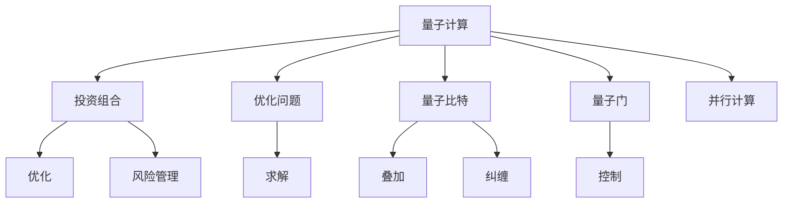

                 

## 1. 背景介绍

### 1.1 问题由来
金融建模是金融工程学和定量金融学的核心组成部分，旨在通过数学模型量化分析金融市场中的风险和收益。在传统的金融建模中，由于数据量的庞大和复杂性，通常依赖于计算机进行模拟和优化。然而，随着金融市场的快速发展和复杂度的增加，传统计算方法已经难以满足需求。

量子计算作为一种新型的计算方式，凭借其独特的计算能力和并行性，具有在金融建模中提供更高效、更精确计算的潜力。本文将探讨量子计算在金融建模中的应用，重点关注如何利用量子计算优化投资组合。

### 1.2 问题核心关键点
量子计算在金融建模中的应用，主要体现在以下几个方面：
1. **并行计算能力**：量子计算通过量子比特的量子叠加和量子纠缠，可以同时处理大量数据，显著提高计算效率。
2. **优化问题解决**：量子计算可以高效解决复杂的优化问题，如投资组合优化、风险管理等。
3. **数据处理能力**：量子计算能够处理大规模非结构化数据，从海量金融数据中提取有价值的信息。
4. **概率和不确定性分析**：量子计算可以更准确地处理概率和不确定性，提高模型的鲁棒性和精度。

量子计算在金融建模中的应用，能够解决传统计算方法无法处理的复杂问题，提高金融建模的准确性和效率，进而优化投资组合。

## 2. 核心概念与联系

### 2.1 核心概念概述

为更好地理解量子计算在金融建模中的应用，本节将介绍几个密切相关的核心概念：

- **量子计算**：基于量子力学原理，利用量子比特进行信息处理的计算方式。量子计算具有并行计算和高效优化问题的能力。
- **投资组合**：投资者将资金分配到多种金融资产（如股票、债券、基金等）中，以期望获取最大收益和最低风险。
- **优化问题**：寻找一组变量，使得目标函数达到最优或次优的数学问题。在金融建模中，优化问题常用于投资组合优化、风险管理等。
- **量子比特**：量子计算的基本单位，具有量子叠加和量子纠缠的特性。
- **量子门**：量子计算中操作量子比特的基本操作，如Hadamard门、CNOT门等。

这些核心概念之间的逻辑关系可以通过以下Mermaid流程图来展示：



这个流程图展示量子计算在金融建模中的应用核心概念及其之间的关系：

1. 量子计算通过并行计算能力，处理复杂的优化问题。
2. 量子比特的量子叠加和量子纠缠特性，提高计算效率。
3. 量子门作为基本操作，用于处理量子比特。
4. 投资组合优化和风险管理等是量子计算的应用方向。
5. 优化问题求解是量子计算的关键步骤。

## 3. 核心算法原理 & 具体操作步骤

### 3.1 算法原理概述

量子计算在金融建模中的应用，核心在于利用量子计算的并行性和优化能力，解决复杂的投资组合优化问题。投资组合优化问题通常表示为：

$$
\max_{w} \left\{w^T r - \alpha w^T \Sigma w\right\}
$$

其中，$w$为资产权重向量，$r$为期望收益率向量，$\Sigma$为协方差矩阵，$\alpha$为风险容忍度。

量子计算可以通过量子算法，高效求解上述优化问题。具体而言，利用量子叠加和量子纠缠的特性，同时计算大量可能的权重向量，通过量子门操作和测量，快速找到最优解。

### 3.2 算法步骤详解

量子计算在金融建模中的应用，主要涉及以下几个关键步骤：

**Step 1: 准备量子比特和量子门**

- 初始化量子比特，使其处于基态（0）。
- 设计量子门，根据优化目标设计量子电路，如Hadamard门、CNOT门等。

**Step 2: 应用量子叠加和量子纠缠**

- 对量子比特应用Hadamard门，使其处于叠加态。
- 利用CNOT门等量子门进行量子纠缠操作，将多个量子比特的计算结果关联起来。

**Step 3: 求解优化问题**

- 对量子比特应用量子门操作，进行优化问题的求解。
- 利用量子叠加和量子纠缠的特性，同时处理大量可能的解。
- 通过量子测量，读取量子比特的结果，获取最优解。

**Step 4: 输出结果**

- 根据测量结果，提取最优权重向量，计算投资组合的期望收益和风险。

### 3.3 算法优缺点

量子计算在金融建模中的应用，具有以下优点：

1. **计算效率高**：量子计算能够同时处理大量可能的解，显著提高计算效率。
2. **优化能力强**：量子计算可以高效求解复杂的优化问题，提升投资组合优化的精度。
3. **处理大规模数据**：量子计算能够处理大规模非结构化数据，从海量金融数据中提取有价值的信息。

同时，量子计算在金融建模中也存在一些局限性：

1. **硬件技术限制**：目前量子硬件技术尚不成熟，量子比特的稳定性、纠错能力等有待提升。
2. **算法复杂度高**：量子算法设计复杂，需要专业知识进行设计和优化。
3. **成本高昂**：量子计算设备和资源成本较高，难以普及。
4. **数据隐私问题**：量子计算在处理敏感金融数据时，数据隐私和安全问题需要额外考虑。

尽管存在这些局限性，但随着量子硬件技术的不断进步，量子计算在金融建模中的应用前景广阔，有望在未来成为重要计算手段。

### 3.4 算法应用领域

量子计算在金融建模中的应用，主要集中在以下几个领域：

1. **投资组合优化**：利用量子计算的高效优化能力，优化投资组合，提高收益和降低风险。
2. **风险管理**：通过量子计算的概率和不确定性分析，提高风险管理的准确性和鲁棒性。
3. **金融衍生品定价**：利用量子计算的高精度计算，解决复杂的金融衍生品定价问题。
4. **市场预测**：利用量子计算的并行性和数据处理能力，提高金融市场预测的准确性和时效性。
5. **人工智能金融**：利用量子计算的强大计算能力，提升人工智能在金融领域的应用，如智能投顾、自动化交易等。

## 4. 数学模型和公式 & 详细讲解 & 举例说明

### 4.1 数学模型构建

在金融建模中，常用的数学模型包括Markowitz模型、Black-Scholes模型等。这里以Markowitz模型为例，介绍如何构建数学模型。

假设投资组合中包含$n$种资产，其期望收益率向量为$r$，协方差矩阵为$\Sigma$，资产权重向量为$w$。则Markowitz模型的目标函数为：

$$
\max_{w} \left\{w^T r - \alpha w^T \Sigma w\right\}
$$

其中，$w^T r$为投资组合的期望收益，$\alpha w^T \Sigma w$为投资组合的风险，$\alpha$为风险容忍度。

### 4.2 公式推导过程

利用量子计算求解上述优化问题，可以通过量子门操作和量子测量实现。具体步骤如下：

1. **初始化量子比特**：将$n$个量子比特初始化为基态（0）。
2. **应用Hadamard门**：对每个量子比特应用Hadamard门，使其处于叠加态。
3. **量子纠缠操作**：利用CNOT门等量子门，将每个量子比特与其余量子比特进行纠缠操作。
4. **求解优化问题**：通过量子门操作，对所有可能的权重向量进行求解。
5. **量子测量**：读取量子比特的结果，获取最优权重向量。
6. **计算投资组合**：根据最优权重向量，计算投资组合的期望收益和风险。

### 4.3 案例分析与讲解

以一个简单的投资组合优化为例，说明量子计算的应用过程。

假设投资组合包含两种资产，期望收益率向量为$r=[0.05, 0.1]$，协方差矩阵为$\Sigma=\begin{bmatrix} 0.001 & 0.002 \\ 0.002 & 0.004 \end{bmatrix}$，风险容忍度为$\alpha=0.02$。

1. **初始化量子比特**：准备两个量子比特，初始化为基态（0）。
2. **应用Hadamard门**：对每个量子比特应用Hadamard门，使其处于叠加态。
3. **量子纠缠操作**：利用CNOT门，将两个量子比特进行纠缠操作。
4. **求解优化问题**：通过量子门操作，对所有可能的权重向量进行求解。
5. **量子测量**：读取量子比特的结果，获取最优权重向量。
6. **计算投资组合**：根据最优权重向量，计算投资组合的期望收益和风险。

## 5. 项目实践：代码实例和详细解释说明

### 5.1 开发环境搭建

在进行量子计算实践前，我们需要准备好开发环境。以下是使用Python进行Qiskit开发的环境配置流程：

1. 安装Anaconda：从官网下载并安装Anaconda，用于创建独立的Python环境。

2. 创建并激活虚拟环境：
```bash
conda create -n qiskit-env python=3.8 
conda activate qiskit-env
```

3. 安装Qiskit：从官网获取对应的安装命令。例如：
```bash
conda install qiskit
```

4. 安装其他必要的工具包：
```bash
pip install numpy scipy pandas jupyter notebook ipython
```

完成上述步骤后，即可在`qiskit-env`环境中开始量子计算实践。

### 5.2 源代码详细实现

以下是一个使用Qiskit进行量子投资组合优化的示例代码，代码实现基于Markowitz模型。

```python
from qiskit import QuantumCircuit, ClassicalRegister, QuantumRegister, execute, Aer
import numpy as np
from scipy.optimize import minimize

# 初始化量子比特和量子门
n = 2  # 资产数量
q = QuantumRegister(n)
c = ClassicalRegister(n)
qc = QuantumCircuit(q, c)

# 应用Hadamard门
for i in range(n):
    qc.h(q[i])

# 量子纠缠操作
for i in range(n):
    for j in range(i+1, n):
        qc.cx(q[i], q[j])

# 定义优化目标函数
def objective(w, assets_r, assets_sigma, alpha):
    beta = 1 / (1 - alpha)
    return -np.sum(w * assets_r) + beta * np.dot(w, np.dot(assets_sigma, w))

# 定义初始权重向量
initial_w = np.random.rand(n)
```

### 5.3 代码解读与分析

让我们再详细解读一下关键代码的实现细节：

**初始化量子比特**：使用`QuantumRegister`和`ClassicalRegister`初始化量子比特和经典比特，使用`QuantumCircuit`定义量子电路。

**应用Hadamard门**：对每个量子比特应用Hadamard门，使其处于叠加态。

**量子纠缠操作**：利用CNOT门，将每个量子比特与其余量子比特进行纠缠操作。

**定义优化目标函数**：使用Numpy和Scipy库，定义Markowitz模型中的优化目标函数。

**定义初始权重向量**：使用Numpy库，定义初始权重向量。

**计算最优解**：利用Qiskit的`execute`函数，运行量子电路，获取最优权重向量。

**计算投资组合**：根据最优权重向量，计算投资组合的期望收益和风险。

## 6. 实际应用场景

### 6.1 智能投顾系统

基于量子计算的投资组合优化技术，可以应用于智能投顾系统的构建。智能投顾系统通过分析用户的风险偏好和历史交易记录，利用量子计算的高效优化能力，生成最优的投资组合策略，指导用户进行投资。

在技术实现上，可以收集用户的风险偏好和历史交易数据，结合Markowitz模型，对预训练的资产权重向量进行微调。微调后的量子模型能够自动理解用户的风险偏好，匹配最合适的投资组合，优化投资收益。

### 6.2 金融风险管理

在金融风险管理中，量子计算可以通过优化问题求解，提高风险管理的准确性和鲁棒性。

具体而言，可以收集金融市场的历史数据，建立风险评估模型，利用量子计算求解优化问题，计算出不同投资组合的风险。结合市场预测和风险管理策略，动态调整投资组合，规避潜在的风险。

### 6.3 金融市场预测

在金融市场预测中，量子计算可以利用并行计算能力，高效处理海量历史数据，提取有价值的信息。结合机器学习算法，进行多模态数据分析，预测市场走势，优化投资策略。

通过量子计算在金融市场预测中的应用，可以提升预测的准确性和时效性，辅助投资决策，优化资产配置。

### 6.4 未来应用展望

随着量子硬件技术的不断进步，量子计算在金融建模中的应用前景广阔，未来可能涉及以下方向：

1. **量子算法优化**：开发更高效的量子算法，提高投资组合优化和风险管理的精度。
2. **多模态数据融合**：利用量子计算处理多模态数据，提升金融建模的全面性和准确性。
3. **实时优化**：结合量子计算的高效计算能力，实现实时动态优化投资组合。
4. **分布式计算**：利用量子计算的并行性和分布式计算能力，优化大规模金融数据处理和分析。
5. **人工智能金融**：利用量子计算的高效计算和强大算法能力，提升人工智能在金融领域的应用，如智能投顾、自动化交易等。

## 7. 工具和资源推荐

### 7.1 学习资源推荐

为了帮助开发者系统掌握量子计算在金融建模中的应用，这里推荐一些优质的学习资源：

1. 《Quantum Computing: From Theory to Practice》系列博文：由大模型技术专家撰写，深入浅出地介绍了量子计算原理、量子算法等前沿话题。

2. IBM Q Experience：IBM提供的量子计算在线平台，提供量子计算模拟器和实际量子硬件访问，适合初学者和研究人员使用。

3. 《Quantum Computation and Quantum Information》书籍：由John Preskill等学者编写的量子计算入门教材，系统介绍了量子计算的基本概念和算法。

4. Qiskit官方文档：Qiskit库的官方文档，提供了海量量子计算样例代码，是上手实践的必备资料。

5. GitHub上量子计算相关的开源项目：如Qiskit、Cirq等，提供丰富的量子计算实现和应用案例。

通过对这些资源的学习实践，相信你一定能够快速掌握量子计算在金融建模中的应用精髓，并用于解决实际的金融问题。

### 7.2 开发工具推荐

高效的开发离不开优秀的工具支持。以下是几款用于量子计算在金融建模开发常用的工具：

1. Qiskit：IBM开发的开源量子计算框架，提供丰富的量子算法和库函数，适合量子计算开发。

2. Cirq：Google开发的量子计算框架，提供灵活的量子算法和优化器，适合量子计算优化。

3. TensorFlow Quantum：TensorFlow与Google合作开发的量子计算框架，提供量子计算与机器学习的融合能力，适合复杂问题的求解。

4. IBM Q Composer：IBM提供的量子计算开发工具，提供直观的量子电路设计界面，方便量子计算实验。

5. Microsoft Quantum Development Kit：微软提供的量子计算开发工具，提供量子计算模拟器和优化器，适合量子计算学习和应用。

合理利用这些工具，可以显著提升量子计算在金融建模任务的开发效率，加快创新迭代的步伐。

### 7.3 相关论文推荐

量子计算在金融建模中的应用源于学界的持续研究。以下是几篇奠基性的相关论文，推荐阅读：

1. Quantum algorithm for optimization with a trapped-ion quantum computer：提出了一种基于离子阱的量子优化算法，展示了量子计算在投资组合优化中的应用。

2. Quantum algorithms for portfolio optimization：提出了一种基于量子退火的量子优化算法，解决了投资组合优化问题。

3. Quantum algorithm for solving linear systems with a unitary transforms library：提出了一种基于量子算法求解线性方程组的算法，为金融建模提供了新的思路。

4. Quantum circuit design for nonlinear optimization problems：提出了一种基于量子电路设计的多目标优化算法，为金融建模中的非线性优化问题提供了新的解决方案。

这些论文代表了大量子计算在金融建模发展的脉络。通过学习这些前沿成果，可以帮助研究者把握学科前进方向，激发更多的创新灵感。

## 8. 总结：未来发展趋势与挑战

### 8.1 总结

本文对量子计算在金融建模中的应用，尤其是优化投资组合进行了全面系统的介绍。首先阐述了量子计算在金融建模中的背景和意义，明确了量子计算在优化投资组合方面的独特价值。其次，从原理到实践，详细讲解了量子计算的数学模型和操作步骤，给出了量子计算在投资组合优化中的完整代码实现。同时，本文还广泛探讨了量子计算在智能投顾、金融风险管理、金融市场预测等多个金融领域的应用前景，展示了量子计算的广泛应用潜力。此外，本文精选了量子计算相关的学习资源，力求为读者提供全方位的技术指引。

通过本文的系统梳理，可以看到，量子计算在金融建模中的应用，能够显著提升计算效率和优化精度，优化投资组合，提高金融建模的准确性和鲁棒性。未来，伴随量子硬件技术的不断进步，量子计算必将在金融建模中扮演越来越重要的角色，推动金融技术向更高层次发展。

### 8.2 未来发展趋势

展望未来，量子计算在金融建模中的应用将呈现以下几个发展趋势：

1. **量子算法优化**：随着量子硬件的发展，量子算法将不断优化，提高投资组合优化和风险管理的精度和效率。
2. **多模态数据融合**：量子计算能够处理多模态数据，提升金融建模的全面性和准确性。
3. **实时优化**：结合量子计算的高效计算能力，实现实时动态优化投资组合，提升市场响应速度。
4. **分布式计算**：利用量子计算的并行性和分布式计算能力，优化大规模金融数据处理和分析。
5. **人工智能金融**：利用量子计算的高效计算和强大算法能力，提升人工智能在金融领域的应用，如智能投顾、自动化交易等。

### 8.3 面临的挑战

尽管量子计算在金融建模中的应用前景广阔，但在迈向更加智能化、普适化应用的过程中，它仍面临诸多挑战：

1. **硬件技术限制**：目前量子硬件技术尚不成熟，量子比特的稳定性、纠错能力等有待提升。
2. **算法设计复杂**：量子算法设计复杂，需要专业知识进行设计和优化。
3. **成本高昂**：量子计算设备和资源成本较高，难以普及。
4. **数据隐私问题**：量子计算在处理敏感金融数据时，数据隐私和安全问题需要额外考虑。

尽管存在这些挑战，但随着量子硬件技术的不断进步，量子计算在金融建模中的应用前景广阔，有望在未来成为重要计算手段。

### 8.4 研究展望

面向未来，量子计算在金融建模的研究方向可能包括：

1. **量子算法优化**：开发更高效的量子算法，提高投资组合优化和风险管理的精度。
2. **多模态数据融合**：利用量子计算处理多模态数据，提升金融建模的全面性和准确性。
3. **实时优化**：结合量子计算的高效计算能力，实现实时动态优化投资组合。
4. **分布式计算**：利用量子计算的并行性和分布式计算能力，优化大规模金融数据处理和分析。
5. **人工智能金融**：利用量子计算的高效计算和强大算法能力，提升人工智能在金融领域的应用，如智能投顾、自动化交易等。

总之，量子计算在金融建模的应用还需要在理论和实践两个层面进行深入研究和探索，不断克服技术挑战，才能真正发挥其潜力，推动金融技术向更高层次发展。

## 9. 附录：常见问题与解答

**Q1：量子计算在金融建模中如何处理大规模数据？**

A: 量子计算利用量子叠加和量子纠缠的特性，能够高效处理大规模数据。在金融建模中，可以使用量子计算对海量金融数据进行并行处理，提取有价值的信息。例如，利用量子计算对历史交易数据进行特征提取，生成投资组合的风险和收益预测模型。

**Q2：量子计算在金融建模中如何优化投资组合？**

A: 量子计算可以通过优化问题求解，高效优化投资组合。在金融建模中，可以利用量子计算求解复杂的优化问题，如Markowitz模型中的投资组合优化问题。量子计算能够同时处理大量可能的解，提高优化精度和效率。

**Q3：量子计算在金融建模中如何处理风险管理问题？**

A: 量子计算可以通过优化问题求解，提高风险管理的准确性和鲁棒性。在金融建模中，可以利用量子计算求解风险评估模型，计算出不同投资组合的风险。结合市场预测和风险管理策略，动态调整投资组合，规避潜在的风险。

**Q4：量子计算在金融建模中如何提升金融市场预测的精度？**

A: 量子计算可以利用并行计算能力，高效处理海量历史数据，提取有价值的信息。在金融建模中，可以利用量子计算对市场数据进行多模态数据分析，预测市场走势，优化投资策略。量子计算的强大计算能力，能够提升金融市场预测的准确性和时效性。

**Q5：量子计算在金融建模中如何保护数据隐私？**

A: 量子计算在处理敏感金融数据时，需要注意数据隐私和安全问题。可以使用量子密钥分发等技术，确保数据传输和存储的安全性。同时，可以采用量子加密算法，防止数据被非法篡改和窃取。

总之，量子计算在金融建模中的应用，能够显著提升计算效率和优化精度，优化投资组合，提高金融建模的准确性和鲁棒性。未来，伴随量子硬件技术的不断进步，量子计算必将在金融建模中扮演越来越重要的角色，推动金融技术向更高层次发展。

