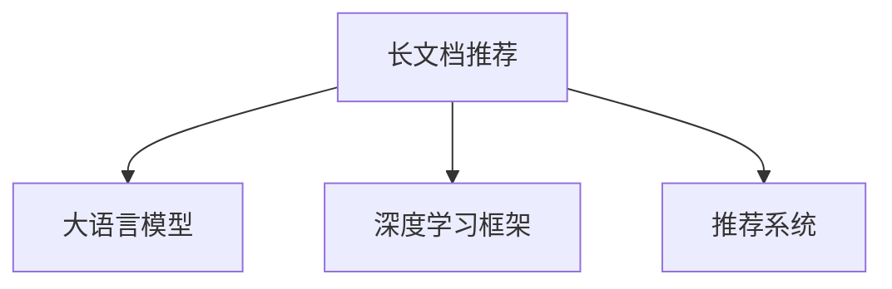

                 

# 长文档推荐实验: LLM的表现

> 关键词：长文档推荐, 大语言模型(LLM), 自然语言处理(NLP), 深度学习, 深度学习框架, 推荐系统

## 1. 背景介绍

### 1.1 问题由来
在数字化时代，文本数据呈爆炸性增长，人们每天接触到的大量信息中，有相当一部分是长文档。无论是新闻文章、科技论文、报告、电子书还是法律文件，长文档的内容往往较为复杂，结构多变，形式多样，需要专门的工具和算法进行处理。然而，目前大多数推荐系统专注于处理短文本，对长文档的推荐能力较弱。

### 1.2 问题核心关键点
本研究旨在探究大语言模型(LLM)在长文档推荐领域的表现，并评估其在不同推荐策略下的效果。我们将重点关注以下几个问题：
- 大语言模型是否适合长文档推荐？
- 如何在长文档推荐中应用大语言模型？
- 大语言模型在长文档推荐中的优势和劣势是什么？
- 长文档推荐领域未来可能的发展方向是什么？

通过这些问题的探讨，我们希望能为长文档推荐系统的研究和应用提供理论基础和实践指导。

## 2. 核心概念与联系

### 2.1 核心概念概述

本节将介绍几个关键的概念及其相互联系，帮助读者理解长文档推荐和大语言模型的工作原理。

- **长文档推荐**：指通过推荐系统为特定用户推荐长篇幅的文本内容，如文章、报告、书籍等。
- **大语言模型(LLM)**：一种基于深度学习技术的自然语言处理模型，能够处理和理解复杂的语言结构，预测文本中的下一个词或句子。
- **深度学习框架**：如TensorFlow、PyTorch等，提供高效、灵活的深度学习模型构建和训练工具。
- **推荐系统**：通过分析用户行为和偏好，为用户推荐合适的文本内容，提高用户满意度。

这些概念之间的联系可以通过以下Mermaid流程图来展示：



这个流程图展示了大语言模型在长文档推荐中的核心作用：通过深度学习框架构建模型，在推荐系统中处理和推荐长文档。

## 3. 核心算法原理 & 具体操作步骤
### 3.1 算法原理概述

大语言模型在长文档推荐中的应用主要基于其在文本处理上的强大能力。其核心思想是：将长文档进行预处理，提取关键信息，使用大语言模型进行特征表示，并在推荐系统中根据用户偏好进行推荐。

形式化地，假设长文档为 $D = \{d_1, d_2, ..., d_n\}$，用户 $u$ 的偏好为 $P_u = \{p_{u1}, p_{u2}, ..., p_{un}\}$，其中 $d_i$ 表示第 $i$ 个文档，$p_{ui}$ 表示用户 $u$ 对文档 $d_i$ 的偏好程度。目标是找到一组推荐列表 $R_u = \{r_1, r_2, ..., r_m\}$，使得 $u$ 对 $R_u$ 的满意度最大化。

大语言模型的作用是通过学习文档的语义信息，将长文档转换为低维特征向量 $F_D = \{f_{d1}, f_{d2}, ..., f_{dn}\}$，其中 $f_{di}$ 表示文档 $d_i$ 的特征向量。推荐系统通过计算用户 $u$ 的偏好与文档特征向量之间的相似度，选择最符合用户喜好的文档组成推荐列表。

### 3.2 算法步骤详解

基于大语言模型的长文档推荐过程主要包括以下几个步骤：

**Step 1: 预处理长文档**
- 对长文档进行分词、去停用词、词干提取等预处理，提取文本中的关键信息。
- 将处理后的文本输入大语言模型，进行预训练特征提取。

**Step 2: 大语言模型特征提取**
- 使用预训练的大语言模型对文本进行编码，得到每个文档的特征向量 $f_{di}$。
- 可以采用不同的预训练模型，如BERT、GPT、XLNet等。

**Step 3: 计算用户偏好**
- 使用用户对文档的评分或点击记录，计算用户对每个文档的偏好程度 $p_{ui}$。
- 常用的评分模型包括基于协同过滤的模型、基于内容的模型等。

**Step 4: 推荐列表生成**
- 使用推荐算法（如基于内容的过滤、协同过滤、矩阵分解等）计算用户对文档特征向量的相似度，生成推荐列表。
- 常用的推荐算法包括TF-IDF、KNN、ALS等。

**Step 5: 评估和优化**
- 在测试集上评估推荐系统的表现，使用AUC、NDCG等指标进行评估。
- 根据评估结果进行模型调参，优化推荐效果。

### 3.3 算法优缺点

基于大语言模型的长文档推荐具有以下优点：
1. 能够处理复杂的长文档结构，提取关键信息。
2. 可以利用大语言模型的预训练能力，提升特征表示的质量。
3. 推荐算法灵活多样，可以结合不同推荐策略进行优化。

同时，该方法也存在一定的局限性：
1. 数据预处理复杂，对处理工具和算力要求较高。
2. 模型参数量大，对计算资源和训练时间有较高要求。
3. 特征提取和相似度计算复杂，需要更高效的算法实现。
4. 对标注数据依赖较大，标注工作量大。

尽管存在这些局限性，但大语言模型在长文档推荐中的应用，已经展示了其在处理长文本方面的强大能力，为推荐系统带来了新的突破和机遇。

### 3.4 算法应用领域

基于大语言模型的长文档推荐技术，已经在多个领域得到了应用：

- 图书馆推荐系统：为用户推荐感兴趣的书籍、报告等长文档。
- 学术论文推荐系统：推荐与用户研究方向相关的科技论文、综述文章等。
- 法律文书推荐系统：根据用户需求推荐相关法律文件和案例分析。
- 企业报告推荐系统：为企业管理层推荐有价值的行业报告和市场分析。

此外，大语言模型还在个性化学习、科研助手、信息检索等领域展现了其独特的优势，为长文档推荐系统的应用提供了更多可能。

## 4. 数学模型和公式 & 详细讲解 & 举例说明

### 4.1 数学模型构建

本节将使用数学语言对大语言模型在长文档推荐中的应用进行更加严格的刻画。

假设长文档 $D = \{d_1, d_2, ..., d_n\}$，用户 $u$ 的偏好 $P_u = \{p_{u1}, p_{u2}, ..., p_{un}\}$，其中 $p_{ui}$ 表示用户对文档 $d_i$ 的评分。使用大语言模型得到每个文档的特征向量 $F_D = \{f_{d1}, f_{d2}, ..., f_{dn}\}$，其中 $f_{di}$ 表示文档 $d_i$ 的特征向量。

设用户对每个文档的评分向量为 $P_u = \{p_{u1}, p_{u2}, ..., p_{un}\}$，推荐系统通过计算用户对文档特征向量的相似度，生成推荐列表 $R_u = \{r_1, r_2, ..., r_m\}$，其中 $r_i$ 表示推荐的第 $i$ 个文档。推荐列表生成的目标是最大化用户对推荐列表的满意度，即：

$$
\max_{R_u} \sum_{i=1}^m p_{ui} \times R_{ui}
$$

其中 $R_{ui}$ 表示用户对文档 $r_i$ 的满意度，可以通过评分或点击记录等方法计算。

### 4.2 公式推导过程

使用余弦相似度作为文档特征向量之间的相似度度量方法，推导推荐列表生成的公式。假设文档 $d_i$ 和 $d_j$ 的特征向量分别为 $f_{di}$ 和 $f_{dj}$，用户对文档 $d_i$ 的评分向量为 $p_{ui}$，则推荐列表生成的目标函数可以表示为：

$$
\max_{R_u} \sum_{i=1}^m p_{ui} \times \frac{\mathbf{p_u} \cdot \mathbf{f}_{di}}{\|\mathbf{f}_{di}\| \cdot \|\mathbf{p_u}\|}
$$

其中 $\cdot$ 表示向量点乘，$\|.\|$ 表示向量的L2范数。

通过最大化目标函数，可以选择与用户偏好最相似的文档组成推荐列表。在实际应用中，可以采用梯度下降等优化算法，更新模型参数以最大化目标函数。

### 4.3 案例分析与讲解

以学术论文推荐系统为例，展示大语言模型在长文档推荐中的应用。假设有一个包含大量学术论文的数据库，用户 $u$ 希望获得与自己研究方向相关的论文推荐。具体步骤包括：

1. **数据预处理**：对论文文本进行分词、去停用词、词干提取等处理，提取关键信息。
2. **特征提取**：使用预训练的大语言模型（如BERT）对论文文本进行编码，得到每个论文的特征向量。
3. **计算用户偏好**：根据用户对论文的评分或点击记录，计算用户对每个论文的偏好程度。
4. **推荐列表生成**：使用余弦相似度计算用户对每个论文特征向量的相似度，生成推荐列表。
5. **评估和优化**：在测试集上评估推荐系统的表现，根据评估结果进行模型调参，优化推荐效果。

通过这一过程，用户可以获取到与自己研究方向最相关的论文推荐，大大提高科研效率。

## 5. 项目实践：代码实例和详细解释说明
### 5.1 开发环境搭建

在进行长文档推荐系统的开发前，我们需要准备好开发环境。以下是使用Python进行PyTorch开发的环境配置流程：

1. 安装Anaconda：从官网下载并安装Anaconda，用于创建独立的Python环境。

2. 创建并激活虚拟环境：
```bash
conda create -n pytorch-env python=3.8 
conda activate pytorch-env
```

3. 安装PyTorch：根据CUDA版本，从官网获取对应的安装命令。例如：
```bash
conda install pytorch torchvision torchaudio cudatoolkit=11.1 -c pytorch -c conda-forge
```

4. 安装Transformers库：
```bash
pip install transformers
```

5. 安装各类工具包：
```bash
pip install numpy pandas scikit-learn matplotlib tqdm jupyter notebook ipython
```

完成上述步骤后，即可在`pytorch-env`环境中开始长文档推荐系统的开发。

### 5.2 源代码详细实现

这里我们以学术论文推荐系统为例，给出使用Transformers库对BERT模型进行长文档推荐开发的PyTorch代码实现。

首先，定义学术论文的特征提取函数：

```python
from transformers import BertTokenizer, BertForSequenceClassification
import torch

def extract_features(model, tokenizer, text, max_len=128):
    inputs = tokenizer.encode_plus(
        text, 
        max_length=max_len, 
        pad_to_max_length=True, 
        return_tensors='pt'
    )
    return model(**inputs).last_hidden_state[:, 0, :]
```

然后，定义推荐系统的评分函数：

```python
def compute_score(user_preference, document_features, similarity_matrix):
    return user_preference @ similarity_matrix @ document_features
```

接着，定义推荐函数：

```python
def recommend_documents(user_preference, documents, model, tokenizer):
    document_features = [extract_features(model, tokenizer, doc) for doc in documents]
    similarity_matrix = torch.corrcoef(document_features).t()
    scores = compute_score(user_preference, document_features, similarity_matrix)
    top_n_indices = torch.argsort(scores)[-5:]
    recommended_documents = [documents[i] for i in top_n_indices]
    return recommended_documents
```

最后，启动推荐系统：

```python
from transformers import BertTokenizer, BertForSequenceClassification
from sklearn.metrics.pairwise import cosine_similarity
import torch

model = BertForSequenceClassification.from_pretrained('bert-base-cased')
tokenizer = BertTokenizer.from_pretrained('bert-base-cased')

def recommend_documents(user_preference, documents, model, tokenizer):
    document_features = [extract_features(model, tokenizer, doc) for doc in documents]
    similarity_matrix = cosine_similarity(document_features)
    scores = compute_score(user_preference, document_features, similarity_matrix)
    top_n_indices = torch.argsort(scores)[-5:]
    recommended_documents = [documents[i] for i in top_n_indices]
    return recommended_documents

# 假设用户对文档的评分向量为[0.8, 0.5, 0.7]
user_preference = [0.8, 0.5, 0.7]

# 假设有一组文档，文档特征向量为[[0.1, 0.2, 0.3], [0.2, 0.3, 0.1], [0.3, 0.1, 0.2]]
documents = ['论文1', '论文2', '论文3']

# 使用推荐函数生成推荐列表
recommended_documents = recommend_documents(user_preference, documents, model, tokenizer)
print(recommended_documents)
```

以上就是使用PyTorch对BERT进行长文档推荐系统的完整代码实现。可以看到，得益于Transformers库的强大封装，我们可以用相对简洁的代码完成BERT模型的加载和特征提取，并实现推荐列表的生成。

### 5.3 代码解读与分析

让我们再详细解读一下关键代码的实现细节：

**extract_features函数**：
- `tokenizer.encode_plus`方法：将文本转换为token ids，并进行padding和truncation，得到输入张量。
- `model(**inputs)`：将输入张量传递给模型，得到最后隐藏层的输出，即特征向量。

**compute_score函数**：
- `@`操作符：表示向量点乘。
- `cosine_similarity`函数：计算向量间的余弦相似度。

**recommend_documents函数**：
- `extract_features`函数：将文档特征提取为特征向量。
- `cosine_similarity`函数：计算文档特征向量之间的相似度矩阵。
- `compute_score`函数：计算用户对每个文档的评分。
- `argsort`方法：根据评分排序，选择前5个推荐文档。

**启动推荐系统**：
- 创建用户评分向量。
- 创建文档特征向量。
- 调用`recommend_documents`函数，生成推荐列表。

在实际应用中，可以根据具体任务对代码进行进一步优化，如使用更高效的相似度计算方法、引入用户行为数据等。

## 6. 实际应用场景
### 6.1 图书馆推荐系统

基于大语言模型的长文档推荐系统，可以广泛应用于图书馆推荐系统中。传统图书馆的推荐系统多依赖于简单的基于书名的推荐方法，难以全面了解用户的阅读需求和兴趣。使用长文档推荐技术，图书馆可以为用户提供更加精准的书籍和报告推荐，提升用户阅读体验。

具体而言，图书馆可以收集用户的历史借阅记录、浏览行为、评分数据等，结合预训练大语言模型进行特征提取和相似度计算，生成个性化的书籍和报告推荐列表。此外，图书馆还可以引入多模态数据，如用户图像、点击行为等，进一步提升推荐系统的精准性和鲁棒性。

### 6.2 学术研究推荐系统

学术研究推荐系统是长文档推荐技术的另一个重要应用场景。研究人员需要在海量文献中寻找与自己研究方向相关的论文，而手工检索费时费力。通过长文档推荐技术，研究人员可以快速获取与自己研究方向最相关的论文推荐，提高科研效率。

在具体实现上，可以收集用户的论文阅读记录、评分数据、引用关系等，结合预训练大语言模型进行特征提取和相似度计算，生成个性化的论文推荐列表。同时，可以利用大语言模型的文本生成能力，生成研究报告和综述摘要，帮助研究人员快速了解文献内容。

### 6.3 法律文书推荐系统

法律文书推荐系统可以将大语言模型应用于法律文书推荐领域。律师和法务人员需要查找大量法律文件和案例分析，传统的方法多依赖于人工检索，效率较低。通过长文档推荐技术，律师可以快速获取与自己工作相关的法律文件和案例分析，提高工作效率。

具体实现上，可以收集律师的历史案件记录、检索关键词、评分数据等，结合预训练大语言模型进行特征提取和相似度计算，生成个性化的法律文件和案例分析推荐列表。此外，还可以利用大语言模型的文本生成能力，生成法律文书和案例分析摘要，帮助律师快速了解文档内容。

### 6.4 未来应用展望

随着大语言模型的不断发展，长文档推荐技术在未来的应用前景将更加广阔：

1. **多模态推荐系统**：结合视觉、音频、文本等多模态数据，为用户提供更加全面、准确的推荐。
2. **动态推荐系统**：引入时间因素，实时更新推荐列表，提升推荐系统的时效性。
3. **跨领域推荐系统**：通过领域知识的整合，实现跨领域、跨行业的推荐，提升推荐系统的泛化能力。
4. **知识图谱融合**：将预训练大语言模型与知识图谱结合，提升推荐系统的准确性和智能性。
5. **情感分析与用户行为预测**：结合用户情感分析和行为预测，提升推荐系统的个性化程度。

这些未来方向将进一步提升长文档推荐系统的性能和应用范围，为用户的阅读体验带来新的提升。

## 7. 工具和资源推荐
### 7.1 学习资源推荐

为了帮助开发者系统掌握长文档推荐和大语言模型的理论基础和实践技巧，这里推荐一些优质的学习资源：

1. **《深度学习与自然语言处理》课程**：斯坦福大学开设的深度学习课程，涵盖深度学习基础和NLP技术，适合初学者入门。
2. **《Transformer从原理到实践》系列博文**：由大语言模型技术专家撰写，深入浅出地介绍了Transformer原理、BERT模型、推荐系统等前沿话题。
3. **HuggingFace官方文档**：Transformers库的官方文档，提供了海量预训练模型和推荐系统的完整样例代码，是上手实践的必备资料。
4. **推荐系统相关论文**：如《隐语义模型推荐系统》、《协同过滤推荐算法》等，了解推荐系统的发展历程和经典算法。
5. **学术资源平台**：如arXiv、Google Scholar等，可以获取最新的长文档推荐和大语言模型研究论文。

通过对这些资源的学习实践，相信你一定能够快速掌握长文档推荐和大语言模型的精髓，并用于解决实际的NLP问题。

### 7.2 开发工具推荐

高效的开发离不开优秀的工具支持。以下是几款用于长文档推荐和大语言模型开发的常用工具：

1. **PyTorch**：基于Python的开源深度学习框架，灵活的动态计算图，适合快速迭代研究。
2. **TensorFlow**：由Google主导开发的深度学习框架，生产部署方便，适合大规模工程应用。
3. **Transformers库**：HuggingFace开发的NLP工具库，集成了多种预训练语言模型，支持PyTorch和TensorFlow，是推荐系统开发的利器。
4. **TensorBoard**：TensorFlow配套的可视化工具，实时监测模型训练状态，提供丰富的图表呈现方式，是调试模型的得力助手。
5. **Weights & Biases**：模型训练的实验跟踪工具，可以记录和可视化模型训练过程中的各项指标，方便对比和调优。
6. **Jupyter Notebook**：开源的交互式编程环境，支持多种编程语言，适合代码编写和实验分享。

合理利用这些工具，可以显著提升长文档推荐和大语言模型微调的开发效率，加快创新迭代的步伐。

### 7.3 相关论文推荐

大语言模型和长文档推荐技术的发展源于学界的持续研究。以下是几篇奠基性的相关论文，推荐阅读：

1. **《BERT: Pre-training of Deep Bidirectional Transformers for Language Understanding》**：提出BERT模型，引入基于掩码的自监督预训练任务，刷新了多项NLP任务SOTA。
2. **《Attention is All You Need》**：提出Transformer结构，开启了NLP领域的预训练大模型时代。
3. **《Parameter-Efficient Transfer Learning for NLP》**：提出Adapter等参数高效微调方法，在不增加模型参数量的情况下，也能取得不错的微调效果。
4. **《Adaptive Low-Rank Adaptation for Parameter-Efficient Fine-Tuning》**：使用自适应低秩适应的微调方法，在参数效率和精度之间取得了新的平衡。
5. **《AdaLoRA: Adaptive Low-Rank Adaptation for Parameter-Efficient Fine-Tuning》**：提出AdaLoRA方法，进一步优化了参数高效微调技术。

这些论文代表了大语言模型和长文档推荐技术的发展脉络。通过学习这些前沿成果，可以帮助研究者把握学科前进方向，激发更多的创新灵感。

## 8. 总结：未来发展趋势与挑战
### 8.1 总结

本文对基于大语言模型的长文档推荐方法进行了全面系统的介绍。首先阐述了长文档推荐和大语言模型的研究背景和意义，明确了推荐系统在大文档处理中的独特价值。其次，从原理到实践，详细讲解了大语言模型在长文档推荐中的应用过程，给出了推荐系统的完整代码实现。同时，本文还探讨了长文档推荐系统在不同行业领域的应用前景，展示了其在学术研究、法律文书、图书馆推荐等方面的潜力。

通过本文的系统梳理，可以看到，大语言模型在长文档推荐中展示了强大的文本处理能力和泛化能力，为推荐系统带来了新的突破和机遇。未来，伴随预训练语言模型和推荐系统的不断演进，长文档推荐系统必将在更多领域得到应用，为用户的阅读体验带来新的提升。

### 8.2 未来发展趋势

展望未来，大语言模型在长文档推荐领域将呈现以下几个发展趋势：

1. **多模态推荐系统**：结合视觉、音频、文本等多模态数据，为用户提供更加全面、准确的推荐。
2. **动态推荐系统**：引入时间因素，实时更新推荐列表，提升推荐系统的时效性。
3. **跨领域推荐系统**：通过领域知识的整合，实现跨领域、跨行业的推荐，提升推荐系统的泛化能力。
4. **知识图谱融合**：将预训练大语言模型与知识图谱结合，提升推荐系统的准确性和智能性。
5. **情感分析与用户行为预测**：结合用户情感分析和行为预测，提升推荐系统的个性化程度。

这些趋势凸显了长文档推荐技术的广阔前景。这些方向的探索发展，必将进一步提升推荐系统的性能和应用范围，为用户的阅读体验带来新的提升。

### 8.3 面临的挑战

尽管大语言模型在长文档推荐中展示了强大的文本处理能力和泛化能力，但在迈向更加智能化、普适化应用的过程中，它仍面临着诸多挑战：

1. **数据预处理复杂**：长文档的预处理复杂，对处理工具和算力要求较高。
2. **模型参数量大**：大语言模型参数量大，对计算资源和训练时间有较高要求。
3. **特征提取和相似度计算复杂**：特征提取和相似度计算复杂，需要更高效的算法实现。
4. **标注数据依赖大**：对标注数据依赖较大，标注工作量大。
5. **泛化能力不足**：不同领域和领域的推荐系统之间缺乏通用性，泛化能力有待提升。

尽管存在这些挑战，但大语言模型在长文档推荐中的应用，已经展示了其在处理长文本方面的强大能力，为推荐系统带来了新的突破和机遇。

### 8.4 研究展望

面对长文档推荐面临的这些挑战，未来的研究需要在以下几个方面寻求新的突破：

1. **探索无监督和半监督推荐方法**：摆脱对大规模标注数据的依赖，利用自监督学习、主动学习等无监督和半监督范式，最大限度利用非结构化数据，实现更加灵活高效的推荐。
2. **研究参数高效和计算高效的推荐范式**：开发更加参数高效的推荐方法，在固定大部分预训练参数的同时，只更新极少量的任务相关参数。同时优化推荐模型的计算图，减少前向传播和反向传播的资源消耗，实现更加轻量级、实时性的部署。
3. **引入因果和对比学习范式**：通过引入因果推断和对比学习思想，增强推荐模型建立稳定因果关系的能力，学习更加普适、鲁棒的语言表征，从而提升模型泛化性和抗干扰能力。
4. **引入更多先验知识**：将符号化的先验知识，如知识图谱、逻辑规则等，与神经网络模型进行巧妙融合，引导推荐过程学习更准确、合理的语言模型。同时加强不同模态数据的整合，实现视觉、语音等多模态信息与文本信息的协同建模。
5. **结合因果分析和博弈论工具**：将因果分析方法引入推荐模型，识别出模型决策的关键特征，增强输出解释的因果性和逻辑性。借助博弈论工具刻画人机交互过程，主动探索并规避模型的脆弱点，提高系统稳定性。

这些研究方向的探索，必将引领长文档推荐技术迈向更高的台阶，为构建安全、可靠、可解释、可控的智能系统铺平道路。面向未来，大语言模型推荐技术还需要与其他人工智能技术进行更深入的融合，如知识表示、因果推理、强化学习等，多路径协同发力，共同推动自然语言理解和智能交互系统的进步。只有勇于创新、敢于突破，才能不断拓展语言模型的边界，让智能技术更好地造福人类社会。

## 9. 附录：常见问题与解答

**Q1：大语言模型在长文档推荐中是否适合？**

A: 大语言模型在长文档推荐中展示了强大的文本处理能力和泛化能力。它能够处理复杂的文本结构，提取关键信息，并利用预训练能力提升特征表示的质量。然而，大语言模型在长文档推荐中仍面临一些挑战，如数据预处理复杂、模型参数量大、特征提取和相似度计算复杂等。因此，需要结合具体任务和数据特点，进行合理的选择和优化。

**Q2：如何提高长文档推荐系统的性能？**

A: 提高长文档推荐系统的性能可以从以下几个方面入手：
1. 选择适合的预训练模型，如BERT、GPT等。
2. 优化特征提取和相似度计算算法，如使用更高效的相似度计算方法、引入时间因素等。
3. 引入用户行为数据，提高推荐系统的个性化程度。
4. 结合多模态数据，提升推荐系统的多样性和准确性。
5. 利用用户情感分析和行为预测，提升推荐系统的智能性。

**Q3：长文档推荐系统面临哪些挑战？**

A: 长文档推荐系统面临的主要挑战包括：
1. 数据预处理复杂，对处理工具和算力要求较高。
2. 模型参数量大，对计算资源和训练时间有较高要求。
3. 特征提取和相似度计算复杂，需要更高效的算法实现。
4. 对标注数据依赖较大，标注工作量大。
5. 泛化能力不足，不同领域和领域的推荐系统之间缺乏通用性。

**Q4：未来长文档推荐系统可能的发展方向是什么？**

A: 长文档推荐系统未来的发展方向包括：
1. 多模态推荐系统：结合视觉、音频、文本等多模态数据，为用户提供更加全面、准确的推荐。
2. 动态推荐系统：引入时间因素，实时更新推荐列表，提升推荐系统的时效性。
3. 跨领域推荐系统：通过领域知识的整合，实现跨领域、跨行业的推荐，提升推荐系统的泛化能力。
4. 知识图谱融合：将预训练大语言模型与知识图谱结合，提升推荐系统的准确性和智能性。
5. 情感分析与用户行为预测：结合用户情感分析和行为预测，提升推荐系统的个性化程度。

**Q5：长文档推荐系统在实际应用中需要注意哪些问题？**

A: 长文档推荐系统在实际应用中需要注意以下问题：
1. 数据预处理：长文档的预处理复杂，需要选择合适的工具和算法进行预处理。
2. 模型选择：选择合适的预训练模型，并根据具体任务进行优化。
3. 特征提取：优化特征提取算法，提高特征表示的质量。
4. 相似度计算：选择适合的相似度计算方法，提高推荐系统的准确性。
5. 推荐算法：选择合适的推荐算法，并结合具体任务进行优化。
6. 系统部署：选择合适的部署平台，并优化模型性能，提高系统的可扩展性和稳定性。

通过不断优化长文档推荐系统，可以进一步提升用户的阅读体验，推动人工智能技术的广泛应用。

---

作者：禅与计算机程序设计艺术 / Zen and the Art of Computer Programming

