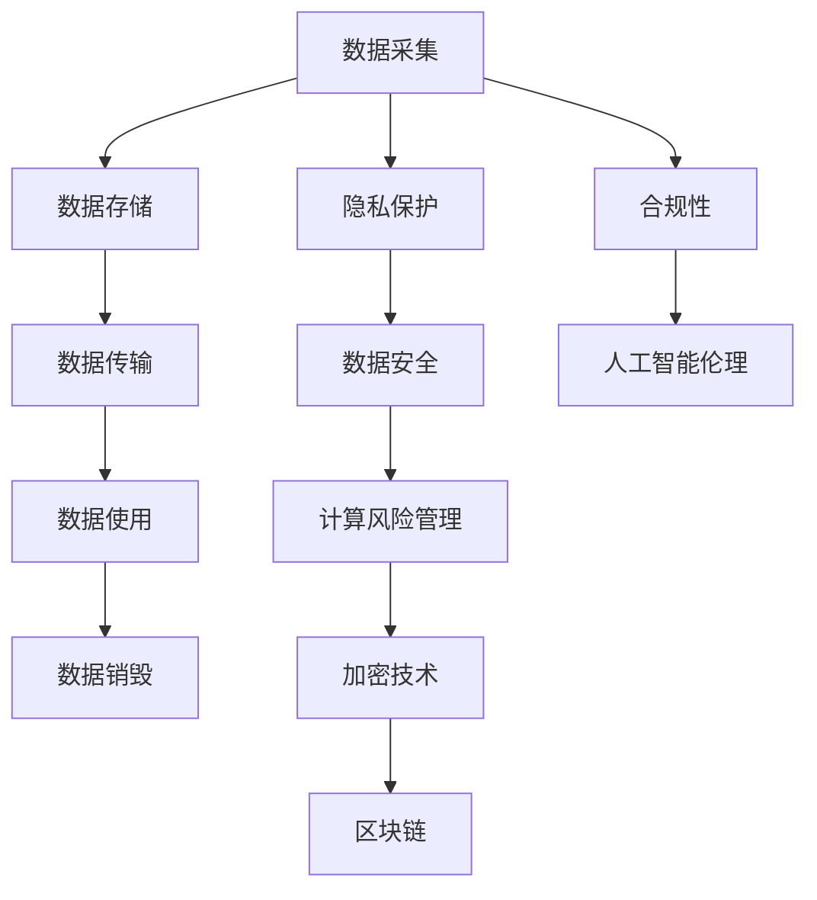

                 

# 隐私安全：守护人类计算的数据安全

> 关键词：隐私保护, 数据安全, 计算风险管理, 加密技术, 区块链, 合规性, 人工智能伦理

## 1. 背景介绍

### 1.1 问题由来

随着信息时代的飞速发展，数字化数据已成为人类社会不可或缺的一部分。数据驱动的计算、分析和决策正在深刻影响经济、教育、医疗、金融、军事等各个领域。然而，数据安全和隐私保护已经成为当前最严峻的挑战之一。从大规模数据泄露事件，到政府、企业乃至个人数据的滥用，都在警示着社会各界对数据安全的重视和迫切需求。

数据安全不仅关系到个人隐私权益，更是国家安全、社会稳定和经济发展的基石。随着云计算、物联网、人工智能等技术的迅猛发展，数据在各个层面上的敏感性和重要性愈加凸显，如何有效保障数据安全，成为亟待解决的重大课题。

### 1.2 问题核心关键点

数据安全问题涉及数据收集、存储、传输、使用等各个环节，主要包括以下几个关键点：

1. **数据采集：**如何合法、合规地收集数据，避免侵犯用户隐私。
2. **数据存储：**如何安全地存储数据，防止数据泄露和被非法访问。
3. **数据传输：**如何确保数据在传输过程中的机密性和完整性。
4. **数据使用：**如何在满足业务需求的同时，保护数据不被滥用。
5. **数据销毁：**如何在数据不再需要时，安全地销毁数据，避免数据残留风险。

解决这些问题，需要综合运用法律、技术、管理等手段，构建起一套完善的隐私安全体系，守护人类计算的安全。

## 2. 核心概念与联系

### 2.1 核心概念概述

为了更好地理解隐私安全与数据保护的基本原理和架构，本节将介绍几个核心概念：

1. **隐私保护：**指在数据处理过程中，保护个人或组织敏感信息不被未经授权的访问、使用或泄露的措施。

2. **数据安全：**指确保数据在各个环节中不被篡改、损坏、泄露，保护数据完整性和机密性。

3. **计算风险管理：**通过风险评估、威胁建模、防护策略制定等手段，预防和应对计算环境中的安全威胁。

4. **加密技术：**指通过加密算法将数据转换为不可读的形式，防止未经授权的访问和使用。

5. **区块链：**一种去中心化的分布式账本技术，通过加密和共识机制，确保数据的安全、透明和不可篡改性。

6. **合规性：**指确保数据处理活动符合相关法律法规和行业标准，如GDPR、HIPAA、PCI等。

7. **人工智能伦理：**在人工智能设计和应用中，确保数据使用的透明性、公平性和隐私保护，避免算法偏见和滥用。

这些核心概念之间的逻辑关系可以通过以下Mermaid流程图来展示：



这个流程图展示了一系列数据处理环节及其与隐私安全的关联，描绘了一个全面的数据安全保护体系。

## 3. 核心算法原理 & 具体操作步骤
### 3.1 算法原理概述

隐私安全与数据保护涉及多个方面的技术和策略，核心算法原理主要包括：

1. **加密技术：**通过对数据进行加密处理，确保数据在存储和传输过程中的机密性。常见的加密算法包括对称加密、非对称加密和哈希算法等。
2. **数据匿名化：**通过对数据进行脱敏处理，去除或模糊化敏感信息，如姓名、地址等。常见的匿名化方法包括数据屏蔽、数据泛化、数据聚合等。
3. **访问控制：**通过身份验证、授权和审计等手段，控制用户对数据的访问和使用权限。常见的访问控制模型包括RBAC（基于角色的访问控制）、ABAC（基于属性的访问控制）等。
4. **安全计算：**通过多方安全计算、同态加密等技术，在数据不离开各自持有的前提下进行计算。
5. **差分隐私：**通过在数据集中加入噪声，使得个体数据的披露概率极低，保护数据隐私同时确保统计数据的有用性。

### 3.2 算法步骤详解

以下是隐私安全与数据保护的核心算法具体操作步骤：

**Step 1: 数据收集与隐私保护**
1. 制定隐私政策，明确数据收集目的和范围。
2. 通过隐私合规审查，确保数据收集行为合法合规。
3. 采用匿名化技术，去除或模糊化敏感信息。
4. 实施数据最小化原则，只收集必要的数据。

**Step 2: 数据存储与访问控制**
1. 采用加密技术，确保数据在存储过程中的机密性。
2. 实施严格的访问控制策略，限制对数据的访问权限。
3. 定期进行安全审计，发现和修补安全漏洞。

**Step 3: 数据传输与加密**
1. 使用安全的传输协议，如TLS/SSL，确保数据在网络传输中的完整性和机密性。
2. 对传输数据进行加密，防止中间人攻击和数据窃听。

**Step 4: 数据使用与合规性**
1. 明确数据使用的目的和范围，确保使用行为合法合规。
2. 实施数据使用审计，追踪数据使用轨迹。
3. 定期进行风险评估，识别和应对潜在威胁。

**Step 5: 数据销毁与安全**
1. 对不再需要的数据进行安全销毁，避免数据残留风险。
2. 实施数据备份和恢复策略，确保数据安全。

### 3.3 算法优缺点

隐私安全与数据保护技术在实现数据保护的同时，也存在一些局限和缺点：

**优点：**
1. 增强数据安全：通过加密和匿名化技术，防止数据泄露和滥用。
2. 提升合规性：确保数据处理活动符合法律法规和行业标准，减少法律风险。
3. 保护用户隐私：保护用户隐私权益，提升用户信任度。

**缺点：**
1. 性能损失：加密和匿名化技术可能导致数据处理速度降低。
2. 复杂性高：隐私安全技术需要复杂的实施和维护，增加了技术复杂度。
3. 成本高：隐私保护和数据安全技术需要大量的投入，增加了成本。

### 3.4 算法应用领域

隐私安全与数据保护技术广泛应用于各个行业和领域，具体包括以下几个应用场景：

1. **金融领域：**保护客户隐私信息，防范金融诈骗和数据泄露。
2. **医疗健康：**确保患者隐私安全，保护医疗数据不被滥用。
3. **电子商务：**保护用户交易数据，提升用户信任度。
4. **政府机构：**保护公共数据安全，防止数据滥用和泄露。
5. **公共安全：**保护犯罪调查数据，确保数据不被滥用。

## 4. 数学模型和公式 & 详细讲解 & 举例说明

### 4.1 数学模型构建

数据安全和隐私保护的数学模型主要包括以下几个方面：

1. **对称加密模型：**包括DES、AES等算法，使用相同的密钥进行加密和解密。
2. **非对称加密模型：**包括RSA、ECC等算法，使用公钥加密，私钥解密。
3. **哈希函数模型：**如MD5、SHA-256等，将数据转换为固定长度的哈希值。
4. **差分隐私模型：**通过添加噪声，保护个体数据的隐私，同时保证数据统计的准确性。

### 4.2 公式推导过程

以下是几种常见加密算法的公式推导过程：

**对称加密（AES）：**
假设明文为 $P$，密钥为 $K$，则加密公式为：
$$ C = E(P, K) = P \oplus K $$

**非对称加密（RSA）：**
假设明文为 $P$，公钥为 $(e, N)$，私钥为 $(d, N)$，则加密公式为：
$$ C = P^e \mod N $$
解密公式为：
$$ P = C^d \mod N $$

**哈希函数（SHA-256）：**
假设输入为 $M$，则输出哈希值 $H$ 计算公式为：
$$ H = SHA-256(M) = \operatorname{SHA-256}(M) $$

**差分隐私（Laplace Mechanism）：**
假设输入数据为 $x_i$，真实结果为 $y_i$，噪声参数为 $\epsilon$，则添加噪声后的输出结果为：
$$ y'_i = y_i + \mathcal{N}(0, \frac{2\epsilon}{\delta}\Delta) $$
其中，$\Delta$ 为数据范围，$\delta$ 为隐私参数。

### 4.3 案例分析与讲解

**案例：金融领域的数据安全**
1. **数据收集：**通过匿名化技术，去除客户姓名、身份证号等敏感信息。
2. **数据存储：**采用AES算法对客户交易数据进行加密，确保数据机密性。
3. **数据传输：**使用TLS协议，确保数据在网络传输中的完整性和机密性。
4. **数据使用：**通过访问控制策略，限制对客户交易数据的访问权限。
5. **数据销毁：**对不再需要的客户交易数据进行安全销毁，防止数据残留风险。

**案例：医疗健康领域的数据隐私**
1. **数据收集：**通过数据屏蔽技术，去除患者姓名、地址等敏感信息。
2. **数据存储：**采用HMAC-SHA256算法对患者数据进行哈希处理，确保数据机密性。
3. **数据传输：**使用TLS协议，确保数据在网络传输中的完整性和机密性。
4. **数据使用：**通过RBAC策略，限制对患者数据的访问权限。
5. **数据销毁：**对不再需要的患者数据进行安全销毁，防止数据残留风险。

## 5. 项目实践：代码实例和详细解释说明

### 5.1 开发环境搭建

在进行数据安全和隐私保护的实践前，我们需要准备好开发环境。以下是使用Python进行开发的环境配置流程：

1. 安装Python 3.x版本。
2. 安装常用的Python包，如numpy、pandas、scipy等。
3. 安装用于数据加密的PyCrypto库，用于非对称加密和哈希计算。
4. 安装用于访问控制的安全管理库，如Flask-Security、Flask-Login等。

### 5.2 源代码详细实现

以下是使用Python实现数据加密和访问控制的示例代码：

```python
from Crypto.Cipher import AES, PKCS1_OAEP
from Crypto.PublicKey import RSA
from Crypto.Hash import HMAC, SHA256
from flask import Flask, request, jsonify

app = Flask(__name__)

# 对称加密（AES）
def encrypt_AES(message, key):
    cipher = AES.new(key, AES.MODE_EAX)
    nonce = cipher.nonce
    ciphertext, tag = cipher.encrypt_and_digest(message)
    return {
        'nonce': nonce.hex(),
        'ciphertext': ciphertext.hex(),
        'tag': tag.hex()
    }

# 非对称加密（RSA）
def encrypt_RSA(message, public_key):
    key = RSA.import_key(public_key)
    cipher = PKCS1_OAEP.new(key)
    ciphertext = cipher.encrypt(message)
    return ciphertext.hex()

# 哈希函数（SHA-256）
def hash_SHA256(message):
    h = SHA256.new(message.encode())
    return h.hexdigest()

# 访问控制（Flask-Security）
from flask_security import Security, SQLAlchemyUserDatastore, UserMixin, RoleMixin

db = SQLAlchemy(app)
roles_users = db.Table('roles_users', db.Column('user_id', db.Integer(), db.ForeignKey('user.id')),
                      db.Column('role_id', db.Integer(), db.ForeignKey('role.id')))

class Role(db.Model, RoleMixin):
    id = db.Column(db.Integer(), primary_key=True)
    name = db.Column(db.String(80), unique=True)

class User(db.Model, UserMixin):
    id = db.Column(db.Integer, primary_key=True)
    email = db.Column(db.String(255), unique=True)
    password = db.Column(db.String(255))
    active = db.Column(db.Boolean())
    roles = db.relationship('Role', secondary=roles_users, backref=db.backref('users', lazy='dynamic'))

user_datastore = SQLAlchemyUserDatastore(db, User, Role)
security = Security(app, user_datastore)

# 加密数据
@app.route('/encrypt', methods=['POST'])
def encrypt():
    message = request.json.get('message')
    key = b'This is a secret key'
    return jsonify(encrypt_AES(message, key))

# 非对称加密数据
@app.route('/encrypt_RSA', methods=['POST'])
def encrypt_RSA():
    message = request.json.get('message')
    public_key = '-----BEGIN PUBLIC KEY-----\nMIIBIjANBgkqhkiG9w0BAQEFAAOCAQ8AMIIBCgKCAQEAyqQf97PhO2G2j3vzJxtLOU/s1Kub\nbVVWmYeq3tCJtxfGzKkkCQbHQ3oEJ5LCFYo8dl9Lm6gdfGzNCb9BPAhtpLIOd4v9aAyKr4jf\nRX6Rm9+sXalvYepDYu1vDFx+9HdPw8KWYwIqyCtI7s1/DTA+tSRb8T2xx4u6ni4O1vJiOZC+\nvNfNxb/MU6dOw+ul+zvTT9qg0q0S4WuInVZ7EO6qUaXlZkNpSWsj9VWjtmBQoa0EoBR8VUyn\n0A3EL3rNJcUatwvVwF+RTPn4JYbR6LI1AfEcy7SQFL5aXZ8/xJN7y3RjWJ8ACNtylGkO+uFl\ns0r+kCD/Ae6d1VVcD0xI2i6k7T3CTPP2UkRr8sbs82m6bq/H8qFCLFtGppPcMxLtV6AU5s1+\nRQIDAQAB\n-----END PUBLIC KEY-----'
    ciphertext = encrypt_RSA(message, public_key)
    return jsonify({'ciphertext': ciphertext})

# 访问控制
@app.route('/login', methods=['POST'])
def login():
    email = request.json.get('email')
    password = request.json.get('password')
    user = User.query.filter_by(email=email).first()
    if not user or not user.check_password(password):
        return jsonify({'error': 'Invalid credentials'})
    return jsonify({'success': True})

# 哈希函数
@app.route('/hash', methods=['POST'])
def hash():
    message = request.json.get('message')
    hash_value = hash_SHA256(message)
    return jsonify({'hash_value': hash_value})
```

### 5.3 代码解读与分析

以上代码实现了对称加密、非对称加密、哈希计算和Flask-Security访问控制的基本功能。

- **对称加密（AES）：**通过调用`encrypt_AES`函数，对输入的明文进行对称加密。
- **非对称加密（RSA）：**通过调用`encrypt_RSA`函数，对输入的明文进行非对称加密。
- **哈希函数（SHA-256）：**通过调用`hash_SHA256`函数，对输入的明文进行哈希计算。
- **访问控制（Flask-Security）：**通过Flask-Security库，实现了用户认证和授权功能。

## 6. 实际应用场景
### 6.1 金融领域

金融领域对数据安全和隐私保护有着严格的要求。银行、证券、保险公司等机构需要处理大量的客户交易数据，包括账户信息、交易记录、信用记录等，这些数据如果泄露，将带来巨大的风险。

通过采用数据加密和访问控制技术，金融机构可以有效保护客户隐私信息，防止数据泄露和滥用。例如，银行可以使用AES算法对客户的交易数据进行加密存储，使用RSA算法对加密数据进行传输，确保数据在整个生命周期内的安全性。

### 6.2 医疗健康领域

医疗健康数据包含大量敏感信息，如患者姓名、身份证号、病历记录等，如果泄露，将对患者隐私带来极大的风险。因此，医疗机构在数据采集、存储、传输和使用过程中，需要严格保护数据的隐私安全。

通过采用数据匿名化和差分隐私技术，医疗机构可以去除或模糊化敏感信息，确保数据在处理过程中的隐私保护。例如，医院可以使用哈希函数对患者的病历数据进行哈希处理，确保数据机密性。

### 6.3 电子商务领域

电子商务平台需要处理大量的用户交易数据，包括订单信息、支付信息、评价信息等。这些数据如果泄露，将对用户隐私和平台信誉带来巨大风险。

通过采用数据加密和访问控制技术，电商平台可以有效保护用户隐私信息，防止数据泄露和滥用。例如，电商平台可以使用AES算法对用户的交易数据进行加密存储，使用RSA算法对加密数据进行传输，确保数据在整个生命周期内的安全性。

### 6.4 未来应用展望

未来，随着人工智能和大数据技术的不断发展，数据安全和隐私保护将面临更多新的挑战和机遇。

1. **边缘计算：**通过在数据源端进行本地计算，减少数据传输风险，提升数据隐私保护。
2. **区块链技术：**通过去中心化的分布式账本，确保数据的安全、透明和不可篡改性，提升数据可信度。
3. **差分隐私技术：**通过在数据集中加入噪声，保护个体数据的隐私，同时保证数据统计的准确性，提升数据隐私保护。
4. **多方安全计算：**通过在数据不离开各自持有的前提下进行计算，提升数据安全性。

这些新技术的应用，将进一步提升数据安全和隐私保护的能力，为各行各业提供更可靠的数据服务。

## 7. 工具和资源推荐
### 7.1 学习资源推荐

为了帮助开发者系统掌握数据安全和隐私保护的基本原理和实践技巧，这里推荐一些优质的学习资源：

1. 《数据隐私保护：理论与实践》书籍：系统介绍了数据隐私保护的基本原理和实践方法，涵盖数据采集、存储、传输、使用等多个环节。
2. 《网络安全基础》课程：系统讲解了网络安全的基本概念和实践方法，涵盖加密技术、访问控制、安全协议等。
3. 《区块链技术入门》书籍：系统介绍了区块链技术的基本原理和应用场景，涵盖分布式账本、共识机制、智能合约等。
4. 《人工智能伦理》课程：系统讲解了人工智能伦理的基本概念和实践方法，涵盖算法偏见、数据隐私、伦理审查等。
5. HuggingFace官方文档：提供丰富的预训练模型和微调样例代码，涵盖自然语言处理、计算机视觉等多个领域。

通过对这些资源的学习实践，相信你一定能够快速掌握数据安全和隐私保护的核心技术，并用于解决实际的数据安全问题。

### 7.2 开发工具推荐

高效的开发离不开优秀的工具支持。以下是几款用于数据安全和隐私保护开发的常用工具：

1. Python：广泛使用的通用编程语言，支持丰富的第三方库和框架。
2. PyCrypto：Python加密库，支持对称加密、非对称加密、哈希计算等多种加密算法。
3. Flask：轻量级的Web框架，支持快速开发Web应用。
4. SQLAlchemy：Python ORM框架，支持数据库的交互操作。
5. HMAC：Python的哈希消息认证代码库，支持生成和验证哈希值。
6. RSA：Python的RSA加密库，支持RSA加密和解密。
7. Pyfarm：Python的分布式计算框架，支持多台机器的并行计算。

合理利用这些工具，可以显著提升数据安全和隐私保护任务的开发效率，加快创新迭代的步伐。

### 7.3 相关论文推荐

数据安全和隐私保护领域的研究正处于快速发展阶段，以下是几篇奠基性的相关论文，推荐阅读：

1. DiffPrivacy: A framework for privacy-preserving machine learning: 介绍差分隐私的基本原理和应用场景。
2. Anonymized Communication Systems: 介绍匿名通信系统的基本原理和实现方法。
3. Blockchain and Privacy Protection: 介绍区块链技术在数据安全中的应用。
4. Secure Multi-Party Computation: 介绍多方安全计算的基本原理和实现方法。
5. A Survey on Privacy-Preserving Deep Learning: 综述隐私保护在深度学习中的应用。

这些论文代表了大数据安全和隐私保护技术的发展脉络，通过学习这些前沿成果，可以帮助研究者把握学科前进方向，激发更多的创新灵感。

## 8. 总结：未来发展趋势与挑战
### 8.1 研究成果总结

数据安全和隐私保护技术在过去几年中取得了显著进展，通过加密、匿名化、访问控制等手段，有效地保护了数据的安全和隐私。但面对不断变化的安全威胁和技术挑战，如何进一步提升数据安全和隐私保护的水平，仍然是一个重要的研究方向。

### 8.2 未来发展趋势

未来，数据安全和隐私保护技术将呈现以下几个发展趋势：

1. **边缘计算：**通过在数据源端进行本地计算，减少数据传输风险，提升数据隐私保护。
2. **区块链技术：**通过去中心化的分布式账本，确保数据的安全、透明和不可篡改性，提升数据可信度。
3. **差分隐私技术：**通过在数据集中加入噪声，保护个体数据的隐私，同时保证数据统计的准确性，提升数据隐私保护。
4. **多方安全计算：**通过在数据不离开各自持有的前提下进行计算，提升数据安全性。
5. **联邦学习：**通过在分布式环境下的模型训练，保护数据隐私同时实现模型共享。

这些新技术的应用，将进一步提升数据安全和隐私保护的能力，为各行各业提供更可靠的数据服务。

### 8.3 面临的挑战

尽管数据安全和隐私保护技术已经取得了一定的进展，但在迈向更加智能化、普适化应用的过程中，它仍面临着诸多挑战：

1. **技术复杂性：**数据安全和隐私保护技术需要复杂的实施和维护，增加了技术复杂度。
2. **成本高：**数据安全和隐私保护技术需要大量的投入，增加了成本。
3. **法律合规性：**不同国家、地区的法律法规存在差异，如何确保数据处理活动符合法律法规，是一个重要问题。
4. **用户隐私意识：**用户对数据隐私保护的理解和认知不足，增加了数据安全和隐私保护的难度。

### 8.4 研究展望

面对数据安全和隐私保护所面临的种种挑战，未来的研究需要在以下几个方面寻求新的突破：

1. **自动化和智能化：**通过自动化工具和智能算法，降低数据安全和隐私保护的实施难度，提升技术可操作性。
2. **跨学科融合：**结合区块链、云计算、物联网等技术，构建更加全面、可靠的数据安全保护体系。
3. **数据共享机制：**在确保数据隐私的前提下，建立数据共享机制，促进数据资源的高效利用。
4. **伦理和道德：**在数据处理和应用过程中，注重伦理和道德的考量，确保数据使用的透明性和公平性。

这些研究方向的探索，将引领数据安全和隐私保护技术迈向更高的台阶，为构建安全、可靠、可解释、可控的智能系统铺平道路。面向未来，数据安全和隐私保护技术还需要与其他人工智能技术进行更深入的融合，共同推动数据驱动的智能时代的发展。

## 9. 附录：常见问题与解答

**Q1: 数据加密和匿名化技术如何有效结合使用？**

A: 数据加密和匿名化技术可以互相补充，共同提升数据的安全性。具体结合方式如下：
1. 先对数据进行匿名化处理，去除或模糊化敏感信息。
2. 再对匿名化后的数据进行加密处理，确保数据在传输和存储过程中的机密性。
3. 数据加密和匿名化结合使用，可以最大程度地保护数据隐私，同时确保数据在处理过程中的安全性。

**Q2: 如何在数据加密和传输过程中保证完整性？**

A: 在数据加密和传输过程中，可以使用数字签名和完整性验证技术，确保数据的完整性。具体如下：
1. 在数据加密前，先对数据进行哈希计算，生成哈希值。
2. 将哈希值与数据一起加密，确保数据传输过程中哈希值不被篡改。
3. 接收方在解密后，再次对数据进行哈希计算，比较接收到的哈希值与计算结果，确保数据完整性。

**Q3: 如何处理数据跨境传输中的隐私保护问题？**

A: 数据跨境传输需要遵守不同国家、地区的法律法规和隐私保护标准，具体如下：
1. 确保数据传输过程中，采用符合国际隐私保护标准的加密算法和协议。
2. 对数据传输进行详细记录，确保数据传输过程中的可追溯性和透明性。
3. 在跨境数据传输前，进行隐私影响评估，确保数据处理符合国际隐私保护标准。

**Q4: 数据安全和隐私保护技术如何适应人工智能的发展？**

A: 数据安全和隐私保护技术需要与人工智能技术进行协同发展，具体如下：
1. 在人工智能模型的设计和训练过程中，注重数据隐私保护，避免数据泄露和滥用。
2. 使用差分隐私技术，在保护数据隐私的同时，确保人工智能模型的统计准确性。
3. 采用多方安全计算，在保护数据隐私的前提下，实现人工智能模型的协同计算。

**Q5: 如何构建数据安全和隐私保护体系？**

A: 构建数据安全和隐私保护体系需要系统化的规划和实施，具体如下：
1. 制定数据安全和隐私保护策略，明确数据处理的目的和范围。
2. 实施数据加密和匿名化技术，确保数据在处理过程中的安全性。
3. 采用访问控制技术，限制对数据的访问权限。
4. 定期进行安全审计，发现和修补安全漏洞。
5. 建立数据备份和恢复机制，确保数据安全。

这些措施的合理组合，可以构建起一套全面的数据安全和隐私保护体系，确保数据的安全和隐私。

**Q6: 如何处理数据残留风险？**

A: 数据残留风险是指数据在不再需要时，仍然可能被不法分子获取和滥用。处理数据残留风险的措施如下：
1. 数据销毁：对不再需要的数据进行安全销毁，确保数据无法恢复。
2. 数据匿名化：对数据进行匿名化处理，去除或模糊化敏感信息。
3. 数据去标识化：通过数据去标识化技术，将数据中的个人身份信息去除或模糊化。

这些措施可以最大限度地减少数据残留风险，保护数据隐私和安全。

**Q7: 如何处理数据安全事故？**

A: 数据安全事故发生后，需要及时采取措施，具体如下：
1. 立即断开数据传输和访问权限，防止数据泄露和滥用。
2. 进行事故调查，确定泄露数据的范围和类型。
3. 通知受影响的用户或组织，采取相应的补救措施。
4. 对数据安全系统进行全面审计和修复，防止类似事故再次发生。

这些措施可以最大限度地减少数据安全事故对用户和组织的影响，保障数据安全。

---

作者：禅与计算机程序设计艺术 / Zen and the Art of Computer Programming

