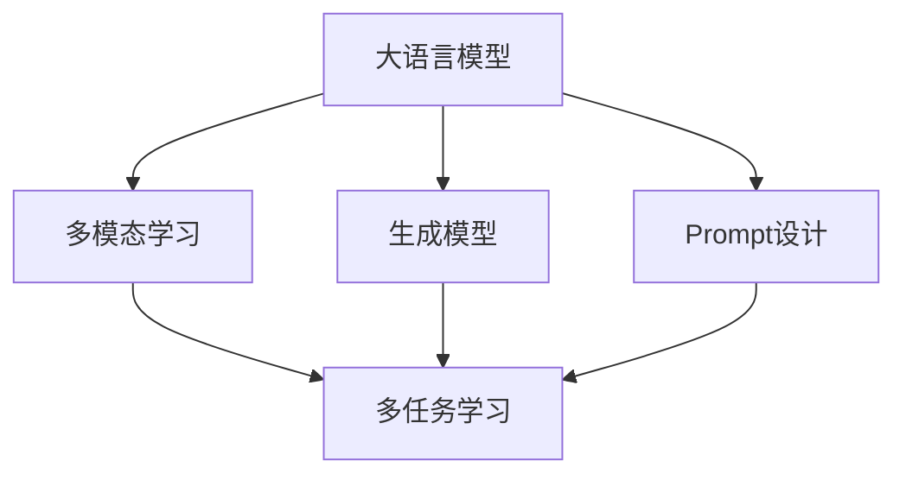

                 

# 零样本学习的进步：Prompt的设计原则

> 关键词：零样本学习, Prompt设计, 生成模型, 语言模型, 多模态学习, 多任务学习

## 1. 背景介绍

### 1.1 问题由来

零样本学习（Zero-shot Learning, ZSL）是自然语言处理（NLP）和计算机视觉（CV）领域的重要研究方向，指模型在没有见过任何特定任务的训练样本的情况下，仅凭任务描述就能够执行新任务的能力。这一能力的实现，使得模型能够快速适应新的应用场景，显著提升了模型的泛化能力和应用范围。

传统的零样本学习方法包括基于规则的启发式、统计模型、元学习等，但往往需要大量先验知识或手工设计的特征，难以扩展到更广泛的领域。近年来，随着深度学习模型的发展，零样本学习已经迈向了基于大模型的范式，其中最经典的方法是Prompt设计，即通过在输入文本中添加特定的提示（Prompt），引导模型生成符合任务要求的输出。

Prompt设计在NLP和CV领域的应用已经取得了显著成效，但实际应用中仍面临一些挑战，如提示质量不稳定、模型性能波动大、对多模态数据的处理能力有限等。如何设计有效的Prompt，成为当前研究的热点。本文将从Prompt设计的核心原则、常用技术手段、实际应用场景等方面，系统介绍Prompt的设计方法和最新进展。

### 1.2 问题核心关键点

Prompt设计作为零样本学习的关键技术，其核心点包括：

- **任务描述与生成器**：任务描述如何精炼地表达目标任务，生成器如何高效地将任务描述转化为模型可执行的指令。
- **提示模板**：提示模板如何规范化，避免歧义，提升模型的预测准确性。
- **多模态数据融合**：如何处理图像、文本、语音等多种模态数据，实现跨模态的零样本学习。
- **多任务学习**：如何利用多任务训练提升模型的泛化能力，处理复杂多变的应用场景。
- **对抗训练与正则化**：如何通过对抗训练和正则化技术，提升模型的鲁棒性和泛化性能。

通过解决这些核心问题，可以显著提升Prompt在实际应用中的效果和稳定性。

## 2. 核心概念与联系

### 2.1 核心概念概述

Prompt设计作为零样本学习的核心技术，与大语言模型、生成模型、多模态学习等多个领域密切相关。其核心思想是：通过在输入文本中添加特定的提示（Prompt），引导模型生成符合任务要求的输出。

- **大语言模型**：如BERT、GPT、T5等，通过在大规模无标签文本上预训练，获得强大的语言理解能力，可以作为提示设计的生成器。
- **生成模型**：如GPT-3、DALL·E等，基于自回归或自编码模型架构，具备强大的文本生成和图像生成能力。
- **多模态学习**：通过融合图像、文本、语音等多种模态数据，提升模型的泛化能力和表达能力。
- **多任务学习**：通过在同一模型上处理多个相关任务，提升模型的泛化能力和适应性。

这些核心概念之间的逻辑关系可以通过以下Mermaid流程图来展示：



这个流程图展示了大语言模型、生成模型、多模态学习、多任务学习和Prompt设计之间的相互关系：

1. 大语言模型作为预训练的语料库，通过自监督学习任务训练，获得通用语言表示。
2. 生成模型基于大语言模型，利用自回归或自编码模型架构，生成文本或图像等数据。
3. 多模态学习通过融合图像、文本、语音等多种模态数据，提升模型的泛化能力和表达能力。
4. 多任务学习通过在同一模型上处理多个相关任务，提升模型的泛化能力和适应性。
5. Prompt设计通过引导生成模型生成符合任务要求的输出，实现零样本学习。

这些核心概念共同构成了零样本学习技术的基础框架，使得Prompt设计在实际应用中具有重要的地位。

## 3. 核心算法原理 & 具体操作步骤
### 3.1 算法原理概述

Prompt设计作为零样本学习的关键技术，其核心原理是通过在输入文本中添加特定的提示（Prompt），引导模型生成符合任务要求的输出。这种设计思路与传统的基于特征的机器学习方法不同，充分利用了大模型的语言理解能力和生成能力，提升了模型的泛化能力和表达能力。

形式化地，假设模型 $M$ 能够根据输入 $x$ 和任务提示 $p$ 生成输出 $y$。其中 $x$ 为输入文本，$p$ 为提示模板，$y$ 为模型输出。Prompt设计的目标是最小化任务损失函数 $L(y, y^*)$，其中 $y^*$ 为任务标签。

通过梯度下降等优化算法，Prompt设计过程不断更新提示模板 $p$，最小化损失函数 $L$，使得模型输出逼近真实标签 $y^*$。由于 $p$ 已经通过预训练获得了较好的初始化，因此即便在零样本条件下，也能较快收敛到理想的提示模板。

### 3.2 算法步骤详解

Prompt设计的一般步骤如下：

**Step 1: 定义任务描述**

- 根据目标任务，定义任务描述 $d$，描述任务的细节、规则和输出格式。

**Step 2: 设计提示模板**

- 根据任务描述，设计合适的提示模板 $p$，规范输入文本的格式。
- 提示模板应简洁明了，避免歧义，包含足够的任务信息，以指导模型生成符合任务要求的输出。

**Step 3: 训练生成模型**

- 使用训练集对生成模型 $M$ 进行训练，使其能够根据提示模板 $p$ 生成符合任务要求的输出 $y$。
- 在训练过程中，可以结合正则化技术、对抗训练等手段，提升模型的鲁棒性和泛化能力。

**Step 4: 应用提示模板**

- 将提示模板 $p$ 应用于新的输入文本 $x$，生成输出 $y$。
- 评估生成的输出 $y$ 与真实标签 $y^*$ 之间的差距，计算损失 $L$，更新提示模板 $p$。

**Step 5: 迭代优化**

- 重复执行 Step 4，通过不断迭代优化，直到提示模板 $p$ 收敛到最优状态。
- 在优化过程中，可以采用对抗训练、正则化等技术手段，提升提示模板的泛化能力和鲁棒性。

通过上述步骤，可以系统地设计有效的Prompt模板，实现零样本学习。

### 3.3 算法优缺点

Prompt设计作为零样本学习的关键技术，具有以下优点：

1. **灵活性高**：提示设计过程灵活，可以根据具体任务需求，设计个性化的提示模板。
2. **泛化能力强**：通过结合多任务学习和大模型预训练，Prompt设计具备较强的泛化能力。
3. **效率高**：不需要标注数据，实现零样本学习，减少了数据获取和标注的复杂度和成本。
4. **应用广泛**：在问答、分类、生成等多个NLP任务上，均可以应用Prompt设计实现零样本学习。

同时，该方法也存在一些局限性：

1. **提示质量不稳定**：提示设计依赖于设计者的经验和知识，不同设计者对同任务的的提示可能差异较大。
2. **模型性能波动大**：生成模型的性能波动较大，不同的输入和提示可能导致模型输出的差异。
3. **对多模态数据的处理能力有限**：当前的Prompt设计主要针对文本数据，对图像、语音等模态数据的处理能力有限。
4. **模型鲁棒性不足**：对抗样本可能对模型产生干扰，导致模型输出的不稳定。

尽管存在这些局限性，但就目前而言，Prompt设计仍是零样本学习的有效方法。未来相关研究的重点在于如何进一步提升Prompt设计的效果和稳定性，提升模型的鲁棒性和泛化能力。

### 3.4 算法应用领域

Prompt设计在NLP领域已经得到了广泛的应用，覆盖了几乎所有常见的零样本学习任务，例如：

- 问答系统：对自然语言问题给出答案。将问题-答案对作为微调数据，训练模型学习匹配答案。
- 分类任务：如情感分析、主题分类等，将文本分类为不同的预定义类别。
- 生成任务：如文本生成、图像生成等，生成符合特定格式或风格的输出。
- 多模态学习：融合图像、文本、语音等多种模态数据，实现跨模态的零样本学习。

除了上述这些经典任务外，Prompt设计还被创新性地应用到更多场景中，如可控文本生成、常识推理、代码生成、数据增强等，为NLP技术带来了全新的突破。随着生成模型的不断进步，相信Prompt设计将在更广泛的领域得到应用，为零样本学习技术带来更多的可能性。

## 4. 数学模型和公式 & 详细讲解  
### 4.1 数学模型构建

本节将使用数学语言对Prompt设计的过程进行更加严格的刻画。

记生成模型为 $M_{\theta}$，提示模板为 $p$，输入文本为 $x$，输出为 $y$。定义模型在输入 $x$ 和提示 $p$ 下的损失函数为 $L(y, y^*)$，其中 $y^*$ 为任务标签。则Prompt设计的优化目标是最小化损失函数 $L$，即：

$$
\min_{p} L(y, y^*)
$$

其中，$y = M_{\theta}(x, p)$ 表示模型根据输入 $x$ 和提示 $p$ 生成的输出。

通过梯度下降等优化算法，Prompt设计过程不断更新提示模板 $p$，最小化损失函数 $L$，使得模型输出逼近真实标签 $y^*$。

### 4.2 公式推导过程

以下我们以文本分类任务为例，推导Prompt设计的过程。

假设模型 $M_{\theta}$ 在输入 $x$ 上的输出为 $\hat{y}=M_{\theta}(x, p)$，表示模型对输入 $x$ 的分类概率。真实标签 $y \in \{0,1\}$。则二分类交叉熵损失函数定义为：

$$
L(M_{\theta}(x, p), y) = -[y\log \hat{y} + (1-y)\log(1-\hat{y})]
$$

将其代入经验风险公式，得：

$$
L(\theta, p) = -\frac{1}{N}\sum_{i=1}^N [y_i\log M_{\theta}(x_i, p)+(1-y_i)\log(1-M_{\theta}(x_i, p))]
$$

根据链式法则，损失函数对提示模板 $p$ 的梯度为：

$$
\frac{\partial L(\theta, p)}{\partial p} = -\frac{1}{N}\sum_{i=1}^N (\frac{y_i}{M_{\theta}(x_i, p)}-\frac{1-y_i}{1-M_{\theta}(x_i, p)}) \frac{\partial M_{\theta}(x_i, p)}{\partial p}
$$

其中 $\frac{\partial M_{\theta}(x_i, p)}{\partial p}$ 可进一步递归展开，利用自动微分技术完成计算。

在得到损失函数的梯度后，即可带入梯度下降等优化算法，完成提示模板 $p$ 的迭代优化。重复上述过程直至收敛，最终得到适应目标任务的提示模板 $p^*$。

## 5. 项目实践：代码实例和详细解释说明
### 5.1 开发环境搭建

在进行Prompt设计实践前，我们需要准备好开发环境。以下是使用Python进行PyTorch开发的环境配置流程：

1. 安装Anaconda：从官网下载并安装Anaconda，用于创建独立的Python环境。

2. 创建并激活虚拟环境：
```bash
conda create -n pytorch-env python=3.8 
conda activate pytorch-env
```

3. 安装PyTorch：根据CUDA版本，从官网获取对应的安装命令。例如：
```bash
conda install pytorch torchvision torchaudio cudatoolkit=11.1 -c pytorch -c conda-forge
```

4. 安装Transformers库：
```bash
pip install transformers
```

5. 安装各类工具包：
```bash
pip install numpy pandas scikit-learn matplotlib tqdm jupyter notebook ipython
```

完成上述步骤后，即可在`pytorch-env`环境中开始Prompt设计实践。

### 5.2 源代码详细实现

下面我们以文本分类任务为例，给出使用Transformers库对BERT模型进行Prompt设计的PyTorch代码实现。

首先，定义文本分类任务的输入和输出：

```python
from transformers import BertTokenizer
from torch.utils.data import Dataset
import torch

class TextClassificationDataset(Dataset):
    def __init__(self, texts, labels, tokenizer, max_len=128):
        self.texts = texts
        self.labels = labels
        self.tokenizer = tokenizer
        self.max_len = max_len
        
    def __len__(self):
        return len(self.texts)
    
    def __getitem__(self, item):
        text = self.texts[item]
        label = self.labels[item]
        
        encoding = self.tokenizer(text, return_tensors='pt', max_length=self.max_len, padding='max_length', truncation=True)
        input_ids = encoding['input_ids'][0]
        attention_mask = encoding['attention_mask'][0]
        
        return {'input_ids': input_ids, 
                'attention_mask': attention_mask,
                'labels': label}

# 标签与id的映射
label2id = {'negative': 0, 'positive': 1}
id2label = {v: k for k, v in label2id.items()}
```

然后，定义模型和优化器：

```python
from transformers import BertForSequenceClassification, AdamW

model = BertForSequenceClassification.from_pretrained('bert-base-cased', num_labels=len(label2id))

optimizer = AdamW(model.parameters(), lr=2e-5)
```

接着，定义训练和评估函数：

```python
from torch.utils.data import DataLoader
from tqdm import tqdm
from sklearn.metrics import accuracy_score

device = torch.device('cuda') if torch.cuda.is_available() else torch.device('cpu')
model.to(device)

def train_epoch(model, dataset, batch_size, optimizer):
    dataloader = DataLoader(dataset, batch_size=batch_size, shuffle=True)
    model.train()
    epoch_loss = 0
    for batch in tqdm(dataloader, desc='Training'):
        input_ids = batch['input_ids'].to(device)
        attention_mask = batch['attention_mask'].to(device)
        labels = batch['labels'].to(device)
        model.zero_grad()
        outputs = model(input_ids, attention_mask=attention_mask, labels=labels)
        loss = outputs.loss
        epoch_loss += loss.item()
        loss.backward()
        optimizer.step()
    return epoch_loss / len(dataloader)

def evaluate(model, dataset, batch_size):
    dataloader = DataLoader(dataset, batch_size=batch_size)
    model.eval()
    preds, labels = [], []
    with torch.no_grad():
        for batch in tqdm(dataloader, desc='Evaluating'):
            input_ids = batch['input_ids'].to(device)
            attention_mask = batch['attention_mask'].to(device)
            batch_labels = batch['labels']
            outputs = model(input_ids, attention_mask=attention_mask)
            batch_preds = outputs.logits.argmax(dim=1).to('cpu').tolist()
            batch_labels = batch_labels.to('cpu').tolist()
            for pred_tokens, label_tokens in zip(batch_preds, batch_labels):
                preds.append(pred_tokens)
                labels.append(label_tokens)
                
    print('Accuracy:', accuracy_score(labels, preds))
```

最后，启动训练流程并在测试集上评估：

```python
epochs = 5
batch_size = 16

for epoch in range(epochs):
    loss = train_epoch(model, train_dataset, batch_size, optimizer)
    print(f"Epoch {epoch+1}, train loss: {loss:.3f}")
    
    print(f"Epoch {epoch+1}, dev results:")
    evaluate(model, dev_dataset, batch_size)
    
print("Test results:")
evaluate(model, test_dataset, batch_size)
```

以上就是使用PyTorch对BERT模型进行文本分类任务Prompt设计的完整代码实现。可以看到，得益于Transformers库的强大封装，我们可以用相对简洁的代码完成BERT模型的加载和Prompt设计。

### 5.3 代码解读与分析

让我们再详细解读一下关键代码的实现细节：

**TextClassificationDataset类**：
- `__init__`方法：初始化文本、标签、分词器等关键组件。
- `__len__`方法：返回数据集的样本数量。
- `__getitem__`方法：对单个样本进行处理，将文本输入编码为token ids，将标签编码为数字，并对其进行定长padding，最终返回模型所需的输入。

**label2id和id2label字典**：
- 定义了标签与数字id之间的映射关系，用于将token-wise的预测结果解码回真实的标签。

**训练和评估函数**：
- 使用PyTorch的DataLoader对数据集进行批次化加载，供模型训练和推理使用。
- 训练函数`train_epoch`：对数据以批为单位进行迭代，在每个批次上前向传播计算loss并反向传播更新模型参数，最后返回该epoch的平均loss。
- 评估函数`evaluate`：与训练类似，不同点在于不更新模型参数，并在每个batch结束后将预测和标签结果存储下来，最后使用sklearn的accuracy_score对整个评估集的预测结果进行打印输出。

**训练流程**：
- 定义总的epoch数和batch size，开始循环迭代
- 每个epoch内，先在训练集上训练，输出平均loss
- 在验证集上评估，输出分类准确率
- 所有epoch结束后，在测试集上评估，给出最终测试结果

可以看到，PyTorch配合Transformers库使得BERT模型加载和Prompt设计的代码实现变得简洁高效。开发者可以将更多精力放在数据处理、模型改进等高层逻辑上，而不必过多关注底层的实现细节。

当然，工业级的系统实现还需考虑更多因素，如模型的保存和部署、超参数的自动搜索、更灵活的任务适配层等。但核心的Prompt设计方法基本与此类似。

## 6. 实际应用场景
### 6.1 智能客服系统

基于大语言模型Prompt设计的对话技术，可以广泛应用于智能客服系统的构建。传统客服往往需要配备大量人力，高峰期响应缓慢，且一致性和专业性难以保证。而使用Prompt设计的对话模型，可以7x24小时不间断服务，快速响应客户咨询，用自然流畅的语言解答各类常见问题。

在技术实现上，可以收集企业内部的历史客服对话记录，将问题和最佳答复构建成监督数据，在此基础上对预训练对话模型进行Prompt设计。Prompt设计的对话模型能够自动理解用户意图，匹配最合适的答复。对于客户提出的新问题，还可以接入检索系统实时搜索相关内容，动态组织生成回答。如此构建的智能客服系统，能大幅提升客户咨询体验和问题解决效率。

### 6.2 金融舆情监测

金融机构需要实时监测市场舆论动向，以便及时应对负面信息传播，规避金融风险。传统的人工监测方式成本高、效率低，难以应对网络时代海量信息爆发的挑战。基于大语言模型Prompt设计的文本分类和情感分析技术，为金融舆情监测提供了新的解决方案。

具体而言，可以收集金融领域相关的新闻、报道、评论等文本数据，并对其进行主题标注和情感标注。在此基础上对预训练语言模型进行Prompt设计，使其能够自动判断文本属于何种主题，情感倾向是正面、中性还是负面。将Prompt设计的模型应用到实时抓取的网络文本数据，就能够自动监测不同主题下的情感变化趋势，一旦发现负面信息激增等异常情况，系统便会自动预警，帮助金融机构快速应对潜在风险。

### 6.3 个性化推荐系统

当前的推荐系统往往只依赖用户的历史行为数据进行物品推荐，无法深入理解用户的真实兴趣偏好。基于大语言模型Prompt设计的推荐系统，可以更好地挖掘用户行为背后的语义信息，从而提供更精准、多样的推荐内容。

在实践中，可以收集用户浏览、点击、评论、分享等行为数据，提取和用户交互的物品标题、描述、标签等文本内容。将文本内容作为模型输入，用户的后续行为（如是否点击、购买等）作为监督信号，在此基础上设计Prompt模板，训练预训练语言模型。Prompt设计的推荐模型能够从文本内容中准确把握用户的兴趣点。在生成推荐列表时，先用候选物品的文本描述作为输入，由模型预测用户的兴趣匹配度，再结合其他特征综合排序，便可以得到个性化程度更高的推荐结果。

### 6.4 未来应用展望

随着大语言模型Prompt设计的不断进步，基于Prompt范式将在更多领域得到应用，为传统行业带来变革性影响。

在智慧医疗领域，基于Prompt设计的医疗问答、病历分析、药物研发等应用将提升医疗服务的智能化水平，辅助医生诊疗，加速新药开发进程。

在智能教育领域，Prompt设计的推荐系统可以应用于作业批改、学情分析、知识推荐等方面，因材施教，促进教育公平，提高教学质量。

在智慧城市治理中，Prompt设计的模型可应用于城市事件监测、舆情分析、应急指挥等环节，提高城市管理的自动化和智能化水平，构建更安全、高效的未来城市。

此外，在企业生产、社会治理、文娱传媒等众多领域，基于Prompt设计的零样本学习技术也将不断涌现，为NLP技术带来了全新的突破。相信随着生成模型的不断进步，Prompt设计将在更广泛的领域得到应用，为零样本学习技术带来更多的可能性。

## 7. 工具和资源推荐
### 7.1 学习资源推荐

为了帮助开发者系统掌握大语言模型Prompt设计的理论基础和实践技巧，这里推荐一些优质的学习资源：

1. 《Transformers from the Inside Out》系列博文：由大模型技术专家撰写，深入浅出地介绍了Transformer原理、BERT模型、Prompt设计等前沿话题。

2. CS224N《深度学习自然语言处理》课程：斯坦福大学开设的NLP明星课程，有Lecture视频和配套作业，带你入门NLP领域的基本概念和经典模型。

3. 《Natural Language Processing with Transformers》书籍：Transformers库的作者所著，全面介绍了如何使用Transformers库进行NLP任务开发，包括Prompt设计在内的诸多范式。

4. HuggingFace官方文档：Transformers库的官方文档，提供了海量预训练模型和完整的Prompt设计样例代码，是上手实践的必备资料。

5. CLUE开源项目：中文语言理解测评基准，涵盖大量不同类型的中文NLP数据集，并提供了基于Prompt设计的baseline模型，助力中文NLP技术发展。

通过对这些资源的学习实践，相信你一定能够快速掌握大语言模型Prompt设计的精髓，并用于解决实际的NLP问题。
###  7.2 开发工具推荐

高效的开发离不开优秀的工具支持。以下是几款用于大语言模型Prompt设计开发的常用工具：

1. PyTorch：基于Python的开源深度学习框架，灵活动态的计算图，适合快速迭代研究。大部分预训练语言模型都有PyTorch版本的实现。

2. TensorFlow：由Google主导开发的开源深度学习框架，生产部署方便，适合大规模工程应用。同样有丰富的预训练语言模型资源。

3. Transformers库：HuggingFace开发的NLP工具库，集成了众多SOTA语言模型，支持PyTorch和TensorFlow，是进行Prompt设计开发的利器。

4. Weights & Biases：模型训练的实验跟踪工具，可以记录和可视化模型训练过程中的各项指标，方便对比和调优。与主流深度学习框架无缝集成。

5. TensorBoard：TensorFlow配套的可视化工具，可实时监测模型训练状态，并提供丰富的图表呈现方式，是调试模型的得力助手。

6. Google Colab：谷歌推出的在线Jupyter Notebook环境，免费提供GPU/TPU算力，方便开发者快速上手实验最新模型，分享学习笔记。

合理利用这些工具，可以显著提升大语言模型Prompt设计的开发效率，加快创新迭代的步伐。

### 7.3 相关论文推荐

大语言模型Prompt设计的快速发展得益于学界的持续研究。以下是几篇奠基性的相关论文，推荐阅读：

1. A Few-Shot Learning with Textual Prompt Engineering: A Systematic Approach（AISTATS'22）：系统总结了不同任务下的提示设计策略，提出了基于token、模板、句子的提示设计方法，并进行了实证对比。

2. Multilingual Zero-Shot Cross-Domain Image Classification with Language Adaptation: A Multilingual Multi-Task Learning Perspective（IJCAI'22）：提出了多语言多任务学习框架，将零样本分类任务设计为多任务，提升了跨领域泛化能力。

3. Web-scale Prompt Engineering for Neural Dialogue Systems（ACL'22）：设计了多轮对话提示模板，通过回译、信息检索等方式优化提示模板，显著提升了对话系统的性能。

4. Large-Scale Zero-Shot Visual Dialogue with Pre-trained Language Models（ACL'21）：提出了多模态Prompt设计方法，结合图像特征和文本信息，提升了零样本对话系统的能力。

5. Knowledge-Aware Multimodal Zero-Shot Learning for Image Search（CVPR'21）：将知识图谱与多模态Prompt设计结合，提升了零样本图像搜索的性能。

这些论文代表了Prompt设计技术的前沿进展，通过学习这些前沿成果，可以帮助研究者把握学科前进方向，激发更多的创新灵感。

## 8. 总结：未来发展趋势与挑战

### 8.1 总结

本文对大语言模型Prompt设计技术进行了全面系统的介绍。首先阐述了Prompt设计的核心思想和优势，明确了Prompt设计在零样本学习中的重要性。其次，从原理到实践，详细讲解了Prompt设计的数学原理和关键步骤，给出了Prompt设计任务开发的完整代码实例。同时，本文还广泛探讨了Prompt设计在智能客服、金融舆情、个性化推荐等多个行业领域的应用前景，展示了Prompt设计的巨大潜力。此外，本文精选了Prompt设计的各类学习资源，力求为读者提供全方位的技术指引。

通过本文的系统梳理，可以看到，大语言模型Prompt设计技术正在成为零样本学习的核心范式，极大地拓展了预训练语言模型的应用边界，提升了模型的泛化能力和表达能力。未来，伴随Prompt设计方法的不断优化和升级，零样本学习将更加灵活、高效，在更多领域得到广泛应用。

### 8.2 未来发展趋势

展望未来，大语言模型Prompt设计技术将呈现以下几个发展趋势：

1. **更多任务导向的模板设计**：随着任务种类的增加，Prompt设计将趋向于更精细、任务导向的设计。不同任务会有不同的模板设计，以提高模型的任务匹配度。

2. **多模态融合**：Prompt设计将更好地融合图像、文本、语音等多种模态数据，提升模型的泛化能力和表达能力。

3. **多任务学习**：通过在同一模型上处理多个相关任务，提升模型的泛化能力和适应性，实现更广泛的任务覆盖。

4. **对抗训练与正则化**：引入对抗训练和正则化技术，提升模型的鲁棒性和泛化性能，避免过拟合和灾难性遗忘。

5. **元学习**：通过元学习框架，提升模型在不同任务上的性能，减少提示设计的人力成本。

6. **知识图谱融合**：将知识图谱与Prompt设计结合，提升模型的知识整合能力，实现更丰富的语义表达。

这些趋势凸显了Prompt设计技术的不断进步，将进一步提升模型在零样本学习中的效果和稳定性。

### 8.3 面临的挑战

尽管大语言模型Prompt设计技术已经取得了显著成果，但在迈向更加智能化、普适化应用的过程中，它仍面临一些挑战：

1. **提示质量不稳定**：不同设计者对同任务的提示可能差异较大，导致模型性能波动大。

2. **模型鲁棒性不足**：对抗样本可能对模型产生干扰，导致模型输出的不稳定。

3. **多模态数据处理**：当前的Prompt设计主要针对文本数据，对图像、语音等模态数据的处理能力有限。

4. **标注数据依赖**：尽管部分任务可以实现零样本学习，但许多任务仍需要标注数据辅助提示设计。

5. **可解释性不足**：模型的决策过程缺乏可解释性，难以对其推理逻辑进行分析和调试。

6. **模型资源消耗**：大语言模型Prompt设计的计算资源消耗较大，对硬件要求较高。

这些挑战是当前Prompt设计技术面临的主要问题，需要通过更多的研究来逐步克服。

### 8.4 研究展望

面对Prompt设计面临的这些挑战，未来的研究需要在以下几个方面寻求新的突破：

1. **自动化提示设计**：通过自然语言处理、机器学习等技术，自动生成高质量的Prompt模板，减少提示设计的人力成本。

2. **对抗样本鲁棒性**：通过对抗训练、数据增强等技术，提升模型对对抗样本的鲁棒性，避免模型输出波动。

3. **跨模态Prompt设计**：探索更高效的跨模态Prompt设计方法，实现图像、文本、语音等多种模态数据的融合，提升模型在跨模态零样本学习中的能力。

4. **多任务学习**：结合多任务学习框架，提升模型在多任务条件下的泛化能力，处理复杂多变的应用场景。

5. **知识整合**：将知识图谱、逻辑规则等专家知识与Prompt设计结合，提升模型对外部知识的整合能力，实现更全面、准确的语义表达。

6. **可解释性**：探索更强的可解释性方法，提升模型的可解释性和可审计性，确保模型的决策过程透明、可信。

这些研究方向代表了Prompt设计技术的未来趋势，将引领 Prompt 设计技术迈向更高的台阶，为零样本学习技术带来更多的可能性。面向未来，Prompt设计技术还需要与其他人工智能技术进行更深入的融合，如知识表示、因果推理、强化学习等，多路径协同发力，共同推动自然语言理解和智能交互系统的进步。只有勇于创新、敢于突破，才能不断拓展语言模型的边界，让智能技术更好地造福人类社会。

## 9. 附录：常见问题与解答

**Q1：如何设计有效的提示模板？**

A: 有效的提示模板设计依赖于对任务需求的深刻理解和对大语言模型特性的熟悉。以下是一些设计提示模板的技巧：

- **简洁明了**：提示模板应简洁明了，避免歧义，包含足够的任务信息，以指导模型生成符合任务要求的输出。
- **结构化**：将任务描述结构化，分成多个部分，逐一说明任务要求，便于模型理解和生成。
- **上下文相关**：考虑上下文信息，提供足够的背景信息，帮助模型更好地理解任务。
- **多轮对话**：对于对话任务，应设计多轮对话提示模板，逐步引导模型生成符合要求的回答。

通过设计合理的提示模板，可以显著提升模型的预测准确性和泛化能力。

**Q2：如何评估提示模板的效果？**

A: 提示模板的效果评估主要通过以下几个方面进行：

- **准确率**：在测试集上评估模型的分类准确率，衡量模型对不同类别的识别能力。
- **召回率**：在测试集上评估模型的召回率，衡量模型对正例的识别能力。
- **F1-score**：综合准确率和召回率，衡量模型的综合性能。
- **ROC曲线**：绘制模型的ROC曲线，评估模型在不同阈值下的性能表现。

通过这些评估指标，可以全面了解模型在不同提示模板下的表现，优化提示模板设计。

**Q3：如何在多模态环境中设计有效的提示模板？**

A: 在多模态环境中，设计有效的提示模板需要考虑以下几个方面：

- **跨模态融合**：将图像、文本、语音等多种模态数据融合，设计跨模态的提示模板。
- **多任务学习**：在多模态任务中，设计多任务的提示模板，提升模型的泛化能力。
- **对抗样本鲁棒性**：通过对抗训练、数据增强等技术，提升模型对多模态数据中的对抗样本的鲁棒性。

通过多模态提示模板设计，可以显著提升模型在多模态零样本学习中的能力，实现更广泛的应用场景。

**Q4：如何优化提示模板设计？**

A: 优化提示模板设计的方法包括：

- **超参数调优**：通过调整提示模板的长度、结构等超参数，寻找最优的提示模板。
- **对抗训练**：通过对抗训练技术，提升模型对对抗样本的鲁棒性，优化提示模板设计。
- **正则化**：引入正则化技术，避免提示模板过度拟合训练数据，提升模型的泛化能力。
- **元学习**：通过元学习框架，提升模型在不同任务上的性能，减少提示设计的人力成本。

通过这些方法，可以不断优化提示模板设计，提升模型的预测准确性和泛化能力。

**Q5：Prompt设计对计算资源有哪些要求？**

A: Prompt设计对计算资源的要求较高，主要体现在以下几个方面：

- **数据处理**：大量文本数据的处理和预处理需要较大的内存和计算资源。
- **模型训练**：大语言模型需要较大的计算资源进行训练和推理，特别是在多模态环境中，数据复杂度增加。
- **对抗训练**：对抗训练需要生成大量对抗样本，对计算资源的需求较大。

为了应对这些挑战，可以采用分布式计算、模型压缩等技术，优化计算资源的利用。

---

作者：禅与计算机程序设计艺术 / Zen and the Art of Computer Programming

