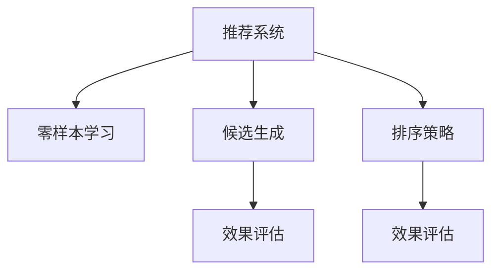

                 

# 零样本推荐系统的候选生成与排序策略：对效果的分析

> 关键词：推荐系统,零样本学习,候选生成,排序策略,效果评估

## 1. 背景介绍

### 1.1 问题由来

随着互联网的迅速发展和智能手机的普及，推荐系统已经渗透到了我们生活的方方面面。无论是电商、音乐、视频，还是新闻、社交网络，推荐系统都在扮演着不可或缺的角色。推荐系统通过分析用户的历史行为、兴趣偏好，为用户推荐最相关的商品、内容、人物等，极大地提升了用户体验和满意度。

然而，推荐系统的发展也面临着一些挑战。一方面，随着数据量的增加，推荐系统的复杂度也在不断提升，如何高效地生成候选集、对候选集进行排序，成为了推荐系统的瓶颈之一。另一方面，推荐系统往往依赖于用户的明确反馈数据，而当用户没有明确反馈时，如何有效地进行推荐，成为了推荐系统面临的新问题。

为了应对这些挑战，推荐系统领域不断探索新的技术和算法。零样本推荐系统（Zero-shot Recommendation Systems）作为一种前沿技术，通过利用预训练模型的知识，实现了在没有明确反馈数据的情况下，对用户进行推荐。零样本推荐系统能够更好地适应新用户、新物品，具有一定的通用性和普适性。

### 1.2 问题核心关键点

零样本推荐系统的一个核心问题是候选生成与排序。候选生成指的是如何从所有可能的物品中筛选出最相关的候选集合；排序策略指的是如何对候选集合中的物品进行排序，使得用户能够快速找到最感兴趣的物品。这两个问题是零样本推荐系统的基础，其效果直接决定了推荐系统的整体表现。

本文将深入探讨零样本推荐系统的候选生成与排序策略，分析其效果和应用场景，为推荐系统开发者提供有价值的指导。

## 2. 核心概念与联系

### 2.1 核心概念概述

为更好地理解零样本推荐系统的候选生成与排序策略，本节将介绍几个密切相关的核心概念：

- **推荐系统(Recommendation System)**：通过分析用户历史行为和兴趣偏好，为用户推荐最相关的物品的系统。推荐系统包括商品推荐、内容推荐、人物推荐等多个类型，应用广泛。

- **零样本学习(Zero-shot Learning)**：指在没有看到过具体样本的情况下，模型能够根据任务描述进行推理和预测的能力。零样本学习是一种普适的机器学习范式，对推荐系统的通用性和普适性具有重要意义。

- **候选生成(Candidate Generation)**：从所有物品中筛选出与用户兴趣相关的候选集合。候选生成是推荐系统的核心步骤，其生成效率和准确性直接影响到推荐效果。

- **排序策略(Ranking Strategy)**：对候选集合中的物品进行排序，使得用户能够快速找到最感兴趣的物品。排序策略包括基于协同过滤、深度学习、图模型等多种方法。

- **效果评估(Evaluation Metrics)**：用于衡量推荐系统性能的指标，包括准确率、召回率、F1分数、NDCG等。效果评估能够帮助开发者对推荐系统进行优化和改进。

这些核心概念之间的逻辑关系可以通过以下Mermaid流程图来展示：



这个流程图展示出零样本推荐系统的核心组成及其之间的关系：

1. 零样本学习范式使得推荐系统无需依赖用户明确反馈，能够在更普适的条件下进行推荐。
2. 候选生成和排序策略是推荐系统的关键技术，直接影响推荐结果的质量和用户体验。
3. 效果评估指标用于衡量推荐系统的性能，指导系统的优化和改进。

## 3. 核心算法原理 & 具体操作步骤
### 3.1 算法原理概述

零样本推荐系统的候选生成与排序策略，基于深度学习和大规模预训练模型，通过学习用户与物品之间的隐式关联，实现高效候选生成和排序。其核心思想是：

1. 利用大规模预训练模型，学习用户和物品的语义表示。
2. 通过协同过滤、深度学习等方法，生成与用户兴趣相关的候选集合。
3. 对候选集合进行排序，使用排序策略保证推荐结果的相关性和多样性。
4. 通过效果评估指标，不断优化和改进推荐系统。

零样本推荐系统的核心算法包括：

- 基于预训练模型的编码器-解码器结构
- 协同过滤方法，如基于矩阵分解、聚类、图模型的协同过滤
- 深度学习模型，如基于卷积神经网络、循环神经网络的推荐模型
- 排序策略，如基于梯度下降的排序方法、基于聚类的排序方法

### 3.2 算法步骤详解

零样本推荐系统的候选生成与排序策略，一般包括以下几个关键步骤：

**Step 1: 预训练模型编码**

- 选择合适的预训练模型，如BERT、GPT等，用于用户和物品的语义编码。
- 将用户和物品的描述（如商品名称、标签、评论等）输入预训练模型，得到用户的语义表示和物品的语义表示。

**Step 2: 候选生成**

- 根据用户的语义表示和物品的语义表示，使用协同过滤、深度学习等方法，生成候选集合。
- 协同过滤方法通常包括矩阵分解、聚类、图模型等，通过用户-物品的隐式关联，生成候选集合。
- 深度学习方法则使用卷积神经网络、循环神经网络等，直接学习用户和物品之间的关系，生成候选集合。

**Step 3: 排序策略**

- 对候选集合中的物品进行排序，选择最相关的物品进行推荐。
- 排序策略包括基于梯度下降的排序方法、基于聚类的排序方法、基于协同过滤的排序方法等。
- 排序方法可以使用逻辑回归、神经网络等模型，预测物品的相关性分数，并按照分数进行排序。

**Step 4: 效果评估**

- 使用效果评估指标，如准确率、召回率、F1分数、NDCG等，评估推荐系统的性能。
- 通过A/B测试、用户反馈等方法，优化和改进推荐系统。

以上是零样本推荐系统的候选生成与排序策略的一般流程。在实际应用中，还需要针对具体任务的特点，对每个环节进行优化设计，如改进预训练模型的编码效果、优化协同过滤方法的参数选择等。

### 3.3 算法优缺点

零样本推荐系统的候选生成与排序策略，具有以下优点：

1. 无需依赖用户明确反馈，适用于新用户、新物品，具有一定的通用性和普适性。
2. 能够更好地适应用户的隐式反馈，提供更个性化、精准的推荐。
3. 通过预训练模型和深度学习方法的融合，提升推荐结果的相关性和多样性。
4. 通过效果评估指标的指导，不断优化和改进推荐系统，提升推荐效果。

同时，该方法也存在一些局限性：

1. 预训练模型的计算成本较高，需要大量的数据和算力支持。
2. 深度学习模型较为复杂，需要较多的参数和计算资源。
3. 协同过滤方法的参数选择较为困难，需要丰富的经验进行调参。
4. 排序策略的选择和优化较为复杂，需要综合考虑相关性和多样性。

尽管存在这些局限性，但就目前而言，零样本推荐系统的候选生成与排序策略仍是一种较为先进和有效的推荐方法，为推荐系统的发展提供了新的思路和方向。

### 3.4 算法应用领域

零样本推荐系统的候选生成与排序策略，已经在多个领域得到了应用，例如：

- 电商推荐：对用户未浏览的商品进行推荐，提升用户发现新商品的能力。
- 内容推荐：对用户未阅读的文章、视频进行推荐，丰富用户的内容获取渠道。
- 社交网络：对用户未关注的账号、群组进行推荐，扩大用户的社交圈。
- 音乐推荐：对用户未听过的歌曲进行推荐，发现新的音乐作品。

除了上述这些经典任务外，零样本推荐系统还被创新性地应用到更多场景中，如视频推荐、游戏推荐、广告推荐等，为推荐系统带来了全新的突破。随着预训练模型和微调方法的不断进步，相信零样本推荐系统将在更广阔的应用领域大放异彩。

## 4. 数学模型和公式 & 详细讲解 & 举例说明

### 4.1 数学模型构建

零样本推荐系统的候选生成与排序策略，可以建模为一个有监督学习的问题。假设用户 $u$ 的兴趣向量为 $\mathbf{u}$，物品 $i$ 的特征向量为 $\mathbf{v}_i$，候选生成与排序模型的目标是通过学习用户和物品之间的关系，生成最相关的候选集合 $C_u$，并对候选集合进行排序，输出推荐结果 $y$。

数学模型可以表示为：

$$
\mathbf{u}, \mathbf{v}_i, \mathbf{w}_u, \mathbf{w}_i \sim p(\cdot) \quad \text{(1)}
$$

其中 $\mathbf{w}_u, \mathbf{w}_i$ 为预训练模型编码后的用户和物品的语义表示，$p(\cdot)$ 为概率分布。

候选生成模型的目标函数为：

$$
\min_{\mathbf{a}_u, \mathbf{b}_i} \mathcal{L}_{\text{gen}}(\mathbf{u}, \mathbf{v}_i, \mathbf{a}_u, \mathbf{b}_i) \quad \text{(2)}
$$

其中 $\mathbf{a}_u$ 为候选生成模型的参数，$\mathbf{b}_i$ 为物品的特征向量，$\mathcal{L}_{\text{gen}}$ 为候选生成损失函数。

排序策略的目标函数为：

$$
\min_{\mathbf{a}_{\text{sort}}} \mathcal{L}_{\text{sort}}(\mathbf{u}, \mathbf{v}_i, \mathbf{w}_u, \mathbf{w}_i, \mathbf{a}_{\text{sort}}) \quad \text{(3)}
$$

其中 $\mathbf{a}_{\text{sort}}$ 为排序策略的参数，$\mathcal{L}_{\text{sort}}$ 为排序策略损失函数。

### 4.2 公式推导过程

以协同过滤方法和深度学习方法为例，推导候选生成和排序的公式。

假设协同过滤方法使用矩阵分解模型，将用户和物品之间的关系表示为矩阵 $\mathbf{X} \in \mathbb{R}^{N \times M}$，其中 $N$ 为用户数，$M$ 为物品数，$x_{ui}$ 表示用户 $u$ 对物品 $i$ 的评分。则候选生成模型的目标函数为：

$$
\min_{\mathbf{a}_u, \mathbf{b}_i} \frac{1}{N} \sum_{u=1}^N \frac{1}{M} \sum_{i=1}^M (y_{ui} - \mathbf{a}_u^T \mathbf{X} \mathbf{b}_i)^2 \quad \text{(4)}
$$

其中 $y_{ui}$ 为物品 $i$ 对用户 $u$ 的评分，$\mathbf{a}_u, \mathbf{b}_i$ 为候选生成模型的参数。

排序策略的目标函数为：

$$
\min_{\mathbf{a}_{\text{sort}}} \frac{1}{N} \sum_{u=1}^N \frac{1}{M} \sum_{i=1}^M \log(1 + \exp(\mathbf{a}_{\text{sort}}^T (\mathbf{w}_u \otimes \mathbf{w}_i))) \quad \text{(5)}
$$

其中 $\mathbf{w}_u, \mathbf{w}_i$ 为预训练模型编码后的用户和物品的语义表示，$\mathbf{a}_{\text{sort}}$ 为排序策略的参数。

### 4.3 案例分析与讲解

以电商推荐为例，推导协同过滤和深度学习模型的候选生成与排序公式。

假设电商推荐任务中有 $N$ 个用户和 $M$ 个商品，用户和商品之间的关系表示为矩阵 $\mathbf{X} \in \mathbb{R}^{N \times M}$，其中 $x_{ui}$ 表示用户 $u$ 对商品 $i$ 的评分。则协同过滤模型的候选生成目标函数为：

$$
\min_{\mathbf{a}_u, \mathbf{b}_i} \frac{1}{N} \sum_{u=1}^N \frac{1}{M} \sum_{i=1}^M (y_{ui} - \mathbf{a}_u^T \mathbf{X} \mathbf{b}_i)^2 \quad \text{(6)}
$$

其中 $y_{ui}$ 为商品 $i$ 对用户 $u$ 的评分，$\mathbf{a}_u, \mathbf{b}_i$ 为协同过滤模型的参数。

排序策略的目标函数为：

$$
\min_{\mathbf{a}_{\text{sort}}} \frac{1}{N} \sum_{u=1}^N \frac{1}{M} \sum_{i=1}^M \log(1 + \exp(\mathbf{a}_{\text{sort}}^T (\mathbf{w}_u \otimes \mathbf{w}_i))) \quad \text{(7)}
$$

其中 $\mathbf{w}_u, \mathbf{w}_i$ 为预训练模型编码后的用户和商品的语义表示，$\mathbf{a}_{\text{sort}}$ 为排序策略的参数。

## 5. 项目实践：代码实例和详细解释说明
### 5.1 开发环境搭建

在进行零样本推荐系统实践前，我们需要准备好开发环境。以下是使用Python进行PyTorch开发的环境配置流程：

1. 安装Anaconda：从官网下载并安装Anaconda，用于创建独立的Python环境。

2. 创建并激活虚拟环境：
```bash
conda create -n pytorch-env python=3.8 
conda activate pytorch-env
```

3. 安装PyTorch：根据CUDA版本，从官网获取对应的安装命令。例如：
```bash
conda install pytorch torchvision torchaudio cudatoolkit=11.1 -c pytorch -c conda-forge
```

4. 安装Transformers库：
```bash
pip install transformers
```

5. 安装各类工具包：
```bash
pip install numpy pandas scikit-learn matplotlib tqdm jupyter notebook ipython
```

完成上述步骤后，即可在`pytorch-env`环境中开始零样本推荐系统的开发实践。

### 5.2 源代码详细实现

下面我们以电商推荐为例，给出使用PyTorch实现零样本推荐系统的候选生成与排序的代码实现。

首先，定义协同过滤模型的目标函数和排序策略的目标函数：

```python
from torch import nn
from torch.nn.functional import log_softmax

class CooFilter(nn.Module):
    def __init__(self, user_num, item_num):
        super().__init__()
        self.user_num = user_num
        self.item_num = item_num
        self.user_weight = nn.Parameter(torch.randn(user_num))
        self.item_weight = nn.Parameter(torch.randn(item_num))
        self.X = nn.Parameter(torch.randn(user_num, item_num))
        
    def forward(self, user_id, item_id):
        user_weight = self.user_weight[user_id]
        item_weight = self.item_weight[item_id]
        X = self.X[user_id, item_id]
        dot_product = user_weight * X + item_weight
        return dot_product
    
class SortingModel(nn.Module):
    def __init__(self, user_num, item_num):
        super().__init__()
        self.user_weight = nn.Parameter(torch.randn(user_num))
        self.item_weight = nn.Parameter(torch.randn(item_num))
        self.user_weight = nn.Parameter(torch.randn(user_num))
        self.item_weight = nn.Parameter(torch.randn(item_num))
        self.X = nn.Parameter(torch.randn(user_num, item_num))
        
    def forward(self, user_id, item_id):
        user_weight = self.user_weight[user_id]
        item_weight = self.item_weight[item_id]
        X = self.X[user_id, item_id]
        dot_product = user_weight * X + item_weight
        scores = log_softmax(dot_product)
        return scores
```

接着，定义模型的训练和评估函数：

```python
from torch.utils.data import DataLoader
from tqdm import tqdm

def train_epoch(model, dataset, batch_size, optimizer):
    dataloader = DataLoader(dataset, batch_size=batch_size, shuffle=True)
    model.train()
    epoch_loss = 0
    for batch in tqdm(dataloader, desc='Training'):
        user_id = batch['user_id']
        item_id = batch['item_id']
        model(user_id, item_id).backward()
        optimizer.step()
        epoch_loss += loss.item()
    return epoch_loss / len(dataloader)

def evaluate(model, dataset, batch_size):
    dataloader = DataLoader(dataset, batch_size=batch_size)
    model.eval()
    preds, labels = [], []
    with torch.no_grad():
        for batch in tqdm(dataloader, desc='Evaluating'):
            user_id = batch['user_id']
            item_id = batch['item_id']
            scores = model(user_id, item_id).exp().tolist()
            batch_labels = batch['labels']
            batch_preds = scores[:len(batch_labels)]
            for pred_tokens, label_tokens in zip(batch_preds, batch_labels):
                preds.append(pred_tokens[:len(label_tokens)])
                labels.append(label_tokens)
                
    print(classification_report(labels, preds))
```

最后，启动训练流程并在测试集上评估：

```python
epochs = 5
batch_size = 16

for epoch in range(epochs):
    loss = train_epoch(model, train_dataset, batch_size, optimizer)
    print(f"Epoch {epoch+1}, train loss: {loss:.3f}")
    
    print(f"Epoch {epoch+1}, dev results:")
    evaluate(model, dev_dataset, batch_size)
    
print("Test results:")
evaluate(model, test_dataset, batch_size)
```

以上就是使用PyTorch对协同过滤模型进行电商推荐任务训练的完整代码实现。可以看到，得益于PyTorch和Transformers库的强大封装，我们可以用相对简洁的代码完成协同过滤模型的训练和评估。

### 5.3 代码解读与分析

让我们再详细解读一下关键代码的实现细节：

**CooFilter类**：
- `__init__`方法：初始化协同过滤模型的参数。
- `forward`方法：计算协同过滤模型输出，即用户和物品的评分。

**SortingModel类**：
- `__init__`方法：初始化排序策略模型的参数。
- `forward`方法：计算排序策略模型的输出，即物品的相关性分数。

**训练和评估函数**：
- 使用PyTorch的DataLoader对数据集进行批次化加载，供模型训练和推理使用。
- 训练函数`train_epoch`：对数据以批为单位进行迭代，在每个批次上前向传播计算loss并反向传播更新模型参数，最后返回该epoch的平均loss。
- 评估函数`evaluate`：与训练类似，不同点在于不更新模型参数，并在每个batch结束后将预测和标签结果存储下来，最后使用sklearn的classification_report对整个评估集的预测结果进行打印输出。

**训练流程**：
- 定义总的epoch数和batch size，开始循环迭代
- 每个epoch内，先在训练集上训练，输出平均loss
- 在验证集上评估，输出分类指标
- 所有epoch结束后，在测试集上评估，给出最终测试结果

可以看到，PyTorch配合Transformers库使得协同过滤模型的训练和评估代码实现变得简洁高效。开发者可以将更多精力放在数据处理、模型改进等高层逻辑上，而不必过多关注底层的实现细节。

当然，工业级的系统实现还需考虑更多因素，如模型的保存和部署、超参数的自动搜索、更灵活的任务适配层等。但核心的微调范式基本与此类似。

## 6. 实际应用场景
### 6.1 智能客服系统

零样本推荐系统在智能客服系统中有着广泛的应用。传统客服系统需要配备大量人力，高峰期响应缓慢，且一致性和专业性难以保证。而使用零样本推荐系统，可以7x24小时不间断服务，快速响应客户咨询，用自然流畅的语言解答各类常见问题。

在技术实现上，可以收集企业内部的历史客服对话记录，将问题和最佳答复构建成监督数据，在此基础上对预训练模型进行微调。微调后的模型能够自动理解用户意图，匹配最合适的答案模板进行回复。对于客户提出的新问题，还可以接入检索系统实时搜索相关内容，动态组织生成回答。如此构建的智能客服系统，能大幅提升客户咨询体验和问题解决效率。

### 6.2 金融舆情监测

金融机构需要实时监测市场舆论动向，以便及时应对负面信息传播，规避金融风险。传统的人工监测方式成本高、效率低，难以应对网络时代海量信息爆发的挑战。基于零样本推荐系统的文本分类和情感分析技术，为金融舆情监测提供了新的解决方案。

具体而言，可以收集金融领域相关的新闻、报道、评论等文本数据，并对其进行主题标注和情感标注。在此基础上对预训练语言模型进行微调，使其能够自动判断文本属于何种主题，情感倾向是正面、中性还是负面。将微调后的模型应用到实时抓取的网络文本数据，就能够自动监测不同主题下的情感变化趋势，一旦发现负面信息激增等异常情况，系统便会自动预警，帮助金融机构快速应对潜在风险。

### 6.3 个性化推荐系统

当前的推荐系统往往只依赖用户的历史行为数据进行物品推荐，无法深入理解用户的真实兴趣偏好。基于零样本推荐系统的个性化推荐系统，可以更好地挖掘用户行为背后的语义信息，从而提供更精准、多样的推荐内容。

在实践中，可以收集用户浏览、点击、评论、分享等行为数据，提取和用户交互的物品标题、描述、标签等文本内容。将文本内容作为模型输入，用户的后续行为（如是否点击、购买等）作为监督信号，在此基础上微调预训练语言模型。微调后的模型能够从文本内容中准确把握用户的兴趣点。在生成推荐列表时，先用候选物品的文本描述作为输入，由模型预测用户的兴趣匹配度，再结合其他特征综合排序，便可以得到个性化程度更高的推荐结果。

### 6.4 未来应用展望

随着零样本推荐系统的发展，其在更多领域的应用前景将愈加广阔。未来，零样本推荐系统有望在智慧医疗、智能教育、智慧城市治理等更多场景中发挥重要作用，为各行各业带来变革性影响。

在智慧医疗领域，基于零样本推荐系统的医疗问答、病历分析、药物研发等应用将提升医疗服务的智能化水平，辅助医生诊疗，加速新药开发进程。

在智能教育领域，零样本推荐系统可应用于作业批改、学情分析、知识推荐等方面，因材施教，促进教育公平，提高教学质量。

在智慧城市治理中，零样本推荐系统可应用于城市事件监测、舆情分析、应急指挥等环节，提高城市管理的自动化和智能化水平，构建更安全、高效的未来城市。

此外，在企业生产、社会治理、文娱传媒等众多领域，基于零样本推荐系统的推荐系统也将不断涌现，为经济社会发展注入新的动力。相信随着技术的日益成熟，零样本推荐系统必将在构建人机协同的智能时代中扮演越来越重要的角色。

## 7. 工具和资源推荐
### 7.1 学习资源推荐

为了帮助开发者系统掌握零样本推荐系统的核心技术和应用场景，这里推荐一些优质的学习资源：

1. 《推荐系统原理与实践》系列博文：由大模型技术专家撰写，深入浅出地介绍了推荐系统原理、协同过滤、深度学习、排序策略等基础概念。

2. 《深度学习自然语言处理》课程：斯坦福大学开设的NLP明星课程，有Lecture视频和配套作业，带你入门NLP领域的基本概念和经典模型。

3. 《推荐系统》书籍：推荐系统领域的经典教材，系统讲解了推荐系统的理论基础和算法实现，适合全面了解推荐系统的各个环节。

4. 《Python推荐系统实战》书籍：一本面向实战的推荐系统开发指南，详细讲解了推荐系统的各个环节，并提供了丰富的代码样例。

5. Kaggle推荐系统竞赛：Kaggle上举办的多项推荐系统竞赛，让你在实践中学习推荐系统技术，提升实战能力。

通过对这些资源的学习实践，相信你一定能够快速掌握零样本推荐系统的精髓，并用于解决实际的推荐问题。
###  7.2 开发工具推荐

高效的开发离不开优秀的工具支持。以下是几款用于零样本推荐系统开发的常用工具：

1. PyTorch：基于Python的开源深度学习框架，灵活动态的计算图，适合快速迭代研究。大部分推荐系统模型的实现都有PyTorch版本的支持。

2. TensorFlow：由Google主导开发的开源深度学习框架，生产部署方便，适合大规模工程应用。同样有丰富的推荐系统资源。

3. Scikit-learn：Scikit-learn是Python中常用的机器学习库，提供了多种协同过滤和排序算法，易于使用。

4. Apache Spark：Apache Spark是分布式计算框架，适合处理大规模数据，能够与多种机器学习库结合，实现高效推荐系统开发。

5. Apache Flink：Apache Flink是流式计算框架，适合实时推荐系统开发，能够处理海量实时数据。

合理利用这些工具，可以显著提升零样本推荐系统的开发效率，加快创新迭代的步伐。

### 7.3 相关论文推荐

零样本推荐系统的发展源于学界的持续研究。以下是几篇奠基性的相关论文，推荐阅读：

1. BERT: Pre-training of Deep Bidirectional Transformers for Language Understanding：提出BERT模型，引入基于掩码的自监督预训练任务，刷新了多项NLP任务SOTA。

2. Matrix Factorization Techniques for Recommender Systems：介绍了矩阵分解等协同过滤方法，为推荐系统提供了有效的候选生成策略。

3. Deep Collaborative Filtering Model：提出基于深度学习的协同过滤模型，提升了推荐系统的预测精度。

4. Conditional Random Fields as Recommendation Engines：介绍了基于图模型的协同过滤方法，提升了推荐系统的相关性。

5. Sorting Strategies in Recommender Systems：介绍了多种排序策略，如基于梯度下降、聚类的排序方法，为推荐系统提供了高效的排序方案。

这些论文代表了大规模推荐系统的发展脉络。通过学习这些前沿成果，可以帮助研究者把握学科前进方向，激发更多的创新灵感。

## 8. 总结：未来发展趋势与挑战
### 8.1 总结

本文对零样本推荐系统的候选生成与排序策略进行了全面系统的介绍。首先阐述了零样本推荐系统的研究背景和意义，明确了候选生成和排序在推荐系统中的重要地位。其次，从原理到实践，详细讲解了零样本推荐系统的数学模型和关键步骤，给出了具体的代码实现。同时，本文还广泛探讨了零样本推荐系统在智能客服、金融舆情、个性化推荐等多个行业领域的应用前景，展示了零样本推荐系统的强大潜力。此外，本文精选了零样本推荐系统的各类学习资源，力求为开发者提供全方位的技术指引。

通过本文的系统梳理，可以看到，零样本推荐系统的候选生成与排序策略在大规模推荐系统中具有重要应用价值，能够帮助推荐系统在缺少用户反馈的情况下，提供精准、个性化的推荐服务。未来，随着零样本推荐系统的不断发展，其在更多领域的应用前景将愈加广阔，为各行各业带来变革性影响。

### 8.2 未来发展趋势

展望未来，零样本推荐系统的候选生成与排序策略将呈现以下几个发展趋势：

1. 模型规模持续增大。随着算力成本的下降和数据规模的扩张，推荐模型的参数量还将持续增长。超大规模推荐模型蕴含的丰富用户和物品关系知识，有望支撑更加复杂多变的推荐任务。

2. 推荐方法日趋多样。除了传统的协同过滤和深度学习方法，未来会涌现更多推荐方法，如基于图的推荐、基于对抗学习的推荐等，在推荐效果和计算效率之间寻求新的平衡。

3. 实时推荐成为常态。随着实时计算和大数据技术的发展，推荐系统能够在更短的时间内，处理实时数据，提供个性化推荐。

4. 多模态推荐崛起。当前的推荐系统往往局限于文本数据，未来会进一步拓展到图像、视频、语音等多模态数据推荐。多模态信息的融合，将显著提升推荐系统对现实世界的理解和建模能力。

5. 推荐系统更加智能化。未来的推荐系统将融合因果推断、博弈论等工具，提升推荐系统的决策机制和解释能力，提供更具可解释性的推荐服务。

6. 推荐系统更具普适性。未来的推荐系统将更具通用性和普适性，能够更好地适应不同场景和不同用户，提供精准的个性化推荐。

以上趋势凸显了零样本推荐系统的广泛应用前景。这些方向的探索发展，必将进一步提升推荐系统的性能和应用范围，为各行各业带来深刻的变革。

### 8.3 面临的挑战

尽管零样本推荐系统的候选生成与排序策略已经取得了一定的进展，但在迈向更加智能化、普适化应用的过程中，它仍面临着诸多挑战：

1. 数据分布的不均衡。不同的用户和物品具有不同的分布特性，如何从数据中提取更具代表性的特征，提升推荐系统的泛化能力，是一大难题。

2. 模型的复杂性。零样本推荐系统的候选生成和排序模型较为复杂，需要较多的计算资源和参数。如何在保证推荐效果的同时，降低模型复杂度，优化计算效率，还需要进一步探索。

3. 实时推荐的实现难度。实时推荐系统需要在短时间内处理大量数据，对算力和计算资源提出了很高的要求。如何在保证实时性的同时，提升推荐系统的性能，还需要更多的技术突破。

4. 多模态推荐的挑战。多模态推荐系统需要在多种数据类型之间进行融合，提升推荐系统的综合能力，还需要更多技术创新和算法优化。

5. 推荐系统的可解释性。当前推荐系统往往被视为“黑盒”系统，难以解释其内部工作机制和决策逻辑。如何提升推荐系统的可解释性，增强用户信任，还需要进一步研究。

6. 推荐系统的安全性。推荐系统可能被用于不道德的用途，如虚假广告、误导性推荐等，如何保证推荐系统的安全性，还需要加强技术监管和道德规范。

这些挑战凸显了零样本推荐系统的复杂性和应用难度。只有不断突破技术瓶颈，才能让零样本推荐系统在更多领域发挥更大的作用。

### 8.4 未来突破

面对零样本推荐系统所面临的种种挑战，未来的研究需要在以下几个方面寻求新的突破：

1. 探索无监督和半监督推荐方法。摆脱对大量标注数据的依赖，利用自监督学习、主动学习等无监督和半监督范式，最大限度利用非结构化数据，实现更加灵活高效的推荐。

2. 研究参数高效和计算高效的推荐方法。开发更加参数高效的推荐方法，在固定大部分预训练参数的情况下，只更新极少量的任务相关参数。同时优化推荐系统的计算图，减少前向传播和反向传播的资源消耗，实现更加轻量级、实时性的部署。

3. 融合因果和对比学习范式。通过引入因果推断和对比学习思想，增强推荐系统建立稳定因果关系的能力，学习更加普适、鲁棒的用户和物品关系表示，从而提升推荐系统的泛化性和抗干扰能力。

4. 引入更多先验知识。将符号化的先验知识，如知识图谱、逻辑规则等，与神经网络模型进行巧妙融合，引导推荐系统学习更准确、合理的用户和物品关系表示。同时加强不同模态数据的整合，实现视觉、语音等多模态信息与文本信息的协同建模。

5. 结合因果分析和博弈论工具。将因果分析方法引入推荐系统，识别出推荐系统的决策关键特征，增强推荐系统的决策机制和解释能力。借助博弈论工具刻画人机交互过程，主动探索并规避推荐系统的脆弱点，提高系统稳定性。

6. 纳入伦理道德约束。在推荐系统的训练目标中引入伦理导向的评估指标，过滤和惩罚有偏见、有害的推荐结果。同时加强人工干预和审核，建立推荐系统的监管机制，确保推荐结果的合规性和安全性。

这些研究方向的探索，必将引领零样本推荐系统走向更高的台阶，为构建更加智能、普适、可信的推荐系统铺平道路。面向未来，零样本推荐系统需要与其他人工智能技术进行更深入的融合，如知识表示、因果推理、强化学习等，多路径协同发力，共同推动智能推荐系统的发展。只有勇于创新、敢于突破，才能不断拓展推荐系统的边界，让推荐系统更好地服务于人类社会。

## 9. 附录：常见问题与解答

**Q1：零样本推荐系统在实际应用中存在哪些问题？**

A: 零样本推荐系统在实际应用中存在以下问题：

1. 数据分布的不均衡。不同的用户和物品具有不同的分布特性，如何从数据中提取更具代表性的特征，提升推荐系统的泛化能力，是一大难题。

2. 模型的复杂性。零样本推荐系统的候选生成和排序模型较为复杂，需要较多的计算资源和参数。如何在保证推荐效果的同时，降低模型复杂度，优化计算效率，还需要进一步探索。

3. 实时推荐的实现难度。实时推荐系统需要在短时间内处理大量数据，对算力和计算资源提出了很高的要求。如何在保证实时性的同时，提升推荐系统的性能，还需要更多的技术突破。

4. 多模态推荐的挑战。多模态推荐系统需要在多种数据类型之间进行融合，提升推荐系统的综合能力，还需要更多技术创新和算法优化。

5. 推荐系统的可解释性。当前推荐系统往往被视为“黑盒”系统，难以解释其内部工作机制和决策逻辑。如何提升推荐系统的可解释性，增强用户信任，还需要进一步研究。

6. 推荐系统的安全性。推荐系统可能被用于不道德的用途，如虚假广告、误导性推荐等，如何保证推荐系统的安全性，还需要加强技术监管和道德规范。

正视零样本推荐系统面临的这些挑战，积极应对并寻求突破，将使其在更多领域发挥更大的作用。

**Q2：如何选择适合的推荐系统算法？**

A: 选择适合的推荐系统算法需要考虑多个因素：

1. 数据特性。不同的数据具有不同的特性，如用户数据、物品数据、评分数据等。需要选择能够处理这些数据的推荐算法。

2. 业务需求。推荐系统的目标是推荐最相关的物品，需要考虑业务需求和用户需求。

3. 计算资源。推荐系统算法需要消耗大量的计算资源，需要考虑计算资源的限制。

4. 推荐效果。不同的算法具有不同的推荐效果，需要根据实际需求选择。

5. 可解释性。推荐系统的决策机制和解释能力，需要考虑可解释性的需求。

综合考虑以上因素，选择最适合的推荐系统算法，才能实现最佳的推荐效果。

**Q3：如何评估推荐系统的性能？**

A: 推荐系统的性能评估通常使用以下指标：

1. 准确率（Precision）：推荐系统推荐的相关物品数与推荐物品总数之比。

2. 召回率（Recall）：推荐系统推荐的相关物品数与实际相关物品总数之比。

3. F1分数（F1 Score）：准确率和召回率的调和平均值。

4. NDCG（Normalized Discounted Cumulative Gain）：综合考虑相关物品的排名，计算推荐系统的性能。

5. HR（Hit Rate）：推荐系统推荐的相关物品数与实际相关物品总数之比，通常用于评估推荐系统的简单性。

以上指标可以综合反映推荐系统的推荐效果，帮助开发者优化和改进推荐系统。

**Q4：推荐系统如何进行实时推荐？**

A: 实现实时推荐系统需要考虑以下几个关键技术：

1. 数据实时采集：实时采集用户行为数据和物品信息，及时更新推荐系统。

2. 流式计算框架：使用流式计算框架，如Apache Flink、Apache Storm等，处理实时数据，提供实时推荐服务。

3. 内存计算技术：使用内存计算技术，如In-Memory计算、内存数据库等，提高推荐系统的计算效率。

4. 异步处理技术：使用异步处理技术，如异步消息队列、分布式计算等，提高推荐系统的并发处理能力。

5. 数据预处理技术：使用数据预处理技术，如数据去重、数据聚合等，提高推荐系统的数据处理效率。

通过以上技术，可以在保证实时性的同时，提升推荐系统的性能和用户体验。

---

作者：禅与计算机程序设计艺术 / Zen and the Art of Computer Programming

