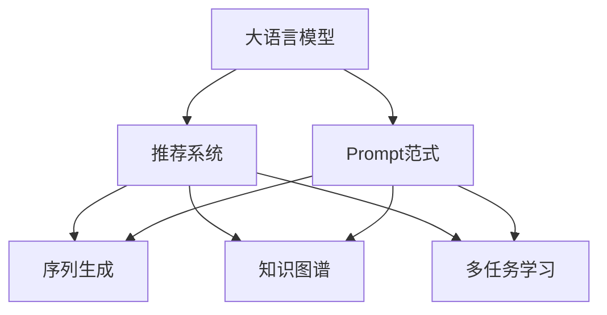

                 

# 面向不同推荐任务的大模型Prompt范式总结

> 关键词：大语言模型,Prompt范式,推荐系统,序列生成,知识图谱,优化技巧,应用案例

## 1. 背景介绍

### 1.1 问题由来
推荐系统在现代互联网产品中扮演着越来越重要的角色。从电商平台的商品推荐，到视频网站的个性化视频推荐，再到社交平台的内容推荐，推荐系统已经渗透到了生活的方方面面。推荐系统利用用户的浏览记录、评分反馈、社交关系等数据，为用户推荐感兴趣的内容，提升用户体验和满意度。

然而，构建一个高效的推荐系统，其复杂度与数据多样性、用户行为多变性成正比。传统的基于协同过滤和矩阵分解的推荐方法，在面对大规模高维稀疏数据时，往往效果有限，且难以解释推荐逻辑。近年来，大语言模型在推荐系统中的应用逐渐显现，为推荐系统提供了新的突破口。

### 1.2 问题核心关键点
面向不同推荐任务的大模型Prompt范式，主要关注如何利用预训练语言模型，通过精细化的Prompt设计，实现对推荐场景的适配和优化。该方法的核心在于：
1. 利用大模型强大的语言理解和生成能力，在少样本甚至零样本的情况下，实现高质量的推荐。
2. 设计合适的Prompt模板，引导模型输出符合推荐任务的目标特征。
3. 探索不同的Prompt范式，提升模型的参数效率和可解释性。

本文将系统介绍面向不同推荐任务的大模型Prompt范式，包括序列生成、知识图谱、多任务学习等应用场景的Prompt设计技巧，并结合实例详细讲解。

## 2. 核心概念与联系

### 2.1 核心概念概述

为更好地理解面向不同推荐任务的大模型Prompt范式，本节将介绍几个密切相关的核心概念：

- 大语言模型(Large Language Model, LLM)：以自回归(如GPT)或自编码(如BERT)模型为代表的大规模预训练语言模型。通过在大规模无标签文本语料上进行预训练，学习通用的语言表示，具备强大的语言理解和生成能力。

- Prompt范式：在自然语言处理领域，通过精心设计输入文本的格式，引导模型按照期望的方式输出，以优化模型的性能。这种方法常用于零样本学习和少样本学习，尤其是在推荐系统中，可以帮助模型快速适应新的推荐任务。

- 推荐系统(Recommender System)：利用用户的过往行为数据，为用户推荐感兴趣的内容。传统推荐方法包括协同过滤、矩阵分解、基于内容的推荐等，但均存在不同程度的不足。大模型 Prompt范式提供了一种新的推荐范式，通过构建更合理的Prompt，提升推荐效果。

- 序列生成(Sequence Generation)：利用大模型生成序列数据，如推荐物品的评分序列、文本摘要序列等。序列生成是推荐系统中的一种重要任务，通过设计合适的Prompt，模型可以更准确地生成推荐序列。

- 知识图谱(Knowledge Graph)：由节点和边构成的图结构数据，用于表示实体和实体间的关系。在推荐系统中，知识图谱可以用于构建推荐路径，提升推荐的准确性。

- 多任务学习(Multi-task Learning)：在多个相关任务上进行联合训练，通过共享模型参数提升各个任务的性能。在推荐系统中，可以利用多任务学习，提升模型的泛化能力和参数利用效率。

这些核心概念之间的逻辑关系可以通过以下Mermaid流程图来展示：



这个流程图展示了大语言模型与Prompt范式在推荐系统中的集成关系：

1. 大语言模型通过预训练获得基础能力。
2. 通过Prompt范式，模型能够快速适应各种推荐任务，生成高质量的推荐序列、路径等。
3. 知识图谱和多任务学习为Prompt范式提供了额外的信息源，进一步提升了推荐性能。

## 3. 核心算法原理 & 具体操作步骤
### 3.1 算法原理概述

面向不同推荐任务的大模型Prompt范式，本质上是一种基于语言理解的推荐方法。其核心思想是：通过精心设计的Prompt模板，将推荐任务映射到语言模型，利用语言模型生成符合推荐目标的序列或路径。

具体而言，假设预训练语言模型为 $M_{\theta}$，其中 $\theta$ 为预训练得到的模型参数。推荐任务 $T$ 的Prompt模板为 $P$。则推荐过程可以表示为：

$$
M_{\theta}(P) = [r_1, r_2, \dots, r_n]
$$

其中 $r_i$ 表示推荐物品 $i$ 的评分或相关度。因此，推荐系统的任务即为最大化 $M_{\theta}(P)$，以得到最优推荐结果。

### 3.2 算法步骤详解

面向不同推荐任务的大模型Prompt范式，一般包括以下几个关键步骤：

**Step 1: 准备预训练模型和数据集**
- 选择合适的预训练语言模型 $M_{\theta}$ 作为初始化参数，如 BERT、GPT 等。
- 准备推荐系统的数据集 $D=\{(x_i, y_i)\}_{i=1}^N$，其中 $x_i$ 为推荐任务的Prompt模板，$y_i$ 为推荐结果。

**Step 2: 设计Prompt模板**
- 根据推荐任务类型，设计合适的Prompt模板 $P$。Prompt模板应包含必要的推荐信息，如物品ID、用户ID、评分等。
- 引入先验知识，如知识图谱、实体关系等，以提升推荐性能。

**Step 3: 设置Prompt范式的超参数**
- 选择合适的优化算法及其参数，如 AdamW、SGD 等，设置学习率、批大小、迭代轮数等。
- 设置正则化技术及强度，包括权重衰减、Dropout、Early Stopping等。
- 确定冻结预训练参数的策略，如仅微调顶层，或全部参数都参与微调。

**Step 4: 执行梯度训练**
- 将推荐任务的数据分批次输入模型，前向传播计算推荐结果。
- 反向传播计算参数梯度，根据设定的优化算法和学习率更新模型参数。
- 周期性在验证集上评估模型性能，根据性能指标决定是否触发 Early Stopping。
- 重复上述步骤直到满足预设的迭代轮数或 Early Stopping 条件。

**Step 5: 测试和部署**
- 在测试集上评估微调后模型 $M_{\hat{\theta}}$ 的性能，对比微调前后的推荐效果。
- 使用微调后的模型对新样本进行推荐，集成到实际的应用系统中。
- 持续收集新的数据，定期重新微调模型，以适应数据分布的变化。

以上是面向不同推荐任务的大模型Prompt范式的一般流程。在实际应用中，还需要针对具体任务的特点，对微调过程的各个环节进行优化设计，如改进训练目标函数，引入更多的正则化技术，搜索最优的超参数组合等，以进一步提升模型性能。

### 3.3 算法优缺点

面向不同推荐任务的大模型Prompt范式具有以下优点：
1. 简单高效。只需准备少量推荐数据，即可对预训练模型进行快速适配，获得较高的推荐精度。
2. 通用适用。适用于各种推荐场景，包括商品推荐、内容推荐、社交推荐等，设计合适的Prompt模板即可实现微调。
3. 参数高效。利用参数高效微调技术，在固定大部分预训练参数的情况下，仍可取得不错的推荐效果。
4. 灵活可扩展。通过引入知识图谱、多任务学习等方法，可以进一步提升模型的泛化能力和推荐性能。

同时，该方法也存在一定的局限性：
1. Prompt设计难度大。设计合适的Prompt模板需要丰富的领域知识，对模型的理解深度要求较高。
2. 依赖先验知识。推荐效果很大程度上取决于Prompt中包含的先验知识，无法充分利用海量用户行为数据。
3. 推荐鲁棒性有限。当推荐任务与预训练模型的分布差异较大时，推荐效果可能下降。
4. 可解释性不足。推荐模型的决策过程通常缺乏可解释性，难以对其推理逻辑进行分析和调试。

尽管存在这些局限性，但就目前而言，面向不同推荐任务的大模型Prompt范式仍是一种高效的推荐方法。未来相关研究的重点在于如何进一步降低Prompt设计难度，提高模型的少样本学习和跨领域迁移能力，同时兼顾可解释性和伦理安全性等因素。

### 3.4 算法应用领域

面向不同推荐任务的大模型Prompt范式，已经在推荐系统领域得到了广泛的应用，覆盖了几乎所有常见任务，例如：

- 商品推荐：根据用户的浏览历史、评分数据，生成个性化商品推荐列表。通过设计合适的Prompt模板，引导模型生成推荐序列。
- 内容推荐：为视频、文章等资源，推荐相关内容。利用知识图谱，构建推荐路径，提升推荐准确性。
- 社交推荐：为用户推荐好友、社区、兴趣小组等。通过设计Prompt模板，提取用户的兴趣点和社交关系，进行精准推荐。

除了上述这些经典任务外，大模型Prompt范式也被创新性地应用到更多场景中，如冷启动推荐、双边推荐、跨域推荐等，为推荐系统带来了全新的突破。随着预训练模型和Prompt范式的不断进步，相信推荐系统将在更广阔的应用领域大放异彩。

## 4. 数学模型和公式 & 详细讲解
### 4.1 数学模型构建

本节将使用数学语言对面向不同推荐任务的大模型Prompt范式进行更加严格的刻画。

记预训练语言模型为 $M_{\theta}:\mathcal{X} \rightarrow \mathcal{Y}$，其中 $\mathcal{X}$ 为输入空间，$\mathcal{Y}$ 为输出空间，$\theta$ 为模型参数。假设推荐任务的Prompt模板为 $P$，推荐结果为 $y$。则推荐过程可以表示为：

$$
M_{\theta}(P) = y
$$

因此，推荐系统的任务即为最大化 $M_{\theta}(P)$，以得到最优推荐结果。在实践中，我们通常使用基于梯度的优化算法（如SGD、Adam等）来近似求解上述最优化问题。设 $\eta$ 为学习率，$\lambda$ 为正则化系数，则参数的更新公式为：

$$
\theta \leftarrow \theta - \eta \nabla_{\theta}\mathcal{L}(\theta) - \eta\lambda\theta
$$

其中 $\nabla_{\theta}\mathcal{L}(\theta)$ 为损失函数对参数 $\theta$ 的梯度，可通过反向传播算法高效计算。

### 4.2 公式推导过程

以下我们以商品推荐任务为例，推导交叉熵损失函数及其梯度的计算公式。

假设模型 $M_{\theta}$ 在输入 $P$ 上的输出为 $\hat{y}=M_{\theta}(P)$，表示推荐物品的评分向量。真实标签 $y \in [1,0]$，表示物品被用户选中的概率。则二分类交叉熵损失函数定义为：

$$
\ell(M_{\theta}(P),y) = -[y\log \hat{y} + (1-y)\log(1-\hat{y})]
$$

将其代入经验风险公式，得：

$$
\mathcal{L}(\theta) = -\frac{1}{N}\sum_{i=1}^N [y_i\log M_{\theta}(P_i)+(1-y_i)\log(1-M_{\theta}(P_i))]
$$

根据链式法则，损失函数对参数 $\theta_k$ 的梯度为：

$$
\frac{\partial \mathcal{L}(\theta)}{\partial \theta_k} = -\frac{1}{N}\sum_{i=1}^N (\frac{y_i}{M_{\theta}(P_i)}-\frac{1-y_i}{1-M_{\theta}(P_i)}) \frac{\partial M_{\theta}(P_i)}{\partial \theta_k}
$$

其中 $\frac{\partial M_{\theta}(P_i)}{\partial \theta_k}$ 可进一步递归展开，利用自动微分技术完成计算。

在得到损失函数的梯度后，即可带入参数更新公式，完成模型的迭代优化。重复上述过程直至收敛，最终得到适应推荐任务的最优模型参数 $\theta^*$。

## 5. 项目实践：代码实例和详细解释说明
### 5.1 开发环境搭建

在进行Prompt范式实践前，我们需要准备好开发环境。以下是使用Python进行PyTorch开发的环境配置流程：

1. 安装Anaconda：从官网下载并安装Anaconda，用于创建独立的Python环境。

2. 创建并激活虚拟环境：
```bash
conda create -n pytorch-env python=3.8 
conda activate pytorch-env
```

3. 安装PyTorch：根据CUDA版本，从官网获取对应的安装命令。例如：
```bash
conda install pytorch torchvision torchaudio cudatoolkit=11.1 -c pytorch -c conda-forge
```

4. 安装Transformers库：
```bash
pip install transformers
```

5. 安装各类工具包：
```bash
pip install numpy pandas scikit-learn matplotlib tqdm jupyter notebook ipython
```

完成上述步骤后，即可在`pytorch-env`环境中开始Prompt范式实践。

### 5.2 源代码详细实现

下面我们以商品推荐任务为例，给出使用Transformers库对BERT模型进行微调的PyTorch代码实现。

首先，定义商品推荐任务的数据处理函数：

```python
from transformers import BertTokenizer
from torch.utils.data import Dataset
import torch

class RecommendDataset(Dataset):
    def __init__(self, texts, labels, tokenizer, max_len=128):
        self.texts = texts
        self.labels = labels
        self.tokenizer = tokenizer
        self.max_len = max_len
        
    def __len__(self):
        return len(self.texts)
    
    def __getitem__(self, item):
        text = self.texts[item]
        label = self.labels[item]
        
        encoding = self.tokenizer(text, return_tensors='pt', max_length=self.max_len, padding='max_length', truncation=True)
        input_ids = encoding['input_ids'][0]
        attention_mask = encoding['attention_mask'][0]
        
        # 对label进行编码
        label = [label]
        encoded_label = [label2id[label[0]]] 
        encoded_label.extend([label2id['O']] * (self.max_len - len(encoded_label)))
        labels = torch.tensor(encoded_label, dtype=torch.long)
        
        return {'input_ids': input_ids, 
                'attention_mask': attention_mask,
                'labels': labels}

# 标签与id的映射
label2id = {'O': 0, 'B': 1, 'I': 2}
id2label = {v: k for k, v in label2id.items()}

# 创建dataset
tokenizer = BertTokenizer.from_pretrained('bert-base-cased')

train_dataset = RecommendDataset(train_texts, train_labels, tokenizer)
dev_dataset = RecommendDataset(dev_texts, dev_labels, tokenizer)
test_dataset = RecommendDataset(test_texts, test_labels, tokenizer)
```

然后，定义模型和优化器：

```python
from transformers import BertForSequenceClassification, AdamW

model = BertForSequenceClassification.from_pretrained('bert-base-cased', num_labels=len(label2id))

optimizer = AdamW(model.parameters(), lr=2e-5)
```

接着，定义训练和评估函数：

```python
from torch.utils.data import DataLoader
from tqdm import tqdm
from sklearn.metrics import accuracy_score

device = torch.device('cuda') if torch.cuda.is_available() else torch.device('cpu')
model.to(device)

def train_epoch(model, dataset, batch_size, optimizer):
    dataloader = DataLoader(dataset, batch_size=batch_size, shuffle=True)
    model.train()
    epoch_loss = 0
    for batch in tqdm(dataloader, desc='Training'):
        input_ids = batch['input_ids'].to(device)
        attention_mask = batch['attention_mask'].to(device)
        labels = batch['labels'].to(device)
        model.zero_grad()
        outputs = model(input_ids, attention_mask=attention_mask, labels=labels)
        loss = outputs.loss
        epoch_loss += loss.item()
        loss.backward()
        optimizer.step()
    return epoch_loss / len(dataloader)

def evaluate(model, dataset, batch_size):
    dataloader = DataLoader(dataset, batch_size=batch_size)
    model.eval()
    preds, labels = [], []
    with torch.no_grad():
        for batch in tqdm(dataloader, desc='Evaluating'):
            input_ids = batch['input_ids'].to(device)
            attention_mask = batch['attention_mask'].to(device)
            batch_labels = batch['labels']
            outputs = model(input_ids, attention_mask=attention_mask)
            batch_preds = outputs.logits.argmax(dim=2).to('cpu').tolist()
            batch_labels = batch_labels.to('cpu').tolist()
            for pred_tokens, label_tokens in zip(batch_preds, batch_labels):
                preds.append(pred_tokens[:len(label_tokens)])
                labels.append(label_tokens)
                
    print("Accuracy: ", accuracy_score(labels, preds))
```

最后，启动训练流程并在测试集上评估：

```python
epochs = 5
batch_size = 16

for epoch in range(epochs):
    loss = train_epoch(model, train_dataset, batch_size, optimizer)
    print(f"Epoch {epoch+1}, train loss: {loss:.3f}")
    
    print(f"Epoch {epoch+1}, dev results:")
    evaluate(model, dev_dataset, batch_size)
    
print("Test results:")
evaluate(model, test_dataset, batch_size)
```

以上就是使用PyTorch对BERT进行商品推荐任务微调的完整代码实现。可以看到，得益于Transformers库的强大封装，我们可以用相对简洁的代码完成BERT模型的加载和微调。

### 5.3 代码解读与分析

让我们再详细解读一下关键代码的实现细节：

**RecommendDataset类**：
- `__init__`方法：初始化文本、标签、分词器等关键组件。
- `__len__`方法：返回数据集的样本数量。
- `__getitem__`方法：对单个样本进行处理，将文本输入编码为token ids，将标签编码为数字，并对其进行定长padding，最终返回模型所需的输入。

**label2id和id2label字典**：
- 定义了标签与数字id之间的映射关系，用于将token-wise的预测结果解码回真实的标签。

**训练和评估函数**：
- 使用PyTorch的DataLoader对数据集进行批次化加载，供模型训练和推理使用。
- 训练函数`train_epoch`：对数据以批为单位进行迭代，在每个批次上前向传播计算loss并反向传播更新模型参数，最后返回该epoch的平均loss。
- 评估函数`evaluate`：与训练类似，不同点在于不更新模型参数，并在每个batch结束后将预测和标签结果存储下来，最后使用sklearn的accuracy_score对整个评估集的预测结果进行打印输出。

**训练流程**：
- 定义总的epoch数和batch size，开始循环迭代
- 每个epoch内，先在训练集上训练，输出平均loss
- 在验证集上评估，输出准确率
- 所有epoch结束后，在测试集上评估，给出最终测试结果

可以看到，PyTorch配合Transformers库使得BERT微调的代码实现变得简洁高效。开发者可以将更多精力放在数据处理、模型改进等高层逻辑上，而不必过多关注底层的实现细节。

当然，工业级的系统实现还需考虑更多因素，如模型的保存和部署、超参数的自动搜索、更灵活的任务适配层等。但核心的Prompt范式基本与此类似。

## 6. 实际应用场景
### 6.1 智能推荐引擎

面向不同推荐任务的大模型Prompt范式，在智能推荐引擎中的应用前景广阔。传统的协同过滤和矩阵分解方法，在处理大规模高维稀疏数据时效果有限。而利用大模型的序列生成能力，能够生成精准的推荐序列，提升推荐效果。

在技术实现上，可以收集用户的历史行为数据，将行为序列作为Prompt模板，在此基础上对预训练模型进行微调。微调后的模型能够生成个性化的推荐序列，实现推荐物品的精确匹配。

### 6.2 个性化推荐算法

大模型Prompt范式在个性化推荐算法中同样有广泛应用。通过设计不同的Prompt模板，可以支持多种推荐策略，如基于内容的推荐、基于协同过滤的推荐等。

在商品推荐中，设计Prompt模板时，可以引入商品属性、用户历史行为、购物篮等信息，构建个性化的推荐模型。通过设计多任务学习Prompt，模型可以同时学习多个推荐任务，提升整体的推荐效果。

在内容推荐中，可以设计包含文章标题、摘要、标签等的Prompt模板，利用知识图谱构建推荐路径，实现内容的精准推荐。

### 6.3 社交网络推荐

社交网络推荐是推荐系统的重要应用场景之一。通过分析用户的关系图谱，设计合适的Prompt模板，可以实现精准的社交推荐。

在推荐好友时，可以设计包含好友ID、关系强度、互动内容等的Prompt模板，引导模型生成推荐列表。通过设计多任务学习Prompt，模型可以同时学习多个社交推荐任务，提升推荐的精度和覆盖面。

### 6.4 未来应用展望

随着大模型Prompt范式的不断发展，其在推荐系统中的应用也将更加广泛和深入。

在智慧医疗领域，基于微调的医疗推荐系统可以推荐治疗方案、药物、疾病风险等，提升医疗服务的智能化水平，辅助医生诊疗，加速新药开发进程。

在智能教育领域，微调技术可应用于作业批改、学情分析、知识推荐等方面，因材施教，促进教育公平，提高教学质量。

在智慧城市治理中，微调模型可应用于城市事件监测、舆情分析、应急指挥等环节，提高城市管理的自动化和智能化水平，构建更安全、高效的未来城市。

此外，在企业生产、社会治理、文娱传媒等众多领域，基于大模型Prompt范式的推荐系统也将不断涌现，为经济社会发展注入新的动力。相信随着技术的日益成熟，Prompt范式将成为推荐系统的重要范式，推动推荐技术走向更加智能化、普适化。

## 7. 工具和资源推荐
### 7.1 学习资源推荐

为了帮助开发者系统掌握大模型Prompt范式的理论基础和实践技巧，这里推荐一些优质的学习资源：

1. 《Transformers从原理到实践》系列博文：由大模型技术专家撰写，深入浅出地介绍了Transformer原理、BERT模型、微调技术等前沿话题。

2. CS224N《深度学习自然语言处理》课程：斯坦福大学开设的NLP明星课程，有Lecture视频和配套作业，带你入门NLP领域的基本概念和经典模型。

3. 《Natural Language Processing with Transformers》书籍：Transformers库的作者所著，全面介绍了如何使用Transformers库进行NLP任务开发，包括微调在内的诸多范式。

4. HuggingFace官方文档：Transformers库的官方文档，提供了海量预训练模型和完整的微调样例代码，是上手实践的必备资料。

5. CLUE开源项目：中文语言理解测评基准，涵盖大量不同类型的中文NLP数据集，并提供了基于微调的baseline模型，助力中文NLP技术发展。

通过对这些资源的学习实践，相信你一定能够快速掌握大模型Prompt范式的精髓，并用于解决实际的推荐问题。
###  7.2 开发工具推荐

高效的开发离不开优秀的工具支持。以下是几款用于大模型Prompt范式开发的常用工具：

1. PyTorch：基于Python的开源深度学习框架，灵活动态的计算图，适合快速迭代研究。大部分预训练语言模型都有PyTorch版本的实现。

2. TensorFlow：由Google主导开发的开源深度学习框架，生产部署方便，适合大规模工程应用。同样有丰富的预训练语言模型资源。

3. Transformers库：HuggingFace开发的NLP工具库，集成了众多SOTA语言模型，支持PyTorch和TensorFlow，是进行Prompt范式开发的利器。

4. Weights & Biases：模型训练的实验跟踪工具，可以记录和可视化模型训练过程中的各项指标，方便对比和调优。与主流深度学习框架无缝集成。

5. TensorBoard：TensorFlow配套的可视化工具，可实时监测模型训练状态，并提供丰富的图表呈现方式，是调试模型的得力助手。

6. Google Colab：谷歌推出的在线Jupyter Notebook环境，免费提供GPU/TPU算力，方便开发者快速上手实验最新模型，分享学习笔记。

合理利用这些工具，可以显著提升大模型Prompt范式的开发效率，加快创新迭代的步伐。

### 7.3 相关论文推荐

大模型Prompt范式的发展源于学界的持续研究。以下是几篇奠基性的相关论文，推荐阅读：

1. Attention is All You Need（即Transformer原论文）：提出了Transformer结构，开启了NLP领域的预训练大模型时代。

2. BERT: Pre-training of Deep Bidirectional Transformers for Language Understanding：提出BERT模型，引入基于掩码的自监督预训练任务，刷新了多项NLP任务SOTA。

3. Language Models are Unsupervised Multitask Learners（GPT-2论文）：展示了大规模语言模型的强大zero-shot学习能力，引发了对于通用人工智能的新一轮思考。

4. Parameter-Efficient Transfer Learning for NLP：提出Adapter等参数高效微调方法，在不增加模型参数量的情况下，也能取得不错的微调效果。

5. Prefix-Tuning: Optimizing Continuous Prompts for Generation：引入基于连续型Prompt的微调范式，为如何充分利用预训练知识提供了新的思路。

6. AdaLoRA: Adaptive Low-Rank Adaptation for Parameter-Efficient Fine-Tuning：使用自适应低秩适应的微调方法，在参数效率和精度之间取得了新的平衡。

这些论文代表了大模型Prompt范式的发展脉络。通过学习这些前沿成果，可以帮助研究者把握学科前进方向，激发更多的创新灵感。

## 8. 总结：未来发展趋势与挑战

### 8.1 总结

本文对面向不同推荐任务的大模型Prompt范式进行了全面系统的介绍。首先阐述了Prompt范式在推荐系统中的应用背景和意义，明确了Prompt范式在推荐场景中的独特价值。其次，从原理到实践，详细讲解了Prompt范式的数学原理和关键步骤，给出了Prompt范式任务开发的完整代码实例。同时，本文还广泛探讨了Prompt范式在智能推荐引擎、个性化推荐算法、社交网络推荐等推荐场景中的应用前景，展示了Prompt范式的巨大潜力。此外，本文精选了Prompt范式的各类学习资源，力求为开发者提供全方位的技术指引。

通过本文的系统梳理，可以看到，大模型Prompt范式在推荐系统中的应用前景广阔，已经在多个推荐场景中得到了验证，并为推荐系统带来了新的突破。大模型Prompt范式通过巧妙的Prompt设计，能够引导模型生成高质量的推荐序列、路径等，从而提升推荐效果。未来，随着Prompt范式的不断发展，相信在更多推荐场景中，它将发挥更加重要的作用。

### 8.2 未来发展趋势

展望未来，面向不同推荐任务的大模型Prompt范式将呈现以下几个发展趋势：

1. Prompt设计自动化。随着Prompt范式的深入研究，未来将有更多自动化工具和算法帮助设计高效的Prompt模板，降低Prompt设计的难度和成本。

2. 多任务学习与联合训练。通过设计多任务Prompt，可以同时训练多个推荐任务，提升整体推荐效果和泛化能力。未来将有更多多任务学习的应用，提升模型在多场景下的适应性。

3. 知识图谱与多模态融合。在推荐系统中，通过设计包含知识图谱、多模态信息的Prompt，可以实现更精准的推荐。未来将有更多融合多模态信息的应用，提升推荐系统的智能化水平。

4. 零样本学习和少样本学习。通过设计巧妙的Prompt，可以在没有标签数据的情况下，利用大模型强大的语言理解能力，进行高质量的推荐。

5. 可解释性和可控性。推荐系统的决策过程应具备可解释性，以增强用户的信任。未来将有更多关于模型解释和决策可控性的研究，提升推荐系统的透明度。

6. 在线学习和增量更新。推荐系统需要持续更新模型参数以适应新的数据分布。未来将有更多在线学习和增量更新方法，提升模型在动态数据环境下的适应能力。

以上趋势凸显了面向不同推荐任务的大模型Prompt范式的广阔前景。这些方向的探索发展，必将进一步提升推荐系统的性能和应用范围，为推荐技术带来新的突破。

### 8.3 面临的挑战

尽管大模型Prompt范式已经取得了瞩目成就，但在迈向更加智能化、普适化应用的过程中，它仍面临着诸多挑战：

1. Prompt设计难度大。设计合适的Prompt模板需要丰富的领域知识，对模型的理解深度要求较高。

2. 依赖先验知识。推荐效果很大程度上取决于Prompt中包含的先验知识，无法充分利用海量用户行为数据。

3. 推荐鲁棒性有限。当推荐任务与预训练模型的分布差异较大时，推荐效果可能下降。

4. 可解释性不足。推荐模型的决策过程通常缺乏可解释性，难以对其推理逻辑进行分析和调试。

5. 安全性有待保障。预训练语言模型难免会学习到有偏见、有害的信息，通过Prompt传递到下游任务，可能产生误导性、歧视性的输出，给实际应用带来安全隐患。

6. 知识整合能力不足。现有的Prompt范式往往局限于任务内数据，难以灵活吸收和运用更广泛的先验知识。

正视Prompt范式面临的这些挑战，积极应对并寻求突破，将是大模型Prompt范式走向成熟的必由之路。相信随着学界和产业界的共同努力，这些挑战终将一一被克服，大模型Prompt范式必将在构建智能推荐系统方面发挥更大的作用。

### 8.4 研究展望

面向不同推荐任务的大模型Prompt范式，未来的研究重点在于以下几个方面：

1. 探索更高效、更自动化的方法设计Prompt。设计更加高效、自动化的Prompt生成算法，降低Prompt设计的难度和成本。

2. 开发更鲁棒、更普适的推荐算法。通过设计更鲁棒的Prompt模板，提升模型在动态数据环境下的泛化能力和鲁棒性。

3. 加强模型的可解释性和可控性。通过设计可解释性更高的Prompt模板，提升模型的透明度和可信度。

4. 利用多模态信息提升推荐效果。通过设计包含多模态信息的Prompt，提升推荐系统的智能化水平和泛化能力。

5. 研究推荐系统的安全性与公平性。通过设计更公平、更安全的Prompt模板，避免推荐系统中的偏见和有害信息。

这些研究方向将推动大模型Prompt范式向更加智能、普适、安全的方向发展，进一步提升推荐系统的应用价值和用户体验。未来，大模型Prompt范式将在更多推荐场景中大放异彩，为推荐技术带来新的突破。

## 9. 附录：常见问题与解答
### Q1：大语言模型在推荐系统中的应用有哪些？

A: 大语言模型在推荐系统中的应用主要包括以下几个方面：
1. 商品推荐：通过设计包含商品属性、用户历史行为、购物篮等信息的Prompt，引导模型生成个性化的推荐序列。
2. 内容推荐：设计包含文章标题、摘要、标签等的Prompt，利用知识图谱构建推荐路径，实现内容的精准推荐。
3. 社交推荐：通过分析用户的关系图谱，设计合适的Prompt模板，实现精准的社交推荐。
4. 个性化推荐算法：设计多任务学习的Prompt，提升推荐算法的整体性能和泛化能力。

### Q2：如何在推荐系统中设计合适的Prompt？

A: 设计合适的Prompt是推荐系统中使用大语言模型的一个关键步骤。设计Prompt时，需要考虑以下几个方面：
1. 包含关键信息：Prompt应包含推荐任务所需的关键信息，如商品ID、用户ID、评分等。
2. 引导模型推理：Prompt应包含引导模型推理的信息，如推荐目标、推荐场景等。
3. 引入先验知识：Prompt应包含先验知识，如知识图谱、实体关系等，提升推荐效果。
4. 设计多任务Prompt：通过设计包含多个推荐任务的信息的Prompt，提升模型的泛化能力和整体推荐效果。

### Q3：如何在推荐系统中避免过拟合？

A: 在推荐系统中，过拟合是一个常见的问题。为了避免过拟合，可以采用以下策略：
1. 数据增强：通过数据增强技术，如回译、近义替换等方式扩充训练集，提高模型的泛化能力。
2. 正则化：引入L2正则、Dropout等正则化技术，防止模型过度适应训练集。
3. 对抗训练：引入对抗样本，提高模型的鲁棒性，防止模型对输入数据的变化敏感。
4. 参数高效微调：通过参数高效微调方法，只更新少量的任务相关参数，减小过拟合风险。
5. Early Stopping：在验证集上设置Early Stopping策略，防止模型在训练集上过拟合。

### Q4：推荐系统中使用大语言模型的优势和劣势是什么？

A: 推荐系统中使用大语言模型的优势包括：
1. 简单高效：只需准备少量推荐数据，即可对预训练模型进行快速适配，获得较高的推荐精度。
2. 通用适用：适用于各种推荐场景，如商品推荐、内容推荐、社交推荐等，设计合适的Prompt模板即可实现微调。
3. 参数高效：利用参数高效微调技术，在固定大部分预训练参数的情况下，仍可取得不错的推荐效果。
4. 灵活可扩展：通过引入知识图谱、多任务学习等方法，可以进一步提升模型的泛化能力和推荐性能。

劣势包括：
1. Prompt设计难度大：设计合适的Prompt模板需要丰富的领域知识，对模型的理解深度要求较高。
2. 依赖先验知识：推荐效果很大程度上取决于Prompt中包含的先验知识，无法充分利用海量用户行为数据。
3. 推荐鲁棒性有限：当推荐任务与预训练模型的分布差异较大时，推荐效果可能下降。
4. 可解释性不足：推荐模型的决策过程通常缺乏可解释性，难以对其推理逻辑进行分析和调试。
5. 安全性有待保障：预训练语言模型可能学习到有偏见、有害的信息，通过Prompt传递到下游任务，可能产生误导性、歧视性的输出，给实际应用带来安全隐患。

### Q5：大语言模型在推荐系统中的应用前景是什么？

A: 大语言模型在推荐系统中的应用前景广阔，可以推动推荐系统向更智能、普适、安全的方向发展。未来将有更多基于大语言模型的推荐系统应用场景，如智慧医疗、智能教育、智慧城市等。这些应用场景将带来新的挑战和机遇，推动推荐技术的不断进步。

通过本文的系统梳理，可以看到，面向不同推荐任务的大模型Prompt范式在推荐系统中具有广泛的应用前景和巨大的潜力。随着技术的发展，未来大语言模型将在推荐系统中发挥更大的作用，推动推荐技术的不断进步。

