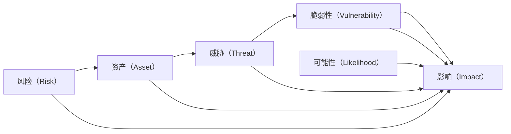

                 

# 风险管理：识别和应对潜在威胁

在信息技术飞速发展的今天，各类风险已成为企业发展道路上不可避免的挑战。从数据泄露到系统故障，从网络攻击到供应链中断，风险无处不在，影响深远。如何识别和应对这些潜在威胁，已成为现代企业必须面对的重要课题。本文将从风险管理的基本概念出发，系统梳理风险的识别、评估和应对策略，以期为读者提供全方位的风险管理指导。

## 1. 背景介绍

### 1.1 问题由来

随着信息技术在各行业的深入应用，数据和系统的安全问题愈发凸显。企业面临的风险种类繁多，涉及数据、系统、网络、物理等多个方面，其潜在影响也不尽相同。如何构建一套科学的风险管理体系，及时发现并应对各类风险，已成为一个亟待解决的问题。

### 1.2 问题核心关键点

风险管理的核心在于识别潜在的威胁，评估其对系统的影响程度，并制定有效的应对策略。具体来说，风险管理包含以下几个关键点：

1. **风险识别**：识别可能影响系统安全的所有潜在威胁。
2. **风险评估**：评估各种风险的影响程度和紧急程度，确定优先级。
3. **风险控制**：制定和实施措施，降低风险发生的可能性和影响。
4. **风险监控**：持续监测风险状态，及时调整应对策略。

以下将详细探讨这些核心点，并结合实际案例进行深入讲解。

## 2. 核心概念与联系

### 2.1 核心概念概述

在风险管理中，以下几个概念至关重要：

- **风险（Risk）**：指可能发生的事件及其对目标的影响。
- **资产（Asset）**：指企业或组织拥有或控制的任何资源，如数据、系统、设施等。
- **威胁（Threat）**：指可能对资产造成损害的行为或事件，如病毒、黑客攻击、自然灾害等。
- **脆弱性（Vulnerability）**：指资产存在的缺陷或不足，使得威胁能够成功利用。
- **影响（Impact）**：指风险事件发生后对组织的影响程度，如经济损失、声誉损害、业务中断等。
- **可能性（Likelihood）**：指风险事件发生的概率。

### 2.2 核心概念原理和架构的 Mermaid 流程图



这个流程图展示了风险管理的基本架构：风险由资产、威胁、脆弱性、影响和可能性五个要素构成，并通过风险评估工具综合评估其影响程度，最终制定风险控制措施。

## 3. 核心算法原理 & 具体操作步骤

### 3.1 算法原理概述

风险管理的核心算法通常基于概率论和统计学原理，通过评估风险的可能性（Likelihood）和影响程度（Impact），计算风险等级。常见的方法包括：

- **定量评估**：使用数学模型和统计方法，如蒙特卡洛模拟、风险矩阵等，量化风险的可能性及其影响。
- **定性评估**：利用专家知识和经验，对风险的可能性和影响进行主观评价，如SWOT分析、PEST分析等。
- **混合评估**：结合定量与定性方法，综合考虑数据和经验，进行更全面的风险评估。

### 3.2 算法步骤详解

风险管理的具体步骤包括：

1. **风险识别**：通过问卷调查、安全审计、事件记录等方式，识别潜在威胁。
2. **风险评估**：使用定量或定性方法，评估风险的可能性及其对资产的影响，确定风险等级。
3. **风险控制**：根据风险评估结果，制定和实施风险控制措施，降低风险发生的可能性和影响。
4. **风险监控**：持续监测风险状态，及时调整风险控制策略，确保系统的安全性和稳定性。

### 3.3 算法优缺点

风险管理算法具有以下优点：

- **全面性**：综合考虑资产、威胁、脆弱性、影响和可能性等多个要素，提供全面的风险评估。
- **可操作性**：通过明确的评估和控制策略，指导企业采取具体措施，降低风险。
- **灵活性**：结合定量与定性方法，适应不同类型和规模的企业需求。

同时，风险管理算法也存在一些局限性：

- **复杂性**：风险管理涉及多个要素和复杂的数据处理，操作相对复杂。
- **主观性**：定性评估依赖于专家的经验和判断，可能导致评估结果的主观偏差。
- **成本高**：风险识别和评估需要耗费大量人力和时间，特别是对大中型企业。

### 3.4 算法应用领域

风险管理不仅适用于金融、IT等高风险行业，也在各行各业中得到广泛应用，包括：

- **金融行业**：评估信贷风险、市场风险、操作风险等。
- **IT行业**：防范数据泄露、系统故障、网络攻击等。
- **制造行业**：识别供应链风险、设备故障、环境风险等。
- **医疗行业**：管理医疗数据安全、系统故障、自然灾害等。
- **政府机构**：评估网络安全、应急响应、公共安全等。

## 4. 数学模型和公式 & 详细讲解

### 4.1 数学模型构建

风险管理中的定量评估通常基于风险矩阵（Risk Matrix）模型，通过将风险的可能性（Likelihood）和影响程度（Impact）映射到二维坐标系中，计算风险等级。风险矩阵模型可以表示为：

$$
\text{Risk Level} = f(L, I)
$$

其中 $L$ 表示风险的可能性，$I$ 表示风险的影响程度，$f$ 为映射函数。

### 4.2 公式推导过程

风险矩阵的映射函数 $f$ 通常采用线性或非线性函数，用于将 $L$ 和 $I$ 映射到特定的风险等级。例如，可以使用以下线性函数：

$$
\text{Risk Level} = \frac{L \times I}{L_{\text{max}} \times I_{\text{max}}}
$$

其中 $L_{\text{max}}$ 和 $I_{\text{max}}$ 分别为可能性和影响的最大值。通过这个公式，可以将 $L$ 和 $I$ 映射到0到1之间的风险等级。

### 4.3 案例分析与讲解

假设某企业的风险矩阵如图1所示，其中 $L_{\text{max}}=1$，$I_{\text{max}}=5$。


图1 风险矩阵示例

对于风险事件A，假设其可能性为0.5，影响程度为3，则其风险等级为：

$$
\text{Risk Level} = \frac{0.5 \times 3}{1 \times 5} = 0.3
$$

根据风险矩阵，风险等级0.3对应的是高风险，企业应采取措施降低其发生的可能性和影响。

## 5. 项目实践：代码实例和详细解释说明

### 5.1 开发环境搭建

为进行风险管理系统的开发，首先需要搭建开发环境。以下是基本步骤：

1. 安装Python：从官网下载并安装Python，推荐使用3.8及以上版本。
2. 安装相关库：使用pip安装numpy、pandas、scikit-learn等库，用于数据处理和分析。
3. 准备数据集：收集企业内部和外部的风险数据，包括威胁、脆弱性、影响等信息。
4. 搭建开发环境：使用Anaconda创建虚拟环境，配置开发工具。

### 5.2 源代码详细实现

以下是一个简单的Python脚本，用于计算风险等级：

```python
import numpy as np

def calculate_risk_level(likelihood, impact, max_likelihood, max_impact):
    risk_level = (likelihood * impact) / (max_likelihood * max_impact)
    return risk_level

likelihood = 0.5
impact = 3
max_likelihood = 1
max_impact = 5

risk_level = calculate_risk_level(likelihood, impact, max_likelihood, max_impact)
print("Risk Level:", risk_level)
```

该脚本定义了一个函数`calculate_risk_level`，用于计算风险等级。函数接受可能性和影响程度作为输入，以及可能性和影响的最大值，返回风险等级。

### 5.3 代码解读与分析

这个Python脚本非常简单，仅包含一个函数和一个打印语句。通过调用`calculate_risk_level`函数，可以计算任何风险事件的风险等级。代码易于理解，适合初学者快速上手。

### 5.4 运行结果展示

运行上述代码，输出结果如下：

```
Risk Level: 0.3
```

这意味着风险事件的可能性为0.5，影响程度为3，其风险等级为0.3。根据风险矩阵，这是一个高风险事件，企业应采取措施降低其发生的可能性和影响。

## 6. 实际应用场景

### 6.1 金融行业

在金融行业，风险管理尤为重要。银行和保险公司需要定期评估信贷风险、市场风险、操作风险等，以确保资金安全和运营稳定。例如，银行可以使用风险矩阵模型，评估客户的信用风险，确定贷款审批标准。

### 6.2 医疗行业

医疗行业同样面临诸多风险，如数据泄露、设备故障、自然灾害等。医院和医疗机构可以使用风险矩阵模型，评估各种风险的可能性和影响，制定相应的应急预案。例如，医院可以通过风险矩阵模型，评估特定设备故障的风险等级，优先维护高风险设备。

### 6.3 制造业

制造业企业需要管理供应链风险、设备故障、环境风险等。例如，汽车制造企业可以使用风险矩阵模型，评估供应商交付延迟的风险等级，调整供应商选择策略，降低供应链中断的风险。

## 7. 工具和资源推荐

### 7.1 学习资源推荐

为帮助读者深入理解风险管理，以下是一些优质的学习资源：

1. 《风险管理：理论与实践》：该书系统介绍了风险管理的理论基础和实践方法，适合初学者和中级读者。
2. 《金融风险管理》：该书介绍了金融行业的风险管理方法，包括信用风险、市场风险、操作风险等。
3. 《企业风险管理》：该书涵盖了企业风险管理的多个方面，包括战略风险、财务风险、操作风险等。
4. 在线课程：如Coursera的《企业风险管理》课程，提供丰富的视频讲解和作业练习，适合自学。

### 7.2 开发工具推荐

风险管理系统的开发需要多种工具支持，以下是推荐工具：

1. Python：作为数据分析和算法开发的主要语言，Python在风险管理系统中得到广泛应用。
2. R：另一个强大的数据分析工具，适合进行复杂的统计分析和可视化。
3. SQL：用于数据管理和查询，适合处理大规模数据集。
4. Tableau：数据可视化工具，帮助生成直观的风险报告和图表。

### 7.3 相关论文推荐

风险管理的研究领域非常广泛，以下是几篇经典论文：

1. "Risk Management in Banking: A Practical Guide" by John P. Mooney。该文详细介绍了银行的风险管理方法，是金融行业从业者的必读之作。
2. "Enterprise Risk Management: A Strategic Framework" by David Gordon Gomez-Mejia。该文提出了全面的企业风险管理框架，适合企业决策者和管理者。
3. "Modeling and Analysis of Risk in Financial Systems" by David J. Echchart。该文介绍了金融系统中的风险建模和分析方法，适合学术研究者。

## 8. 总结：未来发展趋势与挑战

### 8.1 总结

本文从风险管理的基本概念出发，系统梳理了风险识别的步骤、风险评估的方法和风险控制的策略，并通过实际案例进行了详细讲解。风险管理在各行各业中具有重要意义，有助于企业识别和应对潜在威胁，确保运营稳定和安全。

### 8.2 未来发展趋势

未来，风险管理将呈现以下几个趋势：

1. **智能化**：随着人工智能和机器学习技术的发展，风险管理将更多地采用智能算法进行数据分析和风险预测。
2. **集成化**：风险管理将与其他管理系统（如ERP、CRM）集成，实现一体化管理。
3. **自动化**：自动化工具将帮助企业更快地识别和应对风险，提高风险管理的效率。
4. **实时化**：实时数据监控和分析将使得风险管理更加动态和灵活，能够及时响应变化。
5. **云化**：云计算技术将提供强大的计算和存储能力，支持企业规模化实施风险管理。

### 8.3 面临的挑战

尽管风险管理技术在不断发展，但仍然面临以下挑战：

1. **数据质量**：风险管理依赖于高质量的数据，数据缺失或不准确将影响评估结果。
2. **技术复杂性**：复杂的风险管理算法和模型需要高水平的专业知识，增加了实施难度。
3. **成本问题**：风险管理系统的开发和维护需要较高的成本，特别是对中小企业。
4. **合规性**：不同行业的合规要求不同，需要符合相关法规和标准。
5. **跨部门协作**：风险管理涉及多个部门和业务单元，需要加强跨部门协作和沟通。

### 8.4 研究展望

未来，风险管理研究将聚焦于以下几个方向：

1. **新技术的应用**：结合区块链、物联网等新技术，提升风险管理的智能化和实时化水平。
2. **多层次的风险管理**：从企业、行业、国家等多个层次，构建全方位的风险管理框架。
3. **社会化风险管理**：结合社会力量，提升公众和企业对风险的认知和应对能力。
4. **跨学科研究**：与其他学科（如心理学、社会学）结合，提升风险管理的综合性和深度。

## 9. 附录：常见问题与解答

**Q1: 风险管理是否适用于所有类型的企业？**

A: 是的，风险管理适用于所有类型的企业，无论其规模大小、行业背景如何。然而，不同行业的风险管理侧重点有所不同。例如，金融行业更注重信贷风险、市场风险，而制造业则更注重供应链风险、设备故障。

**Q2: 风险管理对企业的成本有哪些？**

A: 风险管理对企业的成本主要包括以下几个方面：

1. **人力成本**：需要专门的风险管理人员和IT人员，进行数据收集、分析和管理。
2. **技术成本**：需要购买和使用各种软件工具，如风险评估软件、数据可视化工具等。
3. **培训成本**：需要对员工进行风险管理培训，提高风险意识和应对能力。

**Q3: 企业如何建立全面的风险管理体系？**

A: 企业建立全面的风险管理体系，需要遵循以下几个步骤：

1. **风险识别**：通过问卷调查、安全审计、事件记录等方式，识别潜在威胁。
2. **风险评估**：使用定量或定性方法，评估风险的可能性及其对资产的影响，确定优先级。
3. **风险控制**：根据风险评估结果，制定和实施风险控制措施，降低风险发生的可能性和影响。
4. **风险监控**：持续监测风险状态，及时调整风险控制策略，确保系统的安全性和稳定性。
5. **风险报告**：定期生成风险报告，评估风险管理的效果，调整管理策略。

**Q4: 企业应如何应对突发事件？**

A: 企业应对突发事件，需要制定应急预案，并定期进行演练。应急预案应包括：

1. **预警机制**：建立预警系统，实时监测风险状态，及时发出预警信号。
2. **应急响应**：制定应急响应流程，明确各部门的职责和任务。
3. **资源保障**：确保应急资源的充足和可用，如应急资金、物资、设备等。
4. **演练和评估**：定期进行应急演练，评估应急预案的效果，并进行改进。

---

作者：禅与计算机程序设计艺术 / Zen and the Art of Computer Programming

