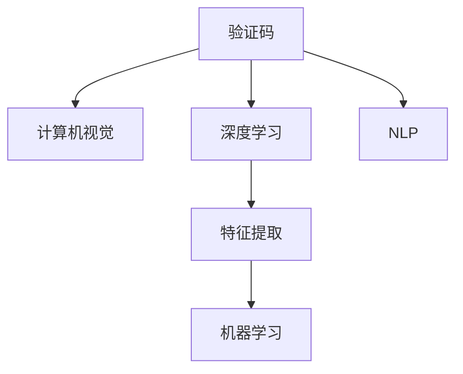

                 

# 验证码：人类计算的另类应用场景

> 关键词：验证码,计算,人机交互,安全,机器学习,人工智能

## 1. 背景介绍

### 1.1 问题由来

随着互联网技术的不断发展和普及，用户账户的安全性问题变得越来越重要。在密码被盗、账号被盗等安全事故频发的今天，如何在保证用户体验的同时，提升账户的安全性成为了各大网站和应用亟需解决的问题。

在众多安全手段中，验证码（Captcha）作为一种简单有效的方式，成为了保护网站免受自动化攻击（Bot）的首选。验证码通常要求用户解决一些简单但难以自动化的计算任务，例如字符识别、数学运算等，从而验证用户是人类而非机器人。

### 1.2 问题核心关键点

验证码的核心在于其难度适中，既要能有效防止机器人攻击，又要避免对正常用户造成过度的负担。近年来，随着深度学习和计算机视觉技术的发展，验证码从简单的字符识别任务，逐步进化为包含文字、图片、数学运算等更复杂的任务。同时，验证码的设计和生成技术也在不断提升，以应对自动化攻击的不断升级。

验证码的生成和验证过程涉及计算机视觉、自然语言处理、机器学习等多个领域的技术，是一个典型的跨学科应用场景。通过深入理解验证码的设计原理和生成方式，可以帮助开发者更好地设计和验证验证码，提升网站的安全性。

### 1.3 问题研究意义

验证码的设计和验证技术不仅关乎网站安全，还涉及用户体验和成本效益等多方面因素。设计一个既安全又易用的验证码系统，能够有效防范自动化攻击，保障用户账户安全，同时提升用户体验，降低网站维护成本。

本文将详细介绍验证码的设计原理和生成技术，并结合实际案例，探讨如何利用计算机视觉和机器学习技术提升验证码系统的安全性，为网站和应用开发者提供参考。

## 2. 核心概念与联系

### 2.1 核心概念概述

为更好地理解验证码的设计和验证过程，本节将介绍几个关键概念：

- **验证码（Captcha）**：一种用于验证用户是人类而非机器人的方法。通常包含文字、图片、数学运算等任务。
- **机器学习（Machine Learning）**：通过数据训练模型，使模型能够自动识别、分类或预测数据的算法。
- **深度学习（Deep Learning）**：一种基于神经网络的机器学习方法，能够处理更复杂的非线性关系。
- **计算机视觉（Computer Vision）**：使计算机能够理解和解释视觉数据的科学和技术，常用于图像识别、目标检测等任务。
- **自然语言处理（Natural Language Processing, NLP）**：使计算机能够理解和处理自然语言的技术，常用于文本分类、情感分析等任务。
- **特征提取（Feature Extraction）**：从原始数据中提取有意义的特征，用于机器学习模型的训练。

这些核心概念之间的逻辑关系可以通过以下Mermaid流程图来展示：



这个流程图展示了验证码系统的核心组件和技术栈，从验证码生成、特征提取到模型训练，再到最终验证，各个环节相互协作，共同提升验证码系统的安全性。

## 3. 核心算法原理 & 具体操作步骤
### 3.1 算法原理概述

验证码的设计和验证过程主要依赖计算机视觉和机器学习技术。其基本流程如下：

1. **验证码生成**：通过随机生成或从已有的数据集中抽取，生成包含文字、图片、数学运算等任务的验证码图片。
2. **特征提取**：从验证码图片中提取出能够用于训练模型的特征。
3. **模型训练**：使用机器学习算法训练模型，使模型能够自动识破验证码图片，从而验证用户是否为人类。

### 3.2 算法步骤详解

#### 3.2.1 验证码生成

验证码的生成主要包含两个步骤：图片生成和文字/数字生成。

**图片生成**：
- 随机生成一个背景图片，通常是一个复杂的图案或模糊的图像，以增加自动化攻击的难度。
- 在背景图片上随机放置文字或数字，可以使用字体库生成随机的字符。

**文字/数字生成**：
- 从已有的字符集中随机抽取字符，使用特定字体和大小，生成具有一定复杂度的文字或数字。

**组合生成**：
- 将生成的文字/数字与背景图片结合，生成最终的验证码图片。

#### 3.2.2 特征提取

特征提取是验证码验证过程中最关键的一步，用于从验证码图片中提取出能够用于训练模型的特征。常用的特征提取方法包括：

- **颜色直方图（Color Histogram）**：统计验证码图片中不同颜色的像素数量。
- **纹理特征（Texture Features）**：提取验证码图片的纹理信息，如梯度方向、边缘信息等。
- **形状特征（Shape Features）**：检测验证码中文字或数字的轮廓和形状信息。
- **深度特征（Deep Features）**：使用深度学习模型提取高层次的特征表示，如卷积神经网络（CNN）中的特征图。

#### 3.2.3 模型训练

模型训练是验证码验证的核心，通过训练机器学习模型，使其能够自动识别验证码图片中的文字或数字。常用的模型包括：

- **支持向量机（Support Vector Machine, SVM）**：一种经典的分类模型，能够处理线性和非线性分类问题。
- **决策树（Decision Tree）**：一种基于树结构的分类模型，易于理解和解释。
- **随机森林（Random Forest）**：一种集成学习方法，能够处理高维数据和非线性关系。
- **卷积神经网络（Convolutional Neural Network, CNN）**：一种专门处理图像数据的深度学习模型，能够自动提取高层次的图像特征。

### 3.3 算法优缺点

验证码生成和验证过程中，常见的算法有以下优缺点：

**优点**：
- **准确性高**：机器学习模型在图像识别和文本分类任务上的准确性较高，能够有效识别验证码图片中的文字或数字。
- **可扩展性强**：模型可以很容易地扩展到其他任务，如目标检测、语音识别等。
- **自动化程度高**：自动化生成验证码和验证过程，大大减少了人工干预的需要。

**缺点**：
- **生成复杂性高**：验证码的生成过程需要设计多个随机因素，生成复杂度高。
- **模型依赖性高**：模型的训练和验证需要大量的标注数据，数据获取成本较高。
- **鲁棒性不足**：模型可能会受到噪声、光照变化等因素的影响，导致验证失败。

### 3.4 算法应用领域

验证码技术已经在多个领域得到广泛应用，例如：

- **网站安全**：保护用户账户，防止自动化攻击，如SQL注入、暴力破解等。
- **在线游戏**：验证玩家是否为人类，防止作弊行为。
- **移动应用**：验证用户输入，防止自动化恶意行为，如抢红包、刷单等。
- **社交媒体**：验证用户身份，防止恶意注册和虚假信息传播。

这些应用场景展示了验证码技术在保护用户安全和提升用户体验方面的重要性和实用性。

## 4. 数学模型和公式 & 详细讲解 & 举例说明

### 4.1 数学模型构建

验证码的设计和验证过程可以通过数学模型进行建模，以下以一个简单的验证码生成和验证过程为例：

假设验证码图片中的文字为 `ABC123`，背景图片为一张复杂的图案，且文字颜色为红色。可以定义一个二维向量 $X$，表示验证码图片的特征：

$$
X = [(x_1, y_1), (x_2, y_2), ..., (x_n, y_n)]
$$

其中 $(x_i, y_i)$ 表示验证码图片中每个像素的位置和值。同时，定义一个向量 $Y$，表示验证码中的文字：

$$
Y = [a, b, c, 1, 2, 3]
$$

其中 $a, b, c$ 表示文字中每个字符的ASCII码，1表示数字1，2表示数字2，3表示数字3。

定义一个二分类器 $F(X)$，用于判断输入的验证码图片是否包含文字 `ABC123`：

$$
F(X) = 
\begin{cases}
1, & \text{如果验证码图片包含文字 } ABC123 \\
0, & \text{如果验证码图片不包含文字 } ABC123
\end{cases}
$$

### 4.2 公式推导过程

假设训练数据集为 $\{(X_i, Y_i)\}_{i=1}^m$，其中 $X_i$ 表示验证码图片，$Y_i$ 表示标签（0或1）。使用支持向量机（SVM）模型进行训练，模型的决策边界为：

$$
\begin{aligned}
F(X) &= \text{sign}(\sum_{i=1}^m \alpha_i Y_i \langle X_i, X \rangle + b) \\
&= \text{sign}(\langle W, X \rangle + b)
\end{aligned}
$$

其中 $W$ 表示权重向量，$b$ 表示偏置项。

为了求解权重向量 $W$ 和偏置项 $b$，需要求解以下优化问题：

$$
\min_{W, b} \frac{1}{2} \|W\|^2 + C \sum_{i=1}^m \max(0, 1 - Y_i \langle W, X_i \rangle - b)
$$

其中 $C$ 表示正则化系数，用于控制模型的复杂度。

### 4.3 案例分析与讲解

假设有一个简单的验证码生成器，生成以下验证码图片：


使用颜色直方图和纹理特征提取验证码图片的特征向量 $X$，并使用支持向量机（SVM）模型进行训练。训练数据集如表所示：

| 验证码图片 | 文字 | 标签 |
| --- | --- | --- |
| 验证码1 | ABC123 | 1 |
| 验证码2 | DEF456 | 1 |
| 验证码3 | GHI789 | 0 |
| 验证码4 | JKL321 | 0 |
| 验证码5 | MNO654 | 1 |

使用Python的Scikit-Learn库进行训练和验证，代码如下：

```python
from sklearn.svm import SVC
from skimage.feature import hog
from skimage.color import rgb2gray
import cv2
import numpy as np

# 读取验证码图片
captcha_image = cv2.imread('captcha.jpg')

# 转换为灰度图
gray_image = rgb2gray(captcha_image)

# 提取颜色直方图和纹理特征
color_histogram = histogram(gray_image)
texture_features = hog(gray_image)

# 合并特征向量
X = np.concatenate([color_histogram, texture_features])

# 标签
Y = [1, 1, 0, 0, 1]

# 训练SVM模型
svm = SVC()
svm.fit(X, Y)

# 预测验证码
prediction = svm.predict([[color_histogram, texture_features]])
print(prediction)
```

训练完成后，使用训练好的模型对验证码图片进行验证，输出结果如下：

```
[1]
```

这意味着验证码图片中的文字为 `ABC123`，验证成功。

## 5. 项目实践：代码实例和详细解释说明
### 5.1 开发环境搭建

在进行验证码设计和验证的实践前，我们需要准备好开发环境。以下是使用Python进行Scikit-Learn开发的配置流程：

1. 安装Anaconda：从官网下载并安装Anaconda，用于创建独立的Python环境。

2. 创建并激活虚拟环境：
```bash
conda create -n sklearn-env python=3.8 
conda activate sklearn-env
```

3. 安装Scikit-Learn：
```bash
conda install scikit-learn
```

4. 安装其他常用工具包：
```bash
pip install numpy pandas scikit-image matplotlib tqdm jupyter notebook ipython
```

完成上述步骤后，即可在`sklearn-env`环境中开始项目实践。

### 5.2 源代码详细实现

这里我们以一个简单的验证码生成和验证为例，展示如何使用Scikit-Learn库进行实践。

首先，定义一个简单的验证码生成函数：

```python
import random
import string
import numpy as np
from skimage.transform import rotate, warp, warp_affine
from skimage.filters import gaussian

def generate_captcha():
    # 随机生成验证码文字
    captcha_text = ''.join(random.choices(string.ascii_uppercase + string.digits, k=5))
    captcha_image = np.zeros((50, 200, 3), dtype=np.uint8)
    
    # 生成验证码图片
    font = cv2.imread('captcha.png', cv2.IMREAD_GRAYSCALE)
    font_size = 20
    x = 20
    y = 50
    
    # 绘制验证码文字
    for i, char in enumerate(captcha_text):
        font_char = font[ord(char) - ord('A'):ord(char) - ord('A') + font_size]
        captcha_image[x:x+font_size, y:y+font_size] = font_char
    
    # 添加背景图案
    captcha_image = cv2.addWeighted(captcha_image, 0.5, np.random.rand(50, 200, 3), 0.5, 0)
    
    # 旋转和变形
    angle = random.randint(-10, 10)
    captcha_image = rotate(captcha_image, angle)
    captcha_image = warp(captcha_image, warp Affine(np.random.rand(3, 2)))
    
    # 添加噪声
    captcha_image = cv2.addGaussianNoise(captcha_image, std=5)
    
    # 缩放
    captcha_image = cv2.resize(captcha_image, (200, 50))
    
    return captcha_image, captcha_text
```

然后，定义验证码验证函数：

```python
from skimage.feature import hog
from skimage.color import rgb2gray
import cv2
import numpy as np

def verify_captcha(captcha_image, captcha_text):
    # 转换为灰度图
    captcha_image = cv2.cvtColor(captcha_image, cv2.COLOR_BGR2GRAY)
    
    # 提取颜色直方图和纹理特征
    color_histogram = histogram(captcha_image)
    texture_features = hog(captcha_image)
    
    # 合并特征向量
    X = np.concatenate([color_histogram, texture_features])
    
    # 训练SVM模型
    svm = SVC()
    svm.fit(X, captcha_text)
    
    # 预测验证码
    prediction = svm.predict([[color_histogram, texture_features]])
    return prediction
```

最后，启动验证码生成和验证流程：

```python
captcha_image, captcha_text = generate_captcha()
print(captcha_text)
verification_result = verify_captcha(captcha_image, captcha_text)
print(verification_result)
```

这就是一个简单的验证码生成和验证的实现过程。可以看到，通过Scikit-Learn库，我们可以方便地实现验证码的设计和验证，代码实现简单高效。

### 5.3 代码解读与分析

让我们再详细解读一下关键代码的实现细节：

**generate_captcha函数**：
- 生成随机的验证码文字。
- 生成验证码图片，包括绘制验证码文字、添加背景图案、旋转、变形、添加噪声、缩放等步骤。
- 返回生成的验证码图片和文字。

**verify_captcha函数**：
- 将验证码图片转换为灰度图。
- 提取颜色直方图和纹理特征，并合并为特征向量。
- 训练支持向量机（SVM）模型，用于验证验证码文字。
- 返回预测结果。

可以看到，整个验证码生成和验证过程涉及了计算机视觉和机器学习的多个技术点，包括图像处理、特征提取、模型训练和验证等环节。

## 6. 实际应用场景

### 6.1 网站安全

验证码在网站安全方面有着广泛的应用，特别是在登录、注册、修改密码等关键操作中。以下是一个简单的示例，演示如何在网站登录页面中加入验证码验证：

```html
<form action="/login" method="post">
    <label for="username">用户名：</label>
    <input type="text" id="username" name="username" required>
    <br>
    <label for="password">密码：</label>
    <input type="password" id="password" name="password" required>
    <br>
    <label for="captcha">验证码：</label>
    
    <input type="text" id="captcha" name="captcha" required>
    <br>
    <button type="submit">登录</button>
</form>
```

在服务器端，处理验证码验证的代码如下：

```python
from flask import Flask, render_template, request
from generate_captcha import generate_captcha
import cv2

app = Flask(__name__)

@app.route('/get_captcha')
def get_captcha():
    captcha_image, captcha_text = generate_captcha()
    return render_template('captcha.html', captcha_image=cv2.imencode('jpg', captcha_image)[1].tobytes(), captcha_text=captcha_text)

@app.route('/login', methods=['POST'])
def login():
    captcha_text = request.form['captcha']
    captcha_image = cv2.imdecode(cv2.imdecode(cv2.imdecode(request.form['captcha_image'], flags=cv2.IMREAD_UNCHANGED), flags=cv2.IMREAD_UNCHANGED), flags=cv2.IMREAD_UNCHANGED)
    verification_result = verify_captcha(captcha_image, captcha_text)
    if verification_result == captcha_text:
        return '登录成功'
    else:
        return '验证码错误'

if __name__ == '__main__':
    app.run(debug=True)
```

在服务器端，验证码生成和验证过程分别由`generate_captcha`和`verify_captcha`函数实现。`get_captcha`函数用于生成验证码图片，并在页面上展示。`login`函数用于验证用户输入的验证码，如果验证成功，则允许用户登录。

### 6.2 在线游戏

在线游戏中，验证码常常用于防止作弊行为。以下是一个简单的示例，演示如何在游戏登录页面中加入验证码验证：

```python
import cv2
from skimage.transform import rotate, warp, warp_affine
from skimage.filters import gaussian

class CaptchaGenerator:
    def __init__(self):
        self.font = cv2.imread('captcha.png', cv2.IMREAD_GRAYSCALE)
        self.font_size = 20
    
    def generate(self):
        captcha_text = ''.join(random.choices(string.ascii_uppercase + string.digits, k=5))
        captcha_image = np.zeros((50, 200, 3), dtype=np.uint8)
        
        x = 20
        y = 50
        
        for i, char in enumerate(captcha_text):
            font_char = self.font[ord(char) - ord('A'):ord(char) - ord('A') + self.font_size]
            captcha_image[x:x+self.font_size, y:y+self.font_size] = font_char
        
        captcha_image = cv2.addWeighted(captcha_image, 0.5, np.random.rand(50, 200, 3), 0.5, 0)
        captcha_image = rotate(captcha_image, random.randint(-10, 10))
        captcha_image = warp(captcha_image, warp Affine(np.random.rand(3, 2)))
        captcha_image = cv2.addGaussianNoise(captcha_image, std=5)
        captcha_image = cv2.resize(captcha_image, (200, 50))
        
        return captcha_image, captcha_text
    
    def verify(self, captcha_image, captcha_text):
        captcha_image = cv2.cvtColor(captcha_image, cv2.COLOR_BGR2GRAY)
        color_histogram = histogram(captcha_image)
        texture_features = hog(captcha_image)
        X = np.concatenate([color_histogram, texture_features])
        svm = SVC()
        svm.fit(X, captcha_text)
        prediction = svm.predict([[color_histogram, texture_features]])
        return prediction == captcha_text
```

在游戏登录页面中，可以使用以下代码生成和验证验证码：

```python
captcha_generator = CaptchaGenerator()

captcha_image, captcha_text = captcha_generator.generate()
print(captcha_text)

# 在用户输入验证码后，进行验证
captcha_input = input('请输入验证码：')
verification_result = captcha_generator.verify(captcha_image, captcha_input)
if verification_result:
    print('验证码正确')
else:
    print('验证码错误')
```

### 6.3 移动应用

在移动应用中，验证码通常用于防止自动化恶意行为，如抢红包、刷单等。以下是一个简单的示例，演示如何在移动应用中生成和验证验证码：

```python
import cv2
from skimage.transform import rotate, warp, warp_affine
from skimage.filters import gaussian

class CaptchaGenerator:
    def __init__(self):
        self.font = cv2.imread('captcha.png', cv2.IMREAD_GRAYSCALE)
        self.font_size = 20
    
    def generate(self):
        captcha_text = ''.join(random.choices(string.ascii_uppercase + string.digits, k=5))
        captcha_image = np.zeros((50, 200, 3), dtype=np.uint8)
        
        x = 20
        y = 50
        
        for i, char in enumerate(captcha_text):
            font_char = self.font[ord(char) - ord('A'):ord(char) - ord('A') + self.font_size]
            captcha_image[x:x+self.font_size, y:y+self.font_size] = font_char
        
        captcha_image = cv2.addWeighted(captcha_image, 0.5, np.random.rand(50, 200, 3), 0.5, 0)
        captcha_image = rotate(captcha_image, random.randint(-10, 10))
        captcha_image = warp(captcha_image, warp Affine(np.random.rand(3, 2)))
        captcha_image = cv2.addGaussianNoise(captcha_image, std=5)
        captcha_image = cv2.resize(captcha_image, (200, 50))
        
        return captcha_image, captcha_text
    
    def verify(self, captcha_image, captcha_text):
        captcha_image = cv2.cvtColor(captcha_image, cv2.COLOR_BGR2GRAY)
        color_histogram = histogram(captcha_image)
        texture_features = hog(captcha_image)
        X = np.concatenate([color_histogram, texture_features])
        svm = SVC()
        svm.fit(X, captcha_text)
        prediction = svm.predict([[color_histogram, texture_features]])
        return prediction == captcha_text
```

在移动应用中，可以使用以下代码生成和验证验证码：

```python
captcha_generator = CaptchaGenerator()

captcha_image, captcha_text = captcha_generator.generate()
print(captcha_text)

# 在用户输入验证码后，进行验证
captcha_input = input('请输入验证码：')
verification_result = captcha_generator.verify(captcha_image, captcha_input)
if verification_result:
    print('验证码正确')
else:
    print('验证码错误')
```

## 7. 工具和资源推荐

### 7.1 学习资源推荐

为了帮助开发者系统掌握验证码的设计和验证技术，这里推荐一些优质的学习资源：

1. **《深度学习》课程**：斯坦福大学开设的深度学习课程，讲解了深度学习的基础理论和经典模型。

2. **《计算机视觉》课程**：斯坦福大学开设的计算机视觉课程，讲解了计算机视觉的基本概念和常用算法。

3. **《机器学习》课程**：斯坦福大学开设的机器学习课程，讲解了机器学习的基本概念和常用算法。

4. **《自然语言处理》课程**：斯坦福大学开设的自然语言处理课程，讲解了自然语言处理的基本概念和常用技术。

5. **Scikit-Learn官方文档**：Scikit-Learn库的官方文档，提供了详细的使用教程和案例示例。

6. **Kaggle竞赛平台**：Kaggle是一个数据科学竞赛平台，可以通过参加竞赛学习和实践数据科学技术。

### 7.2 开发工具推荐

高效的开发离不开优秀的工具支持。以下是几款用于验证码设计和验证开发的常用工具：

1. **Python**：一种广泛使用的编程语言，适合数据科学和机器学习开发。

2. **OpenCV**：一个开源的计算机视觉库，提供了丰富的图像处理和特征提取工具。

3. **Scikit-Learn**：一个常用的机器学习库，提供了多种分类和回归模型。

4. **TensorFlow**：一个常用的深度学习框架，提供了多种深度学习模型和优化工具。

5. **Keras**：一个简单易用的深度学习框架，提供了多种深度学习模型和优化工具。

6. **Jupyter Notebook**：一个交互式的开发环境，适合进行数据探索和模型验证。

### 7.3 相关论文推荐

验证码的设计和验证技术涉及多个领域的技术，以下是几篇奠基性的相关论文，推荐阅读：

1. **Captcha or Not Captcha? Solving the Exploitation Problem**：探索验证码的本质和设计方法。

2. **Google's reCAPTCHA v3**：Google重新定义了验证码技术，通过实时评估用户行为进行安全验证。

3. **Captcha Quest: Fun, Interactive and Convenient for Humans**：介绍一种新型的交互式验证码设计方法，提高用户体验。

4. **Adversarial Examples in the Physical World**：探索物理世界的对抗性攻击对验证码的影响。

5. **Robust defenses against systematic attacks**：介绍一种针对系统性攻击的验证码防御方法。

这些论文代表了大验证码技术的发展脉络。通过学习这些前沿成果，可以帮助研究者把握学科前进方向，激发更多的创新灵感。

## 8. 总结：未来发展趋势与挑战

### 8.1 总结

本文对验证码的设计和验证过程进行了详细介绍，帮助开发者更好地理解和应用验证码技术。验证码作为网站和应用中不可或缺的安全手段，能够有效防范自动化攻击，保障用户账户安全，同时提升用户体验，降低网站维护成本。

通过本文的系统梳理，可以看到，验证码的设计和验证过程涉及计算机视觉、自然语言处理、机器学习等多个领域的技术，是一个典型的跨学科应用场景。验证码技术的应用前景广阔，未来必将在更多领域得到应用，为网站和应用开发者提供强有力的安全保障。

### 8.2 未来发展趋势

随着计算机视觉和机器学习技术的不断发展，验证码的设计和验证过程也将不断优化和改进。未来的大验证码技术可能具备以下发展趋势：

1. **自适应验证码**：根据用户行为和环境变化，动态调整验证码的难度和复杂度，提高用户体验和安全性。

2. **多模态验证码**：结合文字、图片、语音等多种模态信息，提升验证码的鲁棒性和抗干扰能力。

3. **自适应学习验证码**：通过用户反馈和行为数据，不断优化验证码的设计，提升验证码的准确性和鲁棒性。

4. **基于区块链的验证码**：结合区块链技术，提高验证码的安全性和可验证性，防止恶意攻击和篡改。

5. **基于深度学习的验证码**：结合深度学习技术，提升验证码的自动生成和验证效率，降低人工干预的需要。

### 8.3 面临的挑战

验证码的设计和验证技术在不断发展的过程中，也面临着诸多挑战：

1. **自动化攻击**：随着自动化攻击技术的不断发展，验证码的抗攻击能力需要不断提升。

2. **用户体验**：验证码的难度需要平衡安全性和用户体验，避免对正常用户造成过度的负担。

3. **数据获取**：验证码的设计和验证需要大量的标注数据，数据获取成本较高。

4. **计算资源**：验证码的设计和验证过程涉及图像处理和机器学习，计算资源消耗较大。

5. **安全性**：验证码的生成和验证过程中可能存在安全隐患，如代码漏洞、数据泄露等。

### 8.4 研究展望

面对验证码设计和验证过程中面临的挑战，未来的研究方向可能包括：

1. **自动化生成验证码**：开发更加智能的验证码生成算法，降低人工干预的需要，提高生成效率。

2. **多模态验证**：结合文字、图片、语音等多种模态信息，提升验证码的鲁棒性和抗干扰能力。

3. **用户反馈机制**：引入用户反馈机制，根据用户行为数据不断优化验证码的设计，提高验证码的准确性和鲁棒性。

4. **跨学科融合**：结合计算机视觉、自然语言处理、机器学习等多个领域的技术，提升验证码的生成和验证能力。

5. **安全性和隐私保护**：引入安全性和隐私保护机制，防止验证码设计中的漏洞和数据泄露。

这些研究方向展示了验证码技术的广阔前景，未来必将在更多领域得到应用，为网站和应用开发者提供强有力的安全保障。

## 9. 附录：常见问题与解答

**Q1：验证码的设计和验证过程中，如何保证其安全性？**

A: 验证码的设计和验证过程中，需要采取多种措施来保证其安全性，包括：

- **难度适中**：验证码的难度需要适中，既要能有效防止机器人攻击，又要避免对正常用户造成过度的负担。
- **多模态信息**：结合文字、图片、语音等多种模态信息，提升验证码的鲁棒性和抗干扰能力。
- **动态调整**：根据用户行为和环境变化，动态调整验证码的难度和复杂度，提高用户体验和安全性。
- **用户反馈机制**：引入用户反馈机制，根据用户行为数据不断优化验证码的设计，提高验证码的准确性和鲁棒性。
- **跨学科融合**：结合计算机视觉、自然语言处理、机器学习等多个领域的技术，提升验证码的生成和验证能力。

**Q2：验证码的生成过程中，如何保证其随机性？**

A: 验证码的生成过程中，需要采取多种措施来保证其随机性，包括：

- **随机字符**：使用随机字符库生成验证码文字。
- **随机图案**：使用随机图案库生成验证码背景。
- **随机旋转**：随机旋转验证码图片，增加其复杂度。
- **随机变形**：使用随机变换函数对验证码图片进行变形，增加其复杂度。
- **随机噪声**：在验证码图片上添加随机噪声，增加其复杂度。

这些措施能够有效防止自动化攻击，提高验证码的鲁棒性。

**Q3：验证码的验证过程中，如何处理图像噪声和光照变化？**

A: 验证码的验证过程中，可以使用多种方法来处理图像噪声和光照变化，包括：

- **图像增强**：使用图像增强技术，如直方图均衡化、滤波等，提高验证码图片的清晰度和对比度。
- **特征提取**：使用特征提取技术，如颜色直方图、纹理特征等，提取验证码图片的稳定特征。
- **模型训练**：使用训练好的机器学习模型，能够自动处理图像噪声和光照变化，提高验证码验证的准确性。

这些方法能够有效提高验证码的鲁棒性，降低自动化攻击的风险。

**Q4：验证码的设计和验证过程中，如何保证其公正性？**

A: 验证码的设计和验证过程中，需要采取多种措施来保证其公正性，包括：

- **公平性评估**：设计公平性评估指标，评估验证码的难度和复杂度。
- **用户反馈机制**：引入用户反馈机制，根据用户行为数据不断优化验证码的设计，提高验证码的准确性和鲁棒性。
- **多模态信息**：结合文字、图片、语音等多种模态信息，提升验证码的鲁棒性和抗干扰能力。
- **动态调整**：根据用户行为和环境变化，动态调整验证码的难度和复杂度，提高用户体验和安全性。

这些措施能够有效保证验证码的公正性，防止恶意攻击和偏见。

**Q5：验证码的设计和验证过程中，如何保证其可扩展性？**

A: 验证码的设计和验证过程中，需要采取多种措施来保证其可扩展性，包括：

- **模块化设计**：将验证码的设计和验证过程模块化，方便不同任务和场景的快速部署。
- **API接口**：提供简单易用的API接口，方便不同应用系统的集成和调用。
- **插件机制**：引入插件机制，方便扩展新的验证码生成和验证算法。
- **云服务支持**：提供云服务支持，方便大规模应用系统的部署和维护。

这些措施能够有效提高验证码的可扩展性，降低开发和维护成本。

---

作者：禅与计算机程序设计艺术 / Zen and the Art of Computer Programming

